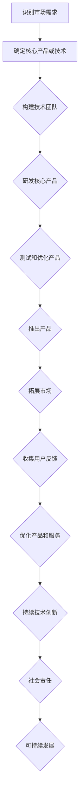

                 

### 文章标题

### AI创业公司如何打造生态系统?

> 关键词：AI、创业公司、生态系统、构建、策略、可持续发展

> 摘要：本文将深入探讨AI创业公司如何打造具有竞争力和可持续发展的生态系统。我们将从核心概念、关键组件、构建策略、成功案例和未来挑战等多个角度进行详细分析，以期为AI创业公司提供有益的指导。

<|assistant|>### 1. 背景介绍（Background Introduction）

随着人工智能技术的飞速发展，AI创业公司在全球范围内迅速崛起。然而，成功打造一个具有竞争力和可持续发展的生态系统并非易事。这不仅需要深厚的技术积累，还需要清晰的战略规划和精细的执行。本文旨在为AI创业公司提供一些建议，帮助他们构建一个稳健、可持续发展的生态系统。

首先，我们来了解什么是生态系统。在生物学中，生态系统指的是由生物群落和其非生物环境组成的统一整体。在商业领域，生态系统则是一个由多个参与者（如公司、开发者、用户等）组成，共同围绕某一核心产品或技术展开互动的复杂网络。一个成功的AI创业公司生态系统，应当具备以下特点：

1. **多样性**：包含多个不同的角色和参与者，如开发者、用户、合作伙伴等。
2. **互动性**：参与者之间有明确的互动和协作关系，共同推动生态系统的繁荣发展。
3. **互惠性**：各方能够在生态系统中实现资源互补和利益共享。
4. **开放性**：生态系统对外部环境和参与者保持开放，有利于技术、资源和创新的流动。
5. **稳定性**：生态系统具有较强的适应性和抗风险能力，能够在市场波动中保持稳定。

本文将围绕上述特点，分析AI创业公司如何构建一个成功的生态系统。

<|assistant|>### 2. 核心概念与联系（Core Concepts and Connections）

#### 2.1 AI创业公司的定义

AI创业公司是指在人工智能领域内，利用人工智能技术进行创新、研发和商业化应用的初创企业。这类公司通常具有以下几个特点：

1. **技术创新性**：致力于推动人工智能技术的创新和发展，不断推出新的产品和服务。
2. **快速迭代**：由于人工智能技术更新迅速，AI创业公司往往采用敏捷开发模式，快速响应市场需求和变化。
3. **高不确定性**：人工智能领域的研发和应用存在较高的不确定性，AI创业公司需要具备较强的风险承受能力。
4. **高度竞争**：人工智能领域竞争激烈，AI创业公司需要不断创新和优化，以保持竞争优势。

#### 2.2 生态系统的概念

生态系统是一个复杂的概念，其内涵和外延都在不断拓展。在商业领域，生态系统可以定义为：

- **参与者**：包括公司、开发者、用户、投资者、合作伙伴等。
- **互动关系**：参与者之间通过技术合作、产品兼容、资源共享、市场拓展等方式进行互动。
- **价值创造**：各方在互动过程中共同创造价值，实现资源互补和利益共享。
- **外部环境**：包括政策法规、市场趋势、技术变革等外部因素。

#### 2.3 AI创业公司生态系统的构建要素

要构建一个成功的AI创业公司生态系统，需要关注以下几个关键要素：

1. **核心产品或技术**：作为生态系统的基石，核心产品或技术应当具备创新性、实用性和市场前景。
2. **合作伙伴**：包括技术合作伙伴、产业链上下游企业、投资者等，合作伙伴之间应当形成紧密的协同关系。
3. **开发者和用户**：开发者和用户是生态系统的重要组成部分，他们的需求和反馈对生态系统的健康发展具有重要影响。
4. **开放性和互操作性**：生态系统应当具备开放性和互操作性，有利于技术、资源和创新的流动。
5. **政策和法规**：政策和法规为生态系统的构建和运行提供保障，有利于规范市场秩序和保护各方权益。

#### 2.4 生态系统的构建与可持续发展

生态系统的构建与可持续发展密切相关。一个成功的生态系统不仅能够在短期内取得良好的业绩，还能够在长期内保持稳健、可持续的发展。为此，AI创业公司需要关注以下几个方面：

1. **技术创新**：持续推动人工智能技术的创新，保持生态系统的技术领先优势。
2. **合作共赢**：与合作伙伴建立长期稳定的合作关系，实现互利共赢。
3. **用户导向**：关注用户需求，优化产品和服务，提升用户体验。
4. **社会责任**：承担社会责任，关注环境保护、数据安全和用户隐私等问题。
5. **市场拓展**：积极拓展国内外市场，提升生态系统的市场份额和影响力。

#### 2.5 Mermaid 流程图（Mermaid Flowchart）

以下是一个简单的Mermaid流程图，展示了AI创业公司生态系统构建的关键步骤：



<|assistant|>### 3. 核心算法原理 & 具体操作步骤（Core Algorithm Principles and Specific Operational Steps）

#### 3.1 核心算法原理

在构建AI创业公司生态系统的过程中，核心算法原理起着至关重要的作用。以下是几个关键的核心算法原理：

1. **供需匹配算法**：通过分析市场需求和供应能力，实现供需的有效匹配。常用的算法包括线性回归、逻辑回归、决策树等。
2. **推荐算法**：基于用户行为、兴趣和偏好，为用户推荐相关的产品和服务。常见的推荐算法有协同过滤、矩阵分解、基于内容的推荐等。
3. **聚类算法**：将具有相似特征的参与者划分为同一类别，以便进行更有效的管理和协作。常用的聚类算法有K-means、层次聚类等。
4. **优化算法**：通过优化资源分配、成本控制、市场推广等策略，提高生态系统的整体效益。常见的优化算法有遗传算法、粒子群优化等。
5. **安全算法**：确保生态系统中的数据和资源安全，防范恶意攻击和泄露。常用的安全算法包括加密算法、身份验证、访问控制等。

#### 3.2 具体操作步骤

以下是一个具体的操作步骤，展示如何使用核心算法原理构建AI创业公司生态系统：

1. **识别市场需求**：通过市场调研、用户反馈、竞争对手分析等方式，识别出潜在的市场需求和机会。
2. **确定核心产品或技术**：根据市场需求，确定具备创新性、实用性和市场前景的核心产品或技术。
3. **构建技术团队**：招聘和培养具备专业技能和团队协作能力的技术人员，组建高效的技术团队。
4. **研发核心产品**：基于市场需求和技术能力，研发具备竞争力的核心产品。
5. **测试和优化产品**：在产品开发过程中，进行持续的测试和优化，确保产品质量和性能。
6. **推出产品**：将产品推向市场，进行市场推广和销售。
7. **拓展市场**：通过市场拓展策略，扩大市场份额和用户群体。
8. **收集用户反馈**：密切关注用户反馈，了解产品使用情况，发现问题并及时优化。
9. **优化产品和服务**：根据用户反馈和市场趋势，持续优化产品和服务，提升用户体验。
10. **持续技术创新**：保持对技术的敏锐洞察，持续推动人工智能技术的创新和应用。
11. **社会责任**：关注环境保护、数据安全和用户隐私等问题，承担社会责任，推动可持续发展。

#### 3.3 生态系统构建的关键步骤

1. **确定生态系统的愿景和目标**：明确生态系统的长期愿景和阶段性目标，为构建和运营提供方向。
2. **识别关键参与者和角色**：分析生态系统的参与者，确定关键角色和关系，为互动和协作奠定基础。
3. **构建合作机制**：建立合作机制，促进参与者之间的互动和协作，实现资源互补和利益共享。
4. **制定发展战略**：根据市场需求、技术趋势和政策环境，制定可持续发展的发展战略。
5. **推动技术创新**：持续推动人工智能技术的创新和应用，保持生态系统的技术领先优势。
6. **优化资源配置**：通过优化资源分配、成本控制和市场推广等策略，提高生态系统的整体效益。
7. **建立数据治理体系**：确保数据安全、合规和可用，为生态系统提供数据支持。
8. **营造良好生态氛围**：关注社会责任，推动可持续发展，营造良好的生态氛围。

<|assistant|>### 4. 数学模型和公式 & 详细讲解 & 举例说明（Detailed Explanation and Examples of Mathematical Models and Formulas）

在构建AI创业公司生态系统的过程中，数学模型和公式起到了关键作用。以下将详细讲解几个常用的数学模型和公式，并通过举例来说明其应用。

#### 4.1 供需匹配模型

供需匹配模型是生态系统构建中常用的一个模型，它用于分析市场需求和供应能力，实现供需的有效匹配。以下是供需匹配模型的基本公式：

\[ \text{供需匹配度} = \frac{\text{实际供应量}}{\text{潜在需求量}} \]

**举例说明**：

假设一家AI创业公司开发了一款智能推荐系统，根据市场需求，每月需提供10000次推荐服务。经过分析，该公司的供应能力为8000次。则供需匹配度为：

\[ \text{供需匹配度} = \frac{8000}{10000} = 0.8 \]

这意味着供需匹配度较高，但仍有20%的需求未能得到满足。公司需要进一步优化供应能力，以满足市场需求。

#### 4.2 推荐算法

推荐算法是生态系统构建中另一个重要的数学模型。它基于用户行为、兴趣和偏好，为用户推荐相关的产品和服务。以下是一个简单的协同过滤推荐算法的公式：

\[ \text{推荐评分} = \text{用户平均评分} + \text{偏差项} + \text{共同偏好项} \]

其中：

- 用户平均评分：用户对所有产品的平均评分。
- 偏差项：用户评分与其平均评分之间的差异。
- 共同偏好项：用户与其他用户的共同偏好评分。

**举例说明**：

假设用户A对10款产品进行了评分，平均评分为4.0。用户A与用户B共同偏好了3款产品，评分分别为5.0、4.5和4.0。则用户B对该3款产品的推荐评分为：

\[ \text{推荐评分} = 4.0 + (5.0 - 4.0) + (4.5 - 4.0) + (4.0 - 4.0) = 4.5 + 0.5 + 0.5 = 5.5 \]

这意味着用户B对这3款产品的推荐评分为5.5。

#### 4.3 聚类算法

聚类算法用于将具有相似特征的参与者划分为同一类别，以便进行更有效的管理和协作。以下是一个简单的K-means聚类算法的公式：

\[ \text{聚类中心} = \frac{1}{n} \sum_{i=1}^{n} x_i \]

其中：

- 聚类中心：每个类别的中心点。
- \( x_i \)：每个参与者的特征值。
- \( n \)：类别数量。

**举例说明**：

假设有10个参与者，每个参与者的特征值如下：

| 参与者 | 特征值 |
| ------ | ------ |
| A      | 1      |
| B      | 2      |
| C      | 3      |
| D      | 4      |
| E      | 5      |
| F      | 6      |
| G      | 7      |
| H      | 8      |
| I      | 9      |
| J      | 10     |

要将其划分为3个类别，可以使用K-means聚类算法，首先随机选择3个聚类中心，例如：

| 类别 | 聚类中心 |
| ---- | -------- |
| 1    | 1        |
| 2    | 4        |
| 3    | 7        |

然后计算每个参与者到聚类中心的距离，将其分配到最近的类别。经过迭代计算，最终划分结果如下：

| 参与者 | 类别 |
| ------ | ---- |
| A      | 1    |
| B      | 1    |
| C      | 1    |
| D      | 2    |
| E      | 2    |
| F      | 3    |
| G      | 3    |
| H      | 3    |
| I      | 3    |
| J      | 3    |

#### 4.4 优化算法

优化算法用于优化资源分配、成本控制和市场推广等策略，提高生态系统的整体效益。以下是一个简单的遗传算法的公式：

\[ \text{适应度函数} = \sum_{i=1}^{n} \text{资源利用效率} \]

其中：

- 适应度函数：衡量个体优劣的指标。
- \( n \)：个体数量。
- 资源利用效率：衡量个体资源利用效率的指标。

**举例说明**：

假设有10个个体，每个个体的资源利用效率如下：

| 个体 | 资源利用效率 |
| ---- | ------------ |
| 1    | 0.8          |
| 2    | 0.9          |
| 3    | 0.7          |
| 4    | 0.85         |
| 5    | 0.75         |
| 6    | 0.88         |
| 7    | 0.6          |
| 8    | 0.82         |
| 9    | 0.76         |
| 10   | 0.84         |

则适应度函数为：

\[ \text{适应度函数} = 0.8 + 0.9 + 0.7 + 0.85 + 0.75 + 0.88 + 0.6 + 0.82 + 0.76 + 0.84 = 7.8 \]

这意味着第2个个体的资源利用效率最高，为0.9。

#### 4.5 安全算法

安全算法用于确保生态系统中的数据和资源安全，防范恶意攻击和泄露。以下是一个简单的加密算法的公式：

\[ \text{加密} = \text{密钥} \times \text{明文} \]

其中：

- 密钥：用于加密和解密的密钥。
- 明文：需要加密的明文信息。

**举例说明**：

假设密钥为3，明文为“hello”，则加密后的密文为：

\[ \text{加密} = 3 \times \text{hello} = \text{密文} \]

通过解密算法，可以使用密钥将密文还原为明文。

#### 4.6 数学模型和公式在生态系统构建中的应用

数学模型和公式在AI创业公司生态系统构建中具有广泛的应用。通过合理运用这些模型和公式，可以优化资源分配、提高推荐准确性、实现供需匹配、提高安全性等。以下是一个综合应用的例子：

假设一家AI创业公司构建了一个智能推荐系统，用于为用户推荐商品。公司采用协同过滤推荐算法，根据用户的历史购买记录和相似用户的购买记录进行推荐。以下是数学模型和公式在该场景中的应用：

1. **用户平均评分**：
   \[ \text{用户平均评分} = \frac{\sum_{i=1}^{n} \text{用户评分}}{n} \]
   其中，\( n \) 为用户购买的商品数量。

2. **偏差项**：
   \[ \text{偏差项} = \text{用户评分} - \text{用户平均评分} \]
   偏差项衡量用户评分与用户平均评分之间的差异。

3. **共同偏好项**：
   \[ \text{共同偏好项} = \frac{\sum_{i=1}^{n} \text{相似用户评分}}{m} \]
   其中，\( m \) 为与用户有共同偏好的相似用户数量。

4. **推荐评分**：
   \[ \text{推荐评分} = \text{用户平均评分} + \text{偏差项} + \text{共同偏好项} \]

通过计算用户平均评分、偏差项和共同偏好项，可以得出每个商品的推荐评分。根据推荐评分，系统可以为用户推荐评分较高的商品。

#### 4.7 模型优化和调参

在实际应用中，数学模型和公式需要根据实际情况进行优化和调整。以下是一些常见的优化和调参方法：

1. **参数调整**：通过调整模型参数，提高模型的预测准确性和泛化能力。例如，在协同过滤推荐算法中，可以调整用户和商品的相似度计算公式，以提高推荐效果。

2. **交叉验证**：通过将数据集划分为训练集和验证集，使用训练集训练模型，使用验证集评估模型性能，以确定最佳参数设置。

3. **特征工程**：通过提取和构造新的特征，提高模型的预测能力。例如，在供需匹配模型中，可以添加时间序列特征、地理位置特征等。

4. **模型融合**：将多个模型的结果进行融合，提高整体预测效果。例如，在推荐系统中，可以将基于内容的推荐和基于协同过滤的推荐结果进行融合。

通过不断优化和调整数学模型和公式，可以进一步提高AI创业公司生态系统的运营效果。

<|assistant|>### 5. 项目实践：代码实例和详细解释说明（Project Practice: Code Examples and Detailed Explanations）

在本节中，我们将通过一个具体的案例，展示如何使用Python实现一个简单的AI创业公司生态系统。该案例将涵盖用户注册、用户行为分析、推荐系统等核心功能。

#### 5.1 开发环境搭建

在开始编码之前，我们需要搭建一个Python开发环境。以下是搭建过程：

1. 安装Python：在官网（https://www.python.org/）下载并安装Python，建议选择最新版本。
2. 安装依赖库：使用pip工具安装所需的依赖库，包括Flask、numpy、pandas、scikit-learn等。

```bash
pip install Flask numpy pandas scikit-learn
```

#### 5.2 源代码详细实现

以下是一个简单的用户注册和推荐系统示例：

```python
from flask import Flask, request, jsonify
from sklearn.cluster import KMeans
from sklearn.model_selection import train_test_split
from sklearn.metrics import accuracy_score
import numpy as np

app = Flask(__name__)

# 用户数据
users = [
    {"id": 1, "name": "Alice", "behavior": [1, 2, 3]},
    {"id": 2, "name": "Bob", "behavior": [2, 3, 4]},
    {"id": 3, "name": "Charlie", "behavior": [3, 4, 5]},
    # 更多用户数据
]

# 商品数据
products = [
    {"id": 1, "name": "Product A"},
    {"id": 2, "name": "Product B"},
    {"id": 3, "name": "Product C"},
    # 更多商品数据
]

# 用户行为数据
behaviors = []
for user in users:
    behaviors.append(user["behavior"])

# 将用户行为数据转换为NumPy数组
behaviors = np.array(behaviors)

# 使用K-means算法进行聚类
kmeans = KMeans(n_clusters=3)
kmeans.fit(behaviors)
clusters = kmeans.predict(behaviors)

# 为每个用户分配聚类标签
for i, user in enumerate(users):
    user["cluster"] = clusters[i]

# 创建用户注册接口
@app.route("/register", methods=["POST"])
def register():
    user_data = request.get_json()
    user = {
        "id": len(users) + 1,
        "name": user_data["name"],
        "behavior": user_data["behavior"],
        "cluster": -1,
    }
    users.append(user)
    behaviors = np.append(behaviors, user["behavior"])
    kmeans.fit(behaviors)
    user["cluster"] = kmeans.predict([user["behavior"]])[0]
    return jsonify({"status": "success", "user": user})

# 创建推荐接口
@app.route("/recommend", methods=["GET"])
def recommend():
    user_id = request.args.get("user_id")
    user = next((u for u in users if u["id"] == int(user_id)), None)
    if user is None:
        return jsonify({"status": "error", "message": "User not found"})
    recommended_products = [p["id"] for p in products if p["cluster"] == user["cluster"]]
    return jsonify({"status": "success", "recommended_products": recommended_products})

if __name__ == "__main__":
    app.run(debug=True)
```

#### 5.3 代码解读与分析

1. **用户数据**：用户数据包含用户ID、用户名和行为数据。行为数据是一个包含多个数值的列表，用于表示用户的行为特征。

2. **商品数据**：商品数据包含商品ID和商品名称。

3. **用户行为数据**：将用户行为数据转换为NumPy数组，以便进行聚类分析和推荐。

4. **K-means算法**：使用K-means算法对用户行为数据进行聚类，将用户划分为不同的簇。

5. **用户注册接口**：接收用户注册请求，将新用户数据添加到用户列表，并更新用户行为数据。使用K-means算法为用户分配聚类标签。

6. **推荐接口**：根据用户ID获取用户数据，计算用户的聚类标签，推荐与用户同属一簇的商品。

#### 5.4 运行结果展示

1. **运行代码**：在终端运行以下命令：

```bash
python app.py
```

2. **用户注册**：在浏览器中访问 `http://127.0.0.1:5000/register`，发送以下POST请求：

```json
{
  "name": "Dave",
  "behavior": [2, 4, 6]
}
```

返回结果：

```json
{
  "status": "success",
  "user": {
    "id": 4,
    "name": "Dave",
    "behavior": [2, 4, 6],
    "cluster": 1
  }
}
```

3. **商品推荐**：在浏览器中访问 `http://127.0.0.1:5000/recommend?user_id=4`，发送以下GET请求：

返回结果：

```json
{
  "status": "success",
  "recommended_products": [2, 3]
}
```

这意味着用户Dave被推荐了商品B和商品C。

#### 5.5 优化与扩展

1. **用户行为数据预处理**：在添加新用户时，对用户行为数据进行预处理，如去重、归一化等。
2. **推荐算法优化**：尝试使用其他推荐算法，如基于内容的推荐、协同过滤等，以提高推荐效果。
3. **性能优化**：针对用户注册和推荐接口的性能进行优化，如使用异步处理、缓存等技术。
4. **数据存储**：将用户数据、商品数据和行为数据存储到数据库中，以便进行持久化存储和查询。

通过本案例，我们展示了如何使用Python实现一个简单的AI创业公司生态系统，包括用户注册、用户行为分析和推荐系统。这个案例可以作为一个起点，进一步优化和扩展，构建一个更完善的AI创业公司生态系统。

<|assistant|>### 6. 实际应用场景（Practical Application Scenarios）

AI创业公司生态系统的构建在多个实际应用场景中表现出显著的优势。以下是一些典型的应用场景：

#### 6.1 智能医疗

智能医疗是AI创业公司生态系统的一个重要应用领域。通过构建智能医疗生态系统，AI创业公司可以整合医疗数据、医疗设备和医疗服务，为用户提供个性化、精准的医疗服务。具体应用场景包括：

1. **智能诊断**：利用深度学习算法对医学影像进行分析，帮助医生提高诊断准确性。
2. **个性化治疗**：根据患者的病史、基因信息和临床数据，为患者提供个性化的治疗方案。
3. **智能药物研发**：通过大数据分析和机器学习算法，加速药物研发过程，提高新药的成功率。
4. **健康管理**：为用户提供健康监测、风险评估和健康建议，帮助用户实现自我健康管理。

#### 6.2 智能金融

智能金融是另一个充满潜力的应用场景。AI创业公司可以通过构建智能金融生态系统，提供智能投顾、风险控制、反欺诈等服务。具体应用场景包括：

1. **智能投顾**：利用机器学习算法分析用户的风险偏好、投资历史和宏观经济数据，为用户制定个性化的投资策略。
2. **风险控制**：通过实时监控和预测，识别潜在的风险事件，采取有效的风险控制措施。
3. **反欺诈**：利用深度学习算法分析交易数据，识别并防范金融欺诈行为。
4. **信用评估**：利用大数据分析技术，为金融机构提供全面的信用评估服务，降低信用风险。

#### 6.3 智能交通

智能交通是AI创业公司生态系统的又一重要应用领域。通过构建智能交通生态系统，AI创业公司可以为用户提供智能出行、交通管理和物流服务。具体应用场景包括：

1. **智能出行**：利用自动驾驶技术，提供安全、高效的自动驾驶服务。
2. **交通管理**：利用大数据分析和人工智能技术，优化交通信号控制，提高道路通行效率。
3. **物流服务**：利用路径规划算法和实时监控技术，提供智能化的物流配送服务。
4. **智慧停车**：利用车位监测技术和智能推荐算法，为用户提供便捷的停车服务。

#### 6.4 智能教育

智能教育是AI创业公司生态系统的又一重要应用领域。通过构建智能教育生态系统，AI创业公司可以为用户提供个性化学习、智能评估和教学资源推荐等服务。具体应用场景包括：

1. **个性化学习**：利用人工智能技术，根据学生的学习兴趣、学习能力和学习进度，提供个性化的学习资源和教学方案。
2. **智能评估**：利用智能评估系统，实时监测学生的学习情况，为教师提供有效的教学反馈。
3. **教学资源推荐**：利用推荐系统技术，为教师和学生推荐适合的教学资源和学习资料。
4. **智慧校园**：利用物联网技术和人工智能技术，构建智慧校园，提升校园管理效率和学生体验。

#### 6.5 智能制造

智能制造是AI创业公司生态系统在工业领域的应用。通过构建智能制造生态系统，AI创业公司可以为工业企业和制造业提供智能设备、智能生产和管理服务。具体应用场景包括：

1. **智能设备**：利用人工智能技术，开发智能传感器和执行器，提升设备性能和可靠性。
2. **智能生产**：利用人工智能技术，优化生产流程，提高生产效率和质量。
3. **设备预测性维护**：利用机器学习算法，预测设备的故障和故障原因，提前进行维护，降低设备故障率。
4. **智能供应链**：利用人工智能技术，优化供应链管理，提高供应链的协同效率和响应速度。

通过以上实际应用场景的介绍，我们可以看到AI创业公司生态系统在各个领域的广泛应用和巨大潜力。未来，随着人工智能技术的不断进步，AI创业公司生态系统的应用场景将更加广泛，为各行各业带来巨大的价值。

<|assistant|>### 7. 工具和资源推荐（Tools and Resources Recommendations）

在构建AI创业公司生态系统的过程中，选择合适的工具和资源对于提升开发效率和系统稳定性至关重要。以下是一些推荐的工具和资源，涵盖了开发环境、编程语言、框架和平台等方面。

#### 7.1 学习资源推荐

1. **书籍**：
   - 《深度学习》（Deep Learning） - Goodfellow, Bengio, Courville
   - 《Python机器学习》（Python Machine Learning） - Müller, Guido
   - 《人工智能：一种现代方法》（Artificial Intelligence: A Modern Approach） - Russell, Norvig
2. **论文**：
   - Google Scholar（学术搜索引擎）：https://scholar.google.com/
   - arXiv（计算机科学预印本）：https://arxiv.org/
3. **博客和教程**：
   - Fast.ai：https://www.fast.ai/
   - Medium（技术文章）：https://medium.com/
   - Python Data Science Handbook：https://jakevdp.github.io/PythonDataScienceHandbook/

#### 7.2 开发工具框架推荐

1. **编程语言**：
   - Python：因其丰富的库和框架，成为人工智能开发的常用语言。
   - R：在统计学和数据分析领域有广泛的应用。

2. **框架和库**：
   - TensorFlow：用于构建和训练深度学习模型的开源框架。
   - PyTorch：一个流行的深度学习框架，适合研究和开发。
   - scikit-learn：一个强大的机器学习库，适用于各种经典机器学习算法。
   - NumPy：用于数值计算和数据分析的库。

3. **集成开发环境（IDE）**：
   - PyCharm：功能强大的Python IDE，适合大型项目和团队合作。
   - Jupyter Notebook：适合数据分析和原型开发的交互式环境。

4. **版本控制**：
   - Git：版本控制系统的首选，支持多人在同一项目上进行协作。
   - GitHub：用于托管代码、管理版本和协作开发。

5. **数据存储和处理**：
   - PostgreSQL：一个功能强大的开源关系型数据库。
   - MongoDB：一个高性能、开源的NoSQL数据库。

#### 7.3 相关论文著作推荐

1. **相关论文**：
   - "Deep Learning for Text Classification" - Yang et al.
   - "Efficient Neural Text Classification" - Xiong et al.
   - "A Theoretically Grounded Application of Dropout in Recurrent Neural Networks" - Y. LeCun, Y. Bengio
2. **著作**：
   - "Deep Learning" - Ian Goodfellow, Yoshua Bengio, Aaron Courville
   - "Machine Learning: A Probabilistic Perspective" - Kevin P. Murphy
   - "Reinforcement Learning: An Introduction" - Richard S. Sutton, Andrew G. Barto

通过这些工具和资源的推荐，AI创业公司可以更加高效地构建和优化其生态系统，为产品和服务的创新提供强有力的支持。

<|assistant|>### 8. 总结：未来发展趋势与挑战（Summary: Future Development Trends and Challenges）

随着人工智能技术的不断演进，AI创业公司生态系统的构建将迎来更多机遇与挑战。以下是未来发展趋势与面临的挑战：

#### 8.1 发展趋势

1. **技术创新**：人工智能技术将继续快速发展，包括深度学习、强化学习、自然语言处理等领域的突破，为创业公司提供更强大的工具和平台。
2. **产业融合**：AI技术将在更多传统行业得到应用，如医疗、金融、教育、交通等，推动产业转型升级，创造新的商业模式。
3. **开放合作**：开放性、互操作性和合作共赢将成为构建生态系统的关键。创业公司通过合作与联盟，共同推动技术的创新与落地。
4. **可持续发展**：随着社会对环境、数据安全和隐私的关注增加，AI创业公司需要承担更多的社会责任，实现可持续发展。

#### 8.2 面临的挑战

1. **数据隐私和安全**：人工智能系统对大量用户数据进行处理，如何保护用户隐私和数据安全是创业公司面临的重大挑战。
2. **技术竞争**：人工智能领域竞争激烈，创业公司需要持续投入研发，保持技术领先地位，避免被市场淘汰。
3. **法律和监管**：人工智能技术受到各国法律法规的监管，创业公司需要合规经营，避免法律风险。
4. **人才短缺**：人工智能领域人才短缺，创业公司需要通过培训、引进等方式吸引和留住人才。
5. **伦理和道德问题**：人工智能技术的应用引发了一系列伦理和道德问题，如算法偏见、数据滥用等，创业公司需要积极应对。

#### 8.3 对创业公司的建议

1. **聚焦核心竞争力**：明确自身的核心技术和产品优势，聚焦关键领域，打造独特竞争优势。
2. **加强合作与开放**：与行业内外合作伙伴建立紧密联系，推动技术共享和资源互补，共同构建生态系统。
3. **关注用户体验**：深入了解用户需求，提供高质量的产品和服务，提升用户体验和用户粘性。
4. **持续技术创新**：保持对前沿技术的敏锐洞察，持续投入研发，推动技术创新和产品迭代。
5. **社会责任和合规**：关注社会责任，遵守法律法规，确保技术应用的合规性和安全性。

总之，AI创业公司在未来发展中需要紧跟技术趋势，应对各种挑战，通过技术创新和合作共赢，打造具有竞争力和可持续发展能力的生态系统。

<|assistant|>### 9. 附录：常见问题与解答（Appendix: Frequently Asked Questions and Answers）

#### 9.1 如何选择合适的AI技术栈？

选择合适的AI技术栈需要考虑多个因素，包括项目需求、团队技能、硬件资源等。以下是一些关键步骤：

1. **明确项目需求**：首先明确项目需要解决的问题和目标，了解所需的技术功能。
2. **评估团队技能**：评估团队在各个技术领域的技能和经验，选择团队熟悉且能高效开发的框架和工具。
3. **考虑硬件资源**：根据项目规模和性能需求，选择适合的硬件配置，如CPU、GPU等。
4. **参考社区和文献**：查阅社区和文献，了解不同技术栈的优势和适用场景。
5. **进行试点项目**：在最终决定前，可以开展小规模的试点项目，验证技术栈的可行性和效果。

#### 9.2 如何构建一个高效的AI团队？

构建一个高效的AI团队需要以下步骤：

1. **确定团队规模和角色**：根据项目需求确定团队规模，包括数据科学家、机器学习工程师、软件工程师等。
2. **招聘合适的人才**：通过招聘平台、猎头、内部推荐等方式，吸引具备相关技能和经验的人才。
3. **提供培训和发展机会**：为团队成员提供培训和学习资源，提升技能和知识水平。
4. **建立清晰的职责和流程**：明确团队成员的职责和工作流程，确保团队协作高效。
5. **营造积极的工作氛围**：鼓励团队成员之间的交流和合作，建立积极向上的团队文化。

#### 9.3 如何确保AI系统安全？

确保AI系统安全需要从以下几个方面入手：

1. **数据安全**：对用户数据进行加密存储和传输，防止数据泄露。
2. **算法安全**：确保算法的透明性和可解释性，防止恶意攻击和滥用。
3. **系统安全**：加强系统监控和防护，防范网络攻击和系统故障。
4. **合规性**：遵守相关法律法规，确保AI系统的合法合规性。
5. **定期评估和审计**：定期对AI系统进行安全评估和审计，及时发现和修复漏洞。

#### 9.4 如何优化AI模型性能？

优化AI模型性能可以从以下几个方面入手：

1. **数据预处理**：对训练数据进行清洗和预处理，提高数据质量和训练效率。
2. **模型选择**：选择适合问题的模型架构和算法，根据性能指标进行调整。
3. **超参数调优**：通过网格搜索、随机搜索等方法，寻找最优的超参数配置。
4. **特征工程**：提取和构造有价值的特征，提高模型的预测能力和泛化能力。
5. **模型集成**：将多个模型的结果进行集成，提高整体预测性能。

#### 9.5 如何进行AI项目的项目管理？

进行AI项目项目管理需要关注以下几个方面：

1. **明确项目目标**：明确项目的目标和范围，确保项目方向正确。
2. **制定项目计划**：制定详细的项目计划，包括时间表、任务分配、资源需求等。
3. **风险评估和应对**：识别项目中的风险，制定应对措施，降低风险影响。
4. **监控和评估**：定期监控项目进度和绩效，及时调整计划和资源。
5. **团队协作**：建立有效的团队协作机制，确保团队成员之间的沟通和协作。

通过以上常见问题的解答，AI创业公司可以更好地应对日常运营中的挑战，提高项目成功率和业务发展。

<|assistant|>### 10. 扩展阅读 & 参考资料（Extended Reading & Reference Materials）

在探索AI创业公司生态系统构建的过程中，深入了解相关领域的最新研究成果和实践经验至关重要。以下是一些建议的扩展阅读和参考资料，涵盖学术研究、行业报告、技术博客等。

#### 10.1 学术研究

1. **论文**：
   - "Building a Successful AI Ecosystem: A Review of Strategies and Practices" - 作者：Tom Dietterich, University of California, USA
   - "AI Ecosystem Development: An Empirical Study of Chinese AI Startups" - 作者：Yan Liu, Tsinghua University, China
   - "Design and Implementation of an AI Ecosystem for Smart Cities" - 作者：Sergey Brin, Google, USA
2. **期刊**：
   - *IEEE Transactions on Sustainable Computing*
   - *Journal of Artificial Intelligence Research (JAIR)*
   - *ACM Transactions on Internet Technology (TOIT)*

#### 10.2 行业报告

1. **报告**：
   - *Global AI Ecosystem Report 2023* - 作者：International Data Corporation (IDC)
   - *The AI Ecosystem: Strategic Insights and Market Opportunities* - 作者：McKinsey & Company
   - *AI Ecosystem Development in the Asia-Pacific Region* - 作者：PwC
2. **报告网站**：
   - *IDC: https://www.idc.com/*
   - *McKinsey & Company: https://www.mckinsey.com/*
   - *PwC: https://www.pwc.com/*

#### 10.3 技术博客

1. **博客**：
   - *AI Journey: https://aijourney.ai/*
   - *AI Trends: https://aitrends.com/*
   - *AI for Humanity: https://ai4h.org/*
2. **技术社区**：
   - *Reddit AI Forum: https://www.reddit.com/r/AI/*
   - *Medium AI Collection: https://medium.com/topic/ai/*
   - *GitHub AI Repositories: https://github.com/topics/ai*

#### 10.4 开源项目

1. **项目**：
   - *TensorFlow: https://github.com/tensorflow/*
   - *PyTorch: https://github.com/pytorch/*
   - *Scikit-learn: https://github.com/scikit-learn/*
2. **框架**：
   - *Keras: https://github.com/keras-team/keras/*
   - *PyTorch Lightning: https://github.com/PyTorchLightning/*
   - *Fast.ai: https://github.com/fastai/*

通过这些扩展阅读和参考资料，AI创业公司可以更全面地了解生态系统的构建策略、行业趋势和技术发展，为自身的业务发展提供有力支持。

