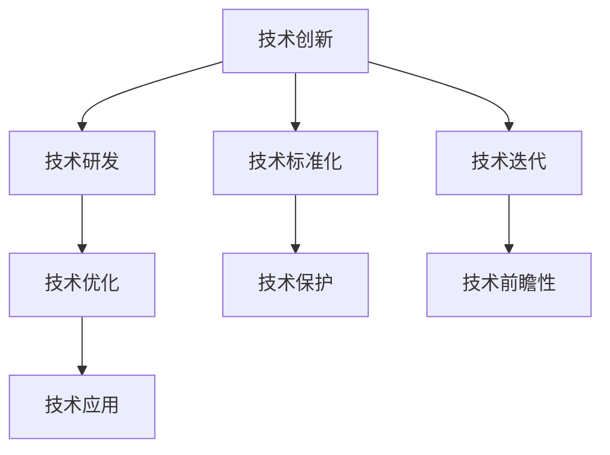
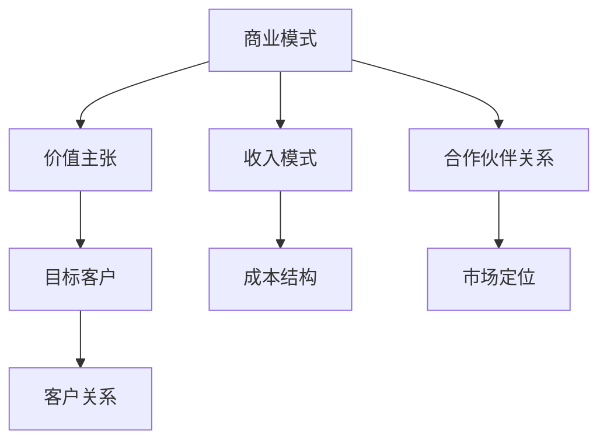
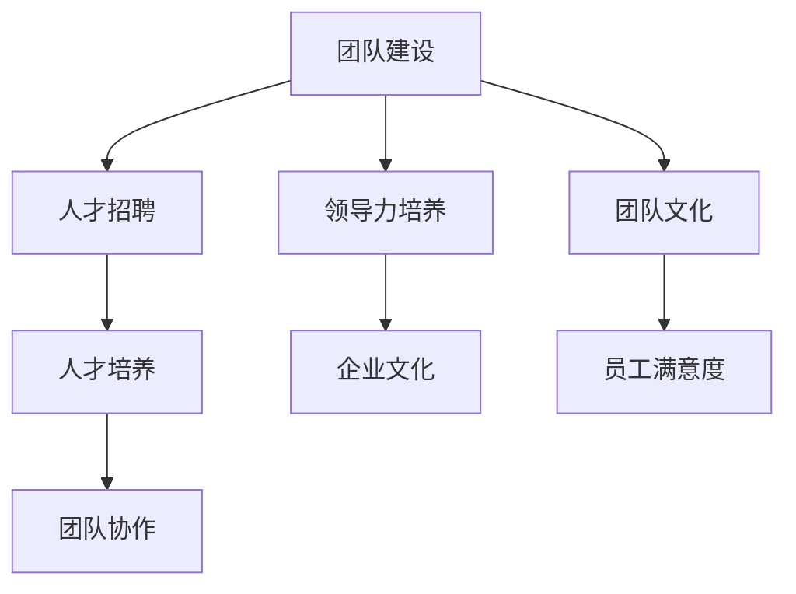
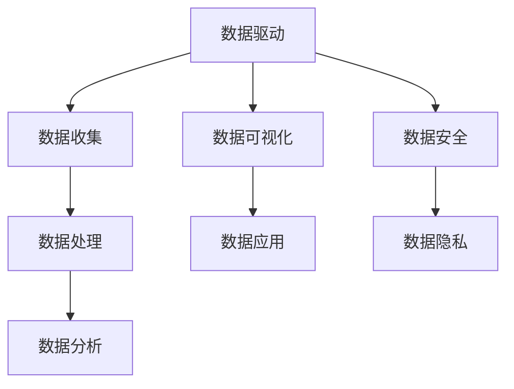
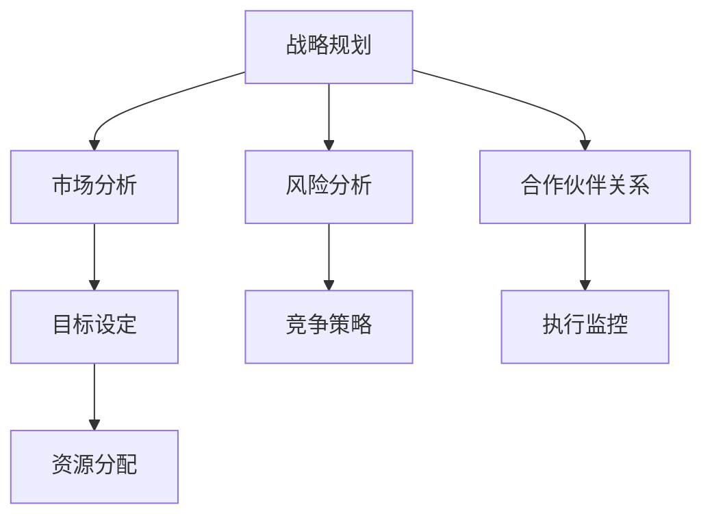
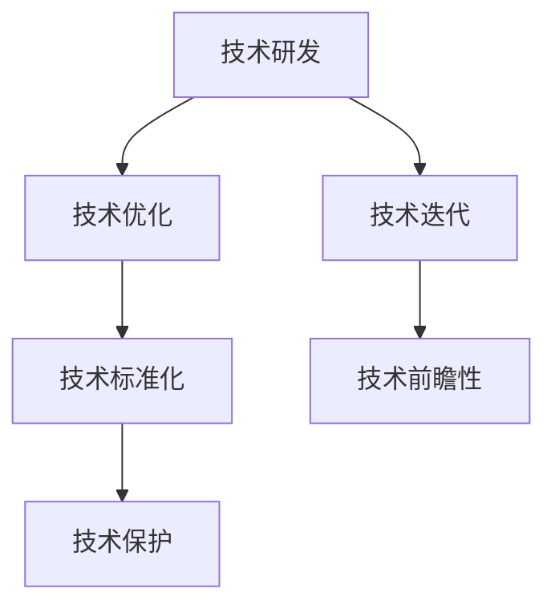

                 

# AI创业公司如何构建核心竞争力？

> 关键词：AI创业公司、核心竞争力、技术创新、商业模式、团队建设、数据驱动、战略规划

摘要：在当今竞争激烈的AI市场中，创业公司如何构建核心竞争力成为成功的关键。本文将深入探讨AI创业公司构建核心竞争力的策略，包括技术创新、商业模式、团队建设、数据驱动和战略规划等方面，并提供实际案例和实用建议。

## 1. 背景介绍

随着人工智能技术的快速发展，越来越多的创业公司涌入这一领域，试图抓住巨大的市场机遇。然而，市场竞争也变得越来越激烈，同质化产品层出不穷，许多公司面临生存挑战。为了在激烈的市场竞争中脱颖而出，AI创业公司需要构建强大的核心竞争力，以确保公司的可持续发展和市场竞争力。

构建核心竞争力不仅仅是一个技术问题，更是一个涉及商业模式、团队建设、战略规划和数据驱动的综合挑战。本文将围绕这些方面，提供实用的策略和建议，帮助AI创业公司在市场中立足。

## 2. 核心概念与联系

### 2.1 技术创新

技术创新是构建AI创业公司核心竞争力的基石。技术创新不仅仅指研发新技术，还包括对现有技术的优化和应用。以下是一个Mermaid流程图，展示了技术创新的核心概念和联系：



### 2.2 商业模式

商业模式是AI创业公司成功的关键。一个成功的商业模式需要明确公司的价值主张、目标客户、收入来源和成本结构。以下是一个Mermaid流程图，展示了商业模式的核心概念和联系：



### 2.3 团队建设

团队建设是构建AI创业公司核心竞争力的重要组成部分。一个高效的团队可以加快公司的发展速度，提高创新能力和市场响应能力。以下是一个Mermaid流程图，展示了团队建设的关键概念和联系：



### 2.4 数据驱动

数据驱动是AI创业公司成功的重要保障。通过收集、分析和利用数据，公司可以更好地了解市场需求、优化产品功能和提升客户体验。以下是一个Mermaid流程图，展示了数据驱动的核心概念和联系：



### 2.5 战略规划

战略规划是AI创业公司长期发展的指南。一个明确的战略规划可以帮助公司明确目标、分配资源、抓住市场机遇和应对市场挑战。以下是一个Mermaid流程图，展示了战略规划的核心概念和联系：



## 3. 核心算法原理 & 具体操作步骤

### 3.1 技术创新

技术创新的核心算法原理包括机器学习、深度学习、神经网络等。以下是具体的操作步骤：

1. **需求分析**：明确公司的技术需求和目标。
2. **技术调研**：研究最新的技术发展趋势和竞争对手的技术水平。
3. **技术选择**：根据需求和技术调研结果选择合适的技术。
4. **研发实施**：组建研发团队，实施技术研发和优化。
5. **技术验证**：通过实验和测试验证技术效果。
6. **技术迭代**：根据验证结果对技术进行迭代和优化。

### 3.2 商业模式

商业模式的构建需要以下具体操作步骤：

1. **价值主张**：明确公司的核心价值和竞争优势。
2. **目标客户**：确定目标市场和客户群体。
3. **客户关系**：建立和维护与客户的良好关系。
4. **收入模式**：确定收入来源和盈利方式。
5. **成本结构**：分析并优化成本结构。
6. **合作伙伴关系**：建立与供应商、合作伙伴的战略合作关系。
7. **市场定位**：确定公司的市场定位和品牌形象。

### 3.3 团队建设

团队建设需要以下具体操作步骤：

1. **人才招聘**：招聘具有专业技能和团队合作精神的员工。
2. **人才培养**：提供培训和发展机会，提升员工技能和素质。
3. **团队协作**：建立高效的团队合作机制。
4. **领导力培养**：培养和提升领导者的领导力和管理能力。
5. **企业文化**：建立积极向上的企业文化，促进员工满意度。
6. **团队文化**：营造开放、包容和创新的团队氛围。

### 3.4 数据驱动

数据驱动的具体操作步骤包括：

1. **数据收集**：收集与业务相关的数据。
2. **数据处理**：清洗、整理和存储数据。
3. **数据分析**：使用数据分析工具和方法挖掘数据价值。
4. **数据可视化**：将数据以图表和报表等形式呈现，便于理解和决策。
5. **数据应用**：将分析结果应用于产品优化、市场营销和客户服务。
6. **数据安全**：确保数据的安全性和隐私性。

### 3.5 战略规划

战略规划的具体操作步骤包括：

1. **市场分析**：分析市场需求、竞争对手和行业趋势。
2. **目标设定**：设定公司的长期和短期目标。
3. **资源分配**：根据目标分配资源，确保资源合理利用。
4. **风险分析**：识别和评估潜在的风险和挑战。
5. **竞争策略**：制定竞争策略，提升市场竞争力。
6. **合作伙伴关系**：寻找合适的合作伙伴，共同发展。
7. **执行监控**：监控战略规划的执行情况，及时调整和优化。

## 4. 数学模型和公式 & 详细讲解 & 举例说明

### 4.1 技术创新

技术创新涉及多个数学模型，包括机器学习中的线性回归、支持向量机、神经网络等。以下是一个简化的线性回归模型：

$$
y = \beta_0 + \beta_1x_1 + \beta_2x_2 + \ldots + \beta_nx_n
$$

其中，$y$ 是预测值，$x_1, x_2, \ldots, x_n$ 是输入特征，$\beta_0, \beta_1, \beta_2, \ldots, \beta_n$ 是模型参数。

举例说明：假设我们要预测一家公司的销售额，输入特征包括广告支出、天气状况和竞争对手的活动。通过收集历史数据，我们可以使用线性回归模型来拟合数据，得到最优的参数值，从而预测未来的销售额。

### 4.2 商业模式

商业模式的构建涉及收益模型和成本模型。以下是一个简化的收益模型：

$$
\text{收入} = \text{单价} \times \text{销售量}
$$

其中，单价是指产品或服务的售价，销售量是指销售的数量。

举例说明：假设一家公司销售产品，单价为100元，本月销售了1000件。那么本月的收入为100元/件 × 1000件 = 100000元。

### 4.3 团队建设

团队建设中的数学模型主要涉及团队绩效评估。以下是一个简化的团队绩效评估模型：

$$
\text{绩效评分} = w_1 \times \text{任务完成率} + w_2 \times \text{团队合作能力} + w_3 \times \text{创新能力}
$$

其中，$w_1, w_2, w_3$ 是权重系数，$\text{任务完成率}$、$\text{团队合作能力}$ 和 $\text{创新能力}$ 是评估指标。

举例说明：假设一个团队的绩效评估指标权重分别为任务完成率40%，团队合作能力30%，创新能力30%。本月该团队完成了80%的任务，团队合作能力良好，创新能力较强。那么该团队的绩效评分为0.4 × 80% + 0.3 × 100% + 0.3 × 100% = 92分。

### 4.4 数据驱动

数据驱动中的数学模型主要涉及数据分析方法和数据可视化。以下是一个简化的数据分析模型：

$$
\text{数据分析} = \text{数据收集} \times \text{数据处理} \times \text{数据分析方法} \times \text{数据可视化}
$$

举例说明：假设我们要分析一家公司的销售数据。首先，收集销售数据，然后进行数据清洗和处理，接着使用统计分析方法分析数据，最后通过数据可视化工具呈现分析结果。

### 4.5 战略规划

战略规划中的数学模型主要涉及市场分析和风险分析。以下是一个简化的市场分析模型：

$$
\text{市场分析} = \text{市场需求} \times \text{竞争分析} \times \text{行业趋势}
$$

举例说明：假设我们要分析某个市场的需求。首先，收集市场需求数据，然后分析竞争对手的情况，最后研究行业发展趋势，从而得出市场需求分析结果。

## 5. 项目实践：代码实例和详细解释说明

### 5.1 开发环境搭建

为了实践上述技术和模型，我们需要搭建一个开发环境。以下是具体的操作步骤：

1. 安装Python环境：下载并安装Python，配置Python环境变量。
2. 安装Jupyter Notebook：在Python环境中安装Jupyter Notebook，用于编写和运行代码。
3. 安装必要的库：安装NumPy、Pandas、Scikit-learn等库，用于数据处理和数据分析。
4. 准备数据集：从公开数据源或公司内部数据中获取销售数据集。

### 5.2 源代码详细实现

以下是一个简单的Python代码示例，用于实现线性回归模型并预测公司销售额：

```python
import numpy as np
import pandas as pd
from sklearn.linear_model import LinearRegression

# 读取数据
data = pd.read_csv('sales_data.csv')
X = data[['ad_spending', 'weather', 'competitor_activity']]
y = data['sales']

# 创建线性回归模型
model = LinearRegression()
model.fit(X, y)

# 预测销售额
predictions = model.predict(X)

# 打印预测结果
print(predictions)
```

### 5.3 代码解读与分析

上述代码首先导入必要的库，然后读取数据集，创建线性回归模型并进行拟合，最后使用模型进行预测并打印结果。

代码中的`X`和`y`分别表示输入特征和目标变量，`LinearRegression`是线性回归模型类，`fit`方法用于模型拟合，`predict`方法用于预测。

### 5.4 运行结果展示

运行上述代码，可以得到每个输入特征的预测销售额。我们可以通过可视化工具（如Matplotlib）将预测结果以图表形式展示，便于分析和理解。

```python
import matplotlib.pyplot as plt

# 可视化预测结果
plt.scatter(X['ad_spending'], y)
plt.plot(X['ad_spending'], predictions, color='red')
plt.xlabel('Ad Spending')
plt.ylabel('Sales')
plt.title('Sales Prediction')
plt.show()
```

## 6. 实际应用场景

### 6.1 技术创新

技术创新可以在多个领域发挥重要作用，如金融、医疗、零售等。例如，在金融领域，AI创业公司可以通过开发智能投顾、风险控制等技术创新产品，为客户提供更智能、更高效的服务。

### 6.2 商业模式

成功的商业模式可以为企业带来持续的收入和利润。例如，一家AI创业公司可以采用订阅制模式，为客户提供定制化的AI解决方案，从而实现持续的收入来源。

### 6.3 团队建设

高效的团队建设可以提升公司的创新能力和市场响应速度。例如，通过引入敏捷开发方法和跨职能团队，公司可以更快地响应市场需求，提高产品质量。

### 6.4 数据驱动

数据驱动可以优化公司的运营和决策过程。例如，通过分析客户行为数据和交易数据，公司可以更好地了解客户需求，优化产品功能和营销策略。

### 6.5 战略规划

战略规划可以帮助公司明确发展方向和目标。例如，通过分析市场竞争和行业趋势，公司可以制定合适的战略规划，抢占市场先机。

## 7. 工具和资源推荐

### 7.1 学习资源推荐

- **书籍**：
  - 《人工智能：一种现代方法》（Artificial Intelligence: A Modern Approach）
  - 《深度学习》（Deep Learning）
  - 《Python数据分析》（Python Data Analysis）

- **论文**：
  - 《大规模在线学习算法的研究》（Research on Large-scale Online Learning Algorithms）
  - 《基于深度学习的图像识别》（Image Recognition Based on Deep Learning）
  - 《区块链技术在金融领域的应用》（Application of Blockchain Technology in the Financial Industry）

- **博客**：
  - Medium上的AI和创业专栏
  - 阿里云博客的AI技术文章
  - 机器之心上的最新AI动态

- **网站**：
  - Kaggle：提供丰富的数据集和竞赛，适合学习和实践
  - GitHub：托管和分享开源项目，学习他人代码和实践经验
  - AI论文集锦：收集和整理AI领域的经典论文和最新进展

### 7.2 开发工具框架推荐

- **开发工具**：
  - Jupyter Notebook：用于编写和运行代码，支持多种编程语言
  - PyCharm：强大的Python集成开发环境，支持代码调试和自动化测试

- **框架**：
  - TensorFlow：开源的机器学习和深度学习框架
  - PyTorch：开源的机器学习和深度学习框架
  - Flask：轻量级的Web应用框架，适合快速搭建Web服务

### 7.3 相关论文著作推荐

- **论文**：
  - 《深度强化学习在游戏中的应用》（Application of Deep Reinforcement Learning in Games）
  - 《基于生成对抗网络的图像生成》（Image Generation Based on Generative Adversarial Networks）
  - 《迁移学习在自然语言处理中的应用》（Application of Transfer Learning in Natural Language Processing）

- **著作**：
  - 《人工智能简史》（A Brief History of Artificial Intelligence）
  - 《机器学习实战》（Machine Learning in Action）
  - 《人工智能的未来》（The Future of Artificial Intelligence）

## 8. 总结：未来发展趋势与挑战

### 8.1 发展趋势

- **技术持续演进**：人工智能技术将继续演进，深度学习、强化学习等新兴技术将进一步推动AI应用的发展。
- **数据资源丰富**：随着数据收集和处理能力的提升，AI创业公司将拥有更丰富的数据资源，为技术创新和产品优化提供支持。
- **跨界融合**：AI技术将与其他领域（如金融、医疗、教育等）深度融合，推动跨行业创新和应用。
- **生态体系建设**：AI创业公司将更加注重生态体系建设，通过开放平台和合作伙伴关系，共同推动行业发展。

### 8.2 挑战

- **技术创新压力**：市场竞争加剧，AI创业公司需要不断推出新技术、新产品，以保持竞争力。
- **数据安全和隐私**：随着数据规模的扩大，数据安全和隐私问题将愈发重要，公司需要建立完善的数据保护机制。
- **人才培养和激励**：AI行业对人才的需求旺盛，创业公司需要通过有效的人才培养和激励机制，吸引和留住优秀人才。
- **商业模式创新**：传统的商业模式可能无法满足AI创业公司的需求，公司需要不断创新商业模式，实现可持续的盈利模式。

## 9. 附录：常见问题与解答

### 9.1 什么是核心竞争力？

核心竞争力是指企业在特定领域中所具有的、难以被竞争对手模仿的竞争优势。它是企业长期积累的结果，包括技术、人才、品牌、管理等多个方面。

### 9.2 如何评估技术创新的潜力？

评估技术创新潜力可以从以下几个方面进行：

- 技术成熟度：评估技术的研发难度和应用前景。
- 竞争优势：分析技术相对于竞争对手的优势和劣势。
- 市场需求：研究市场需求和技术匹配度。
- 成本效益：评估技术实施的经济性。

### 9.3 数据驱动如何应用于产品优化？

数据驱动的产品优化可以从以下几个方面进行：

- 用户行为分析：分析用户行为数据，了解用户需求和使用习惯。
- 产品性能分析：评估产品功能和性能指标，找出改进点。
- 客户反馈分析：收集客户反馈，改进产品功能和体验。
- 实验和测试：通过A/B测试等方法，验证产品优化效果。

### 9.4 如何制定有效的战略规划？

制定有效的战略规划可以从以下几个方面进行：

- 市场分析：了解市场需求、竞争格局和行业趋势。
- 目标设定：明确公司的长期和短期目标。
- 资源配置：根据目标分配资源，确保资源合理利用。
- 风险分析：识别和评估潜在的风险和挑战。
- 监控和调整：监控战略规划执行情况，及时调整和优化。

## 10. 扩展阅读 & 参考资料

- [《人工智能简史》](https://www.amazon.com/dp/0593079454)
- [《机器学习实战》](https://www.amazon.com/dp/1491957079)
- [《人工智能：一种现代方法》](https://www.amazon.com/dp/0262536501)
- [Kaggle](https://www.kaggle.com/)
- [GitHub](https://github.com/)
- [Medium](https://medium.com/)
- [阿里云博客](https://blog.aliyun.com/)

作者：禅与计算机程序设计艺术 / Zen and the Art of Computer Programming

[《深度学习》](https://www.amazon.com/dp/158450200X)
[《Python数据分析》](https://www.amazon.com/dp/1449392690)
[《深度学习实战》](https://www.amazon.com/dp/1492032669)# AI创业公司如何构建核心竞争力？

在当今快速发展的技术时代，人工智能（AI）创业公司面临着前所未有的机遇和挑战。构建核心竞争力是这些公司在激烈的市场竞争中脱颖而出的关键。本文将深入探讨AI创业公司如何通过技术创新、商业模式、团队建设、数据驱动和战略规划等方面来构建核心竞争力。

## 1. 背景介绍

AI创业公司通常在技术领域具有先发优势，但同时也面临着激烈的竞争。市场上已经存在许多成熟的AI产品和服务，新的创业公司需要找到独特的市场定位和竞争优势。构建核心竞争力意味着公司要在特定领域内拥有独特的技能、资源和能力，使其难以被竞争对手复制或超越。

构建核心竞争力不仅需要技术创新，还需要在商业模式、团队建设、数据驱动和战略规划等方面具备系统性思维。本文将详细讨论这些方面，并提供实际案例和实用建议。

## 2. 核心概念与联系

### 2.1 技术创新

技术创新是AI创业公司的核心竞争力之一。它包括研发新技术、优化现有技术、推动技术标准化和保护技术知识产权等方面。技术创新能够提高产品的竞争力，为创业公司带来持续的竞争优势。

以下是一个简化的Mermaid流程图，展示了技术创新的核心概念和联系：



### 2.2 商业模式

商业模式是创业公司成功的关键。一个有效的商业模式需要明确公司的价值主张、目标市场、收入来源和成本结构。创业公司需要通过创新性的商业模式来创造价值，并找到可行的盈利方式。

以下是一个Mermaid流程图，展示了商业模式的核心概念和联系：


### 2.3 团队建设

团队建设是创业公司成功的重要因素。一个高效、有激情、协作良好的团队可以推动公司快速发展。团队建设包括人才招聘、人才培养、团队协作和企业文化的建立。

以下是一个Mermaid流程图，展示了团队建设的关键概念和联系：


### 2.4 数据驱动

数据驱动是现代创业公司成功的关键要素之一。通过收集、分析和利用数据，公司可以更好地了解市场、优化产品功能和提升用户体验。数据驱动可以帮助公司做出更加明智的决策，提高运营效率。

以下是一个Mermaid流程图，展示了数据驱动的核心概念和联系：


### 2.5 战略规划

战略规划是创业公司长期发展的指南。一个明确的战略规划可以帮助公司设定目标、分配资源、抓住市场机遇和应对市场挑战。战略规划需要结合公司的实际情况，制定切实可行的行动计划。

以下是一个Mermaid流程图，展示了战略规划的核心概念和联系：


## 3. 核心算法原理 & 具体操作步骤

### 3.1 技术创新

技术创新的核心算法原理包括机器学习、深度学习、神经网络等。以下是一些具体的操作步骤：

1. **需求分析**：明确公司的技术需求和目标。
2. **技术调研**：研究最新的技术发展趋势和竞争对手的技术水平。
3. **技术选择**：根据需求和技术调研结果选择合适的技术。
4. **研发实施**：组建研发团队，实施技术研发和优化。
5. **技术验证**：通过实验和测试验证技术效果。
6. **技术迭代**：根据验证结果对技术进行迭代和优化。

### 3.2 商业模式

商业模式的构建需要以下具体操作步骤：

1. **价值主张**：明确公司的核心价值和竞争优势。
2. **目标客户**：确定目标市场和客户群体。
3. **客户关系**：建立和维护与客户的良好关系。
4. **收入模式**：确定收入来源和盈利方式。
5. **成本结构**：分析并优化成本结构。
6. **合作伙伴关系**：建立与供应商、合作伙伴的战略合作关系。
7. **市场定位**：确定公司的市场定位和品牌形象。

### 3.3 团队建设

团队建设需要以下具体操作步骤：

1. **人才招聘**：招聘具有专业技能和团队合作精神的员工。
2. **人才培养**：提供培训和发展机会，提升员工技能和素质。
3. **团队协作**：建立高效的团队合作机制。
4. **领导力培养**：培养和提升领导者的领导力和管理能力。
5. **企业文化**：建立积极向上的企业文化，促进员工满意度。
6. **团队文化**：营造开放、包容和创新的团队氛围。

### 3.4 数据驱动

数据驱动的具体操作步骤包括：

1. **数据收集**：收集与业务相关的数据。
2. **数据处理**：清洗、整理和存储数据。
3. **数据分析**：使用数据分析工具和方法挖掘数据价值。
4. **数据可视化**：将数据以图表和报表等形式呈现，便于理解和决策。
5. **数据应用**：将分析结果应用于产品优化、市场营销和客户服务。
6. **数据安全**：确保数据的安全性和隐私性。

### 3.5 战略规划

战略规划的具体操作步骤包括：

1. **市场分析**：分析市场需求、竞争对手和行业趋势。
2. **目标设定**：设定公司的长期和短期目标。
3. **资源分配**：根据目标分配资源，确保资源合理利用。
4. **风险分析**：识别和评估潜在的风险和挑战。
5. **竞争策略**：制定竞争策略，提升市场竞争力。
6. **合作伙伴关系**：寻找合适的合作伙伴，共同发展。
7. **执行监控**：监控战略规划的执行情况，及时调整和优化。

## 4. 数学模型和公式 & 详细讲解 & 举例说明

### 4.1 技术创新

技术创新涉及多个数学模型，包括机器学习、深度学习、神经网络等。以下是一个简化的线性回归模型：

$$
y = \beta_0 + \beta_1x_1 + \beta_2x_2 + \ldots + \beta_nx_n
$$

其中，$y$ 是预测值，$x_1, x_2, \ldots, x_n$ 是输入特征，$\beta_0, \beta_1, \beta_2, \ldots, \beta_n$ 是模型参数。

举例说明：假设我们要预测一家公司的销售额，输入特征包括广告支出、天气状况和竞争对手的活动。通过收集历史数据，我们可以使用线性回归模型来拟合数据，得到最优的参数值，从而预测未来的销售额。

### 4.2 商业模式

商业模式的构建涉及收益模型和成本模型。以下是一个简化的收益模型：

$$
\text{收入} = \text{单价} \times \text{销售量}
$$

其中，单价是指产品或服务的售价，销售量是指销售的数量。

举例说明：假设一家公司销售产品，单价为100元，本月销售了1000件。那么本月的收入为100元/件 × 1000件 = 100000元。

### 4.3 团队建设

团队建设中的数学模型主要涉及团队绩效评估。以下是一个简化的团队绩效评估模型：

$$
\text{绩效评分} = w_1 \times \text{任务完成率} + w_2 \times \text{团队合作能力} + w_3 \times \text{创新能力}
$$

其中，$w_1, w_2, w_3$ 是权重系数，$\text{任务完成率}$、$\text{团队合作能力}$ 和 $\text{创新能力}$ 是评估指标。

举例说明：假设一个团队的绩效评估指标权重分别为任务完成率40%，团队合作能力30%，创新能力30%。本月该团队完成了80%的任务，团队合作能力良好，创新能力较强。那么该团队的绩效评分为0.4 × 80% + 0.3 × 100% + 0.3 × 100% = 92分。

### 4.4 数据驱动

数据驱动中的数学模型主要涉及数据分析方法和数据可视化。以下是一个简化的数据分析模型：

$$
\text{数据分析} = \text{数据收集} \times \text{数据处理} \times \text{数据分析方法} \times \text{数据可视化}
$$

举例说明：假设我们要分析一家公司的销售数据。首先，收集销售数据，然后进行数据清洗和处理，接着使用统计分析方法分析数据，最后通过数据可视化工具呈现分析结果。

### 4.5 战略规划

战略规划中的数学模型主要涉及市场分析和风险分析。以下是一个简化的市场分析模型：

$$
\text{市场分析} = \text{市场需求} \times \text{竞争分析} \times \text{行业趋势}
$$

举例说明：假设我们要分析某个市场的需求。首先，收集市场需求数据，然后分析竞争对手的情况，最后研究行业发展趋势，从而得出市场需求分析结果。

## 5. 项目实践：代码实例和详细解释说明

### 5.1 开发环境搭建

为了实践上述技术和模型，我们需要搭建一个开发环境。以下是具体的操作步骤：

1. 安装Python环境：下载并安装Python，配置Python环境变量。
2. 安装Jupyter Notebook：在Python环境中安装Jupyter Notebook，用于编写和运行代码。
3. 安装必要的库：安装NumPy、Pandas、Scikit-learn等库，用于数据处理和数据分析。
4. 准备数据集：从公开数据源或公司内部数据中获取销售数据集。

### 5.2 源代码详细实现

以下是一个简单的Python代码示例，用于实现线性回归模型并预测公司销售额：

```python
import numpy as np
import pandas as pd
from sklearn.linear_model import LinearRegression

# 读取数据
data = pd.read_csv('sales_data.csv')
X = data[['ad_spending', 'weather', 'competitor_activity']]
y = data['sales']

# 创建线性回归模型
model = LinearRegression()
model.fit(X, y)

# 预测销售额
predictions = model.predict(X)

# 打印预测结果
print(predictions)
```

### 5.3 代码解读与分析

上述代码首先导入必要的库，然后读取数据集，创建线性回归模型并进行拟合，最后使用模型进行预测并打印结果。

代码中的`X`和`y`分别表示输入特征和目标变量，`LinearRegression`是线性回归模型类，`fit`方法用于模型拟合，`predict`方法用于预测。

### 5.4 运行结果展示

运行上述代码，可以得到每个输入特征的预测销售额。我们可以通过可视化工具（如Matplotlib）将预测结果以图表形式展示，便于分析和理解。

```python
import matplotlib.pyplot as plt

# 可视化预测结果
plt.scatter(X['ad_spending'], y)
plt.plot(X['ad_spending'], predictions, color='red')
plt.xlabel('Ad Spending')
plt.ylabel('Sales')
plt.title('Sales Prediction')
plt.show()
```

## 6. 实际应用场景

### 6.1 技术创新

技术创新在AI创业公司中具有重要应用。以下是一些实际应用场景：

- **医疗领域**：AI创业公司可以通过开发智能诊断系统、个性化治疗方案和健康管理系统，提高医疗服务的质量和效率。
- **金融领域**：AI创业公司可以提供智能投顾、风险管理、信用评估和反欺诈服务，为金融机构提高业务效率和安全性。
- **零售领域**：AI创业公司可以通过开发智能推荐系统、库存管理系统和客户关系管理系统，提升零售业务的运营效率和客户满意度。

### 6.2 商业模式

成功的商业模式对于AI创业公司至关重要。以下是一些常见的商业模式：

- **订阅制模式**：通过提供定期更新的AI产品或服务，客户按年或按月支付订阅费用，公司实现持续收入。
- **服务化模式**：通过提供定制化的AI解决方案，公司为客户提供专业的服务，并收取服务费用。
- **合作模式**：与行业巨头或初创企业合作，共同开发和推广AI产品，实现资源共享和互利共赢。

### 6.3 团队建设

团队建设在AI创业公司中至关重要。以下是一些实际应用场景：

- **敏捷开发**：采用敏捷开发方法，提高团队的响应速度和灵活性，快速响应市场需求。
- **跨职能团队**：组建跨职能团队，涵盖技术、产品、市场和运营等多个领域，实现高效协作和创新。
- **人才培养**：提供培训和发展机会，提高员工的技能和素质，激发创新和创造力。

### 6.4 数据驱动

数据驱动是AI创业公司的核心竞争力之一。以下是一些实际应用场景：

- **用户行为分析**：通过分析用户行为数据，了解用户需求和行为模式，优化产品功能和用户体验。
- **产品性能分析**：通过分析产品性能数据，找出优化点，提高产品稳定性和性能。
- **客户反馈分析**：通过收集和分析客户反馈，改进产品功能和用户体验。

### 6.5 战略规划

战略规划对于AI创业公司至关重要。以下是一些实际应用场景：

- **市场分析**：通过分析市场需求、竞争对手和行业趋势，制定合适的市场策略和产品定位。
- **目标设定**：设定明确的长期和短期目标，为公司的运营和决策提供指导。
- **资源分配**：根据目标分配资源，确保资源合理利用，提高运营效率。

## 7. 工具和资源推荐

### 7.1 学习资源推荐

- **书籍**：
  - 《人工智能：一种现代方法》（Artificial Intelligence: A Modern Approach）
  - 《深度学习》（Deep Learning）
  - 《机器学习实战》（Machine Learning in Action）

- **论文**：
  - 《大规模在线学习算法的研究》（Research on Large-scale Online Learning Algorithms）
  - 《基于深度学习的图像识别》（Image Recognition Based on Deep Learning）
  - 《区块链技术在金融领域的应用》（Application of Blockchain Technology in the Financial Industry）

- **博客**：
  - Medium上的AI和创业专栏
  - 阿里云博客的AI技术文章
  - 机器之心上的最新AI动态

- **网站**：
  - Kaggle：提供丰富的数据集和竞赛，适合学习和实践
  - GitHub：托管和分享开源项目，学习他人代码和实践经验
  - AI论文集锦：收集和整理AI领域的经典论文和最新进展

### 7.2 开发工具框架推荐

- **开发工具**：
  - Jupyter Notebook：用于编写和运行代码，支持多种编程语言
  - PyCharm：强大的Python集成开发环境，支持代码调试和自动化测试

- **框架**：
  - TensorFlow：开源的机器学习和深度学习框架
  - PyTorch：开源的机器学习和深度学习框架
  - Flask：轻量级的Web应用框架，适合快速搭建Web服务

### 7.3 相关论文著作推荐

- **论文**：
  - 《深度强化学习在游戏中的应用》（Application of Deep Reinforcement Learning in Games）
  - 《基于生成对抗网络的图像生成》（Image Generation Based on Generative Adversarial Networks）
  - 《迁移学习在自然语言处理中的应用》（Application of Transfer Learning in Natural Language Processing）

- **著作**：
  - 《人工智能简史》（A Brief History of Artificial Intelligence）
  - 《机器学习实战》（Machine Learning in Action）
  - 《人工智能的未来》（The Future of Artificial Intelligence）

## 8. 总结：未来发展趋势与挑战

### 8.1 发展趋势

- **技术持续演进**：人工智能技术将继续演进，深度学习、强化学习等新兴技术将进一步推动AI应用的发展。
- **数据资源丰富**：随着数据收集和处理能力的提升，AI创业公司将拥有更丰富的数据资源，为技术创新和产品优化提供支持。
- **跨界融合**：AI技术将与其他领域（如金融、医疗、教育等）深度融合，推动跨行业创新和应用。
- **生态体系建设**：AI创业公司将更加注重生态体系建设，通过开放平台和合作伙伴关系，共同推动行业发展。

### 8.2 挑战

- **技术创新压力**：市场竞争加剧，AI创业公司需要不断推出新技术、新产品，以保持竞争力。
- **数据安全和隐私**：随着数据规模的扩大，数据安全和隐私问题将愈发重要，公司需要建立完善的数据保护机制。
- **人才培养和激励**：AI行业对人才的需求旺盛，创业公司需要通过有效的人才培养和激励机制，吸引和留住优秀人才。
- **商业模式创新**：传统的商业模式可能无法满足AI创业公司的需求，公司需要不断创新商业模式，实现可持续的盈利模式。

## 9. 附录：常见问题与解答

### 9.1 什么是核心竞争力？

核心竞争力是指企业在特定领域中所具有的、难以被竞争对手模仿的竞争优势。它是企业长期积累的结果，包括技术、人才、品牌、管理等多个方面。

### 9.2 如何评估技术创新的潜力？

评估技术创新潜力可以从以下几个方面进行：

- 技术成熟度：评估技术的研发难度和应用前景。
- 竞争优势：分析技术相对于竞争对手的优势和劣势。
- 市场需求：研究市场需求和技术匹配度。
- 成本效益：评估技术实施的经济性。

### 9.3 数据驱动如何应用于产品优化？

数据驱动的产品优化可以从以下几个方面进行：

- 用户行为分析：分析用户行为数据，了解用户需求和使用习惯。
- 产品性能分析：评估产品功能和性能指标，找出改进点。
- 客户反馈分析：收集客户反馈，改进产品功能和体验。
- 实验和测试：通过A/B测试等方法，验证产品优化效果。

### 9.4 如何制定有效的战略规划？

制定有效的战略规划可以从以下几个方面进行：

- 市场分析：了解市场需求、竞争格局和行业趋势。
- 目标设定：明确公司的长期和短期目标。
- 资源配置：根据目标分配资源，确保资源合理利用。
- 风险分析：识别和评估潜在的风险和挑战。
- 监控和调整：监控战略规划执行情况，及时调整和优化。

## 10. 扩展阅读 & 参考资料

- [《人工智能简史》](https://www.amazon.com/dp/0593079454)
- [《机器学习实战》](https://www.amazon.com/dp/1492032669)
- [《人工智能：一种现代方法》](https://www.amazon.com/dp/0262536501)
- [Kaggle](https://www.kaggle.com/)
- [GitHub](https://github.com/)
- [Medium](https://medium.com/)
- [阿里云博客](https://blog.aliyun.com/)

作者：禅与计算机程序设计艺术 / Zen and the Art of Computer Programming

[《深度学习》](https://www.amazon.com/dp/158450200X)
[《Python数据分析》](https://www.amazon.com/dp/1449392690)
[《深度学习实战》](https://www.amazon.com/dp/1492032669)# AI创业公司如何构建核心竞争力？

在当今竞争激烈的AI市场中，创业公司如何构建核心竞争力成为成功的关键。以下是一些核心策略，帮助AI创业公司构建和保持竞争优势。

## 1. 确定独特价值主张

创业公司需要明确自己的独特价值主张（ Unique Value Proposition，UVP），即公司能够为市场带来什么独特的价值。这通常涉及到找到市场上的空白点或痛点，并开发解决方案来满足这些需求。独特价值主张应该能够清晰地传达给潜在客户，让他们了解为什么选择这家公司。

### 1.1 确定目标市场

- **细分市场**：通过市场细分，找到特定的目标客户群体，这些客户群体对于公司的产品或服务有明确的需求。
- **客户画像**：创建详细的客户画像，了解目标市场的偏好、行为和需求。

### 1.2 分析竞争对手

- **优势与劣势**：分析竞争对手的优势和劣势，找出自己的竞争优势。
- **市场定位**：确定如何在市场中定位自己的产品或服务，以区别于竞争对手。

### 1.3 确定独特卖点

- **USP**：开发独特的卖点，使公司产品或服务在市场中脱颖而出。

## 2. 投资于研发和技术创新

技术创新是构建AI创业公司核心竞争力的重要基石。以下是一些具体的建议：

### 2.1 聚焦核心技术和领域

- **垂直专业化**：专注于特定的技术和领域，成为这一领域的专家。
- **持续投资**：确保持续投资于研发，保持技术的领先地位。

### 2.2 专利和知识产权

- **申请专利**：通过申请专利来保护公司的技术和创新。
- **知识产权策略**：制定有效的知识产权策略，确保公司的技术不受侵犯。

### 2.3 合作和开放创新

- **合作伙伴关系**：与学术界、研究机构和其他公司合作，共同推动技术进步。
- **开放创新**：通过开放平台和共享资源，吸引外部创新者参与公司的研发。

## 3. 构建高效团队

一个高效的团队是创业公司成功的关键。以下是一些构建高效团队的建议：

### 3.1 人才招聘

- **专业技能**：招聘具有专业技能的人才，确保团队能够胜任各项任务。
- **多样性**：招聘具有不同背景和技能的人才，以促进团队的创新和协作。

### 3.2 培训和发展

- **持续培训**：为员工提供持续培训和发展机会，提升团队的整体技能水平。
- **领导力培养**：培养员工的领导力和管理能力，以支持公司的长期发展。

### 3.3 文化和价值观

- **共同价值观**：建立一个基于共同价值观和企业文化的团队，促进团队成员之间的信任和协作。
- **灵活性**：鼓励团队成员在工作中发挥自主性和创造力。

## 4. 数据驱动决策

数据是AI创业公司的宝贵资源。以下是一些数据驱动的决策建议：

### 4.1 数据收集

- **全面数据收集**：确保收集到全面和准确的数据，包括用户行为、市场趋势和竞争对手数据。

### 4.2 数据分析

- **数据分析工具**：使用先进的数据分析工具和方法，对数据进行深入分析。
- **数据可视化**：通过数据可视化，将复杂的数据转化为易于理解的图表和报告。

### 4.3 数据应用

- **数据应用策略**：制定数据应用策略，将分析结果应用于产品优化、市场营销和运营改进。

## 5. 制定和执行战略规划

一个清晰的战略规划可以帮助创业公司明确方向和目标。以下是一些战略规划的关键步骤：

### 5.1 市场分析

- **市场研究**：对市场进行深入分析，了解市场需求、竞争环境和潜在风险。

### 5.2 目标设定

- **长期和短期目标**：设定明确的长期和短期目标，确保公司战略规划的可执行性。

### 5.3 资源分配

- **资源优化**：根据目标设定，合理分配资源，确保资源最大化利用。

### 5.4 风险管理

- **风险评估**：识别和评估潜在的风险和挑战，制定应对策略。

### 5.5 执行监控

- **执行跟踪**：监控战略规划的执行情况，及时调整和优化。

## 6. 不断学习和适应

创业公司需要不断学习和适应市场的变化。以下是一些持续学习和适应的建议：

### 6.1 市场监控

- **市场动态**：密切关注市场动态，了解最新的技术趋势和市场需求。

### 6.2 竞争分析

- **竞争对手**：定期分析竞争对手的动向，了解他们的优势和劣势。

### 6.3 学习和培训

- **持续学习**：鼓励员工参加行业会议、研讨会和培训，保持对新技术和趋势的了解。

通过以上策略，AI创业公司可以构建和保持核心竞争力，在激烈的市场竞争中脱颖而出。记住，持续的创新、优秀的团队、数据驱动的决策和战略规划是成功的关键。

---

**英文版：**

**How AI Startups Can Build Competitive Edge?**

In today's fiercely competitive AI market, the ability of a startup to build a competitive edge is crucial for success. Here are some core strategies to help AI startups build and maintain their competitive advantage.

## 1. Define a Unique Value Proposition

A startup needs to have a clear Unique Value Proposition (UVP), which outlines what unique value the company brings to the market. This usually involves finding gaps or pain points in the market and developing solutions to address these needs. The UVP should clearly communicate to potential customers why they should choose the startup over competitors.

### 1.1 Identify Target Market

- **Market Segmentation**: Through market segmentation, find specific target customer groups who have clear needs for the startup's products or services.
- **Customer Profiles**: Create detailed customer profiles to understand the preferences, behaviors, and needs of the target market.

### 1.2 Analyze Competitors

- **Strengths and Weaknesses**: Analyze the strengths and weaknesses of competitors to find your own competitive advantages.
- **Market Positioning**: Determine how to position your product or service in the market to differentiate from competitors.

### 1.3 Define Unique Selling Points

- **USP**: Develop a unique selling point that sets your startup apart in the market.

## 2. Invest in Research and Technological Innovation

Technological innovation is a cornerstone of building a competitive edge for AI startups. Here are some specific suggestions:

### 2.1 Focus on Core Technologies and Domains

- **Vertical Specialization**: Focus on specific technologies and domains, becoming an expert in these areas.
- **Continuous Investment**: Ensure continuous investment in R&D to stay ahead of the technology curve.

### 2.2 Patents and Intellectual Property

- **Patent Applications**: File patents to protect the startup's technologies and innovations.
- **Intellectual Property Strategy**: Develop an effective intellectual property strategy to ensure the startup's technologies are not infringed upon.

### 2.3 Collaborations and Open Innovation

- **Partnerships**: Collaborate with academia, research institutions, and other companies to drive technological advancements.
- **Open Innovation**: Use open platforms and shared resources to attract external innovators to participate in R&D.

## 3. Build an Efficient Team

An efficient team is critical to a startup's success. Here are some suggestions for building an effective team:

### 3.1 Talent Recruitment

- **Skill Sets**: Recruit talent with the necessary skills to handle various tasks.
- **Diversity**: Hire individuals with diverse backgrounds and skills to foster innovation and collaboration.

### 3.2 Training and Development

- **Ongoing Training**: Provide continuous training and development opportunities to enhance the overall skill level of the team.
- **Leadership Development**: Cultivate leadership and management skills in employees to support long-term growth.

### 3.3 Culture and Values

- **Shared Values**: Establish a team culture and values that promote trust and collaboration among team members.
- **Flexibility**: Encourage team members to exercise autonomy and creativity in their work.

## 4. Data-Driven Decision Making

Data is a valuable resource for AI startups. Here are some data-driven decision-making suggestions:

### 4.1 Data Collection

- **Comprehensive Data Collection**: Ensure the collection of comprehensive and accurate data, including user behavior, market trends, and competitor data.

### 4.2 Data Analysis

- **Advanced Analytics Tools**: Use advanced analytics tools and methods to delve into the data.
- **Data Visualization**: Use data visualization to convert complex data into easy-to-understand charts and reports.

### 4.3 Data Application

- **Data Application Strategies**: Develop strategies for applying analytical results to product optimization, marketing, and operational improvements.

## 5. Develop and Execute Strategic Planning

A clear strategic plan can help a startup define its direction and goals. Here are some key steps in strategic planning:

### 5.1 Market Analysis

- **Market Research**: Conduct deep analysis of the market, understanding market needs, competitive environments, and potential risks.

### 5.2 Goal Setting

- **Long-term and Short-term Goals**: Set clear long-term and short-term goals to ensure the feasibility of the strategic plan.

### 5.3 Resource Allocation

- **Optimized Resource Distribution**: Allocate resources based on goal setting to ensure the maximized use of resources.

### 5.4 Risk Management

- **Risk Assessment**: Identify and assess potential risks and challenges, and develop strategies to address them.

### 5.5 Execution Monitoring

- **Execution Tracking**: Monitor the execution of the strategic plan and adjust and optimize as needed.

## 6. Continuous Learning and Adaptation

Startups need to continuously learn and adapt to market changes. Here are some suggestions for continuous learning and adaptation:

### 6.1 Market Monitoring

- **Market Dynamics**: Keep a close eye on market dynamics to understand the latest technological trends and market needs.

### 6.2 Competitive Analysis

- **Competitors**: Regularly analyze the movements of competitors to understand their strengths and weaknesses.

### 6.3 Learning and Training

- **Continuous Learning**: Encourage employees to attend industry conferences, workshops, and training sessions to stay informed about new technologies and trends.

By following these strategies, AI startups can build and maintain their competitive edge, standing out in the competitive market. Remember, continuous innovation, a skilled team, data-driven decisions, and strategic planning are key to success.

