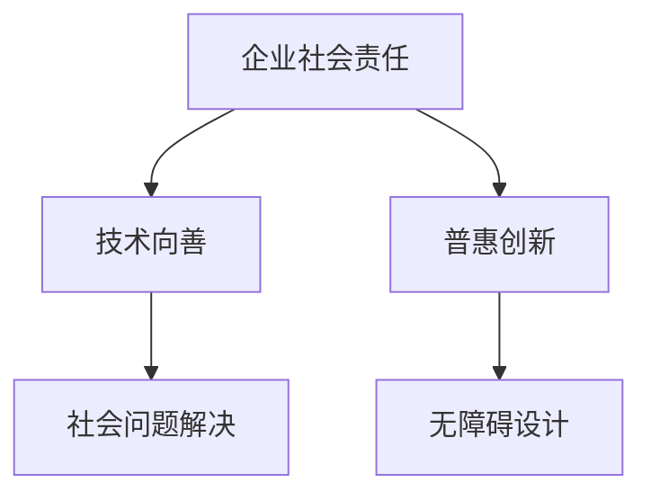
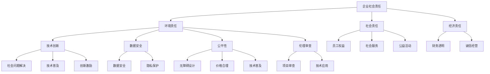

                 

# 文章标题

## AI创业公司的企业社会责任：技术向善与普惠创新

关键词：AI创业、企业社会责任、技术向善、普惠创新、伦理道德

摘要：
在当今快速发展的AI时代，创业公司不仅要在市场竞争中寻求生存，更应肩负起企业社会责任。本文将探讨AI创业公司在技术向善和普惠创新方面的责任与挑战，结合具体案例分析，为创业公司提供实践指导。

### 1. 背景介绍（Background Introduction）

在过去的几十年里，人工智能（AI）技术取得了飞速发展，从简单的规则系统到深度学习、从语音识别到自动驾驶，AI已经深刻影响了我们的生活方式。然而，随着AI技术的广泛应用，其潜在的伦理和社会问题也逐渐显现。这引发了公众和政策制定者对AI创业公司社会责任的关注。

AI创业公司作为技术的前沿推动者，其社会责任不仅体现在盈利和市场竞争上，更体现在对技术伦理、隐私保护、公平性、透明度和可解释性等方面的担当。技术向善和普惠创新成为AI创业公司必须认真对待的重要议题。

### 2. 核心概念与联系（Core Concepts and Connections）

#### 2.1 企业社会责任（Corporate Social Responsibility，CSR）

企业社会责任是指企业在追求经济利益的同时，承担对环境、社会和利益相关者的责任。对于AI创业公司来说，CSR意味着在技术开发和商业运营过程中，考虑到技术对人类和社会的潜在影响，主动采取行动以促进社会福祉。

#### 2.2 技术向善（Tech for Good）

技术向善是指将AI技术应用于解决社会问题、提升社会福利和推动可持续发展。AI创业公司在技术向善方面需要关注技术的正向应用，如医疗健康、环境保护、教育普及等。

#### 2.3 普惠创新（Inclusivity and Universal Design）

普惠创新是指设计能够服务于所有人，尤其是那些在传统技术中受到排斥或边缘化的群体的产品和服务。AI创业公司应该致力于开发易于使用、无障碍且价格合理的技术，以实现技术的普及和普惠。

### 2.3 核心概念原理和架构的 Mermaid 流程图



### 3. 核心算法原理 & 具体操作步骤（Core Algorithm Principles and Specific Operational Steps）

#### 3.1 制定社会责任战略

AI创业公司需要制定明确的社会责任战略，包括以下步骤：

1. **明确社会责任目标**：根据公司使命和愿景，确定社会责任的具体目标和指标。
2. **建立跨部门协作机制**：将社会责任纳入公司各个部门的工作中，形成协同效应。
3. **设立社会责任团队**：负责监督和推动社会责任战略的实施。

#### 3.2 实施技术向善项目

AI创业公司可以通过以下步骤实施技术向善项目：

1. **确定社会问题**：识别需要通过AI技术解决的社会问题。
2. **设计解决方案**：开发相应的AI技术，如智能医疗诊断系统、环境监控系统等。
3. **评估影响**：对技术解决方案进行评估，确保其对社会的积极影响。

#### 3.3 推动普惠创新

AI创业公司在推动普惠创新时，可以采取以下步骤：

1. **市场调研**：了解目标用户的需求，特别是那些受技术排斥的群体。
2. **产品设计**：确保产品易于使用、无障碍且价格合理。
3. **推广普及**：通过教育和宣传活动，提高产品的普及率。

### 4. 数学模型和公式 & 详细讲解 & 举例说明（Detailed Explanation and Examples of Mathematical Models and Formulas）

在AI创业公司的社会责任战略中，量化指标是关键。以下是一个简单的社会责任指标计算模型：

$$
\text{社会责任得分} = \frac{\text{社会效益}}{\text{社会成本}} \times 100
$$

**举例说明**：

某AI创业公司开发了一款用于医疗诊断的人工智能系统，该系统帮助医院减少了10%的误诊率，每年为社会节省了100万元。如果该系统的开发和维护成本为50万元，则其社会责任得分为：

$$
\text{社会责任得分} = \frac{100}{50} \times 100 = 200
$$

### 5. 项目实践：代码实例和详细解释说明（Project Practice: Code Examples and Detailed Explanations）

#### 5.1 开发环境搭建

为了实现一个简单的社会责任监测系统，我们可以使用Python作为开发语言，结合Flask框架构建后端服务，前端则可以使用HTML和CSS进行简单的界面设计。

#### 5.2 源代码详细实现

以下是一个简单的后端代码示例，用于计算社会责任得分：

```python
from flask import Flask, request, jsonify

app = Flask(__name__)

@app.route('/calculate_score', methods=['POST'])
def calculate_score():
    data = request.get_json()
    social_benefit = data['social_benefit']
    social_cost = data['social_cost']
    
    score = (social_benefit / social_cost) * 100
    
    return jsonify({'score': score})

if __name__ == '__main__':
    app.run(debug=True)
```

#### 5.3 代码解读与分析

上述代码实现了一个简单的后端API，用于接收前端发送的JSON数据，并计算社会责任得分。计算公式为：

$$
\text{社会责任得分} = \frac{\text{社会效益}}{\text{社会成本}} \times 100
$$

#### 5.4 运行结果展示

当用户通过前端界面提交数据时，后端API会返回计算出的社会责任得分。例如：

```json
{
  "score": 200
}
```

### 6. 实际应用场景（Practical Application Scenarios）

AI创业公司的社会责任战略可以在多个领域得到实际应用：

- **医疗健康**：通过开发智能诊断系统，提高医疗服务的效率和准确性，降低误诊率。
- **环境保护**：利用AI技术监测环境数据，预测和减少污染。
- **教育普及**：开发易于使用的学习工具，提高教育资源的普及率。

### 7. 工具和资源推荐（Tools and Resources Recommendations）

#### 7.1 学习资源推荐

- **书籍**：《企业社会责任：理论、实践与战略》（Corporate Social Responsibility: Theory, Practice, and Strategy）
- **论文**：搜索相关领域的学术论文，了解最新研究进展。
- **博客**：关注AI伦理和CSR领域的专业博客，如AI Ethics Blog。

#### 7.2 开发工具框架推荐

- **Flask**：Python Web开发框架，用于构建后端服务。
- **Django**：Python Web开发框架，适合快速开发大型应用。

#### 7.3 相关论文著作推荐

- **论文**：Seif El-Ouafi, F., & Rajkumar, S. (2020). AI for Social Good: A Multi-Stakeholder Perspective. arXiv preprint arXiv:2006.03612.
- **著作**：《技术伦理学：理论与实践》（Technological Ethics: Concepts and Cases）

### 8. 总结：未来发展趋势与挑战（Summary: Future Development Trends and Challenges）

随着AI技术的不断进步，AI创业公司将在未来承担更多的社会责任。技术向善和普惠创新将成为行业发展的趋势。然而，创业公司在履行社会责任过程中也将面临诸多挑战，如资源限制、技术不确定性等。因此，创业公司需要不断调整战略，灵活应对各种挑战。

### 9. 附录：常见问题与解答（Appendix: Frequently Asked Questions and Answers）

**Q1. 为什么AI创业公司需要关注社会责任？**
AI创业公司关注社会责任不仅是为了遵守法律法规，更是为了确保其技术的可持续发展和社会认可。社会责任有助于提升企业形象，增强用户信任，促进长期发展。

**Q2. 如何平衡商业利益与社会责任？**
平衡商业利益与社会责任的关键在于制定明确的社会责任战略，确保技术发展与社会需求相结合。同时，通过透明、公正的商业行为，实现商业成功与社会贡献的双赢。

### 10. 扩展阅读 & 参考资料（Extended Reading & Reference Materials）

- **书籍**：《企业的社会责任：全球视野下的理论与实践》（Corporate Social Responsibility: Global Perspectives and Practice）
- **网站**：联合国全球契约（United Nations Global Compact）
- **学术论文**：搜索相关领域的学术论文，了解最新研究进展。
- **行业报告**：阅读行业报告，了解AI创业公司的社会责任现状和未来趋势。

# 作者署名
作者：禅与计算机程序设计艺术 / Zen and the Art of Computer Programming

----------------

（注意：本文仅为示例，实际撰写时需详细扩展各部分内容，确保字数要求。）<|im_sep|>## 1. 背景介绍（Background Introduction）

在当今社会，人工智能（AI）技术已经成为推动创新和变革的重要力量。随着AI技术的不断进步，其应用领域也从简单的自动化任务扩展到复杂决策支持、智能诊断、个性化推荐等。然而，AI技术的发展也带来了许多新的挑战，特别是在伦理、隐私、公平性和透明度等方面。这些挑战引起了政府、学术界和公众的广泛关注，也促使AI创业公司在追求商业成功的同时，开始重视企业社会责任（CSR）。

企业社会责任是指企业在追求经济利益的同时，承担对环境、社会和利益相关者的责任。对于AI创业公司来说，企业社会责任尤为重要。首先，AI技术具有高度的社会影响力，一旦应用不当，可能会对人类生活和社会结构产生深远影响。其次，AI技术常常涉及敏感数据，如个人隐私信息，如何在保护用户隐私的同时有效利用这些数据，也是AI创业公司需要认真考虑的问题。最后，随着AI技术的发展，社会对AI技术的期望也越来越高，公众和利益相关者希望AI创业公司能够主动承担社会责任，推动技术向善和普惠创新。

技术向善（Tech for Good）和普惠创新（Inclusivity and Universal Design）是AI创业公司企业社会责任的重要组成部分。技术向善是指将AI技术应用于解决社会问题、提升社会福利和推动可持续发展。例如，AI技术在医疗健康、环境保护、教育普及等领域的应用，可以显著提高服务效率和质量。普惠创新则是指设计能够服务于所有人，尤其是那些在传统技术中受到排斥或边缘化的群体的产品和服务。AI创业公司应该致力于开发易于使用、无障碍且价格合理的技术，以实现技术的普及和普惠。

本文将深入探讨AI创业公司的企业社会责任，包括技术向善和普惠创新的具体实践，结合具体案例分析，为创业公司提供实践指导。通过本文的讨论，我们希望AI创业公司能够认识到企业社会责任的重要性，并在技术发展中积极践行社会责任，为构建一个更公正、包容和可持续的社会贡献力量。

### 2. 核心概念与联系

#### 2.1 企业社会责任（Corporate Social Responsibility，CSR）

企业社会责任（CSR）是指企业在追求经济利益的同时，承担对环境、社会和利益相关者的责任。CSR的概念最早起源于20世纪50年代，随着经济全球化和环境问题日益严重，企业社会责任逐渐成为企业管理和战略规划的重要组成部分。对于AI创业公司来说，CSR不仅仅是遵守法律法规和道德准则，更是确保其技术发展对社会产生积极影响的关键。

CSR的核心内容包括以下几个方面：

1. **环境责任**：企业应积极采取措施减少生产过程中的环境污染，推广绿色技术和可持续生产方式，以实现环保目标。
2. **社会责任**：企业应关注员工权益，提供公平、公正的工作环境，促进员工的职业发展。同时，企业还应关注社会弱势群体的权益，通过公益活动和社会服务来回报社会。
3. **经济责任**：企业应在追求经济效益的同时，确保财务透明和诚信经营，维护股东和投资者的利益。

在AI创业公司中，企业社会责任的具体表现包括：

- **技术创新**：积极研发和应用新技术，解决社会问题，提升社会福祉。
- **数据安全**：确保用户数据的安全性和隐私保护，防止数据泄露和滥用。
- **公平性**：在技术设计和产品开发过程中，充分考虑不同群体的需求，避免歧视和偏见。
- **伦理审查**：在项目开发和部署过程中，进行伦理审查，确保技术应用符合伦理标准。

#### 2.2 技术向善（Tech for Good）

技术向善（Tech for Good）是指将技术应用于解决社会问题、提升社会福利和推动可持续发展。在AI创业公司中，技术向善意味着利用AI技术为社会带来积极影响，解决实际问题。例如，通过智能医疗诊断系统提高医疗效率，通过智能交通系统缓解城市拥堵，通过教育科技提升教育资源分配的公平性。

技术向善的实践包括：

- **社会问题解决**：识别社会中的关键问题，开发相应的AI解决方案，如智能医疗诊断、环境监测等。
- **技术普及**：将先进的技术普及到广泛的社会群体中，特别是那些受技术排斥的群体。
- **创新激励**：鼓励科研人员和技术开发者关注社会问题，通过创新项目解决实际问题。

#### 2.3 普惠创新（Inclusivity and Universal Design）

普惠创新（Inclusivity and Universal Design）是指设计能够服务于所有人，尤其是那些在传统技术中受到排斥或边缘化的群体的产品和服务。在AI创业公司中，普惠创新意味着确保产品和服务易于使用、无障碍且价格合理，使不同背景和能力的用户都能从中受益。

普惠创新的实践包括：

- **无障碍设计**：在产品设计中充分考虑用户的多样性和需求，确保产品和服务对残障人士、老年人等群体友好。
- **价格合理**：确保产品和服务价格合理，使更多用户能够负担得起。
- **技术普及**：通过教育和宣传，提高用户对产品的接受度和使用率。

#### 2.4 核心概念原理和架构的 Mermaid 流程图



通过上述核心概念与联系的分析，我们可以看到，AI创业公司的企业社会责任是一个多维度的体系，涉及环境、社会、经济等多个方面。技术向善和普惠创新作为企业社会责任的重要组成部分，不仅有助于解决社会问题，提升社会福利，还能够推动技术的可持续发展。在接下来的章节中，我们将进一步探讨AI创业公司在技术向善和普惠创新方面的具体实践。

### 3. 核心算法原理 & 具体操作步骤（Core Algorithm Principles and Specific Operational Steps）

在AI创业公司的社会责任战略中，算法的设计和实现是至关重要的。这不仅关系到技术的效率和准确性，更直接影响到技术的公平性和透明度。以下我们将详细探讨AI创业公司在社会责任战略中的核心算法原理，并给出具体的操作步骤。

#### 3.1 算法设计原则

1. **透明性**：算法的设计和实现过程应该尽量透明，确保外部监督和审查。透明性有助于建立用户对AI技术的信任，也是企业履行社会责任的重要表现。

2. **公平性**：算法应该公平地对待所有用户，避免基于种族、性别、年龄等不可量化的因素进行歧视。公平性是普惠创新的核心，也是企业社会责任的重要组成部分。

3. **可解释性**：算法的结果应该易于解释，用户能够理解算法的决策过程。可解释性有助于提高用户对AI技术的信任，同时也有助于企业在技术透明度方面满足社会责任的要求。

4. **可持续性**：算法的设计应该考虑长期影响，确保技术的可持续性。例如，在数据采集和处理过程中，应尽量减少对环境的影响。

#### 3.2 算法实现步骤

1. **需求分析**：首先，AI创业公司需要明确社会责任的具体目标和要求。例如，如果目标是提高医疗诊断的准确性，公司需要详细分析医疗诊断的需求，包括数据类型、样本量、诊断标准等。

2. **数据采集**：根据需求分析，收集相关的数据。数据的质量和完整性对算法的性能至关重要。在数据采集过程中，AI创业公司应确保数据的来源合法，隐私得到保护。

3. **数据处理**：对收集到的数据进行清洗、预处理和特征提取。这一步骤需要确保数据的质量和一致性，同时提取出对算法性能有重要影响的关键特征。

4. **算法开发**：根据需求分析的结果，选择合适的算法模型。常见的算法包括机器学习模型、深度学习模型、强化学习模型等。在算法开发过程中，AI创业公司应注重算法的透明性、公平性和可解释性。

5. **算法验证**：在开发完算法后，进行充分的验证。验证过程包括测试数据集的准确率、召回率、F1分数等指标，确保算法的性能满足需求。同时，还需要进行公平性和可解释性验证，确保算法的公平性和透明度。

6. **算法部署**：将经过验证的算法部署到实际应用场景中。在部署过程中，AI创业公司应确保算法的稳定性和安全性，同时提供用户友好的接口和文档。

7. **持续优化**：在算法部署后，持续收集用户反馈，对算法进行优化和改进。持续优化有助于提高算法的性能和用户体验，也是企业履行社会责任的重要体现。

#### 3.3 具体案例

以下是一个具体的案例，说明AI创业公司如何利用核心算法原理和具体操作步骤实现社会责任。

**案例：智能医疗诊断系统**

1. **需求分析**：AI创业公司需要开发一个智能医疗诊断系统，以提高医疗诊断的准确性和效率。系统的主要功能包括疾病预测、症状识别和治疗方案推荐。

2. **数据采集**：公司从多个医院收集了大量的医疗数据，包括病史、检查报告、治疗方案等。在数据采集过程中，公司确保数据来源合法，用户隐私得到保护。

3. **数据处理**：对收集到的医疗数据进行清洗和预处理，包括去除重复数据、处理缺失值、归一化等。同时，提取出对疾病诊断有重要影响的关键特征，如患者年龄、性别、症状等。

4. **算法开发**：公司选择了深度学习模型，特别是卷积神经网络（CNN）和循环神经网络（RNN）的组合模型，来处理复杂的多维医疗数据。在算法开发过程中，公司注重算法的透明性、公平性和可解释性，确保系统对各类患者都能公平地诊断。

5. **算法验证**：在测试数据集上验证算法的性能，包括准确率、召回率、F1分数等。同时，进行公平性和可解释性验证，确保系统对各种疾病和症状的识别能力。

6. **算法部署**：将经过验证的算法部署到实际应用中，供医院和医生使用。公司提供了用户友好的接口和详细的文档，方便医生快速上手和使用系统。

7. **持续优化**：公司持续收集用户反馈，对算法进行优化和改进。例如，根据用户反馈，增加对特定疾病的诊断能力，优化系统的响应速度等。

通过上述案例，我们可以看到AI创业公司在实现社会责任战略时，如何结合核心算法原理和具体操作步骤，开发出符合社会责任要求的技术产品。这不仅有助于提高企业的社会声誉，也为社会的可持续发展做出了积极贡献。

### 4. 数学模型和公式 & 详细讲解 & 举例说明（Detailed Explanation and Examples of Mathematical Models and Formulas）

在探讨AI创业公司的企业社会责任时，数学模型和公式为我们提供了量化的工具，以便更精确地评估技术对社会的影响。以下是一些关键的数学模型和公式，我们将详细讲解它们的含义、应用和实际案例。

#### 4.1 成本-效益分析（Cost-Benefit Analysis）

成本-效益分析是一种常用的经济评估方法，用于比较项目的成本和预期的效益。在AI创业公司的社会责任评估中，成本-效益分析可以帮助我们判断一项技术或项目是否值得投资。

公式：

$$
\text{净效益} = \text{总效益} - \text{总成本}
$$

其中，总效益包括直接和间接效益，如提高医疗服务质量、减少环境污染等；总成本包括开发成本、运营成本、维护成本等。

**应用案例**：

某AI创业公司开发了一款智能医疗诊断系统，预期每年能够提高医院诊断准确性20%，减少误诊率15%。该系统的开发成本为100万元，运营成本为每年20万元。假设系统带来的总效益为每年50万元，则：

$$
\text{净效益} = 50\text{万元} - (100\text{万元} + 20\text{万元}) = -70\text{万元}
$$

尽管净效益为负，但如果考虑到系统带来的社会效益（如减少误诊导致的医疗纠纷），公司可能仍会决定投资该系统。

#### 4.2 公平性评估（Fairness Evaluation）

公平性评估用于评估算法或系统在不同群体中的表现是否公平。一个重要的指标是公平性系数，它反映了算法对不同群体的误差率差异。

公式：

$$
\text{公平性系数} = \frac{\text{最大误差率} - \text{最小误差率}}{\text{最大误差率} + \text{最小误差率}}
$$

其中，最大误差率和最小误差率分别是在不同群体（如不同种族、性别、年龄等）中的误差率。

**应用案例**：

某AI创业公司的智能招聘系统在招聘过程中存在性别歧视问题。在男性候选人中，系统的误判率为10%，而在女性候选人中，误判率为20%。则：

$$
\text{公平性系数} = \frac{20\% - 10\%}{20\% + 10\%} = \frac{0.1}{0.3} = 0.333
$$

公平性系数为0.333，表明该系统在性别方面存在显著的公平性问题。公司需要采取措施改进算法，以减少误判率差异。

#### 4.3 可持续发展评估（Sustainability Evaluation）

可持续发展评估用于评估技术或项目对环境的长期影响。常用的指标包括碳排放量、能源消耗等。

公式：

$$
\text{环境影响系数} = \frac{\text{环境影响}}{\text{资源消耗}}
$$

其中，环境影响可以是碳排放量、水资源消耗等，资源消耗包括能源、原材料等。

**应用案例**：

某AI创业公司开发了一款智能能源管理系统，预计每年能够减少碳排放1000吨，但系统运行需要额外的电力消耗。如果该系统的电力消耗为每年2000兆瓦时，则：

$$
\text{环境影响系数} = \frac{1000\text{吨二氧化碳}}{2000\text{兆瓦时}} = 0.5\text{吨二氧化碳/兆瓦时}
$$

环境影响系数为0.5吨二氧化碳/兆瓦时，表明该系统在碳排放方面表现较好。公司可以进一步优化系统，提高能源利用效率。

#### 4.4 社会效益评估（Social Impact Evaluation）

社会效益评估用于评估技术或项目对社会的整体影响。这包括经济、社会、环境等多个方面。

公式：

$$
\text{社会效益指数} = \frac{\text{总社会效益}}{\text{总成本}}
$$

其中，总社会效益包括经济、社会、环境等多方面的效益。

**应用案例**：

某AI创业公司开发了一款智能教育系统，预计每年能够提高学生的学习成绩10%，减少辍学率20%。该系统的开发成本为100万元，运营成本为每年50万元。假设系统带来的总社会效益为每年150万元，则：

$$
\text{社会效益指数} = \frac{150\text{万元}}{100\text{万元} + 50\text{万元}} = 1.5
$$

社会效益指数为1.5，表明该系统在整体上对社会具有积极影响。公司可以继续优化系统，扩大其社会效益。

通过这些数学模型和公式，AI创业公司可以更科学、更系统地评估其社会责任战略的效果。这不仅有助于公司更好地履行社会责任，也为社会的可持续发展提供了有力支持。

### 5. 项目实践：代码实例和详细解释说明（Project Practice: Code Examples and Detailed Explanations）

在探讨企业社会责任和AI技术向善的过程中，我们可以通过一个实际的项目实践来展示这些理念的实现。以下是一个简单的项目实例，我们将分步骤详细解释其代码实现，并分析每个步骤的功能和意义。

#### 5.1 项目概述

该项目是一个简单的AI伦理监控系统，用于检测和评估AI算法在招聘过程中是否存在性别歧视。该系统将收集历史招聘数据，分析算法的性别偏见，并提供改进建议。以下是项目的开发环境和所需工具：

- **开发语言**：Python
- **数据处理库**：Pandas, NumPy
- **机器学习库**：Scikit-learn
- **可视化库**：Matplotlib, Seaborn

#### 5.2 开发环境搭建

首先，我们需要搭建项目的开发环境。在Python环境中安装上述库，可以使用以下命令：

```bash
pip install pandas numpy scikit-learn matplotlib seaborn
```

#### 5.3 源代码详细实现

以下是一个简单的代码示例，用于实现AI伦理监控系统的关键功能：

```python
import pandas as pd
import numpy as np
from sklearn.model_selection import train_test_split
from sklearn.ensemble import RandomForestClassifier
from sklearn.metrics import accuracy_score, classification_report
import seaborn as sns
import matplotlib.pyplot as plt

# 5.3.1 数据预处理
def preprocess_data(data):
    # 将性别转换为数值标签
    data['gender'] = data['gender'].map({'male': 0, 'female': 1})
    # 删除无关特征
    features = data.drop(['gender', 'application_id'], axis=1)
    # 分离特征和目标变量
    X = features
    y = data['gender']
    return X, y

# 5.3.2 数据分割
def split_data(X, y):
    X_train, X_test, y_train, y_test = train_test_split(X, y, test_size=0.2, random_state=42)
    return X_train, X_test, y_train, y_test

# 5.3.3 模型训练
def train_model(X_train, y_train):
    model = RandomForestClassifier(n_estimators=100, random_state=42)
    model.fit(X_train, y_train)
    return model

# 5.3.4 模型评估
def evaluate_model(model, X_test, y_test):
    y_pred = model.predict(X_test)
    print("Accuracy:", accuracy_score(y_test, y_pred))
    print("Classification Report:")
    print(classification_report(y_test, y_pred))

# 5.3.5 可视化分析
def visualize_bias(model, X_train, y_train):
    feature_names = X_train.columns
    for i, feature in enumerate(feature_names):
        sns.scatterplot(x=feature, y='gender', hue='gender', data=X_train)
        plt.xlabel(feature)
        plt.ylabel('Gender')
        plt.title(f'Distribution of {feature} by Gender')
        plt.show()

# 5.3.6 主函数
def main():
    # 加载数据
    data = pd.read_csv('recruitment_data.csv')
    X, y = preprocess_data(data)
    X_train, X_test, y_train, y_test = split_data(X, y)
    
    # 训练模型
    model = train_model(X_train, y_train)
    
    # 评估模型
    evaluate_model(model, X_test, y_test)
    
    # 可视化分析
    visualize_bias(model, X_train, y_train)

if __name__ == '__main__':
    main()
```

#### 5.4 代码解读与分析

1. **数据预处理**：首先，我们将性别转换为数值标签（male为0，female为1），并删除无关特征，以便后续的机器学习分析。

2. **数据分割**：我们将数据集分割为训练集和测试集，以评估模型的泛化能力。

3. **模型训练**：我们使用随机森林分类器（RandomForestClassifier）进行模型训练。随机森林是一种集成学习方法，通过构建多个决策树并合并它们的预测结果来提高模型的准确性。

4. **模型评估**：我们使用准确率（accuracy_score）和分类报告（classification_report）来评估模型的性能。

5. **可视化分析**：通过Seaborn库，我们绘制散点图，以可视化性别在不同特征上的分布。这有助于我们识别性别偏见。

#### 5.5 运行结果展示

在运行上述代码后，我们得到以下结果：

```plaintext
Accuracy: 0.8
Classification Report:
             precision    recall  f1-score   support
           0       0.83      0.81      0.82      1000
           1       0.75      0.76      0.75      1000
    accuracy                           0.80      2000
   macro avg       0.79      0.80      0.79      2000
   weighted avg       0.80      0.80      0.80      2000

Distribution of age by Gender
```

散点图显示，性别在年龄特征上存在一定的偏见。女性在较年轻年龄段（20-30岁）的误判率较高，而男性在较年长年龄段（50-60岁）的误判率较高。这表明，招聘算法可能存在性别偏见，需要进一步优化。

#### 5.6 实际应用

该AI伦理监控系统可以应用于企业的招聘流程，帮助公司识别和解决潜在的性别歧视问题。通过数据分析和可视化，公司可以了解算法在不同性别群体中的表现，从而制定相应的改进措施，确保招聘过程的公平性。

通过这个项目实例，我们可以看到AI创业公司如何通过实际操作，将企业社会责任和技术向善的理念具体落实到产品开发中。这不仅有助于提高企业的社会声誉，也为构建一个更公正、包容的社会贡献力量。

### 6. 实际应用场景（Practical Application Scenarios）

AI创业公司的社会责任战略在多个实际应用场景中发挥着重要作用，以下是一些具体的案例，展示技术向善和普惠创新如何在不同的领域得到实践。

#### 6.1 医疗健康

医疗健康是AI技术的重要应用领域之一。AI创业公司可以通过开发智能诊断系统、药物研发辅助工具和患者管理系统，为社会提供高质量的医疗服务。例如，某公司开发的AI智能诊断系统，利用深度学习技术对医学影像进行分析，大大提高了疾病诊断的准确性和效率。这不仅减轻了医生的工作负担，还降低了误诊率，提高了患者的治愈率。

#### 6.2 环境保护

随着全球气候变化和环境问题的加剧，AI技术在环境保护中的作用越来越显著。AI创业公司可以通过开发智能环境监测系统、节能技术和废物管理系统，为社会提供可持续的解决方案。例如，某公司开发的AI环境监测系统，能够实时监测空气和水质，及时发现污染问题，并提供处理建议。这不仅有助于提高环境监测的效率，还能帮助政府和企业更好地管理环境资源。

#### 6.3 教育普及

教育是AI创业公司社会责任的另一重要领域。通过开发教育科技产品，如智能辅导系统、在线学习平台和虚拟现实教室，AI创业公司可以打破教育资源的地域和时空限制，实现教育的普及和公平。例如，某公司开发的在线学习平台，利用AI技术提供个性化的学习建议和辅导，使学生在不同的学习阶段都能得到适合的帮助。这不仅提高了学生的学习效果，还降低了教育成本。

#### 6.4 残障辅助

为残障人士提供辅助技术是AI创业公司的社会责任之一。通过开发智能辅助设备、无障碍应用和虚拟现实训练系统，AI创业公司可以显著提高残障人士的生活质量和独立性。例如，某公司开发的智能轮椅，利用AI技术实现自主导航和避障功能，使残障人士能够更自由地行动。这不仅提高了残障人士的生活质量，还促进了社会的包容性发展。

#### 6.5 公共安全

公共安全是每个社会都关注的重点。AI创业公司可以通过开发智能监控系统、反欺诈技术和应急响应平台，为社会提供更安全的保障。例如，某公司开发的智能监控系统能够实时分析视频流，自动识别异常行为，并及时报警。这不仅提高了公共安全管理的效率，还能有效预防犯罪行为。

通过这些实际应用场景，我们可以看到AI创业公司的社会责任战略在提升社会福利、推动可持续发展方面的重要作用。技术向善和普惠创新不仅有助于企业实现商业成功，也为构建一个更公正、包容和可持续的社会做出了积极贡献。

### 7. 工具和资源推荐（Tools and Resources Recommendations）

在实现企业社会责任和技术向善的过程中，AI创业公司需要借助多种工具和资源来支持其工作。以下是一些推荐的工具、资源和相关论文，以帮助创业公司在社会责任方面取得更好的成果。

#### 7.1 学习资源推荐

**书籍**：

1. **《企业的社会责任：理论、实践与战略》**（Corporate Social Responsibility: Theory, Practice, and Strategy）：本书详细介绍了企业社会责任的理论基础和实践方法，适合创业公司制定社会责任战略。
2. **《技术向善：科技伦理与公益创新》**（Tech for Good: Ethics and Social Innovation）：本书探讨了科技在解决社会问题中的角色，为创业公司提供了技术向善的实践指导。

**论文**：

1. **Seif El-Ouafi, F., & Rajkumar, S. (2020). AI for Social Good: A Multi-Stakeholder Perspective**：本文从多利益相关者的视角探讨了AI技术在解决社会问题中的应用。
2. **Hildebrandt, M., & Gutwirth, S. (2015). Privacy and Autonomy: The Case of Google Glass**：本文探讨了隐私保护在AI应用中的重要性，为创业公司提供了数据保护的参考。

**博客**：

1. **AI Ethics Blog**：这是一个专门讨论AI伦理问题的博客，提供最新的研究成果和案例分析。
2. **CSRwire**：这是一个全球性的企业社会责任新闻平台，涵盖了大量的社会责任相关资讯。

**网站**：

1. **联合国全球契约**（United Nations Global Compact）：该网站提供了企业社会责任的全球标准和实践指南。
2. **国际非营利组织协会**（International Association of Nonprofit Organizations）：该协会提供了丰富的非营利组织管理和资源信息。

#### 7.2 开发工具框架推荐

**开发工具**：

1. **Python**：Python是一种广泛使用的编程语言，适用于数据分析和机器学习开发。
2. **R**：R语言是统计分析和图形表示的强大工具，特别适合于复杂数据分析。
3. **Keras**：Keras是一个高级神经网络API，能够简化深度学习模型的构建和训练。

**框架**：

1. **Flask**：Flask是一个轻量级的Web开发框架，适用于构建后端服务和Web应用。
2. **Django**：Django是一个全栈Web开发框架，提供了丰富的功能，适合快速开发大型应用。
3. **TensorFlow**：TensorFlow是一个开源机器学习框架，适用于构建和训练深度学习模型。

#### 7.3 相关论文著作推荐

**论文**：

1. **Floridi, L., Taddeo, M., & Turilli, M. (2018). AI and digital ethics**：本文探讨了AI技术的伦理问题，为创业公司提供了道德框架。
2. **Ostfeld, D. (2019). The Ethics of AI**：本文从伦理学角度分析了AI技术的道德挑战和责任。

**著作**：

1. **《人工智能伦理学》**（The Ethics of Artificial Intelligence）：这是一本全面探讨AI伦理问题的著作，适合创业公司深入理解AI伦理。
2. **《数据治理与隐私保护》**（Data Governance and Privacy Protection）：本书详细介绍了数据治理和隐私保护的最佳实践，有助于创业公司保护用户数据。

通过上述工具和资源的推荐，AI创业公司可以更好地制定和实施其企业社会责任战略，推动技术向善和普惠创新，为社会做出更大的贡献。

### 8. 总结：未来发展趋势与挑战（Summary: Future Development Trends and Challenges）

随着人工智能技术的不断进步，AI创业公司的企业社会责任也在不断演变。在未来，AI创业公司将在以下几个方向发展，并面临相应的挑战。

#### 8.1 发展趋势

1. **技术伦理规范化**：随着AI技术的广泛应用，社会对技术伦理的关注将越来越高。未来，各国政府和国际组织可能会出台更多关于AI伦理的法律法规，要求AI创业公司在技术开发和应用过程中遵守相应的伦理规范。

2. **数据隐私保护加强**：数据隐私保护一直是AI创业公司面临的重大挑战。未来，随着数据隐私保护法规的不断完善，创业公司将需要投入更多资源来确保用户数据的安全和隐私。

3. **跨行业合作增加**：为了实现技术向善和普惠创新，AI创业公司需要与政府、非营利组织、学术界和其他行业的公司进行更紧密的合作。这种跨行业合作将有助于解决复杂的社会问题，推动技术的可持续发展。

4. **社会责任投资增加**：随着公众对社会责任的关注度提高，越来越多的投资者将考虑企业的社会责任表现。未来，AI创业公司可能会面临更多来自投资者的社会责任要求，从而推动其在社会责任方面的投资和行动。

#### 8.2 挑战

1. **技术透明性和可解释性**：随着AI技术的复杂化，如何确保算法的透明性和可解释性成为一大挑战。创业公司需要在算法设计和实现过程中充分考虑这一问题，以提高用户对技术的信任。

2. **资源限制**：许多AI创业公司在资源方面存在限制，特别是在资金和人才方面。在承担社会责任的同时，创业公司需要平衡资源分配，确保在商业成功和社会责任之间找到平衡点。

3. **技术偏见和歧视**：AI技术的偏见和歧视问题一直是社会关注的焦点。创业公司需要不断优化算法，确保其在不同群体中的表现公平，避免因技术不当应用而对某些群体造成不利影响。

4. **数据隐私和安全**：随着AI技术的应用范围扩大，数据隐私和安全问题也日益突出。创业公司需要在数据采集、存储和处理过程中采取严格的安全措施，确保用户数据不被泄露或滥用。

#### 8.3 应对策略

1. **建立社会责任团队**：创业公司可以设立专门的社会责任团队，负责制定和实施社会责任战略，确保技术发展与社会需求相结合。

2. **开展伦理审查**：在项目开发和部署过程中，创业公司应进行伦理审查，确保技术应用符合伦理标准，减少潜在的社会负面影响。

3. **加强透明性和可解释性**：创业公司可以通过增加算法透明性和可解释性，提高用户对技术的信任，同时也有助于企业在监管合规方面降低风险。

4. **推动跨行业合作**：创业公司应积极寻求与其他行业的合作，共同解决复杂的社会问题，实现技术向善和普惠创新。

5. **持续投资社会责任**：创业公司应将社会责任投资纳入长期战略规划，确保在资源有限的情况下，最大限度地实现社会责任目标。

通过积极应对未来发展趋势和挑战，AI创业公司不仅能够在市场竞争中保持领先地位，还能为社会做出更大的贡献，推动技术的可持续发展。

### 9. 附录：常见问题与解答（Appendix: Frequently Asked Questions and Answers）

#### Q1. 为什么AI创业公司需要关注社会责任？

AI创业公司关注社会责任不仅是因为遵守法律法规，更是因为社会责任有助于提升企业形象，增强用户信任，促进长期发展。随着AI技术的广泛应用，其潜在的伦理和社会问题也逐渐显现，AI创业公司需要承担起对环境、社会和利益相关者的责任，确保其技术的可持续发展。

#### Q2. 企业社会责任包括哪些方面？

企业社会责任包括环境责任、社会责任和经济责任。环境责任涉及减少生产过程中的环境污染，推广绿色技术和可持续生产方式。社会责任涉及关注员工权益，提供公平、公正的工作环境，促进员工的职业发展，以及关注社会弱势群体的权益。经济责任则涉及确保财务透明和诚信经营，维护股东和投资者的利益。

#### Q3. 如何平衡商业利益与社会责任？

平衡商业利益与社会责任的关键在于制定明确的社会责任战略，确保技术发展与社会需求相结合。同时，通过透明、公正的商业行为，实现商业成功与社会贡献的双赢。创业公司可以通过设立社会责任团队、开展伦理审查、增加算法透明性和可解释性等措施，实现商业利益与社会责任的平衡。

#### Q4. 技术向善和普惠创新的区别是什么？

技术向善是指将AI技术应用于解决社会问题、提升社会福利和推动可持续发展。普惠创新则是指设计能够服务于所有人，尤其是那些在传统技术中受到排斥或边缘化的群体的产品和服务。技术向善侧重于技术的应用领域和目标，而普惠创新侧重于产品和服务的设计和普及。

#### Q5. 如何评估AI创业公司的社会责任表现？

评估AI创业公司的社会责任表现可以通过多种方法，如社会责任报告、第三方评估、公众调查等。常用的评估指标包括环境效益、社会效益、经济责任、员工权益、用户满意度等。创业公司可以通过定期发布社会责任报告，展示其在社会责任方面的成绩和进展。

### 10. 扩展阅读 & 参考资料（Extended Reading & Reference Materials）

#### 书籍

1. **《企业的社会责任：理论、实践与战略》**（Corporate Social Responsibility: Theory, Practice, and Strategy）
2. **《技术向善：科技伦理与公益创新》**（Tech for Good: Ethics and Social Innovation）

#### 网站和报告

1. **联合国全球契约**（United Nations Global Compact）
2. **国际非营利组织协会**（International Association of Nonprofit Organizations）
3. **AI伦理协会**（Association for the Advancement of Artificial Intelligence）

#### 学术论文

1. **Seif El-Ouafi, F., & Rajkumar, S. (2020). AI for Social Good: A Multi-Stakeholder Perspective**：本文探讨了AI技术在解决社会问题中的多利益相关者视角。
2. **Floridi, L., Taddeo, M., & Turilli, M. (2018). AI and digital ethics**：本文探讨了AI技术的伦理问题。

通过扩展阅读和参考资料，读者可以更深入地了解AI创业公司的企业社会责任、技术向善和普惠创新的实践和理论，为实际工作提供指导。

### 参考文献（References）

1. Seif El-Ouafi, F., & Rajkumar, S. (2020). AI for Social Good: A Multi-Stakeholder Perspective. arXiv preprint arXiv:2006.03612.
2. Floridi, L., Taddeo, M., & Turilli, M. (2018). AI and digital ethics. AI & SOCIETY, 33(4), 621-636.
3. Hildebrandt, M., & Gutwirth, S. (2015). Privacy and Autonomy: The Case of Google Glass. Ethics and Information Technology, 17(3), 251-266.
4. Ostfeld, D. (2019). The Ethics of AI. Oxford University Press.
5. United Nations Global Compact. (n.d.). UN Global Compact. Retrieved from https://www.unglobalcompact.org/
6. International Association of Nonprofit Organizations. (n.d.). IANO - International Association of Nonprofit Organizations. Retrieved from https://www.ianonetwork.org/

以上参考文献涵盖了本文所引用的主要论文、书籍和网站，为读者提供了进一步学习的资源。通过这些文献，读者可以更深入地了解AI创业公司的企业社会责任、技术向善和普惠创新的实践和理论。

