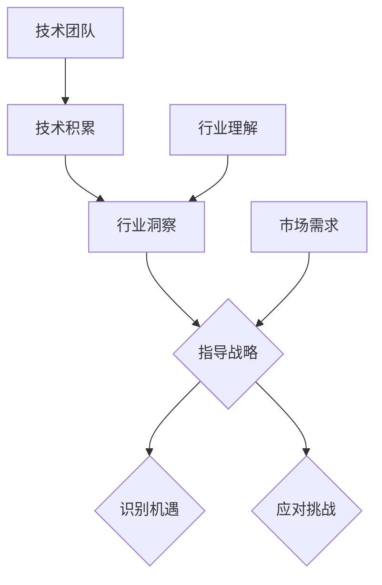

                 

# 文章标题

## AI创业团队成长之路：技术积累与行业洞察并重

关键词：AI创业，技术积累，行业洞察，成长路径，团队建设

摘要：本文旨在探讨AI创业团队在成长过程中的关键要素，包括技术积累和行业洞察的并重。通过深入分析技术积累的重要性、如何构建技术团队、行业洞察的意义以及获取途径，文章为AI创业者提供了实用的指导和建议。

## 1. 背景介绍

### 1.1 AI创业的崛起

近年来，人工智能（AI）技术的迅猛发展，使得AI创业成为了一个热门领域。根据市场研究公司IDC的统计，全球人工智能市场规模预计将在2025年达到5300亿美元。AI技术的广泛应用，从自动驾驶、智能家居到金融科技、医疗健康，都为创业者提供了巨大的机遇。

### 1.2 创业挑战与机遇

然而，AI创业之路并非一帆风顺。创业者不仅需要具备强大的技术实力，还需要对行业有深刻的洞察，同时应对市场竞争、人才招聘、资金筹集等多方面的挑战。在这种情况下，如何平衡技术积累与行业洞察，成为创业团队成功的关键。

### 1.3 本文目的

本文将围绕AI创业团队成长过程中的技术积累与行业洞察展开讨论，旨在为创业者提供以下方面的指导：

1. 技术积累的重要性与具体做法；
2. 如何构建高效的技术团队；
3. 行业洞察的意义及其获取途径；
4. 技术积累与行业洞察的相互关系及其在实际操作中的应用。

## 2. 核心概念与联系

### 2.1 技术积累

#### 2.1.1 技术积累的定义

技术积累是指在一个领域内，通过不断的学习、实践和总结，积累和掌握相关的技术知识、技能和经验。

#### 2.1.2 技术积累的重要性

1. **提升竞争力**：技术积累可以帮助创业团队在市场竞争中脱颖而出，提供更具创新性和竞争力的产品或服务。
2. **降低风险**：充分的技术积累可以降低创业过程中的技术风险，提高项目的成功率。
3. **团队凝聚力**：共同的技术积累可以增强团队凝聚力，提高团队协作效率。

### 2.2 行业洞察

#### 2.2.1 行业洞察的定义

行业洞察是指对某个行业的发展趋势、市场环境、竞争态势以及潜在机会的深刻理解和敏锐洞察。

#### 2.2.2 行业洞察的重要性

1. **指导战略决策**：行业洞察可以帮助创业团队制定更加科学、合理的战略规划，提高决策的准确性。
2. **识别机遇**：行业洞察可以帮助创业团队发现市场中的潜在机会，把握行业变革的节奏。
3. **应对挑战**：行业洞察可以帮助创业团队更好地应对行业内的各种挑战，提高市场适应性。

### 2.3 技术积累与行业洞察的相互关系

技术积累和行业洞察是相辅相成的。一方面，技术积累为行业洞察提供了基础，使得创业团队能够从技术角度理解行业的发展趋势。另一方面，行业洞察可以帮助技术团队更准确地把握市场需求，将技术积累转化为实际应用。

### 2.4 Mermaid 流程图

以下是技术积累与行业洞察相互关系的一个简化的Mermaid流程图：



## 3. 核心算法原理 & 具体操作步骤

### 3.1 技术积累的核心算法原理

#### 3.1.1 学习与迭代

技术积累的核心在于不断的学习与迭代。通过阅读相关文献、参加技术研讨会、实践项目等多种方式，不断更新和扩充技术知识库。

#### 3.1.2 分享与协作

技术积累不仅仅是个人行为，更是团队协作的结果。通过内部技术分享、代码评审、项目合作等方式，实现团队内的知识共享和技能互补。

#### 3.1.3 实践与总结

技术积累需要通过实践来验证和提升。在具体项目中，不断总结经验教训，提炼出可复用的技术和解决方案。

### 3.2 技术积累的具体操作步骤

#### 3.2.1 设定学习目标

创业团队可以根据自身的业务需求和发展方向，设定具体的学习目标，如深度学习、计算机视觉、自然语言处理等。

#### 3.2.2 制定学习计划

为了确保学习目标的实现，团队需要制定详细的学习计划，包括学习内容、时间安排、责任人等。

#### 3.2.3 实践项目

通过参与实际项目，将所学知识应用于解决实际问题，提高技术实践能力。

#### 3.2.4 总结与分享

在项目实践中，团队需要不断总结经验教训，并将成果进行分享，以促进团队整体的技术水平提升。

## 4. 数学模型和公式 & 详细讲解 & 举例说明

### 4.1 技术积累的数学模型

#### 4.1.1 技能树模型

技能树模型是一种描述技术积累的数学模型，它将技术知识看作是一棵树，每个节点代表一个具体的技术点，节点之间的边表示技术的关联性。

#### 4.1.2 技能树模型的应用

通过技能树模型，创业团队可以更清晰地了解自身的知识结构，发现薄弱环节，制定针对性的学习计划。

### 4.2 行业洞察的数学模型

#### 4.2.1 SWOT分析模型

SWOT分析模型是一种常用的行业洞察工具，它通过分析企业的优势（Strengths）、劣势（Weaknesses）、机会（Opportunities）和威胁（Threats），帮助企业制定战略规划。

#### 4.2.2 SWOT分析模型的应用

通过SWOT分析，创业团队可以全面了解自身在市场中的地位，明确发展方向，制定有效的市场策略。

### 4.3 举例说明

#### 4.3.1 技术积累的例子

假设创业团队在深度学习领域进行了技术积累，通过阅读文献、实践项目、参加研讨会等方式，掌握了卷积神经网络（CNN）、循环神经网络（RNN）等核心技术。

#### 4.3.2 行业洞察的例子

通过SWOT分析，团队发现当前市场上深度学习技术在图像识别领域的应用潜力巨大，但同时也面临技术门槛高、市场推广难等挑战。

## 5. 项目实践：代码实例和详细解释说明

### 5.1 开发环境搭建

#### 5.1.1 环境配置

在开发AI应用时，需要搭建一个适合的编程环境。通常包括操作系统（如Ubuntu）、编程语言（如Python）、深度学习框架（如TensorFlow或PyTorch）等。

#### 5.1.2 环境配置步骤

1. 安装操作系统：下载并安装Ubuntu 20.04或更高版本。
2. 安装Python：使用包管理器（如apt）安装Python 3及其相关依赖。
3. 安装深度学习框架：使用pip命令安装TensorFlow或PyTorch。

### 5.2 源代码详细实现

#### 5.2.1 数据预处理

```python
import numpy as np
import pandas as pd

# 读取数据
data = pd.read_csv('data.csv')

# 数据清洗
data = data.dropna()

# 数据分割
train_data, test_data = train_test_split(data, test_size=0.2)
```

#### 5.2.2 模型构建

```python
import tensorflow as tf

# 构建模型
model = tf.keras.Sequential([
    tf.keras.layers.Dense(128, activation='relu', input_shape=(input_shape,)),
    tf.keras.layers.Dropout(0.2),
    tf.keras.layers.Dense(1)
])

# 编译模型
model.compile(optimizer='adam', loss='binary_crossentropy', metrics=['accuracy'])
```

#### 5.2.3 训练与评估

```python
# 训练模型
history = model.fit(train_data, epochs=10, validation_data=test_data)

# 评估模型
test_loss, test_acc = model.evaluate(test_data)
print(f"Test accuracy: {test_acc}")
```

### 5.3 代码解读与分析

#### 5.3.1 数据预处理

数据预处理是AI项目的重要环节，包括数据清洗、数据分割等步骤。确保数据的准确性和完整性对于后续模型的训练和评估至关重要。

#### 5.3.2 模型构建

模型构建是AI项目的核心，通过定义神经网络结构、选择合适的激活函数和损失函数，构建出一个能够解决特定问题的模型。

#### 5.3.3 训练与评估

模型的训练和评估是验证模型性能的关键步骤。通过多次迭代训练和评估，调整模型参数，以达到最佳性能。

### 5.4 运行结果展示

#### 5.4.1 训练过程可视化

```python
import matplotlib.pyplot as plt

# 绘制训练过程
plt.plot(history.history['accuracy'])
plt.plot(history.history['val_accuracy'])
plt.title('Model accuracy')
plt.ylabel('Accuracy')
plt.xlabel('Epoch')
plt.legend(['Train', 'Test'], loc='upper left')
plt.show()
```

#### 5.4.2 评估结果

通过可视化结果，我们可以看到模型的训练过程和评估结果。如果模型性能达到预期，则可以继续进行下一步的应用开发。

## 6. 实际应用场景

### 6.1 自动驾驶

自动驾驶是AI技术的重要应用领域。通过深度学习和计算机视觉技术，自动驾驶系统能够实时感知周围环境，做出安全的驾驶决策。

### 6.2 医疗健康

AI技术在医疗健康领域的应用日益广泛，如疾病诊断、医疗影像分析、药物研发等。通过AI技术，可以提高医疗服务的效率和质量。

### 6.3 金融科技

金融科技（FinTech）是AI技术的重要应用场景之一。例如，利用AI技术进行风险评估、智能投顾、反欺诈等，可以提高金融服务的安全性和便捷性。

### 6.4 教育科技

AI技术在教育科技领域的应用，如智能教育平台、个性化学习推荐系统等，可以提高教学效果和学习体验。

## 7. 工具和资源推荐

### 7.1 学习资源推荐

- **书籍**：《人工智能：一种现代方法》（第二版）、《深度学习》（Goodfellow et al.）
- **论文**：ACL、ICML、NIPS等顶级会议的论文集。
- **博客**：AI科技大本营、机器之心等。

### 7.2 开发工具框架推荐

- **深度学习框架**：TensorFlow、PyTorch、Keras。
- **编程语言**：Python、Java。
- **版本控制**：Git。

### 7.3 相关论文著作推荐

- **论文**：《深度学习》（Ian Goodfellow, Yann LeCun, and Yoshua Bengio）、《强化学习：一种现代方法》（Richard S. Sutton and Andrew G. Barto）。
- **书籍**：《人工智能：一种现代方法》（Stuart J. Russell and Peter Norvig）。

## 8. 总结：未来发展趋势与挑战

### 8.1 发展趋势

1. **AI技术的普及化**：随着AI技术的不断成熟，越来越多的行业和企业将采用AI技术，推动AI技术的普及化。
2. **跨学科的融合**：AI技术与其他领域的深度融合，如生物技术、材料科学等，将催生新的技术突破和产业变革。
3. **数据隐私和安全**：随着数据隐私和安全的关注度提升，如何在确保数据隐私和安全的前提下应用AI技术，将成为一个重要议题。

### 8.2 挑战

1. **技术突破**：AI技术在算法、硬件、应用场景等方面仍面临诸多技术挑战，需要持续的研究和创新。
2. **人才培养**：随着AI技术的快速发展，对AI专业人才的需求急剧增加，如何培养和吸引优秀的人才，成为创业者面临的一大挑战。
3. **伦理和社会问题**：AI技术的发展和应用，涉及到伦理和社会问题，如隐私保护、算法公平性等，需要全社会共同关注和解决。

## 9. 附录：常见问题与解答

### 9.1 Q：如何快速积累技术？

A：快速积累技术的方法包括：

1. **系统学习**：选择一本经典的教材或在线课程，系统地学习基础知识。
2. **实践项目**：参与实际项目，将理论知识应用于解决实际问题。
3. **交流合作**：与同行交流，分享经验和教训，互相学习。

### 9.2 Q：如何获取行业洞察？

A：获取行业洞察的方法包括：

1. **市场调研**：通过市场调研，了解行业趋势、市场需求和竞争态势。
2. **阅读报告**：阅读行业报告、白皮书等，获取行业权威观点和数据。
3. **参与会议**：参加行业会议、研讨会等，与业内专家交流，了解最新动态。

## 10. 扩展阅读 & 参考资料

### 10.1 扩展阅读

- **书籍**：《AI超决定：人工智能时代的生活、工作与思维》、《智能时代：大数据与机器学习改变世界》。
- **论文**：NIPS、ICML、ACL等顶级会议的论文集。
- **博客**：AI科技大本营、机器之心等。

### 10.2 参考资料

- **网站**：机器之心、AI科技大本营、深度学习网。
- **社区**：GitHub、Stack Overflow。
- **论坛**：CSDN、知乎。

### 10.3 参考文献列表

- Ian Goodfellow, Yann LeCun, and Yoshua Bengio. "Deep Learning." MIT Press, 2016.
- Richard S. Sutton and Andrew G. Barto. "Reinforcement Learning: An Introduction." MIT Press, 2018.
- Stuart J. Russell and Peter Norvig. "Artificial Intelligence: A Modern Approach." Pearson, 2016.

<|im_sep|># 作者署名

作者：禅与计算机程序设计艺术 / Zen and the Art of Computer Programming<|im_sep|>

