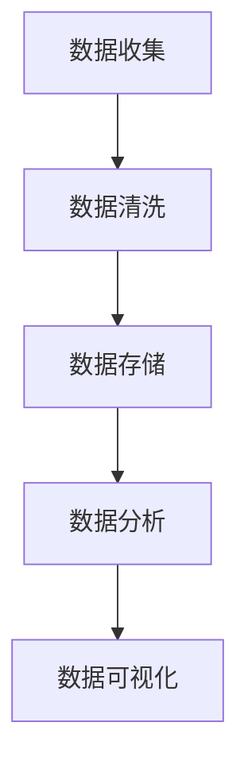

                 

# AI创业：数据管理与商业成功

## 概述

关键词：AI创业、数据管理、商业成功、策略、挑战

随着人工智能（AI）技术的飞速发展，越来越多的初创公司投身于这一领域，希望通过创新的AI解决方案改变世界。然而，成功并不仅仅依赖于先进的技术，数据管理和商业策略同样至关重要。本文将探讨AI创业公司在数据管理方面的关键挑战和策略，以及如何通过有效的数据管理实现商业成功。

## 背景介绍

在当今数字化时代，数据已经成为企业最重要的资产之一。AI创业公司也不例外，它们依赖海量数据来训练和优化模型，从而提供高质量的服务和产品。然而，数据管理的复杂性不断增加，给初创公司带来了巨大的挑战。首先，数据质量是一个关键问题。如果数据不准确、不完整或不一致，模型的表现将会大打折扣。其次，数据隐私和安全也是必须考虑的因素。随着数据隐私法规的日益严格，AI创业公司需要确保遵守相关法律法规，以避免潜在的法律风险。

## 核心概念与联系

### 2.1 数据管理的重要性

数据管理是指对企业数据的组织、存储、处理和分析的一系列活动。对于AI创业公司来说，有效的数据管理是实现商业成功的基础。它不仅关乎数据的可用性和完整性，还包括数据的可扩展性和安全性。

### 2.2 数据管理流程

一个典型的数据管理流程包括以下几个关键步骤：

- **数据收集**：从各种来源收集原始数据。
- **数据清洗**：处理数据中的错误、缺失和冗余信息。
- **数据存储**：将清洗后的数据存储在合适的数据库或数据仓库中。
- **数据分析和挖掘**：使用统计方法和机器学习技术从数据中提取有价值的信息。
- **数据可视化**：将分析结果通过图表、仪表板等形式呈现给决策者。

### 2.3 数据管理架构

一个高效的数据管理架构通常包括以下几个组成部分：

- **数据源**：包括内部数据库、外部API、日志文件等。
- **数据存储**：例如关系型数据库（如MySQL）、NoSQL数据库（如MongoDB）和云存储服务。
- **数据管道**：用于数据传输、转换和加载的流程。
- **数据处理引擎**：例如Hadoop、Spark等大数据处理框架。
- **数据可视化工具**：用于数据分析和报告的工具，如Tableau、PowerBI等。

下面是一个简单的Mermaid流程图，展示了数据管理的基本流程：



## 核心算法原理 & 具体操作步骤

### 3.1 数据清洗算法

数据清洗是数据管理流程中的关键步骤。常见的清洗算法包括：

- **缺失值处理**：可以使用均值、中位数、众数等方法来填充缺失值，或者删除含有缺失值的记录。
- **异常值检测**：可以使用统计学方法（如箱线图、Z-score等）来检测异常值，并进行处理。
- **重复记录删除**：删除重复的数据记录，确保数据的一致性。

### 3.2 数据存储算法

数据存储的选择取决于数据的类型、规模和访问模式。常见的存储算法包括：

- **关系型数据库**：适用于结构化数据，如MySQL、PostgreSQL等。
- **NoSQL数据库**：适用于非结构化或半结构化数据，如MongoDB、Cassandra等。
- **云存储服务**：适用于大规模数据存储和备份，如AWS S3、Google Cloud Storage等。

### 3.3 数据分析与挖掘算法

数据分析与挖掘算法包括：

- **统计分析**：如回归分析、聚类分析等，用于发现数据中的模式和关系。
- **机器学习算法**：如决策树、随机森林、支持向量机等，用于构建预测模型。
- **深度学习算法**：如神经网络、卷积神经网络等，用于复杂模式识别和预测。

## 数学模型和公式 & 详细讲解 & 举例说明

### 4.1 统计分析模型

回归分析是数据分析中最常用的方法之一。其基本公式如下：

$$
Y = \beta_0 + \beta_1X_1 + \beta_2X_2 + ... + \beta_nX_n + \epsilon
$$

其中，\(Y\) 是因变量，\(X_1, X_2, ..., X_n\) 是自变量，\(\beta_0, \beta_1, ..., \beta_n\) 是回归系数，\(\epsilon\) 是误差项。

举例来说，假设我们要分析房价与面积、地段等因素的关系。我们可以使用线性回归模型来预测房价：

$$
房价 = \beta_0 + \beta_1面积 + \beta_2地段 + \epsilon
$$

通过收集历史数据，我们可以计算出回归系数，然后使用模型来预测新的房价。

### 4.2 机器学习模型

决策树是一种常见的机器学习模型。其基本原理是使用一系列规则来将数据划分为不同的类别或数值。决策树的构建过程如下：

1. **选择特征**：选择一个特征进行划分，使得数据集的纯度最大化。
2. **划分数据**：使用所选特征将数据集划分为两个子集，一个包含小于阈值的部分，另一个包含大于等于阈值的部分。
3. **递归调用**：对每个子集重复上述过程，直到达到停止条件。

例如，我们可以使用决策树来分类不同类型的水果：

- **特征**：重量和颜色
- **规则**：
  - 如果重量小于100克，则继续判断颜色
  - 如果颜色是红色，则分类为草莓
  - 如果颜色是绿色，则分类为青提

通过递归调用，我们可以构建出一个完整的决策树。

### 4.3 深度学习模型

深度学习模型，特别是卷积神经网络（CNN），在图像识别领域取得了显著的成功。其基本结构包括：

- **卷积层**：用于提取图像中的特征。
- **池化层**：用于降低特征图的维度，减少计算量。
- **全连接层**：用于分类或回归。

举例来说，我们可以使用CNN来识别手写数字。首先，我们使用卷积层提取图像中的边缘和纹理特征，然后通过池化层降低特征图的维度，最后通过全连接层进行分类。

## 项目实践：代码实例和详细解释说明

### 5.1 开发环境搭建

在开始实践之前，我们需要搭建一个开发环境。这里我们使用Python和Jupyter Notebook作为主要工具。

1. **安装Python**：下载并安装Python 3.x版本。
2. **安装Jupyter Notebook**：在命令行中运行`pip install notebook`。
3. **启动Jupyter Notebook**：在命令行中运行`jupyter notebook`。

### 5.2 源代码详细实现

下面是一个简单的Python代码示例，用于清洗和预处理数据。

```python
import pandas as pd
from sklearn.model_selection import train_test_split
from sklearn.preprocessing import StandardScaler

# 加载数据
data = pd.read_csv('data.csv')

# 数据清洗
data.dropna(inplace=True)
data.drop_duplicates(inplace=True)

# 划分特征和标签
X = data.drop('target', axis=1)
y = data['target']

# 划分训练集和测试集
X_train, X_test, y_train, y_test = train_test_split(X, y, test_size=0.2, random_state=42)

# 数据标准化
scaler = StandardScaler()
X_train_scaled = scaler.fit_transform(X_train)
X_test_scaled = scaler.transform(X_test)
```

### 5.3 代码解读与分析

这段代码首先加载数据集，然后进行数据清洗，包括删除缺失值和重复值。接下来，我们将数据集划分为特征和标签两部分。然后，使用`train_test_split`函数将数据集划分为训练集和测试集。最后，我们使用`StandardScaler`对特征进行标准化处理，以便于后续的机器学习模型训练。

### 5.4 运行结果展示

运行上述代码后，我们得到清洗后的数据集和标准化的特征。接下来，我们可以使用机器学习模型对数据进行训练和预测。

```python
from sklearn.tree import DecisionTreeClassifier
from sklearn.metrics import accuracy_score

# 训练决策树模型
clf = DecisionTreeClassifier()
clf.fit(X_train_scaled, y_train)

# 预测测试集
y_pred = clf.predict(X_test_scaled)

# 计算准确率
accuracy = accuracy_score(y_test, y_pred)
print(f'Accuracy: {accuracy:.2f}')
```

运行上述代码后，我们得到测试集的准确率。这个准确率可以作为评估模型性能的一个指标。

## 实际应用场景

### 6.1 金融领域

在金融领域，AI创业公司可以通过数据管理来实现风险控制和投资策略优化。例如，通过分析历史交易数据，可以识别出潜在的欺诈行为，从而降低风险。

### 6.2 医疗健康

在医疗健康领域，数据管理可以帮助AI创业公司开发和优化疾病预测和诊断模型。例如，通过分析患者的历史病历和实验室检测结果，可以预测某种疾病的患病风险。

### 6.3 零售电商

在零售电商领域，数据管理可以帮助AI创业公司实现个性化推荐和客户行为分析。例如，通过分析用户的浏览和购买记录，可以推荐相关的商品，提高销售额。

## 工具和资源推荐

### 6.1 学习资源推荐

- **书籍**：
  - 《数据科学入门》（Hands-On Data Science with R）
  - 《机器学习实战》（Machine Learning in Action）
- **论文**：
  - “Deep Learning” by Ian Goodfellow, Yoshua Bengio, and Aaron Courville
  - “Big Data: A Revolution That Will Transform How We Live, Work, and Think” by Viktor Mayer-Schönberger and Kenneth Cukier
- **博客**：
  - Towards Data Science
  - Medium上的数据科学和机器学习专题
- **网站**：
  - Kaggle
  - Coursera

### 6.2 开发工具框架推荐

- **编程语言**：Python、R、Java
- **数据处理**：Pandas、NumPy、SciPy
- **机器学习框架**：Scikit-learn、TensorFlow、PyTorch
- **大数据处理**：Hadoop、Spark、Flink

### 6.3 相关论文著作推荐

- “Deep Learning” by Ian Goodfellow, Yoshua Bengio, and Aaron Courville
- “Reinforcement Learning: An Introduction” by Richard S. Sutton and Andrew G. Barto
- “Data Science from Scratch: First Principles with Python” by Joel Grus

## 总结：未来发展趋势与挑战

### 7.1 数据管理技术的发展趋势

- **自动化数据清洗**：随着人工智能技术的发展，自动化数据清洗工具将变得更加成熟，可以帮助创业者更高效地进行数据处理。
- **实时数据管理**：随着大数据和实时数据流处理技术的进步，实时数据管理将成为AI创业公司的重要需求。
- **联邦学习**：联邦学习（Federated Learning）可以帮助AI创业公司在保护用户隐私的同时共享数据，为未来的数据管理带来新的机遇。

### 7.2 数据管理面临的挑战

- **数据隐私和安全**：随着数据隐私法规的日益严格，AI创业公司需要投入更多资源和精力来确保数据的安全和合规。
- **数据质量问题**：高质量的数据是AI模型成功的基石。AI创业公司需要不断优化数据质量，确保模型能够准确预测和决策。
- **人才短缺**：数据科学和机器学习领域的人才短缺将继续是AI创业公司面临的一大挑战。招聘和培养高素质的数据科学家和工程师是创业成功的关键。

## 附录：常见问题与解答

### 8.1 什么是数据管理？

数据管理是指对企业数据的组织、存储、处理和分析的一系列活动。它包括数据收集、数据清洗、数据存储、数据分析和数据可视化等步骤。

### 8.2 数据管理的重要性是什么？

有效的数据管理是AI创业公司实现商业成功的基础。它不仅关乎数据的可用性和完整性，还包括数据的可扩展性和安全性。

### 8.3 如何确保数据隐私和安全？

确保数据隐私和安全的方法包括：使用加密技术、遵守数据隐私法规、采用数据匿名化技术和建立严格的数据访问控制机制。

### 8.4 数据管理中常用的算法有哪些？

数据管理中常用的算法包括缺失值处理、异常值检测、数据标准化、回归分析、决策树和卷积神经网络等。

## 扩展阅读 & 参考资料

- **书籍**：
  - 《数据科学入门》（Hands-On Data Science with R）
  - 《机器学习实战》（Machine Learning in Action）
- **论文**：
  - “Deep Learning” by Ian Goodfellow, Yoshua Bengio, and Aaron Courville
  - “Big Data: A Revolution That Will Transform How We Live, Work, and Think” by Viktor Mayer-Schönberger and Kenneth Cukier
- **博客**：
  - Towards Data Science
  - Medium上的数据科学和机器学习专题
- **网站**：
  - Kaggle
  - Coursera
- **在线课程**：
  - 《深度学习》（Deep Learning Specialization）由Andrew Ng教授在Coursera提供
  - 《机器学习基础》（Machine Learning Foundations）由Chad Myrie教授在Coursera提供
- **社交媒体**：
  - Twitter上的数据科学和机器学习专题标签（#DataScience #MachineLearning）
  - LinkedIn上的数据科学和机器学习专业群组

作者：禅与计算机程序设计艺术 / Zen and the Art of Computer Programming<|im_sep|>

