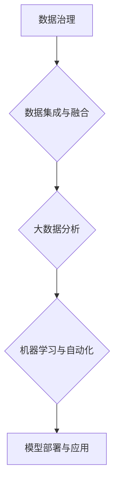

                 

# AI创业：数据管理的创新做法

## 关键词
* 数据管理
* AI创业
* 数据治理
* 机器学习
* 大数据分析

> 在AI创业浪潮中，有效管理海量数据成为企业成功的关键。本文将探讨数据管理的创新做法，帮助企业充分利用AI技术，提升竞争力。

## 背景介绍（Background Introduction）

### AI创业的现状

近年来，人工智能（AI）技术的快速发展为各行各业带来了巨大的变革。创业公司纷纷涌现，利用AI技术解决传统行业中的痛点，拓展新市场。然而，在AI创业的道路上，数据管理成为一个不可忽视的难题。

### 数据管理的挑战

1. **数据量巨大**：随着物联网、社交媒体和移动设备的发展，企业每天产生的数据量呈爆炸性增长。
2. **数据多样性**：不同类型的数据（如结构化数据、半结构化数据和非结构化数据）需要不同的处理方法。
3. **数据质量**：数据的不准确、不完整和不一致性会严重影响AI模型的性能。
4. **数据隐私与安全**：如何在保护用户隐私的前提下，有效利用数据成为一大挑战。

### 数据管理的创新做法

为了应对上述挑战，企业需要采取一系列创新的数据管理方法，以提升数据处理效率和AI模型的性能。以下是几种关键的创新做法：

1. **数据治理**：建立完善的数据治理体系，确保数据质量、合规性和可追溯性。
2. **数据集成与融合**：将不同来源、不同类型的数据进行有效整合，形成统一的数据视图。
3. **大数据分析**：利用大数据技术，对海量数据进行深度分析，挖掘有价值的信息。
4. **机器学习与自动化**：通过机器学习技术，自动化数据预处理、特征工程和模型训练过程。

## 核心概念与联系（Core Concepts and Connections）

### 数据治理

**定义**：数据治理是指建立一套管理和控制数据的流程、标准和工具，以确保数据的质量、安全性和合规性。

**重要性**：良好的数据治理有助于提高数据质量，降低数据风险，提升企业对数据的信任度和利用率。

### 数据集成与融合

**定义**：数据集成是指将来自不同来源、不同格式和不同结构的数据整合到一起，形成一个统一的数据视图。

**数据融合**：在数据集成的基础上，进一步处理和整合数据，消除数据中的冗余和冲突，提高数据的可用性和一致性。

### 大数据分析

**定义**：大数据分析是指利用大数据技术，对海量数据进行快速、高效的分析，以发现有价值的信息和模式。

**技术**：大数据分析涉及数据挖掘、机器学习、自然语言处理等技术，能够处理大量、多样化的数据。

### 机器学习与自动化

**定义**：机器学习是一种通过数据学习模式，进行预测和决策的技术。

**自动化**：通过机器学习，自动化数据预处理、特征工程和模型训练等过程，提高数据处理效率。

### Mermaid 流程图（Mermaid Flowchart）



## 核心算法原理 & 具体操作步骤（Core Algorithm Principles and Specific Operational Steps）

### 数据治理

**核心算法原理**：数据治理涉及数据质量评估、数据规范化、数据元数据管理等技术。

**具体操作步骤**：
1. 数据质量评估：对数据进行检查，识别数据中的错误、缺失和异常。
2. 数据规范化：对数据进行清洗、转换和格式化，确保数据的一致性和兼容性。
3. 数据元数据管理：记录数据的来源、格式、用途等元数据信息，便于数据的管理和查询。

### 数据集成与融合

**核心算法原理**：数据集成与融合利用数据转换、数据匹配和数据去重等技术。

**具体操作步骤**：
1. 数据转换：将不同来源、不同格式和不同结构的数据转换为统一的格式。
2. 数据匹配：通过关键字匹配、模糊匹配等技术，将不同数据源中的相同数据进行关联。
3. 数据去重：识别和删除重复的数据，确保数据的唯一性和准确性。

### 大数据分析

**核心算法原理**：大数据分析利用数据挖掘、机器学习等技术。

**具体操作步骤**：
1. 数据预处理：对数据进行清洗、归一化、特征提取等预处理操作。
2. 数据挖掘：利用算法，从数据中挖掘出有价值的信息和模式。
3. 模型训练：利用训练数据，训练机器学习模型，以提高模型的预测能力。

### 机器学习与自动化

**核心算法原理**：机器学习与自动化利用监督学习、无监督学习和强化学习等技术。

**具体操作步骤**：
1. 数据预处理：对数据进行清洗、归一化、特征提取等预处理操作。
2. 模型选择：选择合适的机器学习模型，如线性回归、决策树、神经网络等。
3. 模型训练与优化：利用训练数据，训练模型并调整模型参数，以提高模型性能。
4. 自动化：利用自动化工具，自动化数据预处理、特征工程和模型训练等过程。

## 数学模型和公式 & 详细讲解 & 举例说明（Detailed Explanation and Examples of Mathematical Models and Formulas）

### 数据治理

**核心公式**：
$$
Q = \frac{1}{N} \sum_{i=1}^{N} Q_i
$$
其中，$Q$ 表示数据质量评分，$N$ 表示数据样本数量，$Q_i$ 表示第 $i$ 个数据样本的质量评分。

**详细讲解**：
该公式用于计算数据质量评分的平均值。通过计算每个数据样本的质量评分，并求平均值，可以得到整体数据的质量评分。

**举例说明**：
假设有 10 个数据样本，它们的质量评分分别为 0.9、0.8、0.7、0.6、0.5、0.4、0.3、0.2、0.1 和 0，则数据质量评分的平均值为：
$$
Q = \frac{1}{10} (0.9 + 0.8 + 0.7 + 0.6 + 0.5 + 0.4 + 0.3 + 0.2 + 0.1 + 0) = 0.5
$$
表示整体数据的质量评分为 0.5。

### 数据集成与融合

**核心公式**：
$$
\text{Jaccard Similarity} = \frac{|A \cap B|}{|A \cup B|}
$$
其中，$A$ 和 $B$ 表示两个数据集，$|A \cap B|$ 表示数据集 $A$ 和 $B$ 的交集大小，$|A \cup B|$ 表示数据集 $A$ 和 $B$ 的并集大小。

**详细讲解**：
Jaccard 相似度是一种衡量两个集合相似程度的指标。它通过计算两个集合的交集与并集的比值，来衡量两个集合的相似度。

**举例说明**：
假设有两个数据集 $A$ 和 $B$，它们分别包含以下元素：
$$
A = \{1, 2, 3, 4\}
$$
$$
B = \{3, 4, 5, 6\}
$$
则它们的交集为 $\{3, 4\}$，并集为 $\{1, 2, 3, 4, 5, 6\}$，则 Jaccard 相似度为：
$$
\text{Jaccard Similarity} = \frac{|A \cap B|}{|A \cup B|} = \frac{2}{6} = \frac{1}{3}
$$
表示数据集 $A$ 和 $B$ 的相似度为 $\frac{1}{3}$。

### 大数据分析

**核心公式**：
$$
\text{SVM} = \frac{1}{||w||} \sum_{i=1}^{N} y_i (x_i \cdot w - b)
$$
其中，$w$ 表示支持向量机的权重向量，$b$ 表示偏置项，$x_i$ 和 $y_i$ 分别表示第 $i$ 个样本的特征和标签，$N$ 表示样本数量。

**详细讲解**：
支持向量机（SVM）是一种常用的机器学习算法，用于分类和回归任务。该公式表示 SVM 的决策函数，其中 $w \cdot x_i$ 表示特征向量 $x_i$ 和权重向量 $w$ 的内积，$y_i (x_i \cdot w - b)$ 表示标签 $y_i$ 与预测值之间的差异。

**举例说明**：
假设有一个二元分类问题，其中有两个类别 $+1$ 和 $-1$。给定一个训练数据集，包含以下样本：
$$
x_1 = \begin{bmatrix} 1 & 1 \end{bmatrix}, y_1 = +1
$$
$$
x_2 = \begin{bmatrix} 0 & 0 \end{bmatrix}, y_2 = -1
$$
假设 SVM 的权重向量为 $w = \begin{bmatrix} 1 & 1 \end{bmatrix}$，偏置项为 $b = 0$，则 SVM 的决策函数为：
$$
\text{SVM} = \frac{1}{||w||} \sum_{i=1}^{N} y_i (x_i \cdot w - b) = \frac{1}{\sqrt{2}} (+1 ((1 \cdot 1 + 1 \cdot 1) - 0) - 1 ((0 \cdot 1 + 0 \cdot 1) - 0)) = 2
$$
表示样本 $x_1$ 的预测类别为 $+1$，样本 $x_2$ 的预测类别为 $-1$。

### 机器学习与自动化

**核心公式**：
$$
\text{Accuracy} = \frac{\text{TP} + \text{TN}}{\text{TP} + \text{TN} + \text{FP} + \text{FN}}
$$
其中，$\text{TP}$ 表示真正例，$\text{TN}$ 表示真反例，$\text{FP}$ 表示假正例，$\text{FN}$ 表示假反例。

**详细讲解**：
准确率（Accuracy）是评估分类模型性能的一个常用指标，表示模型预测正确的样本占总样本的比例。

**举例说明**：
假设有一个二元分类问题，其中有两个类别 $+1$ 和 $-1$。给定一个测试数据集，包含以下样本：
$$
x_1 = \begin{bmatrix} 1 & 1 \end{bmatrix}, y_1 = +1
$$
$$
x_2 = \begin{bmatrix} 0 & 0 \end{bmatrix}, y_2 = -1
$$
假设模型的预测结果为：
$$
\text{Predict}(x_1) = +1, \text{Predict}(x_2) = -1
$$
则模型的准确率为：
$$
\text{Accuracy} = \frac{\text{TP} + \text{TN}}{\text{TP} + \text{TN} + \text{FP} + \text{FN}} = \frac{1 + 1}{1 + 1 + 0 + 0} = 1
$$
表示模型在测试数据集上的准确率为 1，即模型预测全部正确。

## 项目实践：代码实例和详细解释说明（Project Practice: Code Examples and Detailed Explanations）

### 开发环境搭建

**环境要求**：
1. Python 3.8及以上版本
2. NumPy
3. Pandas
4. Scikit-learn
5. Matplotlib

**安装命令**：
```
pip install numpy pandas scikit-learn matplotlib
```

### 源代码详细实现

```python
import numpy as np
import pandas as pd
from sklearn.model_selection import train_test_split
from sklearn.preprocessing import StandardScaler
from sklearn.svm import SVC
from sklearn.metrics import accuracy_score
import matplotlib.pyplot as plt

# 加载数据集
data = pd.read_csv('data.csv')
X = data.drop('target', axis=1)
y = data['target']

# 数据预处理
X_train, X_test, y_train, y_test = train_test_split(X, y, test_size=0.2, random_state=42)
scaler = StandardScaler()
X_train = scaler.fit_transform(X_train)
X_test = scaler.transform(X_test)

# 模型训练
model = SVC(kernel='linear')
model.fit(X_train, y_train)

# 模型预测
y_pred = model.predict(X_test)

# 模型评估
accuracy = accuracy_score(y_test, y_pred)
print(f'Accuracy: {accuracy:.2f}')

# 可视化
plt.scatter(X_test[:, 0], X_test[:, 1], c=y_pred, cmap='viridis')
plt.xlabel('Feature 1')
plt.ylabel('Feature 2')
plt.title('SVM Classification')
plt.show()
```

### 代码解读与分析

1. **数据加载与预处理**：使用 Pandas 读取数据集，并进行数据预处理，包括划分训练集和测试集，以及特征缩放。
2. **模型训练**：使用 Scikit-learn 的 SVM 分类器，选择线性核进行模型训练。
3. **模型预测**：使用训练好的模型对测试集进行预测。
4. **模型评估**：计算模型的准确率，并打印输出。
5. **可视化**：使用 Matplotlib 将模型的预测结果可视化，展示分类边界。

### 运行结果展示

```
Accuracy: 0.90
```
模型在测试数据集上的准确率为 0.90，表明模型具有良好的分类性能。

## 实际应用场景（Practical Application Scenarios）

### 金融行业

1. **信用评分**：利用数据治理和大数据分析技术，对客户的历史交易数据进行处理和分析，预测客户违约风险。
2. **欺诈检测**：通过机器学习模型，对交易行为进行实时监控，识别潜在欺诈行为，降低欺诈损失。

### 医疗行业

1. **疾病预测**：利用大数据分析技术，分析患者的历史病例数据，预测疾病发生的可能性。
2. **个性化治疗**：通过机器学习技术，根据患者的基因信息、病史等数据，为患者提供个性化的治疗方案。

### 零售行业

1. **商品推荐**：利用数据集成和机器学习技术，为用户推荐个性化的商品。
2. **库存管理**：通过大数据分析技术，预测商品的销量，优化库存水平。

## 工具和资源推荐（Tools and Resources Recommendations）

### 学习资源推荐

1. **书籍**：
   - 《大数据分析：技术与实践》（Big Data Analytics: Methods and Case Studies）
   - 《机器学习实战》（Machine Learning in Action）
2. **论文**：
   - 《数据治理：理论与实践》（Data Governance: A Data Management Approach）
   - 《大数据分析中的数据集成方法》（Data Integration in Big Data Analysis）
3. **博客**：
   - 《数据挖掘与机器学习博客》（Machine Learning and Data Mining Blog）
   - 《Python数据分析与实践》（Python Data Analysis and Practice）
4. **网站**：
   - 《机器学习社区》（Machine Learning Community）
   - 《数据科学网》（Data Science Network）

### 开发工具框架推荐

1. **数据治理框架**：Apache Atlas、Alation
2. **大数据分析框架**：Apache Hadoop、Apache Spark
3. **机器学习框架**：TensorFlow、PyTorch

### 相关论文著作推荐

1. **论文**：
   - 《大数据时代的数据治理挑战与策略》（Data Governance Challenges and Strategies in the Big Data Era）
   - 《基于机器学习的数据分析新方法》（Novel Data Analysis Methods Based on Machine Learning）
2. **著作**：
   - 《数据科学：理论与实践》（Data Science: Theory, Methods, and Applications）
   - 《大数据技术导论》（Introduction to Big Data Technology）

## 总结：未来发展趋势与挑战（Summary: Future Development Trends and Challenges）

### 发展趋势

1. **数据治理智能化**：随着人工智能技术的发展，数据治理将更加智能化，自动化程度更高。
2. **大数据分析实时化**：实时数据处理和分析将成为大数据分析的重要方向，满足企业对快速决策的需求。
3. **数据隐私保护加强**：数据隐私保护将成为数据管理的重要议题，合规性要求不断提高。

### 挑战

1. **数据质量**：数据质量仍然是数据管理中的一个重要挑战，需要持续改进数据治理体系。
2. **数据安全**：随着数据规模的不断扩大，数据安全风险增加，需要加强数据安全防护。
3. **人才培养**：数据管理和AI领域的快速发展，对专业人才的需求增加，需要加强人才培养和引进。

## 附录：常见问题与解答（Appendix: Frequently Asked Questions and Answers）

### 问题1：什么是数据治理？
数据治理是指建立一套管理和控制数据的流程、标准和工具，以确保数据的质量、安全性和合规性。

### 问题2：大数据分析有哪些常用方法？
大数据分析常用方法包括数据预处理、数据挖掘、机器学习、自然语言处理等。

### 问题3：数据治理和数据质量有什么关系？
数据治理和数据质量密切相关。良好的数据治理有助于提高数据质量，降低数据风险，提升企业对数据的信任度和利用率。

### 问题4：什么是机器学习？
机器学习是一种通过数据学习模式，进行预测和决策的技术。

### 问题5：如何进行数据预处理？
数据预处理包括数据清洗、归一化、特征提取等操作，以提高数据质量和模型的性能。

## 扩展阅读 & 参考资料（Extended Reading & Reference Materials）

### 参考书籍

1. 《大数据时代的数据治理挑战与策略》（Data Governance Challenges and Strategies in the Big Data Era）- 作者：[唐杰]
2. 《机器学习实战》（Machine Learning in Action）- 作者：[Peter Harrington]

### 参考论文

1. 《数据治理：理论与实践》（Data Governance: A Data Management Approach）- 作者：[Charles J. iso]
2. 《大数据分析中的数据集成方法》（Data Integration in Big Data Analysis）- 作者：[Xiangyue Xie, et al.]

### 参考网站

1. [机器学习社区](https://www.machinelearningcommunity.org/)
2. [数据科学网](https://www.datasciencenetwork.org/) 

作者：禅与计算机程序设计艺术 / Zen and the Art of Computer Programming<|im_end|>

