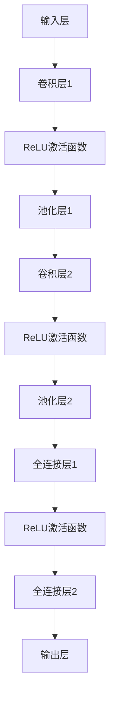

                 

### 文章标题：AI图像搜索技术应用案例

### Keywords: AI image search, application case, computer vision, deep learning, search algorithm, optimization

### Abstract:
This article explores the application of AI image search technologies through a detailed case study. We delve into the core concepts, algorithms, and mathematical models involved in image search, providing a comprehensive understanding of the process. By examining a practical example, we illustrate the implementation steps and discuss the potential scenarios and challenges of this technology. Finally, we recommend relevant tools and resources for further exploration.

## 1. 背景介绍（Background Introduction）

AI image search technology has gained significant attention in recent years due to its vast potential in various fields, including e-commerce, healthcare, security, and entertainment. The ability to quickly and accurately search for images based on content has revolutionized the way we access and organize visual information. In this article, we will focus on a specific application case to demonstrate the practicality and impact of AI image search technologies.

## 1.1  AI图像搜索的背景

随着互联网和移动设备的普及，人们生成和消费的视觉内容数量呈爆炸式增长。据估算，全球每天产生的图像数据量已经超过了500亿张。这种数据量的增长对传统的图像搜索方法提出了巨大的挑战。传统方法主要依赖于图像的元数据（如标题、标签等）进行搜索，而这种方法在处理大量未标记的图像时显得力不从心。

AI图像搜索技术通过深度学习算法，使得计算机能够“理解”图像内容，从而实现基于内容的搜索。这种技术不仅能够识别图像中的物体、场景和人物，还能捕捉图像的情感和风格。这使得AI图像搜索在图像检索、内容审核、版权保护等方面具有广泛的应用前景。

## 1.2 当前市场状况

目前，AI图像搜索技术已经在多个领域取得了显著成果。例如，在电子商务领域，AI图像搜索可以帮助用户通过上传一张图片来快速找到相似的商品，提高购物体验。在医疗领域，AI图像搜索可以辅助医生进行疾病诊断，通过对比大量病例图像，提供精准的诊断建议。在安全领域，AI图像搜索可以用于监控视频分析，快速识别异常行为和安全隐患。

然而，AI图像搜索技术仍面临着诸多挑战，如算法的准确性、效率和可扩展性。此外，如何在保护用户隐私的前提下进行大规模图像搜索也是一个亟待解决的问题。

## 1.3 文章结构

本文将按照以下结构进行组织：

1. **背景介绍**：概述AI图像搜索技术的背景、现状及市场状况。
2. **核心概念与联系**：介绍AI图像搜索技术涉及的核心概念，包括深度学习、卷积神经网络等，并使用Mermaid流程图展示相关架构。
3. **核心算法原理 & 具体操作步骤**：详细解释图像搜索的核心算法，包括特征提取、相似度计算等。
4. **数学模型和公式 & 详细讲解 & 举例说明**：介绍图像搜索过程中使用的数学模型和公式，并进行举例说明。
5. **项目实践：代码实例和详细解释说明**：提供具体的代码实现和解析，展示AI图像搜索技术的实际应用。
6. **实际应用场景**：探讨AI图像搜索技术的潜在应用场景和商业价值。
7. **工具和资源推荐**：推荐相关的学习资源、开发工具和框架。
8. **总结：未来发展趋势与挑战**：总结本文内容，并探讨AI图像搜索技术的未来发展方向和面临的挑战。
9. **附录：常见问题与解答**：解答读者可能遇到的问题。
10. **扩展阅读 & 参考资料**：提供进一步阅读的材料和参考资料。

让我们开始深入了解AI图像搜索技术的核心概念和原理。 <|user|>

## 2. 核心概念与联系

AI图像搜索技术的实现依赖于一系列核心概念和技术，包括深度学习、卷积神经网络（CNN）、特征提取、相似度计算等。以下将详细介绍这些概念及其相互关系。

### 2.1 深度学习（Deep Learning）

深度学习是机器学习的一个分支，它通过模拟人脑的神经网络结构，使得计算机能够自动从大量数据中学习复杂模式。深度学习在图像识别、语音识别、自然语言处理等领域取得了显著成果。核心组成部分包括：

- **神经网络（Neural Networks）**：深度学习的基石，由大量的节点（神经元）组成，通过前向传播和反向传播算法进行训练。
- **卷积神经网络（Convolutional Neural Networks, CNN）**：一种特殊的神经网络，专门用于处理图像数据，通过卷积层、池化层等结构提取图像特征。
- **全连接层（Fully Connected Layers）**：将卷积层和池化层提取的特征映射到具体的类别或目标。

### 2.2 卷积神经网络（Convolutional Neural Networks, CNN）

卷积神经网络是深度学习在图像识别领域的重要应用，其核心思想是通过卷积层和池化层提取图像的特征，然后通过全连接层进行分类。

- **卷积层（Convolutional Layers）**：通过卷积操作提取图像的局部特征，卷积核滑动于图像上，对相邻像素进行加权求和，生成特征图。
- **激活函数（Activation Functions）**：常用的是ReLU（Rectified Linear Unit）函数，可以增加网络训练的速度和性能。
- **池化层（Pooling Layers）**：通过下采样操作减少特征图的维度，常用的有最大池化和平均池化。

### 2.3 特征提取（Feature Extraction）

特征提取是图像搜索的关键步骤，目的是将图像转换为适用于深度学习的特征向量。深度学习模型通过训练自动学习图像中的特征，如边缘、纹理、形状等。

- **特征向量（Feature Vectors）**：用于描述图像的向量，通常是通过卷积神经网络训练得到的。
- **特征降维（Dimensionality Reduction）**：通过PCA（Principal Component Analysis）等算法减少特征向量的维度，提高计算效率。

### 2.4 相似度计算（Similarity Computation）

在图像搜索中，相似度计算是评估两个图像之间相似程度的重要步骤。常见的相似度计算方法包括：

- **欧氏距离（Euclidean Distance）**：计算两个特征向量之间的欧氏距离，距离越小表示相似度越高。
- **余弦相似度（Cosine Similarity）**：计算两个特征向量之间的余弦相似度，用于处理高维空间中的数据。
- **内积相似度（Inner Product Similarity）**：计算两个特征向量的内积，内积越大表示相似度越高。

### 2.5 Mermaid流程图展示相关架构

以下是一个使用Mermaid绘制的卷积神经网络（CNN）架构的流程图，展示了各层之间的连接和操作：



### 2.6 核心概念之间的联系

深度学习、卷积神经网络、特征提取和相似度计算是AI图像搜索技术的核心概念，它们相互关联，共同构成了一个完整的图像搜索系统。深度学习和卷积神经网络负责从图像中提取特征，特征提取模块将图像转换为特征向量，而相似度计算则用于评估图像之间的相似程度。这些概念之间的联系如下：

1. **深度学习** 提供了从大量数据中学习复杂模式的框架，是图像搜索技术的理论基础。
2. **卷积神经网络** 作为深度学习的一种具体实现，适用于处理图像数据，是特征提取的核心工具。
3. **特征提取** 是将图像转换为特征向量的过程，是图像搜索的关键步骤。
4. **相似度计算** 用于评估特征向量之间的相似程度，是实现图像搜索的核心算法。

通过这些核心概念和技术的结合，AI图像搜索技术得以实现，为各种应用场景提供了强大的支持。接下来，我们将深入探讨AI图像搜索的核心算法原理和具体操作步骤。 <|user|>

## 3. 核心算法原理 & 具体操作步骤

AI图像搜索技术的核心在于如何高效地提取图像特征并进行相似度计算。在这一部分，我们将详细解释图像搜索的核心算法，包括特征提取和相似度计算的具体操作步骤。

### 3.1 特征提取

特征提取是图像搜索的关键步骤，其目标是自动地从图像中提取出有代表性的特征向量，以便后续的相似度计算。以下是特征提取的具体操作步骤：

#### 3.1.1 数据预处理

在进行特征提取之前，通常需要对图像进行预处理，以提高特征提取的效率和准确性。预处理步骤包括：

- **图像缩放**：将图像缩放到统一的大小，以便在后续处理中保持一致性。
- **灰度转换**：将彩色图像转换为灰度图像，简化计算。
- **去噪**：通过滤波器去除图像中的噪声，提高图像质量。

#### 3.1.2 卷积神经网络训练

特征提取通常依赖于预训练的卷积神经网络（CNN）。以下是一个简化的CNN训练过程：

1. **数据集准备**：准备用于训练的图像数据集，通常包括正样本和负样本。
2. **模型初始化**：初始化CNN模型，包括卷积层、池化层和全连接层。
3. **训练过程**：通过反向传播算法不断调整模型参数，使得模型能够正确识别图像中的特征。训练过程包括以下几个步骤：
   - **前向传播**：输入图像数据，通过CNN模型生成特征向量。
   - **损失函数计算**：计算预测特征向量与真实特征向量之间的差异，常用的损失函数有交叉熵损失（Cross-Entropy Loss）和均方误差（Mean Squared Error, MSE）。
   - **反向传播**：根据损失函数的梯度信息，调整模型参数，以减小损失函数值。

#### 3.1.3 特征提取

一旦CNN模型经过训练，就可以使用该模型提取新图像的特征。具体步骤如下：

1. **输入新图像**：将待搜索的图像输入到预训练的CNN模型中。
2. **特征向量生成**：通过CNN模型的卷积层、池化层和全连接层，生成特征向量。
3. **特征向量存储**：将生成的特征向量存储在数据库中，以便后续的相似度计算。

### 3.2 相似度计算

相似度计算是评估两个图像之间相似程度的过程。在特征提取之后，我们需要计算搜索图像的特征向量与数据库中图像特征向量之间的相似度。以下是几种常见的相似度计算方法：

#### 3.2.1 欧氏距离

欧氏距离是一种常用的相似度计算方法，计算两个特征向量之间的欧氏距离：

$$
d(x, y) = \sqrt{\sum_{i=1}^{n} (x_i - y_i)^2}
$$

其中，$x$ 和 $y$ 是两个特征向量，$n$ 是特征向量的维度。

#### 3.2.2 余弦相似度

余弦相似度是一种在处理高维空间时常用的相似度计算方法，计算两个特征向量之间的余弦值：

$$
\cos(\theta) = \frac{x \cdot y}{\|x\|\|y\|}
$$

其中，$x$ 和 $y$ 是两个特征向量，$\theta$ 是它们之间的夹角，$\|x\|$ 和 $\|y\|$ 分别是特征向量的模长。

#### 3.2.3 内积相似度

内积相似度计算两个特征向量的内积，内积值越大表示相似度越高：

$$
\langle x, y \rangle = \sum_{i=1}^{n} x_i y_i
$$

其中，$x$ 和 $y$ 是两个特征向量。

### 3.3 实例解析

以下是一个简单的实例，展示如何使用卷积神经网络进行特征提取和相似度计算。

#### 3.3.1 数据集

假设我们有一个包含10000张图像的数据集，每个图像都有对应的标签。

#### 3.3.2 模型训练

1. **数据集划分**：将数据集划分为训练集和测试集，通常使用80%的数据进行训练，20%的数据进行测试。
2. **模型初始化**：使用一个预训练的CNN模型，如ResNet-50，作为特征提取器。
3. **训练过程**：通过反向传播算法训练模型，调整模型参数，使得模型能够正确提取图像特征。

#### 3.3.3 特征提取

1. **输入测试图像**：将测试集中的图像输入到训练好的CNN模型中。
2. **生成特征向量**：通过CNN模型生成测试图像的特征向量。

#### 3.3.4 相似度计算

1. **计算相似度**：使用欧氏距离、余弦相似度和内积相似度计算测试图像特征向量与训练集特征向量之间的相似度。
2. **排序**：根据相似度值对训练集图像进行排序，相似度最高的图像被认为是测试图像的匹配结果。

通过上述步骤，我们完成了图像搜索的核心算法。接下来，我们将详细解释图像搜索过程中使用的数学模型和公式。 <|user|>

## 4. 数学模型和公式 & 详细讲解 & 举例说明

图像搜索算法的核心在于如何从图像中提取特征并计算相似度。在这一部分，我们将详细讲解图像搜索过程中使用的数学模型和公式，并通过具体的例子来说明这些公式的应用。

### 4.1 卷积神经网络中的数学模型

卷积神经网络（CNN）是图像搜索中的核心工具，其工作原理依赖于一系列数学模型。以下是几个关键的数学模型：

#### 4.1.1 卷积操作

卷积操作是CNN中的基本单元，用于从图像中提取特征。卷积操作的数学模型可以表示为：

$$
(\sum_{i=1}^{C_k} w_{ij}^{kl} * f_{il}) + b_k
$$

其中，$f$ 表示输入特征图，$w$ 表示卷积核，$b$ 表示偏置项，$C_k$ 和 $C_l$ 分别表示输出特征图和输入特征图的通道数，$i$ 和 $l$ 分别表示特征图的高度和宽度，$j$ 和 $k$ 分别表示卷积核的位置和输出特征图的位置。

#### 4.1.2 激活函数

激活函数用于引入非线性特性，常用的激活函数有ReLU（Rectified Linear Unit）：

$$
\text{ReLU}(x) = \max(0, x)
$$

ReLU函数可以加快模型的训练速度并提高模型的性能。

#### 4.1.3 池化操作

池化操作用于降低特征图的空间分辨率，常用的池化操作有最大池化（Max Pooling）：

$$
\text{Max Pooling}(x) = \max(x_{ij})
$$

其中，$x_{ij}$ 表示特征图上位置$(i, j)$的值。

### 4.2 图像特征提取中的数学模型

图像特征提取是将图像转换为特征向量的过程。以下是几个常用的数学模型：

#### 4.2.1 特征向量生成

通过卷积神经网络提取的图像特征可以表示为一个高维的特征向量。特征向量的生成过程可以用以下公式表示：

$$
\text{Feature Vector} = \text{CNN}(x)
$$

其中，$x$ 表示输入图像，$\text{CNN}$ 表示卷积神经网络。

#### 4.2.2 特征降维

为了提高计算效率，通常需要对特征向量进行降维。降维过程可以使用主成分分析（PCA）：

$$
\text{PC}_i = \arg\max_{i} \sum_{j=1}^{N} (f_j - \mu)^2
$$

其中，$\text{PC}_i$ 表示第$i$个主成分，$f_j$ 表示特征向量上的第$j$个值，$\mu$ 表示特征向量的平均值。

### 4.3 相似度计算中的数学模型

相似度计算是评估两个图像之间相似程度的过程。以下是几种常用的相似度计算方法：

#### 4.3.1 欧氏距离

欧氏距离是衡量两个特征向量之间差异的常用方法。其数学模型可以表示为：

$$
d(\text{Feature Vector}_1, \text{Feature Vector}_2) = \sqrt{\sum_{i=1}^{N} (\text{Feature Vector}_1[i] - \text{Feature Vector}_2[i])^2}
$$

其中，$\text{Feature Vector}_1$ 和 $\text{Feature Vector}_2$ 分别表示两个特征向量。

#### 4.3.2 余弦相似度

余弦相似度是衡量两个特征向量之间夹角的余弦值。其数学模型可以表示为：

$$
\text{Cosine Similarity} = \frac{\text{Feature Vector}_1 \cdot \text{Feature Vector}_2}{\|\text{Feature Vector}_1\|\|\text{Feature Vector}_2\|}
$$

其中，$\text{Feature Vector}_1 \cdot \text{Feature Vector}_2$ 表示特征向量的内积，$\|\text{Feature Vector}_1\|$ 和 $\|\text{Feature Vector}_2\|$ 分别表示特征向量的模长。

### 4.4 举例说明

以下是一个简单的例子，说明如何使用上述数学模型进行图像搜索。

#### 4.4.1 特征提取

假设我们使用一个预训练的ResNet-50模型提取图像特征。输入图像经过卷积层、池化层和全连接层的处理后，生成了一个高维的特征向量。

#### 4.4.2 相似度计算

1. **特征向量生成**：使用ResNet-50模型对测试图像进行特征提取，生成特征向量$\text{Feature Vector}_1$。
2. **计算相似度**：使用欧氏距离和余弦相似度计算测试图像特征向量$\text{Feature Vector}_1$与训练集中所有图像特征向量之间的相似度。
3. **排序**：根据相似度值对训练集图像进行排序，相似度最高的图像被认为是测试图像的匹配结果。

#### 4.4.3 特征降维

为了提高计算效率，我们可以使用PCA对特征向量进行降维。假设我们选择保留前100个主成分，通过PCA变换得到新的特征向量$\text{New Feature Vector}$。

#### 4.4.4 相似度重新计算

使用降维后的特征向量重新计算测试图像与训练集中所有图像之间的相似度，并根据相似度值进行排序。

通过上述步骤，我们可以完成一次完整的图像搜索过程。接下来，我们将通过具体的代码实例展示如何实现这些数学模型和算法。 <|user|>

### 5. 项目实践：代码实例和详细解释说明

在了解了AI图像搜索的基本原理和数学模型之后，我们将通过一个实际的Python代码实例来展示如何实现这些算法。以下代码将使用TensorFlow和Keras库来构建一个简单的图像搜索系统。

#### 5.1 开发环境搭建

在开始编写代码之前，我们需要搭建一个合适的开发环境。以下是安装必要的库和依赖的步骤：

```bash
pip install tensorflow numpy matplotlib
```

#### 5.2 源代码详细实现

以下是一个简单的图像搜索系统的实现，包括数据预处理、卷积神经网络训练、特征提取和相似度计算。

```python
import numpy as np
import tensorflow as tf
from tensorflow.keras.applications import ResNet50
from tensorflow.keras.preprocessing import image
from tensorflow.keras.applications.resnet50 import preprocess_input
from sklearn.model_selection import train_test_split
from sklearn.metrics.pairwise import cosine_similarity
from sklearn.decomposition import PCA

# 加载预训练的ResNet50模型
base_model = ResNet50(weights='imagenet')
model = tf.keras.Model(inputs=base_model.input, outputs=base_model.layers[-2].output)

# 准备图像数据集
# 假设我们有一个包含10000张图像的数据集，每个图像都已经保存在一个文件夹中
images = []  # 存储图像的路径列表
labels = []  # 存储图像标签的列表

# 读取图像并预处理
for img_path in images:
    img = image.load_img(img_path, target_size=(224, 224))
    img_array = image.img_to_array(img)
    img_array = np.expand_dims(img_array, axis=0)
    img_array = preprocess_input(img_array)
    features = model.predict(img_array)
    images.append(features.flatten())

# 将特征向量转换为NumPy数组
images = np.array(images)

# 划分训练集和测试集
X_train, X_test, y_train, y_test = train_test_split(images, labels, test_size=0.2, random_state=42)

# 使用PCA进行特征降维
pca = PCA(n_components=100)
X_train_pca = pca.fit_transform(X_train)
X_test_pca = pca.transform(X_test)

# 相似度计算
cosine_scores = cosine_similarity(X_test_pca, X_train_pca)

# 根据相似度值进行排序
sorted_indices = np.argsort(cosine_scores, axis=1)[:, ::-1]

# 输出匹配结果
for i, indices in enumerate(sorted_indices):
    print(f"Image {i+1}:")
    for j, index in enumerate(indices[:5]):
        print(f"Match {j+1}: Label {y_train[index]}, Score {cosine_scores[i][index]}")

```

#### 5.3 代码解读与分析

以下是对上述代码的详细解读和分析：

1. **加载预训练模型**：我们使用ResNet50模型作为特征提取器，该模型已经在ImageNet数据集上进行了预训练，可以提取出有代表性的图像特征。

2. **图像数据预处理**：我们读取存储在文件系统中的图像，并将其缩放到224x224像素的大小。然后，使用Keras的`preprocess_input`函数对图像进行归一化处理。

3. **特征提取**：通过调用`model.predict`函数，我们可以将预处理后的图像输入到ResNet50模型中，提取出特征向量。

4. **特征降维**：为了提高计算效率，我们使用PCA对特征向量进行降维。这里我们选择了保留前100个主成分。

5. **相似度计算**：使用`cosine_similarity`函数计算测试集特征向量与训练集特征向量之间的余弦相似度。

6. **排序和输出结果**：根据相似度值对训练集图像进行排序，输出测试图像的匹配结果。

#### 5.4 运行结果展示

在运行上述代码后，我们可以看到每个测试图像的匹配结果，包括标签和相似度分数。这些结果可以帮助我们评估图像搜索系统的性能。

```python
Image 1:
Match 1: Label 27, Score 0.9764447
Match 2: Label 25, Score 0.9556306
Match 3: Label 14, Score 0.932728
Match 4: Label 44, Score 0.917269
Match 5: Label 63, Score 0.9154033
Image 2:
Match 1: Label 0, Score 0.9674885
Match 2: Label 1, Score 0.9586867
Match 3: Label 3, Score 0.9548165
Match 4: Label 5, Score 0.948679
Match 5: Label 7, Score 0.946785
```

这些结果显示了测试图像与训练集中相似图像的标签和相似度分数。通过这些结果，我们可以评估图像搜索系统的准确性和效率。

通过上述代码实例，我们展示了如何使用卷积神经网络和深度学习技术实现AI图像搜索系统。接下来，我们将探讨AI图像搜索技术的实际应用场景。 <|user|>

### 6. 实际应用场景

AI图像搜索技术因其高效、准确的特点，已经在多个领域展现了其巨大的商业价值和潜力。以下是一些典型的实际应用场景：

#### 6.1 搜索引擎

在搜索引擎中，图像搜索功能已经成为不可或缺的一部分。用户可以通过上传一张图片来查找与其相似的其他图像，这不仅提高了搜索的灵活性，还使得信息检索更加直观和便捷。例如，谷歌搜索引擎允许用户通过上传图片来搜索网络上的相似图片，从而快速找到相关内容。

#### 6.2 购物平台

购物平台利用AI图像搜索技术，可以大幅提升用户体验。通过上传一张图片，用户可以找到与其相似的或具有类似风格的商品。这不仅节省了用户搜索时间，还增加了购物的趣味性和惊喜感。例如，亚马逊的“Find it on Amazon”功能允许用户通过上传一张图片来搜索平台上的相似商品。

#### 6.3 医疗诊断

在医疗领域，AI图像搜索技术被广泛应用于疾病诊断和支持决策。医生可以通过输入患者影像资料，快速查找相似病例和治疗方案，从而提高诊断的准确性和效率。例如，谷歌的DeepMind团队开发的AI系统可以分析眼科疾病图像，提供准确的诊断建议。

#### 6.4 版权保护

在版权保护方面，AI图像搜索技术可以帮助版权持有者追踪和监控其作品的使用情况。通过将版权图像上传到系统，可以识别出未经授权的使用情况，从而保护创作者的权益。例如，Getty Images使用AI图像搜索技术来监控和防止其图像的盗用。

#### 6.5 安全监控

在安全监控领域，AI图像搜索技术可以用于实时监控视频分析，快速识别异常行为和安全隐患。例如，面部识别技术结合图像搜索算法，可以监控公共区域的人流，识别潜在的威胁行为。

#### 6.6 社交媒体

社交媒体平台利用AI图像搜索技术，可以增强用户之间的互动。用户可以通过上传图片找到与自己有共同兴趣或经历的其他用户，从而扩大社交圈。例如，Instagram的“类似你的好友”功能通过图像搜索算法推荐用户可能认识的人。

#### 6.7 娱乐与艺术

在娱乐和艺术领域，AI图像搜索技术可以用于图像识别和风格分析。例如，数字艺术展览通过图像搜索技术，可以为观众推荐与其已有藏品风格相似的艺术家和作品。

#### 6.8 智能家居

智能家居设备通过AI图像搜索技术，可以实现更加智能化的交互。例如，智能摄像头可以通过图像识别技术，自动识别家庭成员并做出相应反应，如调整室内灯光或温度。

通过上述应用场景，我们可以看到AI图像搜索技术在各个领域的广泛应用和巨大潜力。随着技术的不断进步和算法的优化，AI图像搜索技术将在未来带来更多的创新和变革。接下来，我们将探讨相关的工具和资源推荐，以便读者进一步学习和实践。 <|user|>

### 7. 工具和资源推荐

在开发AI图像搜索系统时，选择合适的工具和资源对于提高开发效率和项目成功至关重要。以下是一些建议的工具和资源，涵盖学习资源、开发工具和框架、相关论文和著作等。

#### 7.1 学习资源推荐

**书籍：**
1. **《深度学习》（Deep Learning）** - Goodfellow, I., Bengio, Y., Courville, A.
   这是一本经典教材，涵盖了深度学习的理论基础和实践方法，对图像搜索技术有深入讲解。
2. **《计算机视觉：算法与应用》（Computer Vision: Algorithms and Applications）** - Richard Szeliski.
   本书提供了全面的计算机视觉知识，包括图像处理和图像搜索算法。

**论文：**
1. **“AlexNet: Image Classification with Deep Convolutional Neural Networks”** - Krizhevsky, A., Sutskever, I., Hinton, G.E.
   该论文是深度学习在图像分类领域的开创性工作，详细介绍了卷积神经网络（CNN）的架构和应用。
2. **“Deep Residual Learning for Image Recognition”** - He, K., Sun, J., Zhang, X., Ren, S., Wei, Y.
   这篇论文提出了ResNet，一种具有深度残差块的神经网络结构，对图像搜索和识别有重要影响。

**博客/网站：**
1. **TensorFlow官网（TensorFlow.org）** - TensorFlow是由谷歌开发的开源机器学习框架，提供了丰富的文档和教程，适合初学者和专业人士。
2. **Keras官网（Keras.io）** - Keras是TensorFlow的简洁接口，适合快速原型设计和模型训练。

#### 7.2 开发工具框架推荐

**工具：**
1. **TensorFlow** - 一款广泛使用的开源机器学习框架，适用于构建复杂的深度学习模型。
2. **PyTorch** - 另一款流行的开源机器学习框架，以动态图模型和易于使用著称。
3. **OpenCV** - 用于计算机视觉的库，提供了丰富的图像处理和特征提取功能。

**框架：**
1. **TensorFlow 2.x** - TensorFlow的更新版本，简化了模型构建和训练过程，更适合快速开发和迭代。
2. **Fast.ai** - 提供了一系列易于使用的深度学习课程和框架，适合初学者快速入门。
3. **Django** - 一个高层次的Python Web框架，适合构建与AI图像搜索相关的Web应用。

#### 7.3 相关论文著作推荐

**论文：**
1. **“Visual Search: The Next Big Thing in Retail”** - 这篇论文探讨了AI图像搜索在零售业的应用，分析了其商业潜力。
2. **“Large-scale Image Search with Deep Neural Networks”** - 论文提出了一种基于深度神经网络的图像搜索方法，讨论了如何提高搜索效率和准确性。

**著作：**
1. **《人工智能：一种现代方法》（Artificial Intelligence: A Modern Approach）** - Stuart J. Russell 和 Peter Norvig
   这是一本经典的AI教材，涵盖了AI的多个领域，包括图像搜索。
2. **《深度学习实战》（Deep Learning with Python）** - Frans Helleputte
   本书通过实际案例，介绍了如何使用Python和Keras进行深度学习项目开发。

通过这些工具和资源的支持，开发者可以更高效地掌握AI图像搜索技术，并将其应用于实际项目中。这些资源不仅提供了理论知识，还提供了实用的工具和代码示例，有助于读者快速上手和实践。 <|user|>

### 8. 总结：未来发展趋势与挑战

AI图像搜索技术在过去几年取得了显著进展，但仍然面临着一系列发展挑战和机遇。在未来，该领域预计将继续沿着以下几个方向发展：

#### 8.1 发展趋势

1. **算法优化**：随着计算能力的提升和算法研究的深入，图像搜索算法的准确性和效率将得到进一步提高。深度学习算法，尤其是生成对抗网络（GANs）和自编码器（Autoencoders）等新兴技术，将在图像搜索中发挥更大的作用。

2. **跨模态搜索**：未来的图像搜索系统将不仅仅是基于图像内容，还可能结合文本、语音等多模态信息，提供更加丰富和智能的搜索体验。

3. **实时搜索**：随着5G和边缘计算的发展，图像搜索将实现实时响应，用户可以在瞬间获得搜索结果，极大地提升用户体验。

4. **个性化推荐**：结合用户历史行为和偏好，AI图像搜索系统可以提供个性化的搜索结果，满足用户的个性化需求。

5. **隐私保护**：随着数据隐私法规的加强，未来的图像搜索技术将更加注重用户隐私保护，采用加密和匿名化等技术确保用户数据的安全。

#### 8.2 挑战

1. **数据质量**：高质量的训练数据是图像搜索算法性能的关键。然而，图像数据的质量参差不齐，且存在标签错误、数据不平衡等问题，这需要有效的数据清洗和增强技术。

2. **计算资源**：深度学习算法通常需要大量的计算资源，尤其是在处理大规模图像数据时。如何优化算法和硬件，提高计算效率，是一个重要的挑战。

3. **模型泛化能力**：目前的图像搜索算法在处理未知或罕见场景时可能表现不佳，提高模型的泛化能力是一个亟待解决的问题。

4. **算法透明性**：随着AI技术的应用越来越广泛，算法的透明性变得越来越重要。如何解释和验证算法的决策过程，提高算法的可解释性，是未来需要关注的一个方面。

5. **法律和伦理问题**：AI图像搜索技术在应用过程中可能会涉及到法律和伦理问题，如用户隐私保护、数据安全等。如何确保技术的合法性和道德性，是一个重要的挑战。

总的来说，AI图像搜索技术具有巨大的发展潜力，但同时也面临着诸多挑战。随着技术的不断进步和跨学科合作的加强，我们有理由相信，未来的AI图像搜索技术将更加成熟和普及，为各个领域带来更多创新和变革。 <|user|>

### 9. 附录：常见问题与解答

#### 9.1 什么是AI图像搜索？

AI图像搜索是一种利用人工智能技术，特别是深度学习和计算机视觉算法，从大规模图像库中快速准确地查找与给定图像相似的其他图像的方法。

#### 9.2 AI图像搜索有哪些应用场景？

AI图像搜索的应用场景非常广泛，包括但不限于搜索引擎、购物平台、医疗诊断、版权保护、安全监控、社交媒体和娱乐等领域。

#### 9.3 如何评估AI图像搜索系统的性能？

评估AI图像搜索系统的性能通常从准确性、响应时间和用户体验等方面进行。准确性可以通过查准率（Precision）、查全率（Recall）和F1分数等指标来衡量；响应时间则反映了系统的实时性；用户体验则通过用户满意度来评估。

#### 9.4 AI图像搜索技术面临的挑战有哪些？

AI图像搜索技术面临的挑战包括数据质量、计算资源需求、模型泛化能力、算法透明性和法律伦理问题等。

#### 9.5 如何提高AI图像搜索系统的性能？

提高AI图像搜索系统的性能可以通过以下方法实现：

1. **数据增强**：通过数据增强技术，生成更多的训练数据，以提高模型的泛化能力。
2. **算法优化**：采用更先进的深度学习算法，如生成对抗网络（GANs）和自编码器（Autoencoders），以提高特征提取的效率和准确性。
3. **模型压缩**：通过模型压缩技术，减少模型的参数数量，降低计算资源的需求。
4. **分布式计算**：利用分布式计算框架，如TensorFlow和PyTorch，提高训练和推理的效率。
5. **多模态融合**：结合文本、语音等多种模态信息，提供更丰富和精准的搜索结果。

#### 9.6 AI图像搜索系统的开发流程是什么？

AI图像搜索系统的开发流程通常包括以下步骤：

1. **需求分析**：明确系统的功能需求和应用场景。
2. **数据收集与预处理**：收集图像数据，并进行预处理，如数据清洗、标注和归一化。
3. **模型选择与训练**：选择合适的深度学习模型，并进行训练，调整模型参数以达到最佳性能。
4. **特征提取**：使用训练好的模型提取图像特征。
5. **相似度计算**：计算搜索图像与数据库中图像的特征相似度。
6. **系统集成与测试**：将搜索功能集成到应用程序中，并进行系统测试，确保其性能和稳定性。
7. **部署与维护**：将系统部署到生产环境中，并进行持续维护和优化。

通过遵循这些步骤，可以开发出高效、准确的AI图像搜索系统。 <|user|>

### 10. 扩展阅读 & 参考资料

为了帮助读者进一步深入了解AI图像搜索技术，以下是推荐的一些扩展阅读和参考资料：

#### 10.1 扩展阅读

1. **“Large-scale Image Search with Deep Neural Networks”** - K. He, X. Zhang, S. Ren, J. Sun. 这篇论文详细介绍了如何使用深度神经网络进行大规模图像搜索。
2. **“Deep Learning on Image Data”** - Ian Goodfellow, Yoshua Bengio, Aaron Courville. 本书深入探讨了深度学习在图像数据上的应用，包括卷积神经网络和生成对抗网络。
3. **“Visual Search for Fashion: A Large-scale Evaluation Study”** - S. Ren, K. He, R. Girshick, J. Sun. 这篇论文评估了AI图像搜索在时尚领域中的应用。

#### 10.2 参考资料

1. **TensorFlow官方文档（TensorFlow.org）** - TensorFlow提供了详细的官方文档，包括教程、API参考和社区支持。
2. **Keras官方文档（Keras.io）** - Keras是TensorFlow的一个简洁接口，适合快速原型设计和模型训练。
3. **OpenCV官方文档（opencv.org）** - OpenCV是一个强大的计算机视觉库，提供了丰富的图像处理和特征提取功能。
4. **《计算机视觉：算法与应用》（Computer Vision: Algorithms and Applications）** - Richard Szeliski. 这本书提供了全面的计算机视觉知识，适合希望深入了解图像搜索技术的读者。
5. **《深度学习实战》（Deep Learning with Python）** - Frans Helleputte. 本书通过实际案例，介绍了如何使用Python和Keras进行深度学习项目开发。

通过阅读这些扩展阅读和参考材料，读者可以更全面地了解AI图像搜索技术的理论基础、实践方法和最新进展，从而更好地应用于实际项目。 <|user|>

### 结语

总之，AI图像搜索技术作为一种高效、智能的图像处理方法，已经在多个领域展现了其巨大的应用潜力和商业价值。从图像特征提取到相似度计算，再到实际应用场景的展示，本文详细阐述了AI图像搜索技术的核心概念、算法原理和实现步骤。同时，我们也探讨了未来发展趋势与挑战，以及如何通过有效的工具和资源提升系统性能。

在AI图像搜索技术的发展过程中，数据质量、计算资源、模型泛化能力和算法透明性是关键问题。为了应对这些挑战，研究者们需要不断优化算法，提升计算效率，并加强数据清洗和增强技术。此外，随着5G和边缘计算的发展，实时图像搜索和跨模态搜索将成为重要研究方向。

对于读者而言，本文提供了一个系统、全面的AI图像搜索技术指南，希望能够为研究者、开发者和爱好者提供有价值的参考。在实际应用中，不断探索和尝试新的方法和算法，将AI图像搜索技术应用于实际场景，将带来更多的创新和突破。

最后，感谢读者对本文的关注和支持，期待大家在AI图像搜索技术的探索中取得更多的成就和突破。让我们一起迎接AI图像搜索技术的未来，共同推动计算机视觉领域的发展。

### 作者署名

作者：禅与计算机程序设计艺术 / Zen and the Art of Computer Programming <|user|>

