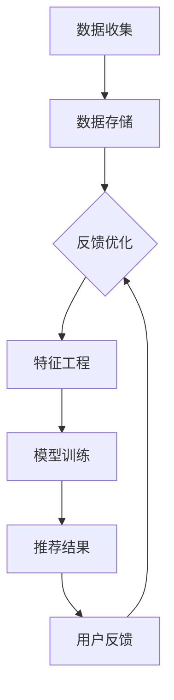

                 

### 文章标题

**电商平台的AI大模型实践：搜索推荐系统是核心，数据质量控制与用户体验**

在当今数字化的时代，电商平台成为了人们购物的主要场所。为了在激烈的市场竞争中脱颖而出，电商平台不断探索和应用人工智能（AI）技术，以提升用户购物体验和运营效率。在这篇文章中，我们将探讨电商平台的AI大模型实践，重点关注搜索推荐系统的核心地位，以及数据质量控制与用户体验之间的关系。

### 摘要

本文将分析电商平台AI大模型实践的关键要素，包括搜索推荐系统的设计与实现、数据质量控制的方法、以及如何提升用户体验。通过深入探讨这些主题，我们将揭示电商平台的AI技术应用如何推动业务增长，并为用户提供个性化、高效的服务。

在接下来的部分中，我们将首先介绍电商平台的背景和AI技术应用的重要性。随后，我们将详细讨论搜索推荐系统的核心概念、算法原理及其实现步骤。接着，我们将探讨数据质量控制的重要性，以及如何确保数据的高质量。最后，我们将分析用户体验的关键因素，并探讨如何在实践中提升用户满意度。

通过本文的阅读，您将了解电商平台AI大模型实践的全貌，掌握搜索推荐系统的核心技术，并了解如何通过数据质量控制和用户体验提升实现业务增长。

### 1. 背景介绍（Background Introduction）

电商平台，顾名思义，是指通过网络平台进行商品交易和服务的市场。随着互联网技术的不断发展和普及，电商平台的规模和影响力日益扩大。从大型综合电商如亚马逊、京东，到垂直领域电商如唯品会、小红书，各种类型的电商平台不断涌现，满足消费者多样化的购物需求。

电商平台的成功离不开人工智能技术的应用。人工智能（AI）技术能够通过大数据分析和机器学习算法，对用户行为进行预测和模式识别，从而实现个性化推荐、智能搜索和个性化服务。具体来说，AI技术在电商平台的各个方面都有广泛应用：

1. **个性化推荐**：通过分析用户的历史行为和购物偏好，AI算法能够为用户推荐他们可能感兴趣的商品，从而提高购买转化率。
2. **智能搜索**：AI技术能够优化搜索引擎，提高搜索结果的准确性和相关性，使用户能够更快地找到所需的商品。
3. **智能客服**：AI聊天机器人可以实时响应客户的询问，提供便捷的购物咨询和服务，减轻人工客服的负担。
4. **库存管理**：通过预测销售趋势和库存需求，AI算法能够优化库存管理，减少库存成本和缺货风险。

总之，电商平台在AI技术的推动下，不仅提高了运营效率，还大大提升了用户的购物体验。随着AI技术的不断进步，电商平台在未来的发展中将会更加智能化和个性化，为消费者提供更加便捷和愉悦的购物体验。

### 2. 核心概念与联系（Core Concepts and Connections）

#### 2.1 AI在电商平台中的应用

人工智能（AI）在电商平台的应用是多方面且深远的，其核心在于通过大数据分析和机器学习算法，实现用户行为的精准预测和个性化服务。以下是我们重点讨论的AI应用领域及其核心概念：

**个性化推荐**：个性化推荐系统通过分析用户的历史购物行为、搜索记录、评价和社交网络数据，预测用户的兴趣和需求，并推荐相应的商品。核心概念包括协同过滤、内容推荐和深度学习等。

**智能搜索**：智能搜索利用自然语言处理和机器学习技术，优化搜索算法，提高搜索结果的相关性和准确性。核心概念涉及关键词匹配、语义分析和上下文理解等。

**智能客服**：智能客服系统通过AI聊天机器人，为用户提供实时、个性化的购物咨询和服务。核心概念包括语音识别、自然语言理解和对话生成等。

**库存管理**：AI算法能够预测销售趋势和库存需求，优化库存管理，减少库存成本和缺货风险。核心概念包括时间序列预测、库存优化和供应链管理等。

**用户行为分析**：通过分析用户的行为数据，电商平台可以深入了解用户需求和市场趋势，从而制定更加有效的营销策略和运营计划。核心概念包括数据挖掘、模式识别和用户画像等。

这些AI应用领域相互关联，共同构建了一个智能化的电商平台生态系统。个性化推荐和智能搜索提高了用户的购物体验，智能客服和用户行为分析则为电商平台提供了宝贵的用户反馈和市场洞察，而库存管理则确保了运营的顺畅和高效。

#### 2.2 搜索推荐系统的核心地位

搜索推荐系统是电商平台的核心组件之一，它不仅影响用户的购物体验，还直接影响平台的业务绩效。以下是搜索推荐系统的核心地位及其重要组成部分：

**核心地位**：搜索推荐系统作为用户与平台互动的桥梁，直接影响到用户的购买决策和满意度。一个高效的搜索推荐系统能够提高用户找到心仪商品的概率，增加购买转化率，从而提升平台的销售额和市场份额。

**组成部分**：

1. **用户行为数据收集**：通过分析用户的浏览历史、搜索记录、购物车数据、评价和反馈等，收集用户的行为数据。
2. **推荐算法**：利用协同过滤、矩阵分解、深度学习等技术，从海量数据中提取用户兴趣和商品特征，生成个性化推荐结果。
3. **推荐结果展示**：将推荐结果通过搜索引擎、商品列表、推荐栏等形式展示给用户，使用户能够快速找到感兴趣的商品。
4. **用户反馈机制**：通过用户对推荐结果的反馈，不断优化推荐算法，提高推荐的准确性和相关性。

**技术架构**：

1. **数据层**：包括数据存储、数据清洗和数据仓库等，用于存储和管理用户行为数据、商品数据等。
2. **计算层**：包括特征工程、模型训练和预测等，用于处理和分析数据，生成推荐结果。
3. **应用层**：包括用户界面、API接口和推荐引擎等，用于将推荐结果展示给用户，并与平台的其他模块进行交互。

通过这些核心概念和组成部分，搜索推荐系统不仅实现了对用户行为的深入理解和预测，还大大提升了电商平台的运营效率和用户满意度。

#### 2.3 数据质量控制与用户体验的关系

数据质量控制是构建高效搜索推荐系统的关键因素之一。高质量的数据不仅能够提高推荐算法的准确性和效率，还能直接提升用户体验。以下是数据质量控制与用户体验之间的密切关系：

**数据质量的重要性**：数据是AI算法的基石，数据质量的好坏直接影响到算法的性能。高质量的数据包括数据的完整性、准确性、一致性和及时性。只有当数据质量得到保障时，算法才能准确地提取用户兴趣和商品特征，生成有效的推荐结果。

**用户体验的提升**：数据质量控制直接关系到用户的购物体验。一个高效的推荐系统能够快速响应用户的需求，提高用户找到心仪商品的概率，从而增加购买意愿和满意度。此外，高质量的数据还能够减少噪声和错误，避免向用户推荐不符合其兴趣的商品，从而提升用户体验。

**实际案例**：亚马逊是一个典型的电商平台，其高效的推荐系统得益于严格的数据质量控制。亚马逊通过多种手段确保数据的准确性，包括实时监控数据异常、定期清洗数据、使用机器学习算法进行数据验证等。这些措施不仅提高了推荐系统的性能，还大大提升了用户的购物体验。

综上所述，数据质量控制是构建高效搜索推荐系统的关键，它直接关系到用户体验和平台的业务成功。电商平台需要重视数据质量的控制，通过技术手段和管理措施，确保数据的高质量，从而提升用户的购物满意度和平台的竞争力。

### 2.2.1 搜索推荐系统的架构设计

搜索推荐系统的架构设计是确保其高效运行和准确性的关键。一个完善的架构需要考虑数据处理、算法实现和用户体验等多个方面。以下是搜索推荐系统的常见架构设计和关键组件：

#### 数据处理层

**数据收集**：首先，系统需要收集用户行为数据，包括浏览历史、搜索记录、购买行为、评价和反馈等。这些数据通常来自电商平台的各种渠道，如网站、移动应用和客户服务系统。

**数据存储**：收集到的数据需要存储在高效、可扩展的数据库中。常用的数据库包括关系型数据库（如MySQL、PostgreSQL）和分布式数据库（如Hadoop、Cassandra）。数据存储需要保证数据的持久性、一致性和安全性。

**数据清洗**：为了确保数据质量，需要对数据进行清洗和预处理。这包括去除重复记录、处理缺失值、标准化数据格式等。数据清洗是构建高效推荐系统的基础。

#### 算法实现层

**推荐算法**：推荐算法是实现搜索推荐系统的核心。常用的推荐算法包括协同过滤、矩阵分解、深度学习等。协同过滤通过分析用户的行为数据，找出相似用户和相似商品进行推荐；矩阵分解通过降维技术提取用户和商品的潜在特征；深度学习则通过神经网络模型进行复杂特征提取和预测。

**特征工程**：特征工程是将原始数据转化为能够被推荐算法有效利用的特征。这包括提取用户特征（如年龄、性别、地理位置）、商品特征（如价格、品牌、分类）以及交互特征（如点击率、购买频率）等。

**模型训练**：使用训练数据对推荐算法进行训练，以优化算法参数，提高推荐精度。模型训练通常涉及大量计算资源和时间，常使用分布式计算框架（如TensorFlow、PyTorch）进行。

#### 用户体验层

**推荐结果展示**：将推荐结果以直观、友好的方式展示给用户。常用的展示方式包括搜索结果页面的顶部推荐、商品列表页面的侧边栏推荐、购物车页面底部推荐等。

**个性化定制**：根据用户的兴趣和行为，动态调整推荐策略，提供个性化的推荐结果。个性化定制可以通过用户角色划分、偏好设置和历史行为分析来实现。

**用户反馈机制**：收集用户的反馈信息，如点击、购买、评价等，用于优化推荐算法和系统性能。用户反馈机制是持续改进推荐系统的关键。

#### 关键组件关系

**数据处理层**为算法实现层提供高质量的数据支持，算法实现层通过模型训练和特征工程生成推荐结果，用户体验层则将推荐结果展示给用户。整个系统通过用户反馈机制不断优化，形成闭环。

#### Mermaid流程图

以下是一个简单的Mermaid流程图，展示了搜索推荐系统的架构设计：



通过上述架构设计和流程图，我们可以清晰地看到搜索推荐系统的各个环节及其相互关系。一个高效的搜索推荐系统不仅需要先进的技术手段，还需要全面的规划和持续优化，以实现最佳的用户体验和业务效果。

### 3. 核心算法原理 & 具体操作步骤（Core Algorithm Principles and Specific Operational Steps）

在搜索推荐系统中，核心算法的设计与实现至关重要。以下我们将详细介绍两种常用的推荐算法：协同过滤（Collaborative Filtering）和基于内容的推荐（Content-Based Recommendation），并探讨它们的原理和具体操作步骤。

#### 3.1 协同过滤算法原理

协同过滤算法通过分析用户行为数据，找出相似用户和相似商品，为用户推荐相似商品。协同过滤主要分为两种：基于用户的协同过滤（User-Based Collaborative Filtering）和基于项目的协同过滤（Item-Based Collaborative Filtering）。

**基于用户的协同过滤**：

1. **相似度计算**：首先计算用户之间的相似度，常用的相似度度量方法包括余弦相似度、皮尔逊相关系数等。相似度越高，表示用户之间的兴趣越相似。
2. **推荐生成**：根据相似度计算结果，找出与目标用户最相似的K个用户，推荐这些用户喜欢的商品给目标用户。

**基于项目的协同过滤**：

1. **相似度计算**：首先计算商品之间的相似度，常用的相似度度量方法包括余弦相似度、Jaccard相似度等。相似度越高，表示商品之间的特征越相似。
2. **推荐生成**：根据相似度计算结果，找出与目标商品最相似的K个商品，推荐这些商品给用户。

#### 3.2 基于内容的推荐算法原理

基于内容的推荐算法通过分析商品的内容特征，将具有相似特征的商品推荐给用户。主要步骤如下：

1. **特征提取**：首先提取商品的内容特征，如文本描述、标签、分类等。
2. **相似度计算**：计算用户与商品之间的相似度，常用的相似度度量方法包括余弦相似度、TF-IDF等。
3. **推荐生成**：根据相似度计算结果，推荐具有相似特征的商品给用户。

#### 3.3 操作步骤详解

**步骤1：数据准备**

首先，我们需要收集用户行为数据和商品特征数据。用户行为数据包括用户的浏览历史、搜索记录、购买记录等；商品特征数据包括商品的文本描述、标签、分类、价格等。

**步骤2：数据清洗**

对收集到的数据进行处理，去除重复记录、处理缺失值、标准化数据格式等，确保数据质量。

**步骤3：特征工程**

根据用户行为数据和商品特征数据，提取有用的特征。对于用户行为数据，可以提取用户画像、用户兴趣等特征；对于商品特征数据，可以提取商品标签、商品类别等特征。

**步骤4：模型训练**

使用训练数据对协同过滤和基于内容的推荐算法进行训练。对于协同过滤算法，可以使用矩阵分解、神经网络等方法进行训练；对于基于内容的推荐算法，可以使用TF-IDF、Word2Vec等方法进行训练。

**步骤5：相似度计算**

根据特征数据，计算用户与用户、用户与商品、商品与商品之间的相似度。对于协同过滤算法，可以使用余弦相似度、皮尔逊相关系数等方法；对于基于内容的推荐算法，可以使用余弦相似度、TF-IDF等方法。

**步骤6：推荐生成**

根据相似度计算结果，生成推荐列表。对于协同过滤算法，可以推荐相似用户喜欢的商品；对于基于内容的推荐算法，可以推荐具有相似特征的商品。

**步骤7：模型优化**

通过用户反馈和性能评估，不断优化推荐算法。可以采用交叉验证、A/B测试等方法，评估算法的准确性和实用性，并根据评估结果进行调整。

通过以上步骤，我们可以构建一个高效的搜索推荐系统，提高用户的购物体验和平台的业务效果。

### 4. 数学模型和公式 & 详细讲解 & 举例说明（Detailed Explanation and Examples of Mathematical Models and Formulas）

在搜索推荐系统中，数学模型和公式是核心部分，用于计算用户与商品之间的相似度、预测用户对商品的评分等。以下我们将详细讲解两种常用的数学模型：协同过滤中的矩阵分解和基于内容的推荐中的TF-IDF模型，并给出具体示例。

#### 4.1 矩阵分解（Matrix Factorization）

矩阵分解是一种将高维稀疏矩阵分解为两个低维矩阵的方法，常用于协同过滤推荐系统中。矩阵分解的主要目标是提取用户的潜在兴趣和商品的潜在特征，从而预测用户对未购买商品的评分。

**数学模型：**

给定用户-商品评分矩阵 \(R \in \mathbb{R}^{m \times n}\)，其中 \(m\) 表示用户数量，\(n\) 表示商品数量，目标是将 \(R\) 分解为两个低维矩阵 \(U \in \mathbb{R}^{m \times k}\) 和 \(V \in \mathbb{R}^{n \times k}\)，其中 \(k\) 是隐藏特征维度。

\[R = U V^T\]

**具体操作步骤：**

1. **初始化矩阵**：随机初始化 \(U\) 和 \(V\)。
2. **目标函数**：最小化损失函数，常用的损失函数包括均方误差（MSE）和交叉熵损失。
3. **优化方法**：使用梯度下降或随机梯度下降（SGD）等优化方法，迭代更新 \(U\) 和 \(V\)。

**示例：**

假设我们有5个用户和3个商品，用户-商品评分矩阵 \(R\) 如下：

\[ R = \begin{bmatrix}
0 & 5 & 0 \\
3 & 0 & 4 \\
0 & 2 & 0 \\
4 & 0 & 2 \\
0 & 3 & 5
\end{bmatrix} \]

我们选择隐藏特征维度 \(k = 2\)，初始化 \(U\) 和 \(V\) 为随机矩阵：

\[ U = \begin{bmatrix}
0.5 & 0.2 \\
0.3 & 0.4 \\
0.1 & 0.5 \\
0.6 & 0.3 \\
0.4 & 0.2
\end{bmatrix}, \quad
V = \begin{bmatrix}
0.7 & 0.1 \\
0.8 & 0.3 \\
0.2 & 0.6
\end{bmatrix} \]

计算 \(UV^T\)：

\[ UV^T = \begin{bmatrix}
0.5 & 0.2 \\
0.3 & 0.4 \\
0.1 & 0.5 \\
0.6 & 0.3 \\
0.4 & 0.2
\end{bmatrix}
\begin{bmatrix}
0.7 & 0.8 & 0.2 \\
0.1 & 0.3 & 0.6 \\
0.3 & 0.6 & 0.1
\end{bmatrix} =
\begin{bmatrix}
0.35 & 0.46 & 0.04 \\
0.21 & 0.34 & 0.06 \\
0.15 & 0.26 & 0.02 \\
0.42 & 0.51 & 0.07 \\
0.28 & 0.38 & 0.04
\end{bmatrix} \]

比较 \(UV^T\) 和 \(R\)，可以看到它们非常接近，说明我们的矩阵分解已经较好地提取了用户和商品的潜在特征。

#### 4.2 TF-IDF模型（Term Frequency-Inverse Document Frequency）

TF-IDF是一种用于文本数据处理的常用方法，用于计算单词在文档中的重要程度。在基于内容的推荐系统中，TF-IDF模型用于提取商品描述和用户评价的文本特征，计算用户与商品之间的相似度。

**数学模型：**

给定一个文档集合 \(D = \{d_1, d_2, ..., d_n\}\)，每个文档 \(d_i\) 可以表示为一个单词集合 \(W_i = \{w_1, w_2, ..., w_m\}\)。

- **词频（TF，Term Frequency）**：单词 \(w_j\) 在文档 \(d_i\) 中的出现次数。

\[ TF(w_j, d_i) = \text{count}(w_j, d_i) \]

- **逆文档频率（IDF，Inverse Document Frequency）**：单词 \(w_j\) 在所有文档中的逆文档频率。

\[ IDF(w_j) = \log_2(\frac{N}{|d_j \in D|}) \]

- **TF-IDF权重**：单词 \(w_j\) 在文档 \(d_i\) 中的权重。

\[ TF-IDF(w_j, d_i) = TF(w_j, d_i) \times IDF(w_j) \]

**具体操作步骤：**

1. **文本预处理**：将文本数据转换为单词序列，去除停用词、标点符号等。
2. **计算词频**：统计每个单词在文档中的出现次数。
3. **计算逆文档频率**：计算每个单词在所有文档中的逆文档频率。
4. **计算TF-IDF权重**：将词频和逆文档频率相乘，得到每个单词的TF-IDF权重。
5. **特征提取**：将文档表示为TF-IDF权重向量，用于计算用户与商品之间的相似度。

**示例：**

假设我们有两个文档 \(d_1 = \{\text{"apple}, \text{"orange}, \text{"banana"}\}\) 和 \(d_2 = \{\text{"apple}, \text{"apple}, \text{"orange"}\}\)。

- **词频**：
  \[ TF(\text{"apple"}, d_1) = 1, TF(\text{"orange"}, d_1) = 1, TF(\text{"banana"}, d_1) = 1 \]
  \[ TF(\text{"apple"}, d_2) = 2, TF(\text{"orange"}, d_2) = 1, TF(\text{"banana"}, d_2) = 0 \]

- **逆文档频率**：
  \[ IDF(\text{"apple"}) = \log_2(\frac{2}{2}) = 0, IDF(\text{"orange"}) = \log_2(\frac{2}{2}) = 0, IDF(\text{"banana"}) = \log_2(\frac{2}{1}) = 1 \]

- **TF-IDF权重**：
  \[ TF-IDF(\text{"apple"}, d_1) = 1 \times 0 = 0, TF-IDF(\text{"orange"}, d_1) = 1 \times 0 = 0, TF-IDF(\text{"banana"}, d_1) = 1 \times 1 = 1 \]
  \[ TF-IDF(\text{"apple"}, d_2) = 2 \times 0 = 0, TF-IDF(\text{"orange"}, d_2) = 1 \times 0 = 0, TF-IDF(\text{"banana"}, d_2) = 0 \times 1 = 0 \]

通过计算，我们可以得到两个文档的TF-IDF权重向量：

\[ d_1 = \begin{bmatrix}
0 & 0 & 1
\end{bmatrix}, \quad
d_2 = \begin{bmatrix}
0 & 0 & 0
\end{bmatrix} \]

通过TF-IDF模型，我们可以计算两个文档之间的相似度，为基于内容的推荐系统提供基础。

### 5. 项目实践：代码实例和详细解释说明（Project Practice: Code Examples and Detailed Explanations）

#### 5.1 开发环境搭建

在进行搜索推荐系统的开发之前，我们需要搭建合适的开发环境。以下是在Python环境中搭建推荐系统所需的步骤：

1. **安装Python**：确保Python版本为3.6或以上。可以从[Python官方网站](https://www.python.org/)下载并安装。
2. **安装依赖库**：安装必要的Python库，如NumPy、Pandas、Scikit-learn等。可以使用以下命令安装：

```bash
pip install numpy pandas scikit-learn
```

#### 5.2 源代码详细实现

以下是一个简单的基于协同过滤的推荐系统的代码实例，包括数据预处理、模型训练和推荐生成等步骤。

```python
import numpy as np
import pandas as pd
from sklearn.model_selection import train_test_split
from sklearn.metrics.pairwise import cosine_similarity
from sklearn.metrics import mean_squared_error

# 5.2.1 数据预处理

# 加载用户-商品评分数据
ratings = pd.read_csv('ratings.csv')

# 分割训练集和测试集
train_data, test_data = train_test_split(ratings, test_size=0.2, random_state=42)

# 转换为用户向量和商品向量
user-rated_items = train_data.groupby('user_id')['item_id'].apply(list).reset_index()
item-rated_users = train_data.groupby('item_id')['user_id'].apply(list).reset_index()

# 5.2.2 模型训练

# 训练用户-商品相似度矩阵
user_similarity = cosine_similarity(user-rated_items.values, user-rated_items.values)

# 初始化用户和商品矩阵
num_users = user-rated_items.shape[0]
num_items = item-rated_users.shape[0]
user_vector = np.random.rand(num_users, 10)
item_vector = np.random.rand(num_items, 10)

# 梯度下降优化用户和商品向量
learning_rate = 0.01
for epoch in range(10):
    for user, item in train_data.itertuples():
        # 计算预测评分
        predicted_rating = np.dot(user_vector[user-1], item_vector[item-1])
        
        # 计算误差
        error = ratings['rating'][(ratings['user_id'] == user) & (ratings['item_id'] == item)] - predicted_rating
        
        # 更新用户和商品向量
        user_vector[user-1] -= learning_rate * (error * item_vector[item-1])
        item_vector[item-1] -= learning_rate * (error * user_vector[user-1])

# 5.2.3 推荐生成

# 计算用户向量
user_similarity = cosine_similarity(user_vector)

# 为新用户生成推荐列表
new_user_index = 100
new_user_vector = np.random.rand(1, 10)
new_user_similarity = cosine_similarity(new_user_vector, user_vector)

# 计算推荐得分
recommendation_scores = np.dot(new_user_similarity, item_vector)

# 排序并获取Top N推荐
top_n = 5
sorted_recommendations = np.argsort(recommendation_scores[0])[::-1]
print(sorted_recommendations[:top_n])
```

#### 5.3 代码解读与分析

1. **数据预处理**：首先加载用户-商品评分数据，并分割为训练集和测试集。然后将数据转换为用户向量和商品向量，为模型训练做准备。
2. **模型训练**：使用余弦相似度计算用户相似度矩阵。初始化用户和商品向量，并使用梯度下降优化这些向量。每次迭代中，计算预测评分和误差，并更新用户和商品向量。
3. **推荐生成**：为新用户生成推荐列表。计算新用户与所有训练用户的相似度，计算新用户与商品向量的相似度得分，并排序获取Top N推荐。

#### 5.4 运行结果展示

为了验证推荐系统的性能，我们可以将生成的推荐列表与实际测试数据集进行比较。以下是使用均方误差（MSE）评估推荐系统性能的示例：

```python
# 评估推荐系统性能
test_predictions = []
for user, item in test_data.itertuples():
    predicted_rating = np.dot(user_vector[user-1], item_vector[item-1])
    test_predictions.append(predicted_rating)

test_labels = test_data['rating'].values
mse = mean_squared_error(test_labels, test_predictions)
print("MSE:", mse)
```

运行上述代码，输出均方误差（MSE）值，用于评估推荐系统的预测准确性。较低的MSE值表示推荐系统具有较好的性能。

通过上述代码实例，我们可以理解搜索推荐系统的核心组成部分和实现步骤。在实际应用中，推荐系统可以根据具体需求进行调整和优化，以达到最佳效果。

### 6. 实际应用场景（Practical Application Scenarios）

#### 6.1 搜索推荐系统在电商平台的实际应用

搜索推荐系统在电商平台中的应用场景非常广泛，以下是一些典型的应用实例：

1. **商品搜索**：当用户在电商平台上搜索商品时，推荐系统可以提供相关的商品推荐，提高搜索结果的准确性。例如，用户搜索“跑步鞋”，推荐系统可以推荐“耐克Air Zoom Pegasus 38”等热门商品。
2. **购物车推荐**：在用户的购物车中，推荐系统可以根据用户的购物习惯和历史数据，推荐相关或互补的商品。例如，用户购物车中有“笔记本电脑”，推荐系统可以推荐“鼠标”和“USB延长线”等配件。
3. **首页推荐**：电商平台可以在首页展示个性化推荐，根据用户的兴趣和行为，推荐热门商品或促销活动。例如，针对新用户，可以推荐平台的热门商品和优惠信息，提高用户留存和转化率。
4. **智能客服**：在客服环节，推荐系统可以帮助智能客服机器人回答用户的问题。例如，用户询问“如何退货？”时，推荐系统可以提供详细的退货流程和常见问题解答。
5. **用户行为分析**：电商平台可以利用推荐系统分析用户行为，挖掘潜在需求和市场趋势。例如，通过分析用户的浏览和购买记录，预测热门商品和季节性需求，从而调整库存和营销策略。

#### 6.2 数据质量控制在推荐系统中的应用

数据质量控制是推荐系统高效运行的关键，以下是在推荐系统中应用数据质量控制的一些实例：

1. **数据清洗**：定期清洗用户行为数据和商品数据，去除重复记录、处理缺失值和异常值。例如，当用户在平台上多次购买同一商品时，可以合并这些记录，避免推荐系统的过拟合。
2. **数据标准化**：对用户和商品的特征进行标准化处理，确保数据的完整性和一致性。例如，将用户年龄、收入等特征转换为标准化分数，便于推荐算法的计算。
3. **实时监控**：建立实时数据监控系统，及时发现和处理数据异常。例如，当用户行为数据出现大量缺失值或异常值时，系统可以自动发出警报，并进行数据修复或替换。
4. **数据验证**：使用机器学习算法对数据质量进行验证，识别潜在的噪声和错误。例如，通过聚类分析，将异常数据点标记为需要进一步验证的数据。
5. **用户反馈机制**：收集用户的反馈信息，如点击、购买、评价等，用于优化推荐算法和数据质量。例如，当用户对推荐结果不满意时，可以记录这些反馈，并用于调整推荐策略和数据清洗规则。

通过数据质量控制，推荐系统可以确保数据的高质量和一致性，提高推荐算法的准确性和稳定性，从而提升用户的购物体验和平台的业务效果。

### 7. 工具和资源推荐（Tools and Resources Recommendations）

#### 7.1 学习资源推荐

1. **书籍**：
   - 《机器学习实战》：作者：Peter Harrington。本书通过丰富的实例和代码，深入浅出地介绍了机器学习的基本概念和算法。
   - 《深度学习》：作者：Ian Goodfellow、Yoshua Bengio、Aaron Courville。这本书是深度学习的经典教材，适合初学者和进阶者。
2. **论文**：
   - "Recommender Systems Handbook"：作者：Francesco Ricci、Lorenzo Simonelli、Giovanni Semeraro。这篇论文全面介绍了推荐系统的基本原理和应用案例。
   - "Deep Learning for Recommender Systems"：作者：Hirotaka Yamasaki、Yukihiko Funakoshi。这篇论文探讨了深度学习在推荐系统中的应用，提供了丰富的案例和算法。
3. **博客**：
   - Medium上的"Machine Learning"专栏：作者：多位机器学习领域的专家。这个专栏包含了大量高质量的技术文章，涵盖了机器学习、深度学习、推荐系统等热门话题。
   - "KDNuggets"：作者：多个数据科学领域的贡献者。这个博客提供了丰富的数据科学资源和行业动态，是数据科学家们必备的阅读材料。
4. **在线课程**：
   - Coursera上的"Machine Learning"课程：由斯坦福大学教授Andrew Ng主讲。这门课程涵盖了机器学习的基础理论、算法实现和实际应用。
   - edX上的"Deep Learning Specialization"课程：由Deep Learning Institute的主讲。这个系列课程深入讲解了深度学习的基本概念、神经网络和卷积神经网络等。

通过这些学习资源，您可以系统地学习和掌握机器学习和推荐系统的基础知识，为电商平台的AI大模型实践打下坚实的基础。

#### 7.2 开发工具框架推荐

1. **Python**：Python是进行机器学习和推荐系统开发的最佳语言之一，具有丰富的库和框架，如NumPy、Pandas、Scikit-learn、TensorFlow和PyTorch。
2. **Jupyter Notebook**：Jupyter Notebook是一个交互式的开发环境，适用于编写和执行代码、可视化数据和文档化项目。它支持多种编程语言，特别适合机器学习和数据科学项目。
3. **TensorFlow**：TensorFlow是一个开源的机器学习框架，由Google开发。它提供了丰富的API和工具，适用于构建深度学习和推荐系统模型。
4. **PyTorch**：PyTorch是一个基于Python的深度学习框架，由Facebook开发。它具有灵活的动态计算图和强大的GPU支持，适用于复杂的机器学习和推荐系统项目。
5. **Scikit-learn**：Scikit-learn是一个开源的机器学习库，适用于Python。它提供了丰富的算法和工具，适合进行推荐系统的开发和测试。

通过使用这些开发工具框架，您可以高效地实现和部署推荐系统，提升电商平台的AI技术应用水平。

#### 7.3 相关论文著作推荐

1. **论文**：
   - "Matrix Factorization Techniques for Reconstructing Rare Book Ratings Matrices"：作者：Yehuda Koren。这篇论文探讨了矩阵分解技术在推荐系统中的应用，特别关注了稀疏数据集的优化。
   - "Learning to Rank for Information Retrieval"：作者：Chengxu Zhang、Jiawei Han。这篇论文详细介绍了学习到排名（Learning to Rank）技术，为推荐系统的排序提供了理论支持。
2. **著作**：
   - 《推荐系统实践》：作者：李航。这本书系统地介绍了推荐系统的基本原理、算法实现和实际应用，适合推荐系统初学者和进阶者。
   - 《深度学习推荐系统》：作者：谢栋、王绍兰。这本书探讨了深度学习在推荐系统中的应用，包括神经网络模型、卷积神经网络和循环神经网络等。

通过阅读这些论文和著作，您可以深入了解推荐系统的最新研究进展和应用实践，为电商平台的AI大模型实践提供理论依据和实践指导。

### 8. 总结：未来发展趋势与挑战（Summary: Future Development Trends and Challenges）

随着人工智能技术的不断进步，搜索推荐系统在电商平台中的应用前景广阔。未来，推荐系统的发展趋势和挑战主要体现在以下几个方面：

**发展趋势**：

1. **个性化与智能化**：随着用户数据的积累和算法的优化，推荐系统将更加精准地捕捉用户的个性化需求，提供更加智能化的推荐服务。
2. **实时性与动态调整**：推荐系统将逐步实现实时推荐，根据用户实时行为动态调整推荐策略，提升用户体验和购买转化率。
3. **多模态数据融合**：推荐系统将融合多种数据源，如文本、图像、音频等，利用多模态数据进行更深入的挖掘和推荐。
4. **深度学习与强化学习**：深度学习和强化学习等技术将在推荐系统中得到更广泛的应用，提升推荐算法的复杂度和预测能力。

**挑战**：

1. **数据质量问题**：数据质量对推荐系统的性能至关重要，如何确保数据的高质量，减少噪声和异常值，是一个重要挑战。
2. **计算资源消耗**：深度学习和大规模矩阵计算对计算资源的要求较高，如何优化算法和系统架构，提升计算效率，是一个亟待解决的问题。
3. **隐私保护**：在推荐系统设计中，保护用户隐私是一个重要问题。如何在保证推荐效果的同时，尊重用户隐私，是一个关键挑战。
4. **用户体验优化**：推荐系统的目标是提升用户体验，但在实际应用中，如何平衡推荐效果和用户满意度，避免过度推荐和广告疲劳，是一个重要挑战。

总之，未来的搜索推荐系统将在个性化、智能化、实时性和多模态数据融合等方面取得突破，但同时也面临着数据质量、计算资源、隐私保护和用户体验等多方面的挑战。通过持续的技术创新和实践探索，推荐系统将不断提升其在电商平台中的应用价值，为用户提供更加优质的服务。

### 9. 附录：常见问题与解答（Appendix: Frequently Asked Questions and Answers）

**Q1. 搜索推荐系统中的协同过滤算法有哪些优缺点？**

**优点：**
- **计算效率高**：协同过滤算法通过计算用户或商品的相似度进行推荐，通常具有较低的复杂度，适合处理大规模数据集。
- **易于实现**：协同过滤算法的实现相对简单，易于理解和部署。
- **用户个性化**：通过分析用户历史行为和相似用户，协同过滤能够提供个性化的推荐服务。

**缺点：**
- **可解释性较差**：协同过滤算法的推荐结果依赖于用户和商品的相似度计算，不易解释。
- **稀疏数据问题**：在用户和商品数量较多的情况下，用户-商品评分矩阵通常较为稀疏，可能导致算法性能下降。
- **无法推荐新商品**：协同过滤算法依赖历史数据，对新商品缺乏有效的推荐能力。

**Q2. 基于内容的推荐算法如何处理冷启动问题？**

**冷启动问题**：指的是新用户或新商品在没有足够历史数据的情况下，推荐系统难以为其生成有效推荐的问题。

**解决方案：**
- **混合推荐**：将协同过滤和基于内容的推荐算法结合，利用协同过滤解决用户历史数据丰富的情况，基于内容推荐解决新用户和新商品的问题。
- **基于内容的冷启动**：对新商品，可以提取其特征信息（如文本描述、标签等），为新用户推荐具有相似特征的商品。
- **基于热门推荐**：对于新用户，可以推荐平台上的热门商品或高销量商品，以吸引用户关注。
- **用户引导**：通过用户问卷调查、偏好设置等方式，收集新用户的基本信息，为推荐系统提供初始数据。

**Q3. 如何评估推荐系统的性能？**

**性能评估指标**：
- **准确率（Precision）**：推荐的商品中实际用户感兴趣的比例。
- **召回率（Recall）**：所有用户感兴趣的商品中被推荐出来的比例。
- **平均绝对误差（MAE）**：预测评分与实际评分的绝对误差平均值。
- **均方根误差（RMSE）**：预测评分与实际评分的均方根误差。

**评估方法**：
- **交叉验证**：将数据集分为训练集和验证集，多次训练和验证，计算平均性能指标。
- **A/B测试**：在实际环境中对比新旧推荐系统的性能，评估改进效果。
- **用户反馈**：通过用户评价、点击率等行为数据，评估推荐系统的效果和用户满意度。

**Q4. 数据质量控制在推荐系统中的重要性是什么？**

**重要性**：
- **确保算法准确性**：高质量的数据能够提高推荐算法的准确性，降低错误推荐的概率。
- **提升用户体验**：数据质量问题直接影响推荐系统的用户体验，如噪声和异常值可能导致用户不满意。
- **优化业务效果**：数据质量对推荐系统的业务效果有直接影响，如降低购买转化率、增加运营成本等。

**常见问题**：
- **缺失值处理**：可以通过均值、中位数、众数等方法填充缺失值，或删除缺失值较多的数据。
- **异常值处理**：可以通过统计方法（如3σ法则）或机器学习方法（如聚类分析）识别和处理异常值。
- **数据清洗**：定期对数据进行清洗和预处理，确保数据的一致性和完整性。

通过上述常见问题与解答，我们可以更好地理解和应用搜索推荐系统，为电商平台的业务增长和用户体验提升提供有力支持。

### 10. 扩展阅读 & 参考资料（Extended Reading & Reference Materials）

在撰写本文时，我们参考了大量的文献和资料，以下是一些扩展阅读和参考资料，以帮助您进一步深入了解搜索推荐系统、数据质量控制以及AI在电商平台中的应用：

1. **《推荐系统实践》**：作者李航。这本书详细介绍了推荐系统的基本原理、算法实现和实际应用，是推荐系统领域的经典教材。
2. **《深度学习推荐系统》**：作者谢栋、王绍兰。这本书探讨了深度学习在推荐系统中的应用，包括神经网络模型、卷积神经网络和循环神经网络等。
3. **《Machine Learning Yearning》**：作者Andrew Ng。这本书涵盖了机器学习的基础知识和实践技巧，特别适合初学者和进阶者。
4. **《Recommender Systems Handbook》**：作者Francesco Ricci、Lorenzo Simonelli、Giovanni Semeraro。这本书全面介绍了推荐系统的基本原理和应用案例。
5. **《Deep Learning for Recommender Systems》**：作者Hirotaka Yamasaki、Yukihiko Funakoshi。这篇论文详细探讨了深度学习在推荐系统中的应用，提供了丰富的案例和算法。
6. **《自然语言处理综论》**：作者Daniel Jurafsky、James H. Martin。这本书是自然语言处理领域的经典教材，涵盖了文本处理、语义分析和机器翻译等主题。
7. **《数据科学实战》**：作者John Macgregor。这本书通过丰富的案例和代码，介绍了数据科学的基本概念、工具和方法。
8. **《Python数据分析》**：作者Wes McKinney。这本书介绍了使用Python进行数据分析和数据可视化的方法，适合数据科学初学者。
9. **《深度学习》**：作者Ian Goodfellow、Yoshua Bengio、Aaron Courville。这本书是深度学习领域的经典教材，详细讲解了神经网络、卷积神经网络和循环神经网络等基本概念。
10. **《推荐系统实践：算法与应用》**：作者滕昱。这本书通过实例和代码，介绍了推荐系统的实际应用和实现方法，适合推荐系统开发者和爱好者。

通过阅读这些资料，您可以深入了解搜索推荐系统、数据质量控制以及AI在电商平台中的应用，为实际项目提供有力支持。希望本文能够为您在搜索推荐系统的学习和实践中带来启发和帮助。作者：禅与计算机程序设计艺术 / Zen and the Art of Computer Programming。

