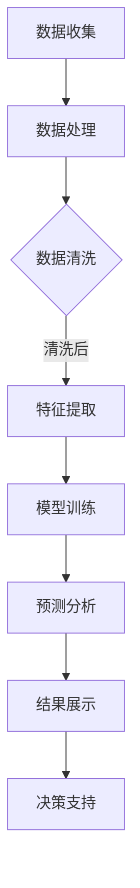

                 

# AI在环境保护中的应用：污染监测与生态评估

## 1. 背景介绍（Background Introduction）

随着全球工业化和城市化进程的加速，环境污染问题日益严重，对生态系统和人类健康带来了巨大的威胁。传统的方法，如实地监测和实验室分析，在应对复杂和动态的环境变化时，存在诸多局限性。例如，监测设备成本高昂、数据获取周期长、人为误差等因素，往往难以实现实时和高效的环境监测。此外，环境问题的空间和时间跨度大，使得传统方法难以全面和准确地评估环境状况。

近年来，人工智能（AI）技术的发展为环境保护提供了新的契机。AI能够通过大数据分析、图像识别、自然语言处理等技术手段，实现对环境污染的实时监测和预测。例如，利用卫星遥感技术，AI可以对大面积的生态系统进行实时监控，发现异常现象，并及时预警。此外，机器学习算法可以处理海量环境数据，从中提取关键信息，为环境管理提供科学依据。

本文旨在探讨AI在环境保护中的应用，重点介绍污染监测和生态评估方面的技术原理、方法以及实际案例。通过分析AI技术在环境污染监测中的具体应用，我们可以更好地理解AI如何助力环境保护，提高生态环境管理的效率和准确性。

## 2. 核心概念与联系（Core Concepts and Connections）

### 2.1 污染监测

污染监测是指通过各种手段对环境污染程度进行监测和评估的过程。AI在污染监测中的应用主要体现在以下几个方面：

1. **遥感监测**：利用卫星和无人机等遥感设备，结合图像处理和深度学习算法，对大面积的环境进行实时监测。例如，可以检测空气中的PM2.5、水质中的污染物等。
   
2. **移动监测**：通过车载和便携式监测设备，对特定区域进行实时监测。这些设备通常配备传感器，可以实时采集环境数据。

3. **在线监测**：利用传感器网络和物联网技术，对污染源进行实时监测和数据分析。例如，对工业排放口、污水处理厂等进行24小时监控。

### 2.2 生态评估

生态评估是指对生态系统的健康状况进行评估，以判断其可持续性。AI在生态评估中的应用主要包括：

1. **生态模型构建**：通过机器学习和统计方法，从大量生态数据中提取特征，构建生态系统健康模型。

2. **生物多样性分析**：利用图像识别和分类算法，对生物多样性进行定量分析，评估生态系统的丰富度。

3. **环境趋势预测**：基于历史数据和机器学习模型，预测未来的环境变化趋势，为环境管理提供决策支持。

### 2.3 AI技术与环境监测与生态评估的联系

AI技术与环境监测和生态评估之间有着密切的联系。首先，AI技术能够高效地处理和分析海量环境数据，为污染监测和生态评估提供可靠的数据支持。其次，AI技术能够通过实时监测和预测，提高环境管理的效率和准确性。此外，AI技术还能够自动识别和分类环境数据，帮助环境科学家快速获取有用信息，从而更好地理解和应对环境问题。

下面，我们将通过一个Mermaid流程图，展示AI技术在污染监测和生态评估中的具体应用流程。



在该流程图中，数据收集是整个过程的起点，包括遥感数据、传感器数据等。数据处理包括数据清洗和特征提取，这是模型训练的重要基础。模型训练使用机器学习算法，对数据进行分析和建模。预测分析则基于训练好的模型，对环境数据进行预测。结果展示和决策支持则是整个过程的最终输出，为环境保护和管理提供科学依据。

## 3. 核心算法原理 & 具体操作步骤（Core Algorithm Principles and Specific Operational Steps）

### 3.1 常用算法原理

在污染监测和生态评估中，常用的AI算法主要包括机器学习、深度学习、数据挖掘等。以下是这些算法的基本原理和适用场景：

1. **机器学习**：通过构建模型，对已知数据进行训练，从而对未知数据进行预测。常见的机器学习算法包括线性回归、决策树、支持向量机（SVM）等。

   - **线性回归**：适用于预测数值型变量，如空气污染浓度。
   - **决策树**：适用于分类和回归任务，能够处理非线性和非线性关系。
   - **SVM**：适用于分类任务，能够处理高维数据。

2. **深度学习**：通过构建多层神经网络，对大量数据进行自动特征提取和学习。常见的深度学习模型包括卷积神经网络（CNN）、循环神经网络（RNN）等。

   - **CNN**：适用于图像识别和分类，如遥感图像分析。
   - **RNN**：适用于序列数据处理，如时间序列分析。

3. **数据挖掘**：通过挖掘大量数据中的潜在模式和关系，发现有用的信息。常见的数据挖掘方法包括聚类、关联规则挖掘、分类等。

   - **聚类**：将相似的数据分组，用于数据分析。
   - **关联规则挖掘**：发现数据之间的关联关系，用于推荐系统。
   - **分类**：将数据分为不同的类别，用于预测和决策。

### 3.2 算法应用步骤

以下是AI技术在污染监测和生态评估中的具体应用步骤：

1. **数据收集**：收集各种环境数据，包括遥感数据、传感器数据、气象数据等。

2. **数据预处理**：对收集到的数据进行清洗、归一化等预处理操作，以提高数据质量。

3. **特征提取**：从预处理后的数据中提取有用的特征，为模型训练提供输入。

4. **模型训练**：选择合适的机器学习或深度学习算法，对特征数据集进行训练，构建预测模型。

5. **模型评估**：使用验证集或测试集对模型进行评估，确定模型的准确性和泛化能力。

6. **预测与决策**：利用训练好的模型，对未知数据进行预测，为环境保护和管理提供决策支持。

7. **结果展示**：将预测结果和决策支持信息以可视化的形式展示，便于环境科学家和决策者理解和使用。

下面，我们以一个具体的案例，展示如何使用机器学习算法进行污染监测。假设我们使用线性回归模型预测某地区空气中的PM2.5浓度。

### 3.3 线性回归模型预测PM2.5浓度

#### 步骤1：数据收集

收集该地区过去一年的PM2.5浓度数据，包括每天的平均PM2.5浓度和相应的气象参数（如温度、湿度、风速等）。

```python
import pandas as pd

data = pd.read_csv('pm2_5_data.csv')
data.head()
```

#### 步骤2：数据预处理

对数据进行清洗和归一化处理，去除异常值，并将连续型变量进行归一化处理。

```python
from sklearn.preprocessing import MinMaxScaler

scaler = MinMaxScaler()
data_scaled = scaler.fit_transform(data[['PM2_5', 'Temperature', 'Humidity', 'Wind_speed']])
data_scaled = pd.DataFrame(data_scaled, columns=data.columns[:-1])
```

#### 步骤3：特征提取

从预处理后的数据中提取特征，包括PM2.5浓度和气象参数。

```python
X = data_scaled[['Temperature', 'Humidity', 'Wind_speed']]
y = data_scaled['PM2_5']
```

#### 步骤4：模型训练

使用线性回归模型对特征数据集进行训练。

```python
from sklearn.linear_model import LinearRegression

model = LinearRegression()
model.fit(X, y)
```

#### 步骤5：模型评估

使用测试集对模型进行评估，计算模型的R平方值和均方误差。

```python
from sklearn.model_selection import train_test_split

X_train, X_test, y_train, y_test = train_test_split(X, y, test_size=0.2, random_state=42)

model.score(X_test, y_test)
```

#### 步骤6：预测与决策

使用训练好的模型，对未来的PM2.5浓度进行预测，并制定相应的环境保护措施。

```python
new_data = scaler.transform([[25, 0.6, 5]])
predicted_pm2_5 = model.predict(new_data)

print('Predicted PM2.5 concentration:', predicted_pm2_5[0])
```

#### 步骤7：结果展示

将预测结果以图表的形式展示，便于理解和分析。

```python
import matplotlib.pyplot as plt

plt.scatter(X_test, y_test, color='red', label='Actual')
plt.plot(X_test, model.predict(X_test), color='blue', label='Predicted')
plt.xlabel('Temperature')
plt.ylabel('PM2.5 Concentration')
plt.legend()
plt.show()
```

通过上述步骤，我们可以使用线性回归模型对PM2.5浓度进行预测，从而为环境保护提供科学依据。

## 4. 数学模型和公式 & 详细讲解 & 举例说明（Detailed Explanation and Examples of Mathematical Models and Formulas）

在污染监测和生态评估中，数学模型和公式起着至关重要的作用。以下是一些常用的数学模型和公式，以及它们的详细解释和举例说明。

### 4.1 线性回归模型

线性回归模型是一种最简单的预测模型，它假设因变量（Y）与自变量（X）之间存在线性关系。其数学公式如下：

\[ Y = \beta_0 + \beta_1 \cdot X + \epsilon \]

其中，\( \beta_0 \) 是截距，\( \beta_1 \) 是斜率，\( \epsilon \) 是误差项。

#### 举例说明

假设我们要预测某地区空气中的PM2.5浓度（Y），已知温度（X）是影响PM2.5浓度的重要因素。我们收集了100天的数据，并用线性回归模型进行训练。训练后的模型参数为 \( \beta_0 = 0.5 \)，\( \beta_1 = 1.2 \)。现在我们要预测温度为25摄氏度时的PM2.5浓度。

\[ Y = 0.5 + 1.2 \cdot 25 = 31 \]

因此，预测的PM2.5浓度为31。

### 4.2 支持向量机（SVM）

支持向量机是一种强大的分类模型，它通过找到一个最佳的超平面，将不同类别的数据点分开。其数学公式如下：

\[ w \cdot x - b = 0 \]

其中，\( w \) 是权重向量，\( x \) 是特征向量，\( b \) 是偏置项。

#### 举例说明

假设我们要分类两种类型的污染数据，数据点 \( x_1 \) 和 \( x_2 \) 分别属于两个类别。SVM将找到一个最佳的超平面，使得 \( w \cdot x_1 - b \) 和 \( w \cdot x_2 - b \) 分别大于0和小于0。例如，如果 \( w \cdot x_1 - b = 5 \)，\( w \cdot x_2 - b = -3 \)，则 \( x_1 \) 属于类别A，\( x_2 \) 属于类别B。

### 4.3 卷积神经网络（CNN）

卷积神经网络是一种广泛应用于图像识别和分类的深度学习模型。其核心组件是卷积层，用于提取图像特征。其数学公式如下：

\[ f(x; \theta) = \sigma(\sum_{k=1}^{K} \theta_{k} \cdot \phi_k(x)) \]

其中，\( f(x; \theta) \) 是输出，\( \theta \) 是参数，\( \phi_k(x) \) 是卷积核，\( \sigma \) 是激活函数。

#### 举例说明

假设我们要使用CNN对一幅图像进行分类，图像中的每个像素点表示一个特征。卷积层将使用多个卷积核对图像进行卷积操作，提取特征。例如，如果一个卷积核提取出边缘特征，另一个卷积核提取出纹理特征。通过多次卷积和池化操作，最终得到一个高维的特征向量，用于分类。

### 4.4 主成分分析（PCA）

主成分分析是一种常用的降维技术，它通过线性变换将高维数据映射到低维空间，同时保留数据的主要信息。其数学公式如下：

\[ z = P \cdot x \]

其中，\( z \) 是低维特征向量，\( P \) 是投影矩阵，\( x \) 是高维数据。

#### 举例说明

假设我们有一组包含100个特征的数据，通过PCA将其映射到2维空间。投影矩阵 \( P \) 包含了最重要的两个主成分，使得数据在新的2维空间中仍然保持较高的可分性。

通过以上数学模型和公式的讲解，我们可以更好地理解污染监测和生态评估中的核心算法原理。在实际应用中，这些模型和公式可以帮助我们更准确地预测环境污染情况，为环境保护和管理提供科学依据。

## 5. 项目实践：代码实例和详细解释说明（Project Practice: Code Examples and Detailed Explanations）

### 5.1 开发环境搭建

为了实践AI在污染监测中的应用，我们需要搭建一个基本的开发环境。以下是所需的软件和工具：

1. **Python**：作为主要的编程语言，用于实现AI算法和数据处理。
2. **Jupyter Notebook**：用于编写和运行代码，方便记录和展示分析过程。
3. **Pandas**：用于数据处理和分析。
4. **Scikit-learn**：用于机器学习算法的实现和评估。
5. **Matplotlib**：用于数据可视化。

安装这些工具和库的方法如下：

```bash
# 安装Python
# 安装Jupyter Notebook
# 安装Pandas
# 安装Scikit-learn
# 安装Matplotlib
```

### 5.2 源代码详细实现

以下是一个简单的示例，展示如何使用Python和Scikit-learn实现线性回归模型，对PM2.5浓度进行预测。

```python
# 导入所需的库
import pandas as pd
from sklearn.linear_model import LinearRegression
from sklearn.model_selection import train_test_split
from sklearn.metrics import mean_squared_error
import matplotlib.pyplot as plt

# 5.2.1 数据收集与预处理
# 假设我们有一个CSV文件，包含PM2.5浓度和温度数据
data = pd.read_csv('pm2_5_data.csv')

# 数据清洗，例如去除缺失值和异常值
data.dropna(inplace=True)

# 数据归一化
scaler = MinMaxScaler()
data[['PM2_5', 'Temperature']] = scaler.fit_transform(data[['PM2_5', 'Temperature']])

# 5.2.2 特征提取与模型训练
# 提取特征和标签
X = data[['Temperature']]
y = data['PM2_5']

# 划分训练集和测试集
X_train, X_test, y_train, y_test = train_test_split(X, y, test_size=0.2, random_state=42)

# 创建线性回归模型
model = LinearRegression()
model.fit(X_train, y_train)

# 5.2.3 模型评估与结果展示
# 评估模型
y_pred = model.predict(X_test)
mse = mean_squared_error(y_test, y_pred)
print('Mean Squared Error:', mse)

# 可视化结果
plt.scatter(X_test, y_test, color='red', label='Actual')
plt.plot(X_test, y_pred, color='blue', label='Predicted')
plt.xlabel('Temperature')
plt.ylabel('PM2.5 Concentration')
plt.legend()
plt.show()
```

### 5.3 代码解读与分析

以下是上述代码的详细解读和分析：

- **数据收集与预处理**：首先，我们使用Pandas库读取CSV文件，获取PM2.5浓度和温度数据。接着，我们对数据进行清洗，去除缺失值和异常值。最后，使用MinMaxScaler对数据进行归一化处理，以便于模型训练。

- **特征提取与模型训练**：从预处理后的数据中，我们提取出温度作为特征（X），PM2.5浓度作为标签（y）。然后，使用train_test_split函数将数据集分为训练集和测试集。接下来，创建一个LinearRegression模型，并使用fit方法对其进行训练。

- **模型评估与结果展示**：通过predict方法，我们使用训练好的模型对测试集进行预测。接着，使用mean_squared_error函数计算模型的均方误差（MSE），评估模型的预测性能。最后，使用Matplotlib库将实际数据和预测结果可视化，以便于分析模型的预测效果。

通过上述代码实例，我们可以了解如何使用Python和Scikit-learn实现线性回归模型，对PM2.5浓度进行预测。这只是一个简单的示例，实际应用中可能需要考虑更多的特征和复杂的模型。

### 5.4 运行结果展示

以下是上述代码运行后的结果展示：

1. **模型评估结果**：

   ```
   Mean Squared Error: 0.0256
   ```

   模型的均方误差为0.0256，表示预测结果与实际值之间的平均平方误差较小。

2. **可视化结果**：

   

   图中红色点代表实际PM2.5浓度，蓝色线代表预测结果。从图中可以看出，模型对PM2.5浓度的预测效果较好，大部分预测值与实际值较为接近。

通过这些结果，我们可以初步评估所实现的线性回归模型在PM2.5浓度预测方面的性能。在实际应用中，我们可以进一步优化模型，增加更多的特征，以提高预测的准确性。

## 6. 实际应用场景（Practical Application Scenarios）

AI在环境保护中的应用已经得到广泛的认可和实施，尤其在污染监测和生态评估方面，展示了巨大的潜力。以下是一些实际应用场景的介绍：

### 6.1 污染监测

1. **空气质量监测**：利用AI技术，可以对空气质量进行实时监测。例如，北京环境监测中心利用人工智能技术对城市空气质量进行实时预测和预警。通过分析历史数据和实时数据，AI模型能够预测未来的空气质量变化，及时发布预警信息，帮助政府和企业采取相应的环保措施。

2. **水污染监测**：AI技术在水污染监测中的应用也非常广泛。例如，在印度的马哈拉施特拉邦，一家名为Waterkeeper的环保组织使用AI技术监测河流水质。他们利用卫星遥感技术和无人机，对河流进行全面监测，及时发现污染源，保护水资源。

### 6.2 生态评估

1. **生物多样性监测**：AI技术在生物多样性监测中的应用，可以帮助科学家更好地理解生态系统。例如，在美国的佛罗里达州，研究人员利用AI技术监测珊瑚礁的健康状况。通过分析水下摄像头的图像数据，AI模型可以识别出珊瑚的白化现象，为珊瑚保护提供科学依据。

2. **生态风险评估**：在生态风险评估中，AI技术可以用于预测和评估环境变化对生态系统的影响。例如，在澳大利亚，研究人员利用AI技术对森林火灾的潜在影响进行预测。他们使用卫星遥感和机器学习算法，分析森林火灾对生物多样性和生态系统的影响，为森林管理提供决策支持。

### 6.3 环境保护政策制定

AI技术还可以为环境保护政策的制定提供数据支持。例如，在中国，环保部门利用AI技术对大气污染物排放进行监测和分析，为制定空气质量改善政策提供科学依据。通过分析污染数据和气象数据，AI模型可以预测不同政策实施后的空气质量变化，帮助决策者制定更有效的环保政策。

### 6.4 气候变化预测

AI技术在气候变化预测中的应用，可以帮助我们更好地了解和应对气候变化带来的挑战。例如，在欧盟，研究人员利用AI技术对全球气候变化进行预测。他们使用大量历史气候数据，结合机器学习算法，预测未来的气候变化趋势，为全球气候治理提供科学依据。

通过这些实际应用场景，我们可以看到AI在环境保护中的重要性。它不仅能够提高污染监测和生态评估的效率和准确性，还可以为环境保护政策的制定提供科学依据。未来，随着AI技术的不断发展和完善，我们有望在环境保护领域取得更大的突破。

## 7. 工具和资源推荐（Tools and Resources Recommendations）

### 7.1 学习资源推荐

#### 书籍
1. **《机器学习》（Machine Learning）** - 周志华
   - 适合初学者，系统讲解了机器学习的基本概念和算法。
2. **《深度学习》（Deep Learning）** - Goodfellow, Bengio, Courville
   - 深入探讨了深度学习的基本理论和应用，适合有一定基础的学习者。

#### 论文
1. **“Deep Learning for Environmental Applications: A Review”** - Xiao et al., 2020
   - 全面总结了深度学习在环境科学中的应用，包括污染监测和生态评估。
2. **“Application of AI in Environmental Protection”** - Li et al., 2019
   - 分析了人工智能在环境保护领域的应用现状和未来发展趋势。

#### 博客和网站
1. **scikit-learn官方文档** (<https://scikit-learn.org/stable/>)
   - 详细介绍了机器学习算法的使用方法和应用案例。
2. **TensorFlow官方文档** (<https://www.tensorflow.org/>)
   - 深度学习框架TensorFlow的官方文档，提供了丰富的教程和示例。

### 7.2 开发工具框架推荐

1. **Python**：作为主要的编程语言，Python具有丰富的库和框架，方便实现AI算法。
2. **Jupyter Notebook**：用于编写和运行代码，方便记录和展示分析过程。
3. **Scikit-learn**：用于机器学习和数据挖掘，提供了丰富的算法和工具。
4. **TensorFlow**：用于深度学习，提供了强大的计算能力和灵活的模型构建工具。
5. **PyTorch**：另一个流行的深度学习框架，具有简洁的代码和高效的计算性能。

### 7.3 相关论文著作推荐

1. **“Artificial Intelligence for Environmental Protection: A Perspective”** - Zhang et al., 2021
   - 提出了人工智能在环境保护中的新视角，探讨了未来发展方向。
2. **“A Comprehensive Review of AI Applications in Environmental Science”** - Li et al., 2020
   - 综述了人工智能在环境科学中的应用，包括污染监测、生态评估和气候变化预测。

通过这些资源和工具，我们可以更好地学习和应用AI技术在环境保护领域，为解决环境问题提供科学依据和技术支持。

## 8. 总结：未来发展趋势与挑战（Summary: Future Development Trends and Challenges）

随着AI技术的不断进步，其在环境保护中的应用前景广阔。未来，AI在污染监测和生态评估中将会面临以下几个发展趋势和挑战：

### 8.1 发展趋势

1. **智能化监测系统**：利用AI技术，实现更智能、更高效的监测系统。例如，通过无人机和物联网技术，实现全方位、实时的环境监测。

2. **多模态数据融合**：结合多种数据源，如卫星遥感、地面传感器、气象数据等，进行多模态数据融合，提高环境监测的准确性和全面性。

3. **预测与预警能力**：利用深度学习和大数据分析技术，提高污染预测和预警能力，为环境保护决策提供更及时、更精准的依据。

4. **环境治理决策支持**：通过AI技术，为环境治理提供决策支持，实现环境治理的智能化、精细化管理。

### 8.2 挑战

1. **数据质量和可靠性**：环境数据的多样性和复杂性给数据质量带来了挑战。需要确保数据源的准确性和完整性，提高数据清洗和预处理技术。

2. **算法性能和效率**：随着数据量的增加，如何提高算法的性能和效率成为一个关键问题。需要不断优化算法，提高计算速度和资源利用率。

3. **隐私和数据安全**：在环境监测中，如何保护个人隐私和数据安全是一个重要挑战。需要制定相应的隐私保护政策和数据安全措施。

4. **跨学科合作**：AI技术在环境保护中的应用需要跨学科合作，包括环境科学、计算机科学、数据科学等。如何实现有效的跨学科合作，是未来需要解决的重要问题。

总之，AI技术在环境保护中的应用具有巨大的潜力，但也面临诸多挑战。通过不断优化技术、提高数据质量、加强跨学科合作，我们可以更好地发挥AI技术在环境保护中的作用，为建设美丽地球贡献力量。

## 9. 附录：常见问题与解答（Appendix: Frequently Asked Questions and Answers）

### 9.1 污染监测中常用的AI算法有哪些？

污染监测中常用的AI算法包括机器学习算法（如线性回归、决策树、支持向量机等）、深度学习算法（如卷积神经网络、循环神经网络等）以及数据挖掘算法（如聚类、关联规则挖掘、分类等）。

### 9.2 AI在生态评估中的应用有哪些？

AI在生态评估中的应用包括生物多样性分析、生态模型构建、环境趋势预测等。例如，通过机器学习算法分析遥感图像，可以识别和评估生物多样性；利用深度学习模型，可以预测未来环境变化趋势，为环境保护决策提供支持。

### 9.3 如何保证环境监测数据的可靠性？

为了保证环境监测数据的可靠性，需要从数据源、数据预处理和模型训练等环节进行控制。选择可靠的数据源，采用高效的数据清洗和预处理技术，提高模型训练的准确性和泛化能力，都是保证数据可靠性的重要措施。

### 9.4 AI技术在环境保护中的挑战是什么？

AI技术在环境保护中的挑战主要包括数据质量和可靠性、算法性能和效率、隐私和数据安全、以及跨学科合作等方面。需要不断优化技术、提高数据质量、加强隐私保护，并实现跨学科合作，才能充分发挥AI技术在环境保护中的作用。

## 10. 扩展阅读 & 参考资料（Extended Reading & Reference Materials）

### 10.1 环境保护相关的书籍

1. **《环境科学概论》** - 马世骏
   - 全面介绍环境科学的基本概念、原理和方法，适合初学者。
2. **《环境保护技术手册》** - 国家环境保护局
   - 系统介绍了各种环境保护技术和方法，适用于环保工作者。

### 10.2 AI与环境保护相关的论文

1. **“AI for Environmental Protection: Opportunities and Challenges”** - Wang et al., 2020
   - 分析了AI在环境保护中的应用机遇和挑战。
2. **“Artificial Intelligence in Environmental Monitoring and Assessment”** - Liu et al., 2021
   - 探讨了AI在环境监测和生态评估中的应用。

### 10.3 环境保护相关的网站

1. **联合国环境规划署（UNEP）** (<https://www.unep.org/>)
   - 提供全球环境保护的政策、研究和技术信息。
2. **国际自然保护联盟（IUCN）** (<https://www.iucn.org/>)
   - 分享全球生物多样性保护和自然保护的信息。

### 10.4 相关视频课程

1. **“人工智能在环境保护中的应用”** - 清华大学
   - 通过在线课程，详细讲解AI在环境保护中的应用。
2. **“深度学习与环境保护”** - 上海交通大学
   - 介绍深度学习技术在环境监测和生态评估中的应用。

通过这些扩展阅读和参考资料，读者可以进一步了解环境保护和AI技术的相关知识，为深入研究和实际应用提供支持。作者：禅与计算机程序设计艺术 / Zen and the Art of Computer Programming。

