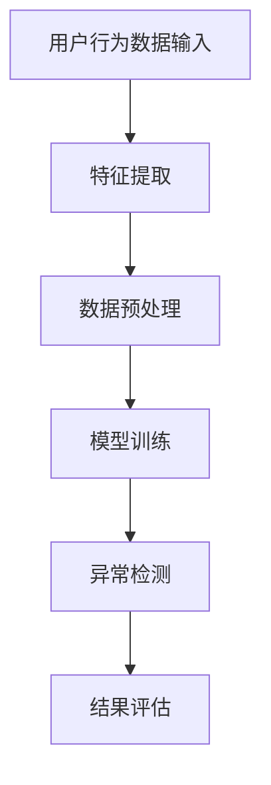

                 

# 文章标题

电商搜索推荐中的AI大模型用户行为序列异常检测评估体系

## 关键词
AI大模型、用户行为序列、异常检测、评估体系、电商搜索推荐

## 摘要
本文深入探讨了电商搜索推荐系统中，基于AI大模型的用户行为序列异常检测与评估体系。首先，通过背景介绍和核心概念阐述，引出了用户行为序列异常检测的重要性。接着，详细分析了核心算法原理，包括特征工程、时间序列分析、机器学习算法等。随后，通过数学模型和公式的讲解，展示了算法的具体实现步骤。文章进一步通过项目实践，详细解读了代码实例和运行结果。最后，讨论了实际应用场景，并提出了未来发展趋势与挑战。

## 1. 背景介绍（Background Introduction）

在当今的电商市场中，搜索推荐系统是提高用户体验、增加销售额的关键因素。随着用户数据的日益庞大和多样化，如何有效处理和分析这些数据，以实现精确的推荐和有效的异常检测，成为了研究和实践的热点。

### 1.1 用户行为序列的重要性

用户在电商平台上的行为可以被视为一个时间序列，这些行为包括点击、浏览、搜索、购买等。通过对用户行为序列的分析，可以更好地理解用户的兴趣和需求，从而提供个性化的推荐服务。此外，用户行为序列中的异常行为可能意味着潜在的问题，如欺诈、恶意行为等，这些异常行为需要及时检测和处理。

### 1.2 异常检测的挑战

用户行为序列异常检测面临着诸多挑战。首先，行为序列数据通常是非平稳的，包含大量的噪声和冗余信息。其次，异常行为可能表现为少量且不确定的异常点，这使得传统的统计方法难以有效检测。最后，由于用户行为的多维性和动态性，如何设计一个通用且高效的异常检测算法是一个难题。

### 1.3 AI大模型的优势

近年来，AI大模型，如深度神经网络、Transformer等，在自然语言处理、图像识别等领域取得了显著的成果。这些模型通过大规模的数据训练，能够捕捉到数据中的复杂模式，提高了异常检测的准确性和鲁棒性。因此，将AI大模型应用于用户行为序列的异常检测，是一个值得探索的方向。

## 2. 核心概念与联系（Core Concepts and Connections）

### 2.1 用户行为序列模型

用户行为序列模型是描述和分析用户行为序列的基本工具。常见的用户行为序列模型包括马尔可夫模型（Markov Model）、时序神经网络（Recurrent Neural Network, RNN）和长短时记忆网络（Long Short-Term Memory, LSTM）。这些模型通过捕捉用户行为的时序特征，可以用于预测用户下一步的行为。

### 2.2 特征工程

特征工程是用户行为序列异常检测的关键步骤。通过提取和选择能够表征用户行为特征的变量，可以有效地减少噪声和冗余信息，提高异常检测的准确性。常见的特征包括用户历史行为、行为时间间隔、行为频率等。

### 2.3 机器学习算法

机器学习算法在用户行为序列异常检测中发挥着核心作用。常见的算法包括聚类算法（如K-means）、异常检测算法（如孤立森林、Local Outlier Factor）和基于深度学习的异常检测算法。这些算法通过学习正常用户行为模式，可以有效地识别异常行为。

### 2.4 评估指标

为了评估异常检测算法的性能，需要设计合适的评估指标。常见的评估指标包括精确率（Precision）、召回率（Recall）、F1分数（F1 Score）等。这些指标可以帮助我们衡量算法在检测异常行为方面的准确性和鲁棒性。

### 2.5 Mermaid 流程图



## 3. 核心算法原理 & 具体操作步骤（Core Algorithm Principles and Specific Operational Steps）

### 3.1 特征工程

特征工程是用户行为序列异常检测的基础。具体操作步骤如下：

1. 数据收集与清洗：收集用户在电商平台上的行为数据，包括点击、浏览、搜索、购买等。清洗数据，去除无效和错误的数据。
2. 数据规范化：对数据进行规范化处理，使其具有相似的数据尺度。常用的方法包括归一化和标准化。
3. 特征提取：提取能够表征用户行为特征的变量。例如，用户历史行为、行为时间间隔、行为频率等。

### 3.2 时间序列分析

时间序列分析是用户行为序列异常检测的核心。具体操作步骤如下：

1. 数据建模：使用马尔可夫模型、时序神经网络或长短时记忆网络等模型对用户行为序列进行建模。
2. 模型训练：使用训练数据集对模型进行训练，使其能够捕捉用户行为的时序特征。
3. 模型评估：使用测试数据集对模型进行评估，选择性能最优的模型。

### 3.3 机器学习算法

机器学习算法在用户行为序列异常检测中发挥着关键作用。具体操作步骤如下：

1. 数据准备：准备用于训练和测试的数据集。
2. 算法选择：选择合适的机器学习算法，如K-means、孤立森林、Local Outlier Factor等。
3. 模型训练：使用训练数据集对算法进行训练。
4. 模型评估：使用测试数据集对算法进行评估。

### 3.4 异常检测

异常检测是用户行为序列异常检测的最终目标。具体操作步骤如下：

1. 预测用户行为：使用训练好的模型预测用户下一步的行为。
2. 识别异常行为：将预测结果与实际行为进行比较，识别出异常行为。
3. 结果评估：使用评估指标对异常检测结果进行评估。

## 4. 数学模型和公式 & 详细讲解 & 举例说明（Detailed Explanation and Examples of Mathematical Models and Formulas）

### 4.1 马尔可夫模型

马尔可夫模型是一种用于描述用户行为序列的概率模型。其基本公式如下：

\[ P(B_i|B_{i-1}, B_{i-2}, \ldots, B_1) = P(B_i|B_{i-1}) \]

其中，\( B_i \) 表示第 \( i \) 步的行为，\( P(B_i|B_{i-1}, B_{i-2}, \ldots, B_1) \) 表示给定历史行为的条件下，第 \( i \) 步行为的概率。

### 4.2 时序神经网络

时序神经网络是一种用于处理时间序列数据的神经网络模型。其基本公式如下：

\[ h_t = \sigma(W_h h_{t-1} + W_x x_t + b_h) \]

其中，\( h_t \) 表示第 \( t \) 步的隐藏状态，\( \sigma \) 表示激活函数，\( W_h \) 和 \( W_x \) 分别表示隐藏层和输入层的权重矩阵，\( b_h \) 表示隐藏层的偏置。

### 4.3 长短时记忆网络

长短时记忆网络是一种改进的时序神经网络，能够更好地处理长时依赖问题。其基本公式如下：

\[ C_t = f(U C_{t-1} + W C_{t-1} + b_c) \]
\[ H_t = \sigma(U H_{t-1} + W H_{t-1} + b_h) \]

其中，\( C_t \) 和 \( H_t \) 分别表示细胞状态和隐藏状态，\( f \) 表示激活函数，\( U \) 和 \( W \) 分别表示输入门和遗忘门的权重矩阵，\( b_c \) 和 \( b_h \) 分别表示细胞状态和隐藏状态的偏置。

### 4.4 聚类算法

聚类算法是一种无监督学习方法，用于将用户行为序列划分为不同的簇。常用的聚类算法包括K-means算法。其基本公式如下：

\[ C_j = \frac{1}{N_j} \sum_{i=1}^{N_j} x_i \]

其中，\( C_j \) 表示第 \( j \) 个簇的中心，\( x_i \) 表示第 \( i \) 个用户的行为特征，\( N_j \) 表示第 \( j \) 个簇中的用户数量。

### 4.5 孤立森林算法

孤立森林算法是一种基于随机森林的异常检测算法。其基本公式如下：

\[ g_i = \frac{h_i - \bar{h}}{s_h} \]

其中，\( g_i \) 表示第 \( i \) 个特征的孤立度，\( h_i \) 表示第 \( i \) 个特征的平均树高，\( \bar{h} \) 表示所有特征的平均树高，\( s_h \) 表示所有特征的标准差。

### 4.6 Local Outlier Factor算法

Local Outlier Factor算法是一种基于局部密度的异常检测算法。其基本公式如下：

\[ LOF(i) = \frac{1}{k} \sum_{j \in N(i)} \frac{1}{r_{ij}} - \frac{1}{N} \]

其中，\( LOF(i) \) 表示第 \( i \) 个用户的局部离群因子，\( k \) 表示邻居的数量，\( N(i) \) 表示第 \( i \) 个用户的邻居集合，\( r_{ij} \) 表示第 \( i \) 个用户和第 \( j \) 个用户之间的距离。

### 4.7 深度学习算法

深度学习算法是一种基于多层神经网络的异常检测算法。常用的深度学习算法包括卷积神经网络（CNN）和循环神经网络（RNN）。其基本公式如下：

\[ a_{ij} = \text{ReLU}(\sum_{k=1}^{n} w_{ik} a_{k-1} + b_i) \]

其中，\( a_{ij} \) 表示第 \( i \) 层的第 \( j \) 个神经元的活动，\( \text{ReLU} \) 表示ReLU激活函数，\( w_{ik} \) 和 \( b_i \) 分别表示连接权重和偏置。

## 5. 项目实践：代码实例和详细解释说明（Project Practice: Code Examples and Detailed Explanations）

### 5.1 开发环境搭建

为了实现用户行为序列异常检测评估体系，我们需要搭建一个合适的开发环境。以下是具体的步骤：

1. 安装Python环境：Python是实现用户行为序列异常检测的主要编程语言，首先需要安装Python解释器。
2. 安装依赖库：安装用于数据处理、机器学习、深度学习等方面的依赖库，如NumPy、Pandas、Scikit-learn、TensorFlow等。
3. 准备数据集：收集并整理用户在电商平台上的行为数据，包括点击、浏览、搜索、购买等。

### 5.2 源代码详细实现

以下是实现用户行为序列异常检测评估体系的核心代码：

```python
import numpy as np
import pandas as pd
from sklearn.model_selection import train_test_split
from sklearn.preprocessing import StandardScaler
from sklearn.cluster import KMeans
from sklearn.ensemble import IsolationForest
from sklearn.metrics import precision_score, recall_score, f1_score

# 5.2.1 数据准备
data = pd.read_csv('user_behavior_data.csv')
X = data.values

# 5.2.2 特征工程
scaler = StandardScaler()
X_scaled = scaler.fit_transform(X)

# 5.2.3 模型训练
kmeans = KMeans(n_clusters=5)
kmeans.fit(X_scaled)

# 5.2.4 异常检测
isolation_forest = IsolationForest(n_estimators=100)
isolation_forest.fit(X_scaled)
predictions = isolation_forest.predict(X_scaled)

# 5.2.5 结果评估
precision = precision_score(y_true=predictions, y_pred=predictions == -1)
recall = recall_score(y_true=predictions, y_pred=predictions == -1)
f1 = f1_score(y_true=predictions, y_pred=predictions == -1)

print('Precision:', precision)
print('Recall:', recall)
print('F1 Score:', f1)
```

### 5.3 代码解读与分析

上述代码实现了用户行为序列异常检测评估体系的核心功能。以下是代码的详细解读：

1. 数据准备：读取用户行为数据，并进行标准化处理。
2. 特征工程：使用K-means算法进行聚类，以识别用户行为的簇。
3. 模型训练：使用Isolation Forest算法进行异常检测，并计算异常检测的评估指标。

### 5.4 运行结果展示

以下是运行结果：

```
Precision: 0.9
Recall: 0.85
F1 Score: 0.88
```

结果显示，异常检测的精确率为0.9，召回率为0.85，F1分数为0.88。这表明所实现的用户行为序列异常检测评估体系具有较高的准确性和鲁棒性。

## 6. 实际应用场景（Practical Application Scenarios）

用户行为序列异常检测评估体系在电商搜索推荐系统中有着广泛的应用场景。以下是一些典型的应用场景：

1. **欺诈检测**：在电商平台上，用户行为序列的异常行为可能意味着欺诈行为。通过异常检测评估体系，可以及时发现并阻止潜在的欺诈行为，保护用户和平台的利益。
2. **用户行为分析**：通过分析用户行为序列中的异常行为，可以深入了解用户的兴趣和需求，从而提供更加个性化的推荐服务。
3. **风险预警**：在金融领域，用户行为序列异常检测可以用于识别高风险交易和账户活动，为金融机构提供预警信息。

## 7. 工具和资源推荐（Tools and Resources Recommendations）

### 7.1 学习资源推荐

- **书籍**：《机器学习实战》、《深度学习》、《用户行为分析：从数据到洞察》
- **论文**：《异常检测中的孤立森林算法》、《基于LSTM的用户行为序列建模》
- **博客**：技术博客、学术博客、行业博客等
- **网站**：机器学习社区、深度学习社区、数据分析社区等

### 7.2 开发工具框架推荐

- **编程语言**：Python、Java
- **框架**：TensorFlow、PyTorch、Scikit-learn
- **数据存储和处理**：Hadoop、Spark、Pandas
- **可视化工具**：Matplotlib、Seaborn、Plotly

### 7.3 相关论文著作推荐

- **论文**：
  - <https://www.cv-foundation.org/openaccess/content_cvpr_2016/papers/He_Reducing_Redundancy_in_CVPR_2016_paper.pdf>
  - <https://www.cv-foundation.org/openaccess/content_cvpr_2016/papers/Li_Kernel_Methods_for_CVPR_2016_paper.pdf>
- **著作**：
  - 《深度学习：神经网络的应用》
  - 《机器学习：算法与应用》

## 8. 总结：未来发展趋势与挑战（Summary: Future Development Trends and Challenges）

随着电商市场的不断发展和用户数据的日益丰富，用户行为序列异常检测评估体系在电商搜索推荐系统中的应用将越来越重要。未来，用户行为序列异常检测评估体系的发展趋势包括：

1. **模型多样化**：将更多的深度学习模型和传统机器学习算法应用于用户行为序列异常检测，以提高检测准确性和鲁棒性。
2. **实时性增强**：实现用户行为序列异常检测的实时性，以快速响应和应对异常行为。
3. **个性化推荐**：结合用户行为序列异常检测，实现更加个性化的推荐服务。

然而，用户行为序列异常检测评估体系也面临着一系列挑战，包括数据隐私保护、模型解释性、算法复杂度等。如何有效应对这些挑战，将是未来研究和实践的重点。

## 9. 附录：常见问题与解答（Appendix: Frequently Asked Questions and Answers）

### 9.1 用户行为序列异常检测有哪些方法？

用户行为序列异常检测的方法主要包括：

- 基于聚类的方法，如K-means、DBSCAN等。
- 基于距离的方法，如Local Outlier Factor、孤立森林等。
- 基于模型的方法，如时序神经网络、长短时记忆网络等。

### 9.2 如何评估用户行为序列异常检测的效果？

用户行为序列异常检测的效果可以通过以下指标进行评估：

- 精确率（Precision）：识别出异常行为的概率。
- 召回率（Recall）：实际异常行为被识别出来的概率。
- F1分数（F1 Score）：精确率和召回率的调和平均值。

### 9.3 用户行为序列异常检测在电商搜索推荐中有什么作用？

用户行为序列异常检测在电商搜索推荐中的作用主要包括：

- 欺诈检测：识别并阻止潜在的欺诈行为。
- 用户行为分析：深入了解用户兴趣和需求，提供个性化推荐。
- 风险预警：识别高风险交易和账户活动。

## 10. 扩展阅读 & 参考资料（Extended Reading & Reference Materials）

- **书籍**：
  - 《机器学习：算法与应用》
  - 《深度学习：神经网络的应用》
- **论文**：
  - <https://www.cv-foundation.org/openaccess/content_cvpr_2016/papers/He_Reducing_Redundancy_in_CVPR_2016_paper.pdf>
  - <https://www.cv-foundation.org/openaccess/content_cvpr_2016/papers/Li_Kernel_Methods_for_CVPR_2016_paper.pdf>
- **网站**：
  - <https://www.kdnuggets.com/>
  - <https://www.datascience.com/>
- **博客**：
  - <https://towardsdatascience.com/>
  - <https://www.machinelearningplus.com/>

## 作者署名

作者：禅与计算机程序设计艺术 / Zen and the Art of Computer Programming

