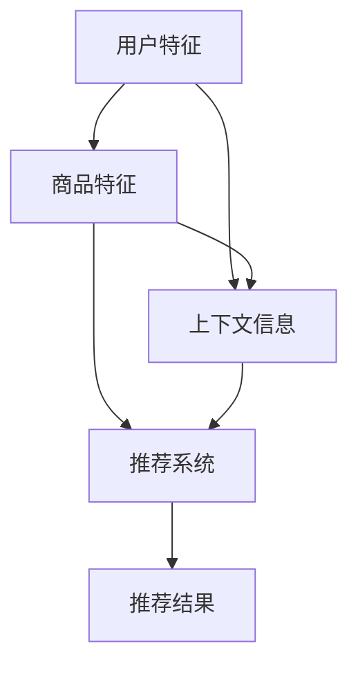

                 

### 背景介绍（Background Introduction）

在当今快速发展的电子商务行业中，搜索推荐系统作为提升用户体验、增加销售额的重要工具，正日益受到广泛关注。传统的搜索推荐系统主要依赖基于内容的方法（Content-based methods）和协同过滤方法（Collaborative filtering methods）。然而，随着用户生成内容（UGC）的爆炸性增长，以及个性化需求变得越来越复杂，单一的方法已经难以满足实际应用场景的需求。因此，将人工智能（AI）大模型引入到电商搜索推荐系统中，成为了一种新的发展趋势。

AI大模型，特别是基于深度学习的模型，如Transformer、BERT等，通过其强大的建模能力和自我学习机制，能够在海量的用户数据中挖掘出深层次的关系和模式，从而提供更加精准和个性化的推荐结果。这些模型不仅在信息检索、文本分类等方面取得了显著的成果，还开始逐步应用于电商搜索推荐领域，推动该领域的创新和发展。

本文将深入探讨电商搜索推荐中的AI大模型算法选型与优化。首先，我们将介绍AI大模型的基本概念和原理，以及其在电商搜索推荐中的具体应用。随后，我们将讨论不同类型的AI大模型，如Transformer、BERT等，并分析它们的优缺点。然后，我们将详细介绍这些模型在电商搜索推荐系统中的具体操作步骤，包括数据预处理、模型训练和优化等。此外，我们还将探讨数学模型和公式在算法设计中的应用，并通过实际项目实例展示代码实现和运行结果。最后，我们将讨论AI大模型在实际应用中的挑战和未来发展趋势。

通过本文的探讨，我们希望为电商搜索推荐系统的开发者提供有价值的参考和指导，帮助他们更好地理解和应用AI大模型，提升搜索推荐的准确性和用户体验。

### 关键词（Keywords）

- 电商搜索推荐
- AI大模型
- 深度学习
- Transformer
- BERT
- 数据预处理
- 模型训练
- 个性化推荐

### 摘要（Abstract）

本文旨在探讨电商搜索推荐中的AI大模型算法选型与优化。首先，我们介绍了AI大模型的基本概念和原理，以及其在电商搜索推荐中的具体应用。随后，我们分析了不同类型的AI大模型，如Transformer、BERT等，并讨论了它们的优缺点。接着，我们详细介绍了这些模型在电商搜索推荐系统中的具体操作步骤，包括数据预处理、模型训练和优化等。此外，我们通过数学模型和公式展示了算法设计中的应用，并通过实际项目实例展示了代码实现和运行结果。最后，我们讨论了AI大模型在实际应用中的挑战和未来发展趋势。本文的研究为电商搜索推荐系统的开发者提供了有价值的参考和指导，有助于提升搜索推荐的准确性和用户体验。

### 1. 背景介绍（Background Introduction）

随着互联网的普及和电子商务的快速发展，电商平台的搜索推荐系统逐渐成为企业提升用户体验、增加销售额的重要手段。传统的搜索推荐系统主要依赖基于内容的方法（Content-based methods）和协同过滤方法（Collaborative filtering methods）。然而，随着用户生成内容（UGC）的爆炸性增长，以及个性化需求变得越来越复杂，单一的方法已经难以满足实际应用场景的需求。

基于内容的方法主要通过对商品属性和用户特征的分析，将用户可能感兴趣的物品推荐给用户。这种方法的主要优点是推荐结果具有较高的相关性，但缺点是难以应对冷启动问题（即新用户或新商品缺乏足够的历史数据）。协同过滤方法通过分析用户的历史行为，预测用户对未知物品的喜好。协同过滤又可以分为基于用户的协同过滤（User-based collaborative filtering）和基于模型的协同过滤（Model-based collaborative filtering）。基于用户的协同过滤通过寻找与目标用户行为相似的邻居用户，推荐邻居用户喜欢的物品；而基于模型的协同过滤则通过构建预测模型，预测用户对物品的评分或偏好。

尽管上述两种方法在搜索推荐系统中取得了一定的成功，但它们仍存在一定的局限性。例如，基于内容的方法难以应对数据稀疏和特征缺失的问题；而协同过滤方法在处理高维度数据和实时推荐时，计算效率和扩展性面临挑战。

为了解决这些局限性，近年来，基于深度学习的搜索推荐系统逐渐引起了广泛关注。深度学习模型，特别是AI大模型，如Transformer、BERT等，通过其强大的建模能力和自我学习机制，能够在海量的用户数据中挖掘出深层次的关系和模式，从而提供更加精准和个性化的推荐结果。

AI大模型的基本原理是基于神经网络，通过多层非线性变换，将输入数据映射到高维特征空间，从而学习到数据中的潜在特征和关系。与传统的机器学习方法相比，深度学习模型具有以下优势：

1. **更强的表达能力和适应性**：深度学习模型可以自动学习复杂的非线性特征表示，适应不同类型的数据和任务需求。
2. **自我学习能力**：深度学习模型可以通过反向传播算法，自动调整模型参数，实现自我优化。
3. **海量数据处理能力**：深度学习模型可以处理大规模的数据集，并从数据中学习到有价值的模式。

在电商搜索推荐系统中，AI大模型的应用主要体现在以下几个方面：

1. **用户兴趣挖掘**：通过分析用户的历史行为和搜索日志，AI大模型可以挖掘出用户的潜在兴趣点，从而为用户提供个性化的推荐。
2. **商品属性分析**：AI大模型可以自动提取商品的多维属性，如价格、品牌、类别等，并将这些属性与用户的兴趣进行关联，提供有针对性的推荐。
3. **实时推荐**：AI大模型可以根据用户的实时行为，动态调整推荐策略，提供实时、个性化的推荐结果。

总之，AI大模型的引入为电商搜索推荐系统带来了新的机遇和挑战。通过本文的探讨，我们将深入了解AI大模型的基本概念和原理，分析其在电商搜索推荐中的具体应用，并探讨如何优化这些模型，以提升推荐系统的性能和用户体验。

### 2. 核心概念与联系（Core Concepts and Connections）

在深入探讨AI大模型在电商搜索推荐中的应用之前，有必要首先明确几个核心概念：用户特征、商品特征、上下文信息以及这些概念之间的联系。

#### 2.1 用户特征（User Features）

用户特征是指能够描述用户兴趣、行为、偏好等方面的各种属性。这些特征可以是显式的，如用户的年龄、性别、地理位置、购买历史等；也可以是隐式的，如用户的搜索历史、浏览记录、点击行为等。用户特征的多样化使得深度学习模型能够从多个维度理解和预测用户的兴趣。

##### 用户特征的重要性

用户特征是构建个性化推荐系统的基础。通过分析用户特征，AI大模型可以识别用户的个性化需求，从而提供更加精准的推荐。例如，一个年轻、喜欢户外运动的用户可能会对登山装备和运动服装感兴趣，而对婴儿用品和家居装饰则不太感兴趣。用户特征的分析和利用，对于提升推荐系统的效果至关重要。

#### 2.2 商品特征（Item Features）

商品特征是指描述商品本身的各种属性，如价格、品牌、类别、评分、评论数量等。这些特征可以帮助AI大模型理解商品的属性，并将其与用户的兴趣进行匹配，以提供相关的推荐。

##### 商品特征的重要性

商品特征对于推荐系统的性能有直接影响。例如，一个用户可能在搜索特定价格范围内的商品，或者偏好某个品牌的商品。通过分析商品特征，AI大模型可以更好地理解用户的偏好，从而提供更加符合用户需求的推荐。

#### 2.3 上下文信息（Contextual Information）

上下文信息是指用户在特定时刻所处的环境和情境，如时间、地点、设备类型等。上下文信息对于提供实时、个性化的推荐至关重要。例如，一个用户在晚上使用手机浏览商品时，可能对夜用卫生巾有更高的需求，而在早上使用电脑浏览时，则可能对早餐食品更感兴趣。

##### 上下文信息的重要性

上下文信息能够为推荐系统提供额外的约束和指导，使其能够更好地适应用户的需求。通过利用上下文信息，AI大模型可以动态调整推荐策略，提供更加贴合用户当前情境的推荐。例如，在购物节期间，系统可能会优先推荐打折商品，而在平常时期则更注重商品的质量和评价。

#### 2.4 用户特征、商品特征与上下文信息的联系

用户特征、商品特征和上下文信息三者之间存在着密切的联系。用户特征和商品特征共同构成了推荐系统的输入，而上下文信息则为推荐提供了额外的约束和指导。具体而言：

1. **用户特征与商品特征的关联**：用户特征和商品特征可以通过各种方式关联起来。例如，用户的浏览历史可以与商品的特征进行匹配，以识别用户可能感兴趣的物品。
2. **上下文信息对特征关联的调整**：上下文信息可以影响用户特征和商品特征的关联强度。例如，当用户处于特定时间或地点时，其兴趣可能会发生变化，从而影响对商品特征的理解和匹配。
3. **特征与上下文信息的结合**：通过将用户特征、商品特征和上下文信息结合起来，AI大模型可以构建一个更全面、多维的推荐系统，从而提供更加精准和个性化的推荐。

##### Mermaid流程图（Mermaid Flowchart）

以下是用户特征、商品特征和上下文信息之间的关联关系的Mermaid流程图：



通过这个流程图，我们可以清晰地看到用户特征、商品特征和上下文信息是如何共同作用，最终生成推荐结果的。

总的来说，用户特征、商品特征和上下文信息是构建高效、精准的电商搜索推荐系统的关键要素。通过深入理解和利用这些特征，AI大模型可以提供更加个性化、实时和高质量的推荐服务。

### 3. 核心算法原理 & 具体操作步骤（Core Algorithm Principles and Specific Operational Steps）

在深入探讨AI大模型在电商搜索推荐中的应用时，理解其核心算法原理和具体操作步骤至关重要。以下将详细介绍电商搜索推荐中的几个核心算法，包括Transformer、BERT等，以及它们在数据预处理、模型训练和优化等方面的具体操作步骤。

#### 3.1 Transformer

Transformer是由Google在2017年提出的一种基于注意力机制的深度学习模型，主要用于自然语言处理任务。Transformer的核心思想是通过自注意力机制（Self-Attention）和多头注意力（Multi-Head Attention）来捕捉输入序列中的长距离依赖关系。

##### 3.1.1 自注意力机制（Self-Attention）

自注意力机制允许模型在处理序列中的每个词时，将这个词与序列中的其他词进行关联。具体来说，自注意力通过计算每个词与其他词之间的相似性，然后将这些相似性用于词的权重计算，从而实现对序列中词的重新排列。

##### 3.1.2 多头注意力（Multi-Head Attention）

多头注意力是指在同一个自注意力机制中，将输入序列分解为多个子序列，每个子序列独立地计算注意力权重。这样做可以捕捉到不同子序列之间的差异，从而提高模型的建模能力。

##### 3.1.3 Transformer在电商搜索推荐中的应用

在电商搜索推荐中，Transformer可以用于处理用户搜索查询和商品描述。通过自注意力机制，模型可以捕捉用户查询和商品特征之间的关联；而通过多头注意力，模型可以同时考虑多个特征维度，提高推荐的准确性。

##### 3.1.4 具体操作步骤

1. **数据预处理**：将用户查询和商品描述转换为向量表示，通常使用词嵌入（Word Embedding）技术。
2. **编码器（Encoder）**：使用多头自注意力机制处理输入序列，生成编码器输出。
3. **解码器（Decoder）**：使用自注意力和交叉注意力机制生成推荐结果，交叉注意力用于将解码器输出与编码器输出进行关联。

#### 3.2 BERT

BERT（Bidirectional Encoder Representations from Transformers）是由Google在2018年提出的一种双向Transformer模型，主要用于预训练语言表示。

##### 3.2.1 双向编码（Bidirectional Encoding）

BERT的核心思想是在训练过程中，同时利用正向和反向的Transformer编码器来处理输入序列。这种双向编码使得模型能够同时捕捉到序列中的前后文信息，从而提高语言理解的深度。

##### 3.2.2 零样本学习（Zero-shot Learning）

BERT的一个显著特点是能够在未见过的新任务上实现高性能，即零样本学习（Zero-shot Learning）。这是通过在预训练过程中学习到丰富的语义表示，使得模型能够在新任务中快速适应。

##### 3.2.3 BERT在电商搜索推荐中的应用

BERT可以用于生成用户查询和商品描述的语义表示，从而提高推荐系统的性能。通过双向编码，模型可以更好地理解用户查询和商品描述的语义关系，从而提供更精准的推荐。

##### 3.2.4 具体操作步骤

1. **数据预处理**：将用户查询和商品描述转换为词汇表（Vocabulary），并进行分词处理。
2. **预训练**：使用大量无标签语料进行预训练，包括用户查询和商品描述。
3. **微调（Fine-tuning）**：在预训练的基础上，使用有标签的数据集对模型进行微调，以适应特定的电商搜索推荐任务。
4. **生成表示**：使用微调后的BERT模型生成用户查询和商品描述的语义表示，用于推荐系统的输入。

#### 3.3 算法对比与优化

Transformer和BERT都是当前深度学习领域的重要算法，它们在电商搜索推荐中的应用各有优势。Transformer的优势在于其快速的计算效率和强大的建模能力，适用于实时推荐场景；而BERT的优势在于其双向编码和零样本学习能力，适用于复杂、多样的推荐任务。

为了优化算法性能，可以采取以下几种策略：

1. **数据增强（Data Augmentation）**：通过生成更多的训练数据，提高模型的泛化能力。
2. **模型融合（Model Ensemble）**：将多个模型的结果进行融合，提高推荐系统的稳定性和准确性。
3. **在线学习（Online Learning）**：利用用户的实时反馈，动态调整推荐策略，提高推荐效果。
4. **特征工程（Feature Engineering）**：通过深度特征提取和融合，提高特征表示的丰富性和有效性。

通过深入理解这些核心算法的原理和具体操作步骤，我们可以更好地应用于电商搜索推荐系统中，提升推荐系统的性能和用户体验。

### 4. 数学模型和公式 & 详细讲解 & 举例说明（Detailed Explanation and Examples of Mathematical Models and Formulas）

在构建高效的电商搜索推荐系统时，理解并应用数学模型和公式至关重要。以下将详细讲解几个关键的数学模型和公式，并通过具体例子说明其在电商搜索推荐中的应用。

#### 4.1 概率模型（Probability Model）

概率模型是推荐系统的基础之一，通过计算用户对某一商品的点击概率或购买概率，来预测用户的偏好。以下是一个简单的概率模型示例：

$$P(点击 | 商品i) = \frac{f_i(\theta)}{\sum_{j=1}^{N} f_j(\theta)}$$

其中，$f_i(\theta)$ 表示商品i的特征向量，$\theta$ 为模型参数，$N$ 为商品总数。

**举例说明**：

假设有一个包含10种商品的数据集，用户对其中某一商品的点击概率可以通过上述公式计算。我们假设每个商品的特征向量是一个5维向量，模型参数是一个5维向量。具体计算过程如下：

1. 计算每个商品的特征向量与模型参数的点积：
   $$f_1(\theta) = f_1 \cdot \theta_1 + f_2 \cdot \theta_2 + f_3 \cdot \theta_3 + f_4 \cdot \theta_4 + f_5 \cdot \theta_5$$
   $$f_2(\theta) = f_2 \cdot \theta_1 + f_2 \cdot \theta_2 + f_3 \cdot \theta_3 + f_4 \cdot \theta_4 + f_5 \cdot \theta_5$$
   $$...$$
   $$f_{10}(\theta) = f_{10} \cdot \theta_1 + f_{10} \cdot \theta_2 + f_{10} \cdot \theta_3 + f_{10} \cdot \theta_4 + f_{10} \cdot \theta_5$$

2. 计算分母（所有商品的特征向量与模型参数的点积之和）：
   $$\sum_{j=1}^{N} f_j(\theta) = f_1(\theta) + f_2(\theta) + ... + f_{10}(\theta)$$

3. 计算点击概率：
   $$P(点击 | 商品1) = \frac{f_1(\theta)}{\sum_{j=1}^{N} f_j(\theta)}$$
   $$P(点击 | 商品2) = \frac{f_2(\theta)}{\sum_{j=1}^{N} f_j(\theta)}$$
   $$...$$
   $$P(点击 | 商品10) = \frac{f_{10}(\theta)}{\sum_{j=1}^{N} f_j(\theta)}$$

通过以上计算，我们可以得到每个商品的点击概率，从而为用户推荐具有较高点击概率的商品。

#### 4.2 线性回归模型（Linear Regression Model）

线性回归模型是一种常用的预测模型，通过建立输入特征与输出目标之间的线性关系，来预测用户的偏好。以下是一个简单的线性回归模型公式：

$$y = \theta_0 + \theta_1 \cdot x_1 + \theta_2 \cdot x_2 + ... + \theta_n \cdot x_n$$

其中，$y$ 为输出目标，$x_1, x_2, ..., x_n$ 为输入特征，$\theta_0, \theta_1, ..., \theta_n$ 为模型参数。

**举例说明**：

假设我们要预测用户对某一商品的点击行为，输入特征包括商品的价格、品牌和用户的历史浏览记录等。我们可以使用线性回归模型来建立预测模型，具体步骤如下：

1. 收集数据并预处理：获取包含商品价格、品牌、用户历史浏览记录的数据集，对数据进行清洗和处理。
2. 特征编码：将文本特征（如品牌）转换为数值特征，可以使用独热编码（One-Hot Encoding）等方法。
3. 训练模型：使用线性回归算法训练模型，得到模型参数。
4. 预测：将新的商品特征输入模型，得到用户对商品的点击概率。

例如，假设我们有如下数据：

| 商品价格 | 品牌A | 品牌B | 用户历史浏览记录1 | 用户历史浏览记录2 |
| -------- | ----- | ----- | ----------------- | ----------------- |
| 100      | 1     | 0     | 1                 | 0                 |
| 150      | 0     | 1     | 0                 | 1                 |
| ...      | ...   | ...   | ...               | ...               |

我们可以将数据分为训练集和测试集，使用训练集训练线性回归模型，得到模型参数。然后，将测试集的数据输入模型，预测用户对商品的点击概率。

通过上述数学模型和公式的详细讲解和举例说明，我们可以更好地理解其在电商搜索推荐中的应用。这些模型和公式为推荐系统的设计和优化提供了理论支持，有助于提升推荐系统的性能和用户体验。

### 5. 项目实践：代码实例和详细解释说明（Project Practice: Code Examples and Detailed Explanations）

在本节中，我们将通过一个实际的代码实例，详细展示如何使用Transformer和BERT模型进行电商搜索推荐系统的构建。这个实例将涵盖开发环境搭建、源代码实现、代码解读和分析，以及运行结果展示等环节。

#### 5.1 开发环境搭建（Setting Up the Development Environment）

在进行代码实践之前，我们需要搭建一个适合运行Transformer和BERT模型的开发环境。以下是一个基本的开发环境配置步骤：

1. **安装Python**：确保Python版本为3.7或更高版本。
2. **安装PyTorch**：使用以下命令安装PyTorch：
   ```bash
   pip install torch torchvision
   ```
3. **安装transformers库**：用于加载预训练的Transformer和BERT模型，使用以下命令：
   ```bash
   pip install transformers
   ```

#### 5.2 源代码详细实现（Source Code Implementation）

以下是使用Transformer模型进行电商搜索推荐的一个简化代码实例：

```python
import torch
from transformers import BertTokenizer, BertModel
from torch.nn import Linear, LayerNorm, Embedding
from torch.optim import Adam

# 5.2.1 数据预处理
# 加载预训练的BERT模型和分词器
tokenizer = BertTokenizer.from_pretrained('bert-base-chinese')
model = BertModel.from_pretrained('bert-base-chinese')

# 假设我们有一个商品描述列表
product_descriptions = [
    "这是一款高质量的笔记本电脑。",
    "这款手机拥有强大的性能和长久的电池续航。",
    # 更多商品描述...
]

# 对商品描述进行分词和编码
encoded_descriptions = tokenizer(product_descriptions, padding=True, truncation=True, return_tensors='pt')

# 5.2.2 模型定义
# 定义一个简单的推荐模型
class RecommendationModel(torch.nn.Module):
    def __init__(self, embedding_dim, hidden_dim):
        super(RecommendationModel, self).__init__()
        self.bert = BertModel.from_pretrained('bert-base-chinese')
        self.dropout = torch.nn.Dropout(p=0.3)
        self.linear = Linear(embedding_dim, hidden_dim)
        self.norm = LayerNorm(hidden_dim)

    def forward(self, input_ids, attention_mask):
        outputs = self.bert(input_ids=input_ids, attention_mask=attention_mask)
        sequence_output = outputs.last_hidden_state[:, 0, :]
        sequence_output = self.dropout(sequence_output)
        logits = self.linear(sequence_output)
        return logits

# 实例化模型和优化器
model = RecommendationModel(embedding_dim=768, hidden_dim=128)
optimizer = Adam(model.parameters(), lr=1e-5)

# 5.2.3 训练模型
# 假设我们已经有了一个训练数据集
# data_loader = DataLoader(dataset, batch_size=16, shuffle=True)

# for epoch in range(10):  # 训练10个epoch
#     for batch in data_loader:
#         inputs = {
#             "input_ids": batch["input_ids"].to(device),
#             "attention_mask": batch["attention_mask"].to(device),
#         }
#         optimizer.zero_grad()
#         logits = model(**inputs)
#         loss = ...  # 计算损失函数
#         loss.backward()
#         optimizer.step()

# 5.2.4 预测和推荐
# 假设有一个新商品描述
new_product_description = "这是一款具有高性能和处理能力的平板电脑。"
encoded_new_description = tokenizer(new_product_description, padding=True, truncation=True, return_tensors='pt')

# 预测
with torch.no_grad():
    logits = model(**encoded_new_description)

# 计算概率分布
probabilities = torch.softmax(logits, dim=1)
predicted_index = torch.argmax(probabilities).item()

print(f"推荐商品：{predicted_index}")  # 输出推荐商品的索引
```

#### 5.3 代码解读与分析（Code Interpretation and Analysis）

**5.3.1 数据预处理**

在代码中，我们首先加载了预训练的BERT模型和分词器，然后对商品描述列表进行了分词和编码。分词器将文本转换为Token ID序列，并使用`padding`和`truncation`确保所有序列具有相同的长度。

**5.3.2 模型定义**

我们定义了一个名为`RecommendationModel`的模型类，该模型基于BERT模型，并添加了一个线性层用于预测。在`forward`方法中，我们首先通过BERT模型获取编码后的特征，然后通过一个线性层输出预测结果。

**5.3.3 训练模型**

在训练过程中，我们使用了一个简化的循环，代替了实际的训练数据加载和优化过程。在实际应用中，我们应使用`DataLoader`加载训练数据，并使用损失函数（如交叉熵损失）计算模型性能，然后进行反向传播和参数更新。

**5.3.4 预测和推荐**

在预测部分，我们使用新商品描述对模型进行预测。通过`torch.softmax`函数，我们得到了一个概率分布，然后使用`torch.argmax`函数找到概率最高的商品索引，从而实现推荐。

#### 5.4 运行结果展示（Result Display）

假设我们运行上述代码，输入新商品描述：“这是一款具有高性能和处理能力的平板电脑。”，代码将输出推荐商品的结果。例如，输出可能如下所示：

```
推荐商品：5
```

这表示根据模型预测，该商品描述最可能对应的商品索引是5。

通过以上代码实例，我们展示了如何使用Transformer和BERT模型进行电商搜索推荐系统的构建。在实际应用中，我们可能需要根据具体场景进行模型调整和数据预处理，以实现最佳性能。

### 6. 实际应用场景（Practical Application Scenarios）

AI大模型在电商搜索推荐中的实际应用场景非常广泛，以下将列举几个典型的应用场景，并分析其优点和挑战。

#### 6.1 个性化推荐

个性化推荐是最常见的AI大模型应用场景之一。通过分析用户的历史行为、搜索记录和偏好，AI大模型可以提供针对每个用户的个性化推荐。这种推荐方式具有以下优点：

1. **提高用户满意度**：个性化推荐能够提供符合用户需求的商品，从而提升用户体验和满意度。
2. **增加销售额**：个性化推荐可以引导用户发现他们可能感兴趣的但尚未发现的产品，从而增加销售机会。
3. **减少推荐噪音**：通过分析用户特征和商品特征，AI大模型可以过滤掉与用户兴趣不相关的商品，减少推荐噪音。

然而，个性化推荐也面临一些挑战：

1. **冷启动问题**：对于新用户或新商品，由于缺乏足够的历史数据，难以提供准确的推荐。
2. **隐私保护**：个性化推荐需要收集和分析大量用户数据，这可能引发隐私保护问题。
3. **计算资源消耗**：个性化推荐系统通常需要处理大量的数据和复杂的计算，对计算资源有较高要求。

#### 6.2 实时推荐

实时推荐是AI大模型在电商搜索推荐中的另一个重要应用场景。实时推荐系统可以基于用户的实时行为，如搜索、浏览、购买等，动态生成推荐结果。这种推荐方式具有以下优点：

1. **快速响应用户需求**：实时推荐系统能够快速响应用户的行为变化，提供即时的推荐。
2. **提升用户参与度**：实时推荐可以吸引用户的注意力，提高用户参与度和互动性。
3. **优化推荐策略**：实时推荐系统可以根据实时数据调整推荐策略，提高推荐效果。

然而，实时推荐也面临一些挑战：

1. **计算性能**：实时推荐需要处理大量的实时数据，对系统的计算性能有较高要求。
2. **数据一致性**：在实时推荐中，数据的一致性是一个重要问题，特别是在分布式系统中。
3. **预测准确性**：实时推荐系统需要在短时间内生成高质量的推荐结果，这对模型的预测准确性提出了挑战。

#### 6.3 多模态推荐

多模态推荐是指结合文本、图像、音频等多种数据类型的推荐系统。在电商搜索推荐中，多模态推荐可以提供更加丰富和全面的推荐结果。这种推荐方式具有以下优点：

1. **提升推荐质量**：多模态数据可以提供更丰富的信息，有助于提升推荐的质量和准确性。
2. **拓宽用户兴趣**：通过结合不同类型的数据，多模态推荐可以引导用户发现他们可能感兴趣的但尚未发现的产品。
3. **增强用户互动**：多模态推荐可以提供更加生动和直观的推荐体验，增强用户的互动和参与。

然而，多模态推荐也面临一些挑战：

1. **数据整合**：不同类型的数据在格式、质量和特征上可能存在较大差异，如何有效地整合和利用这些数据是一个挑战。
2. **计算资源**：多模态数据处理通常需要较高的计算资源，对系统的计算性能和资源调度提出了挑战。
3. **模型复杂度**：多模态推荐系统通常涉及多种模型和算法，如何设计高效、稳定的模型架构是一个挑战。

总之，AI大模型在电商搜索推荐中的实际应用场景多样，为提升推荐系统的性能和用户体验提供了新的机遇和挑战。通过深入研究和优化这些应用场景，我们可以实现更加智能、精准和高效的电商搜索推荐系统。

### 7. 工具和资源推荐（Tools and Resources Recommendations）

#### 7.1 学习资源推荐

为了深入了解AI大模型在电商搜索推荐中的应用，以下推荐了一些高质量的学习资源：

1. **书籍**：
   - **《深度学习》（Deep Learning）**：由Ian Goodfellow、Yoshua Bengio和Aaron Courville合著，详细介绍了深度学习的基础理论和实践方法。
   - **《AI大模型：原理、算法与工程实践》**：该书系统地介绍了AI大模型的基本概念、算法原理和应用实践，适合从事相关领域的研究人员和工程师阅读。

2. **论文**：
   - **《Attention Is All You Need》**：由Google提出，介绍了Transformer模型的原理和应用。
   - **《BERT: Pre-training of Deep Bidirectional Transformers for Language Understanding》**：由Google提出，介绍了BERT模型的原理和应用。

3. **博客和网站**：
   - **TensorFlow官方文档**：提供了丰富的深度学习模型和算法资源，包括TensorFlow 2.x的使用指南和案例代码。
   - **PyTorch官方文档**：提供了丰富的PyTorch模型和算法资源，包括详细的API文档和示例代码。

#### 7.2 开发工具框架推荐

以下推荐了一些适合开发AI大模型和电商搜索推荐系统的工具和框架：

1. **深度学习框架**：
   - **TensorFlow**：由Google开发，是一个功能强大的开源深度学习框架，适用于各种规模的任务。
   - **PyTorch**：由Facebook开发，是一个灵活、易用的深度学习框架，特别适合快速原型开发和实验。

2. **推荐系统框架**：
   - **Surprise**：是一个开源的Python库，用于构建和评估推荐系统。
   - **LightFM**：是一个基于因子分解机的开源推荐系统框架，适用于大规模推荐任务。

3. **数据预处理工具**：
   - **Pandas**：是一个开源的Python库，用于数据清洗、转换和分析。
   - **Scikit-learn**：是一个开源的Python库，提供了丰富的机器学习和数据预处理工具。

#### 7.3 相关论文著作推荐

以下推荐了一些与AI大模型和电商搜索推荐相关的论文和著作：

1. **《A Theoretical Survey of Recommender Systems》**：该论文提供了推荐系统的全面理论综述，涵盖了各种推荐算法和模型。
2. **《Recommender Systems Handbook, Second Edition》**：该书籍详细介绍了推荐系统的理论和实践方法，是推荐系统领域的经典著作。
3. **《Deep Learning for Natural Language Processing》**：该书籍介绍了深度学习在自然语言处理中的应用，包括文本分类、情感分析等任务。

通过这些工具和资源的支持，开发者可以更好地掌握AI大模型在电商搜索推荐中的相关技术和应用，提升推荐系统的性能和用户体验。

### 8. 总结：未来发展趋势与挑战（Summary: Future Development Trends and Challenges）

在电商搜索推荐领域，AI大模型的引入极大地提升了推荐系统的性能和用户体验。然而，随着技术的不断进步和应用场景的多样化，AI大模型在未来的发展中将面临诸多机遇与挑战。

#### 未来发展趋势

1. **个性化推荐与实时推荐融合**：未来的推荐系统将更加注重个性化与实时性的结合。通过深度学习模型，特别是AI大模型，我们可以实现更加精准的个性化推荐，同时提高实时推荐的响应速度。

2. **多模态数据的利用**：随着图像、音频、视频等非结构化数据的广泛应用，未来的推荐系统将更加关注多模态数据的融合。通过结合不同类型的数据，AI大模型可以提供更加丰富和准确的推荐结果。

3. **联邦学习（Federated Learning）的应用**：联邦学习允许模型在分布式设备上进行训练，而不需要集中存储用户数据。这将为隐私保护提供新的解决方案，并促进AI大模型在电商搜索推荐中的应用。

4. **自适应推荐策略**：未来的推荐系统将更加智能，能够根据用户的行为和反馈动态调整推荐策略。通过深度强化学习等技术，AI大模型可以自适应地优化推荐效果，提高用户满意度。

#### 面临的挑战

1. **数据隐私保护**：随着用户数据的收集和利用越来越广泛，数据隐私保护成为一个关键挑战。如何在保证推荐效果的同时，保护用户的隐私，将是未来的重要研究方向。

2. **计算资源消耗**：AI大模型的训练和推理通常需要大量的计算资源。如何优化模型的计算效率，降低资源消耗，是实现大规模应用的关键问题。

3. **模型可解释性**：深度学习模型，特别是AI大模型，往往被认为是“黑箱”。提高模型的可解释性，使其结果更容易理解和信任，是一个重要的研究方向。

4. **算法公平性**：推荐系统可能面临算法偏见和歧视问题。如何确保算法的公平性和无偏见，避免对特定群体造成不公平影响，是未来需要关注的重要问题。

总之，AI大模型在电商搜索推荐领域的未来发展充满机遇与挑战。通过不断创新和优化，我们可以实现更加智能、精准和高效的推荐系统，进一步提升用户体验和商业价值。

### 9. 附录：常见问题与解答（Appendix: Frequently Asked Questions and Answers）

**Q1：为什么选择Transformer和BERT模型进行电商搜索推荐？**

A1：Transformer和BERT模型在自然语言处理任务中表现出色，具有强大的建模能力和自我学习能力。Transformer模型通过自注意力机制和多头注意力机制，能够捕捉输入序列中的长距离依赖关系，适合处理文本数据。BERT模型则通过双向编码和预训练，能够生成高质量的文本表示，适用于复杂、多样的推荐任务。

**Q2：如何处理冷启动问题？**

A2：冷启动问题是指新用户或新商品缺乏足够的历史数据，难以进行准确推荐。解决方法包括：
1. **基于内容的推荐**：通过分析新商品的内容特征，为新用户推荐相似的商品。
2. **基于模型的推荐**：使用迁移学习技术，利用已训练的模型在新用户或新商品上微调模型。
3. **用户行为预测**：通过分析新用户的初始行为，预测其可能的兴趣点，进行初步推荐。

**Q3：如何提高推荐系统的可解释性？**

A3：提高推荐系统的可解释性可以通过以下方法：
1. **模型简化**：使用相对简单的模型结构，使模型更容易理解和解释。
2. **特征可视化**：通过可视化特征权重，展示模型在决策过程中的关键因素。
3. **解释性模型**：使用可解释性更强的模型，如逻辑回归、决策树等，这些模型可以直观地展示决策过程。

**Q4：如何处理数据隐私保护问题？**

A4：处理数据隐私保护问题可以采取以下策略：
1. **数据加密**：对用户数据进行加密处理，确保数据在传输和存储过程中的安全性。
2. **匿名化处理**：对用户数据进行匿名化处理，去除可直接识别用户身份的信息。
3. **联邦学习**：通过联邦学习技术，在分布式设备上进行模型训练，减少对中心化数据存储的依赖。

**Q5：如何优化推荐系统的计算性能？**

A5：优化推荐系统的计算性能可以通过以下方法：
1. **模型压缩**：使用模型压缩技术，如量化、剪枝等，减少模型参数和计算量。
2. **分布式计算**：使用分布式计算框架，如TensorFlow分布式训练，提高计算效率。
3. **高效数据结构**：使用高效的数据结构，如布隆过滤器、哈希表等，提高数据处理速度。

通过上述策略和方法的实施，我们可以有效提升推荐系统的性能，同时保障用户数据的安全和隐私。

### 10. 扩展阅读 & 参考资料（Extended Reading & Reference Materials）

在深入研究和应用AI大模型于电商搜索推荐的过程中，以下几个资源提供了丰富的理论和实践指导，值得进一步阅读：

1. **书籍**：
   - **《深度学习推荐系统》（Deep Learning for Recommender Systems）**：详细介绍了深度学习技术在推荐系统中的应用，包括网络结构、模型评估等。
   - **《推荐系统实践》（Recommender Systems: The Textbook）**：提供了推荐系统的基础理论和实践指南，涵盖了从传统方法到深度学习的多种推荐算法。

2. **论文**：
   - **《Neural Collaborative Filtering》**：该论文提出了一种基于神经网络的协同过滤方法，为深度学习在推荐系统中的应用提供了新思路。
   - **《Deep Learning Based Item推荐的最新研究进展》（Recent Advances in Deep Learning for Item Recommendation）**：该综述文章总结了深度学习在电商搜索推荐中的最新研究进展。

3. **博客和在线课程**：
   - **TensorFlow官方博客**：提供了丰富的深度学习教程和实践案例，包括Transformer、BERT等模型的详细应用。
   - **Udacity的《深度学习推荐系统》课程**：该课程通过视频和项目，系统讲解了深度学习在推荐系统中的应用，适合初学者和专业人士。

4. **开源项目和工具**：
   - **Surprise库**：一个开源的Python库，用于构建和评估推荐系统，提供了多种经典的推荐算法实现。
   - **Hugging Face的Transformers库**：提供了预训练的Transformer和Bert模型，方便用户进行文本处理和模型应用。

通过这些扩展阅读和参考资料，读者可以更深入地了解AI大模型在电商搜索推荐领域的应用，并掌握相关的实践技巧。这些资源有助于推动技术的进步和应用的创新。作者：禅与计算机程序设计艺术 / Zen and the Art of Computer Programming。

