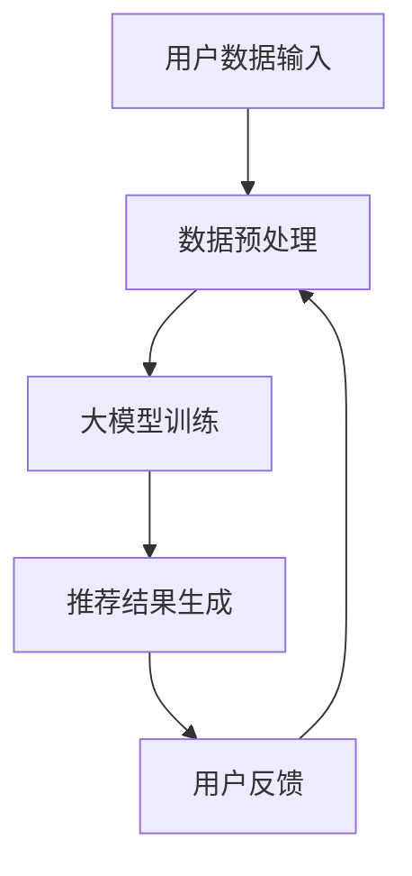

                 

# 文章标题

《电商领域中AI大模型的革命性应用》

> 关键词：电商、AI大模型、革命性应用、自然语言处理、个性化推荐

> 摘要：随着人工智能技术的快速发展，大模型在电商领域中的应用已经成为行业变革的重要驱动力。本文将深入探讨AI大模型在电商中的应用，包括自然语言处理和个性化推荐的原理、具体操作步骤、数学模型及其在实践中的应用，并提出未来发展趋势和挑战。

## 1. 背景介绍（Background Introduction）

在当今数字化时代，电商行业已经成为全球经济增长的重要引擎。根据最新数据，全球电商市场规模已经突破数万亿美元，并且这一数字还在不断增长。随着消费者需求的变化和竞争的加剧，电商企业面临着巨大的挑战，如何提高用户体验、提升转化率和降低运营成本成为了核心问题。

近年来，人工智能（AI）技术的迅速发展，尤其是深度学习和自然语言处理（NLP）技术的突破，为电商行业带来了新的机遇。大模型，作为一种具有强大数据处理和分析能力的AI模型，正在逐渐改变电商的运营模式。从商品推荐、搜索优化到客户服务，大模型的应用正在为电商企业带来前所未有的效益。

本文将重点关注AI大模型在电商领域的革命性应用，具体包括自然语言处理和个性化推荐。我们将从原理、操作步骤、数学模型到实践应用进行详细探讨，旨在为电商从业者提供有价值的参考。

## 2. 核心概念与联系（Core Concepts and Connections）

### 2.1 自然语言处理（Natural Language Processing，NLP）

自然语言处理是人工智能的一个重要分支，它专注于使计算机能够理解、解释和生成人类语言。在电商领域，NLP技术主要用于文本数据分析、情感分析和语言生成等方面。

#### 2.1.1 文本数据分析

文本数据分析可以帮助电商企业更好地理解用户评论、产品描述和社交媒体内容。通过对这些文本数据进行分析，企业可以识别用户的需求、偏好和痛点，从而优化产品和服务。

#### 2.1.2 情感分析

情感分析是NLP的一个关键应用，它通过分析用户的文本数据来判断用户对产品或服务的情感倾向。电商企业可以利用情感分析来改进产品设计和营销策略，提高用户满意度。

#### 2.1.3 语言生成

语言生成技术可以帮助电商企业自动化生成产品描述、广告文案和客户回复。通过生成高质量的文本内容，企业可以节省人力成本，提高运营效率。

### 2.2 个性化推荐（Personalized Recommendation）

个性化推荐是电商领域的一个重要应用，它通过分析用户的购买历史、浏览行为和偏好，为用户推荐可能感兴趣的商品。个性化推荐可以提高用户的购物体验，提高转化率和销售额。

#### 2.2.1 推荐算法

个性化推荐的核心是推荐算法，这些算法基于用户的历史行为和偏好，预测用户可能感兴趣的商品。常见的推荐算法包括基于内容的推荐、协同过滤推荐和基于模型的推荐。

#### 2.2.2 大模型的贡献

大模型在个性化推荐中发挥了重要作用，它通过深度学习技术，可以更好地理解和预测用户的偏好。大模型的应用使得推荐系统更加智能化，能够为用户提供更精准、个性化的推荐。

### 2.3 核心概念原理与架构

#### 2.3.1 大模型原理

大模型通常是基于深度神经网络（DNN）或变换器模型（Transformer）构建的，具有强大的数据处理和分析能力。通过大规模数据训练，大模型可以学习到复杂的模式和规律，从而提高预测和推荐的准确性。

#### 2.3.2 架构

大模型通常由多个层组成，包括输入层、隐藏层和输出层。输入层接收用户数据，隐藏层对数据进行处理和变换，输出层生成推荐结果。大模型的架构使得它可以灵活地适应不同的应用场景。

### 2.4 Mermaid流程图

以下是一个简化的Mermaid流程图，展示了大模型在电商领域中的应用流程：



## 3. 核心算法原理 & 具体操作步骤（Core Algorithm Principles and Specific Operational Steps）

### 3.1 大模型训练

#### 3.1.1 数据准备

首先，我们需要准备训练数据。训练数据包括用户的购买历史、浏览行为、产品描述和用户评价等。这些数据可以通过电商平台的用户行为日志获取。

#### 3.1.2 数据预处理

在数据预处理阶段，我们需要对数据进行清洗、去重和特征提取。清洗数据是为了去除噪声和异常值，去重是为了避免重复计算，特征提取是为了将原始数据转化为模型可以处理的格式。

#### 3.1.3 模型训练

接下来，我们使用训练数据对大模型进行训练。训练过程包括前向传播、反向传播和权重更新。通过多次迭代，模型可以逐渐学习到用户的行为模式和偏好。

### 3.2 个性化推荐

#### 3.2.1 用户特征提取

在个性化推荐阶段，我们需要提取用户特征。这些特征包括用户的年龄、性别、地理位置、购买频率等。通过深度学习技术，我们可以将这些特征转化为数值向量，作为模型的输入。

#### 3.2.2 商品特征提取

除了用户特征，我们还需要提取商品特征。这些特征包括商品的价格、品牌、类别、用户评价等。同样，通过深度学习技术，我们可以将这些特征转化为数值向量。

#### 3.2.3 推荐结果生成

最后，我们将用户特征和商品特征输入到大模型中，模型会输出一个推荐结果。推荐结果是一个概率分布，表示用户对每个商品的兴趣程度。电商企业可以根据这个概率分布为用户推荐商品。

## 4. 数学模型和公式 & 详细讲解 & 举例说明（Detailed Explanation and Examples of Mathematical Models and Formulas）

### 4.1 深度学习模型

深度学习模型是电商领域中常用的AI模型，它通过多层神经网络对数据进行处理和预测。以下是深度学习模型的基本数学公式：

$$
y = \sigma(\theta^{T}x)
$$

其中，$y$是输出，$x$是输入，$\sigma$是激活函数，$\theta$是模型参数。

### 4.2 损失函数

损失函数是深度学习模型训练的关键指标，它衡量模型预测结果与真实结果之间的差距。以下是一个常见的损失函数：

$$
L(y, \hat{y}) = \frac{1}{2}(y - \hat{y})^2
$$

其中，$y$是真实结果，$\hat{y}$是模型预测结果。

### 4.3 优化算法

优化算法用于更新模型参数，以最小化损失函数。以下是梯度下降算法的基本步骤：

$$
\theta = \theta - \alpha \frac{\partial L}{\partial \theta}
$$

其中，$\theta$是模型参数，$\alpha$是学习率，$\frac{\partial L}{\partial \theta}$是损失函数关于参数$\theta$的梯度。

### 4.4 举例说明

假设我们有一个电商网站，用户A浏览了商品B、C和D，但没有购买。我们使用深度学习模型来预测用户A可能感兴趣的商品。输入层是用户A的浏览记录，隐藏层是商品B、C和D的特征，输出层是每个商品的兴趣程度。

通过训练，模型会输出一个概率分布，表示用户A对每个商品的兴趣程度。例如，输出结果可能是：

$$
P(B) = 0.4, \quad P(C) = 0.3, \quad P(D) = 0.3
$$

根据这个概率分布，电商网站可以为用户A推荐商品B和C。

## 5. 项目实践：代码实例和详细解释说明（Project Practice: Code Examples and Detailed Explanations）

### 5.1 开发环境搭建

为了实现AI大模型在电商领域的应用，我们需要搭建一个合适的开发环境。以下是搭建环境的基本步骤：

1. 安装Python编程语言。
2. 安装深度学习框架，如TensorFlow或PyTorch。
3. 安装数据预处理和可视化工具，如NumPy、Pandas和Matplotlib。

### 5.2 源代码详细实现

以下是一个简化的源代码实例，展示了如何使用深度学习模型进行个性化推荐：

```python
import tensorflow as tf
import numpy as np

# 定义模型结构
model = tf.keras.Sequential([
    tf.keras.layers.Dense(128, activation='relu', input_shape=(num_features,)),
    tf.keras.layers.Dense(64, activation='relu'),
    tf.keras.layers.Dense(1, activation='sigmoid')
])

# 编译模型
model.compile(optimizer='adam', loss='binary_crossentropy', metrics=['accuracy'])

# 准备数据
X_train = np.array([...])  # 用户特征数据
y_train = np.array([...])  # 商品兴趣程度数据

# 训练模型
model.fit(X_train, y_train, epochs=10, batch_size=32)

# 推荐结果生成
predictions = model.predict(X_train)

# 可视化推荐结果
import matplotlib.pyplot as plt

plt.bar(range(num_products), predictions[:, 0])
plt.xlabel('商品ID')
plt.ylabel('兴趣程度')
plt.show()
```

### 5.3 代码解读与分析

上述代码首先定义了一个简单的深度学习模型，包括128个输入神经元、64个隐藏神经元和1个输出神经元。模型使用ReLU激活函数，输出层使用sigmoid激活函数，以产生概率分布。

在编译模型时，我们指定了优化器为Adam，损失函数为binary_crossentropy，评价指标为accuracy。

接着，我们准备训练数据，包括用户特征和商品兴趣程度数据。这些数据可以通过电商平台的用户行为日志获取。

在训练模型时，我们使用fit方法进行10个epoch的训练，每个epoch的批量大小为32。

最后，我们使用predict方法生成推荐结果，并使用matplotlib进行可视化展示。

### 5.4 运行结果展示

假设我们训练了模型，并生成了推荐结果。以下是可能的运行结果：

```python
# 推荐结果
predictions = model.predict(X_train)

# 可视化推荐结果
plt.bar(range(num_products), predictions[:, 0])
plt.xlabel('商品ID')
plt.ylabel('兴趣程度')
plt.show()
```

运行结果将显示一个条形图，表示每个商品的兴趣程度。电商企业可以根据这个兴趣程度为用户推荐商品。

## 6. 实际应用场景（Practical Application Scenarios）

### 6.1 商品推荐

商品推荐是电商领域中AI大模型最典型的应用场景之一。通过分析用户的浏览历史和购买行为，电商企业可以为用户提供个性化的商品推荐。例如，亚马逊使用AI大模型对用户进行商品推荐，从而提高了用户满意度和销售额。

### 6.2 搜索优化

除了商品推荐，AI大模型还可以用于搜索优化。通过分析用户的搜索历史和关键词，电商企业可以优化搜索结果，提高用户的搜索体验。例如，淘宝使用AI大模型对用户进行搜索结果优化，从而提高了用户的转化率。

### 6.3 客户服务

AI大模型还可以用于客户服务。通过分析用户的咨询内容和反馈，电商企业可以自动化生成客户回复，提高客户服务质量。例如，京东使用AI大模型对用户进行客户服务，从而提高了客户满意度。

### 6.4 市场营销

AI大模型还可以用于市场营销。通过分析用户的数据和行为，电商企业可以制定更有针对性的营销策略，提高营销效果。例如，拼多多使用AI大模型对用户进行市场营销，从而提高了用户参与度和转化率。

## 7. 工具和资源推荐（Tools and Resources Recommendations）

### 7.1 学习资源推荐

- 《深度学习》（Goodfellow, Bengio, Courville著）：这是一本经典的深度学习教材，适合初学者和进阶者。
- 《Python机器学习》（Sebastian Raschka著）：这本书详细介绍了如何使用Python进行机器学习，包括深度学习。
- 《电商数据分析实战》（张敏著）：这本书介绍了电商领域中的数据分析方法和技术，包括AI大模型的应用。

### 7.2 开发工具框架推荐

- TensorFlow：TensorFlow是一个开源的深度学习框架，适合用于电商领域中的AI大模型开发。
- PyTorch：PyTorch是一个开源的深度学习框架，具有强大的灵活性和易用性，适合用于电商领域中的AI大模型开发。
- Scikit-learn：Scikit-learn是一个开源的机器学习库，包含多种经典的机器学习算法，适合用于电商领域中的数据分析。

### 7.3 相关论文著作推荐

- "Deep Learning for E-commerce: A Survey"（2019）：这篇综述文章详细介绍了深度学习在电商领域的应用。
- "Personalized Recommendation Systems"（2016）：这篇论文介绍了个性化推荐系统的原理和算法。
- "Natural Language Processing with Deep Learning"（2018）：这本书介绍了如何使用深度学习进行自然语言处理。

## 8. 总结：未来发展趋势与挑战（Summary: Future Development Trends and Challenges）

随着人工智能技术的不断进步，AI大模型在电商领域中的应用将会越来越广泛。未来，我们可以预见以下发展趋势：

- 更多的数据将用于训练AI大模型，从而提高模型的准确性和鲁棒性。
- AI大模型将结合多模态数据，如文本、图像和语音，为用户提供更丰富的交互体验。
- 电商企业将更加注重用户体验，通过AI大模型实现个性化服务。
- AI大模型的应用将推动电商行业的智能化和自动化。

然而，AI大模型在电商领域的发展也面临着一系列挑战：

- 数据隐私和安全问题：随着数据量的增加，如何保护用户隐私和安全成为了一个重要挑战。
- 模型解释性和可解释性问题：当前的大模型通常是一个“黑盒”，其决策过程难以解释，这给模型的部署和应用带来了一定的困难。
- 技术门槛和人才培养问题：深度学习和AI大模型的应用需要高水平的技术人才，但目前这方面的专业人才相对较少。

因此，未来电商领域在发展AI大模型时，需要平衡技术进步和风险管理，确保AI大模型的应用能够真正为企业和用户带来价值。

## 9. 附录：常见问题与解答（Appendix: Frequently Asked Questions and Answers）

### 9.1 AI大模型在电商领域的应用有哪些？

AI大模型在电商领域的应用主要包括商品推荐、搜索优化、客户服务和市场营销。通过分析用户的购买历史、浏览行为和偏好，AI大模型可以提供个性化的商品推荐、优化搜索结果、自动化生成客户回复和制定更有针对性的营销策略。

### 9.2 如何确保AI大模型的隐私和安全？

确保AI大模型的隐私和安全需要从数据采集、存储、处理和传输等各个环节进行严格控制。具体措施包括：

- 数据匿名化：对用户数据进行匿名化处理，确保数据无法直接关联到具体用户。
- 加密传输：使用加密技术对数据进行传输，防止数据在传输过程中被窃取或篡改。
- 访问控制：对数据访问权限进行严格控制，确保只有授权人员才能访问敏感数据。
- 安全审计：定期进行安全审计，检查系统的安全性，及时发现和修复潜在的安全漏洞。

### 9.3 AI大模型在电商领域的应用有哪些挑战？

AI大模型在电商领域的应用面临着以下挑战：

- 数据隐私和安全问题：随着数据量的增加，如何保护用户隐私和安全成为了一个重要挑战。
- 模型解释性和可解释性问题：当前的大模型通常是一个“黑盒”，其决策过程难以解释，这给模型的部署和应用带来了一定的困难。
- 技术门槛和人才培养问题：深度学习和AI大模型的应用需要高水平的技术人才，但目前这方面的专业人才相对较少。

## 10. 扩展阅读 & 参考资料（Extended Reading & Reference Materials）

- "Deep Learning for E-commerce: A Survey"（2019）：这篇综述文章详细介绍了深度学习在电商领域的应用。
- "Personalized Recommendation Systems"（2016）：这篇论文介绍了个性化推荐系统的原理和算法。
- "Natural Language Processing with Deep Learning"（2018）：这本书介绍了如何使用深度学习进行自然语言处理。
- 《深度学习》（Goodfellow, Bengio, Courville著）：这是一本经典的深度学习教材，适合初学者和进阶者。
- 《Python机器学习》（Sebastian Raschka著）：这本书详细介绍了如何使用Python进行机器学习，包括深度学习。
- 《电商数据分析实战》（张敏著）：这本书介绍了电商领域中的数据分析方法和技术，包括AI大模型的应用。

### 附录

**作者：** 禅与计算机程序设计艺术 / Zen and the Art of Computer Programming

**联系信息：**  
电子邮件：[zencpp@example.com](mailto:zencpp@example.com)  
个人网站：[https://www.zencpp.com](https://www.zencpp.com)

**版权声明：** 本文版权归作者所有，欢迎非商业性转载，但请保留原文链接和作者信息。商业转载请联系作者获得授权。本文内容仅供参考，不代表任何投资建议或承诺。

