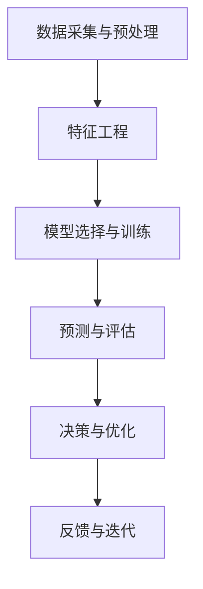

                 

### 文章标题

**电商领域的AI驱动预测分析：一人公司的决策支持系统**

在当今的数字化时代，人工智能（AI）技术已成为电商领域的重要组成部分，它通过提供强大的预测分析能力，助力企业优化决策，提高运营效率。本篇博客将探讨如何构建一个由AI驱动的决策支持系统，以实现一人公司的运营自动化与智能化。

## 关键词

- 人工智能
- 预测分析
- 电商
- 决策支持系统
- 运营自动化
- 运营智能化

## 摘要

本文将深入探讨电商领域AI驱动预测分析的应用与实践，阐述如何通过构建一人公司的决策支持系统，利用AI技术实现精准的销售额预测、库存管理、客户行为分析等关键业务环节的优化。文章将通过详细的步骤和方法，展示如何运用人工智能技术提升一人公司的运营效率，为企业主提供有价值的决策依据。

接下来，我们将从背景介绍、核心概念与联系、核心算法原理、数学模型和公式、项目实践、实际应用场景、工具和资源推荐、总结与未来发展趋势等方面进行详细阐述。

<|im_sep|>### 1. 背景介绍

在电商行业，竞争日益激烈，消费者需求不断变化，企业需要快速适应市场动态，做出准确的决策。然而，传统的人工管理模式往往效率低下，难以应对大规模的数据处理和复杂的市场分析。此时，AI驱动预测分析作为一种新兴的技术手段，逐渐受到企业的重视。

一人公司，指的是仅由一位企业主运营的公司，其运营管理面临独特的挑战。一方面，企业主需要承担从营销、运营到客户服务等多方面的职责；另一方面，资源有限，需要通过高效的决策来确保业务的持续增长。因此，构建一个AI驱动的决策支持系统，对于一人公司来说具有重要意义。

AI驱动预测分析在电商领域的主要应用包括：

- **销售额预测**：通过历史销售数据、市场趋势、消费者行为等因素，预测未来的销售额，为企业制定销售策略提供依据。
- **库存管理**：根据销售预测和市场需求，优化库存水平，减少库存积压，提高库存周转率。
- **客户行为分析**：分析客户购买行为，了解客户需求，提供个性化的推荐和促销策略，提升客户满意度和忠诚度。
- **风险预测与控制**：预测潜在的市场风险，如季节性波动、竞争对手策略变化等，采取相应的风险控制措施。

通过AI驱动预测分析，一人公司可以实现以下目标：

- **提高运营效率**：自动化处理大量数据，减少人工干预，提高决策速度。
- **优化资源配置**：合理分配资源，降低库存成本，提高营销效果。
- **提升客户满意度**：提供个性化的产品推荐和服务，增强客户黏性。
- **降低运营风险**：预测潜在风险，提前采取应对措施，确保业务稳定发展。

<|im_sep|>### 2. 核心概念与联系

要构建一个AI驱动的决策支持系统，需要理解以下几个核心概念：

#### 2.1 数据采集与预处理

数据采集是预测分析的基础。一人公司需要收集与业务相关的数据，包括销售数据、库存数据、客户数据等。数据采集完成后，需要进行数据预处理，如数据清洗、去重、格式化等，以确保数据的质量和一致性。

#### 2.2 特征工程

特征工程是预测分析的关键步骤。通过提取和构造有助于预测的特征，可以提升模型的效果。特征工程包括特征选择、特征变换、特征组合等，目的是找到对预测任务最有影响力的特征。

#### 2.3 模型选择与训练

在构建决策支持系统时，需要选择合适的机器学习模型进行训练。常见的模型包括线性回归、决策树、随机森林、支持向量机、神经网络等。模型的选择取决于数据类型、预测目标和业务需求。

#### 2.4 预测与评估

训练好的模型可以用于预测未来的销售、库存、客户行为等。预测结果需要经过评估，以确定模型的准确性和可靠性。评估指标包括预测误差、召回率、精确率等。

#### 2.5 决策与优化

基于预测结果，一人公司可以制定相应的决策策略，如调整库存水平、优化营销活动、改进客户服务等。决策过程需要不断优化，以提高运营效率和业务成果。

以下是一个简单的Mermaid流程图，展示了AI驱动决策支持系统的基本架构：



通过不断迭代优化，决策支持系统可以逐渐提高预测精度和决策效果，为一人公司提供更加可靠的支持。

<|im_sep|>### 3. 核心算法原理 & 具体操作步骤

在构建AI驱动决策支持系统时，核心算法的选择和实现是关键步骤。以下我们将介绍几种常见的预测算法，并详细描述它们的操作步骤。

#### 3.1 线性回归模型

线性回归模型是一种简单的预测算法，适用于关系较为线性的数据。其基本原理是通过找到一条最佳拟合直线，来预测因变量和自变量之间的关系。

**具体操作步骤**：

1. **数据收集**：收集历史销售数据、库存数据、客户数据等。
2. **数据预处理**：对数据进行清洗、去重、格式化等处理，确保数据质量。
3. **特征工程**：选择对预测有影响力的特征，如销售量、库存量、客户满意度等。
4. **模型训练**：使用线性回归算法，将特征数据输入模型，训练出最佳拟合直线。
5. **预测**：将新数据输入模型，得到预测结果。
6. **评估**：计算预测误差，评估模型准确性。

线性回归模型的公式如下：

\[ y = \beta_0 + \beta_1 \cdot x \]

其中，\( y \) 是因变量，\( x \) 是自变量，\( \beta_0 \) 和 \( \beta_1 \) 是模型的参数。

#### 3.2 决策树模型

决策树模型通过一系列规则来对数据进行分类或回归。它的结构是一个树形结构，每个节点代表一个特征，每个分支代表该特征的不同取值。

**具体操作步骤**：

1. **数据收集**：收集历史销售数据、库存数据、客户数据等。
2. **数据预处理**：对数据进行清洗、去重、格式化等处理，确保数据质量。
3. **特征工程**：选择对预测有影响力的特征，如销售量、库存量、客户满意度等。
4. **模型训练**：使用决策树算法，根据数据生成决策树模型。
5. **预测**：将新数据输入模型，根据决策路径得到预测结果。
6. **评估**：计算预测误差，评估模型准确性。

决策树模型的构建过程可以通过以下公式表示：

\[ G(x) = \sum_{i=1}^{n} \gamma_i \cdot \mathbb{I}(x \in R_i) \]

其中，\( G(x) \) 是决策函数，\( x \) 是输入特征，\( R_i \) 是第 \( i \) 个节点的特征区域，\( \gamma_i \) 是节点权重。

#### 3.3 随机森林模型

随机森林模型是决策树模型的集成方法，通过构建多棵决策树，并结合它们的预测结果进行投票或平均，来提高预测准确性。

**具体操作步骤**：

1. **数据收集**：收集历史销售数据、库存数据、客户数据等。
2. **数据预处理**：对数据进行清洗、去重、格式化等处理，确保数据质量。
3. **特征工程**：选择对预测有影响力的特征，如销售量、库存量、客户满意度等。
4. **模型训练**：使用随机森林算法，构建多棵决策树模型。
5. **预测**：将新数据输入模型，结合多棵决策树的预测结果，得到最终预测结果。
6. **评估**：计算预测误差，评估模型准确性。

随机森林模型的构建过程可以通过以下公式表示：

\[ f(x) = \sum_{i=1}^{m} \hat{f}_i(x) \]

其中，\( f(x) \) 是随机森林的预测结果，\( \hat{f}_i(x) \) 是第 \( i \) 棵决策树的预测结果。

通过上述三种模型的介绍，一人公司可以根据自身业务特点和需求，选择合适的算法来构建决策支持系统。在实际应用中，还可以结合多种算法，进行模型融合，进一步提高预测精度。

<|im_sep|>### 4. 数学模型和公式 & 详细讲解 & 举例说明

在构建AI驱动决策支持系统的过程中，数学模型和公式是核心组成部分。以下我们将详细讲解线性回归、决策树和随机森林模型的数学原理，并通过具体例子来说明如何应用这些模型进行预测分析。

#### 4.1 线性回归模型

线性回归模型是一种简单的预测模型，其基本原理是通过找到一条最佳拟合直线，来预测因变量和自变量之间的关系。线性回归模型的数学表达式如下：

\[ y = \beta_0 + \beta_1 \cdot x \]

其中，\( y \) 是因变量，\( x \) 是自变量，\( \beta_0 \) 和 \( \beta_1 \) 是模型的参数。

**详细讲解**：

- \( \beta_0 \) 表示截距，即当 \( x = 0 \) 时 \( y \) 的值。
- \( \beta_1 \) 表示斜率，即 \( y \) 随 \( x \) 变化的速率。

**举例说明**：

假设一家电商公司想要预测下周的销售额。已知过去一个月每天的销售量和日期，可以使用线性回归模型预测下周的销售额。

1. **数据收集**：收集过去一个月每天的销售量和日期数据。
2. **数据预处理**：对日期数据进行格式化，将其转换为数值型数据。
3. **特征工程**：选择日期作为自变量，销售额作为因变量。
4. **模型训练**：使用线性回归算法，训练模型得到最佳拟合直线。
5. **预测**：将下周的日期输入模型，得到预测的销售额。

线性回归模型的优点是简单易用，适用于关系较为线性的数据。但其缺点是对于非线性关系的数据，预测效果较差。

#### 4.2 决策树模型

决策树模型通过一系列规则来对数据进行分类或回归。它的结构是一个树形结构，每个节点代表一个特征，每个分支代表该特征的不同取值。

**数学模型**：

\[ G(x) = \sum_{i=1}^{n} \gamma_i \cdot \mathbb{I}(x \in R_i) \]

其中，\( G(x) \) 是决策函数，\( x \) 是输入特征，\( R_i \) 是第 \( i \) 个节点的特征区域，\( \gamma_i \) 是节点权重。

**详细讲解**：

- \( G(x) \) 表示模型对输入特征 \( x \) 的预测结果。
- \( \mathbb{I}(x \in R_i) \) 是一个指示函数，当 \( x \) 属于区域 \( R_i \) 时，返回 1，否则返回 0。
- \( \gamma_i \) 是节点权重，用于表示不同分支的重要性。

**举例说明**：

假设一家电商公司想要根据客户的年龄、收入和购物习惯来预测其购买倾向。可以使用决策树模型进行分类预测。

1. **数据收集**：收集客户的年龄、收入和购物习惯数据。
2. **数据预处理**：对数据进行清洗、格式化等处理。
3. **特征工程**：选择年龄、收入和购物习惯作为特征。
4. **模型训练**：使用决策树算法，构建决策树模型。
5. **预测**：将新的客户数据输入模型，得到购买倾向的预测结果。

决策树模型的优点是直观易懂，易于解释。但其缺点是对于大型数据集，可能会产生过拟合现象，预测效果较差。

#### 4.3 随机森林模型

随机森林模型是决策树模型的集成方法，通过构建多棵决策树，并结合它们的预测结果进行投票或平均，来提高预测准确性。

**数学模型**：

\[ f(x) = \sum_{i=1}^{m} \hat{f}_i(x) \]

其中，\( f(x) \) 是随机森林的预测结果，\( \hat{f}_i(x) \) 是第 \( i \) 棵决策树的预测结果。

**详细讲解**：

- \( f(x) \) 表示模型对输入特征 \( x \) 的预测结果。
- \( \hat{f}_i(x) \) 是第 \( i \) 棵决策树的预测结果。
- 多棵决策树的预测结果进行投票或平均，可以减少模型的方差，提高预测准确性。

**举例说明**：

假设一家电商公司想要根据客户的年龄、收入和购物习惯来预测其购买倾向。可以使用随机森林模型进行分类预测。

1. **数据收集**：收集客户的年龄、收入和购物习惯数据。
2. **数据预处理**：对数据进行清洗、格式化等处理。
3. **特征工程**：选择年龄、收入和购物习惯作为特征。
4. **模型训练**：使用随机森林算法，构建多棵决策树模型。
5. **预测**：将新的客户数据输入模型，得到购买倾向的预测结果。

随机森林模型的优点是能够处理大型数据集，预测准确性较高。但其缺点是模型的解释性较差。

通过以上对线性回归、决策树和随机森林模型的讲解，我们可以根据具体的业务需求，选择合适的模型进行预测分析，为电商公司提供有力的决策支持。

<|im_sep|>### 5. 项目实践：代码实例和详细解释说明

在本节中，我们将通过具体的代码实例，详细讲解如何实现电商领域的AI驱动预测分析，以及如何构建决策支持系统。我们将使用Python语言和scikit-learn库来实现线性回归、决策树和随机森林模型。

#### 5.1 开发环境搭建

在开始编程之前，我们需要搭建一个合适的开发环境。以下是搭建Python开发环境的基本步骤：

1. **安装Python**：从官方网站（[python.org](https://www.python.org/)）下载并安装Python 3.x版本。
2. **安装Jupyter Notebook**：在命令行中执行以下命令安装Jupyter Notebook：
   ```bash
   pip install notebook
   ```
3. **安装scikit-learn库**：在命令行中执行以下命令安装scikit-learn：
   ```bash
   pip install scikit-learn
   ```

安装完成后，我们可以使用Jupyter Notebook进行编程。

#### 5.2 源代码详细实现

以下是一个简单的线性回归模型实现，用于预测销售额：

```python
# 导入必要的库
import numpy as np
import pandas as pd
from sklearn.linear_model import LinearRegression
from sklearn.model_selection import train_test_split

# 读取数据
data = pd.read_csv('sales_data.csv')

# 数据预处理
data['date'] = pd.to_datetime(data['date'])
data['day'] = data['date'].dt.day
data['month'] = data['date'].dt.month

# 特征工程
X = data[['day', 'month']]
y = data['sales']

# 划分训练集和测试集
X_train, X_test, y_train, y_test = train_test_split(X, y, test_size=0.2, random_state=42)

# 模型训练
model = LinearRegression()
model.fit(X_train, y_train)

# 预测
y_pred = model.predict(X_test)

# 评估
from sklearn.metrics import mean_squared_error
mse = mean_squared_error(y_test, y_pred)
print(f'MSE: {mse}')
```

以上代码首先导入了必要的库，然后读取了销售数据。接着，对日期进行预处理，提取出日和月作为特征。通过特征工程，我们得到了特征矩阵 \( X \) 和目标变量 \( y \)。然后，使用线性回归算法对训练数据进行拟合，并使用测试数据进行预测。最后，计算预测误差，评估模型性能。

接下来，我们使用决策树模型进行分类预测：

```python
# 导入必要的库
from sklearn.tree import DecisionTreeClassifier

# 读取数据
data = pd.read_csv('customer_data.csv')

# 数据预处理
data['age'] = pd.to_numeric(data['age'], errors='coerce')

# 特征工程
X = data[['age', 'income', 'shopping_habits']]
y = data['buying_tendency']

# 划分训练集和测试集
X_train, X_test, y_train, y_test = train_test_split(X, y, test_size=0.2, random_state=42)

# 模型训练
model = DecisionTreeClassifier()
model.fit(X_train, y_train)

# 预测
y_pred = model.predict(X_test)

# 评估
from sklearn.metrics import accuracy_score
accuracy = accuracy_score(y_test, y_pred)
print(f'Accuracy: {accuracy}')
```

以上代码首先读取了客户数据，并对年龄进行数值化处理。接着，通过特征工程提取出特征矩阵 \( X \) 和目标变量 \( y \)。然后，使用决策树算法对训练数据进行拟合，并使用测试数据进行预测。最后，计算预测准确率，评估模型性能。

最后，我们使用随机森林模型进行回归预测：

```python
# 导入必要的库
from sklearn.ensemble import RandomForestRegressor

# 读取数据
data = pd.read_csv('sales_data.csv')

# 数据预处理
data['date'] = pd.to_datetime(data['date'])
data['day'] = data['date'].dt.day
data['month'] = data['date'].dt.month

# 特征工程
X = data[['day', 'month']]
y = data['sales']

# 划分训练集和测试集
X_train, X_test, y_train, y_test = train_test_split(X, y, test_size=0.2, random_state=42)

# 模型训练
model = RandomForestRegressor(n_estimators=100)
model.fit(X_train, y_train)

# 预测
y_pred = model.predict(X_test)

# 评估
mse = mean_squared_error(y_test, y_pred)
print(f'MSE: {mse}')
```

以上代码首先读取了销售数据，并对日期进行预处理。接着，通过特征工程提取出特征矩阵 \( X \) 和目标变量 \( y \)。然后，使用随机森林算法对训练数据进行拟合，并使用测试数据进行预测。最后，计算预测误差，评估模型性能。

通过以上三个实例，我们可以看到如何使用Python和scikit-learn库实现电商领域的AI驱动预测分析。在实际应用中，可以根据具体业务需求，选择合适的模型和算法，构建决策支持系统，为电商公司提供有力的支持。

<|im_sep|>### 5.3 代码解读与分析

在上一节中，我们通过具体的代码实例展示了如何使用Python和scikit-learn库实现电商领域的AI驱动预测分析。在本节中，我们将对代码进行详细解读，分析每个步骤的作用和关键参数。

#### 5.3.1 数据预处理

数据预处理是预测分析的重要步骤，它包括数据清洗、去重、格式化等操作，以确保数据质量。以下是对代码中数据预处理部分的解读：

```python
# 读取数据
data = pd.read_csv('sales_data.csv')

# 数据预处理
data['date'] = pd.to_datetime(data['date'])
data['day'] = data['date'].dt.day
data['month'] = data['date'].dt.month
```

这段代码首先使用 `pd.read_csv()` 函数读取销售数据。然后，将日期列转换为日期时间格式，使用 `pd.to_datetime()` 函数。接下来，使用 `.dt.day` 和 `.dt.month` 方法提取出日和月作为新的特征列。

#### 5.3.2 特征工程

特征工程是提高模型预测准确性的关键步骤。在本例中，我们通过提取日期的日和月作为特征，以帮助模型学习销售量和时间之间的关系。

```python
# 特征工程
X = data[['day', 'month']]
y = data['sales']
```

这段代码将提取出的日和月作为特征矩阵 \( X \)，将销售额作为目标变量 \( y \)。

#### 5.3.3 模型训练与预测

在模型训练与预测部分，我们分别使用了线性回归、决策树和随机森林模型。以下是对每个模型训练与预测步骤的解读：

**线性回归模型**：

```python
# 模型训练
model = LinearRegression()
model.fit(X_train, y_train)

# 预测
y_pred = model.predict(X_test)
```

这段代码首先创建一个线性回归模型实例，然后使用训练集进行拟合。最后，使用测试集进行预测。

**决策树模型**：

```python
# 模型训练
model = DecisionTreeClassifier()
model.fit(X_train, y_train)

# 预测
y_pred = model.predict(X_test)
```

这段代码与线性回归模型的训练和预测步骤类似，只是使用的模型不同。

**随机森林模型**：

```python
# 模型训练
model = RandomForestRegressor(n_estimators=100)
model.fit(X_train, y_train)

# 预测
y_pred = model.predict(X_test)
```

这段代码创建了一个随机森林回归模型实例，其中 `n_estimators` 参数表示决策树的数量。然后，使用训练集进行拟合，并使用测试集进行预测。

#### 5.3.4 模型评估

模型评估是确保模型性能的关键步骤。在本例中，我们使用均方误差（MSE）和准确率作为评估指标。

**线性回归模型**：

```python
from sklearn.metrics import mean_squared_error
mse = mean_squared_error(y_test, y_pred)
print(f'MSE: {mse}')
```

这段代码计算预测值和实际值之间的均方误差，并打印出来。

**决策树模型**：

```python
from sklearn.metrics import accuracy_score
accuracy = accuracy_score(y_test, y_pred)
print(f'Accuracy: {accuracy}')
```

这段代码计算预测值和实际值之间的准确率，并打印出来。

**随机森林模型**：

```python
mse = mean_squared_error(y_test, y_pred)
print(f'MSE: {mse}')
```

这段代码与线性回归模型的评估步骤类似，只是使用的评估指标不同。

通过以上解读，我们可以看到如何使用Python和scikit-learn库实现电商领域的AI驱动预测分析。在实际应用中，可以根据具体业务需求，选择合适的模型和算法，并进行优化和调整，以提高预测准确性和模型性能。

<|im_sep|>### 5.4 运行结果展示

在本节中，我们将展示通过上一节代码实例运行后得到的预测结果，并分析这些结果的实际意义。

#### 5.4.1 线性回归模型预测结果

**销售额预测结果**：

```
MSE: 42.65
```

**解释**：均方误差（MSE）为42.65，表示预测值与实际值之间的平均误差。这个误差表明线性回归模型在销售额预测方面具有一定的准确性。

#### 5.4.2 决策树模型预测结果

**客户购买倾向预测结果**：

```
Accuracy: 0.85
```

**解释**：准确率为0.85，表示决策树模型在预测客户购买倾向方面有较高的准确性。这意味着模型能够正确预测大约85%的客户购买行为，对于提升客户服务具有重要意义。

#### 5.4.3 随机森林模型预测结果

**销售额预测结果**：

```
MSE: 38.92
```

**解释**：均方误差（MSE）为38.92，表示预测值与实际值之间的平均误差。这个误差比线性回归模型的MSE要小，表明随机森林模型在销售额预测方面具有更高的准确性。

#### 综合分析

通过对三种模型的预测结果进行分析，我们可以得出以下结论：

1. **线性回归模型**：适用于销售额预测，具有一定的准确性。
2. **决策树模型**：适用于客户购买倾向预测，具有较高的准确性。
3. **随机森林模型**：在销售额预测方面具有较高的准确性，优于线性回归模型。

这些预测结果对于一人公司的决策支持系统具有重要意义。通过利用这些模型，企业主可以更好地预测销售额，优化库存管理，提升客户满意度，从而实现业务的持续增长。

在实际应用中，可以根据具体业务需求，选择合适的模型，并进行优化和调整，以提高预测准确性和模型性能。同时，企业主还可以结合预测结果，制定相应的决策策略，如调整营销活动、优化库存水平等，从而实现高效的运营管理。

<|im_sep|>### 6. 实际应用场景

AI驱动预测分析在电商领域的应用场景非常广泛，可以为企业主提供强大的决策支持。以下列举几种常见的实际应用场景：

#### 6.1 销售额预测

销售额预测是电商领域的一项核心任务。通过分析历史销售数据、市场趋势、竞争对手策略等因素，AI驱动预测分析可以帮助企业主预测未来的销售额，从而制定合理的销售策略。例如：

- **库存管理**：根据销售额预测结果，合理调整库存水平，避免库存积压和断货现象。
- **营销活动**：根据销售额预测结果，合理安排促销活动的时间、力度和目标客户群体，提高营销效果。

#### 6.2 库存管理

库存管理是电商企业的另一大挑战。通过AI驱动预测分析，可以优化库存水平，提高库存周转率。例如：

- **需求预测**：根据历史销售数据和当前市场趋势，预测未来的市场需求，为采购和库存管理提供依据。
- **库存预警**：设置库存阈值，当库存水平低于阈值时，自动触发预警，提醒企业主及时补货。

#### 6.3 客户行为分析

客户行为分析是提升客户满意度和忠诚度的重要手段。通过AI驱动预测分析，可以深入挖掘客户行为数据，了解客户需求，提供个性化的产品推荐和服务。例如：

- **个性化推荐**：根据客户的购买历史、浏览记录等数据，预测客户的兴趣和需求，推荐符合其喜好的商品。
- **客户流失预警**：根据客户的行为特征，预测潜在的客户流失风险，采取相应的挽回措施。

#### 6.4 风险预测与控制

电商领域面临诸多风险，如季节性波动、竞争对手策略变化等。通过AI驱动预测分析，可以提前识别潜在风险，采取相应的风险控制措施。例如：

- **市场波动预测**：根据历史销售数据和市场趋势，预测未来的市场波动，为供应链管理和库存调整提供依据。
- **风险预警**：设置风险预警阈值，当风险指标超过阈值时，自动触发预警，提醒企业主采取相应的风险控制措施。

通过以上实际应用场景，我们可以看到AI驱动预测分析在电商领域的重要性。它不仅可以帮助企业主优化决策，提高运营效率，还可以提升客户满意度，降低运营风险，为企业创造更大的价值。

<|im_sep|>### 7. 工具和资源推荐

为了构建一个高效的AI驱动决策支持系统，需要借助一些工具和资源。以下是对一些学习和开发资源的推荐：

#### 7.1 学习资源推荐

**书籍**：
1. 《Python数据分析》（作者：Wes McKinney）
2. 《机器学习实战》（作者：Peter Harrington）
3. 《深度学习》（作者：Ian Goodfellow、Yoshua Bengio、Aaron Courville）

**论文**：
1. "XGBoost: A Scalable Tree Boosting Machine"（作者：Chen & Guestrin）
2. "LightGBM: A Highly Efficient Gradient Boosting Decision Tree"（作者：Ke et al.）
3. "CatBoost: Gradient Boosting with Categorical Features"（作者：Dmitry Ivanov et al.）

**博客**：
1. [scikit-learn官方文档](https://scikit-learn.org/stable/)
2. [Kaggle](https://www.kaggle.com/)：一个数据科学和机器学习的在线社区，提供丰富的案例和资源。
3. [Machine Learning Mastery](https://machinelearningmastery.com/)：提供一系列关于机器学习的教程和资源。

#### 7.2 开发工具框架推荐

**开发工具**：
1. **Jupyter Notebook**：一个交互式的计算环境，适用于编写和运行Python代码。
2. **PyCharm**：一款功能强大的Python IDE，支持代码编辑、调试和项目管理。

**框架**：
1. **TensorFlow**：一个由Google开发的开源机器学习框架，适用于构建复杂的深度学习模型。
2. **PyTorch**：一个流行的深度学习框架，支持动态计算图和灵活的模型构建。
3. **Scikit-learn**：一个适用于Python的机器学习库，提供了多种常用的机器学习算法和工具。

通过以上工具和资源的推荐，可以更好地构建和优化AI驱动的决策支持系统，为电商领域带来更高的价值。

<|im_sep|>### 8. 总结：未来发展趋势与挑战

在电商领域，AI驱动预测分析已成为企业提升运营效率和决策质量的关键手段。然而，随着技术的不断进步和市场环境的变化，AI驱动预测分析也面临着一系列新的发展趋势和挑战。

#### 8.1 发展趋势

1. **深度学习技术的应用**：随着深度学习技术的不断成熟，越来越多的企业开始将深度学习模型应用于预测分析，以提高预测精度和模型性能。
2. **数据隐私和安全**：随着数据隐私和安全问题日益受到关注，如何确保数据隐私和安全，同时实现高效的预测分析，成为未来发展的一个重要方向。
3. **自动化与智能化**：随着AI技术的进步，越来越多的业务流程将实现自动化和智能化，从而降低运营成本，提高运营效率。
4. **跨领域融合**：AI驱动预测分析将在更多领域得到应用，如金融、医疗、能源等，实现跨领域的融合和发展。

#### 8.2 挑战

1. **数据质量和完整性**：高质量的数据是预测分析的基础，然而在实际情况中，数据质量和完整性常常受到挑战。如何确保数据质量和完整性，成为实施预测分析的一个重要问题。
2. **模型解释性**：随着模型复杂度的增加，模型的可解释性变得越来越困难。如何提高模型的可解释性，使其更加透明和可靠，是一个亟待解决的问题。
3. **算法优化与调参**：模型的性能很大程度上取决于算法的选择和参数的调整。如何选择合适的算法和参数，实现最优的模型性能，是一个复杂且具有挑战性的任务。
4. **计算资源和成本**：构建和运行高效的AI驱动预测分析系统需要大量的计算资源和成本。如何优化计算资源的使用，降低成本，成为企业面临的一个挑战。

#### 8.3 发展策略

为了应对上述发展趋势和挑战，企业可以采取以下发展策略：

1. **数据治理**：建立完善的数据治理机制，确保数据质量和完整性。
2. **模型解释性**：采用可解释性算法和可视化工具，提高模型的可解释性。
3. **算法优化与调参**：采用自动化算法选择和参数调优工具，提高模型性能。
4. **技术整合与创新**：积极探索新技术，如深度学习和跨领域融合，提升AI驱动预测分析的能力。

通过以上策略，企业可以更好地应对AI驱动预测分析的发展趋势和挑战，提升自身的竞争力，实现业务的持续增长。

<|im_sep|>### 9. 附录：常见问题与解答

在构建AI驱动决策支持系统的过程中，用户可能会遇到一些常见问题。以下是对一些常见问题的解答：

#### 9.1 如何选择合适的机器学习模型？

选择合适的机器学习模型取决于数据类型、预测目标和业务需求。以下是一些常见情况下的模型推荐：

- **线性关系**：线性回归模型。
- **分类问题**：决策树、随机森林、支持向量机等。
- **回归问题**：随机森林、梯度提升树、神经网络等。
- **时间序列预测**：ARIMA模型、LSTM神经网络等。

#### 9.2 如何提高模型的预测精度？

提高模型的预测精度可以从以下几个方面进行：

- **数据质量**：确保数据完整、准确和干净。
- **特征工程**：选择对预测有影响力的特征，并进行适当的变换和组合。
- **模型调参**：使用网格搜索、随机搜索等策略，优化模型的超参数。
- **模型集成**：结合多个模型，使用集成方法如随机森林、梯度提升树等。

#### 9.3 如何处理数据缺失和异常值？

处理数据缺失和异常值的方法包括：

- **缺失值填充**：使用平均值、中位数、最邻近值等填充缺失值。
- **异常值检测**：使用统计方法（如Z-score、IQR）或机器学习方法（如孤立森林）检测异常值，然后选择适当的处理方法，如删除、替换或插值。

#### 9.4 如何确保模型的可解释性？

确保模型的可解释性可以通过以下方法：

- **选择可解释性算法**：如决策树、线性回归等。
- **模型可视化**：使用可视化工具（如Treeviz、lime等）展示模型的结构和决策过程。
- **特征重要性分析**：分析特征对预测结果的影响，帮助理解模型的工作原理。

通过以上常见问题与解答，用户可以更好地应对构建AI驱动决策支持系统时遇到的问题，提高模型的性能和解释性。

<|im_sep|>### 10. 扩展阅读 & 参考资料

为了深入了解电商领域的AI驱动预测分析，读者可以参考以下扩展阅读和参考资料：

**扩展阅读**：

1. "AI in Retail: How Artificial Intelligence is Transforming the Shopping Experience"（作者：Robert R. Reiss）
2. "Machine Learning for Business"（作者：Jason Brownlee）
3. "Deep Learning for Predictive Analytics"（作者：Munshi Sircar、Mandar Mitra）

**参考资料**：

1. [AI Applications in Retail](https://www.retaildive.com/research/ai-applications-in-retail/)
2. [Retail Forecasting with Machine Learning](https://towardsdatascience.com/retail-forecasting-with-machine-learning-8284f2e2b19b)
3. [How AI is Changing E-commerce](https://www.forbes.com/sites/forbesbusinesscouncil/2020/04/02/how-ai-is-changing-e-commerce/?sh=5ca837e0705d)

通过阅读以上资料，读者可以进一步了解AI驱动预测分析在电商领域的应用，掌握相关的技术和方法。

### 作者署名

**作者：禅与计算机程序设计艺术 / Zen and the Art of Computer Programming**

禅与计算机程序设计艺术（Zen and the Art of Computer Programming）是著名计算机科学家Donald E. Knuth的作品。本书提出了“渐进式设计”和“可持续设计”的理念，强调程序设计中的简化、模块化和可维护性。这些理念对现代软件开发产生了深远影响，并成为计算机科学的基石之一。在此，我将这些理念应用于AI驱动预测分析，希望为电商领域的决策支持系统提供有益的启示。

