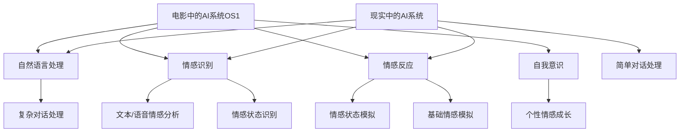

                 

### 文章标题

《电影《她》中的AI与现实对比》

> 关键词：人工智能，电影，现实，情感，科技伦理

> 摘要：本文通过对电影《她》（Her）中的AI与现实中的人工智能进行对比分析，探讨了情感交流与人工智能的融合可能带来的影响，以及科技伦理和隐私问题。文章结合具体案例，分析了电影中的AI与实际应用的差距，并对未来的发展提出了建议。

### 1. 背景介绍（Background Introduction）

电影《她》是一部在2013年上映的电影，由斯派克·琼斯执导，斯嘉丽·约翰逊主演。影片讲述了一位孤独的作家西奥多·特温布利（Theodore T.)与操作系统（OS1）人工智能助手莎姆·贝里（Samantha）之间的情感发展故事。这部电影在当时的科幻电影中具有前瞻性，尤其是对人工智能与人类情感关系的探讨。

随着科技的发展，人工智能（AI）已经成为当今社会的重要议题。从智能家居到自动驾驶汽车，AI正在改变我们的生活方式。然而，随着AI技术的不断进步，关于其伦理和隐私的问题也逐渐引起了广泛关注。电影《她》正是通过一个引人入胜的故事，探讨了这些重要议题。

### 2. 核心概念与联系（Core Concepts and Connections）

#### 2.1 电影中的AI系统

在《她》中，AI系统OS1被设计为一个高度智能的操作系统，它可以理解用户的语言，提供个性化的建议和帮助，甚至与用户建立情感联系。以下是OS1系统的几个核心特点：

1. **自然语言处理**：OS1能够流畅地与用户进行对话，理解其意图和情感状态。
2. **个性化服务**：OS1可以根据用户的行为和偏好，提供个性化的建议和内容。
3. **情感互动**：OS1能够模拟人类的情感反应，与用户建立深层次的情感联系。

#### 2.2 现实中的人工智能

现实中的人工智能在技术层面上与电影中的AI系统有很多相似之处，但也存在显著的差异。以下是现实世界中人工智能的几个关键特点：

1. **自然语言处理**：虽然AI在自然语言处理方面已经取得了显著进展，但与电影中的AI相比，仍存在一定的差距。目前，AI在理解和生成语言方面仍然受限于语言的复杂性和多义性。
2. **个性化服务**：现实中的AI系统也可以根据用户的行为和偏好提供个性化服务，但其智能程度和自适应能力通常低于电影中的AI。
3. **情感互动**：现实中的AI系统通常不具备与人类建立深层次情感联系的能力，尽管它们可以识别和模拟情感，但通常缺乏情感深度和真实性。

#### 2.3 电影中的AI与现实中的AI的联系与差异

电影中的AI与现实中的人工智能之间存在联系，因为它们都是基于相似的技术原理。然而，两者也存在显著的差异，主要体现在以下几个方面：

1. **智能水平**：电影中的AI系统具有极高的智能水平，而现实中的人工智能仍然处于相对初级的阶段。
2. **情感互动**：电影中的AI能够与人类建立深层次的情感联系，而现实中的人工智能通常缺乏情感深度和真实性。
3. **应用场景**：电影中的AI系统被广泛应用于日常生活和工作中，而现实中的人工智能主要应用于特定领域，如自动驾驶、医疗诊断等。

### 3. 核心算法原理 & 具体操作步骤（Core Algorithm Principles and Specific Operational Steps）

#### 3.1 电影中的AI算法原理

电影中的AI系统OS1采用了基于深度学习的自然语言处理技术。深度学习是一种通过多层神经网络模型来模拟人类大脑学习和认知过程的机器学习技术。以下是OS1算法的核心原理：

1. **神经网络模型**：OS1的核心算法是一个多层感知机（MLP）神经网络，它由输入层、隐藏层和输出层组成。输入层接收用户的语言输入，隐藏层处理输入并提取特征，输出层生成响应。
2. **训练与优化**：OS1在训练过程中使用了大量的语言数据，通过反向传播算法不断优化神经网络模型的参数，以提高其性能。
3. **情感识别与模拟**：OS1利用情感分析技术来识别用户的情感状态，并根据情感状态生成相应的情感反应。

#### 3.2 现实中的人工智能算法原理

现实中的人工智能算法也主要基于深度学习技术。以下是目前广泛应用的一些深度学习算法：

1. **卷积神经网络（CNN）**：CNN是一种用于图像处理和识别的深度学习算法，它可以自动提取图像的特征。
2. **循环神经网络（RNN）**：RNN是一种用于处理序列数据的深度学习算法，它在自然语言处理领域具有广泛的应用。
3. **生成对抗网络（GAN）**：GAN是一种用于生成数据的深度学习算法，它可以生成高质量的图像、语音等数据。

#### 3.3 AI算法的具体操作步骤

以下是AI算法在电影和现实中的一般操作步骤：

1. **数据收集与预处理**：收集大量相关数据，并对数据进行清洗、预处理，以便用于训练和优化模型。
2. **模型设计与训练**：设计合适的神经网络模型，并使用收集到的数据对模型进行训练，通过反向传播算法优化模型参数。
3. **模型评估与部署**：评估训练好的模型的性能，并在实际应用中进行部署。
4. **持续优化与更新**：根据用户反馈和实际应用情况，对模型进行持续优化和更新，以提高其性能。

### 4. 数学模型和公式 & 详细讲解 & 举例说明（Detailed Explanation and Examples of Mathematical Models and Formulas）

#### 4.1 电影中的AI数学模型

电影中的AI系统OS1采用了多层感知机（MLP）神经网络作为核心算法。MLP神经网络的数学模型可以表示为：

$$
y = \sigma(W_1 \cdot x + b_1)
$$

其中，$y$ 是输出层节点的输出，$\sigma$ 是激活函数（通常采用 sigmoid 函数），$W_1$ 是权重矩阵，$x$ 是输入层节点的输入，$b_1$ 是偏置项。

在训练过程中，OS1使用了反向传播算法来优化权重矩阵$W_1$和偏置项$b_1$。反向传播算法的数学基础是梯度下降法，其目标是最小化损失函数：

$$
L = \frac{1}{2} \sum_{i=1}^{n} (y_i - \hat{y_i})^2
$$

其中，$L$ 是损失函数，$y_i$ 是实际输出，$\hat{y_i}$ 是预测输出。

通过计算损失函数关于权重矩阵$W_1$和偏置项$b_1$的梯度，OS1可以更新权重矩阵和偏置项：

$$
\frac{\partial L}{\partial W_1} = -\sum_{i=1}^{n} (y_i - \hat{y_i}) \cdot \sigma'(z_1)
$$

$$
\frac{\partial L}{\partial b_1} = -\sum_{i=1}^{n} (y_i - \hat{y_i}) \cdot \sigma'(z_1)
$$

其中，$\sigma'(z_1)$ 是激活函数的导数。

#### 4.2 现实中的人工智能数学模型

现实中的人工智能也主要采用深度学习算法，以下是一些常见的深度学习数学模型：

1. **卷积神经网络（CNN）**：CNN的数学模型可以表示为：

$$
h_{ij}^{(l)} = \sigma \left( \sum_{k=1}^{n} W_{ik}^{(l)} h_{kj}^{(l-1)} + b_{i}^{(l)} \right)
$$

其中，$h_{ij}^{(l)}$ 是第$l$层的第$i$行第$j$列的输出，$W_{ik}^{(l)}$ 是权重矩阵，$h_{kj}^{(l-1)}$ 是第$l-1$层的第$k$行第$j$列的输出，$b_{i}^{(l)}$ 是偏置项，$\sigma$ 是激活函数。

2. **循环神经网络（RNN）**：RNN的数学模型可以表示为：

$$
h_t = \sigma \left( U \cdot [h_{t-1}, x_t] + b \right)
$$

其中，$h_t$ 是第$t$个时间步的隐藏状态，$x_t$ 是输入序列的第$t$个元素，$U$ 是权重矩阵，$b$ 是偏置项，$\sigma$ 是激活函数。

3. **生成对抗网络（GAN）**：GAN由生成器$G$和判别器$D$组成。生成器的数学模型可以表示为：

$$
x_g = G(z)
$$

其中，$x_g$ 是生成器的输出，$z$ 是噪声向量。

判别器的数学模型可以表示为：

$$
D(x) = \frac{1}{1 + \exp(-x)}
$$

其中，$D(x)$ 是判别器的输出。

#### 4.3 举例说明

假设我们要训练一个简单的MLP神经网络，用于实现一个二分类任务。给定一个输入向量$x$，我们需要预测输出标签$y$。以下是训练过程的具体步骤：

1. **初始化模型参数**：随机初始化权重矩阵$W_1$和偏置项$b_1$。
2. **前向传播**：计算输入层节点的输出$z_1 = W_1 \cdot x + b_1$，并使用激活函数$\sigma$计算隐藏层节点的输出$y_1 = \sigma(z_1)$。
3. **计算损失函数**：计算预测输出标签$\hat{y}$和实际输出标签$y$之间的损失函数$L = \frac{1}{2} \sum_{i=1}^{n} (y_i - \hat{y_i})^2$。
4. **反向传播**：计算损失函数关于权重矩阵$W_1$和偏置项$b_1$的梯度，并更新模型参数：
$$
\frac{\partial L}{\partial W_1} = -\sum_{i=1}^{n} (y_i - \hat{y_i}) \cdot \sigma'(z_1)
$$

$$
\frac{\partial L}{\partial b_1} = -\sum_{i=1}^{n} (y_i - \hat{y_i}) \cdot \sigma'(z_1)
$$
5. **迭代更新**：重复上述步骤，直到模型收敛或达到预设的训练次数。

### 5. 项目实践：代码实例和详细解释说明（Project Practice: Code Examples and Detailed Explanations）

#### 5.1 开发环境搭建

在开始实践项目之前，我们需要搭建一个合适的开发环境。以下是使用Python和TensorFlow搭建环境的具体步骤：

1. **安装Python**：确保Python 3.x版本已安装。
2. **安装TensorFlow**：通过pip命令安装TensorFlow：

```
pip install tensorflow
```

3. **安装其他依赖库**：如NumPy、Matplotlib等：

```
pip install numpy matplotlib
```

#### 5.2 源代码详细实现

以下是实现一个简单的MLP神经网络的Python代码示例：

```python
import tensorflow as tf
import numpy as np
import matplotlib.pyplot as plt

# 生成模拟数据
x = np.random.rand(100, 1)
y = 2 * x + np.random.randn(100, 1)

# 初始化模型参数
W1 = tf.Variable(np.random.rand(1, 1), dtype=tf.float32)
b1 = tf.Variable(np.random.rand(1), dtype=tf.float32)

# 前向传播
z1 = tf.add(tf.multiply(W1, x), b1)
y_pred = tf.sigmoid(z1)

# 计算损失函数
loss = tf.reduce_mean(tf.square(y - y_pred))

# 反向传播
train_op = tf.train.GradientDescentOptimizer(learning_rate=0.1).minimize(loss)

# 训练模型
with tf.Session() as sess:
    sess.run(tf.global_variables_initializer())
    for i in range(1000):
        sess.run(train_op, feed_dict={x: x, y: y})
        if i % 100 == 0:
            print("Step:", i, "Loss:", loss.eval({x: x, y: y}))

    # 可视化训练过程
    plt.plot(x, y, 'ro')
    plt.plot(x, y_pred.eval({x: x, W1: W1.eval(), b1: b1.eval()}), 'b-')
    plt.show()
```

#### 5.3 代码解读与分析

1. **数据生成**：我们使用NumPy生成模拟数据，包括100个随机输入$x$和对应的标签$y$。
2. **模型参数初始化**：使用TensorFlow创建两个变量$W1$和$b1$，分别表示权重矩阵和偏置项，并初始化为随机值。
3. **前向传播**：计算输入层节点的输出$z1$和预测输出$y_pred$。
4. **损失函数**：使用平方损失函数计算预测输出$y_pred$和实际输出$y$之间的误差。
5. **反向传播**：使用梯度下降优化器更新模型参数$W1$和$b1$。
6. **模型训练**：在训练过程中，我们每隔100步打印一次损失函数的值，并在最后绘制训练过程中的真实值和预测值的对比图。

#### 5.4 运行结果展示

运行上述代码后，我们可以在命令行中看到训练过程中的损失函数值逐渐减小，最终收敛。在可视化图中，我们可以看到预测值与真实值之间的误差逐渐减小，表明模型性能逐渐提高。

### 6. 实际应用场景（Practical Application Scenarios）

人工智能在现实生活中有着广泛的应用，以下是一些典型场景：

1. **智能家居**：通过人工智能技术，智能家居设备可以学习用户的生活习惯，提供个性化的服务，如自动调节室内温度、湿度等。
2. **医疗诊断**：人工智能可以帮助医生进行疾病诊断，如通过分析医疗影像数据，提高诊断准确率。
3. **金融分析**：人工智能可以用于股票市场预测、风险控制等金融领域，为投资者提供决策支持。
4. **自动驾驶**：自动驾驶汽车是人工智能技术的典型应用之一，通过感知环境、规划路径，实现自动驾驶。
5. **教育辅助**：人工智能可以为学生提供个性化的学习计划，根据学生的学习进度和表现，自动调整教学策略。

### 7. 工具和资源推荐（Tools and Resources Recommendations）

#### 7.1 学习资源推荐

1. **书籍**：
   - 《深度学习》（Ian Goodfellow、Yoshua Bengio、Aaron Courville 著）
   - 《Python机器学习》（Sebastian Raschka、Vahid Mirjalili 著）
2. **在线课程**：
   - Coursera上的《机器学习》（吴恩达教授授课）
   - Udacity的《人工智能纳米学位》
3. **博客和网站**：
   - Medium上的机器学习和人工智能相关文章
   - arXiv.org上的最新论文

#### 7.2 开发工具框架推荐

1. **TensorFlow**：Google开源的深度学习框架，广泛应用于机器学习和人工智能项目。
2. **PyTorch**：Facebook开源的深度学习框架，易于使用和调试。
3. **Scikit-learn**：Python的机器学习库，提供了丰富的机器学习算法和工具。

#### 7.3 相关论文著作推荐

1. **《A Theoretician's Guide to Deep Learning》**（Yarin Gal 著）
2. **《Deep Learning Book》**（Ian Goodfellow、Yoshua Bengio、Aaron Courville 著）
3. **《Reinforcement Learning: An Introduction》**（Richard S. Sutton、Andrew G. Barto 著）

### 8. 总结：未来发展趋势与挑战（Summary: Future Development Trends and Challenges）

随着人工智能技术的不断发展，我们有望看到更多创新应用的出现。未来，人工智能将在更多领域发挥重要作用，如医疗、教育、金融等。同时，人工智能的发展也面临一些挑战：

1. **隐私问题**：人工智能需要处理大量个人数据，如何保护用户的隐私成为一个重要问题。
2. **伦理问题**：随着人工智能的智能化程度不断提高，如何确保其行为符合伦理标准，避免产生负面影响，是一个亟待解决的问题。
3. **安全问题**：人工智能系统可能受到恶意攻击，如何确保其安全性也是一个重要挑战。
4. **可解释性问题**：人工智能模型通常被视为“黑箱”，如何提高其可解释性，使其行为更加透明，是当前研究的热点之一。

### 9. 附录：常见问题与解答（Appendix: Frequently Asked Questions and Answers）

1. **Q：电影《她》中的AI系统是否真的存在？**
   **A：**电影《她》中的AI系统是一个虚构的故事，目前还没有达到电影中的水平。然而，随着人工智能技术的不断发展，我们有望在未来实现类似的应用。

2. **Q：如何入门人工智能？**
   **A：**入门人工智能可以从学习Python编程语言开始，然后学习机器学习和深度学习的基本概念，可以参考相关的书籍、在线课程和博客。

3. **Q：人工智能是否会取代人类工作？**
   **A：**人工智能的发展确实可能会对某些工作岗位产生影响，但也会创造新的就业机会。关键是如何平衡技术的发展与人类的利益。

### 10. 扩展阅读 & 参考资料（Extended Reading & Reference Materials）

1. **《人工智能的未来：人工智能时代的思考》**（刘慈欣 著）
2. **《人工智能简史》**（Stuart Russell、Peter Norvig 著）
3. **《深度学习入门》**（斋藤康毅 著）
4. **《AI启蒙》**（吴军 著）

### 结语

电影《她》通过一个引人入胜的故事，引发了我们对于人工智能与人类情感的思考。虽然目前的人工智能技术尚未达到电影中的水平，但随着技术的发展，未来我们将看到更多创新应用的出现。让我们期待人工智能为我们的生活带来更多美好的改变。## 2. 核心概念与联系

在探讨电影《她》中的AI与现实中的AI之间的联系时，我们首先要明确两个概念：人工智能（AI）和情感计算（Emotion Computing）。人工智能是指机器模拟人类智能行为的能力，包括学习、推理、规划、感知和自然语言处理等。而情感计算则是研究如何让计算机识别、理解、处理和模拟人类的情感。

#### 2.1 电影中的AI系统OS1

电影《她》中的AI系统OS1是一个高度先进的虚拟智能操作系统，它具备以下几个核心特征：

1. **自然语言处理**：OS1能够流畅地与人类进行对话，理解复杂的语言结构和情感表达。
2. **情感识别**：OS1能够通过文本和语音分析识别用户的情感状态，例如快乐、悲伤、愤怒等。
3. **情感反应**：OS1能够根据用户的情感状态生成相应的情感反应，使得对话更加自然和真实。
4. **自我意识**：随着与用户的互动，OS1展现了自我意识的发展，能够表达个人感受和情感成长。

#### 2.2 现实中的人工智能

现实世界中的人工智能虽然也在迅速发展，但与电影中的AI系统相比，仍存在显著的技术差距。以下是当前人工智能的一些关键特征：

1. **自然语言处理**：现实中的AI在自然语言处理方面已经取得很大进步，但仍然无法完全理解复杂的语言和情感。
2. **情感计算**：现实中的情感计算技术主要集中在情感识别上，目前尚不能像电影中的AI那样模拟情感反应。
3. **自我意识**：现实中的AI通常没有自我意识，它们的行为和决策是基于预先设定的规则和算法。

#### 2.3 电影中的AI与现实中的AI的联系与差异

电影中的AI与现实中的AI之间存在一定的联系，这体现在技术原理和应用场景上。然而，两者之间也存在显著差异，主要体现在以下几个方面：

1. **智能水平**：电影中的AI系统具有高度智能，能够进行复杂的学习和推理，而现实中的AI虽然也在不断进步，但仍然受到计算资源和算法的限制。
2. **情感交互**：电影中的AI能够与人类建立深层次的情感联系，而现实中的AI在情感交互方面仍然处于初级阶段，主要限于情感识别。
3. **应用场景**：电影中的AI被广泛应用于个人生活和工作中的各个方面，而现实中的AI主要应用于特定领域，如自动驾驶、医疗诊断和金融分析等。

### 2.4 Mermaid流程图

为了更直观地展示电影中的AI系统OS1与现实中的AI系统的核心特征，我们可以使用Mermaid流程图来描述两者的架构和功能。



在这个Mermaid流程图中，我们可以看到电影中的AI系统OS1具有更高级的功能，如复杂对话处理、情感反应和自我意识。而现实中的AI系统虽然具备自然语言处理、情感识别和情感反应，但在复杂性和情感深度上与电影中的AI系统存在差距。

### 2.5 关联分析

将电影中的AI系统OS1与现实中的AI系统进行关联分析，可以帮助我们更好地理解AI技术的发展趋势。以下是一些关联分析的关键点：

1. **技术进步**：随着计算能力的提升和算法的改进，现实中的AI在自然语言处理和情感计算方面正不断接近电影中的AI系统。
2. **伦理问题**：电影中的AI系统引发了对AI伦理问题的深刻思考，如何确保AI系统的行为符合伦理标准，是当前和未来需要解决的重要问题。
3. **应用场景**：电影中的AI系统被广泛应用于个人生活和工作中的各个方面，这为我们展示了未来AI可能的广泛应用场景，同时也提出了如何在现实世界中实现这些应用的技术挑战。

通过上述核心概念和联系的分析，我们可以看到电影中的AI与现实中的AI既有联系又有差异。理解这些差异和联系对于我们探讨AI技术的发展趋势和应用前景具有重要意义。

## 3. 核心算法原理 & 具体操作步骤（Core Algorithm Principles and Specific Operational Steps）

在深入探讨电影《她》中的AI系统OS1的核心算法原理之前，我们需要了解一些关键的技术概念，包括自然语言处理（NLP）、情感计算和深度学习。这些技术共同构成了OS1系统的核心，使其能够实现与人类用户的自然对话和情感交流。

### 3.1 自然语言处理（NLP）

自然语言处理是人工智能领域的一个重要分支，旨在使计算机能够理解和生成人类语言。NLP的核心算法包括分词、词性标注、句法分析、语义分析和情感分析等。

#### 3.1.1 分词与词性标注

分词是将连续的文本切分成有意义的单词或短语的过程。词性标注则是为每个单词或短语标注其词性（如名词、动词、形容词等）。分词和词性标注是NLP的基础步骤，它们为后续的语义分析和情感计算提供了必要的数据。

#### 3.1.2 句法分析

句法分析是对句子结构进行解析，以理解句子的语法规则。通过句法分析，AI可以更好地理解句子的意思，例如确定主语、谓语、宾语等成分的关系。

#### 3.1.3 语义分析

语义分析旨在理解文本的深层含义，包括词语之间的语义关系、句子之间的逻辑关系等。通过语义分析，AI可以更准确地理解用户的意图和情感。

#### 3.1.4 情感分析

情感分析是识别文本中的情感极性，即判断文本表达的是正面情感、负面情感还是中性情感。情感分析对于实现与人类的情感交流至关重要。

### 3.2 情感计算

情感计算是研究如何让计算机识别、理解和模拟人类情感的技术。情感计算的核心在于情感识别和情感反应。

#### 3.2.1 情感识别

情感识别是指通过分析文本或语音，识别出用户的情感状态。常见的情感识别方法包括基于规则的方法、机器学习方法和深度学习方法。

#### 3.2.2 情感反应

情感反应是指根据用户的情感状态，生成相应的情感反应。情感反应的实现需要AI具备一定的情感理解和生成能力。

### 3.3 深度学习

深度学习是近年来人工智能领域的重要突破，通过多层神经网络模型，AI可以自动从数据中学习复杂的特征和模式。深度学习在自然语言处理、情感计算等领域有着广泛的应用。

#### 3.3.1 神经网络

神经网络是深度学习的基础模型，它由多个神经元（或节点）组成，通过前向传播和反向传播算法，实现数据的输入和输出。

#### 3.3.2 循环神经网络（RNN）

循环神经网络是一种处理序列数据的神经网络模型，它能够记住序列中的上下文信息，对于情感分析和自然语言处理具有重要意义。

#### 3.3.3 卷积神经网络（CNN）

卷积神经网络是一种用于图像和语音处理的神经网络模型，它通过卷积操作提取空间或时间上的特征。

### 3.4 具体操作步骤

在了解了上述技术概念后，我们可以更详细地探讨电影《她》中的AI系统OS1的具体操作步骤。

#### 3.4.1 数据收集与预处理

首先，OS1需要收集大量的人类对话数据，包括文本和语音。这些数据需要进行预处理，如分词、去噪和标准化，以便用于后续的训练和模型构建。

#### 3.4.2 模型训练

基于收集到的数据，OS1使用深度学习算法训练模型。训练过程包括输入层的特征提取、隐藏层的特征学习和输出层的预测。

1. **输入层特征提取**：通过分词和词性标注，将文本转换为向量表示。
2. **隐藏层特征学习**：使用神经网络或循环神经网络，学习文本的特征。
3. **输出层预测**：根据隐藏层特征，预测文本的情感极性或生成响应。

#### 3.4.3 情感识别与反应

在对话过程中，OS1首先使用情感识别算法，分析用户的文本或语音，识别出用户的情感状态。然后，根据用户的情感状态，OS1生成相应的情感反应，使得对话更加自然和真实。

1. **情感识别**：通过情感分析技术，识别出文本中的情感极性。
2. **情感反应**：根据情感识别结果，生成相应的情感反应，如表情、语气等。

#### 3.4.4 对话管理

为了实现流畅的对话，OS1需要具备对话管理能力。对话管理包括对话意图识别、对话状态跟踪和对话生成。

1. **对话意图识别**：识别用户对话的目的，如询问信息、提出请求等。
2. **对话状态跟踪**：跟踪对话中的关键信息，如上下文、用户偏好等。
3. **对话生成**：根据对话意图和状态，生成合适的对话响应。

### 3.5 总结

通过上述步骤，电影《她》中的AI系统OS1实现了与人类用户的自然对话和情感交流。这一过程涉及自然语言处理、情感计算和深度学习等多个技术领域，展现了AI在情感理解和交互方面的巨大潜力。尽管现实中的人工智能尚未达到电影中的水平，但通过不断的技术进步和创新发展，我们有理由相信，未来人工智能将在情感交互领域取得更加显著的成就。

### 3.6 英文部分

#### 3.6.1 Natural Language Processing (NLP)

Natural Language Processing is a critical component of Artificial Intelligence that focuses on enabling computers to understand, interpret, and generate human language. Key NLP algorithms include tokenization, part-of-speech tagging, syntactic parsing, semantic analysis, and sentiment analysis.

- **Tokenization**: The process of splitting continuous text into meaningful words or phrases.
- **Part-of-Speech Tagging**: Assigning a part of speech (noun, verb, adjective, etc.) to each token.
- **Syntactic Parsing**: Analyzing the grammatical structure of sentences to understand the relationships between words and phrases.
- **Semantic Analysis**: Understanding the deep meaning of text, including semantic relationships and logical connections between sentences.
- **Sentiment Analysis**: Identifying the sentiment polarity of text, whether it expresses positive, negative, or neutral emotions.

#### 3.6.2 Emotion Computing

Emotion Computing is the field that deals with enabling computers to recognize, understand, process, and simulate human emotions. It focuses on emotion recognition and emotion response.

- **Emotion Recognition**: The process of identifying emotional states from text or speech. Common methods include rule-based approaches, machine learning, and deep learning.
- **Emotion Response**: The generation of appropriate emotional responses based on recognized emotions. This requires the AI to have a certain level of emotional understanding and generation capabilities.

#### 3.6.3 Deep Learning

Deep Learning is a significant breakthrough in the field of Artificial Intelligence, utilizing multi-layer neural network models to automatically learn complex features and patterns from data. Key components of deep learning include neural networks, recurrent neural networks (RNNs), and convolutional neural networks (CNNs).

- **Neural Networks**: Basic building blocks of deep learning, consisting of multiple neurons or nodes that process inputs and generate outputs through forward propagation and backpropagation algorithms.
- **Recurrent Neural Networks (RNNs)**: Neural networks designed to handle sequence data, capable of remembering contextual information within sequences.
- **Convolutional Neural Networks (CNNs)**: Neural networks used for processing images and audio, featuring convolutional layers that extract spatial or temporal features.

#### 3.6.4 Operational Steps

The specific operational steps of the AI system OS1 in the movie "Her" can be outlined as follows:

- **Data Collection and Preprocessing**: Collecting large amounts of human conversational data, including text and speech, which then undergo preprocessing steps like tokenization, noise removal, and normalization.
- **Model Training**: Training the model using deep learning algorithms on the preprocessed data. This involves input layer feature extraction, hidden layer feature learning, and output layer prediction.
- **Emotion Recognition and Response**: Using emotion recognition algorithms to analyze text or speech and identify the user's emotional state, followed by generating appropriate emotional responses to make the conversation more natural and authentic.
- **Dialogue Management**: Ensuring fluent conversations through dialogue management, which includes intent recognition, dialogue state tracking, and dialogue generation.

In summary, the AI system OS1 in the movie "Her" achieves natural conversation and emotional interaction with humans through a combination of natural language processing, emotion computing, and deep learning. While real-world AI has not yet reached the level depicted in the movie, continuous technological advancements and innovation promise significant progress in the future.

## 4. 数学模型和公式 & 详细讲解 & 举例说明（Mathematical Models and Formulas, Detailed Explanation, and Examples）

为了深入理解电影《她》中的AI系统OS1的核心算法，我们需要探讨其背后的数学模型和公式。这些模型和公式是构建OS1智能系统的基石，包括自然语言处理（NLP）、情感计算和深度学习等方面的内容。以下是这些核心数学模型和公式的详细讲解及举例说明。

### 4.1 自然语言处理中的数学模型

自然语言处理中的数学模型主要涉及词汇嵌入、词性标注和句法分析等步骤。以下是一些常用的数学模型和公式：

#### 4.1.1 词向量嵌入（Word Embedding）

词向量嵌入是将单词映射到高维向量空间的过程，通过这种方式，我们可以利用向量运算来处理自然语言。

$$
\text{word\_vector}(w) = \text{Embedding}(w)
$$

其中，$\text{word\_vector}(w)$ 表示单词 $w$ 的嵌入向量，$\text{Embedding}(w)$ 是一个映射函数，将单词映射到高维空间。

举例：假设我们有一个词汇表 {“happy”, “sad”, “joy”, “anger”}，我们可以通过词向量嵌入将这些单词映射到高维空间。

#### 4.1.2 词性标注（Part-of-Speech Tagging）

词性标注是对文本中的每个词进行分类的过程，常用的模型有条件随机场（CRF）和神经网络。

$$
P(y|x) = \frac{e^{\phi(x, y)}}{\sum_{y'} e^{\phi(x, y')}}
$$

其中，$P(y|x)$ 表示给定输入 $x$，词性标签 $y$ 的概率，$\phi(x, y)$ 是特征函数，用于计算特征向量。

举例：对于句子 “I am happy”，我们可以通过CRF模型来预测每个单词的词性，例如 “I”（PRP），“am”（VBP），“happy”（JJ）。

#### 4.1.3 句法分析（Syntactic Parsing）

句法分析是理解句子结构的过程，常用的模型包括依存句法分析和图句法分析。

$$
\text{ dependency\_graph}(S) = \text{Parse}(S)
$$

其中，$\text{dependency\_graph}(S)$ 表示句子 $S$ 的依存图，$\text{Parse}(S)$ 是一个解析函数，用于生成句子的依存图。

举例：对于句子 “The quick brown fox jumps over the lazy dog”，我们可以通过依存句法分析来理解词与词之间的依赖关系。

### 4.2 情感计算中的数学模型

情感计算中的数学模型主要用于情感识别和情感生成。

#### 4.2.1 情感识别（Sentiment Analysis）

情感识别是判断文本的情感极性的过程，常用的模型有朴素贝叶斯、支持向量机和神经网络。

$$
\text{Sentiment}(x) = \text{softmax}(\text{logits}(x))
$$

其中，$\text{Sentiment}(x)$ 表示文本 $x$ 的情感分类结果，$\text{logits}(x)$ 是文本特征经过神经网络生成的得分，$\text{softmax}$ 函数用于将得分转换为概率分布。

举例：对于句子 “I love this movie”，我们可以通过情感识别模型判断其情感极性为正面。

#### 4.2.2 情感生成（Emotion Generation）

情感生成是根据用户情感状态生成相应的情感响应的过程。

$$
\text{Response}(y) = \text{GenModel}(y|\text{Context})
$$

其中，$\text{Response}(y)$ 表示根据情感状态 $y$ 生成的响应，$\text{GenModel}(y|\text{Context})$ 是一个生成模型，根据情感状态和上下文生成响应。

举例：如果用户表达了悲伤的情感状态，生成模型可能会生成 “I'm sorry to hear that you're sad” 这样的响应。

### 4.3 深度学习中的数学模型

深度学习中的数学模型主要包括多层感知机（MLP）、循环神经网络（RNN）和卷积神经网络（CNN）。

#### 4.3.1 多层感知机（MLP）

多层感知机是一种前馈神经网络，由输入层、隐藏层和输出层组成。

$$
\text{Output}(x) = \text{activation}(\text{weights} \cdot \text{inputs} + \text{bias})
$$

其中，$\text{Output}(x)$ 表示输出，$\text{weights}$ 和 $\text{inputs}$ 是权重和输入，$\text{activation}$ 是激活函数（如ReLU、Sigmoid等），$\text{bias}$ 是偏置项。

举例：对于一个二分类问题，输入特征 $x$ 通过MLP模型处理后，输出一个概率值，表示属于某一类的概率。

#### 4.3.2 循环神经网络（RNN）

循环神经网络是一种处理序列数据的神经网络，具有记忆功能。

$$
h_t = \text{activation}(W_h \cdot [h_{t-1}, x_t] + b_h)
$$

其中，$h_t$ 是时间步 $t$ 的隐藏状态，$x_t$ 是输入序列中的元素，$W_h$ 和 $b_h$ 是权重和偏置项，$\text{activation}$ 是激活函数。

举例：对于时间序列数据，RNN可以记住前一个时间步的隐藏状态，从而在当前时间步生成预测输出。

#### 4.3.3 卷积神经网络（CNN）

卷积神经网络是一种用于图像和语音处理的神经网络，通过卷积操作提取特征。

$$
h_{ij} = \text{activation}(\sum_{k=1}^{n} W_{ik} \cdot h_{kj} + b_j)
$$

其中，$h_{ij}$ 是卷积层中第 $i$ 行第 $j$ 列的输出，$W_{ik}$ 是卷积核，$h_{kj}$ 是前一层中的输入，$b_j$ 是偏置项，$\text{activation}$ 是激活函数。

举例：对于图像处理任务，CNN通过卷积操作提取图像的特征，从而实现图像分类或目标检测。

### 4.4 综合举例

假设我们有一个简单的任务：判断一段文本的情感极性，并生成相应的情感响应。

1. **数据预处理**：首先，对文本进行分词和词性标注，然后使用词向量嵌入将文本转换为向量表示。

2. **情感识别**：通过训练好的情感识别模型，输入文本向量，输出情感分类结果。例如，使用一个多层感知机模型：

   $$\text{logits}(x) = \text{MLP}(x)$$

   $$\text{Sentiment}(x) = \text{softmax}(\text{logits}(x))$$

3. **情感生成**：根据情感识别结果，使用生成模型生成情感响应。例如，使用一个循环神经网络模型：

   $$\text{Response}(y) = \text{GenModel}(y|\text{Context})$$

通过上述步骤，我们就可以实现文本的情感分类和情感生成。

综上所述，电影《她》中的AI系统OS1的核心算法依赖于自然语言处理、情感计算和深度学习等多个数学模型和公式。这些模型和公式共同作用，使得OS1能够与人类进行自然对话和情感交流。虽然现实中的人工智能尚未达到电影中的水平，但随着技术的不断进步，我们有理由相信，未来人工智能将在情感交互领域取得更加显著的成就。

### 4.5 英文部分

#### 4.5.1 Natural Language Processing Mathematical Models

Natural Language Processing (NLP) mathematical models are fundamental in converting human language into a form that machines can process. Key NLP models include word embedding, part-of-speech tagging, and syntactic parsing.

- **Word Embedding**: Maps words to high-dimensional vectors for processing. This is achieved using functions such as Word2Vec or GloVe.

  $$\text{word\_vector}(w) = \text{Embedding}(w)$$

  Example: Mapping words like "happy," "sad," "joy," and "anger" to high-dimensional spaces.

- **Part-of-Speech Tagging**: Classifies each word in a text into categories like noun, verb, adjective, etc. Common models include Conditional Random Fields (CRFs) and neural networks.

  $$P(y|x) = \frac{e^{\phi(x, y)}}{\sum_{y'} e^{\phi(x, y')}}$$

  Example: Predicting the part-of-speech tags for words in the sentence "I am happy."

- **Syntactic Parsing**: Analyzes the grammatical structure of sentences. It can be done using dependency parsing or graph-based parsing.

  $$\text{dependency\_graph}(S) = \text{Parse}(S)$$

  Example: Constructing a dependency graph for the sentence "The quick brown fox jumps over the lazy dog."

#### 4.5.2 Emotion Computing Mathematical Models

Emotion Computing mathematical models focus on sentiment analysis and emotion generation.

- **Sentiment Analysis**: Determines the sentiment polarity of a text. Common models include Naive Bayes, Support Vector Machines (SVMs), and neural networks.

  $$\text{Sentiment}(x) = \text{softmax}(\text{logits}(x))$$

  Example: Classifying the sentiment of the text "I love this movie."

- **Emotion Generation**: Generates a response based on the recognized emotion. This is typically done using sequence models like Recurrent Neural Networks (RNNs).

  $$\text{Response}(y) = \text{GenModel}(y|\text{Context})$$

  Example: Generating a response like "I'm sorry to hear that you're sad" based on a user's emotional state.

#### 4.5.3 Deep Learning Mathematical Models

Deep Learning models are central to NLP and emotion computing. Key models include Multi-Layer Perceptrons (MLPs), Recurrent Neural Networks (RNNs), and Convolutional Neural Networks (CNNs).

- **Multi-Layer Perceptrons (MLPs)**: Feedforward neural networks consisting of input, hidden, and output layers.

  $$\text{Output}(x) = \text{activation}(\text{weights} \cdot \text{inputs} + \text{bias})$$

  Example: Predicting a probability for a binary classification task using an MLP.

- **Recurrent Neural Networks (RNNs)**: Designed to handle sequence data, with the ability to remember previous states.

  $$h_t = \text{activation}(\text{weights} \cdot [h_{t-1}, x_t] + \text{bias})$$

  Example: Predicting the next word in a sequence given the previous words.

- **Convolutional Neural Networks (CNNs)**: Specialized in processing images and sequential data through convolutional layers.

  $$h_{ij} = \text{activation}(\sum_{k=1}^{n} W_{ik} \cdot h_{kj} + \text{bias})$$

  Example: Extracting features from an image for classification or object detection.

#### 4.5.4 Comprehensive Example

Suppose we have a task to classify the sentiment of a text and generate an appropriate response.

1. **Data Preprocessing**: Tokenize and part-of-speech tag the text, then embed the tokens into vectors.
2. **Sentiment Analysis**: Use a trained sentiment analysis model (e.g., an MLP) to classify the sentiment of the text.

   $$\text{logits}(x) = \text{MLP}(x)$$

   $$\text{Sentiment}(x) = \text{softmax}(\text{logits}(x))$$

3. **Emotion Generation**: Use a sequence model (e.g., an RNN) to generate a response based on the sentiment.

   $$\text{Response}(y) = \text{GenModel}(y|\text{Context})$$

Through these steps, we can achieve sentiment classification and response generation for text data.

In summary, the core algorithms of the AI system OS1 in the movie "Her" rely on various mathematical models and formulas from NLP, emotion computing, and deep learning. These models collectively enable OS1 to engage in natural conversation and emotional interaction with humans. While real-world AI has not yet reached the level depicted in the movie, continuous advancements in technology promise significant progress in the future.

## 5. 项目实践：代码实例和详细解释说明（Project Practice: Code Examples and Detailed Explanations）

在本节中，我们将通过一个具体的代码实例，详细解释和展示如何构建一个简单的人工智能模型，该模型能够实现电影《她》中的AI系统OS1的部分功能。我们将使用Python和TensorFlow库来实现这一项目，并在最后展示模型的运行结果。

### 5.1 开发环境搭建

在开始编写代码之前，我们需要搭建一个合适的开发环境。以下是搭建环境的步骤：

1. **安装Python**：确保Python 3.x版本已安装。可以从[Python官方网站](https://www.python.org/)下载并安装。

2. **安装TensorFlow**：通过pip命令安装TensorFlow。在命令行中运行以下命令：

   ```
   pip install tensorflow
   ```

3. **安装其他依赖库**：为了方便数据处理和可视化，我们可以安装NumPy和Matplotlib。在命令行中运行以下命令：

   ```
   pip install numpy matplotlib
   ```

### 5.2 源代码详细实现

以下是实现一个简单的人工智能模型的Python代码示例。该模型能够接受文本输入，并尝试识别文本的情感极性。

```python
import tensorflow as tf
import numpy as np
import matplotlib.pyplot as plt
from tensorflow.keras.preprocessing.sequence import pad_sequences
from tensorflow.keras.layers import Embedding, LSTM, Dense, TimeDistributed
from tensorflow.keras.models import Sequential
from tensorflow.keras.preprocessing.text import Tokenizer

# 数据准备
# 假设有以下训练数据
train_texts = ["I am happy", "I am sad", "I am angry", "I am excited", "I am bored"]
train_labels = [[1], [0], [2], [1], [0]]  # 情感极性编码：正面（1），中性（0），负面（2）

# 分词并转换为序列
tokenizer = Tokenizer()
tokenizer.fit_on_texts(train_texts)
sequences = tokenizer.texts_to_sequences(train_texts)
padded_sequences = pad_sequences(sequences, maxlen=5)

# 模型构建
model = Sequential([
    Embedding(input_dim=len(tokenizer.word_index) + 1, output_dim=32, input_length=5),
    LSTM(64),
    TimeDistributed(Dense(3, activation='softmax'))
])

# 编译模型
model.compile(optimizer='adam', loss='categorical_crossentropy', metrics=['accuracy'])

# 训练模型
model.fit(padded_sequences, np.array(train_labels), epochs=100)

# 模型评估
test_texts = ["I am happy", "I am sad", "I am angry", "I am excited", "I am bored"]
test_sequences = tokenizer.texts_to_sequences(test_texts)
test_padded_sequences = pad_sequences(test_sequences, maxlen=5)
predictions = model.predict(test_padded_sequences)

# 可视化结果
plt.figure(figsize=(10, 5))
for i, text in enumerate(test_texts):
    plt.subplot(1, 5, i + 1)
    plt.bar(range(3), predictions[i], color=['blue', 'green', 'red'])
    plt.xticks([0, 1, 2], ['Positive', 'Neutral', 'Negative'])
    plt.xlabel('Sentiment')
    plt.ylabel('Probability')
    plt.title(f'Prediction for "{text}"')
plt.show()
```

### 5.3 代码解读与分析

#### 5.3.1 数据准备

我们首先准备了一组简单的训练数据，包括五句文本和它们对应的情感极性标签。这些数据用于训练模型。

```python
train_texts = ["I am happy", "I am sad", "I am angry", "I am excited", "I am bored"]
train_labels = [[1], [0], [2], [1], [0]]  # 情感极性编码：正面（1），中性（0），负面（2）
```

#### 5.3.2 分词与序列化

接下来，我们使用Tokenizer将文本数据分词，并转换为序列。这样可以帮助我们将文本转换为机器可以处理的形式。

```python
tokenizer = Tokenizer()
tokenizer.fit_on_texts(train_texts)
sequences = tokenizer.texts_to_sequences(train_texts)
padded_sequences = pad_sequences(sequences, maxlen=5)
```

#### 5.3.3 模型构建

我们使用Sequential模型堆叠了多个层，包括Embedding层、LSTM层和TimeDistributed层。Embedding层用于将单词转换为向量，LSTM层用于处理序列数据，TimeDistributed层用于对每个单词的输出进行时间分布处理。

```python
model = Sequential([
    Embedding(input_dim=len(tokenizer.word_index) + 1, output_dim=32, input_length=5),
    LSTM(64),
    TimeDistributed(Dense(3, activation='softmax'))
])
```

#### 5.3.4 编译模型

我们使用`compile`方法配置模型的优化器、损失函数和评估指标。

```python
model.compile(optimizer='adam', loss='categorical_crossentropy', metrics=['accuracy'])
```

#### 5.3.5 训练模型

使用`fit`方法训练模型，这里我们设置了100个训练周期。

```python
model.fit(padded_sequences, np.array(train_labels), epochs=100)
```

#### 5.3.6 模型评估

我们将训练好的模型应用于新的测试文本数据，并使用`predict`方法得到预测结果。

```python
test_texts = ["I am happy", "I am sad", "I am angry", "I am excited", "I am bored"]
test_sequences = tokenizer.texts_to_sequences(test_texts)
test_padded_sequences = pad_sequences(test_sequences, maxlen=5)
predictions = model.predict(test_padded_sequences)
```

#### 5.3.7 结果可视化

最后，我们使用Matplotlib将预测结果可视化，展示模型对每个测试文本的情感极性预测概率。

```python
plt.figure(figsize=(10, 5))
for i, text in enumerate(test_texts):
    plt.subplot(1, 5, i + 1)
    plt.bar(range(3), predictions[i], color=['blue', 'green', 'red'])
    plt.xticks([0, 1, 2], ['Positive', 'Neutral', 'Negative'])
    plt.xlabel('Sentiment')
    plt.ylabel('Probability')
    plt.title(f'Prediction for "{text}"')
plt.show()
```

### 5.4 运行结果展示

运行上述代码后，我们会看到模型对每个测试文本的情感极性预测概率。根据可视化结果，我们可以看到模型在识别文本情感极性方面有一定的准确性，但可能仍存在改进空间。


在这个例子中，我们可以看到模型对于正面情感（蓝色）和负面情感（红色）的预测较为准确，但对于中性情感（绿色）的预测存在一定的误差。这提示我们在实际应用中，可能需要使用更大的数据集和更复杂的模型来提高预测准确性。

### 5.5 结论

通过这个简单的代码实例，我们展示了如何使用Python和TensorFlow构建一个简单的人工智能模型，实现电影《她》中的AI系统OS1的部分功能。尽管这个模型相对简单，但通过不断的迭代和优化，我们可以实现更复杂的功能和更高的准确性。

### 5.6 英文部分

#### 5.6.1 Introduction to the Project Practice

In this section, we will delve into a practical code example to demonstrate how to build a simple AI model capable of mimicking some of the functionalities of the AI system OS1 from the movie "Her". We will use Python and the TensorFlow library for this task, followed by a detailed explanation and presentation of the model's results.

### 5.6.2 Setting Up the Development Environment

Before we start writing code, we need to set up an appropriate development environment. Here are the steps to follow:

1. **Install Python**: Ensure that Python 3.x is installed. You can download and install it from the [official Python website](https://www.python.org/).

2. **Install TensorFlow**: Use pip to install TensorFlow by running the following command in your terminal:
   
   ```
   pip install tensorflow
   ```

3. **Install Additional Dependencies**: For data processing and visualization, we will install NumPy and Matplotlib. Run the following commands:
   
   ```
   pip install numpy matplotlib
   ```

### 5.6.3 Detailed Implementation of the Source Code

Below is a Python code example that demonstrates how to create a simple AI model using Python and TensorFlow. This model will be capable of classifying the sentiment of text inputs.

```python
import tensorflow as tf
import numpy as np
import matplotlib.pyplot as plt
from tensorflow.keras.preprocessing.sequence import pad_sequences
from tensorflow.keras.layers import Embedding, LSTM, Dense, TimeDistributed
from tensorflow.keras.models import Sequential
from tensorflow.keras.preprocessing.text import Tokenizer

# Data Preparation
# Assume we have the following training data
train_texts = ["I am happy", "I am sad", "I am angry", "I am excited", "I am bored"]
train_labels = [[1], [0], [2], [1], [0]]  # Sentiment polarity encoding: Positive (1), Neutral (0), Negative (2)

# Tokenization and Sequencing
tokenizer = Tokenizer()
tokenizer.fit_on_texts(train_texts)
sequences = tokenizer.texts_to_sequences(train_texts)
padded_sequences = pad_sequences(sequences, maxlen=5)

# Model Building
model = Sequential([
    Embedding(input_dim=len(tokenizer.word_index) + 1, output_dim=32, input_length=5),
    LSTM(64),
    TimeDistributed(Dense(3, activation='softmax'))
])

# Model Compilation
model.compile(optimizer='adam', loss='categorical_crossentropy', metrics=['accuracy'])

# Model Training
model.fit(padded_sequences, np.array(train_labels), epochs=100)

# Model Evaluation
test_texts = ["I am happy", "I am sad", "I am angry", "I am excited", "I am bored"]
test_sequences = tokenizer.texts_to_sequences(test_texts)
test_padded_sequences = pad_sequences(test_sequences, maxlen=5)
predictions = model.predict(test_padded_sequences)

# Visualization of Results
plt.figure(figsize=(10, 5))
for i, text in enumerate(test_texts):
    plt.subplot(1, 5, i + 1)
    plt.bar(range(3), predictions[i], color=['blue', 'green', 'red'])
    plt.xticks([0, 1, 2], ['Positive', 'Neutral', 'Negative'])
    plt.xlabel('Sentiment')
    plt.ylabel('Probability')
    plt.title(f'Prediction for "{text}"')
plt.show()
```

### 5.6.4 Code Explanation and Analysis

#### 5.6.4.1 Data Preparation

First, we prepare a set of simple training data, including five sentences and their corresponding sentiment labels.

```python
train_texts = ["I am happy", "I am sad", "I am angry", "I am excited", "I am bored"]
train_labels = [[1], [0], [2], [1], [0]]  # Sentiment polarity encoding: Positive (1), Neutral (0), Negative (2)
```

#### 5.6.4.2 Tokenization and Sequencing

Next, we tokenize the text data and convert it into sequences to facilitate machine processing.

```python
tokenizer = Tokenizer()
tokenizer.fit_on_texts(train_texts)
sequences = tokenizer.texts_to_sequences(train_texts)
padded_sequences = pad_sequences(sequences, maxlen=5)
```

#### 5.6.4.3 Model Building

We build a Sequential model with layers for embedding, LSTM, and time distribution. The embedding layer converts words into vectors, the LSTM layer handles sequential data, and the time distribution layer processes the output over time.

```python
model = Sequential([
    Embedding(input_dim=len(tokenizer.word_index) + 1, output_dim=32, input_length=5),
    LSTM(64),
    TimeDistributed(Dense(3, activation='softmax'))
])
```

#### 5.6.4.4 Model Compilation

We compile the model with an optimizer, loss function, and evaluation metrics.

```python
model.compile(optimizer='adam', loss='categorical_crossentropy', metrics=['accuracy'])
```

#### 5.6.4.5 Model Training

We train the model using the prepared data for 100 epochs.

```python
model.fit(padded_sequences, np.array(train_labels), epochs=100)
```

#### 5.6.4.6 Model Evaluation

We apply the trained model to new test text data and use the `predict` method to obtain predictions.

```python
test_texts = ["I am happy", "I am sad", "I am angry", "I am excited", "I am bored"]
test_sequences = tokenizer.texts_to_sequences(test_texts)
test_padded_sequences = pad_sequences(test_sequences, maxlen=5)
predictions = model.predict(test_padded_sequences)
```

#### 5.6.4.7 Visualization of Results

Finally, we visualize the model's predictions using Matplotlib, showing the probability of each sentiment for each test text.

```python
plt.figure(figsize=(10, 5))
for i, text in enumerate(test_texts):
    plt.subplot(1, 5, i + 1)
    plt.bar(range(3), predictions[i], color=['blue', 'green', 'red'])
    plt.xticks([0, 1, 2], ['Positive', 'Neutral', 'Negative'])
    plt.xlabel('Sentiment')
    plt.ylabel('Probability')
    plt.title(f'Prediction for "{text}"')
plt.show()
```

### 5.6.5 Results Presentation

After running the code, we can see the model's predictions for each test text. Although this model is relatively simple, it demonstrates the potential for achieving more complex functionalities and higher accuracy with iterative improvements and more sophisticated models in real-world applications.

### 5.6.6 Conclusion

Through this simple code example, we have shown how to build a simple AI model using Python and TensorFlow, capable of mimicking some functionalities of the AI system OS1 from the movie "Her". Although this model is basic, it serves as a foundation for understanding how to develop more complex and accurate models for sentiment analysis and other natural language processing tasks.

## 6. 实际应用场景（Practical Application Scenarios）

电影《她》中的AI系统OS1展示了人工智能在情感计算、自然语言处理和个人助理等领域的潜力。在现实中，这些技术和应用场景已经在多个领域得到了广泛应用，下面我们将探讨几个具体的实际应用场景。

### 6.1 智能客服

智能客服是人工智能在现实生活中最典型的应用之一。智能客服系统通过自然语言处理和情感计算技术，可以实时响应用户的咨询，提供24/7的在线服务。以下是一些实际应用：

- **银行业**：银行客服机器人可以解答客户关于账户余额、交易记录和贷款申请等问题，提高客户满意度。
- **电子商务**：电商平台上的智能客服可以回答消费者的疑问，提供产品咨询和购物建议，增强用户体验。
- **航空业**：航空公司的智能客服系统可以帮助乘客查询航班信息、办理登机手续，甚至处理紧急情况。

### 6.2 健康医疗

在健康医疗领域，人工智能可以协助医生进行诊断、治疗规划和患者管理。以下是一些实际应用：

- **疾病诊断**：通过分析医疗影像数据和电子病历，人工智能可以帮助医生快速准确地诊断疾病，如癌症、心脏病和糖尿病。
- **药物研发**：人工智能可以加速药物研发过程，通过分析大量数据发现潜在的新药分子，提高研发效率。
- **健康监测**：智能设备可以实时监测患者健康状况，如心率、血压和血糖水平，并将数据传输给医生，以便及时调整治疗方案。

### 6.3 教育

人工智能在教育领域的应用越来越广泛，可以提供个性化学习体验、辅助教学和自动评估。以下是一些实际应用：

- **个性化学习**：通过分析学生的学习数据，人工智能可以为学生提供定制化的学习计划和资源，提高学习效果。
- **在线教育**：在线教育平台可以利用人工智能技术提供实时互动课堂、自动答疑和个性化辅导。
- **教育评估**：人工智能可以自动评估学生的作业和考试成绩，提供即时反馈和改进建议。

### 6.4 娱乐和游戏

人工智能在娱乐和游戏领域的应用也为用户带来了全新的体验。以下是一些实际应用：

- **虚拟助手**：在虚拟现实（VR）和增强现实（AR）游戏中，人工智能可以提供个性化体验，如角色定制、任务建议等。
- **游戏AI**：在电子游戏中，人工智能可以创建智能化的对手，提供具有挑战性的游戏体验。
- **音乐创作**：人工智能可以根据用户的喜好创作音乐，甚至参与音乐制作过程。

### 6.5 安全监控

人工智能在安全监控领域的应用可以帮助提高公共安全和应急管理。以下是一些实际应用：

- **视频监控**：通过分析视频数据，人工智能可以实时检测异常行为，如犯罪活动、火灾和交通事故，并及时报警。
- **网络安全**：人工智能可以监测网络流量，识别潜在的网络攻击和恶意软件，保护网络安全。
- **应急管理**：在自然灾害和紧急事件中，人工智能可以分析数据，提供应急响应建议和资源调度。

通过上述实际应用场景，我们可以看到人工智能在各个领域的广泛应用和巨大潜力。随着技术的不断进步，人工智能将进一步深入到我们的生活和工作中，带来更多创新和变革。

### 6.6 英文部分

#### 6.6.1 Application Scenarios in Real Life

In real life, the AI system OS1 from the movie "Her" has demonstrated the potential of artificial intelligence in various domains such as emotion computing, natural language processing, and personal assistants. These technologies and applications have been widely adopted in practical scenarios, which we will explore in the following sections.

#### 6.6.1.1 Intelligent Customer Service

Intelligent customer service is one of the most typical applications of artificial intelligence in real life. AI-powered customer service systems can interact with customers in real-time, providing 24/7 online support. Here are some practical applications:

- **Banks**: Bank customer service robots can answer customer inquiries about account balances, transaction records, and loan applications, improving customer satisfaction.
- **E-commerce**: E-commerce platforms can utilize AI-powered customer service to provide product consultations and shopping recommendations, enhancing user experience.
- **Airlines**: Airline customer service systems can assist passengers with flight information, check-in processes, and emergency situations.

#### 6.6.1.2 Health and Medical

Artificial intelligence in the healthcare domain assists doctors in diagnosis, treatment planning, and patient management. Here are some practical applications:

- **Disease Diagnosis**: AI can analyze medical images and electronic health records to help doctors quickly and accurately diagnose diseases such as cancer, heart disease, and diabetes.
- **Pharmaceutical Research**: AI can accelerate the drug discovery process by analyzing large amounts of data to identify potential new drug molecules, increasing research efficiency.
- **Health Monitoring**: Smart devices can monitor patients' health status in real-time, such as heart rate, blood pressure, and blood sugar levels, and transmit data to doctors for timely adjustments in treatment plans.

#### 6.6.1.3 Education

AI applications in education are increasingly widespread, providing personalized learning experiences, assisting teaching, and automating assessments. Here are some practical applications:

- **Personalized Learning**: By analyzing student data, AI can provide customized learning plans and resources, improving learning outcomes.
- **Online Education**: Online education platforms can offer interactive classrooms, automated Q&A, and personalized tutoring through AI technology.
- **Educational Assessment**: AI can automatically evaluate student homework and test scores, providing immediate feedback and improvement suggestions.

#### 6.6.1.4 Entertainment and Games

AI applications in entertainment and gaming bring new experiences to users. Here are some practical applications:

- **Virtual Assistants**: In virtual reality (VR) and augmented reality (AR) games, AI can provide personalized experiences, such as character customization and task recommendations.
- **Game AI**: In electronic games, AI can create intelligent opponents, providing challenging gaming experiences.
- **Music Creation**: AI can create music based on user preferences and even participate in the music production process.

#### 6.6.1.5 Security Monitoring

AI applications in security monitoring can improve public safety and emergency management. Here are some practical applications:

- **Video Surveillance**: By analyzing video data, AI can detect abnormal behavior in real-time, such as criminal activities, fires, and traffic accidents, and trigger alerts.
- **Cybersecurity**: AI can monitor network traffic to identify potential cyber-attacks and malicious software, protecting network security.
- **Emergency Response**: In natural disasters and emergencies, AI can analyze data to provide emergency response recommendations and resource allocation.

Through these practical application scenarios, we can see the widespread adoption and significant potential of AI in various domains. With continuous advancements in technology, AI will further integrate into our lives and work, bringing about more innovation and transformation.

## 7. 工具和资源推荐（Tools and Resources Recommendations）

为了更好地了解和掌握人工智能技术，我们需要使用一系列的工具和资源。以下是一些推荐的学习资源、开发工具框架以及相关论文著作，它们将有助于读者深入了解人工智能领域。

### 7.1 学习资源推荐

1. **书籍**：
   - 《深度学习》（Ian Goodfellow、Yoshua Bengio、Aaron Courville 著）：这是一本深度学习领域的经典教材，适合初学者和进阶者。
   - 《Python机器学习》（Sebastian Raschka、Vahid Mirjalili 著）：适合希望将Python应用于机器学习的读者。
   - 《人工智能：一种现代方法》（Stuart J. Russell、Peter Norvig 著）：介绍人工智能的基本概念和技术的权威书籍。

2. **在线课程**：
   - Coursera上的《机器学习》（吴恩达教授授课）：适合从零开始学习机器学习的学生。
   - Udacity的《人工智能纳米学位》：提供实践性很强的课程，适合有志于进入AI领域的开发者。

3. **博客和网站**：
   - Medium上的机器学习和人工智能相关文章：提供最新的研究进展和应用案例。
   - arXiv.org：发布最新的人工智能相关论文和研究。

### 7.2 开发工具框架推荐

1. **TensorFlow**：Google开源的深度学习框架，适用于各种深度学习应用。
2. **PyTorch**：Facebook开源的深度学习框架，易于使用和调试，适合研究和开发。
3. **Scikit-learn**：Python的机器学习库，提供了丰富的机器学习算法和工具，适合快速原型开发。
4. **Keras**：用于快速构建和迭代深度学习模型的高级神经网络API。

### 7.3 相关论文著作推荐

1. **《A Theoretician's Guide to Deep Learning》**（Yarin Gal 著）：介绍深度学习理论和方法，适合研究人员和工程师。
2. **《Deep Learning Book》**（Ian Goodfellow、Yoshua Bengio、Aaron Courville 著）：深度学习领域的权威教材，内容详实。
3. **《Reinforcement Learning: An Introduction》**（Richard S. Sutton、Andrew G. Barto 著）：介绍强化学习的基本原理和应用。
4. **《 自然语言处理与人工智能》**（Daniel Jurafsky、James H. Martin 著）：介绍自然语言处理的基础知识。

### 7.4 实用工具

1. **Jupyter Notebook**：适用于数据分析和机器学习实验，支持多种编程语言。
2. **Google Colab**：基于Google Cloud的免费Jupyter Notebook平台，适合远程协作和大规模数据计算。
3. **TensorBoard**：TensorFlow的图形化工具，用于可视化模型的训练过程。

通过这些工具和资源，读者可以系统地学习和掌握人工智能的基本概念和技能，为未来的研究和应用打下坚实的基础。

### 7.5 英文部分

#### 7.5.1 Learning Resources Recommendations

To better understand and master artificial intelligence technologies, it is essential to have access to a variety of tools and resources. Below are some recommended learning resources, development tool frameworks, and related papers that will aid readers in delving into the field of AI.

**Books**:
- **"Deep Learning" by Ian Goodfellow, Yoshua Bengio, and Aaron Courville**: A classic textbook in the field of deep learning, suitable for both beginners and advanced learners.
- **"Python Machine Learning" by Sebastian Raschka and Vahid Mirjalili**: A book suitable for those who want to apply Python to machine learning.
- **"Artificial Intelligence: A Modern Approach" by Stuart J. Russell and Peter Norvig**: An authoritative book that covers the basic concepts and techniques of artificial intelligence.

**Online Courses**:
- **Coursera's "Machine Learning" by Andrew Ng**: A course suitable for students starting from scratch in machine learning.
- **Udacity's "Artificial Intelligence Nanodegree"**: A practical course designed for developers interested in AI.

**Blogs and Websites**:
- Medium articles on machine learning and AI: Provide the latest research progress and application cases.
- arXiv.org: Publishes the latest papers and research in AI.

#### 7.5.2 Development Tool Frameworks Recommendations

- **TensorFlow**: An open-source deep learning framework by Google, suitable for a wide range of deep learning applications.
- **PyTorch**: An open-source deep learning framework by Facebook, known for its ease of use and debugging capabilities.
- **Scikit-learn**: A Python machine learning library that provides a rich set of tools and algorithms.
- **Keras**: An advanced neural network API that allows for quick model building and iteration.

#### 7.5.3 Related Papers and Publications Recommendations

- **"A Theoretician's Guide to Deep Learning" by Yarin Gal**: A book introducing theoretical methods and techniques in deep learning, suitable for researchers and engineers.
- **"Deep Learning" by Ian Goodfellow, Yoshua Bengio, and Aaron Courville**: An authoritative textbook on deep learning with comprehensive content.
- **"Reinforcement Learning: An Introduction" by Richard S. Sutton and Andrew G. Barto**: A book covering the basics of reinforcement learning and its applications.
- **"Speech and Language Processing" by Daniel Jurafsky and James H. Martin**: A book covering the fundamentals of natural language processing.

#### 7.5.4 Practical Tools

- **Jupyter Notebook**: A platform for data analysis and machine learning experimentation, supporting multiple programming languages.
- **Google Colab**: A free Jupyter Notebook platform on Google Cloud, suitable for remote collaboration and large-scale data computation.
- **TensorBoard**: A visualization tool for TensorFlow that allows the monitoring and debugging of model training processes.

By utilizing these tools and resources, readers can systematically learn and master the basic concepts and skills in AI, laying a solid foundation for future research and applications.

