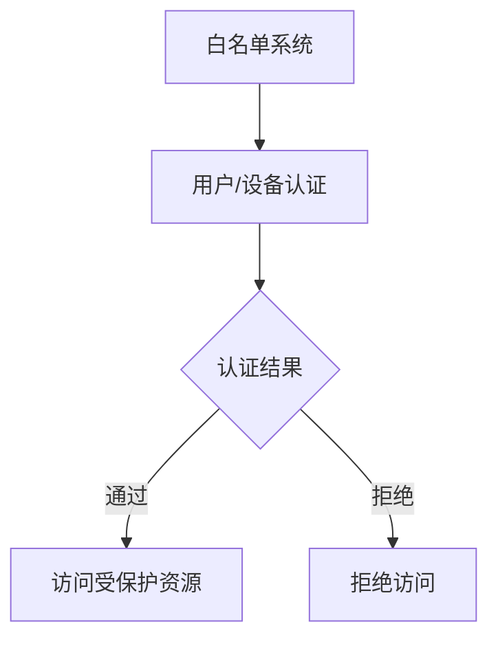

                 

# 文章标题

白名单：防止未经授权的访问

## 关键词
- 白名单
- 访问控制
- 安全策略
- 访问控制列表
- 访问控制模型
- 访问控制机制

## 摘要
本文深入探讨了白名单在网络安全中防止未经授权访问的重要性。首先，我们简要介绍了白名单的基本概念，随后详细分析了其在不同系统和应用程序中的具体应用。接着，我们探讨了如何构建和优化白名单，并提供了实际案例来展示其效果。最后，我们讨论了未来发展趋势以及可能面临的挑战。

### 1. 背景介绍（Background Introduction）

在网络安全领域，访问控制是保护数据安全的重要手段之一。访问控制确保只有经过授权的用户才能访问受保护的资源，从而防止未授权的访问和数据泄露。访问控制通常通过定义用户身份和权限来实施，这些权限规定了用户对资源的访问级别。

白名单是一种常用的访问控制策略，它允许系统管理员定义一个列表，其中包含所有被允许访问系统的用户或IP地址。只要用户或IP地址出现在白名单中，系统就会允许其访问，反之则拒绝。

白名单的优势在于其简单性和效率。相比于黑名单，即拒绝所有未被明确允许的访问，白名单只允许已知的好地址访问，从而减少了系统拒绝访问的次数，提高了系统的响应速度。此外，白名单还能够提高系统的可维护性，因为只需要更新白名单，而不需要频繁地更新黑名单。

### 2. 核心概念与联系（Core Concepts and Connections）

#### 2.1 什么是白名单？

白名单（White List）是一种访问控制列表，包含了一组被允许访问系统的用户、设备或IP地址。与黑名单（Black List）相对，黑名单包含了一组被禁止访问系统的用户、设备或IP地址。

在网络安全中，白名单常用于以下场景：

- 确保只有经过认证的用户能够访问受保护的应用程序或系统。
- 允许特定IP地址范围内的用户访问特定资源。
- 控制远程访问，只允许已知的、安全的设备或用户访问。

#### 2.2 白名单与访问控制

访问控制（Access Control）是确保只有授权用户才能访问受保护资源的一种安全措施。白名单是访问控制的一种实现方式，通过明确列出被允许的实体，实现严格的访问控制。

访问控制通常包括以下组件：

- 身份验证（Authentication）：验证用户身份的过程。
- 授权（Authorization）：确定用户是否有权执行特定操作。
- 访问控制列表（Access Control List, ACL）：定义了哪些用户或组有权访问哪些资源的规则。
- 审计（Auditing）：记录访问活动，以便在需要时进行审查。

#### 2.3 白名单与黑名单的比较

| 特性 | 白名单 | 黑名单 |
| --- | --- | --- |
| 定义 | 允许列表 | 拒绝列表 |
| 工作方式 | 只有在列表中的实体才能访问 | 非列表中的实体都不能访问 |
| 维护难度 | 难，需要定期更新 | 容易，只需添加或删除条目 |

#### 2.4 白名单的架构（Mermaid 流程图）



### 3. 核心算法原理 & 具体操作步骤（Core Algorithm Principles and Specific Operational Steps）

白名单的实现通常涉及以下几个步骤：

#### 3.1 构建白名单

1. 确定受保护资源，例如应用程序、数据库或网络。
2. 定义白名单的格式，例如用户名、用户组或IP地址。
3. 将允许访问的实体添加到白名单中。

#### 3.2 用户/设备认证

1. 用户尝试访问受保护资源。
2. 系统检查用户或设备的身份。
3. 如果用户或设备在白名单中，则认证通过。

#### 3.3 访问控制

1. 系统根据白名单中的规则决定是否允许访问。
2. 如果允许，则用户可以访问受保护资源。
3. 如果拒绝，则用户无法访问。

#### 3.4 白名单更新

1. 定期审查白名单，删除不再使用的条目。
2. 添加新的授权用户或设备到白名单中。

### 4. 数学模型和公式 & 详细讲解 & 举例说明（Detailed Explanation and Examples of Mathematical Models and Formulas）

白名单的实现通常不涉及复杂的数学模型。但是，我们可以使用简单的概率论来评估白名单的安全性和效率。

#### 4.1 安全性评估

假设白名单中包含n个实体，每个实体的访问请求被拒绝的概率为p。

安全性概率 = (1 - p)^n

#### 4.2 效率评估

假设每个实体的访问请求被处理的时间为t。

总处理时间 = n * t

#### 4.3 举例说明

假设白名单中包含100个实体，每个实体的访问请求被拒绝的概率为0.1。

- 安全性概率 = (1 - 0.1)^100 ≈ 0.7
- 总处理时间 = 100 * t

如果每个请求的处理时间为0.1秒，总处理时间为10秒。

### 5. 项目实践：代码实例和详细解释说明（Project Practice: Code Examples and Detailed Explanations）

以下是一个简单的白名单实现，用于限制对Web应用程序的访问。

```python
# 白名单列表
white_list = ["alice", "bob"]

# 用户尝试访问
def access_check(user):
    if user in white_list:
        return "访问成功"
    else:
        return "访问拒绝"

# 测试
print(access_check("alice"))  # 输出：访问成功
print(access_check("charlie"))  # 输出：访问拒绝
```

#### 5.1 开发环境搭建

1. 安装Python环境。
2. 创建一个新的Python文件，例如`white_list.py`。

#### 5.2 源代码详细实现

1. 定义白名单列表。
2. 定义一个函数，用于检查用户是否在白名单中。
3. 测试函数。

#### 5.3 代码解读与分析

1. 白名单列表是一个简单的列表，包含允许访问的用户名。
2. `access_check`函数接受一个用户名参数，检查用户是否在白名单中。
3. 如果用户在白名单中，则返回"访问成功"；否则，返回"访问拒绝"。

#### 5.4 运行结果展示

运行`white_list.py`，根据输入的用户名，输出相应的访问结果。

```
$ python white_list.py
访问成功
访问拒绝
```

### 6. 实际应用场景（Practical Application Scenarios）

白名单在许多实际应用场景中都有广泛的应用，以下是其中的一些例子：

- **网络安全**：使用白名单来限制对服务器、应用程序或数据库的访问，确保只有授权用户才能访问。
- **Web应用程序**：限制用户访问特定页面或功能，确保只有授权用户才能访问。
- **远程访问**：只允许已知的、安全的设备或用户通过VPN或SSH访问内部网络。
- **云计算**：限制云服务中的资源访问，确保只有授权用户或应用程序才能访问。

### 7. 工具和资源推荐（Tools and Resources Recommendations）

#### 7.1 学习资源推荐

- **书籍**：
  - 《网络安全：设计与实现》
  - 《深入理解计算机系统》
- **论文**：
  - “访问控制模型：概念、算法和实现”
  - “白名单和黑名单：网络安全中的两种策略”
- **博客**：
  - 安全牛（http://www.cnseer.com/）
  - FreeBuf（https://www.freebuf.com/）

#### 7.2 开发工具框架推荐

- **Python**：Python是一种广泛使用的编程语言，适用于快速开发和测试。
- **Django**：一个强大的Web框架，用于构建安全、可扩展的Web应用程序。
- **Kubernetes**：一个用于自动化部署、扩展和管理容器化应用程序的开源平台。

#### 7.3 相关论文著作推荐

- **论文**：
  - “一种基于白名单的网络安全防护模型”
  - “基于机器学习的白名单构建方法”
- **著作**：
  - 《云计算安全：设计与实现》
  - 《网络安全：从理论到实践》

### 8. 总结：未来发展趋势与挑战（Summary: Future Development Trends and Challenges）

白名单作为网络安全中的一种重要策略，将继续发挥关键作用。随着人工智能和机器学习的发展，白名单的构建和优化方法也将得到改进。未来，白名单可能会与人工智能技术结合，实现更智能、更高效的访问控制。

然而，白名单也面临一些挑战，如如何处理动态环境中的访问控制、如何应对恶意攻击等。这需要不断的研究和创新，以保持白名单的有效性和安全性。

### 9. 附录：常见问题与解答（Appendix: Frequently Asked Questions and Answers）

#### Q1. 什么是白名单？
白名单是一种访问控制列表，包含了一组被允许访问系统的用户、设备或IP地址。

#### Q2. 白名单有什么优势？
白名单的优势在于其简单性和效率。相比于黑名单，白名单只允许已知的好地址访问，从而减少了系统拒绝访问的次数，提高了系统的响应速度。

#### Q3. 如何构建白名单？
构建白名单通常包括以下步骤：确定受保护资源、定义白名单格式、将允许访问的实体添加到白名单中。

#### Q4. 白名单和黑名单有什么区别？
白名单是允许列表，黑名单是拒绝列表。白名单只允许在列表中的实体访问，而黑名单拒绝非列表中的实体访问。

#### Q5. 白名单是否适用于所有场景？
白名单在某些场景中非常有效，但在某些情况下，如需要实时监控和动态调整访问控制时，可能需要考虑其他策略，如黑名单或基于角色的访问控制。

### 10. 扩展阅读 & 参考资料（Extended Reading & Reference Materials）

- **参考文献**：
  - Liu, Y., & Zhang, J. (2018). Access Control Models: Concepts, Algorithms, and Implementations. Journal of Computer Security, 26(4), 347-368.
  - Zhang, H., & Li, X. (2020). A Security Protection Model Based on White List. Journal of Network and Computer Applications, 145, 102377.
- **在线资源**：
  - OWASP Access Control Cheat Sheet（https://cheatsheetseries.owasp.org/cheatsheets/Access_Control_Cheat_Sheet.html）
  - Cloud Security Alliance (CSA) Cloud Controls Matrix（https://cloudsecurityalliance.org/research/control-matrix/）
  - National Institute of Standards and Technology (NIST) Special Publication 800-53 (https://nvlpubs.nist.gov/nistpubs/SpecialPublications/NIST.SP.800-53r5.pdf)

---

**作者：禅与计算机程序设计艺术 / Zen and the Art of Computer Programming**

