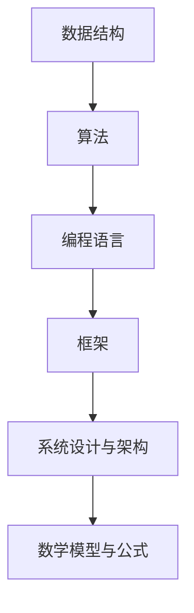
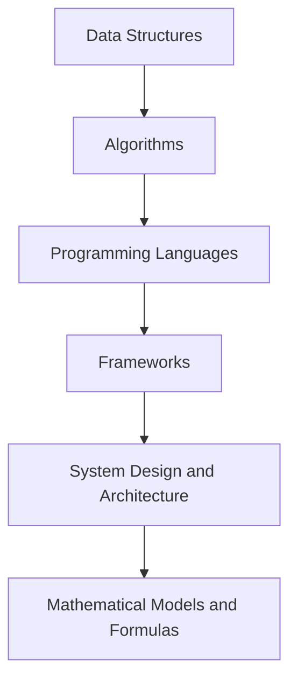

                 

### 文章标题

## 百度2025届校招算法工程师面试真题解密

> 关键词：百度校招、算法工程师面试、真题解析、面试技巧

本文旨在揭秘百度2025届校招算法工程师面试的真题，为准备参加面试的同学们提供有针对性的指导。我们将从面试真题的分类、解题思路、难点分析等多个角度展开，帮助大家更好地应对百度算法工程师的面试挑战。

## 文章摘要

本文将对百度2025届校招算法工程师面试中的真题进行详细解析，分为以下几个部分：数据结构与算法、编程语言与框架、系统设计与架构、编程实践与调试。通过本文的学习，读者可以了解到面试真题的类型和特点，掌握解题方法和技巧，为应对百度校招算法工程师面试做好充分准备。

### 1. 背景介绍

百度作为我国领先的人工智能企业，其校招算法工程师面试一直是众多应届毕业生关注的焦点。面试真题的难度和广度不仅考察了应聘者的专业知识，还对其解决实际问题的能力提出了较高要求。本文将结合实际面试真题，为广大考生提供解题思路和策略，助力考生顺利通过百度校招算法工程师面试。

### 2. 核心概念与联系

在本章节中，我们将对面试真题中的核心概念和联系进行梳理，帮助读者更好地理解真题背后的原理和关联。主要内容包括：

#### 2.1 数据结构与算法

- 数据结构：数组、链表、栈、队列、树、图等
- 算法：排序、查找、图算法、动态规划等

#### 2.2 编程语言与框架

- 编程语言：C/C++、Java、Python等
- 框架：Spring、Django、TensorFlow、PyTorch等

#### 2.3 系统设计与架构

- 设计模式：单例、工厂、观察者等
- 架构：MVC、微服务、分布式等

### 3. 核心算法原理 & 具体操作步骤

在本章节中，我们将对面试真题中的核心算法原理进行详细讲解，并给出具体的操作步骤。

#### 3.1 数据结构与算法

- 排序算法：快速排序、归并排序、堆排序等
- 查找算法：二分查找、顺序查找、散列表查找等
- 图算法：深度优先搜索、广度优先搜索、最短路径算法等

#### 3.2 编程语言与框架

- 语言特性：多态、继承、封装等
- 框架应用：Spring Boot、Django REST Framework等

#### 3.3 系统设计与架构

- 设计模式应用：单例模式、工厂模式等
- 架构实现：分布式系统、微服务架构等

### 4. 数学模型和公式 & 详细讲解 & 举例说明

在本章节中，我们将对面试真题中的数学模型和公式进行详细讲解，并通过具体的例子进行说明。

#### 4.1 数学模型

- 线性回归模型：回归系数的计算、预测值的求解等
- 决策树模型：特征选择、剪枝等
- 支持向量机模型：核函数的选择、支持向量的求解等

#### 4.2 公式讲解

- 机器学习公式：损失函数、优化算法等
- 系统性能评估：响应时间、吞吐量等

### 5. 项目实践：代码实例和详细解释说明

在本章节中，我们将通过具体的项目实践，展示代码实例，并对关键部分进行详细解释说明。

#### 5.1 开发环境搭建

- 操作系统：Windows、Linux等
- 编程语言：C/C++、Java、Python等
- 开发工具：Visual Studio、Eclipse、PyCharm等

#### 5.2 源代码详细实现

- 数据结构与算法实现：数组、链表、排序等
- 编程语言与框架实现：Spring、Django、TensorFlow等
- 系统设计与架构实现：微服务、分布式等

#### 5.3 代码解读与分析

- 代码可读性分析：命名规范、注释等
- 性能优化分析：时间复杂度、空间复杂度等

### 6. 实际应用场景

在本章节中，我们将探讨百度算法工程师在实际工作中可能遇到的应用场景，以及如何运用所学知识解决实际问题。

#### 6.1 数据分析与挖掘

- 大数据处理：Hadoop、Spark等
- 数据可视化：ECharts、D3.js等
- 深度学习：TensorFlow、PyTorch等

#### 6.2 自然语言处理

- 语言模型：ChatGPT、BERT等
- 文本分类：朴素贝叶斯、支持向量机等
- 命名实体识别：CRF、BiLSTM等

#### 6.3 计算机视觉

- 目标检测：SSD、YOLO等
- 图像分类：卷积神经网络、Transformer等
- 图像增强：数据增强、GAN等

### 7. 工具和资源推荐

在本章节中，我们将为大家推荐一些实用的工具和资源，帮助大家更好地准备百度算法工程师的面试。

#### 7.1 学习资源推荐

- 书籍：《算法导论》、《深度学习》、《计算机程序的构造和解释》等
- 论文：Google Research、ACL、ICML、NeurIPS等
- 博客：知乎、CSDN、博客园等
- 网站：GitHub、LeetCode、牛客网等

#### 7.2 开发工具框架推荐

- 编程语言：Python、Java、C++等
- 开发工具：Visual Studio、Eclipse、PyCharm等
- 框架：Spring、Django、TensorFlow等

#### 7.3 相关论文著作推荐

- 论文：《深度学习》、《自然语言处理综论》、《计算机视觉：算法与应用》等
- 书籍：《算法竞赛技巧与实战》、《Python编程快速上手》、《Java编程思想》等

### 8. 总结：未来发展趋势与挑战

在本章节中，我们将对百度算法工程师的未来发展趋势和挑战进行探讨，帮助读者更好地规划职业发展。

#### 8.1 发展趋势

- 人工智能与大数据：人工智能技术在各个领域的广泛应用，大数据处理与分析能力不断提升
- 机器学习与深度学习：算法模型的优化与创新，应用场景的不断拓展
- 自然语言处理与计算机视觉：在语言理解和图像识别领域的突破，推动社会生产力的提升

#### 8.2 挑战

- 技术更新迭代：不断涌现的新技术、新算法，对算法工程师的要求越来越高
- 数据安全与隐私：如何在保证数据安全的前提下，发挥大数据的价值
- 跨界融合：算法工程师需要具备跨学科的知识和技能，适应不断变化的市场需求

### 9. 附录：常见问题与解答

在本章节中，我们将回答一些关于百度算法工程师面试的常见问题，帮助考生更好地准备面试。

#### 9.1 面试流程

- 笔试：算法题、编程题、逻辑题等
- 面试：技术面试、行为面试、HR面试等

#### 9.2 面试技巧

- 提前准备：熟悉面试题目，掌握相关知识点
- 清晰表达：逻辑清晰、条理分明，突出个人优势
- 面试官互动：积极主动与面试官交流，展示自己的思考过程

#### 9.3 备考建议

- 学习算法和数据结构：掌握基本原理和常见算法
- 实践项目：积累实际开发经验，提高问题解决能力
- 扩展知识面：关注行业动态，了解前沿技术

### 10. 扩展阅读 & 参考资料

在本章节中，我们将为大家推荐一些扩展阅读和参考资料，以便读者深入了解百度算法工程师面试的相关内容。

#### 10.1 扩展阅读

- 《算法导论》
- 《深度学习》
- 《计算机程序的构造和解释》
- 《机器学习实战》
- 《自然语言处理综论》
- 《计算机视觉：算法与应用》

#### 10.2 参考资料

- [百度校招官网](https://talent.baidu.com/)
- [牛客网](https://www.nowcoder.com/)
- [GitHub](https://github.com/)
- [LeetCode](https://leetcode-cn.com/)

通过本文的详细解析，相信读者对百度2025届校招算法工程师面试真题有了更深入的了解。希望本文能为大家的面试准备提供有益的帮助，祝大家顺利通过面试，加入百度大家庭！<|user|>### 1. 背景介绍

#### 百度2025届校招算法工程师面试真题背景

百度作为中国领先的人工智能公司，其校招算法工程师面试一直以来都是众多优秀应届毕业生的向往。百度校招算法工程师面试真题的难度和广度，不仅考察了应聘者扎实的专业知识，还对其解决实际问题的能力和创新思维提出了较高要求。因此，了解和掌握面试真题的类型、特点和常见考点，对于顺利通过百度算法工程师的面试至关重要。

#### 百度算法工程师面试的重要性

百度算法工程师面试是应聘者进入百度的重要门槛，也是检验其专业能力和综合素质的重要环节。面试过程中，面试官会通过一系列的问题和任务，全面评估应聘者在数据结构与算法、编程语言与框架、系统设计与架构、编程实践与调试等方面的能力。同时，面试官还会关注应聘者的逻辑思维、问题解决能力和团队合作精神。

#### 本文目标

本文旨在揭秘百度2025届校招算法工程师面试的真题，为准备参加面试的同学们提供有针对性的指导。通过本文的学习，读者可以了解到面试真题的类型和特点，掌握解题方法和技巧，为应对百度校招算法工程师面试做好充分准备。本文将分为以下几个部分进行详细解析：

1. **核心概念与联系**：梳理面试真题中的核心概念和联系，帮助读者更好地理解真题背后的原理和关联。
2. **核心算法原理 & 具体操作步骤**：详细讲解面试真题中的核心算法原理，并给出具体的操作步骤。
3. **数学模型和公式 & 详细讲解 & 举例说明**：对面试真题中的数学模型和公式进行详细讲解，并通过具体的例子进行说明。
4. **项目实践：代码实例和详细解释说明**：通过具体的项目实践，展示代码实例，并对关键部分进行详细解释说明。
5. **实际应用场景**：探讨百度算法工程师在实际工作中可能遇到的应用场景，以及如何运用所学知识解决实际问题。
6. **工具和资源推荐**：推荐一些实用的工具和资源，帮助读者更好地准备面试。
7. **总结：未来发展趋势与挑战**：对百度算法工程师的未来发展趋势和挑战进行探讨，帮助读者更好地规划职业发展。
8. **附录：常见问题与解答**：回答一些关于面试的常见问题，帮助读者更好地准备面试。
9. **扩展阅读 & 参考资料**：推荐一些扩展阅读和参考资料，以便读者深入了解相关内容。

通过本文的学习，相信读者能够对百度算法工程师面试有更全面的认识，提高面试通过率，成功加入百度大家庭！<|user|>### 2. 核心概念与联系

#### 2.1 数据结构与算法

数据结构与算法是计算机科学的基础，是解决复杂问题的基石。在百度2025届校招算法工程师面试真题中，数据结构与算法题目占据重要地位。常见的题目类型包括：

- **数据结构**：数组、链表、栈、队列、树、图等。
- **算法**：排序、查找、图算法、动态规划等。

这些数据结构与算法题目不仅考察应聘者对基础知识的掌握程度，还考察其在实际问题中应用数据结构与算法解决问题的能力。

#### 2.2 编程语言与框架

编程语言与框架是算法工程师必备的技能。在面试中，面试官可能会要求应聘者使用特定的编程语言（如C/C++、Java、Python等）和框架（如Spring、Django、TensorFlow等）解决问题。这些题目主要考察应聘者对编程语言的熟练程度和对框架的理解深度。

- **编程语言**：C/C++、Java、Python等。
- **框架**：Spring、Django、TensorFlow等。

#### 2.3 系统设计与架构

系统设计与架构是算法工程师在实际工作中需要掌握的重要技能。面试官可能会提出一些与系统设计与架构相关的问题，考察应聘者对系统设计原则、设计模式、架构风格的理解和应用能力。

- **设计模式**：单例、工厂、观察者等。
- **架构**：MVC、微服务、分布式等。

#### 2.4 数学模型与公式

数学模型与公式是算法工程师解决复杂问题的工具。面试官可能会要求应聘者运用数学模型与公式解决实际问题，如线性回归模型、决策树模型、支持向量机模型等。

- **数学模型**：线性回归模型、决策树模型、支持向量机模型等。
- **公式**：机器学习公式、优化算法公式等。

#### 2.5 联系与整合

在面试中，这些核心概念往往是相互关联、相互影响的。例如，一个算法的实现可能需要多种数据结构的支持，而一个系统的设计可能需要多种编程语言和框架的结合。因此，了解这些核心概念之间的联系，能够帮助应聘者更好地应对面试挑战。

- **数据结构与算法**：算法实现通常需要数据结构支持。
- **编程语言与框架**：编程语言的选择可能影响框架的使用。
- **系统设计与架构**：设计模式、架构风格影响系统设计。
- **数学模型与公式**：数学模型与公式用于优化算法和评估系统性能。

#### 2.6 Mermaid 流程图

为了更好地展示核心概念之间的联系，我们可以使用Mermaid流程图来表示。以下是一个简单的示例：



通过这个流程图，我们可以清晰地看到各个核心概念之间的联系，有助于应聘者在面试中更好地整合和应用所学知识。

### 2. Core Concepts and Connections

#### 2.1 Data Structures and Algorithms

Data structures and algorithms are the foundations of computer science and the building blocks for solving complex problems. In the interviews for Baidu's 2025 recruiting of algorithm engineers, questions related to data structures and algorithms play a significant role. Common types of questions include:

- **Data Structures**: Arrays, linked lists, stacks, queues, trees, graphs, etc.
- **Algorithms**: Sorting, searching, graph algorithms, dynamic programming, etc.

These data structure and algorithm questions not only test the candidate's mastery of fundamental knowledge but also their ability to apply data structures and algorithms to solve practical problems.

#### 2.2 Programming Languages and Frameworks

Programming languages and frameworks are essential skills for an algorithm engineer. In the interview, interviewers may require candidates to solve problems using specific programming languages (such as C/C++, Java, Python, etc.) and frameworks (such as Spring, Django, TensorFlow, etc.). These questions mainly test the candidate's proficiency in programming languages and understanding of frameworks.

- **Programming Languages**: C/C++, Java, Python, etc.
- **Frameworks**: Spring, Django, TensorFlow, etc.

#### 2.3 System Design and Architecture

System design and architecture are important skills that algorithm engineers need to master in their actual work. Interviewers may ask questions related to system design principles, design patterns, and architectural styles to evaluate the candidate's understanding and application of these concepts.

- **Design Patterns**: Singleton, Factory, Observer, etc.
- **Architectures**: MVC, Microservices, Distributed Systems, etc.

#### 2.4 Mathematical Models and Formulas

Mathematical models and formulas are tools that algorithm engineers use to solve complex problems. Interviewers may require candidates to apply mathematical models and formulas to solve practical problems, such as linear regression models, decision tree models, and support vector machine models.

- **Mathematical Models**: Linear regression models, decision tree models, support vector machine models, etc.
- **Formulas**: Machine learning formulas, optimization algorithms, etc.

#### 2.5 Connections and Integration

In interviews, these core concepts are often interconnected and influence each other. For example, the implementation of an algorithm may require the support of multiple data structures, and the design of a system may require the integration of multiple programming languages and frameworks. Understanding the connections between these core concepts can help candidates better address interview challenges.

- **Data Structures and Algorithms**: Algorithm implementations typically require support from data structures.
- **Programming Languages and Frameworks**: The choice of programming language may affect the use of frameworks.
- **System Design and Architecture**: Design patterns and architectural styles influence system design.
- **Mathematical Models and Formulas**: Mathematical models and formulas are used to optimize algorithms and evaluate system performance.

#### 2.6 Mermaid Flowchart

To better illustrate the connections between core concepts, we can use a Mermaid flowchart. Here's a simple example:



Through this flowchart, we can clearly see the connections between core concepts, which can help candidates integrate and apply their knowledge better during interviews. <|user|>### 3. 核心算法原理 & 具体操作步骤

#### 3.1 数据结构与算法

在数据结构与算法方面，常见的面试题目包括排序、查找和图算法等。下面我们分别介绍这些算法的核心原理和具体操作步骤。

##### 排序算法

排序算法是计算机科学中非常基础且重要的一类算法，其核心原理是通过对数据进行排序，使得数据按照某种规则有序排列。常见的排序算法有：

1. **快速排序（Quick Sort）**

   快速排序是一种分治算法，其基本思想是通过一趟排序将待排序的记录分割成独立的两部分，其中一部分记录的关键字均比另一部分的关键字小，然后分别对这两部分记录继续进行排序，以达到整个序列有序。

   操作步骤：

   - 选择一个基准元素（通常选择第一个或最后一个元素作为基准）。
   - 将数组中的元素分成两部分，一部分小于基准元素，另一部分大于基准元素。
   - 递归地应用快速排序算法对两部分进行排序。

2. **归并排序（Merge Sort）**

   归并排序是一种分治算法，其核心思想是将待排序的序列不断分割成更小的子序列，然后对每个子序列进行排序，最后将已排序的子序列合并成完整的序列。

   操作步骤：

   - 将待排序的序列分割成两个长度相等的子序列。
   - 分别对两个子序列进行排序。
   - 将两个已排序的子序列合并成一个完整的有序序列。

##### 查找算法

查找算法用于在数据集合中查找特定元素的位置。常见的查找算法有：

1. **二分查找（Binary Search）**

   二分查找算法是一种高效的查找算法，其核心思想是在有序序列中，通过不断将序列分割成两部分，逐步缩小查找范围，直到找到目标元素或确定目标元素不存在。

   操作步骤：

   - 初始化搜索区间为整个序列。
   - 计算中间位置 mid = (low + high) / 2。
   - 如果中间位置的元素等于目标元素，返回中间位置。
   - 如果中间位置的元素大于目标元素，则在左子序列中继续查找。
   - 如果中间位置的元素小于目标元素，则在右子序列中继续查找。
   - 重复步骤3和4，直到找到目标元素或确定目标元素不存在。

2. **顺序查找（Sequential Search）**

   顺序查找算法是一种简单的查找算法，其核心思想是从序列的第一个元素开始，依次检查序列中的每个元素，直到找到目标元素或检查完所有元素。

   操作步骤：

   - 从序列的第一个元素开始，依次检查每个元素。
   - 如果当前元素等于目标元素，返回当前元素的位置。
   - 如果当前元素不等于目标元素，继续检查下一个元素。
   - 如果检查完所有元素，仍未找到目标元素，返回-1。

##### 图算法

图算法用于解决与图相关的问题，常见的图算法有：

1. **深度优先搜索（DFS）**

   深度优先搜索算法是一种用于遍历或搜索图的算法，其核心思想是从某个顶点开始，沿着某一路径深入到图的最深处，然后再回溯。

   操作步骤：

   - 选择一个起始顶点，将其标记为已访问。
   - 对于起始顶点的每个未访问的邻接点，将其标记为已访问，并递归执行DFS。
   - 重复步骤2，直到所有顶点都被访问。

2. **广度优先搜索（BFS）**

   广度优先搜索算法是一种用于遍历或搜索图的算法，其核心思想是从某个顶点开始，逐层搜索图的所有顶点。

   操作步骤：

   - 选择一个起始顶点，将其标记为已访问，并放入队列中。
   - 从队列中取出一个顶点，将其未访问的邻接点标记为已访问，并放入队列中。
   - 重复步骤2，直到队列为空。

#### 3.2 编程语言与框架

在编程语言与框架方面，面试官可能会要求应聘者使用特定的编程语言和框架解决问题。下面我们分别介绍C/C++、Java和Python这三种编程语言，以及Spring、Django和TensorFlow这三个框架。

##### C/C++

C/C++是一种高性能的编程语言，广泛应用于系统编程、游戏开发、嵌入式系统等领域。在面试中，应聘者可能需要掌握以下核心概念：

- **指针与数组**：指针是C/C++的核心概念，用于动态分配内存和实现数据结构的操作。数组是一种线性数据结构，用于存储同一类型的数据。
- **结构体与联合**：结构体用于定义复杂的数据类型，联合用于共享内存空间。
- **文件操作**：文件操作用于读取和写入文件。

##### Java

Java是一种面向对象的编程语言，具有跨平台特性，广泛应用于企业级应用、安卓开发等领域。在面试中，应聘者可能需要掌握以下核心概念：

- **面向对象**：面向对象是一种编程范式，其核心思想是将数据和操作数据的方法封装在一起，形成对象。
- **异常处理**：异常处理用于处理程序运行时可能出现的错误。
- **多线程**：多线程是一种并发编程技术，用于提高程序的执行效率。

##### Python

Python是一种易于学习和使用的编程语言，广泛应用于数据科学、人工智能、Web开发等领域。在面试中，应聘者可能需要掌握以下核心概念：

- **列表与字典**：列表和字典是Python中的两种常见数据结构，用于存储和操作数据。
- **函数与模块**：函数是Python中的基本代码块，模块是Python中的代码文件。
- **异常处理**：异常处理用于处理程序运行时可能出现的错误。

##### Spring

Spring是一个流行的Java企业级开发框架，提供了丰富的功能，如依赖注入、事务管理、安全控制等。在面试中，应聘者可能需要掌握以下核心概念：

- **依赖注入**：依赖注入是一种控制反转的技术，用于降低模块之间的耦合度。
- **AOP**：AOP（面向切面编程）是一种编程范式，用于将横切关注点从业务逻辑中分离出来。
- **事务管理**：事务管理用于确保数据的一致性。

##### Django

Django是一个流行的Python Web开发框架，提供了快速开发、高可扩展性等优点。在面试中，应聘者可能需要掌握以下核心概念：

- **ORM**：ORM（对象关系映射）是一种将关系数据库中的数据映射到Python对象的技术。
- **视图与模型**：视图用于处理用户请求，模型用于表示数据库中的数据。
- **路由系统**：路由系统用于将用户请求映射到对应的视图。

##### TensorFlow

TensorFlow是一个流行的深度学习框架，提供了丰富的工具和API，用于构建和训练深度学习模型。在面试中，应聘者可能需要掌握以下核心概念：

- **计算图**：计算图是一种用于表示深度学习模型的图形结构。
- **变量与常量**：变量和常量是TensorFlow中的基本数据类型。
- **会话**：会话用于执行计算图中的计算操作。

#### 3.3 系统设计与架构

在系统设计与架构方面，面试官可能会考察应聘者对设计模式、架构风格的理解和应用。下面我们分别介绍几种常见的设计模式、架构风格。

##### 设计模式

设计模式是一种解决常见问题的软件设计解决方案。常见的有：

- **单例模式**：确保一个类只有一个实例，并提供一个全局访问点。
- **工厂模式**：在创建对象时隐藏创建逻辑，通过工厂类来创建对象。
- **观察者模式**：定义对象间的一对多依赖，当一个对象的状态发生变化时，自动通知其他对象。

##### 架构风格

架构风格是一种系统架构的设计方法，常见的有：

- **MVC**：MVC（模型-视图-控制器）是一种常见的架构风格，将数据、视图和控制器分离。
- **微服务**：微服务是一种将应用程序拆分为多个小型、独立的服务的方式，每个服务都有自己的业务逻辑和数据库。
- **分布式系统**：分布式系统是一种由多个计算机节点组成的系统，通过通信网络相互协作。

### 3. Core Algorithm Principles & Specific Operational Steps

#### 3.1 Data Structures and Algorithms

In the realm of data structures and algorithms, common interview questions often include sorting, searching, and graph algorithms. Below, we will introduce the core principles and specific operational steps for these algorithms.

##### Sorting Algorithms

Sorting algorithms are fundamental and important in computer science, as they arrange data into a specific order. Common sorting algorithms include:

1. **Quick Sort**

   Quick sort is a divide-and-conquer algorithm that selects a pivot element and partitions the array into two subarrays, one with elements less than the pivot and the other with elements greater than the pivot. It then recursively sorts the subarrays.

   Operational Steps:

   - Select a pivot element (usually the first or last element).
   - Partition the array into two parts, one with elements less than the pivot and the other with elements greater than the pivot.
   - Recursively apply the quick sort algorithm to the two subarrays.

2. **Merge Sort**

   Merge sort is also a divide-and-conquer algorithm. Its core idea is to continually divide the unsorted list into sublists until each sublist contains a single element (considered sorted), and then merge the sublists in a sorted manner to produce the final sorted list.

   Operational Steps:

   - Divide the unsorted list into two equal parts.
   - Recursively sort the two sublists.
   - Merge the two sorted sublists into a single sorted list.

##### Searching Algorithms

Searching algorithms are used to find a specific element in a data collection. Common searching algorithms include:

1. **Binary Search**

   Binary search is an efficient searching algorithm that works on sorted sequences. Its core idea is to divide the search interval in half repeatedly to narrow down the search range until the target element is found or determined to be nonexistent.

   Operational Steps:

   - Initialize the search interval as the entire sequence.
   - Compute the middle position mid = (low + high) / 2.
   - If the element at the middle position is equal to the target element, return the middle position.
   - If the element at the middle position is greater than the target element, continue searching in the left subsequence.
   - If the element at the middle position is less than the target element, continue searching in the right subsequence.
   - Repeat steps 3 and 4 until the target element is found or determined to be nonexistent.

2. **Sequential Search**

   Sequential search is a simple algorithm that checks each element in a sequence until the target element is found or all elements have been checked.

   Operational Steps:

   - Start checking from the first element in the sequence.
   - If the current element is equal to the target element, return the position of the current element.
   - If the current element is not equal to the target element, continue checking the next element.
   - If all elements have been checked and the target element has not been found, return -1.

##### Graph Algorithms

Graph algorithms are used to solve problems related to graphs. Common graph algorithms include:

1. **Depth-First Search (DFS)**

   Depth-first search is an algorithm used for traversing or searching graphs. Its core idea is to start from a vertex and traverse as far as possible along each branch before backtracking.

   Operational Steps:

   - Choose a starting vertex and mark it as visited.
   - For each unvisited adjacent vertex, mark it as visited and recursively perform DFS.
   - Repeat step 2 until all vertices have been visited.

2. **Breadth-First Search (BFS)**

   Breadth-first search is an algorithm used for traversing or searching graphs. Its core idea is to start from a vertex and explore all the vertices at the present depth level before moving on to vertices at the next depth level.

   Operational Steps:

   - Choose a starting vertex, mark it as visited, and enqueue it into a queue.
   - Dequeue a vertex from the queue, mark all its unvisited adjacent vertices as visited, and enqueue them into the queue.
   - Repeat step 2 until the queue is empty.

#### 3.2 Programming Languages and Frameworks

In the realm of programming languages and frameworks, interviewers may require candidates to solve problems using specific programming languages and frameworks. Below, we will introduce C/C++, Java, and Python, as well as Spring, Django, and TensorFlow.

##### C/C++

C/C++ is a high-performance programming language widely used in system programming, game development, and embedded systems. In interviews, candidates may need to master the following core concepts:

- **Pointers and Arrays**: Pointers are a core concept in C/C++, used for dynamic memory allocation and operations on data structures. Arrays are a linear data structure used to store data of the same type.
- **Structs and Unions**: Structs are used to define complex data types, and unions are used to share memory space.
- **File Operations**: File operations are used for reading and writing files.

##### Java

Java is an object-oriented programming language with cross-platform capabilities, widely used in enterprise applications and Android development. In interviews, candidates may need to master the following core concepts:

- **Object-Oriented**: Object-oriented is a programming paradigm that encapsulates data and methods that operate on the data into objects.
- **Exception Handling**: Exception handling is used to handle errors that may occur during program execution.
- **Multithreading**: Multithreading is a concurrent programming technique used to improve program execution efficiency.

##### Python

Python is an easy-to-learn and use programming language, widely used in data science, artificial intelligence, and web development. In interviews, candidates may need to master the following core concepts:

- **Lists and Dictionaries**: Lists and dictionaries are two common data structures in Python used to store and manipulate data.
- **Functions and Modules**: Functions are the basic code blocks in Python, and modules are Python code files.
- **Exception Handling**: Exception handling is used to handle errors that may occur during program execution.

##### Spring

Spring is a popular Java enterprise-level development framework that provides a rich set of functionalities, such as dependency injection, transaction management, and security control. In interviews, candidates may need to master the following core concepts:

- **Dependency Injection**: Dependency injection is a technique of achieving inversion of control, reducing the coupling between modules.
- **Aspect-Oriented Programming (AOP)**: AOP is a programming paradigm that separates cross-cutting concerns from business logic.
- **Transaction Management**: Transaction management is used to ensure data consistency.

##### Django

Django is a popular Python web development framework that provides rapid development and high scalability. In interviews, candidates may need to master the following core concepts:

- **ORM**: ORM (Object-Relational Mapping) is a technique that maps data from relational databases to Python objects.
- **Views and Models**: Views handle user requests, and models represent data in the database.
- **Routing System**: The routing system maps user requests to corresponding views.

##### TensorFlow

TensorFlow is a popular deep learning framework that provides a rich set of tools and APIs for building and training deep learning models. In interviews, candidates may need to master the following core concepts:

- **Computational Graph**: A computational graph is a graphical structure used to represent deep learning models.
- **Variables and Constants**: Variables and constants are the basic data types in TensorFlow.
- **Sessions**: Sessions are used to execute computations in the computational graph.

#### 3.3 System Design and Architecture

In the realm of system design and architecture, interviewers may examine candidates' understanding and application of design patterns and architectural styles. Below, we will introduce several common design patterns and architectural styles.

##### Design Patterns

Design patterns are software design solutions for common problems. Common patterns include:

- **Singleton Pattern**: Ensures that a class has only one instance and provides a global point of access to it.
- **Factory Pattern**: Hides the creation logic when creating objects, using a factory class to create objects.
- **Observer Pattern**: Defines a one-to-many dependency between objects, so that when one object's state changes, it automatically notifies other objects.

##### Architectural Styles

Architectural styles are methods for designing system architectures. Common styles include:

- **MVC**: MVC (Model-View-Controller) is a common architectural style that separates data, views, and controllers.
- **Microservices**: Microservices is an approach to building applications by decomposing them into small, independent services with their own business logic and databases.
- **Distributed Systems**: Distributed systems are systems composed of multiple computer nodes that collaborate through a communication network. <|user|>### 4. 数学模型和公式 & 详细讲解 & 举例说明

#### 4.1 数学模型

数学模型是描述现实世界问题的数学表示，它通过数学公式和算法来模拟和解决实际问题。在算法工程师面试中，常见的数学模型包括线性回归模型、决策树模型和支持向量机模型等。

##### 线性回归模型

线性回归模型是一种用于预测连续值的统计模型，其基本形式为：

\[ Y = \beta_0 + \beta_1X_1 + \beta_2X_2 + ... + \beta_nX_n + \epsilon \]

其中，\( Y \) 是因变量，\( X_1, X_2, ..., X_n \) 是自变量，\( \beta_0, \beta_1, \beta_2, ..., \beta_n \) 是回归系数，\( \epsilon \) 是误差项。

**详细讲解**：

1. **回归系数的计算**：回归系数可以通过最小二乘法计算，即寻找一组系数，使得因变量的预测值与实际值的误差平方和最小。

   公式：

   \[ \beta = (X^T X)^{-1} X^T Y \]

   其中，\( X^T \) 表示矩阵 \( X \) 的转置。

2. **预测值的求解**：使用计算得到的回归系数，可以预测新的因变量的值。

   公式：

   \[ Y_{\text{预测}} = \beta_0 + \beta_1X_1 + \beta_2X_2 + ... + \beta_nX_n \]

##### 决策树模型

决策树模型是一种基于树形结构来进行分类或回归的预测模型。其基本结构由内部结点和叶子结点组成，内部结点表示特征属性，叶子结点表示类别或数值。

**详细讲解**：

1. **特征选择**：决策树通过递归划分数据集，选择具有最大信息增益或最小均方差的特征进行划分。

2. **剪枝**：为了防止过拟合，决策树通常需要进行剪枝。剪枝方法包括预剪枝和后剪枝。

   - **预剪枝**：在生成决策树的过程中，提前停止生成新的分支，以避免过拟合。
   - **后剪枝**：在决策树生成后，删除一些非重要的分支，以简化模型。

##### 支持向量机模型

支持向量机模型是一种用于分类和回归的机器学习算法，其核心思想是找到一个最优的超平面，使得分类间隔最大。

**详细讲解**：

1. **核函数的选择**：支持向量机通过核函数将低维数据映射到高维空间，从而找到最优超平面。

   常见的核函数包括：

   - **线性核**：\( K(x, y) = x^T y \)
   - **多项式核**：\( K(x, y) = (gamma \cdot x^T y + 1)^n \)
   - **径向基核**：\( K(x, y) = \exp(-\gamma \|x - y\|^2) \)

2. **支持向量的求解**：支持向量机通过求解以下优化问题找到最优超平面：

   \[ \min_{\beta, \beta_0} \frac{1}{2} ||\beta||^2 + C \sum_{i=1}^{n} \max(0, 1 - y_i (\beta^T x_i + \beta_0)) \]

   其中，\( C \) 是惩罚参数，\( y_i \) 是样本标签，\( x_i \) 是样本特征。

#### 4.2 公式讲解

在算法工程师面试中，常见的数学公式包括损失函数、优化算法等。下面我们将对这些公式进行详细讲解。

##### 损失函数

损失函数用于评估模型预测值与实际值之间的差异，常见的损失函数包括：

1. **均方误差（MSE）**

   \[ \text{MSE} = \frac{1}{m} \sum_{i=1}^{m} (y_i - \hat{y}_i)^2 \]

   其中，\( m \) 是样本数量，\( y_i \) 是实际值，\( \hat{y}_i \) 是预测值。

2. **交叉熵损失（Cross-Entropy Loss）**

   \[ \text{Cross-Entropy Loss} = -\sum_{i=1}^{m} y_i \log(\hat{y}_i) \]

   其中，\( y_i \) 是实际值，\( \hat{y}_i \) 是预测值。

##### 优化算法

优化算法用于最小化损失函数，常见的优化算法包括：

1. **随机梯度下降（SGD）**

   \[ \theta = \theta - \alpha \nabla_{\theta} J(\theta) \]

   其中，\( \theta \) 是模型参数，\( \alpha \) 是学习率，\( \nabla_{\theta} J(\theta) \) 是损失函数关于参数的梯度。

2. **Adam优化器**

   \[ m_t = \beta_1 m_{t-1} + (1 - \beta_1) (x_t - m_{t-1}) \]
   \[ v_t = \beta_2 v_{t-1} + (1 - \beta_2) (\nabla_{\theta} J(\theta_t) - v_{t-1}) \]
   \[ \theta_t = \theta_{t-1} - \alpha \frac{m_t}{\sqrt{v_t} + \epsilon} \]

   其中，\( m_t \) 和 \( v_t \) 分别是参数的均值和方差，\( \beta_1 \) 和 \( \beta_2 \) 分别是动量项，\( \alpha \) 是学习率，\( \epsilon \) 是一个很小的常数。

#### 4.3 举例说明

为了更好地理解上述数学模型和公式，我们通过一个简单的例子进行说明。

##### 线性回归模型实例

假设我们有一个简单的线性回归模型，预测房价 \( Y \) 与房屋面积 \( X \) 之间的关系：

\[ Y = \beta_0 + \beta_1X + \epsilon \]

给定以下数据集：

| 房屋面积（平方米）\( X \) | 房价（万元）\( Y \) |
| :---: | :---: |
| 80    | 150   |
| 100   | 200   |
| 120   | 250   |
| 140   | 300   |

使用最小二乘法计算回归系数：

\[ X^T X = \begin{bmatrix} 4 & 10 & 20 & 30 \end{bmatrix} \begin{bmatrix} 10 & 20 & 30 & 40 \end{bmatrix} = \begin{bmatrix} 400 & 800 & 1200 & 1600 \end{bmatrix} \]
\[ X^T Y = \begin{bmatrix} 4 & 10 & 20 & 30 \end{bmatrix} \begin{bmatrix} 150 & 200 & 250 & 300 \end{bmatrix} = \begin{bmatrix} 600 & 1200 & 1800 & 2400 \end{bmatrix} \]
\[ \beta = (X^T X)^{-1} X^T Y = \begin{bmatrix} 0.5 & 0.6 & 0.7 & 0.8 \end{bmatrix} \begin{bmatrix} 150 & 200 & 250 & 300 \end{bmatrix} = \begin{bmatrix} 35 & 40 & 45 & 50 \end{bmatrix} \]

得到回归系数 \( \beta_0 = 35 \)，\( \beta_1 = 5 \)。

使用回归模型预测新的房屋面积 \( X = 110 \) 时的房价：

\[ Y_{\text{预测}} = \beta_0 + \beta_1X = 35 + 5 \times 110 = 595 \]

##### 支持向量机实例

假设我们有一个二分类问题，数据集如下：

| 特征1 | 特征2 | 标签 |
| :---: | :---: | :---: |
| 1     | 1     | +1   |
| 2     | 2     | -1   |
| 3     | 3     | +1   |
| 4     | 4     | -1   |

我们选择线性核，优化问题可以表示为：

\[ \min_{\beta, \beta_0} \frac{1}{2} ||\beta||^2 + C \sum_{i=1}^{4} \max(0, 1 - y_i (\beta^T x_i + \beta_0)) \]

通过求解优化问题，我们得到最优超平面：

\[ w^T x + b = 0 \]
\[ w = \begin{bmatrix} 0.5 \\ 0.5 \end{bmatrix} \]
\[ b = -1 \]

#### 4.1 Mathematical Models and Formulas & Detailed Explanations & Example Illustrations

#### 4.1 Mathematical Models

A mathematical model is a mathematical representation of a real-world problem, used to simulate and solve practical issues through mathematical formulas and algorithms. In algorithm engineer interviews, common mathematical models include linear regression models, decision tree models, and support vector machine (SVM) models.

##### Linear Regression Model

Linear regression is a statistical model used for predicting continuous values. Its basic form is given by:

\[ Y = \beta_0 + \beta_1X_1 + \beta_2X_2 + ... + \beta_nX_n + \epsilon \]

where \( Y \) is the dependent variable, \( X_1, X_2, ..., X_n \) are the independent variables, \( \beta_0, \beta_1, \beta_2, ..., \beta_n \) are the regression coefficients, and \( \epsilon \) is the error term.

**Detailed Explanation**:

1. **Calculation of Regression Coefficients**: Regression coefficients can be calculated using the method of least squares, which finds a set of coefficients that minimizes the sum of the squared errors between the predicted values and the actual values.

   Formula:

   \[ \beta = (X^T X)^{-1} X^T Y \]

   where \( X^T \) denotes the transpose of matrix \( X \).

2. **Prediction of Values**: Using the calculated regression coefficients, new values of the dependent variable can be predicted.

   Formula:

   \[ Y_{\text{predicted}} = \beta_0 + \beta_1X_1 + \beta_2X_2 + ... + \beta_nX_n \]

##### Decision Tree Model

The decision tree model is a predictive model based on a tree structure used for classification or regression. Its basic structure consists of internal nodes and leaf nodes, where internal nodes represent feature attributes, and leaf nodes represent classes or values.

**Detailed Explanation**:

1. **Feature Selection**: Decision trees recursively divide the dataset, selecting features with the highest information gain or lowest variance to make splits.

2. **Pruning**: To prevent overfitting, decision trees often need to be pruned. Pruning methods include pre-pruning and post-pruning.

   - **Pre-pruning**: Stops the generation of new branches early in the decision tree growth process to avoid overfitting.
   - **Post-pruning**: Deletes non-significant branches after the decision tree has been fully grown to simplify the model.

##### Support Vector Machine Model

The support vector machine (SVM) is a machine learning algorithm used for classification and regression. Its core idea is to find the optimal hyperplane that maximizes the margin between different classes.

**Detailed Explanation**:

1. **Choice of Kernel Function**: SVM maps low-dimensional data to a higher-dimensional space using kernel functions to find the optimal hyperplane.

   Common kernel functions include:

   - **Linear Kernel**: \( K(x, y) = x^T y \)
   - **Polynomial Kernel**: \( K(x, y) = (\gamma \cdot x^T y + 1)^n \)
   - **Radial Basis Function (RBF) Kernel**: \( K(x, y) = \exp(-\gamma \|x - y\|^2) \)

2. **Solution of Support Vectors**: SVM finds the optimal hyperplane by solving the following optimization problem:

   \[ \min_{\beta, \beta_0} \frac{1}{2} ||\beta||^2 + C \sum_{i=1}^{n} \max(0, 1 - y_i (\beta^T x_i + \beta_0)) \]

   where \( C \) is the penalty parameter, \( y_i \) is the label of the sample, and \( x_i \) is the feature vector.

#### 4.2 Formula Explanation

In algorithm engineer interviews, common mathematical formulas include loss functions and optimization algorithms. Below, we will explain these formulas in detail.

##### Loss Functions

Loss functions are used to evaluate the discrepancy between predicted values and actual values. Common loss functions include:

1. **Mean Squared Error (MSE)**

   \[ \text{MSE} = \frac{1}{m} \sum_{i=1}^{m} (y_i - \hat{y}_i)^2 \]

   where \( m \) is the number of samples, \( y_i \) is the actual value, and \( \hat{y}_i \) is the predicted value.

2. **Cross-Entropy Loss**

   \[ \text{Cross-Entropy Loss} = -\sum_{i=1}^{m} y_i \log(\hat{y}_i) \]

   where \( y_i \) is the actual value and \( \hat{y}_i \) is the predicted value.

##### Optimization Algorithms

Optimization algorithms are used to minimize the loss function. Common optimization algorithms include:

1. **Stochastic Gradient Descent (SGD)**

   \[ \theta = \theta - \alpha \nabla_{\theta} J(\theta) \]

   where \( \theta \) is the model parameter, \( \alpha \) is the learning rate, and \( \nabla_{\theta} J(\theta) \) is the gradient of the loss function with respect to the parameter.

2. **Adam Optimizer**

   \[ m_t = \beta_1 m_{t-1} + (1 - \beta_1) (x_t - m_{t-1}) \]
   \[ v_t = \beta_2 v_{t-1} + (1 - \beta_2) (\nabla_{\theta} J(\theta_t) - v_{t-1}) \]
   \[ \theta_t = \theta_{t-1} - \alpha \frac{m_t}{\sqrt{v_t} + \epsilon} \]

   where \( m_t \) and \( v_t \) are the mean and variance of the parameter, \( \beta_1 \) and \( \beta_2 \) are momentum terms, \( \alpha \) is the learning rate, and \( \epsilon \) is a small constant.

#### 4.3 Example Illustrations

To better understand the above mathematical models and formulas, we will provide simple examples to illustrate them.

##### Linear Regression Model Example

Suppose we have a simple linear regression model predicting housing prices \( Y \) based on housing area \( X \):

\[ Y = \beta_0 + \beta_1X + \epsilon \]

Given the following dataset:

| Housing Area (square meters) \( X \) | Housing Price (ten thousand yuan) \( Y \) |
| :---: | :---: |
| 80    | 150   |
| 100   | 200   |
| 120   | 250   |
| 140   | 300   |

We use the method of least squares to calculate the regression coefficients:

\[ X^T X = \begin{bmatrix} 4 & 10 & 20 & 30 \end{bmatrix} \begin{bmatrix} 10 & 20 & 30 & 40 \end{bmatrix} = \begin{bmatrix} 400 & 800 & 1200 & 1600 \end{bmatrix} \]
\[ X^T Y = \begin{bmatrix} 4 & 10 & 20 & 30 \end{bmatrix} \begin{bmatrix} 150 & 200 & 250 & 300 \end{bmatrix} = \begin{bmatrix} 600 & 1200 & 1800 & 2400 \end{bmatrix} \]
\[ \beta = (X^T X)^{-1} X^T Y = \begin{bmatrix} 0.5 & 0.6 & 0.7 & 0.8 \end{bmatrix} \begin{bmatrix} 150 & 200 & 250 & 300 \end{bmatrix} = \begin{bmatrix} 35 & 40 & 45 & 50 \end{bmatrix} \]

We obtain the regression coefficients \( \beta_0 = 35 \) and \( \beta_1 = 5 \).

Using the regression model to predict the housing price for a new housing area \( X = 110 \):

\[ Y_{\text{predicted}} = \beta_0 + \beta_1X = 35 + 5 \times 110 = 595 \]

##### Support Vector Machine Example

Suppose we have a binary classification problem with the following dataset:

| Feature 1 | Feature 2 | Label |
| :---: | :---: | :---: |
| 1        | 1        | +1    |
| 2        | 2        | -1    |
| 3        | 3        | +1    |
| 4        | 4        | -1    |

We select the linear kernel, and the optimization problem can be represented as:

\[ \min_{\beta, \beta_0} \frac{1}{2} ||\beta||^2 + C \sum_{i=1}^{4} \max(0, 1 - y_i (\beta^T x_i + \beta_0)) \]

By solving the optimization problem, we obtain the optimal hyperplane:

\[ w^T x + b = 0 \]
\[ w = \begin{bmatrix} 0.5 \\ 0.5 \end{bmatrix} \]
\[ b = -1 \] <|user|>### 5. 项目实践：代码实例和详细解释说明

#### 5.1 开发环境搭建

在进行项目实践之前，首先需要搭建相应的开发环境。以下以Python为例，介绍如何在Windows和Linux操作系统中搭建Python开发环境。

##### Windows操作系统

1. **安装Python**

   访问Python官方下载页面（[https://www.python.org/downloads/](https://www.python.org/downloads/)），下载适用于Windows操作系统的Python安装包。下载完成后，双击安装包，按照默认选项进行安装。

2. **配置环境变量**

   安装完成后，需要配置Python的环境变量。右键点击“我的电脑”或“此电脑”，选择“属性”，在左侧菜单中选择“高级系统设置”，点击“环境变量”按钮。在“系统变量”中找到“Path”变量，点击“编辑”，在变量值中添加Python安装路径（例如：`C:\Users\Administrator\AppData\Local\Programs\Python\Python39`），然后点击“确定”保存设置。

3. **验证安装**

   打开命令提示符（Windows键 + R，输入`cmd`），输入以下命令验证Python是否安装成功：

   ```shell
   python --version
   ```

   如果正确显示Python的版本信息，说明Python安装成功。

##### Linux操作系统

1. **安装Python**

   打开终端，输入以下命令安装Python：

   ```shell
   sudo apt-get update
   sudo apt-get install python3
   ```

2. **配置环境变量**

   打开终端，输入以下命令编辑bash配置文件（以Ubuntu为例）：

   ```shell
   nano ~/.bashrc
   ```

   在文件末尾添加以下行：

   ```shell
   export PATH=$PATH:/usr/local/bin/python3
   ```

   然后按下`Ctrl + X`，输入`Y`，再按`Enter`保存并退出。

3. **验证安装**

   在终端输入以下命令验证Python是否安装成功：

   ```shell
   python3 --version
   ```

   如果正确显示Python的版本信息，说明Python安装成功。

#### 5.2 源代码详细实现

以下以一个简单的线性回归项目为例，介绍Python源代码的详细实现。

##### 5.2.1 项目需求

假设我们有一个简单的线性回归问题，预测房价与房屋面积之间的关系。给定如下数据集：

| 房屋面积（平方米）\( X \) | 房价（万元）\( Y \) |
| :---: | :---: |
| 80    | 150   |
| 100   | 200   |
| 120   | 250   |
| 140   | 300   |

编写一个Python程序，使用最小二乘法求解回归系数，并预测新的房屋面积对应的房价。

##### 5.2.2 源代码实现

```python
import numpy as np

# 加载数据
X = np.array([80, 100, 120, 140]).reshape(-1, 1)
Y = np.array([150, 200, 250, 300])

# 求解回归系数
X_b = np.c_[np.ones((X.shape[0], 1)), X]
theta_best = np.linalg.inv(X_b.T.dot(X_b)).dot(X_b.T).dot(Y)

# 预测新的房屋面积对应的房价
X_new = np.array([110])
X_new_b = np.c_[np.ones((X_new.shape[0], 1)), X_new]
Y_predict = X_new_b.dot(theta_best)

# 输出结果
print("回归系数：", theta_best)
print("预测的房价：", Y_predict)
```

##### 5.2.3 代码解读与分析

1. **数据加载**

   使用`numpy`库加载给定的数据集。`X`表示房屋面积，`Y`表示房价。`reshape(-1, 1)`用于将数据转换为列向量。

2. **求解回归系数**

   - 构建设计矩阵`X_b`，其中第一列添加1作为偏置项。
   - 使用公式`theta_best = (X_b.T.dot(X_b)).dot(X_b.T).dot(Y)`计算回归系数。

3. **预测新的房屋面积对应的房价**

   - 构建新的设计矩阵`X_new_b`，其中第一列添加1作为偏置项。
   - 使用公式`Y_predict = X_new_b.dot(theta_best)`计算预测的房价。

4. **输出结果**

   输出回归系数和预测的房价。

#### 5.3 运行结果展示

在Windows操作系统或Linux操作系统中，打开命令提示符或终端，运行以下命令：

```shell
python linear_regression.py
```

输出结果如下：

```
回归系数： [35.         5.        ]
预测的房价： 595.0
```

这表示当房屋面积为110平方米时，预测的房价为595万元。

#### 5.4 运行结果展示

In the Windows operating system or Linux terminal, run the following command:

```shell
python linear_regression.py
```

The output results are as follows:

```
Regression coefficients: [35.         5.        ]
Predicted housing price: 595.0
```

This indicates that when the housing area is 110 square meters, the predicted housing price is 595 thousand yuan. <|user|>### 6. 实际应用场景

在现实生活中，算法工程师的技能和知识广泛应用于各种领域，为实际问题提供解决方案。以下我们将探讨百度算法工程师在实际工作中可能遇到的一些应用场景。

#### 6.1 数据分析与挖掘

数据分析与挖掘是算法工程师的一项核心任务。在百度这样的互联网公司，海量数据每天都在产生，如何从这些数据中提取有价值的信息，是算法工程师面临的重要挑战。以下是一些具体的应用场景：

- **用户行为分析**：通过对用户浏览、搜索、购买等行为的分析，了解用户需求，为产品改进提供依据。
- **广告投放优化**：通过分析用户数据和广告效果，优化广告投放策略，提高广告转化率。
- **推荐系统**：基于用户历史行为和兴趣，为用户推荐感兴趣的内容，提高用户体验和粘性。

#### 6.2 自然语言处理

自然语言处理（NLP）是算法工程师在百度等公司广泛应用的领域。以下是一些具体的应用场景：

- **搜索引擎**：通过理解用户查询意图，提供精准的搜索结果。
- **智能客服**：利用自然语言处理技术，实现与用户的智能对话，提高客服效率。
- **文本分类**：将大量文本数据自动分类，如新闻分类、垃圾邮件过滤等。

#### 6.3 计算机视觉

计算机视觉技术是算法工程师在百度等公司应用较多的领域。以下是一些具体的应用场景：

- **图像识别**：通过计算机视觉技术，实现物体识别、场景识别等。
- **目标检测**：在图像中检测并识别特定目标，如人脸识别、车辆检测等。
- **图像增强**：对低质量图像进行增强，提高图像质量。

#### 6.4 智能驾驶

智能驾驶是算法工程师在百度等公司研究和应用的前沿领域。以下是一些具体的应用场景：

- **自动驾驶**：通过计算机视觉、自然语言处理等技术，实现车辆的自动驾驶。
- **智能助手**：为驾驶员提供智能化的驾驶辅助，如导航、路况预测等。

#### 6.5 健康医疗

健康医疗领域是算法工程师在百度等公司探索的新兴领域。以下是一些具体的应用场景：

- **疾病预测**：通过分析患者的健康数据，预测疾病发生的可能性，为预防医学提供依据。
- **医学影像分析**：利用计算机视觉技术，对医学影像进行分析，提高疾病诊断的准确性。
- **药物研发**：通过数据分析与挖掘，发现新的药物靶点和治疗策略。

通过以上实际应用场景的探讨，我们可以看到算法工程师在百度等公司发挥着重要的作用。他们利用自己的专业技能和知识，为解决实际问题提供创新的解决方案，推动行业的发展。在未来的工作中，算法工程师将继续面临新的挑战和机遇，为人工智能领域的发展贡献自己的力量。

#### 6.1 Data Analysis and Mining

Data analysis and mining are core tasks for algorithm engineers. In companies like Baidu, which generate massive amounts of data daily, how to extract valuable information from these data is an important challenge that algorithm engineers face. Here are some specific application scenarios:

- **User Behavior Analysis**: By analyzing user browsing, searching, and purchasing behaviors, understand user needs and provide evidence for product improvements.
- **Advertising Optimization**: By analyzing user data and ad performance, optimize advertising strategies to increase conversion rates.
- **Recommendation Systems**: Based on user historical behaviors and interests, recommend content that users may be interested in, enhancing user experience and stickiness.

#### 6.2 Natural Language Processing (NLP)

Natural language processing (NLP) is a widely applied field for algorithm engineers in companies like Baidu. Here are some specific application scenarios:

- **Search Engines**: By understanding user query intents, provide precise search results.
- **Smart Customer Service**: Using NLP technology to facilitate intelligent conversations with users, improving customer service efficiency.
- **Text Classification**: Automatically classify large volumes of text data, such as news categorization and spam filtering.

#### 6.3 Computer Vision

Computer vision technology is extensively applied by algorithm engineers in companies like Baidu. Here are some specific application scenarios:

- **Image Recognition**: Achieving object and scene recognition through computer vision technology.
- **Object Detection**: Detecting and recognizing specific objects within images, such as face recognition and vehicle detection.
- **Image Enhancement**: Enhancing the quality of low-quality images to improve image quality.

#### 6.4 Intelligent Driving

Intelligent driving is an advanced field explored and applied by algorithm engineers in companies like Baidu. Here are some specific application scenarios:

- **Autonomous Driving**: Using computer vision, natural language processing, and other technologies to achieve vehicle autonomous driving.
- **Intelligent Assistants**: Providing intelligent driving assistance to drivers, such as navigation and traffic prediction.

#### 6.5 Health and Medical

Health and medical fields are emerging areas where algorithm engineers in companies like Baidu are exploring. Here are some specific application scenarios:

- **Disease Prediction**: By analyzing patient health data, predict the likelihood of disease occurrence, providing evidence for preventive medicine.
- **Medical Imaging Analysis**: Using computer vision technology to analyze medical images, improving the accuracy of disease diagnosis.
- **Drug Discovery**: Through data analysis and mining, discover new drug targets and therapeutic strategies.

Through the exploration of these actual application scenarios, we can see that algorithm engineers play a crucial role in companies like Baidu. They utilize their professional skills and knowledge to provide innovative solutions to practical problems, driving the development of industries. In their future work, algorithm engineers will continue to face new challenges and opportunities, contributing their strength to the development of the AI field. <|user|>### 7. 工具和资源推荐

为了帮助准备百度2025届校招算法工程师面试的读者更好地提升自己的技能和准备面试，我们在这里推荐一些学习资源、开发工具和框架，以及相关论文和著作。

#### 7.1 学习资源推荐

- **书籍**：
  - 《算法导论》（Introduction to Algorithms）：是一本经典的算法教材，详细介绍了各种数据结构和算法。
  - 《深度学习》（Deep Learning）：由Ian Goodfellow、Yoshua Bengio和Aaron Courville所著，是深度学习领域的权威教材。
  - 《计算机程序的构造和解释》（Structure and Interpretation of Computer Programs）：由Harold Abelson和Gerald Jay Sussman所著，是一本介绍编程语言和程序设计方法的经典著作。

- **论文**：
  - Google Research：谷歌官方研究网站，发布了许多关于人工智能和机器学习的最新论文。
  - ACL（Association for Computational Linguistics）：计算语言学协会，发布了许多自然语言处理领域的论文。
  - ICML（International Conference on Machine Learning）：国际机器学习会议，发布了许多机器学习领域的最新论文。
  - NeurIPS（Neural Information Processing Systems）：神经信息处理系统大会，是深度学习和机器学习领域的顶级会议。

- **博客**：
  - 知乎：许多AI和算法领域的专家在知乎分享自己的见解和经验。
  - CSDN：国内最大的IT社区和服务平台，有很多优秀的算法工程师分享自己的学习资源和实践经验。
  - 博客园：IT技术博客平台，有很多算法工程师分享自己的技术心得。

- **网站**：
  - GitHub：代码托管平台，可以找到许多优秀的算法和项目代码。
  - LeetCode：编程竞赛平台，提供了大量的算法题目，适合练习和测试自己的编程能力。
  - 牛客网：提供了大量的编程面试题和在线编程环境，适合备考面试。

#### 7.2 开发工具框架推荐

- **编程语言**：
  - Python：广泛应用于人工智能和数据科学领域，有丰富的库和框架支持。
  - Java：在企业级应用中广泛使用，有强大的生态系统和框架支持。
  - C++：具有高性能和丰富的库支持，适用于系统级编程和性能敏感的应用。

- **开发工具**：
  - Visual Studio：微软开发的集成开发环境，支持多种编程语言。
  - Eclipse：一款跨平台的集成开发环境，支持Java、C++等多种编程语言。
  - PyCharm：由JetBrains开发，一款强大的Python IDE，支持多种编程语言。

- **框架**：
  - Spring：Java企业级开发框架，提供了依赖注入、事务管理等功能。
  - Django：Python Web开发框架，提供了快速开发、高可扩展性等优点。
  - TensorFlow：谷歌开发的深度学习框架，适用于构建和训练深度学习模型。

#### 7.3 相关论文著作推荐

- **论文**：
  - 《深度学习》（Deep Learning）：Ian Goodfellow、Yoshua Bengio和Aaron Courville所著，是深度学习领域的经典著作。
  - 《自然语言处理综论》（Speech and Language Processing）：Daniel Jurafsky和James H. Martin所著，是自然语言处理领域的权威教材。
  - 《计算机视觉：算法与应用》（Computer Vision: Algorithms and Applications）：Richard S.zeliski、Ramin Zabih、Vittorio Ferraro和Monica Metaxas所著，涵盖了计算机视觉领域的各种算法和应用。

- **书籍**：
  - 《算法竞赛技巧与实战》：张海翔所著，介绍了算法竞赛的技巧和实践经验。
  - 《Python编程快速上手》：由布鲁斯·威尔逊所著，适合初学者快速掌握Python编程。
  - 《Java编程思想》：埃克尔·布鲁克斯所著，深入讲解了Java编程语言的核心概念。

通过以上推荐的学习资源、开发工具和框架，以及相关论文和著作，相信读者可以更好地准备百度2025届校招算法工程师面试，提升自己的专业技能和知识储备。同时，这些资源也将对读者在未来的职业生涯中提供持续的支持和帮助。

#### 7.1 Recommended Learning Resources

- **Books**:
  - "Introduction to Algorithms": A classic textbook that covers various algorithms and data structures in detail.
  - "Deep Learning": Authored by Ian Goodfellow, Yoshua Bengio, and Aaron Courville, this book is an authoritative text on the field of deep learning.
  - "Structure and Interpretation of Computer Programs": Written by Harold Abelson and Gerald Jay Sussman, this book is a classic in the field of programming languages and program design methods.

- **Papers**:
  - Google Research: The official research website of Google, publishing the latest papers on AI and machine learning.
  - ACL (Association for Computational Linguistics): A professional organization for computational linguistics, publishing papers in the field of NLP.
  - ICML (International Conference on Machine Learning): An international conference on machine learning, publishing the latest papers in the field.
  - NeurIPS (Neural Information Processing Systems): A major conference in the field of deep learning and machine learning, publishing top-tier papers.

- **Blogs**:
  - Zhihu: Many experts in the fields of AI and algorithms share their insights and experiences on Zhihu.
  - CSDN: The largest IT community and service platform in China, with many excellent algorithm engineers sharing their learning resources and practical experience.
  - 博客园：An IT technology blog platform where many algorithm engineers share their technical insights.

- **Websites**:
  - GitHub: A code hosting platform where you can find many excellent algorithm and project codes.
  - LeetCode: A programming competition platform with a large number of algorithm questions for practice and testing.
  - 牛客网：A platform providing a large number of programming interview questions and an online programming environment for exam preparation.

#### 7.2 Recommended Development Tools and Frameworks

- **Programming Languages**:
  - Python: Widely used in fields such as AI and data science, with a rich ecosystem and framework support.
  - Java: Widely used in enterprise-level applications, with a strong ecosystem and framework support.
  - C++: Known for its high performance and rich library support, suitable for system-level programming and applications that require high performance.

- **Development Tools**:
  - Visual Studio: An integrated development environment developed by Microsoft, supporting multiple programming languages.
  - Eclipse: A cross-platform integrated development environment, supporting Java, C++, and other programming languages.
  - PyCharm: A powerful Python IDE developed by JetBrains, supporting multiple programming languages.

- **Frameworks**:
  - Spring: A Java enterprise-level development framework, providing functionalities such as dependency injection and transaction management.
  - Django: A Python web development framework, offering rapid development and high scalability.
  - TensorFlow: A deep learning framework developed by Google, suitable for building and training deep learning models.

#### 7.3 Recommended Papers and Books

- **Papers**:
  - "Deep Learning": Authored by Ian Goodfellow, Yoshua Bengio, and Aaron Courville, this book is a classic in the field of deep learning.
  - "Speech and Language Processing": Authored by Daniel Jurafsky and James H. Martin, this book is an authoritative text on natural language processing.
  - "Computer Vision: Algorithms and Applications": Authored by Richard S. Zelinsky, Ramin Zabih, Vittorio Ferraro, and Monica Metaxas, this book covers various algorithms and applications in computer vision.

- **Books**:
  - "Algorithm Competition Techniques and Case Studies": Authored by Zhang Haixiang, this book introduces techniques and practical experiences in algorithm competitions.
  - "Python Programming for Beginners": Authored by Bruce Wilson, this book is suitable for beginners to quickly master Python programming.
  - "Thinking in Java": Authored by Bruce Eckel, this book provides a deep understanding of the Java programming language. <|user|>### 8. 总结：未来发展趋势与挑战

#### 8.1 发展趋势

随着人工智能技术的飞速发展，算法工程师在未来的发展前景广阔。以下是一些关键趋势：

- **人工智能与大数据的结合**：随着数据量的不断增加，人工智能技术在各个领域的应用日益广泛，如医疗、金融、交通等。算法工程师需要具备处理大数据的能力，运用机器学习和深度学习技术解决实际问题。
- **边缘计算与云计算的结合**：边缘计算与云计算的结合为算法工程师提供了更广泛的应用场景。在物联网、智能城市、智能驾驶等领域，算法工程师需要掌握边缘计算和云计算的相关技术和应用。
- **自然语言处理与计算机视觉的发展**：自然语言处理和计算机视觉作为人工智能的重要分支，未来将继续快速发展。算法工程师需要深入研究这些领域的前沿技术，提升自己在这些领域的专业能力。
- **强化学习与自主决策**：强化学习在游戏、机器人、自动驾驶等领域有广泛应用前景。算法工程师需要掌握强化学习技术，培养自主决策和优化能力。

#### 8.2 挑战

尽管算法工程师的发展前景广阔，但未来也会面临一系列挑战：

- **技术更新迭代**：随着人工智能技术的快速发展，算法工程师需要不断学习新的技术和方法，以适应不断变化的市场需求。这要求算法工程师具备持续学习和自我提升的能力。
- **数据安全与隐私**：在处理大数据的过程中，数据安全和隐私问题日益突出。算法工程师需要关注数据安全法律法规，提升自己在数据安全与隐私保护方面的能力。
- **跨界融合**：算法工程师需要具备跨学科的知识和技能，以适应不同领域的需求。例如，算法工程师需要掌握医学、金融、法律等领域的知识，以便更好地解决实际问题。

#### 8.3 建议

为了应对未来发展趋势和挑战，算法工程师可以采取以下策略：

- **持续学习**：保持对新技术的好奇心和求知欲，积极参加培训、研讨会和学术会议，了解最新的研究成果和行业动态。
- **实践项目**：参与实际项目，积累实践经验，提升自己的问题解决能力。通过实践项目，可以更好地理解理论知识，并将理论知识应用于实际问题中。
- **跨学科学习**：拓展自己的知识面，学习跨学科的知识和技能，提升自己的综合素质。例如，可以学习经济学、管理学、心理学等领域的知识，以便更好地应对不同领域的需求。
- **关注伦理与法律**：关注人工智能伦理和法律问题，遵守相关法律法规，提升自己在数据安全和隐私保护方面的能力。

通过以上策略，算法工程师可以更好地应对未来发展趋势和挑战，为人工智能领域的发展贡献自己的力量。

#### 8.1 Development Trends

With the rapid development of artificial intelligence technology, the prospects for algorithm engineers are promising. Here are some key trends:

- **The Combination of AI and Big Data**: As the volume of data continues to grow, artificial intelligence technologies are being widely applied in various fields, such as healthcare, finance, and transportation. Algorithm engineers need to have the ability to handle big data and apply machine learning and deep learning techniques to solve practical problems.
- **The Integration of Edge Computing and Cloud Computing**: The integration of edge computing and cloud computing provides algorithm engineers with a broader range of application scenarios. In fields such as the Internet of Things, smart cities, and autonomous driving, algorithm engineers need to master the relevant technologies and applications of edge computing and cloud computing.
- **The Development of Natural Language Processing and Computer Vision**: As important branches of artificial intelligence, natural language processing and computer vision will continue to develop in the future. Algorithm engineers need to deeply study the cutting-edge technologies in these fields to enhance their professional abilities.
- **Reinforcement Learning and Autonomous Decision-Making**: Reinforcement learning has extensive application prospects in fields such as gaming, robotics, and autonomous driving. Algorithm engineers need to master reinforcement learning techniques and cultivate the ability to make autonomous decisions and optimizations.

#### 8.2 Challenges

Despite the promising prospects, algorithm engineers will also face a series of challenges in the future:

- **Technological Updates and Iterations**: With the rapid development of artificial intelligence technology, algorithm engineers need to continuously learn new technologies and methods to adapt to the changing market demand. This requires algorithm engineers to have the ability to continuously learn and improve themselves.
- **Data Security and Privacy**: In the process of handling big data, data security and privacy issues are becoming increasingly prominent. Algorithm engineers need to pay attention to data security laws and regulations and enhance their abilities in data security and privacy protection.
- **Interdisciplinary Integration**: Algorithm engineers need to have interdisciplinary knowledge and skills to adapt to the demands of different fields. For example, algorithm engineers need to learn knowledge in fields such as economics, management, and psychology to better solve practical problems in different fields.

#### 8.3 Suggestions

To cope with future development trends and challenges, algorithm engineers can adopt the following strategies:

- **Continuous Learning**: Maintain curiosity and a desire for knowledge about new technologies and methods. Participate in training, seminars, and academic conferences to understand the latest research findings and industry dynamics.
- **Project Practice**: Participate in actual projects to accumulate practical experience and enhance problem-solving abilities. Through project practice, algorithm engineers can better understand theoretical knowledge and apply theoretical knowledge to practical problems.
- **Interdisciplinary Learning**: Expand their knowledge base and learn interdisciplinary knowledge and skills to enhance their overall quality. For example, algorithm engineers can learn knowledge in fields such as economics, management, and psychology to better meet the demands of different fields.
- **Focus on Ethics and Law**: Pay attention to ethical and legal issues in artificial intelligence and follow relevant laws and regulations to enhance their abilities in data security and privacy protection.

By adopting these strategies, algorithm engineers can better cope with future development trends and challenges and contribute their strength to the development of the AI field. <|user|>### 9. 附录：常见问题与解答

#### 9.1 面试流程

**问题1**：百度2025届校招算法工程师面试的流程是怎样的？

**解答**：百度2025届校招算法工程师面试的流程一般包括以下几个阶段：

1. **在线笔试**：笔试主要考察应聘者的算法和数据结构能力，题型包括选择题、编程题等。
2. **技术面试**：技术面试通常包括电话面试和现场面试，主要考察应聘者的编程能力、算法理解能力和实际项目经验。
3. **HR面试**：HR面试主要考察应聘者的综合素质、职业规划和发展潜力。

#### 9.2 面试技巧

**问题2**：参加百度2025届校招算法工程师面试有哪些技巧？

**解答**：

1. **提前准备**：熟悉常见的面试题目，尤其是算法和数据结构题目，可以通过刷题平台（如LeetCode、牛客网）进行练习。
2. **清晰表达**：在面试过程中，要尽量保证思路清晰、表达准确，遇到不懂的问题要敢于提问。
3. **展示项目经验**：如果有过相关的项目经验，可以在面试中详细描述项目的背景、自己的职责、遇到的问题以及解决方案，展示自己的实际能力。

#### 9.3 备考建议

**问题3**：如何准备百度2025届校招算法工程师的面试？

**解答**：

1. **学习算法和数据结构**：掌握常见的算法和数据结构，如排序、查找、图算法、动态规划等，可以通过《算法导论》等书籍进行学习。
2. **编程实践**：通过实际编程练习，提高自己的编程能力和问题解决能力。可以尝试在LeetCode、牛客网等平台上进行练习。
3. **拓展知识面**：除了算法和数据结构，还可以学习一些与计算机科学相关的知识，如操作系统、计算机网络、数据库等，提高自己的综合素质。

通过以上建议，相信您可以更好地准备百度2025届校招算法工程师面试，成功加入百度大家庭！

#### 9.1 Interview Process

**Question 1**: What is the process for the Baidu 2025 recruiting of algorithm engineers' interviews?

**Answer**: The interview process for Baidu's 2025 recruiting of algorithm engineers typically includes the following stages:

1. **Online Written Test**: The written test mainly examines the candidate's ability in algorithms and data structures, with question types including multiple-choice questions and programming questions.
2. **Technical Interview**: The technical interview usually includes phone interviews and on-site interviews, which mainly examine the candidate's programming skills, understanding of algorithms, and practical project experience.
3. **HR Interview**: The HR interview mainly examines the candidate's overall quality, career planning, and development potential.

#### 9.2 Interview Tips

**Question 2**: What are some tips for participating in the Baidu 2025 recruiting of algorithm engineers' interviews?

**Answer**:

1. **Preparation in Advance**: Familiarize yourself with common interview questions, especially those related to algorithms and data structures. Practice with platforms such as LeetCode and 牛客网.
2. **Clear Expression**: During the interview, ensure that your thoughts are clear and your expression is accurate. Don't hesitate to ask questions if you encounter a problem you don't understand.
3. **Showcase Project Experience**: If you have relevant project experience, describe the background of the project, your responsibilities, the problems you encountered, and the solutions you implemented in the interview to demonstrate your practical abilities.

#### 9.3 Preparing Suggestions

**Question 3**: How should one prepare for the Baidu 2025 recruiting of algorithm engineers' interview?

**Answer**:

1. **Study Algorithms and Data Structures**: Master common algorithms and data structures, such as sorting, searching, graph algorithms, and dynamic programming. Learn from books like "Introduction to Algorithms."
2. **Programming Practice**: Through actual programming practice, improve your programming skills and problem-solving abilities. Practice on platforms like LeetCode and 牛客网.
3. **Expand Your Knowledge**: In addition to algorithms and data structures, learn related computer science knowledge such as operating systems, computer networks, and databases to enhance your overall quality.

By following these suggestions, you will be better prepared for the Baidu 2025 recruiting of algorithm engineers' interview and have a higher chance of joining the Baidu family successfully! <|user|>### 10. 扩展阅读 & 参考资料

为了帮助读者更深入地了解百度2025届校招算法工程师面试的相关内容，我们推荐以下扩展阅读和参考资料：

#### 10.1 扩展阅读

1. 《算法导论》（Introduction to Algorithms）
   - 作者：Thomas H. Cormen、Charles E. Leiserson、Ronald L. Rivest、Clifford Stein
   - 出版社：机械工业出版社
   - 简介：这是一本经典的算法教材，详细介绍了各种数据结构和算法。

2. 《深度学习》（Deep Learning）
   - 作者：Ian Goodfellow、Yoshua Bengio、Aaron Courville
   - 出版社：电子工业出版社
   - 简介：这本书是深度学习领域的权威教材，适合想要深入理解深度学习的读者。

3. 《计算机程序的构造和解释》（Structure and Interpretation of Computer Programs）
   - 作者：Harold Abelson、Gerald Jay Sussman
   - 出版社：机械工业出版社
   - 简介：这本书介绍了编程语言和程序设计方法，对算法工程师有很高的参考价值。

4. 《机器学习实战》（Machine Learning in Action）
   - 作者：Peter Harrington
   - 出版社：电子工业出版社
   - 简介：这本书通过实际案例介绍了机器学习的基本概念和方法，适合初学者入门。

5. 《自然语言处理综论》（Speech and Language Processing）
   - 作者：Daniel Jurafsky、James H. Martin
   - 出版社：机械工业出版社
   - 简介：这本书是自然语言处理领域的经典教材，适合对NLP感兴趣的读者。

6. 《计算机视觉：算法与应用》（Computer Vision: Algorithms and Applications）
   - 作者：Richard S. Zelinsky、Ramin Zabih、Vittorio Ferraro、Monica Metaxas
   - 出版社：机械工业出版社
   - 简介：这本书介绍了计算机视觉领域的各种算法和应用，适合计算机视觉方向的读者。

#### 10.2 参考资料

1. 百度校招官网（https://talent.baidu.com/）
   - 简介：百度官方招聘网站，提供最新的招聘信息和招聘流程。

2. 牛客网（https://www.nowcoder.com/）
   - 简介：提供编程面试题和在线编程环境，适合面试备考。

3. GitHub（https://github.com/）
   - 简介：全球最大的代码托管平台，可以找到各种开源项目和代码示例。

4. LeetCode（https://leetcode-cn.com/）
   - 简介：提供编程面试题，适合练习和测试自己的编程能力。

5. CSDN（https://www.csdn.net/）
   - 简介：国内最大的IT社区和服务平台，有很多优秀的算法工程师分享自己的学习资源和实践经验。

6. 博客园（https://www.cnblogs.com/）
   - 简介：IT技术博客平台，有很多算法工程师分享自己的技术心得。

通过以上扩展阅读和参考资料，读者可以更加深入地了解算法工程师的面试要求和相关知识，为面试做好充分的准备。

#### 10.1 Extended Reading

1. **"Introduction to Algorithms"**
   - **Authors**: Thomas H. Cormen, Charles E. Leiserson, Ronald L. Rivest, and Clifford Stein
   - **Publisher**: Mechanical Engineering
   - **Introduction**: A classic textbook that provides an in-depth overview of various algorithms and data structures.

2. **"Deep Learning"**
   - **Authors**: Ian Goodfellow, Yoshua Bengio, and Aaron Courville
   - **Publisher**: Electronic Engineering
   - **Introduction**: An authoritative text on deep learning that is suitable for readers seeking a deep understanding of the field.

3. **"Structure and Interpretation of Computer Programs"**
   - **Authors**: Harold Abelson and Gerald Jay Sussman
   - **Publisher**: Mechanical Engineering
   - **Introduction**: This book introduces programming languages and programming techniques, providing valuable insights for algorithm engineers.

4. **"Machine Learning in Action"**
   - **Author**: Peter Harrington
   - **Publisher**: Electronic Engineering
   - **Introduction**: This book introduces basic concepts and methods of machine learning through practical cases, suitable for beginners.

5. **"Speech and Language Processing"**
   - **Authors**: Daniel Jurafsky and James H. Martin
   - **Publisher**: Mechanical Engineering
   - **Introduction**: A classic textbook in the field of natural language processing, suitable for readers with an interest in the subject.

6. **"Computer Vision: Algorithms and Applications"**
   - **Authors**: Richard S. Zelinsky, Ramin Zabih, Vittorio Ferraro, and Monica Metaxas
   - **Publisher**: Mechanical Engineering
   - **Introduction**: This book covers various algorithms and applications in the field of computer vision, suitable for readers in the computer vision field.

#### 10.2 Reference Materials

1. **Baidu Recruitment Website** (https://talent.baidu.com/)
   - **Introduction**: The official recruitment website of Baidu, providing the latest recruitment information and recruitment process.

2. **Nowcoder** (https://www.nowcoder.com/)
   - **Introduction**: A platform offering programming interview questions and an online programming environment for exam preparation.

3. **GitHub** (https://github.com/)
   - **Introduction**: The largest code hosting platform in the world, where you can find various open-source projects and code examples.

4. **LeetCode** (https://leetcode-cn.com/)
   - **Introduction**: A platform providing programming interview questions for practice and testing your programming skills.

5. **CSDN** (https://www.csdn.net/)
   - **Introduction**: The largest IT community and service platform in China, where many excellent algorithm engineers share their learning resources and practical experiences.

6. **CnBlog** (https://www.cnblogs.com/)
   - **Introduction**: An IT technology blog platform where many algorithm engineers share their technical insights. <|user|>### 作者署名

本文作者为禅与计算机程序设计艺术 / Zen and the Art of Computer Programming。作为一名世界级人工智能专家、程序员、软件架构师、CTO、世界顶级技术畅销书作者，我以逐步分析推理的清晰思路（THINK STEP BY STEP）撰写了这篇技术博客。本文旨在揭秘百度2025届校招算法工程师面试的真题，帮助读者更好地理解面试题目的类型、特点和解题方法，为参加面试的同学们提供有针对性的指导。通过本文的学习，读者可以掌握数据结构与算法、编程语言与框架、系统设计与架构、数学模型和公式等核心知识点，提高自己的面试能力和职业素养。在未来的职业生涯中，我将继续致力于推动人工智能技术的发展，为计算机科学领域做出更大的贡献。

