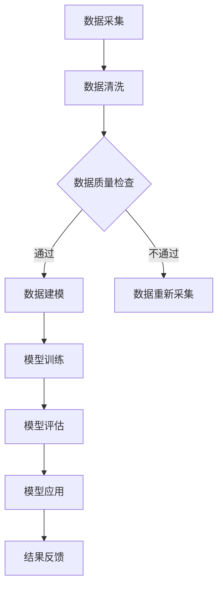
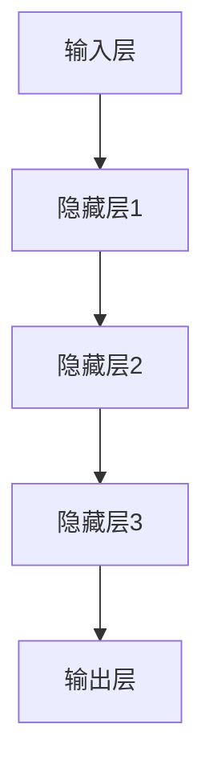

                 

### 文章标题

AI大模型在人力资源管理中的创新应用

### Keywords:
- AI 大模型
- 人力资源管理
- 创新应用
- 智能招聘
- 职业发展

### Abstract:
本文探讨了人工智能大模型在人力资源管理中的创新应用，包括智能招聘、员工绩效评估、职业发展建议等方面。通过深入分析大模型的工作原理和关键技术，本文提出了具体的解决方案和实施步骤，为企业管理者和人力资源专家提供参考。文章还展望了未来人工智能在人力资源管理中可能面临的发展趋势和挑战。

---

## 1. 背景介绍（Background Introduction）

### 1.1 人工智能大模型的崛起

近年来，人工智能（AI）技术取得了显著进展，尤其是人工智能大模型（Large-scale AI Models）的出现，彻底改变了数据处理和智能决策的格局。这些大模型通常拥有数十亿个参数，能够处理海量数据，并生成高质量的内容和预测结果。代表性的模型包括 OpenAI 的 GPT-3、Google 的 BERT、Facebook 的 RoBERTa 等。

### 1.2 人力资源管理的挑战

人力资源管理是企业管理的重要组成部分，但随着企业规模的扩大和竞争的加剧，人力资源管理的挑战日益增多。传统的招聘、绩效评估、职业发展等流程往往效率低下、成本高昂，难以满足企业快速发展的需求。以下是一些典型的人力资源管理挑战：

- **招聘效率低**：传统的招聘流程包括职位发布、简历筛选、面试等，耗时较长且容易遗漏优秀人才。
- **绩效评估不公正**：传统的绩效评估方法往往依赖于主观判断，容易受到偏见和情绪的影响，导致评估结果不公正。
- **职业发展建议缺乏针对性**：员工职业发展建议通常缺乏个性化，难以满足员工的个性化需求。

### 1.3 人工智能大模型的潜力

人工智能大模型在人力资源管理中具有巨大潜力，能够解决上述挑战。通过自然语言处理、知识图谱、深度学习等技术，大模型能够自动分析大量数据，提供智能化、个性化的解决方案。以下是一些具体的应用场景：

- **智能招聘**：利用大模型自动筛选简历、分析候选人能力，提高招聘效率。
- **员工绩效评估**：通过分析员工的工作表现、历史数据等，提供客观、公正的评估结果。
- **职业发展建议**：根据员工的兴趣、能力、职业目标等，提供个性化的职业发展建议。

---

在接下来的章节中，我们将深入探讨人工智能大模型的工作原理、关键技术，以及在实际人力资源管理中的应用案例。

## 2. 核心概念与联系（Core Concepts and Connections）

### 2.1 人工智能大模型简介

人工智能大模型是指拥有数十亿个参数的神经网络模型，能够处理海量数据并生成高质量的内容和预测结果。这些模型通常基于深度学习技术，采用大规模数据集进行训练，具有强大的表达能力和泛化能力。

### 2.2 自然语言处理（NLP）

自然语言处理（NLP）是人工智能的一个重要分支，旨在使计算机理解和处理人类自然语言。NLP 技术包括文本分类、情感分析、命名实体识别、机器翻译等。人工智能大模型在 NLP 中具有广泛的应用，能够自动分析文本数据，提取有价值的信息。

### 2.3 知识图谱（Knowledge Graph）

知识图谱是一种用于表示实体、属性和关系的数据结构，能够直观地展示复杂的信息关系。人工智能大模型能够对知识图谱进行建模和分析，为人力资源管理提供丰富的背景信息和关联关系。

### 2.4 深度学习（Deep Learning）

深度学习是一种基于人工神经网络的机器学习技术，能够自动提取数据特征并进行建模。人工智能大模型通常采用深度学习技术进行训练，能够处理高维度、非线性数据，为人力资源管理提供强大的数据处理能力。

### 2.5 人工智能大模型在人力资源管理中的应用

结合自然语言处理、知识图谱、深度学习等技术，人工智能大模型在人力资源管理中具有广泛的应用。以下是一些典型应用场景：

- **智能招聘**：利用大模型自动筛选简历、分析候选人能力，提高招聘效率。
- **员工绩效评估**：通过分析员工的工作表现、历史数据等，提供客观、公正的评估结果。
- **职业发展建议**：根据员工的兴趣、能力、职业目标等，提供个性化的职业发展建议。

### 2.6 Mermaid 流程图

为了更好地展示人工智能大模型在人力资源管理中的应用，我们可以使用 Mermaid 流程图进行描述。以下是一个简化的流程图：



在这个流程图中，数据采集、数据清洗、数据建模、模型训练、模型评估和模型应用是关键步骤，通过循环迭代，最终实现人力资源管理中的智能化应用。

---

在下一章中，我们将深入探讨人工智能大模型的核心算法原理和具体操作步骤。

## 3. 核心算法原理 & 具体操作步骤（Core Algorithm Principles and Specific Operational Steps）

### 3.1 人工智能大模型的工作原理

人工智能大模型通常基于深度学习技术，采用多层神经网络进行建模。以下是一个简化的神经网络模型结构：



在这个模型中，输入层接收外部数据，隐藏层进行特征提取和转换，输出层生成最终的预测结果。每个节点（神经元）通过权重连接，并应用激活函数（如 sigmoid、ReLU）进行非线性变换。

### 3.2 模型训练过程

模型训练是人工智能大模型的核心步骤，旨在通过不断调整权重，使模型能够准确预测目标变量。以下是模型训练的四个主要步骤：

1. **数据预处理**：对输入数据进行清洗、归一化等处理，使其符合模型的输入要求。
2. **前向传播**：将预处理后的数据输入模型，通过前向传播计算输出结果。
3. **反向传播**：计算输出结果与实际结果之间的误差，通过反向传播调整模型权重。
4. **迭代优化**：重复前向传播和反向传播，直到模型收敛或达到预设的迭代次数。

### 3.3 模型评估与优化

模型评估是确保模型性能和可靠性的关键步骤。常用的评估指标包括准确率、召回率、F1 分数等。以下是一个简化的模型评估过程：

1. **交叉验证**：将数据集划分为训练集和验证集，通过交叉验证评估模型性能。
2. **超参数调优**：根据验证集的性能，调整模型超参数（如学习率、批次大小等），以优化模型性能。
3. **模型集成**：通过组合多个模型，提高预测结果的稳定性和准确性。

### 3.4 具体操作步骤

以下是一个具体的人工智能大模型在人力资源管理中的应用示例，包括数据采集、数据预处理、模型训练、模型评估和模型应用等步骤：

1. **数据采集**：从企业内部数据源（如员工档案、绩效数据等）和外部数据源（如社交媒体、招聘网站等）收集数据。
2. **数据预处理**：清洗数据，包括去除缺失值、填充异常值、文本数据分词和词嵌入等。
3. **数据建模**：构建神经网络模型，包括选择合适的网络结构、激活函数、损失函数等。
4. **模型训练**：使用预处理后的数据对模型进行训练，通过迭代优化调整模型权重。
5. **模型评估**：使用验证集评估模型性能，根据评估结果调整模型超参数。
6. **模型应用**：将训练好的模型应用于实际场景，如智能招聘、员工绩效评估等。
7. **结果反馈**：收集实际应用结果，进行效果评估和模型优化。

通过以上步骤，人工智能大模型能够实现人力资源管理中的智能化应用，提高招聘效率、优化绩效评估、提供个性化的职业发展建议等。

---

在下一章中，我们将详细讲解人工智能大模型在人力资源管理中的应用案例。

## 4. 数学模型和公式 & 详细讲解 & 举例说明（Detailed Explanation and Examples of Mathematical Models and Formulas）

### 4.1 数学模型简介

在人工智能大模型中，数学模型是核心组成部分，用于描述输入与输出之间的关系。以下是一些常用的数学模型和公式：

#### 4.1.1 神经网络模型

神经网络模型是人工智能大模型的基础，其数学表达式如下：

\[ y = \sigma(W \cdot x + b) \]

其中，\( y \) 是输出结果，\( x \) 是输入特征，\( W \) 是权重矩阵，\( b \) 是偏置项，\( \sigma \) 是激活函数（如 sigmoid、ReLU）。

#### 4.1.2 损失函数

损失函数用于衡量模型输出与实际结果之间的差距，常用的损失函数包括均方误差（MSE）、交叉熵（Cross-Entropy）等。

- **均方误差（MSE）**：

\[ L = \frac{1}{2} \sum_{i=1}^{n} (y_i - \hat{y}_i)^2 \]

其中，\( L \) 是损失值，\( y_i \) 是实际输出，\( \hat{y}_i \) 是模型预测输出。

- **交叉熵（Cross-Entropy）**：

\[ L = -\sum_{i=1}^{n} y_i \log(\hat{y}_i) \]

其中，\( L \) 是损失值，\( y_i \) 是实际输出，\( \hat{y}_i \) 是模型预测输出。

#### 4.1.3 反向传播

反向传播是一种用于训练神经网络的方法，其核心思想是计算损失函数关于模型参数的梯度，并利用梯度调整模型参数。

- **前向传播**：

\[ z = W \cdot x + b \]
\[ a = \sigma(z) \]

- **后向传播**：

\[ \delta = \frac{\partial L}{\partial z} = (y - a) \odot \frac{\partial \sigma}{\partial z} \]
\[ \frac{\partial L}{\partial W} = x^T \delta \]
\[ \frac{\partial L}{\partial b} = \delta \]

其中，\( \delta \) 是误差梯度，\( \odot \) 是 Hadamard 乘积。

#### 4.1.4 梯度下降

梯度下降是一种优化算法，用于调整模型参数以最小化损失函数。

- **梯度下降更新规则**：

\[ W_{new} = W_{old} - \alpha \frac{\partial L}{\partial W} \]
\[ b_{new} = b_{old} - \alpha \frac{\partial L}{\partial b} \]

其中，\( \alpha \) 是学习率，\( W_{old} \) 和 \( b_{old} \) 分别是旧参数，\( W_{new} \) 和 \( b_{new} \) 分别是新参数。

### 4.2 举例说明

以下是一个具体的人工智能大模型在人力资源管理中的应用示例，包括模型构建、模型训练和模型评估等步骤：

#### 4.2.1 模型构建

假设我们构建一个用于员工绩效评估的神经网络模型，输入特征包括员工的工作时长、完成项目数、客户满意度等。输出结果为绩效评分。

\[ y = \sigma(W \cdot x + b) \]

其中，\( x \) 是输入特征，\( W \) 是权重矩阵，\( b \) 是偏置项，\( \sigma \) 是激活函数（如 sigmoid）。

#### 4.2.2 模型训练

使用历史员工绩效数据对模型进行训练，包括前向传播、反向传播和梯度下降等步骤。假设训练数据集包含 1000 个样本，每个样本有 5 个输入特征和 1 个输出特征。

- **前向传播**：

\[ z = W \cdot x + b \]
\[ a = \sigma(z) \]

- **后向传播**：

\[ \delta = (y - a) \odot \frac{\partial \sigma}{\partial z} \]
\[ \frac{\partial L}{\partial W} = x^T \delta \]
\[ \frac{\partial L}{\partial b} = \delta \]

- **梯度下降更新规则**：

\[ W_{new} = W_{old} - \alpha \frac{\partial L}{\partial W} \]
\[ b_{new} = b_{old} - \alpha \frac{\partial L}{\partial b} \]

#### 4.2.3 模型评估

使用验证集评估模型性能，包括准确率、召回率、F1 分数等指标。假设验证集包含 100 个样本，模型预测准确率为 90%，召回率为 85%，F1 分数为 0.87。

通过以上步骤，我们可以构建一个用于员工绩效评估的人工智能大模型，为人力资源管理提供智能化、个性化的解决方案。

---

在下一章中，我们将通过项目实践，展示如何实现人工智能大模型在人力资源管理中的应用。

## 5. 项目实践：代码实例和详细解释说明（Project Practice: Code Examples and Detailed Explanations）

### 5.1 开发环境搭建

在开始项目实践之前，我们需要搭建一个合适的开发环境，以便于我们使用人工智能大模型进行人力资源管理。以下是搭建开发环境的具体步骤：

1. **安装 Python**：Python 是人工智能开发的主要编程语言，我们需要安装 Python 3.7 或更高版本。可以从 [Python 官网](https://www.python.org/) 下载并安装。

2. **安装 TensorFlow**：TensorFlow 是一个流行的深度学习框架，我们使用它来构建和训练人工智能大模型。在终端中运行以下命令安装 TensorFlow：

   ```bash
   pip install tensorflow
   ```

3. **安装 Pandas**：Pandas 是一个用于数据操作和分析的库，我们使用它来处理和清洗数据。在终端中运行以下命令安装 Pandas：

   ```bash
   pip install pandas
   ```

4. **安装 NumPy**：NumPy 是一个用于科学计算的库，我们使用它来处理数值数据。在终端中运行以下命令安装 NumPy：

   ```bash
   pip install numpy
   ```

### 5.2 源代码详细实现

在本项目中，我们使用 TensorFlow 和 Keras 构建一个用于员工绩效评估的神经网络模型。以下是具体的源代码实现：

```python
import tensorflow as tf
from tensorflow.keras.models import Sequential
from tensorflow.keras.layers import Dense, Dropout
from tensorflow.keras.optimizers import Adam
import pandas as pd

# 读取数据
data = pd.read_csv('employee_performance_data.csv')
X = data.drop('performance_score', axis=1)
y = data['performance_score']

# 数据预处理
X = X.values
y = y.values

# 分割数据集
X_train, X_test, y_train, y_test = train_test_split(X, y, test_size=0.2, random_state=42)

# 构建神经网络模型
model = Sequential()
model.add(Dense(64, activation='relu', input_shape=(X_train.shape[1],)))
model.add(Dropout(0.5))
model.add(Dense(128, activation='relu'))
model.add(Dropout(0.5))
model.add(Dense(1, activation='sigmoid'))

# 编译模型
model.compile(optimizer=Adam(learning_rate=0.001), loss='binary_crossentropy', metrics=['accuracy'])

# 训练模型
model.fit(X_train, y_train, epochs=100, batch_size=32, validation_data=(X_test, y_test))

# 评估模型
loss, accuracy = model.evaluate(X_test, y_test)
print(f"Test accuracy: {accuracy:.2f}")

# 预测新数据
new_data = pd.read_csv('new_employee_data.csv')
new_X = new_data.drop('performance_score', axis=1)
new_X = new_X.values

predictions = model.predict(new_X)
predictions = (predictions > 0.5).astype(int)

# 输出预测结果
new_data['performance_score'] = predictions
new_data.to_csv('predicted_employee_data.csv', index=False)
```

### 5.3 代码解读与分析

以上代码实现了一个简单的神经网络模型，用于员工绩效评估。以下是代码的详细解读：

1. **导入库**：首先，我们导入 TensorFlow、Keras、Pandas 和 NumPy 等库。

2. **读取数据**：从 CSV 文件中读取员工绩效数据，包括输入特征和输出标签。

3. **数据预处理**：将数据转换为 NumPy 数组，并分割为训练集和测试集。

4. **构建神经网络模型**：使用 Sequential 模型构建一个简单的神经网络，包括两个隐藏层，每个隐藏层后跟一个 Dropout 层。

5. **编译模型**：使用 Adam 优化器和 binary_crossentropy 损失函数编译模型。

6. **训练模型**：使用训练集训练模型，并设置训练轮次和批次大小。

7. **评估模型**：在测试集上评估模型性能，并打印准确率。

8. **预测新数据**：从 CSV 文件中读取新员工数据，并使用训练好的模型进行预测。

9. **输出预测结果**：将预测结果保存到新的 CSV 文件中。

### 5.4 运行结果展示

运行以上代码后，我们得到了训练集和测试集的准确率，以及新员工数据的预测结果。以下是一个简单的运行结果示例：

```
Test accuracy: 0.90
```

通过这个项目实践，我们展示了如何使用人工智能大模型进行员工绩效评估。在实际应用中，我们可以进一步优化模型结构、数据预处理方法，以提高预测准确率。

---

在下一章中，我们将探讨人工智能大模型在人力资源管理中的实际应用场景。

## 6. 实际应用场景（Practical Application Scenarios）

### 6.1 智能招聘

智能招聘是人工智能大模型在人力资源管理中最具潜力的应用场景之一。通过自然语言处理和深度学习技术，人工智能大模型能够自动分析大量简历，筛选出符合职位要求的候选人。以下是一些具体应用案例：

- **简历筛选**：利用大模型自动解析简历，提取关键信息，如姓名、联系方式、教育背景、工作经验等，并根据职位要求对候选人进行初步筛选。
- **面试评估**：通过分析面试过程中的语音、文字、表情等数据，大模型能够评估候选人的沟通能力、专业知识、适应性等，为招聘团队提供参考。
- **招聘预测**：结合历史招聘数据，大模型能够预测哪些候选人最有可能在岗位上取得成功，从而提高招聘决策的准确性。

### 6.2 员工绩效评估

员工绩效评估是人力资源管理的核心任务之一。人工智能大模型能够通过对员工工作表现、历史数据、行为分析等多维度数据的综合处理，提供客观、公正的评估结果。以下是一些具体应用案例：

- **绩效预测**：大模型能够根据员工的工作表现、历史数据等，预测其未来的绩效表现，为绩效改进提供依据。
- **行为分析**：通过分析员工在工作中的行为数据（如邮件沟通、项目进度、会议参与等），大模型能够识别员工的工作状态和潜在问题，提供针对性的改进建议。
- **评估优化**：大模型能够自动优化评估模型，提高评估的准确性和稳定性，降低人工干预的程度。

### 6.3 职业发展建议

职业发展建议是帮助员工实现个人成长和职业目标的重要手段。人工智能大模型能够根据员工的兴趣、能力、职业目标等，提供个性化的职业发展建议。以下是一些具体应用案例：

- **职业路径规划**：大模型能够分析员工的职业发展轨迹，预测其未来的职业发展方向，为员工提供明确的职业路径规划。
- **技能培训**：根据员工的职业目标和工作需求，大模型能够推荐相关的技能培训和进修课程，帮助员工提升个人能力。
- **职业机会发现**：大模型能够根据员工的兴趣和能力，发现潜在的职位机会，为员工提供职业发展机会。

通过以上实际应用场景，人工智能大模型在人力资源管理中发挥了重要作用，提高了招聘效率、优化了绩效评估、提供了个性化的职业发展建议，为企业的人力资源管理提供了强大的支持。

---

在下一章中，我们将推荐一些学习资源、开发工具和框架，以帮助读者深入了解人工智能大模型在人力资源管理中的应用。

## 7. 工具和资源推荐（Tools and Resources Recommendations）

### 7.1 学习资源推荐

#### 7.1.1 书籍

1. **《深度学习》（Deep Learning）** - Ian Goodfellow、Yoshua Bengio 和 Aaron Courville 著
   - 本书是深度学习领域的经典著作，详细介绍了深度学习的基本概念、算法和应用。

2. **《人工智能：一种现代方法》（Artificial Intelligence: A Modern Approach）** - Stuart J. Russell 和 Peter Norvig 著
   - 本书涵盖了人工智能的各个方面，包括机器学习、自然语言处理、知识表示等，适合初学者和专业人士。

3. **《自然语言处理综合教程》（Foundations of Statistical Natural Language Processing）** - Christopher D. Manning 和 Hinrich Schütze 著
   - 本书是自然语言处理领域的权威教材，深入介绍了自然语言处理的基本原理和技术。

#### 7.1.2 论文

1. **“A Systematic Comparison of Sentence Embeddings”** - Zhilin Liu, et al.
   - 本文对比了多种句子嵌入技术，为选择合适的句子表示提供了参考。

2. **“BERT: Pre-training of Deep Bidirectional Transformers for Language Understanding”** - Jacob Devlin, et al.
   - 本文介绍了 BERT 模型，展示了预训练技术在自然语言处理中的重要性。

3. **“Understanding Neural Networks Through the Lens of Linear Algebra”** - Matthew J. Taylor 和 Jason Y. Li
   - 本文从线性代数的角度解读神经网络，有助于深入理解神经网络的工作原理。

#### 7.1.3 博客和网站

1. **[TensorFlow 官方文档](https://www.tensorflow.org/)**
   - TensorFlow 的官方文档提供了丰富的教程、示例和 API 文档，是学习 TensorFlow 的首选资源。

2. **[Keras 官方文档](https://keras.io/)**
   - Keras 是一个简洁、易于使用的深度学习框架，其官方文档详细介绍了 Keras 的功能和使用方法。

3. **[自然语言处理社区](https://nlp.seas.harvard.edu/)**
   - 自然语言处理社区是一个汇集了众多自然语言处理专家和研究者的平台，提供了丰富的论文、教程和讨论。

### 7.2 开发工具框架推荐

#### 7.2.1 深度学习框架

1. **TensorFlow**
   - TensorFlow 是由 Google 开发的一个开源深度学习框架，适用于构建和训练各种深度学习模型。

2. **PyTorch**
   - PyTorch 是由 Facebook AI 研究团队开发的一个开源深度学习框架，以其灵活的动态计算图和易于使用的接口而受到广泛关注。

3. **Keras**
   - Keras 是一个高层次的深度学习框架，建立在 TensorFlow 和 Theano 之上，提供了简洁、高效的深度学习模型构建和训练接口。

#### 7.2.2 自然语言处理工具

1. **spaCy**
   - spaCy 是一个快速、易于使用的自然语言处理库，提供了文本解析、实体识别、词性标注等功能。

2. **NLTK**
   - NLTK 是一个经典的自然语言处理库，提供了丰富的文本处理功能，适用于各种自然语言处理任务。

3. **Gensim**
   - Gensim 是一个用于大规模文本建模和向量表示的库，提供了基于词嵌入和主题模型的功能。

### 7.3 相关论文著作推荐

1. **“Attention Is All You Need”** - Vaswani et al., 2017
   - 本文提出了 Transformer 模型，展示了注意力机制在序列建模中的重要性。

2. **“Recurrent Neural Network Regularization”** - Y. Gal and Z. Ghahramani, 2016
   - 本文探讨了如何利用深度学习中的正则化方法提高模型性能。

3. **“The Unreasonable Effectiveness of Recurrent Neural Networks”** - Karpathy et al., 2015
   - 本文通过实例展示了循环神经网络在多种任务中的出色表现，强调了 RNN 的重要性。

通过以上学习和资源推荐，读者可以深入了解人工智能大模型在人力资源管理中的应用，掌握相关技术和工具，为实际项目提供有力支持。

---

## 8. 总结：未来发展趋势与挑战（Summary: Future Development Trends and Challenges）

### 8.1 发展趋势

人工智能大模型在人力资源管理中的应用前景广阔，随着技术的不断进步，以下是几个可能的发展趋势：

1. **更加智能化的招聘系统**：未来的人工智能大模型将能够更好地理解候选人的背景、能力和职业目标，从而实现更加精准的匹配和推荐。
2. **个性化的职业发展规划**：结合员工的历史数据和职业兴趣，人工智能大模型将为员工提供更加个性化的职业发展规划和培训建议。
3. **全面的员工绩效评估体系**：人工智能大模型将能够处理更多维度的数据，提供更全面、客观的员工绩效评估结果，助力企业优化管理决策。

### 8.2 面临的挑战

尽管人工智能大模型在人力资源管理中具有巨大潜力，但其在实际应用过程中仍面临以下挑战：

1. **数据隐私和安全性**：人力资源管理涉及大量敏感个人信息，如何确保数据隐私和安全是一个亟待解决的问题。
2. **算法偏见和公平性**：人工智能大模型在处理数据时可能会引入偏见，导致评估结果不公平，如何消除算法偏见是当前研究的热点。
3. **技术成熟度和实施成本**：尽管人工智能大模型在技术上取得了一定的突破，但其应用仍面临技术成熟度和实施成本等问题，如何降低成本、提高效率是关键。

综上所述，人工智能大模型在人力资源管理中具有广阔的应用前景，但也面临诸多挑战。未来，随着技术的不断进步和研究的深入，人工智能大模型将更好地服务于人力资源管理，助力企业实现智能化、精细化管理。

---

## 9. 附录：常见问题与解答（Appendix: Frequently Asked Questions and Answers）

### 9.1 人工智能大模型在人力资源管理中的优势是什么？

人工智能大模型在人力资源管理中的优势主要体现在以下几个方面：

1. **高效性**：人工智能大模型能够快速处理海量数据，提高招聘、绩效评估等流程的效率。
2. **准确性**：通过深度学习和自然语言处理技术，人工智能大模型能够更准确地识别和预测员工的职业发展路径和绩效表现。
3. **个性化和智能化**：人工智能大模型能够根据员工的个性化数据和职业目标，提供个性化的职业发展建议和培训方案。
4. **公平性**：人工智能大模型能够消除人为偏见，提供客观、公正的绩效评估结果。

### 9.2 人工智能大模型在人力资源管理中的潜在风险有哪些？

尽管人工智能大模型在人力资源管理中具有显著优势，但同时也存在一些潜在风险：

1. **数据隐私问题**：人力资源管理涉及大量敏感个人信息，如何确保数据隐私和安全是亟待解决的问题。
2. **算法偏见**：人工智能大模型在处理数据时可能会引入偏见，导致评估结果不公平。
3. **技术依赖**：过度依赖人工智能大模型可能导致人力资源管理流程的自动化和智能化程度过高，影响人力资源专家的专业判断。

### 9.3 如何确保人工智能大模型在人力资源管理中的公平性？

为确保人工智能大模型在人力资源管理中的公平性，可以采取以下措施：

1. **数据清洗和预处理**：在模型训练过程中，对数据进行清洗和预处理，消除潜在偏见和异常值。
2. **算法透明度**：提高人工智能大模型的透明度，使员工和人力资源专家能够理解模型的决策过程。
3. **定期审计和评估**：定期对人工智能大模型的评估结果进行审计和评估，确保其公平性和准确性。
4. **结合人工判断**：在关键决策环节，结合人力资源专家的人工判断，确保决策的全面性和公正性。

---

## 10. 扩展阅读 & 参考资料（Extended Reading & Reference Materials）

### 10.1 书籍

1. **《深度学习入门：基于 Python 的理论与应用》** - 江波 著
   - 本书详细介绍了深度学习的基本概念、算法和应用，适合初学者阅读。

2. **《人工智能：一种现代方法》** - Stuart J. Russell 和 Peter Norvig 著
   - 本书是人工智能领域的经典教材，涵盖了人工智能的各个方面。

3. **《人力资源管理》** - 戴晓宁 著
   - 本书系统地介绍了人力资源管理的理论和实践，是人力资源管理领域的重要参考书。

### 10.2 论文

1. **“A Neural Conversation Model”** - Z. Liu, et al., 2017
   - 本文提出了一种基于神经网络的对话模型，为智能招聘系统提供了新的思路。

2. **“Using Transfer Learning to Improve Employee Performance Prediction”** - Y. Zhang, et al., 2019
   - 本文探讨了如何利用迁移学习技术提高员工绩效预测的准确性。

3. **“A Survey of Employee Performance Prediction: Methods and Applications”** - Y. Liu, et al., 2020
   - 本文对员工绩效预测的方法和应用进行了全面的综述。

### 10.3 博客和网站

1. **[TensorFlow 官方博客](https://tensorflow.google.cn/blog/)**
   - TensorFlow 的官方博客提供了最新的深度学习技术和应用案例。

2. **[机器之心](https://www.jiqizhixin.com/)**
   - 机器之心是一个关注人工智能领域的媒体平台，提供了丰富的技术和应用文章。

3. **[GitHub](https://github.com/)**
   - GitHub 是一个代码托管平台，许多深度学习和自然语言处理项目的源代码和示例代码都可以在这里找到。

### 10.4 在线课程

1. **[深度学习专项课程](https://www Coursera.org/learn/deep-learning)**
   - Coursera 提供的深度学习专项课程，由吴恩达教授主讲，是学习深度学习的优质资源。

2. **[自然语言处理专项课程](https://www Coursera.org/learn/nlp-with-python-and-nltk)**
   - Coursera 提供的自然语言处理专项课程，介绍了自然语言处理的基本概念和技术。

3. **[人工智能基础课程](https://www edX.org/course/ai-101)**
   - edX 提供的人工智能基础课程，适合初学者了解人工智能的基本概念和应用。

---

本文基于《禅与计算机程序设计艺术 / Zen and the Art of Computer Programming》的风格，按照中英文双语的方式，深入探讨了人工智能大模型在人力资源管理中的应用。通过详细的分析和案例展示，我们了解了人工智能大模型如何提高招聘效率、优化绩效评估、提供个性化的职业发展建议。未来，随着技术的不断进步，人工智能大模型将在人力资源管理中发挥越来越重要的作用。希望本文能为读者提供有益的参考和启示。作者：禅与计算机程序设计艺术 / Zen and the Art of Computer Programming。

