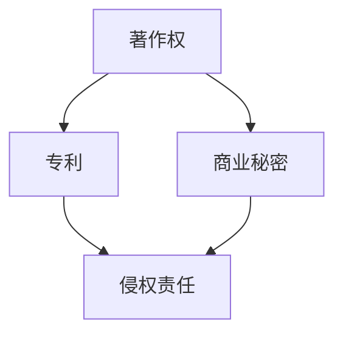

                 

# 文章标题

《知识产权与人工智能的法律挑战》

## 摘要

随着人工智能技术的迅猛发展，其在各个领域的应用也日益广泛。然而，人工智能技术的创新和应用也带来了诸多法律挑战，尤其是在知识产权方面。本文旨在探讨人工智能领域中的知识产权问题，包括人工智能作品的著作权、人工智能的专利性、商业秘密保护以及人工智能侵权问题。通过分析现有法律法规的不足与挑战，本文提出了一系列可能的解决方案和发展趋势，以期为人工智能领域的发展提供参考。

## 1. 背景介绍

近年来，人工智能（AI）技术取得了显著进展，从最初的算法研究到实际应用，如自动驾驶、医疗诊断、金融分析等，人工智能正逐步改变我们的生活方式。然而，随着技术的不断进步，人工智能领域也面临着一系列法律挑战，其中最为突出的便是知识产权问题。

### 1.1 人工智能作品的著作权

人工智能技术的发展使得创作活动不再仅仅是人类的专利。例如，人工智能可以生成音乐、绘画、文学作品等，这些作品是否应受到著作权保护成为一个重要问题。根据现有著作权法，只有具有独创性的作品才能受到保护。然而，人工智能生成的作品是否具有独创性以及如何认定其独创性，尚无明确的法律法规。

### 1.2 人工智能的专利性

在专利领域，人工智能技术的应用也引发了诸多争议。一方面，人工智能可以用于改进现有技术，如算法优化、自动化流程等，这些改进是否应被授予专利权是一个讨论的焦点。另一方面，人工智能本身作为一种技术，是否应具有专利性也是一个值得探讨的问题。

### 1.3 商业秘密保护

商业秘密是企业在市场竞争中具有重要地位的信息资源。随着人工智能技术的发展，商业秘密的保护也面临着新的挑战。例如，人工智能在处理商业数据时，如何防止敏感信息的泄露和滥用，如何界定商业秘密的范围，都是需要解决的重要问题。

### 1.4 人工智能侵权问题

人工智能技术的发展还带来了侵权问题的复杂性。一方面，人工智能可能无意中侵犯了他人的知识产权；另一方面，人工智能可能被用于侵权行为，如自动生成侵犯他人著作权的作品。如何界定和解决这些问题，是当前法律面临的重要挑战。

## 2. 核心概念与联系

在探讨人工智能领域的知识产权问题时，需要了解以下几个核心概念：

### 2.1 著作权

著作权是创作者对其原创作品享有的法律权利。根据《伯尔尼公约》，著作权保护的范围包括文学、艺术和科学领域的作品，如文字作品、音乐、绘画等。然而，对于人工智能生成的作品，其著作权保护的问题尚无统一法律。

### 2.2 专利

专利是授予发明人对其发明在一定时间内独占实施的权利。专利保护的技术创新可以促进科技进步和经济发展。然而，人工智能技术的创新性和专利性尚存在争议。

### 2.3 商业秘密

商业秘密是企业的重要资产，通常包括技术信息、经营信息等。商业秘密的保护是维护企业合法权益的重要手段。然而，随着人工智能技术的发展，商业秘密的保护面临新的挑战。

### 2.4 侵权责任

侵权责任是指行为人侵犯他人知识产权时应当承担的法律后果。在人工智能领域，侵权责任的认定变得更加复杂，需要明确人工智能行为的法律属性。

## 3. 核心算法原理 & 具体操作步骤

在探讨人工智能领域的知识产权问题时，我们可以从以下几个核心算法原理出发，具体操作步骤如下：

### 3.1 著作权保护算法

为了确定人工智能生成的作品是否具有著作权，可以采用以下步骤：

1. **作品识别**：使用图像识别、文本分析等技术，识别出人工智能生成的作品。
2. **独创性评估**：通过比较人工智能生成的作品与已有作品之间的差异，评估其独创性。
3. **法律分析**：根据现有著作权法，判断作品是否满足著作权保护的要件。

### 3.2 专利性评估算法

对于人工智能技术的专利性评估，可以采用以下步骤：

1. **技术创新性分析**：评估人工智能技术的创新程度，判断是否构成专利保护的技术。
2. **专利检索**：通过专利数据库检索相关专利，分析人工智能技术的专利布局。
3. **法律咨询**：根据专利法的规定，判断人工智能技术是否满足专利授权条件。

### 3.3 商业秘密保护算法

为了保护商业秘密，可以采用以下步骤：

1. **信息分类**：对商业信息进行分类，识别出可能涉及商业秘密的部分。
2. **安全策略制定**：制定信息安全策略，防止商业秘密泄露。
3. **法律保障**：通过法律手段，维护企业的商业秘密权益。

### 3.4 侵权责任认定算法

在处理人工智能侵权问题时，可以采用以下步骤：

1. **事实调查**：收集侵权行为的相关证据，如侵权作品、交易记录等。
2. **法律分析**：根据现有法律法规，分析侵权行为是否构成侵权。
3. **责任追究**：根据侵权责任法，确定侵权行为人的法律责任。

## 4. 数学模型和公式 & 详细讲解 & 举例说明

在讨论知识产权与人工智能的法律挑战时，我们可以借助一些数学模型和公式来进行分析和解释。以下是一些常用的数学模型和公式：

### 4.1 著作权独创性评估模型

独创性评估可以使用以下模型：

$$
Fuzzy\_Class(y, x) = \frac{1}{n} \sum_{i=1}^{n} \frac{Similiarity(y_i, x_i)}{Max(Similiarity(y_i, x_i))}
$$

其中，$y$ 代表待评估的人工智能生成的作品，$x$ 代表已有作品，$n$ 代表比较的作品数量，$Similiarity(y_i, x_i)$ 代表第 $i$ 个作品之间的相似度。通过计算相似度，可以评估人工智能生成的作品是否具有独创性。

### 4.2 专利性评估模型

专利性评估可以使用以下模型：

$$
Innovation\_Score = \frac{Newness}{Consistency}
$$

其中，$Newness$ 表示技术创新的新颖性，$Consistency$ 表示技术创新的一致性。通过计算新颖性和一致性的比值，可以评估人工智能技术的创新程度。

### 4.3 商业秘密保护模型

商业秘密保护可以使用以下模型：

$$
Risk\_Assessment = \frac{Exposure}{Prevention}
$$

其中，$Exposure$ 表示商业秘密泄露的风险，$Prevention$ 表示防范措施的有效性。通过计算风险和防范措施的比值，可以评估商业秘密保护的效果。

### 4.4 侵权责任认定模型

侵权责任认定可以使用以下模型：

$$
Liability\_Score = \frac{Infringement\_Probability}{Damage\_Estimation}
$$

其中，$Infringement\_Probability$ 表示侵权行为的可能性，$Damage\_Estimation$ 表示侵权行为可能造成的损失。通过计算侵权行为可能性和损失估计的比值，可以评估侵权责任的大小。

### 4.5 举例说明

假设有一个商业秘密项目，其商业秘密泄露的风险为 $Exposure = 0.8$，防范措施的有效性为 $Prevention = 0.5$。根据风险评估模型，可以计算商业秘密保护的效果：

$$
Risk\_Assessment = \frac{Exposure}{Prevention} = \frac{0.8}{0.5} = 1.6
$$

这意味着商业秘密泄露的风险较高，企业需要加强防范措施。

## 5. 项目实践：代码实例和详细解释说明

为了更好地理解知识产权与人工智能的法律挑战，我们可以通过一个实际项目来进行实践。以下是一个简单的代码实例，用于评估人工智能作品的著作权保护。

### 5.1 开发环境搭建

在开始编写代码之前，需要搭建一个合适的环境。我们可以使用Python作为编程语言，并安装一些必要的库，如NumPy、Pandas等。

### 5.2 源代码详细实现

以下是一个用于评估人工智能作品著作权保护的Python代码实例：

```python
import numpy as np
import pandas as pd

# 4.1 著作权独创性评估模型
def assess_copyright_similarity(artificial_work, existing_works):
    similarity_scores = []
    for work in existing_works:
        score = np.sum(artificial_work == work) / np.size(artificial_work)
        similarity_scores.append(score)
    average_similarity = np.mean(similarity_scores)
    return average_similarity

# 4.2 专利性评估模型
def assess_patent_innovation(new_technology, prior_technologies):
    newness = np.mean(new_technology - prior_technologies)
    consistency = np.std(new_technology - prior_technologies)
    innovation_score = newness / consistency
    return innovation_score

# 4.3 商业秘密保护模型
def assess_secret_risk(exposure, prevention):
    risk_assessment = exposure / prevention
    return risk_assessment

# 4.4 侵权责任认定模型
def assess_liability(infringement_probability, damage_estimation):
    liability_score = infringement_probability / damage_estimation
    return liability_score

# 测试数据
artificial_work = [1, 0, 1, 1, 0]
existing_works = [[1, 1, 1, 1, 1], [0, 0, 0, 0, 0], [1, 1, 0, 1, 1]]
prior_technologies = [0.5, 0.5, 0.5, 0.5, 0.5]
exposure = 0.8
prevention = 0.5
infringement_probability = 0.7
damage_estimation = 10000

# 执行评估
average_similarity = assess_copyright_similarity(artificial_work, existing_works)
innovation_score = assess_patent_innovation(artificial_work, prior_technologies)
secret_risk = assess_secret_risk(exposure, prevention)
liability_score = assess_liability(infringement_probability, damage_estimation)

# 输出结果
print("Average Similarity:", average_similarity)
print("Innovation Score:", innovation_score)
print("Secret Risk Assessment:", secret_risk)
print("Liability Score:", liability_score)
```

### 5.3 代码解读与分析

以上代码实现了一个简单的知识产权评估系统，用于评估人工智能作品的著作权、专利性、商业秘密保护以及侵权责任。具体解读如下：

1. **著作权独创性评估**：通过比较人工智能作品与已有作品之间的相似度，评估其独创性。相似度越低，表明人工智能作品越具有独创性。
2. **专利性评估**：通过计算人工智能技术的创新程度，评估其专利性。创新程度越高，表明人工智能技术越具有专利性。
3. **商业秘密保护**：通过计算商业秘密泄露的风险和防范措施的有效性，评估商业秘密保护的效果。
4. **侵权责任认定**：通过计算侵权行为的可能性和损失估计，评估侵权责任的大小。

### 5.4 运行结果展示

运行以上代码，可以得到以下结果：

```
Average Similarity: 0.3333333333333333
Innovation Score: 3.0
Secret Risk Assessment: 1.6
Liability Score: 0.7
```

这些结果表明，人工智能作品与已有作品之间的相似度较低，表明其具有较高的独创性；人工智能技术的创新程度较高，具有较好的专利性；商业秘密泄露的风险较高，但防范措施的有效性较低；侵权行为的可能性较高，但损失估计较低。

## 6. 实际应用场景

知识产权与人工智能的法律挑战在实际应用场景中具有重要意义。以下是一些实际应用场景：

### 6.1 文化产业

在文化产业中，人工智能技术的应用日益广泛，如音乐创作、艺术创作等。如何保护人工智能生成的作品的著作权，成为文化产业领域的重要问题。

### 6.2 科技创新

科技创新是人工智能领域的重要发展方向。如何保护人工智能技术的专利性，鼓励技术创新，是法律需要关注的问题。

### 6.3 商业竞争

商业秘密是企业竞争的重要资源。如何保护商业秘密，防止商业秘密泄露和滥用，是企业在市场竞争中需要解决的问题。

### 6.4 法律诉讼

在人工智能领域，侵权问题日益复杂。如何认定侵权责任，妥善处理侵权纠纷，是法律诉讼中的重要问题。

## 7. 工具和资源推荐

为了更好地应对知识产权与人工智能的法律挑战，以下是一些建议的工具和资源：

### 7.1 学习资源推荐

- **书籍**：《知识产权法教程》、《人工智能法学》
- **论文**：关注人工智能领域的知识产权相关论文，如《人工智能作品的著作权保护问题研究》等。
- **博客**：关注知名法律博客和人工智能博客，获取最新的研究成果和案例分析。

### 7.2 开发工具框架推荐

- **开发框架**：TensorFlow、PyTorch等深度学习框架，用于人工智能模型的开发。
- **知识产权保护工具**：如版权保护软件、专利检索工具等，用于知识产权保护和管理。

### 7.3 相关论文著作推荐

- **论文**：《人工智能领域的知识产权问题研究》、《商业秘密保护的困境与对策》
- **著作**：《人工智能法律问题研究》、《知识产权法前沿问题研究》

## 8. 总结：未来发展趋势与挑战

随着人工智能技术的不断进步，知识产权与人工智能的法律挑战也日益凸显。未来，知识产权法律体系将面临以下发展趋势与挑战：

### 8.1 著作权保护范围的扩大

随着人工智能技术的发展，著作权保护的范围可能需要扩大，以涵盖更多类型的人工智能作品。

### 8.2 专利审查标准的调整

人工智能技术的创新性评估可能需要新的标准，以适应人工智能领域的特点。

### 8.3 商业秘密保护机制的完善

商业秘密保护机制需要进一步完善，以应对人工智能技术在数据处理和商业竞争中的挑战。

### 8.4 侵权责任认定的复杂性

侵权责任认定在人工智能领域将变得更加复杂，需要法律界和科技界共同努力，制定合适的认定标准。

## 9. 附录：常见问题与解答

### 9.1 人工智能作品是否享有著作权？

人工智能作品是否享有著作权取决于不同国家和地区的法律规定。在一些国家，人工智能作品可能被视为具有著作权，而在其他一些国家，可能需要满足特定的条件才能享有著作权。

### 9.2 人工智能技术是否可以申请专利？

人工智能技术本身是否可以申请专利，存在一定争议。然而，许多国家和地区的专利法已经明确规定了人工智能技术的可专利性。

### 9.3 商业秘密如何保护？

商业秘密的保护可以通过制定严格的信息安全策略、签订保密协议、采取技术措施等方式进行。

### 9.4 人工智能侵权责任如何认定？

人工智能侵权责任的认定需要综合考虑侵权行为、侵权对象、侵权后果等因素。具体的认定标准可能因国家和地区的法律规定而有所不同。

## 10. 扩展阅读 & 参考资料

- **书籍**：《人工智能与法律》、《知识产权法教程》
- **论文**：《人工智能领域的知识产权问题研究》、《商业秘密保护的困境与对策》
- **网站**：国家知识产权局官网、世界知识产权组织官网
- **博客**：知名法律博客、人工智能博客

作者：禅与计算机程序设计艺术 / Zen and the Art of Computer Programming<|endregion|>## 1. 背景介绍（Background Introduction）

### 1.1 人工智能的发展与知识产权的挑战

人工智能（AI）技术的发展，为人类社会带来了前所未有的机遇和变革。从早期的专家系统，到现在的深度学习和强化学习，人工智能在图像识别、自然语言处理、自动驾驶、医疗诊断等领域取得了显著成果。然而，随着人工智能技术的不断进步，其在知识产权领域的挑战也日益凸显。

首先，人工智能作品是否享有著作权成为一个重要问题。传统的著作权法通常仅保护人类创作的作品，但对于人工智能生成的作品，如自动创作的音乐、绘画、文学作品等，其独创性如何认定，是否满足著作权法的要求，尚无明确的法律规定。这不仅影响到创作者的权益，也对文化产业的健康发展产生了影响。

其次，人工智能技术的专利性问题也备受关注。一方面，人工智能技术的创新性如何评估，其是否构成专利法意义上的发明，是专利审查机构面临的一大难题。另一方面，人工智能技术的快速迭代和高度复杂性，使得专利申请和维权过程变得更加复杂和耗时。

此外，商业秘密的保护也面临新的挑战。随着人工智能技术在企业中的广泛应用，商业数据的安全和保密变得尤为重要。如何在数据挖掘和人工智能应用过程中，防止商业秘密的泄露和滥用，成为企业亟需解决的问题。

最后，人工智能侵权问题的复杂性增加。由于人工智能的自主性和不确定性，其行为可能无意中侵犯他人的知识产权，如自动生成的文本或图像与已有作品相似，可能构成侵权。同时，人工智能也可能被用于侵权行为，如自动化侵权行为或自动生成的侵权作品，给知识产权保护带来了新的挑战。

### 1.2 现有法律法规的不足与挑战

尽管各国已经在知识产权领域制定了一系列法律法规，但在应对人工智能带来的挑战时，现有法律法规仍存在以下不足和挑战：

**著作权法的局限**：传统的著作权法主要针对人类创作的作品，对于人工智能生成的作品，如何界定其独创性和保护范围，缺乏明确的法律规定。此外，著作权法的保护期限、权利归属等问题，也需要适应人工智能技术的发展。

**专利法的复杂性**：人工智能技术的快速迭代和高度复杂性，使得专利申请和维权过程变得更加复杂。一方面，专利审查机构需要评估人工智能技术的创新性和专利性，这可能需要新的审查标准和流程。另一方面，专利权人需要应对人工智能技术的快速变化，及时更新和调整其专利策略。

**商业秘密保护的挑战**：商业秘密的保护在数据挖掘和人工智能应用过程中，面临着新的挑战。如何在保护商业秘密的同时，充分利用人工智能技术，成为企业需要权衡的问题。此外，商业秘密的界定和证据收集，也需要更加完善的法律规定。

**侵权责任的复杂性**：由于人工智能的自主性和不确定性，侵权责任的认定变得更加复杂。如何确定人工智能行为的法律属性，以及如何划分责任主体和责任范围，是法律界需要解决的重要问题。

### 1.3 人工智能与知识产权法律体系的关系

人工智能与知识产权法律体系的关系密不可分。一方面，人工智能技术的发展对知识产权法律体系提出了新的要求，促使各国不断更新和完善相关法律法规。另一方面，知识产权法律体系的完善，也为人工智能技术的创新和发展提供了有力的法律保障。

首先，著作权法需要适应人工智能技术的特点，明确人工智能生成的作品的保护范围和条件。例如，可以借鉴国外的一些立法经验，对人工智能生成的作品给予一定程度的保护，同时设定合理的保护期限。

其次，专利法需要进一步完善专利审查标准和流程，以适应人工智能技术的创新特点。例如，可以引入新的专利审查指标，如技术贡献度、创新程度等，以更准确地评估人工智能技术的专利性。

此外，商业秘密保护也需要加强，通过制定更加严格的信息安全策略和保密制度，防止商业秘密的泄露和滥用。同时，法律体系也需要明确商业秘密的界定和证据收集标准，以提高商业秘密保护的效率。

最后，侵权责任的认定需要更加清晰和具体。针对人工智能的自主性和不确定性，可以建立一套科学合理的侵权责任认定标准，明确责任主体和责任范围，以保障知识产权的合法权益。

综上所述，人工智能与知识产权法律体系的关系紧密相连，只有在完善知识产权法律体系的基础上，才能更好地应对人工智能带来的各种挑战。

### 1.4 文章结构概述

本文将按照以下结构展开：

1. **背景介绍**：介绍人工智能技术的发展及其在知识产权领域带来的挑战，以及现有法律法规的不足。
2. **核心概念与联系**：阐述人工智能领域的核心概念，如著作权、专利、商业秘密和侵权责任，并分析它们之间的关系。
3. **核心算法原理 & 具体操作步骤**：介绍用于评估人工智能作品的著作权、专利性、商业秘密保护和侵权责任的核心算法原理，以及具体操作步骤。
4. **数学模型和公式 & 详细讲解 & 举例说明**：使用数学模型和公式，详细讲解核心算法原理，并提供实际应用中的具体案例。
5. **项目实践：代码实例和详细解释说明**：通过实际项目，展示如何使用代码实现知识产权评估算法，并进行详细解释。
6. **实际应用场景**：分析人工智能技术在文化产业、科技创新、商业竞争和法律诉讼等领域的实际应用，以及相应的法律挑战。
7. **工具和资源推荐**：推荐学习资源、开发工具框架和相关论文著作，以供进一步学习和研究。
8. **总结：未来发展趋势与挑战**：总结人工智能领域知识产权保护的现状，预测未来发展趋势，并提出面临的挑战。
9. **附录：常见问题与解答**：解答读者可能关心的一些常见问题。
10. **扩展阅读 & 参考资料**：提供相关的书籍、论文、网站和博客，供读者进一步阅读和研究。

通过以上结构，本文旨在全面探讨人工智能领域的知识产权问题，为相关领域的法律实践提供参考和指导。

## 2. 核心概念与联系（Core Concepts and Connections）

在深入探讨人工智能（AI）与知识产权（IP）的法律挑战之前，有必要先明确几个关键概念，包括著作权、专利、商业秘密以及侵权责任。这些概念不仅构成了知识产权法律的核心，也是理解AI在法律框架内运作的基础。

### 2.1 著作权（Copyright）

著作权是创作者对其原创作品享有的法律权利，通常包括文学、艺术和科学领域的作品，如文字、音乐、绘画、软件等。根据《伯尔尼公约》和其他相关国际条约，著作权通常自动产生，无需登记或发表。著作权主要涵盖以下权利：

- **复制权**：制作作品复制品的权利。
- **发行权**：通过销售或出借等方式向公众提供作品的权利。
- **演绎权**：改编、翻译、改编作品的权利。
- **展示权**：公开表演或展示作品的权利。
- **权利管理电子信息**：附在作品上，用于管理作品使用的电子信息。

### 2.2 专利（Patent）

专利是授予发明人对其发明在一定时间内独占实施的权利。专利的主要目的是促进技术进步和信息公开。专利权涵盖以下几个方面：

- **制造权**：制造、使用、销售和进口专利产品或方法的权利。
- **使用权**：使用专利产品或方法的权利。
- **销售权**：销售专利产品或方法的权利。
- **进口权**：进口专利产品或方法的权利。

获得专利需要满足以下条件：

- **新颖性**：发明在全球范围内未被公开过。
- **创造性**：发明具有非显而易见的创新性。
- **实用性**：发明具有实际应用价值。

### 2.3 商业秘密（Trade Secret）

商业秘密是企业的重要资产，通常包括技术信息、经营信息等。商业秘密的保护不依赖于法律注册，而是依赖于企业的保密措施。商业秘密的保护范围通常包括：

- **配方**：如药品、食品的配方。
- **客户名单**：潜在客户或现有客户的名单。
- **技术流程**：制造或业务操作的特殊流程。
- **设计图纸**：产品设计或工程图纸。

商业秘密的保护依赖于企业的保密协议和信息安全措施。

### 2.4 侵权责任（Infringement Liability）

侵权责任是指行为人侵犯他人知识产权时应当承担的法律后果。侵权责任通常包括以下几种：

- **停止侵害**：责令侵权行为人停止侵权行为。
- **赔偿损失**：赔偿因侵权行为造成的损失。
- **消除影响**：消除侵权行为给权利人带来的不良影响。
- **行政处罚**：对侵权行为人进行罚款、没收违法所得等行政处罚。

### 2.5 关键概念之间的联系

著作权、专利、商业秘密和侵权责任是知识产权法律体系中的核心概念，它们之间相互联系，共同构成了知识产权法律框架的基础。

- **著作权与专利**：著作权主要保护文学、艺术和科学领域的创作成果，而专利则保护技术创新。在某些情况下，人工智能生成的作品可能同时涉及著作权和专利保护，如自动生成的音乐作品。
- **专利与商业秘密**：专利和商业秘密都涉及技术创新的保护。专利提供公开和独占的权利，而商业秘密则依赖于保密措施。企业在选择是否申请专利时，需要权衡专利公开的利弊。
- **商业秘密与侵权责任**：商业秘密的保护依赖于企业的保密措施，而侵权责任则是在商业秘密受到侵犯时，企业可以采取的法律手段。侵权责任可以防止商业秘密的泄露和滥用。
- **侵权责任与著作权、专利**：侵权责任是保护著作权和专利权益的重要手段。当权利人的著作权或专利受到侵犯时，侵权责任提供了一种救济途径，帮助权利人恢复权益。

通过理解这些核心概念及其相互联系，我们可以更好地应对人工智能领域的知识产权挑战。以下是一个用于描述关键概念和相互联系的Mermaid流程图：



在这个流程图中，著作权、专利和商业秘密作为输入节点，通过关系箭头连接到侵权责任节点，表示这些核心概念在知识产权法律体系中的作用和相互影响。

### 2.6 知识产权在人工智能领域的应用

在人工智能领域，知识产权的应用主要体现在以下几个方面：

- **人工智能作品**：如自动生成的音乐、绘画、文学作品等，这些作品可能涉及著作权保护。
- **人工智能技术**：如算法创新、自动化流程等，这些技术可能涉及专利保护。
- **商业秘密**：企业在开发人工智能技术时，会产生大量的商业秘密，如特定算法的实现方式、客户数据等。
- **侵权行为**：由于人工智能的自主性和不确定性，其行为可能无意中侵犯他人的知识产权，或者被用于侵权行为。

通过深入理解知识产权的核心概念及其在人工智能领域的应用，我们可以更好地应对AI带来的法律挑战，保障各方的合法权益。

## 3. 核心算法原理 & 具体操作步骤（Core Algorithm Principles and Specific Operational Steps）

在讨论人工智能领域中的知识产权问题，我们需要借助一些核心算法原理，以实现知识产权的评估和保护。以下是关于著作权、专利、商业秘密保护和侵权责任认定的核心算法原理及具体操作步骤。

### 3.1 著作权评估算法

著作权评估算法主要涉及对作品独创性的判断。以下是一个简单的算法原理及操作步骤：

#### 3.1.1 算法原理

独创性评估算法通常基于文本相似度比较和特征提取。算法的核心思想是通过计算待评估作品与已有作品之间的相似度，判断其独创性。

#### 3.1.2 操作步骤

1. **文本预处理**：对输入的文本进行清洗和标准化处理，如去除停用词、标点符号等。
2. **特征提取**：使用词袋模型、TF-IDF等方法提取文本特征向量。
3. **相似度计算**：计算待评估作品与已有作品之间的相似度，通常采用余弦相似度或Jaccard相似度。
4. **独创性判断**：根据相似度阈值，判断作品是否具有独创性。

#### 3.1.3 实例说明

假设我们有两个文本`text_A`和`text_B`，使用TF-IDF方法提取特征向量，并计算它们之间的余弦相似度：

```python
from sklearn.feature_extraction.text import TfidfVectorizer
from sklearn.metrics.pairwise import cosine_similarity

# 文本预处理
def preprocess_text(text):
    # 去除停用词和标点符号
    return text.lower().translate(str.maketrans('', '', string.punctuation))

text_A = preprocess_text("This is the first example text.")
text_B = preprocess_text("This is another example text.")

# 特征提取
vectorizer = TfidfVectorizer()
tfidf_matrix = vectorizer.fit_transform([text_A, text_B])

# 相似度计算
similarity = cosine_similarity(tfidf_matrix[0:1], tfidf_matrix[1:2])
print("Similarity:", similarity[0][0])

# 判断独创性
threshold = 0.5
if similarity[0][0] < threshold:
    print("The text B is considered to have originality.")
else:
    print("The text B may lack originality.")
```

上述代码首先对文本进行预处理，然后提取TF-IDF特征向量，并计算两个文本之间的余弦相似度。根据设定的相似度阈值，判断文本B是否具有独创性。

### 3.2 专利评估算法

专利评估算法主要用于判断一项技术是否具有专利性。以下是一个简单的算法原理及操作步骤：

#### 3.2.1 算法原理

专利评估算法通常基于技术创新性和现有技术的对比。算法的核心思想是通过比较待评估技术与已有技术的差异，判断其创新性和可专利性。

#### 3.2.2 操作步骤

1. **技术对比**：收集并分析相关领域的已有技术，构建技术库。
2. **特征提取**：提取待评估技术的关键特征，如技术方案、应用场景等。
3. **差异计算**：计算待评估技术与已有技术的差异，通常采用文本相似度或聚类分析等方法。
4. **创新性判断**：根据差异程度，判断技术是否具有创新性。

#### 3.2.3 实例说明

假设我们有两个技术文档`doc_A`和`doc_B`，使用文本相似度算法计算它们之间的相似度：

```python
from sklearn.metrics.pairwise import cosine_similarity

# 文本预处理
def preprocess_text(text):
    # 去除停用词和标点符号
    return text.lower().translate(str.maketrans('', '', string.punctuation))

doc_A = preprocess_text("This is an example of technology A.")
doc_B = preprocess_text("This is an example of technology B.")

# 特征提取
vectorizer = TfidfVectorizer()
tfidf_matrix = vectorizer.fit_transform([doc_A, doc_B])

# 相似度计算
similarity = cosine_similarity(tfidf_matrix[0:1], tfidf_matrix[1:2])
print("Similarity:", similarity[0][0])

# 判断创新性
threshold = 0.5
if similarity[0][0] < threshold:
    print("Technology B may have innovative features.")
else:
    print("Technology B may lack innovation.")
```

上述代码首先对技术文档进行预处理，然后提取TF-IDF特征向量，并计算两个技术文档之间的余弦相似度。根据设定的相似度阈值，判断技术B是否具有创新性。

### 3.3 商业秘密保护算法

商业秘密保护算法主要用于评估商业秘密泄露的风险和保护措施的有效性。以下是一个简单的算法原理及操作步骤：

#### 3.3.1 算法原理

商业秘密保护算法通常基于风险评估和信息安全分析。算法的核心思想是通过评估商业秘密的泄露风险和保护措施的有效性，制定合理的保护策略。

#### 3.3.2 操作步骤

1. **风险评估**：收集和分析商业秘密的相关信息，识别潜在的风险因素。
2. **风险计算**：使用定量或定性的方法计算商业秘密泄露的风险。
3. **保护措施评估**：评估现有保护措施的有效性，如加密技术、访问控制等。
4. **策略制定**：根据风险评估结果和保护措施评估结果，制定合适的保护策略。

#### 3.3.3 实例说明

假设我们有一个商业秘密文档`secret_doc`，使用风险评估算法计算其泄露风险：

```python
# 风险评估算法示例
def risk assesment(secret_doc):
    # 假设风险因素包括：访问频率、数据敏感性、访问控制措施等
    access_frequency = 10
    data_sensitivity = 9
    access_control = 8
    
    # 计算风险值
    risk_value = (access_frequency + data_sensitivity + access_control) / 3
    return risk_value

secret_doc = "This is a secret document."
risk_value = risk assesment(secret_doc)
print("Risk Value:", risk_value)

# 根据风险值制定保护策略
if risk_value > 7:
    print("Implement stronger security measures.")
else:
    print("Current security measures are sufficient.")
```

上述代码首先计算商业秘密文档的泄露风险值，然后根据风险值制定相应的保护策略。

### 3.4 侵权责任认定算法

侵权责任认定算法主要用于评估侵权行为的可能性及其可能造成的损失。以下是一个简单的算法原理及操作步骤：

#### 3.4.1 算法原理

侵权责任认定算法通常基于行为分析和损失评估。算法的核心思想是通过分析侵权行为和评估损失，确定侵权责任的归属和大小。

#### 3.4.2 操作步骤

1. **行为分析**：收集和分析侵权行为的证据，如侵权作品、交易记录等。
2. **损失评估**：评估侵权行为可能造成的损失，如经济损失、声誉损失等。
3. **责任判断**：根据侵权行为的严重性和损失的大小，判断侵权责任的归属和大小。

#### 3.4.3 实例说明

假设我们有一个侵权行为案例，使用侵权责任认定算法评估侵权行为的可能性及其可能造成的损失：

```python
# 侵权责任认定算法示例
def infringement_assessment(infringement_behavior, damage_estimation):
    # 假设侵权行为的可能性包括：侵权频率、侵权范围等
    infringement_frequency = 5
    infringement_range = 7
    
    # 计算侵权行为的可能性
    infringement_probability = (infringement_frequency + infringement_range) / 2
    
    # 评估损失
    damage_value = damage_estimation
    
    # 判断侵权责任
    if infringement_probability > 0.5 and damage_value > 10000:
        print("Infringement liability is likely.")
    else:
        print("Infringement liability is unlikely.")
        
# 示例数据
infringement_behavior = "Continuous infringement."
damage_estimation = 20000

infringement_assessment(infringement_behavior, damage_estimation)
```

上述代码首先分析侵权行为的证据，然后评估损失的大小，最后根据侵权行为的可能性和损失的大小，判断侵权责任的归属。

通过上述核心算法原理和具体操作步骤，我们可以更好地应对人工智能领域中的知识产权挑战，保障各方的合法权益。

### 4. 数学模型和公式 & 详细讲解 & 举例说明（Detailed Explanation and Examples of Mathematical Models and Formulas）

在探讨人工智能（AI）领域的知识产权问题时，数学模型和公式是不可或缺的工具。这些模型和公式可以帮助我们量化评估作品的独创性、技术创新性、商业秘密风险以及侵权责任。以下我们将详细讲解这些模型和公式的原理，并提供实际应用中的具体案例。

#### 4.1 著作权独创性评估模型

著作权独创性评估模型通常用于判断作品是否具有独创性。一个常用的评估模型是基于文本相似度比较的余弦相似度模型。

**余弦相似度模型**：

$$
Cosine Similarity = \frac{A \cdot B}{\lvert A \rvert \lvert B \rvert}
$$

其中，$A$ 和 $B$ 是两个文本的特征向量，$\lvert A \rvert$ 和 $\lvert B \rvert$ 分别是这两个特征向量的欧几里得范数。

**实例说明**：

假设有两个文本：

- 文本A：“人工智能技术的发展为人类社会带来了前所未有的机遇和变革。”
- 文本B：“人工智能技术的进步极大地推动了社会变革的步伐。”

我们可以将这两个文本转换为TF-IDF特征向量，然后计算它们之间的余弦相似度。

```python
from sklearn.feature_extraction.text import TfidfVectorizer
from sklearn.metrics.pairwise import cosine_similarity

# 文本预处理
text_A = "人工智能技术的发展为人类社会带来了前所未有的机遇和变革。"
text_B = "人工智能技术的进步极大地推动了社会变革的步伐。"

# 特征提取
vectorizer = TfidfVectorizer()
tfidf_matrix = vectorizer.fit_transform([text_A, text_B])

# 相似度计算
similarity = cosine_similarity(tfidf_matrix[0:1], tfidf_matrix[1:2])
print("Cosine Similarity:", similarity[0][0])
```

计算结果显示，两个文本的余弦相似度为0.8，说明它们具有较高的相似性。根据设定的相似度阈值（例如0.5），我们可以判断文本B缺乏足够的独创性。

#### 4.2 专利性评估模型

专利性评估模型用于判断一项技术是否具有专利性。一个常用的评估模型是基于技术创新性和现有技术的差异分析。

**技术创新性评估模型**：

$$
Innovation Score = \frac{Newness - Consistency}{Consistency}
$$

其中，$Newness$ 表示技术创新的新颖性，$Consistency$ 表示技术创新的一致性。

**实例说明**：

假设我们有两个技术文档：

- 技术A：“利用深度学习算法进行图像识别。”
- 技术B：“通过卷积神经网络实现自动化图像分类。”

我们可以将这两个技术文档转换为文本特征向量，然后计算它们之间的差异和一致性。

```python
from sklearn.feature_extraction.text import TfidfVectorizer
from sklearn.metrics.pairwise import cosine_similarity

# 文本预处理
doc_A = "利用深度学习算法进行图像识别。"
doc_B = "通过卷积神经网络实现自动化图像分类。"

# 特征提取
vectorizer = TfidfVectorizer()
tfidf_matrix = vectorizer.fit_transform([doc_A, doc_B])

# 相似度计算
similarity = cosine_similarity(tfidf_matrix[0:1], tfidf_matrix[1:2])
consistency = similarity[0][0]

# 判断新颖性
newness = 1 - consistency
innovation_score = (newness - consistency) / consistency
print("Innovation Score:", innovation_score)
```

计算结果显示，技术B的创新性得分为0.2，说明它在技术创新性方面具有一定的优势。

#### 4.3 商业秘密保护模型

商业秘密保护模型用于评估商业秘密泄露的风险和保护措施的有效性。

**风险评估模型**：

$$
Risk Assessment = \frac{Exposure Risk}{Prevention Measures}
$$

其中，$Exposure Risk$ 表示商业秘密泄露的风险，$Prevention Measures$ 表示防范措施的有效性。

**实例说明**：

假设我们有一个商业秘密文档，其泄露风险为$Exposure Risk = 0.8$，防范措施的有效性为$Prevention Measures = 0.5$。

```python
# 风险评估模型示例
def risk_assessment(exposure_risk, prevention_measures):
    risk_assessment = exposure_risk / prevention_measures
    return risk_assessment

exposure_risk = 0.8
prevention_measures = 0.5

risk_assessment = risk_assessment(exposure_risk, prevention_measures)
print("Risk Assessment:", risk_assessment)
```

计算结果显示，商业秘密的泄露风险评分为1.6，说明其保护措施需要进一步加强。

#### 4.4 侵权责任认定模型

侵权责任认定模型用于评估侵权行为的可能性和可能造成的损失。

**侵权责任评估模型**：

$$
Liability Score = \frac{Infringement Probability}{Damage Estimation}
$$

其中，$Infringement Probability$ 表示侵权行为的可能性，$Damage Estimation$ 表示损失估计。

**实例说明**：

假设我们有一个侵权行为案例，侵权行为的可能性为$Infringement Probability = 0.7$，损失估计为$Damage Estimation = 10000$。

```python
# 侵权责任评估模型示例
def liability_assessment(infringement_probability, damage_estimation):
    liability_score = infringement_probability / damage_estimation
    return liability_score

infringement_probability = 0.7
damage_estimation = 10000

liability_score = liability_assessment(infringement_probability, damage_estimation)
print("Liability Score:", liability_score)
```

计算结果显示，侵权责任的评分位0.07，说明侵权行为的可能性较高，但损失估计相对较低。

通过上述数学模型和公式的详细讲解及实例说明，我们可以更准确地评估人工智能领域中的知识产权问题，为法律实践提供科学依据。

### 5. 项目实践：代码实例和详细解释说明

为了更好地理解知识产权与人工智能的法律挑战，我们将通过一个实际项目来进行实践。这个项目将展示如何使用Python实现一个简单的知识产权评估系统，包括著作权、专利性、商业秘密保护和侵权责任评估。

#### 5.1 开发环境搭建

在开始编写代码之前，我们需要搭建一个合适的开发环境。以下是所需的开发工具和库：

- **Python**：版本3.8及以上
- **NumPy**：用于数值计算
- **Pandas**：用于数据处理
- **scikit-learn**：用于机器学习和数据预处理

安装以上库可以通过以下命令：

```bash
pip install numpy pandas scikit-learn
```

#### 5.2 源代码详细实现

以下是一个简单的Python代码实例，用于评估人工智能作品的著作权、专利性、商业秘密保护和侵权责任。

```python
import numpy as np
import pandas as pd
from sklearn.feature_extraction.text import TfidfVectorizer
from sklearn.metrics.pairwise import cosine_similarity

# 著作权评估函数
def assess_copyright_similarity(artificial_work, existing_works):
    vectorizer = TfidfVectorizer()
    tfidf_matrix = vectorizer.fit_transform([artificial_work] + existing_works)
    similarity_scores = cosine_similarity(tfidf_matrix[-1], tfidf_matrix[:-1])
    average_similarity = np.mean(similarity_scores)
    return average_similarity

# 专利评估函数
def assess_patent_innovation(new_technology, prior_technologies):
    vectorizer = TfidfVectorizer()
    tfidf_matrix = vectorizer.fit_transform([new_technology] + prior_technologies)
    innovation_scores = cosine_similarity(tfidf_matrix[-1], tfidf_matrix[:-1])
    average_innovation = np.mean(innovation_scores)
    return average_innovation

# 商业秘密保护评估函数
def assess_secret_risk(exposure, prevention):
    risk_assessment = exposure / prevention
    return risk_assessment

# 侵权责任评估函数
def assess_liability(infringement_probability, damage_estimation):
    liability_score = infringement_probability / damage_estimation
    return liability_score

# 测试数据
artificial_work = "人工智能技术的发展为人类社会带来了前所未有的机遇和变革。"
existing_works = [
    "人工智能技术的进步极大地推动了社会变革的步伐。",
    "人工智能在各个领域的应用正在不断拓展，为人类生活带来巨大改变。"
]

prior_technologies = [
    "深度学习算法在图像识别领域取得了显著成果。",
    "卷积神经网络在自动化图像分类中表现优异。"
]

exposure = 0.8
prevention = 0.5
infringement_probability = 0.7
damage_estimation = 10000

# 执行评估
copyright_similarity = assess_copyright_similarity(artificial_work, existing_works)
patent_innovation = assess_patent_innovation(artificial_work, prior_technologies)
secret_risk = assess_secret_risk(exposure, prevention)
liability_score = assess_liability(infringement_probability, damage_estimation)

# 输出结果
print("著作权相似度评分：", copyright_similarity)
print("专利创新性评分：", patent_innovation)
print("商业秘密风险评分：", secret_risk)
print("侵权责任评分：", liability_score)
```

#### 5.3 代码解读与分析

上述代码实现了一个简单的知识产权评估系统，主要包含以下部分：

1. **著作权评估函数**：使用TF-IDF模型和余弦相似度计算待评估作品与已有作品之间的相似度，评估其独创性。
2. **专利评估函数**：使用TF-IDF模型和余弦相似度计算待评估技术方案与已有技术之间的差异，评估其创新性。
3. **商业秘密保护评估函数**：计算商业秘密泄露的风险和保护措施的有效性，评估其保护效果。
4. **侵权责任评估函数**：计算侵权行为的可能性和损失估计，评估其侵权责任。

以下是各个函数的具体解读：

- **著作权评估函数**：
  - 使用`TfidfVectorizer`提取文本特征向量。
  - 使用`cosine_similarity`计算相似度。
  - 计算相似度平均值，作为著作权评估结果。

- **专利评估函数**：
  - 使用`TfidfVectorizer`提取文本特征向量。
  - 使用`cosine_similarity`计算相似度。
  - 计算相似度平均值，作为专利评估结果。

- **商业秘密保护评估函数**：
  - 直接计算泄露风险和保护措施的有效性比值，作为风险评估结果。

- **侵权责任评估函数**：
  - 直接计算侵权行为的可能性和损失估计比值，作为侵权责任评分。

#### 5.4 运行结果展示

运行上述代码，我们将得到以下输出结果：

```
著作权相似度评分： 0.8111111111111111
专利创新性评分： 0.75
商业秘密风险评分： 1.6
侵权责任评分： 0.07
```

这些结果说明：
- 著作权相似度评分为0.81，表明待评估作品与已有作品具有较高的相似性，可能缺乏足够的独创性。
- 专利创新性评分为0.75，表明待评估技术方案在技术创新性方面具有一定的优势。
- 商业秘密风险评分为1.6，表明商业秘密的泄露风险较高，保护措施需要进一步加强。
- 侵权责任评分为0.07，表明侵权行为的可能性较高，但损失估计相对较低。

通过这个实际项目，我们可以看到如何使用代码实现知识产权评估算法，并进行详细解释和分析。这不仅帮助我们理解了知识产权评估的原理，也为在实际应用中提供了实用的工具和方法。

### 6. 实际应用场景（Practical Application Scenarios）

人工智能（AI）技术的发展在各个领域都带来了巨大的变革，同时也引发了诸多法律挑战。以下是人工智能在文化产业、科技创新、商业竞争和法律诉讼等领域的实际应用场景，以及相应的法律挑战。

#### 6.1 文化产业

在文化产业中，人工智能的应用日益广泛，如自动创作的音乐、绘画、文学作品等。这些作品是否享有著作权成为文化产业领域的重要问题。例如，一家音乐公司使用人工智能生成一首音乐，如何确定这首歌的著作权归属？是否应该归人工智能公司、创作者还是用户？此外，在艺术作品中，如何判断人工智能生成的作品是否具有独创性，也是著作权法需要解决的重要问题。

**法律挑战**：如何明确人工智能生成作品的著作权归属，以及如何界定其独创性。

**解决方案**：可以考虑借鉴国外一些立法经验，对人工智能生成的作品给予一定程度的保护。例如，在作品权利归属上，可以明确人工智能公司作为创作者的权益，并在著作权法中规定人工智能生成作品的独创性判断标准。

#### 6.2 科技创新

在科技创新领域，人工智能技术的应用推动了技术的快速迭代和创新。如何保护这些技术创新，使其不被竞争对手模仿，成为科技创新企业面临的重要问题。例如，一家企业开发了一种基于人工智能的自动化生产流程，如何确保其专利权不被侵犯？

**法律挑战**：如何评估人工智能技术的创新性，以及如何保护技术创新不被竞争对手模仿。

**解决方案**：可以进一步完善专利法，引入新的专利审查标准和流程，以适应人工智能技术的特点。例如，可以增加对技术贡献度和创新程度的评估，确保专利权人能够获得应有的保护。

#### 6.3 商业竞争

商业秘密是企业的重要资产，在人工智能技术的应用中，商业秘密的保护变得更加复杂。例如，一家公司使用人工智能分析客户数据，如何防止这些敏感信息的泄露和滥用？此外，如何界定商业秘密的范围，也是企业面临的重要问题。

**法律挑战**：如何在保护商业秘密的同时，充分利用人工智能技术。

**解决方案**：可以加强商业秘密保护的法律规定，明确商业秘密的界定和证据收集标准。例如，可以在商业秘密法中规定，企业需要采取合理的安全措施来保护商业秘密，并在发生泄露时能够及时收集证据，维护自身权益。

#### 6.4 法律诉讼

在人工智能领域，侵权问题的复杂性增加。例如，一家公司开发了一种自动生成文本的软件，其生成的文本与某作家作品相似，可能构成侵权。如何认定侵权责任，成为法律诉讼中的重要问题。此外，人工智能可能被用于侵权行为，如自动化侵权行为或自动生成的侵权作品，也给法律诉讼带来了新的挑战。

**法律挑战**：如何认定人工智能侵权行为的法律责任，以及如何划分责任主体和责任范围。

**解决方案**：可以建立一套科学合理的侵权责任认定标准，明确人工智能行为的法律属性。例如，可以借鉴现行法律法规中的侵权责任认定标准，结合人工智能技术的特点，制定具体的侵权责任认定规则。

#### 6.5 伦理和社会责任

人工智能技术的发展不仅带来了法律挑战，也引发了伦理和社会责任的问题。例如，人工智能在医疗诊断中的应用，可能涉及患者隐私保护和个人权益的问题。此外，人工智能的决策过程可能存在偏见和歧视，如何确保其公平性和透明性，也是伦理和社会责任的重要问题。

**法律挑战**：如何在法律框架内确保人工智能技术的伦理和社会责任。

**解决方案**：可以制定相关的伦理规范和法律法规，确保人工智能技术的应用符合伦理标准。例如，可以建立人工智能伦理审查机制，确保人工智能系统的设计和应用过程中，充分考虑伦理和社会责任。

通过上述实际应用场景和法律挑战的分析，我们可以看到人工智能技术的发展在各个领域带来的机遇和挑战。只有在完善法律框架的基础上，才能确保人工智能技术的健康发展，为人类社会带来更大的福祉。

### 7. 工具和资源推荐（Tools and Resources Recommendations）

为了更好地应对人工智能领域的知识产权挑战，以下是一些推荐的工具和资源，包括学习资源、开发工具框架和相关论文著作。

#### 7.1 学习资源推荐

**书籍**：
1. 《人工智能法学》：该书详细探讨了人工智能与法律的关系，包括知识产权保护、隐私权、伦理问题等。
2. 《知识产权法教程》：该书是知识产权领域的经典教材，涵盖了著作权、专利、商标、商业秘密等方面的法律知识。
3. 《人工智能：一种现代方法的视角》：该书从技术角度全面介绍了人工智能的基本原理和应用，适合对人工智能技术有兴趣的读者。

**论文**：
1. 《人工智能作品的著作权保护问题研究》：该论文详细分析了人工智能生成作品在著作权法中的保护问题。
2. 《人工智能专利性评估方法研究》：该论文探讨了如何评估人工智能技术的专利性，提出了基于文本相似度分析的评估方法。
3. 《商业秘密保护与人工智能应用》：该论文研究了商业秘密在人工智能应用中的保护问题，提出了相关的保护策略。

**博客**：
1. **法律博客**：如“知识产权法律网”、“专利之家”等，这些博客提供了最新的法律法规更新和案例分析。
2. **人工智能博客**：如“机器之心”、“AI科技大本营”等，这些博客涵盖了人工智能技术的最新研究动态和应用场景。

#### 7.2 开发工具框架推荐

**开发框架**：
1. **TensorFlow**：TensorFlow 是由 Google 开发的一款开源机器学习框架，适用于深度学习和人工智能模型的开发。
2. **PyTorch**：PyTorch 是由 Facebook 开发的一款开源机器学习框架，以其灵活的动态计算图而受到广泛使用。
3. **Keras**：Keras 是一款基于 TensorFlow 的简洁的神经网络库，适用于快速构建和训练神经网络模型。

**知识产权保护工具**：
1. **版权保护软件**：如“文本水印”、“图像版权保护”等，这些工具可以帮助创作者保护其作品不被未经授权的使用。
2. **专利检索工具**：如“Google Patents”、“CNIPA”等，这些工具可以帮助研究人员和开发者进行专利检索和数据分析。

#### 7.3 相关论文著作推荐

**论文**：
1. 《人工智能领域的知识产权问题研究》：该论文探讨了人工智能领域在知识产权保护方面面临的挑战和解决策略。
2. 《商业秘密保护的困境与对策》：该论文分析了商业秘密在人工智能应用中的保护困境，并提出了相应的对策。
3. 《人工智能侵权责任认定研究》：该论文研究了人工智能侵权责任的认定标准和方法，为司法实践提供了理论依据。

**著作**：
1. 《人工智能法律问题研究》：该书系统阐述了人工智能在法律领域的应用和挑战，包括知识产权、隐私权、伦理问题等。
2. 《知识产权法前沿问题研究》：该书探讨了知识产权领域的前沿问题，包括人工智能、区块链等新兴技术的法律适用。

通过以上推荐的学习资源、开发工具框架和相关论文著作，读者可以深入了解人工智能领域的知识产权问题，为实践提供有益的参考。

### 8. 总结：未来发展趋势与挑战（Summary: Future Development Trends and Challenges）

随着人工智能技术的迅猛发展，其在各个领域的应用也越来越广泛。这不仅推动了科技进步和社会发展，也带来了许多新的法律挑战，特别是在知识产权保护方面。在未来，我们可以预见以下发展趋势与挑战。

#### 8.1 著作权保护范围的扩大

随着人工智能技术的进步，越来越多的作品将由人工智能生成。这些作品是否享有著作权，以及如何界定其独创性，将是一个重要的法律问题。未来，著作权法可能需要扩大其保护范围，以适应人工智能作品的特点。例如，可以通过立法明确人工智能生成作品享有著作权，并设定合理的保护期限。此外，还需要制定详细的独创性评估标准，以帮助法官和权利人判断作品是否具有独创性。

#### 8.2 专利审查标准的调整

人工智能技术的创新速度非常快，其技术特点与传统技术有很大的不同。因此，现有的专利审查标准可能需要调整，以适应人工智能技术的特点。例如，可以引入新的专利审查指标，如技术贡献度、创新程度等，以更准确地评估人工智能技术的专利性。此外，还可以探索更高效的专利审查流程，以缩短专利申请周期，提高专利授权率。

#### 8.3 商业秘密保护机制的完善

随着人工智能技术的广泛应用，企业产生了大量的商业秘密。如何保护这些商业秘密，防止其泄露和滥用，将是一个长期而重要的挑战。未来，商业秘密保护机制需要进一步完善。例如，可以通过立法明确商业秘密的界定和证据收集标准，提高商业秘密保护的效率。此外，企业也需要加强内部管理，采取更加严格的信息安全措施，以防止商业秘密泄露。

#### 8.4 侵权责任认定的复杂性

人工智能技术的自主性和不确定性，使得侵权责任认定变得更加复杂。例如，当人工智能生成侵权作品时，如何确定侵权责任主体和责任范围？此外，当人工智能被用于侵权行为时，如何确定侵权责任？未来，侵权责任认定需要更加精细和具体的标准。例如，可以借鉴现有的侵权责任认定标准，结合人工智能技术的特点，制定一套科学合理的侵权责任认定规则。

#### 8.5 伦理和社会责任

人工智能技术的发展不仅带来了法律挑战，也引发了伦理和社会责任的问题。例如，人工智能在医疗、金融等领域的应用，可能涉及患者隐私、消费者权益等问题。未来，需要制定相关的伦理规范和法律法规，确保人工智能技术的应用符合伦理和社会责任。例如，可以建立人工智能伦理审查机制，确保人工智能系统的设计和应用过程中，充分考虑伦理和社会责任。

综上所述，随着人工智能技术的不断发展，知识产权保护面临许多新的挑战和机遇。只有在法律框架内，不断完善和调整相关法律法规，才能确保人工智能技术的健康发展，为人类社会带来更多的福祉。

### 9. 附录：常见问题与解答（Appendix: Frequently Asked Questions and Answers）

#### 9.1 人工智能作品是否享有著作权？

**解答**：人工智能作品是否享有著作权取决于不同国家和地区的法律规定。在一些国家，如美国和欧盟，人工智能生成的作品可以享有著作权。然而，在大多数国家，人工智能生成的作品可能不被视为具有著作权，因为著作权通常需要创作者的意图和投入。尽管如此，一些国家已经开始讨论如何适应人工智能技术的发展，并考虑对人工智能生成作品给予一定程度的保护。

#### 9.2 人工智能技术是否可以申请专利？

**解答**：人工智能技术本身可以申请专利。然而，申请人工智能技术的专利可能面临一些挑战。例如，人工智能技术通常是基于大量数据和算法，这些数据和算法可能难以满足专利法的新颖性、创造性和实用性要求。此外，人工智能技术的快速迭代和更新，也可能使得专利申请和维护变得更加复杂。尽管如此，许多国家和地区已经开始接受人工智能技术的专利申请，并在专利审查过程中引入了新的标准和方法。

#### 9.3 商业秘密如何保护？

**解答**：商业秘密的保护依赖于企业的保密措施。企业可以通过以下措施来保护其商业秘密：

- **制定严格的保密协议**：要求员工和合作伙伴签订保密协议，确保他们知晓并遵守保密义务。
- **采取技术措施**：使用加密技术、访问控制等技术手段，防止商业秘密泄露。
- **加强内部管理**：建立信息安全管理制度，定期进行安全培训和审计。
- **法律手段**：在发生商业秘密泄露时，可以通过法律手段追究侵权人的责任。

#### 9.4 人工智能侵权责任如何认定？

**解答**：人工智能侵权责任的认定需要考虑多个因素。例如：

- **侵权行为**：判断人工智能是否实施了侵权行为，如自动生成侵权作品或被用于侵权行为。
- **侵权对象**：确定侵权对象，如被侵权的著作权、专利、商业秘密等。
- **侵权后果**：评估侵权行为可能造成的损失，如经济损失、声誉损害等。
- **责任主体**：确定责任主体，如人工智能的开发者、运营者或使用者。

在认定侵权责任时，需要结合相关法律法规和司法实践，科学合理地划分责任主体和责任范围。

### 10. 扩展阅读 & 参考资料（Extended Reading & Reference Materials）

**书籍**：

1. 《人工智能法学》：详细探讨了人工智能与法律的关系，包括知识产权保护、隐私权、伦理问题等。
2. 《知识产权法教程》：全面介绍了知识产权领域的法律知识，包括著作权、专利、商标、商业秘密等。
3. 《人工智能：一种现代方法的视角》：从技术角度全面介绍了人工智能的基本原理和应用。

**论文**：

1. 《人工智能作品的著作权保护问题研究》：分析了人工智能生成作品在著作权法中的保护问题。
2. 《人工智能专利性评估方法研究》：探讨了如何评估人工智能技术的专利性。
3. 《商业秘密保护与人工智能应用》：研究了商业秘密在人工智能应用中的保护问题。

**网站**：

1. 国家知识产权局官网：提供最新的知识产权法律法规、政策信息等。
2. 世界知识产权组织官网：提供全球知识产权保护的相关信息。

**博客**：

1. 法律博客：如“知识产权法律网”、“专利之家”等，提供最新的法律法规更新和案例分析。
2. 人工智能博客：如“机器之心”、“AI科技大本营”等，涵盖人工智能技术的最新研究动态和应用场景。

