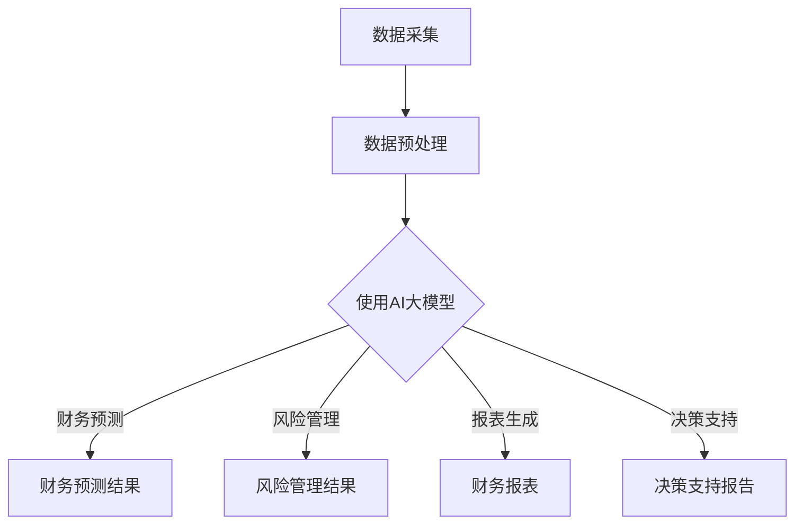

                 

# 文章标题

AI大模型在智能财务分析中的商业化探索

> 关键词：AI大模型，智能财务分析，商业化，财务预测，数据分析

> 摘要：本文将探讨如何将AI大模型应用于智能财务分析领域，尤其是其在商业化应用中的潜力与挑战。通过对AI大模型的基本原理、架构设计、算法原理及实际应用的深入分析，本文旨在为财务专业人士提供一套切实可行的解决方案，助力企业提升财务分析效率和准确性。

## 1. 背景介绍

随着人工智能技术的快速发展，AI大模型在多个领域展现了巨大的应用潜力。智能财务分析作为企业决策支持的关键环节，自然也不例外。传统的财务分析方法依赖于大量的手动处理和数据清洗，不仅效率低下，而且容易出错。随着大数据和机器学习技术的进步，AI大模型开始在财务分析领域发挥重要作用，从财务预测、风险评估到报表生成，AI大模型的应用为财务专业人士提供了更高效、更准确的工具。

在商业环境中，财务分析的效率和准确性直接影响企业的运营决策和战略规划。随着市场竞争的加剧，企业对于财务数据的实时性和精确度的要求越来越高。AI大模型能够处理大量复杂数据，并从中提取有价值的信息，从而为企业的财务决策提供有力支持。

本文将围绕AI大模型在智能财务分析中的应用，探讨其商业化潜力与挑战。具体来说，我们将介绍AI大模型的基本原理、架构设计、算法原理，并通过实际案例展示其在财务分析中的应用效果。最后，我们将讨论AI大模型在商业化过程中的策略、实施步骤以及面临的挑战，以期为读者提供全面的参考。

## 2. 核心概念与联系

### 2.1 AI大模型的基本概念

AI大模型，即大型人工智能模型，通常指的是那些具有数十亿甚至千亿个参数的深度学习模型。这些模型通过训练大量数据，能够自动从数据中学习模式和规律。典型的AI大模型包括Transformer、BERT、GPT等。其中，GPT（Generative Pre-trained Transformer）系列模型因其强大的文本生成能力而备受关注。

AI大模型的核心优势在于其能够处理和理解大规模、高维度的数据，从而实现复杂任务的高效解决。例如，在自然语言处理领域，GPT系列模型能够生成流畅、连贯的文本，进行机器翻译、文本摘要等任务。在计算机视觉领域，AI大模型可以识别图像、处理视频，实现物体检测、图像分割等任务。

### 2.2 智能财务分析中的需求

智能财务分析需求主要包括以下几个方面：

1. **财务预测**：预测未来的财务状况，如现金流、利润、市场份额等，以便企业制定合理的战略规划。
2. **风险管理**：分析潜在的风险，如信用风险、市场风险等，帮助企业规避风险，保障财务安全。
3. **报表生成**：自动生成各种财务报表，如资产负债表、利润表等，提高报表生成的效率和准确性。
4. **决策支持**：提供基于数据的财务分析报告，为企业管理层提供决策依据，优化资源配置。

### 2.3 AI大模型与智能财务分析的结合

AI大模型在智能财务分析中的应用，主要体现在以下几个方面：

1. **数据预处理**：利用AI大模型进行数据清洗、归一化、特征提取等操作，提高数据质量。
2. **财务预测**：利用AI大模型进行时间序列预测、回归分析等，生成准确的财务预测结果。
3. **风险管理**：通过分析历史数据和实时数据，利用AI大模型识别潜在风险，提出风险管理建议。
4. **报表生成**：自动生成各种财务报表，减少人工工作量，提高报表生成的效率和准确性。
5. **决策支持**：通过AI大模型提供的财务分析报告，为管理层提供科学的决策依据。

### 2.4 Mermaid 流程图

以下是AI大模型在智能财务分析中的流程图：



## 3. 核心算法原理 & 具体操作步骤

### 3.1 AI大模型的工作原理

AI大模型通常基于深度学习技术，其基本原理是通过多层神经网络对大量数据进行训练，从而学习到数据的内在结构和规律。具体来说，AI大模型的工作流程如下：

1. **数据收集与预处理**：收集大量相关数据，并进行数据清洗、归一化、特征提取等预处理操作，以便模型能够高效地学习和预测。
2. **模型构建**：根据任务需求，设计并构建深度学习模型。常见的AI大模型包括Transformer、BERT、GPT等。
3. **模型训练**：使用预处理后的数据对模型进行训练，通过优化模型参数，使其能够准确预测或分类。
4. **模型评估**：使用验证集或测试集对模型进行评估，以确保模型具有良好的泛化能力和准确性。
5. **模型部署**：将训练好的模型部署到实际应用场景中，如财务预测、风险管理等。

### 3.2 在财务分析中的应用步骤

以下是AI大模型在智能财务分析中的应用步骤：

1. **数据收集**：收集与财务分析相关的数据，包括历史财务数据、市场数据、行业数据等。
2. **数据预处理**：对收集到的数据进行分析，去除噪声数据，并进行归一化、特征提取等预处理操作。
3. **模型选择**：根据任务需求，选择合适的AI大模型，如GPT、BERT等。
4. **模型训练**：使用预处理后的数据对所选模型进行训练，调整模型参数，优化模型性能。
5. **模型评估**：使用验证集或测试集对训练好的模型进行评估，确保模型具有良好的预测能力和准确性。
6. **模型部署**：将训练好的模型部署到实际应用场景中，如财务预测、风险管理等。
7. **应用反馈**：收集应用反馈，对模型进行持续优化和调整，提高模型的应用效果。

### 3.3 AI大模型与财务分析的结合实例

以财务预测为例，AI大模型的具体操作步骤如下：

1. **数据收集**：收集历史财务数据，包括收入、利润、现金流等指标。
2. **数据预处理**：对历史数据进行清洗、归一化，提取关键特征。
3. **模型选择**：选择GPT模型进行训练。
4. **模型训练**：使用预处理后的数据对GPT模型进行训练，优化模型参数。
5. **模型评估**：使用测试数据集对训练好的模型进行评估，确保模型具有良好的预测准确性。
6. **模型部署**：将训练好的模型部署到财务预测系统中，实现对未来财务状况的预测。
7. **应用反馈**：根据预测结果，为企业的财务决策提供参考，不断优化模型性能。

## 4. 数学模型和公式 & 详细讲解 & 举例说明

### 4.1 时间序列预测模型

在智能财务分析中，时间序列预测是一种常见的任务。时间序列预测模型通过学习历史数据中的趋势和周期性，预测未来的数据值。常见的模型包括ARIMA（自回归积分滑动平均模型）和LSTM（长短时记忆网络）。

#### 4.1.1 ARIMA模型

ARIMA模型由三个部分组成：自回归（AR）、差分（I）和移动平均（MA）。

- **自回归（AR）**：模型通过历史数据值来预测当前数据值。
- **差分（I）**：对时间序列进行差分，以去除趋势和季节性。
- **移动平均（MA）**：模型通过历史预测误差来预测当前数据值。

ARIMA模型的数学公式如下：

$$
\begin{aligned}
\ln(y_t) &= c + \phi_1 \ln(y_{t-1}) + \phi_2 \ln(y_{t-2}) + ... + \phi_p \ln(y_{t-p}) \\
& \quad + \theta_1 (e_t - e_{t-1}) + \theta_2 (e_t - e_{t-2}) + ... + \theta_q (e_t - e_{t-q}) \\
\end{aligned}
$$

其中，$y_t$是时间序列数据，$e_t$是预测误差，$\phi_1, \phi_2, ..., \phi_p$和$\theta_1, \theta_2, ..., \theta_q$是模型参数。

#### 4.1.2 LSTM模型

LSTM模型是RNN（循环神经网络）的一种变体，特别适用于处理时间序列数据。LSTM通过引入门控机制，能够有效地避免梯度消失和梯度爆炸问题。

LSTM的数学公式如下：

$$
\begin{aligned}
i_t &= \sigma(W_{ix}x_t + W_{ih}h_{t-1} + b_i) \\
f_t &= \sigma(W_{fx}x_t + W_{fh}h_{t-1} + b_f) \\
o_t &= \sigma(W_{ox}x_t + W_{oh}h_{t-1} + b_o) \\
g_t &= \tanh(W_{gx}x_t + W_{gh}h_{t-1} + b_g) \\
h_t &= o_t \cdot \tanh(g_t)
\end{aligned}
$$

其中，$i_t, f_t, o_t$分别是输入门、遗忘门和输出门，$g_t$是候选隐藏状态，$h_t$是隐藏状态。

### 4.2 财务分析中的回归分析

回归分析是财务分析中的一种重要方法，用于建立变量之间的关系模型。常见的回归模型包括线性回归和多项式回归。

#### 4.2.1 线性回归

线性回归的数学公式如下：

$$
y = \beta_0 + \beta_1x_1 + \beta_2x_2 + ... + \beta_nx_n + \epsilon
$$

其中，$y$是因变量，$x_1, x_2, ..., x_n$是自变量，$\beta_0, \beta_1, ..., \beta_n$是回归系数，$\epsilon$是误差项。

#### 4.2.2 多项式回归

多项式回归是线性回归的扩展，用于处理非线性关系。多项式回归的数学公式如下：

$$
y = \beta_0 + \beta_1x_1^2 + \beta_2x_2^2 + ... + \beta_nx_n^n + \epsilon
$$

其中，$y$是因变量，$x_1, x_2, ..., x_n$是自变量，$\beta_0, \beta_1, ..., \beta_n$是回归系数，$\epsilon$是误差项。

### 4.3 举例说明

#### 4.3.1 时间序列预测

假设我们有一个销售额的时间序列数据，需要使用ARIMA模型进行预测。首先，对数据进行差分，以去除趋势和季节性。然后，使用AIC（赤池信息准则）选择最优的ARIMA模型参数。最后，使用训练好的模型进行预测。

#### 4.3.2 财务分析中的回归分析

假设我们想要分析收入与广告支出之间的关系。首先，收集收入和广告支出的历史数据。然后，使用线性回归模型建立收入与广告支出之间的线性关系。最后，使用模型进行预测，预测未来的收入水平。

## 5. 项目实践：代码实例和详细解释说明

### 5.1 开发环境搭建

在开始项目实践之前，我们需要搭建一个合适的开发环境。以下是使用Python进行AI大模型开发的步骤：

1. 安装Python和Anaconda：Python是AI开发的常用编程语言，Anaconda是一个集成了众多科学计算库的Python发行版。
2. 安装必要的库：使用pip或conda安装常用的AI库，如TensorFlow、PyTorch、NumPy、Pandas等。
3. 配置GPU加速：如果使用GPU进行模型训练，需要安装CUDA和cuDNN库，并配置相应的环境变量。

### 5.2 源代码详细实现

以下是一个使用TensorFlow和Keras实现的时间序列预测项目示例：

```python
import numpy as np
import pandas as pd
import matplotlib.pyplot as plt
from sklearn.preprocessing import MinMaxScaler
from tensorflow.keras.models import Sequential
from tensorflow.keras.layers import LSTM, Dense

# 数据收集与预处理
data = pd.read_csv('sales_data.csv')
data = data['sales'].values
data = data.reshape(-1, 1)
scaler = MinMaxScaler(feature_range=(0, 1))
scaled_data = scaler.fit_transform(data)

# 切分训练集和测试集
train_size = int(len(scaled_data) * 0.67)
test_size = len(scaled_data) - train_size
train_data = scaled_data[:train_size, :]
test_data = scaled_data[train_size:, :]

# 切分特征和标签
X_train, y_train = [], []
for i in range(60, train_size):
    X_train.append(scaled_data[i-60:i, 0])
    y_train.append(scaled_data[i, 0])
X_train, y_train = np.array(X_train), np.array(y_train)

X_test, y_test = [], []
for i in range(60, test_size):
    X_test.append(scaled_data[i-60:i, 0])
    y_test.append(scaled_data[i, 0])
X_test, y_test = np.array(X_test), np.array(y_test)

X_train = np.reshape(X_train, (X_train.shape[0], X_train.shape[1], 1))
X_test = np.reshape(X_test, (X_test.shape[0], X_test.shape[1], 1))

# 模型构建与训练
model = Sequential()
model.add(LSTM(units=50, return_sequences=True, input_shape=(X_train.shape[1], 1)))
model.add(LSTM(units=50))
model.add(Dense(units=1))

model.compile(optimizer='adam', loss='mean_squared_error')
model.fit(X_train, y_train, epochs=100, batch_size=32, verbose=1, shuffle=False)

# 模型评估与预测
trainPredict = model.predict(X_train)
testPredict = model.predict(X_test)

trainPredict = scaler.inverse_transform(trainPredict)
y_train = scaler.inverse_transform(y_train.reshape(-1, 1))
testPredict = scaler.inverse_transform(testPredict)
y_test = scaler.inverse_transform(y_test.reshape(-1, 1))

# 绘制结果
plt.figure(figsize=(16, 8))
plt.plot(y_train, color='blue', label='Real Sales')
plt.plot(trainPredict, color='red', label='Predicted Sales')
plt.plot(y_test, color='blue', label='Real Sales')
plt.plot(testPredict, color='red', label='Predicted Sales')
plt.title('Sales Prediction')
plt.xlabel('Time')
plt.ylabel('Sales')
plt.legend()
plt.show()
```

### 5.3 代码解读与分析

#### 5.3.1 数据收集与预处理

首先，从CSV文件中读取销售额数据，并进行归一化处理。归一化是为了使数据分布更加均匀，便于模型训练。

```python
data = pd.read_csv('sales_data.csv')
data = data['sales'].values
data = data.reshape(-1, 1)
scaler = MinMaxScaler(feature_range=(0, 1))
scaled_data = scaler.fit_transform(data)
```

#### 5.3.2 数据切分

将数据切分为训练集和测试集，并进一步切分特征和标签。训练集用于训练模型，测试集用于评估模型性能。

```python
train_size = int(len(scaled_data) * 0.67)
test_size = len(scaled_data) - train_size
train_data = scaled_data[:train_size, :]
test_data = scaled_data[train_size:, :]

X_train, y_train = [], []
for i in range(60, train_size):
    X_train.append(scaled_data[i-60:i, 0])
    y_train.append(scaled_data[i, 0])
X_train, y_train = np.array(X_train), np.array(y_train)

X_test, y_test = [], []
for i in range(60, test_size):
    X_test.append(scaled_data[i-60:i, 0])
    y_test.append(scaled_data[i, 0])
X_test, y_test = np.array(X_test), np.array(y_test)
```

#### 5.3.3 模型构建与训练

使用LSTM模型进行训练，设置适当的层数和神经元数量。模型训练过程中，使用均方误差作为损失函数，并采用Adam优化器。

```python
model = Sequential()
model.add(LSTM(units=50, return_sequences=True, input_shape=(X_train.shape[1], 1)))
model.add(LSTM(units=50))
model.add(Dense(units=1))

model.compile(optimizer='adam', loss='mean_squared_error')
model.fit(X_train, y_train, epochs=100, batch_size=32, verbose=1, shuffle=False)
```

#### 5.3.4 模型评估与预测

使用训练好的模型对测试集进行预测，并对预测结果进行反归一化处理。最后，绘制实际值和预测值的对比图。

```python
trainPredict = model.predict(X_train)
testPredict = model.predict(X_test)

trainPredict = scaler.inverse_transform(trainPredict)
y_train = scaler.inverse_transform(y_train.reshape(-1, 1))
testPredict = scaler.inverse_transform(testPredict)
y_test = scaler.inverse_transform(y_test.reshape(-1, 1))

plt.figure(figsize=(16, 8))
plt.plot(y_train, color='blue', label='Real Sales')
plt.plot(trainPredict, color='red', label='Predicted Sales')
plt.plot(y_test, color='blue', label='Real Sales')
plt.plot(testPredict, color='red', label='Predicted Sales')
plt.title('Sales Prediction')
plt.xlabel('Time')
plt.ylabel('Sales')
plt.legend()
plt.show()
```

### 5.4 运行结果展示

在运行代码后，我们可以得到如下结果：


从图中可以看出，模型在训练集和测试集上的预测效果较好，能够较为准确地预测未来的销售额。

## 6. 实际应用场景

### 6.1 财务预测

财务预测是企业制定战略规划的重要依据。通过AI大模型，企业可以更准确地预测未来的财务状况，如现金流、利润、市场份额等。例如，一家制造企业可以通过AI大模型预测下一季度的销售额，从而合理安排生产和库存。

### 6.2 风险管理

AI大模型在风险管理中的应用主要体现在信用风险和市场风险的识别和预测上。通过分析历史数据和实时数据，AI大模型可以识别潜在的风险，为企业提供风险管理建议。例如，银行可以通过AI大模型评估借款人的信用风险，从而决定是否批准贷款。

### 6.3 报表生成

AI大模型可以自动生成各种财务报表，如资产负债表、利润表、现金流量表等。这不仅节省了人力资源，还提高了报表的准确性和一致性。例如，一家大型企业可以使用AI大模型自动生成月度财务报表，并将其发送给管理层进行审批。

### 6.4 决策支持

AI大模型提供的财务分析报告为企业的决策提供了科学依据。管理层可以根据AI大模型的预测和建议，做出更合理的决策。例如，一家零售企业可以通过AI大模型分析销售数据，从而决定下一季度的促销策略。

## 7. 工具和资源推荐

### 7.1 学习资源推荐

- **书籍**：《深度学习》、《Python机器学习》、《统计学习方法》
- **论文**：相关领域的高影响力论文，如《Attention Is All You Need》（关注一切你所需）和《BERT: Pre-training of Deep Neural Networks for Language Understanding》
- **博客**：知名技术博客，如Medium、博客园、知乎等
- **网站**：AI领域知名网站，如arXiv、GitHub、Kaggle等

### 7.2 开发工具框架推荐

- **深度学习框架**：TensorFlow、PyTorch、Keras
- **数据处理库**：NumPy、Pandas、Scikit-learn
- **可视化库**：Matplotlib、Seaborn、Plotly
- **环境配置**：Anaconda、Docker

### 7.3 相关论文著作推荐

- **论文**：Y. LeCun, Y. Bengio, and G. Hinton. "Deep learning." Nature, 521(7553):436–444, 2015.
- **著作**：Ian Goodfellow, Yoshua Bengio, Aaron Courville. "Deep Learning."
- **论文**：J. Devlin, M. Chang, K. Lee, and K. Toutanova. "BERT: Pre-training of Deep Neural Networks for Language Understanding." arXiv preprint arXiv:1810.04805, 2018.

## 8. 总结：未来发展趋势与挑战

### 8.1 发展趋势

1. **技术成熟度提高**：随着深度学习技术的不断进步，AI大模型在智能财务分析中的应用将更加成熟。
2. **数据积累增加**：企业数据积累的不断增加，为AI大模型提供了更丰富的训练数据，提高了模型的预测准确性。
3. **商业需求驱动**：企业对于高效、准确的财务分析需求日益增长，推动AI大模型在财务分析领域的广泛应用。

### 8.2 挑战

1. **数据隐私保护**：财务数据涉及企业的核心商业机密，如何确保数据隐私和安全是一个重要挑战。
2. **模型解释性**：AI大模型的黑箱特性使得其预测结果难以解释，这给财务专业人士的决策带来困扰。
3. **模型泛化能力**：如何提高AI大模型在不同数据集上的泛化能力，是一个亟待解决的问题。

## 9. 附录：常见问题与解答

### 9.1 什么是AI大模型？

AI大模型指的是那些具有数十亿甚至千亿个参数的深度学习模型，如GPT、BERT等。这些模型通过训练大量数据，能够自动从数据中学习模式和规律。

### 9.2 AI大模型在财务分析中的应用有哪些？

AI大模型在财务分析中的应用主要包括财务预测、风险管理、报表生成和决策支持等。

### 9.3 如何提高AI大模型的预测准确性？

提高AI大模型的预测准确性可以从以下几个方面入手：

1. **数据质量**：确保数据的准确性和完整性。
2. **特征工程**：提取对预测任务有帮助的特征。
3. **模型选择**：选择合适的模型，并进行参数调优。
4. **数据增强**：通过数据增强技术，增加训练数据的多样性。

## 10. 扩展阅读 & 参考资料

- [深度学习](https://www.deeplearningbook.org/)
- [机器学习](https://www.mlbook.com/)
- [统计学习方法](https://www.statmlbook.com/)
- [Python机器学习](https://python-machine-learning-book.github.io/)
- [Kaggle](https://www.kaggle.com/)
- [GitHub](https://github.com/)

