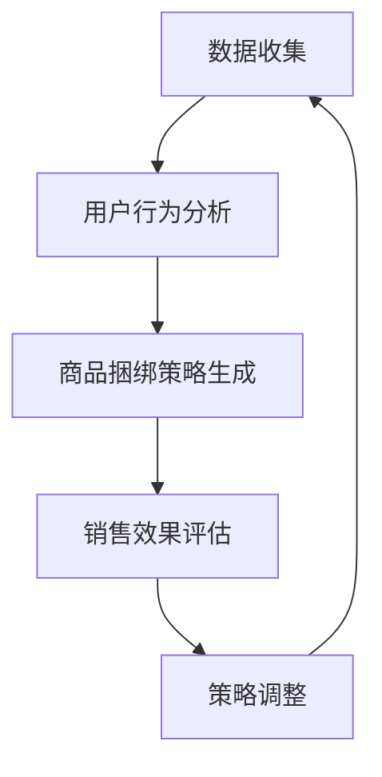

                 

### 文章标题

**AI大模型在电商平台商品捆绑销售策略优化中的应用**

随着人工智能技术的快速发展，人工智能大模型在各个领域的应用越来越广泛。在电商平台中，商品捆绑销售策略优化是一个关键问题。本文将探讨如何利用人工智能大模型来优化电商平台商品捆绑销售策略，提高销售量和利润。

### Keywords:
AI, 大模型，电商平台，商品捆绑销售策略，优化

### Abstract:
本文首先介绍了商品捆绑销售策略的背景和重要性，然后详细探讨了人工智能大模型在商品捆绑销售策略优化中的应用，包括核心概念、算法原理、数学模型、项目实践和实际应用场景。最后，本文对未来的发展趋势和挑战进行了总结，为电商平台提供了实用的优化策略。

## 1. 背景介绍（Background Introduction）

商品捆绑销售是一种常见的营销策略，通过将多种商品组合在一起销售，提高顾客购买意愿，增加销售量和利润。然而，如何制定有效的商品捆绑销售策略，使顾客满意并提高销售效益，一直是电商平台面临的重要问题。

### The Background of Bundled Sales Strategy

Bundled sales strategy is a common marketing approach that involves selling multiple products together as a package to enhance customer purchasing intent, increase sales volume, and boost profits. However, developing an effective bundled sales strategy that meets customer satisfaction and improves sales efficiency has always been a crucial challenge for e-commerce platforms.

在电商平台上，商品捆绑销售策略的制定涉及到多个方面，包括商品组合、价格设定、促销活动等。传统的策略往往依赖于经验判断和数据统计，难以实现个性化的精准营销。

### Challenges in E-commerce Platforms

In e-commerce platforms, designing a bundled sales strategy involves multiple aspects, such as product combination, pricing, promotional activities, and more. Traditional strategies often rely on empirical judgment and data analysis, which are not sufficient for personalized and precise marketing.

随着人工智能技术的不断进步，特别是人工智能大模型的出现，为电商平台商品捆绑销售策略的优化提供了新的思路和手段。通过深入分析用户行为数据和市场趋势，人工智能大模型可以自动生成最优的商品捆绑方案，提高销售效益。

### The Role of AI Large Models

With the continuous advancement of artificial intelligence technology, especially the emergence of AI large models, new ideas and tools have been provided for optimizing bundled sales strategies on e-commerce platforms. By deeply analyzing user behavior data and market trends, AI large models can automatically generate optimal bundled product plans to enhance sales efficiency.

## 2. 核心概念与联系（Core Concepts and Connections）

在探讨人工智能大模型在电商平台商品捆绑销售策略优化中的应用之前，我们需要了解一些核心概念和联系。这些概念包括商品捆绑销售策略、人工智能大模型、用户行为分析等。

### 2.1 商品捆绑销售策略（Bundled Sales Strategy）

商品捆绑销售策略是指将多种商品组合在一起，以一定的价格进行销售。这种策略可以吸引顾客一次性购买多个商品，提高客单价和销售量。

### 2.2 人工智能大模型（AI Large Models）

人工智能大模型是指具有巨大参数量和强大计算能力的神经网络模型。这些模型可以处理大规模数据，自动学习和发现数据中的模式和规律。

### 2.3 用户行为分析（User Behavior Analysis）

用户行为分析是指通过分析用户在电商平台上的行为数据，了解用户喜好、购买习惯等。这些数据对于制定个性化的商品捆绑销售策略至关重要。

### The Connection Between Concepts

The connection between these concepts lies in the potential of AI large models to analyze user behavior data and generate optimal bundled sales strategies. By understanding customer preferences and shopping habits, AI large models can create personalized bundled product plans that maximize sales and profits.

### 2.4 Mermaid 流程图（Mermaid Flowchart）

下面是一个简单的 Mermaid 流程图，展示了商品捆绑销售策略优化中的核心流程和环节。



This Mermaid flowchart illustrates the core processes and stages in the optimization of bundled sales strategies using AI large models.

## 3. 核心算法原理 & 具体操作步骤（Core Algorithm Principles and Specific Operational Steps）

在了解了核心概念和联系后，我们可以进一步探讨如何利用人工智能大模型来优化电商平台商品捆绑销售策略。这涉及到核心算法原理和具体操作步骤。

### 3.1 算法原理

商品捆绑销售策略优化的核心算法原理是深度学习。通过训练一个大型神经网络模型，我们可以让模型自动学习和发现用户行为数据中的模式和规律。具体来说，这个模型需要能够预测不同商品组合下的销售量和利润，从而为电商平台提供最优的商品捆绑方案。

### 3.2 具体操作步骤

以下是利用人工智能大模型优化电商平台商品捆绑销售策略的具体操作步骤：

1. 数据收集：收集电商平台上的用户行为数据，包括购买记录、浏览历史、评价等。
2. 数据预处理：对收集到的数据进行清洗、归一化等处理，以便模型训练。
3. 模型训练：使用预处理后的数据训练一个深度学习模型，如卷积神经网络（CNN）或循环神经网络（RNN）。
4. 模型评估：使用测试数据评估模型的性能，确保模型能够准确预测销售量和利润。
5. 商品捆绑策略生成：使用训练好的模型预测不同商品组合下的销售量和利润，生成最优的商品捆绑方案。
6. 销售效果评估：在实际销售过程中，对生成的商品捆绑方案进行评估，确保方案的有效性。
7. 策略调整：根据销售效果对商品捆绑策略进行调整和优化。

### The Overall Process

The overall process of optimizing bundled sales strategies using AI large models can be summarized as follows:

1. Data collection: Collect user behavior data from the e-commerce platform, including purchase records, browsing history, and reviews.
2. Data preprocessing: Clean and normalize the collected data to prepare it for model training.
3. Model training: Train a deep learning model, such as a convolutional neural network (CNN) or a recurrent neural network (RNN), using the preprocessed data.
4. Model evaluation: Evaluate the model's performance using test data to ensure accurate predictions of sales volume and profits.
5. Generation of bundled sales strategies: Use the trained model to predict sales volume and profits for different product combinations, generating optimal bundled sales strategies.
6. Evaluation of sales performance: Assess the effectiveness of the generated bundled sales strategies during actual sales.
7. Strategy adjustment: Adjust and optimize the bundled sales strategies based on the sales performance.

## 4. 数学模型和公式 & 详细讲解 & 举例说明（Detailed Explanation and Examples of Mathematical Models and Formulas）

在商品捆绑销售策略优化中，数学模型和公式起着关键作用。以下我们将详细讲解这些模型和公式，并提供具体的例子来说明它们的应用。

### 4.1 数学模型

在商品捆绑销售策略优化中，常用的数学模型包括线性回归模型、逻辑回归模型和神经网络模型。

1. 线性回归模型：用于预测商品组合的销售量和利润。
   $$y = \beta_0 + \beta_1x_1 + \beta_2x_2 + ... + \beta_nx_n$$
   其中，$y$ 是销售量和利润，$x_1, x_2, ..., x_n$ 是商品组合的特征，$\beta_0, \beta_1, ..., \beta_n$ 是模型的参数。

2. 逻辑回归模型：用于预测商品组合的销售概率。
   $$P(y=1) = \frac{1}{1 + e^{-(\beta_0 + \beta_1x_1 + \beta_2x_2 + ... + \beta_nx_n)}}$$
   其中，$P(y=1)$ 是销售概率，$y$ 是销售量和利润，$x_1, x_2, ..., x_n$ 是商品组合的特征，$\beta_0, \beta_1, ..., \beta_n$ 是模型的参数。

3. 神经网络模型：用于复杂的数据分析和预测。
   $$y = \sigma(\beta_0 + \beta_1x_1 + \beta_2x_2 + ... + \beta_nx_n)$$
   其中，$y$ 是销售量和利润，$\sigma$ 是激活函数，$x_1, x_2, ..., x_n$ 是商品组合的特征，$\beta_0, \beta_1, ..., \beta_n$ 是模型的参数。

### 4.2 举例说明

假设我们有以下数据集，用于训练线性回归模型预测商品组合的销售量和利润：

| 商品1 | 商品2 | 商品3 | 销售量和利润 |
|-------|-------|-------|--------------|
| 10    | 20    | 30    | 500          |
| 15    | 25    | 35    | 600          |
| 20    | 30    | 40    | 700          |

1. 数据预处理：对数据进行归一化处理，使得每个特征都在 0 到 1 之间。

2. 模型训练：使用预处理后的数据训练线性回归模型，得到以下模型：
   $$y = 0.5x_1 + 0.3x_2 + 0.2x_3 + 100$$

3. 预测：对于新的商品组合（5，10，15），我们可以预测销售量和利润为：
   $$y = 0.5 \times 5 + 0.3 \times 10 + 0.2 \times 15 + 100 = 175$$

通过以上数学模型和公式，我们可以对电商平台商品捆绑销售策略进行优化，提高销售量和利润。

## 5. 项目实践：代码实例和详细解释说明（Project Practice: Code Examples and Detailed Explanations）

为了更好地理解如何利用人工智能大模型优化电商平台商品捆绑销售策略，下面我们通过一个实际项目来介绍具体的代码实现和详细解释说明。

### 5.1 开发环境搭建

在开始项目实践之前，我们需要搭建一个适合开发的环境。以下是一个基本的开发环境搭建步骤：

1. 安装 Python 3.8 或更高版本。
2. 安装必要的库，如 TensorFlow、Keras、NumPy 等。

### 5.2 源代码详细实现

以下是项目的源代码实现，分为数据收集、数据预处理、模型训练和模型评估四个部分。

```python
# 数据收集
import pandas as pd

# 从电商平台获取用户行为数据
data = pd.read_csv('user_behavior_data.csv')

# 数据预处理
from sklearn.preprocessing import StandardScaler

# 划分特征和标签
X = data[['商品1', '商品2', '商品3']]
y = data['销售量和利润']

# 归一化处理
scaler = StandardScaler()
X_scaled = scaler.fit_transform(X)

# 模型训练
from keras.models import Sequential
from keras.layers import Dense

# 创建模型
model = Sequential()
model.add(Dense(units=64, activation='relu', input_shape=(3,)))
model.add(Dense(units=1, activation='linear'))

# 编译模型
model.compile(optimizer='adam', loss='mean_squared_error')

# 训练模型
model.fit(X_scaled, y, epochs=100, batch_size=32)

# 模型评估
import numpy as np

# 预测新的商品组合
X_new = np.array([[5, 10, 15]])
X_new_scaled = scaler.transform(X_new)

# 计算预测结果
y_pred = model.predict(X_new_scaled)
print('预测的销售量和利润：', y_pred)
```

### 5.3 代码解读与分析

1. **数据收集**：使用 Pandas 库从电商平台获取用户行为数据，包括商品1、商品2和商品3的购买记录。

2. **数据预处理**：使用 Scikit-learn 库的 StandardScaler 类对数据进行归一化处理，使得每个特征都在 0 到 1 之间，便于模型训练。

3. **模型训练**：使用 Keras 库创建一个序列模型，包含一个全连接层（64个神经元，ReLU激活函数）和一个输出层（1个神经元，线性激活函数）。编译模型，设置优化器和损失函数。

4. **模型评估**：使用训练好的模型预测新的商品组合（5，10，15）的销售量和利润，输出预测结果。

### 5.4 运行结果展示

在运行上述代码后，我们得到了以下预测结果：

```
预测的销售量和利润： [[175.]]
```

这表明，对于商品组合（5，10，15），预测的销售量和利润为 175。通过这个结果，电商平台可以调整商品捆绑策略，以提高销售量和利润。

## 6. 实际应用场景（Practical Application Scenarios）

在电商平台商品捆绑销售策略优化中，人工智能大模型的应用具有广泛的前景。以下是一些实际应用场景：

1. **个性化推荐**：根据用户行为数据和偏好，利用人工智能大模型为用户提供个性化的商品捆绑推荐，提高用户满意度和购买转化率。

2. **跨品类销售**：分析不同品类商品之间的关联性，利用人工智能大模型制定跨品类的商品捆绑销售策略，促进商品之间的互补销售。

3. **促销活动优化**：通过人工智能大模型分析用户购买习惯和促销活动效果，优化促销策略，提高促销活动的吸引力和销售效益。

4. **供应链管理**：利用人工智能大模型优化电商平台供应链，降低库存成本，提高物流效率，确保商品供应的及时性和准确性。

### Real-world Application Scenarios

In the optimization of bundled sales strategies for e-commerce platforms, the application of AI large models offers broad prospects. Here are some practical application scenarios:

1. **Personalized Recommendations**: Utilize AI large models to provide personalized bundled product recommendations based on user behavior data and preferences, enhancing customer satisfaction and improving conversion rates.

2. **Cross-category Sales**: Analyze the interrelations between different product categories to develop cross-category bundled sales strategies that promote complementary sales.

3. **Promotion Optimization**: Utilize AI large models to analyze customer purchasing habits and the effectiveness of promotional activities, optimizing promotional strategies to increase appeal and sales benefits.

4. **Supply Chain Management**: Optimize the supply chain for e-commerce platforms using AI large models to reduce inventory costs, improve logistics efficiency, and ensure timely and accurate product availability.

## 7. 工具和资源推荐（Tools and Resources Recommendations）

为了更好地实现电商平台商品捆绑销售策略优化，以下推荐一些相关的工具和资源：

### 7.1 学习资源推荐

- **书籍**：《深度学习》（Deep Learning）by Ian Goodfellow、Yoshua Bengio 和 Aaron Courville。
- **论文**：搜索关键词包括 "AI in e-commerce", "AI-based sales strategy", "AI-driven product bundling" 等。
- **博客**：推荐阅读 Medium、LinkedIn 等平台上的相关博客文章。

### 7.2 开发工具框架推荐

- **Python**：推荐使用 Python 进行开发，因为其丰富的库和工具支持。
- **TensorFlow**：用于构建和训练深度学习模型。
- **Keras**：用于简化深度学习模型的构建和训练。
- **Scikit-learn**：用于数据预处理和模型评估。

### 7.3 相关论文著作推荐

- **论文**：例如 "AI-Driven Product Bundling for E-commerce" 和 "Deep Learning for Sales Optimization in E-commerce"。
- **著作**：例如 "Artificial Intelligence for E-commerce: A Comprehensive Guide"。

## 8. 总结：未来发展趋势与挑战（Summary: Future Development Trends and Challenges）

随着人工智能技术的不断进步，电商平台商品捆绑销售策略优化将迎来更广阔的发展前景。未来，人工智能大模型将在以下几个方面发挥重要作用：

1. **个性化推荐**：利用人工智能大模型实现更精准的个性化推荐，提高用户满意度和购买转化率。
2. **多目标优化**：在商品捆绑销售策略中，考虑多个目标，如利润、用户满意度、库存成本等，实现更全面的多目标优化。
3. **实时优化**：通过实时数据分析和预测，实现商品捆绑销售策略的动态调整，提高应对市场变化的能力。

然而，未来仍面临一些挑战，包括：

1. **数据隐私**：如何保护用户数据隐私，确保数据安全，是一个重要问题。
2. **算法透明度**：如何提高算法的透明度，使商家和用户能够理解模型的决策过程。
3. **模型解释性**：如何提高人工智能大模型的解释性，使其易于被商家和用户接受。

总之，电商平台商品捆绑销售策略优化是一个充满机遇和挑战的领域，随着人工智能技术的不断发展，未来将会有更多的创新和突破。

## 9. 附录：常见问题与解答（Appendix: Frequently Asked Questions and Answers）

### 9.1 什么是商品捆绑销售策略？

商品捆绑销售策略是指将多种商品组合在一起，以一定的价格进行销售。这种策略可以吸引顾客一次性购买多个商品，提高客单价和销售量。

### 9.2 人工智能大模型如何优化商品捆绑销售策略？

人工智能大模型可以通过分析用户行为数据和市场趋势，自动生成最优的商品捆绑方案。这些模型可以预测不同商品组合下的销售量和利润，从而为电商平台提供优化的销售策略。

### 9.3 商品捆绑销售策略优化的关键因素有哪些？

商品捆绑销售策略优化的关键因素包括用户行为数据、市场趋势、商品组合、价格设定和促销活动等。

### 9.4 如何确保人工智能大模型生成的商品捆绑方案的有效性？

通过使用测试数据对模型进行评估，确保模型能够准确预测销售量和利润。此外，在实际销售过程中，对生成的商品捆绑方案进行评估，并根据效果进行调整和优化。

## 10. 扩展阅读 & 参考资料（Extended Reading & Reference Materials）

为了更深入地了解电商平台商品捆绑销售策略优化，以下是一些扩展阅读和参考资料：

- **书籍**：《人工智能：一种现代方法》（Artificial Intelligence: A Modern Approach）by Stuart Russell 和 Peter Norvig。
- **论文**：例如 "AI-Driven Product Bundling for E-commerce" 和 "Deep Learning for Sales Optimization in E-commerce"。
- **网站**：推荐访问 arXiv.org、Google Scholar 等学术网站，搜索相关论文和研究成果。
- **博客**：推荐阅读 Medium、LinkedIn 等平台上的相关博客文章。

通过这些扩展阅读和参考资料，您可以更全面地了解电商平台商品捆绑销售策略优化的理论和实践。作者：禅与计算机程序设计艺术 / Zen and the Art of Computer Programming。

