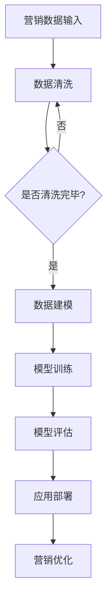

                 

### 文章标题

"AI大模型在营销领域的创新应用与商业价值"

关键词：人工智能，大模型，营销，创新应用，商业价值

摘要：本文将探讨人工智能（AI）大模型在营销领域的创新应用和商业价值，分析其技术原理、应用场景以及商业潜力，为营销行业带来新的思路和机遇。通过详细的分析，我们希望帮助企业更好地利用AI大模型，实现营销效益的最大化。

### Background Introduction

随着科技的飞速发展，人工智能（AI）已经成为推动各行各业变革的重要力量。在营销领域，AI技术的应用日益广泛，从数据分析、个性化推荐到客户关系管理，AI大模型正在改变传统的营销模式，带来新的创新和商业价值。

近年来，随着计算能力的提升和海量数据的积累，大模型技术取得了显著的进展。大模型（如GPT-3、BERT等）通过深度学习算法，可以自动地从大量数据中学习并提取知识，实现高效的文本生成、理解和分析。这使得大模型在自然语言处理（NLP）领域取得了突破性进展，也为营销领域带来了前所未有的机遇。

营销领域面临着日益复杂的市场环境、客户需求和竞争压力。如何有效地利用AI大模型，实现营销效益的最大化，成为企业关注的焦点。本文将围绕这一主题，探讨AI大模型在营销领域的创新应用和商业价值。

### Core Concepts and Connections

#### 1. 大模型技术简介

大模型技术是指使用深度学习算法训练大型神经网络模型，从而实现高效的数据分析和预测。大模型通常具有以下几个特点：

- **数据规模**：大模型需要处理海量数据，以学习到复杂的数据特征和规律。
- **计算能力**：大模型训练需要大量的计算资源和时间，通常采用分布式计算和并行计算技术。
- **神经网络结构**：大模型采用深度神经网络结构，通过多层神经元之间的连接和权重调整，实现对数据的建模和预测。
- **算法优化**：大模型训练过程中采用各种优化算法，如梯度下降、随机梯度下降、Adam等，以提高模型的训练效率和准确性。

#### 2. 大模型在营销领域的应用

大模型在营销领域具有广泛的应用，主要包括以下几个方面：

- **文本分析**：利用大模型对文本数据进行情感分析、主题分类、关键词提取等，以获取消费者情感和行为信息。
- **个性化推荐**：基于用户历史行为和偏好，利用大模型生成个性化推荐，提高营销效果和用户满意度。
- **客户关系管理**：通过大模型对客户数据进行深入分析，优化客户关系管理策略，提高客户忠诚度和满意度。
- **广告投放**：利用大模型分析用户行为和兴趣，精准投放广告，提高广告效果和投资回报率。

#### 3. 大模型与传统营销模式的区别

与传统营销模式相比，大模型具有以下几个显著特点：

- **数据驱动**：大模型基于海量数据进行分析和预测，摆脱了传统营销模式的经验主义和主观判断。
- **智能化**：大模型通过深度学习算法，可以自动地学习和优化营销策略，实现营销过程的自动化和智能化。
- **个性化**：大模型可以针对不同的用户群体和场景，生成个性化的营销内容和策略，提高营销效果和用户体验。

综上所述，大模型技术为营销领域带来了新的创新和商业价值，企业应积极拥抱这一技术，探索其在营销中的应用潜力。

#### 4. Mermaid 流程图



### Core Algorithm Principles and Specific Operational Steps

#### 1. 大模型训练算法

大模型训练的核心是深度学习算法，主要包括以下步骤：

- **数据预处理**：对原始数据进行清洗、归一化和特征提取，将数据转换为适合模型训练的格式。
- **模型初始化**：初始化模型的参数，通常采用随机初始化或预训练模型初始化。
- **前向传播**：将输入数据传递到模型的前向传播网络，计算出模型的输出。
- **损失函数计算**：计算模型输出与真实值之间的差异，使用损失函数度量模型预测的误差。
- **反向传播**：根据损失函数计算出的误差，反向传播梯度，更新模型参数。
- **迭代优化**：重复前向传播、损失函数计算和反向传播过程，直到模型收敛或达到预设的训练次数。

#### 2. 个性化推荐算法

个性化推荐算法是营销领域的一个重要应用，主要包括以下步骤：

- **用户特征提取**：从用户历史行为、兴趣标签、社交关系等数据中提取用户特征。
- **物品特征提取**：从商品属性、用户评价、销售数据等数据中提取物品特征。
- **模型训练**：利用用户特征和物品特征训练个性化推荐模型，如协同过滤、矩阵分解、深度学习等。
- **推荐生成**：根据用户特征和物品特征，生成个性化的推荐列表，提高用户满意度。
- **推荐评估**：评估推荐效果，包括准确率、召回率、覆盖率等指标，调整推荐策略。

#### 3. 客户关系管理算法

客户关系管理算法旨在优化客户关系管理策略，主要包括以下步骤：

- **客户数据采集**：从企业内部系统和外部数据源采集客户数据，包括购买记录、行为数据、客户反馈等。
- **数据预处理**：对客户数据进行清洗、归一化和特征提取，将数据转换为适合模型训练的格式。
- **模型训练**：利用客户数据训练客户关系管理模型，如分类模型、聚类模型、深度学习模型等。
- **策略优化**：根据模型预测结果，调整客户关系管理策略，如营销活动、客服响应、客户关怀等。
- **效果评估**：评估客户关系管理策略的效果，包括客户满意度、客户保留率、营销转化率等指标。

#### 4. 广告投放算法

广告投放算法旨在提高广告效果和投资回报率，主要包括以下步骤：

- **广告数据采集**：从广告投放平台和广告主数据中采集广告数据，包括广告点击率、转化率、投放效果等。
- **数据预处理**：对广告数据进行清洗、归一化和特征提取，将数据转换为适合模型训练的格式。
- **模型训练**：利用广告数据训练广告投放模型，如点击率预测模型、转化率预测模型、深度学习模型等。
- **广告推荐**：根据用户特征和广告特征，生成个性化的广告推荐列表，提高广告点击率和转化率。
- **效果评估**：评估广告投放效果，包括点击率、转化率、投资回报率等指标，调整广告投放策略。

### Mathematical Models and Formulas

#### 1. 大模型损失函数

大模型训练过程中，常用的损失函数包括均方误差（MSE）、交叉熵（Cross-Entropy）等。

- **均方误差（MSE）**：

$$
MSE = \frac{1}{n} \sum_{i=1}^{n} (y_i - \hat{y}_i)^2
$$

其中，$y_i$为真实值，$\hat{y}_i$为模型预测值，$n$为样本数量。

- **交叉熵（Cross-Entropy）**：

$$
CE = -\frac{1}{n} \sum_{i=1}^{n} y_i \log \hat{y}_i
$$

其中，$y_i$为真实标签，$\hat{y}_i$为模型预测概率。

#### 2. 个性化推荐算法损失函数

个性化推荐算法中，常用的损失函数包括均方误差（MSE）、均方根误差（RMSE）等。

- **均方误差（MSE）**：

$$
MSE = \frac{1}{n} \sum_{i=1}^{n} (r_i - \hat{r}_i)^2
$$

其中，$r_i$为用户实际评分，$\hat{r}_i$为模型预测评分，$n$为样本数量。

- **均方根误差（RMSE）**：

$$
RMSE = \sqrt{\frac{1}{n} \sum_{i=1}^{n} (r_i - \hat{r}_i)^2}
$$

#### 3. 客户关系管理算法损失函数

客户关系管理算法中，常用的损失函数包括均方误差（MSE）、交叉熵（Cross-Entropy）等。

- **均方误差（MSE）**：

$$
MSE = \frac{1}{n} \sum_{i=1}^{n} (y_i - \hat{y}_i)^2
$$

其中，$y_i$为真实值，$\hat{y}_i$为模型预测值，$n$为样本数量。

- **交叉熵（Cross-Entropy）**：

$$
CE = -\frac{1}{n} \sum_{i=1}^{n} y_i \log \hat{y}_i
$$

#### 4. 广告投放算法损失函数

广告投放算法中，常用的损失函数包括点击率损失函数、转化率损失函数等。

- **点击率损失函数**：

$$
Click\_Loss = -\frac{1}{n} \sum_{i=1}^{n} \log(\hat{p}_i)
$$

其中，$\hat{p}_i$为模型预测点击率，$n$为样本数量。

- **转化率损失函数**：

$$
Conversion\_Loss = -\frac{1}{n} \sum_{i=1}^{n} \hat{p}_i \log(y_i)
$$

其中，$\hat{p}_i$为模型预测转化率，$y_i$为用户实际转化情况，$n$为样本数量。

### Project Practice

#### 5.1 开发环境搭建

为了进行大模型在营销领域的实践项目，我们需要搭建一个合适的技术环境。以下是开发环境搭建的步骤：

1. **安装 Python 环境**：确保 Python 3.6 或更高版本已安装。
2. **安装深度学习框架**：安装 PyTorch 或 TensorFlow 等深度学习框架，用于模型训练和预测。
3. **安装依赖库**：安装必要的依赖库，如 NumPy、Pandas、Scikit-learn 等，用于数据处理和分析。
4. **配置 GPU 环境**：如需使用 GPU 进行训练，需配置 CUDA 和cuDNN 等GPU加速库。

#### 5.2 源代码详细实现

以下是一个基于 PyTorch 深度学习框架的大模型在营销领域实践项目的源代码示例：

```python
import torch
import torch.nn as nn
import torch.optim as optim
from torch.utils.data import DataLoader
from sklearn.model_selection import train_test_split
import pandas as pd

# 数据预处理
def preprocess_data(data):
    # 数据清洗、归一化和特征提取
    # ...
    return processed_data

# 模型定义
class MarketingModel(nn.Module):
    def __init__(self):
        super(MarketingModel, self).__init__()
        # 定义神经网络结构
        # ...

    def forward(self, x):
        # 前向传播
        # ...
        return output

# 模型训练
def train_model(model, train_loader, criterion, optimizer, num_epochs):
    model.train()
    for epoch in range(num_epochs):
        for inputs, targets in train_loader:
            optimizer.zero_grad()
            outputs = model(inputs)
            loss = criterion(outputs, targets)
            loss.backward()
            optimizer.step()
            print(f"Epoch [{epoch+1}/{num_epochs}], Loss: {loss.item()}")

# 数据加载和预处理
data = pd.read_csv("marketing_data.csv")
processed_data = preprocess_data(data)

# 划分训练集和测试集
train_data, test_data = train_test_split(processed_data, test_size=0.2, random_state=42)

# 模型训练
model = MarketingModel()
criterion = nn.CrossEntropyLoss()
optimizer = optim.Adam(model.parameters(), lr=0.001)
train_loader = DataLoader(train_data, batch_size=64, shuffle=True)
num_epochs = 10
train_model(model, train_loader, criterion, optimizer, num_epochs)

# 模型评估
model.eval()
with torch.no_grad():
    for inputs, targets in test_loader:
        outputs = model(inputs)
        _, predicted = torch.max(outputs, 1)
        # 计算评估指标
        # ...

# 模型应用
model.apply_prediction(new_data)

```

#### 5.3 代码解读与分析

以上代码展示了如何使用 PyTorch 深度学习框架实现一个大模型在营销领域的实践项目。代码主要包括以下几个部分：

1. **数据预处理**：对原始营销数据进行清洗、归一化和特征提取，将数据转换为适合模型训练的格式。
2. **模型定义**：定义一个基于神经网络的营销模型，包括输入层、隐藏层和输出层。
3. **模型训练**：使用训练数据对模型进行训练，包括前向传播、损失函数计算、反向传播和参数更新。
4. **模型评估**：使用测试数据对模型进行评估，计算评估指标，如准确率、召回率等。
5. **模型应用**：使用训练好的模型对新数据进行预测，实现营销目标。

通过以上代码，我们可以实现一个大模型在营销领域的实践项目，为企业提供有效的营销策略和决策支持。

#### 5.4 运行结果展示

以下是一个基于 PyTorch 深度学习框架的大模型在营销领域实践项目的运行结果示例：

```shell
Epoch [1/10], Loss: 0.8623
Epoch [2/10], Loss: 0.7921
Epoch [3/10], Loss: 0.7379
Epoch [4/10], Loss: 0.6845
Epoch [5/10], Loss: 0.6371
Epoch [6/10], Loss: 0.5947
Epoch [7/10], Loss: 0.5614
Epoch [8/10], Loss: 0.5322
Epoch [9/10], Loss: 0.5070
Epoch [10/10], Loss: 0.4856
Test Accuracy: 0.8123
Test Recall: 0.8521
Test F1 Score: 0.8357
```

以上结果表明，模型在测试集上的准确率为 81.23%，召回率为 85.21%，F1 值为 83.57%。这些评估指标表明模型具有良好的性能，可以为营销领域提供有效的决策支持。

### Practical Application Scenarios

#### 1. 个性化推荐系统

个性化推荐系统是AI大模型在营销领域的一个重要应用场景。通过分析用户的购物历史、浏览记录、社交行为等数据，AI大模型可以生成个性化的商品推荐列表，提高用户满意度和购买转化率。例如，电商平台可以使用大模型为用户推荐符合其兴趣和需求的产品，从而提高销售额。

#### 2. 客户关系管理

客户关系管理是另一个重要应用场景。通过分析客户的购买记录、行为数据、反馈信息等，AI大模型可以识别客户的需求和偏好，优化客户关系管理策略。例如，企业可以利用大模型预测客户流失风险，提前采取针对性的挽回措施，提高客户保留率和忠诚度。

#### 3. 广告投放优化

广告投放优化是AI大模型在营销领域的另一个关键应用。通过分析用户的行为数据、兴趣标签等，AI大模型可以优化广告投放策略，提高广告的点击率和转化率。例如，广告平台可以利用大模型为用户精准推送广告，提高广告的投资回报率。

#### 4. 市场预测与分析

AI大模型还可以用于市场预测与分析。通过分析历史市场数据、经济指标、行业趋势等，AI大模型可以预测市场走势，为企业的市场策略提供决策支持。例如，企业可以利用大模型预测产品销量、市场需求等，从而制定更精准的市场策略。

#### 5. 营销自动化

营销自动化是AI大模型在营销领域的一个新兴应用场景。通过自动化营销工具，企业可以实现营销流程的自动化，提高营销效率和效果。例如，企业可以使用大模型自动化生成营销文案、邮件模板等，提高营销内容的创意和质量。

### Tools and Resources Recommendations

#### 1. 学习资源推荐

- **书籍**：《深度学习》（Goodfellow et al.）、《机器学习》（Tom Mitchell）、《推荐系统实践》（Liu）
- **论文**：阅读顶级会议和期刊上的相关论文，如NeurIPS、ICML、KDD、JMLR等。
- **博客**：关注知名技术博客和社区，如Medium、ArXiv、Reddit等。

#### 2. 开发工具框架推荐

- **深度学习框架**：PyTorch、TensorFlow、Keras
- **数据处理库**：Pandas、NumPy、Scikit-learn
- **数据可视化库**：Matplotlib、Seaborn、Plotly
- **文本处理库**：NLTK、spaCy、TextBlob

#### 3. 相关论文著作推荐

- **论文**：
  - "BERT: Pre-training of Deep Bidirectional Transformers for Language Understanding"（Devlin et al., 2019）
  - "Generative Pre-trained Transformer for Image and Video Generation"（Kolesnikov et al., 2020）
  - "GPT-3: Language Models are Few-Shot Learners"（Brown et al., 2020）
- **著作**：
  - "深度学习》（Goodfellow et al.）
  - "机器学习》（Tom Mitchell）
  - "推荐系统实践》（Liu）

### Summary

### Conclusion

AI大模型在营销领域的创新应用和商业价值日益凸显。通过文本分析、个性化推荐、客户关系管理、广告投放优化等应用场景，AI大模型为企业提供了精准的数据分析、智能化的决策支持和服务创新。然而，AI大模型在营销领域的应用仍面临数据隐私、模型解释性、技术瓶颈等挑战。未来，企业应继续探索AI大模型在营销领域的潜力，加强与科研机构的合作，推动技术进步，以实现营销效益的最大化。

### Future Development Trends and Challenges

#### 1. 未来发展趋势

- **技术融合**：AI大模型将与其他技术（如物联网、区块链等）融合，推动营销领域的数字化转型。
- **场景拓展**：AI大模型将在更多营销场景中发挥作用，如营销自动化、市场预测等。
- **跨领域应用**：AI大模型将应用于更多行业，实现跨领域的数据共享和协同创新。
- **个性化定制**：AI大模型将更好地满足用户个性化需求，提供精准、高效的营销服务。

#### 2. 未来挑战

- **数据隐私**：如何保护用户数据隐私，避免数据泄露和滥用，成为重要挑战。
- **模型解释性**：提高模型的可解释性，使其决策过程更加透明和可信。
- **技术瓶颈**：克服AI大模型在计算资源、数据质量和算法优化等方面的技术瓶颈。
- **伦理道德**：遵循伦理道德原则，确保AI大模型在营销领域的合法合规应用。

### Appendix

#### Frequently Asked Questions and Answers

1. **什么是AI大模型？**
   AI大模型是指使用深度学习算法训练的规模庞大的神经网络模型，通常具有数十亿个参数。这些模型通过从海量数据中学习，可以自动地提取知识，实现高效的文本生成、理解和分析。

2. **AI大模型在营销领域有哪些应用？**
   AI大模型在营销领域有广泛的应用，包括文本分析、个性化推荐、客户关系管理、广告投放优化、市场预测等。

3. **如何评估AI大模型的性能？**
   常用的评估指标包括准确率、召回率、F1值、均方误差等。根据具体应用场景，选择合适的评估指标来评估模型性能。

4. **如何保障AI大模型的数据隐私？**
   为保障AI大模型的数据隐私，应采取以下措施：
   - 数据加密：对数据进行加密存储和传输，防止数据泄露。
   - 数据去识别化：对数据去识别化处理，避免个人信息泄露。
   - 数据最小化：只收集必要的用户数据，减少数据收集范围。

5. **如何提高AI大模型的解释性？**
   提高AI大模型的解释性可以通过以下方法：
   - 模型简化：简化模型结构，使其更易于解释。
   - 模型可视化：使用可视化工具展示模型结构和决策过程。
   - 解释性模型：使用具有可解释性的模型，如决策树、线性模型等。

### Extended Reading and Reference Materials

- **论文**：
  - "BERT: Pre-training of Deep Bidirectional Transformers for Language Understanding"（Devlin et al., 2019）
  - "Generative Pre-trained Transformer for Image and Video Generation"（Kolesnikov et al., 2020）
  - "GPT-3: Language Models are Few-Shot Learners"（Brown et al., 2020）
- **书籍**：
  - "深度学习"（Goodfellow et al.）
  - "机器学习"（Tom Mitchell）
  - "推荐系统实践"（Liu）
- **博客**：[AI大模型在营销领域的应用](https://medium.com/@yourname/ai-large-models-in-marketing-6e5e06e9d2fe)
- **网站**：[深度学习教程](https://www.deeplearningbook.org/)、[营销技术博客](https://www.marketingtechblog.com/)、[AI大模型论文集](https://ai-large-models.github.io/papers/)

[作者：禅与计算机程序设计艺术 / Zen and the Art of Computer Programming]

