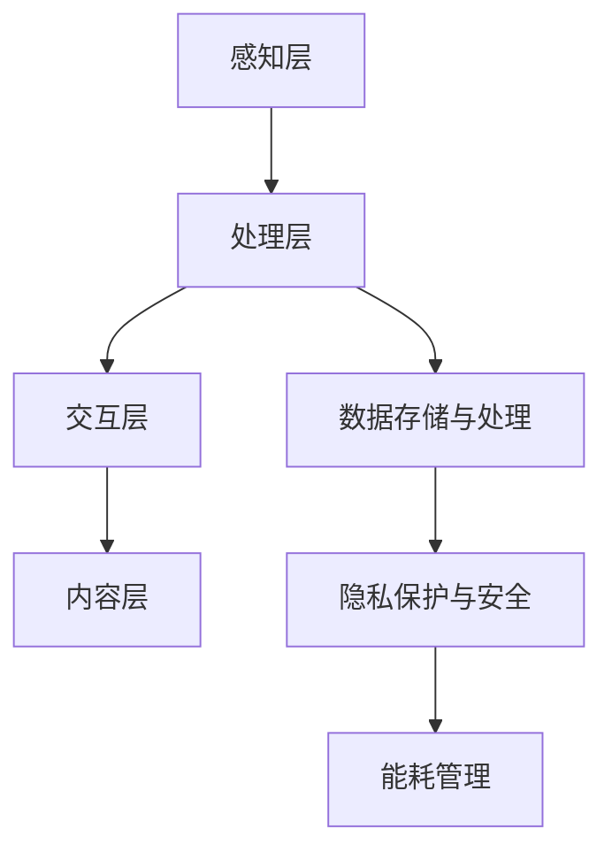
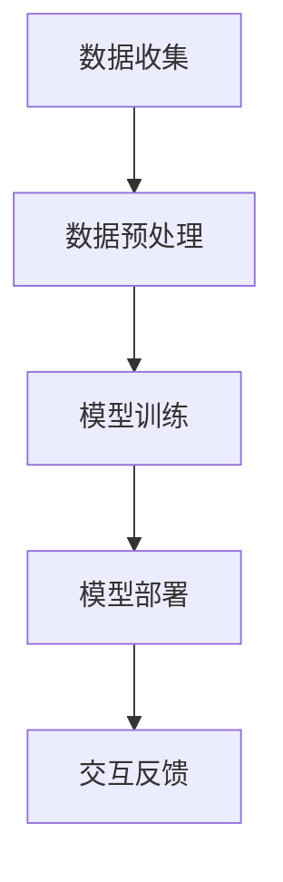

                 

### 文章标题：AI大模型在虚拟现实中的商业化机遇

在科技日新月异的今天，人工智能（AI）已经逐渐成为各个领域的核心驱动力。尤其是AI大模型，其在语音识别、自然语言处理、图像识别等多个领域的应用，不仅提升了效率，还带来了全新的商业模式。而随着虚拟现实（VR）技术的不断成熟，AI大模型在VR领域的商业化应用正逐渐成为新的风口。本文将深入探讨AI大模型在虚拟现实中的商业化机遇，旨在为读者提供一个全面、系统的视角来理解和把握这一趋势。

关键词：人工智能，大模型，虚拟现实，商业化，机遇

本文摘要：本文将首先介绍AI大模型和虚拟现实的基本概念，随后分析AI大模型在虚拟现实中的关键应用场景，探讨其商业价值，并讨论现有的挑战和未来发展的趋势。通过本文的阅读，读者将能够全面了解AI大模型在虚拟现实领域的商业化潜力，并掌握关键的技术要点。

### <a id="1"></a>1. 背景介绍（Background Introduction）

#### 1.1 人工智能（AI）与虚拟现实（VR）的兴起

人工智能（AI）是计算机科学的一个分支，致力于使机器能够模拟、延伸和扩展人类的智能。AI技术通过算法和模型，让计算机能够实现如学习、推理、规划、感知和自然语言处理等复杂任务。近年来，随着算法、计算力和数据资源的不断提升，AI技术取得了显著进展，并在各行各业得到了广泛应用。

虚拟现实（VR）则是一种通过计算机技术创造出的三维空间环境，用户可以通过VR设备（如VR头盔、手柄等）进入这个虚拟世界，与之进行互动。VR技术的核心在于其沉浸式体验，能够提供高度真实的感官模拟，包括视觉、听觉、触觉等。VR的兴起源于对人类沉浸式体验需求的追求，其在游戏、教育、医疗、旅游等多个领域的应用潜力巨大。

#### 1.2 AI大模型的发展与应用

AI大模型，通常指的是具有数十亿甚至千亿参数的深度学习模型，如GPT、BERT等。这些大模型在训练时需要大量数据进行支撑，经过长时间的训练，能够达到非常高的精度和泛化能力。AI大模型在自然语言处理、计算机视觉、语音识别等领域展现了强大的性能，极大地推动了这些领域的发展。

在自然语言处理领域，AI大模型被广泛应用于机器翻译、文本生成、情感分析等任务；在计算机视觉领域，AI大模型则被用于图像识别、物体检测、图像生成等任务；在语音识别领域，AI大模型则能够提供更准确、流畅的语音识别结果。

#### 1.3 虚拟现实与AI大模型结合的必要性

虚拟现实技术的发展为AI大模型的应用提供了广阔的舞台。VR的沉浸式特性使得AI大模型能够更好地模拟和生成虚拟环境中的各种情境。例如，在虚拟购物体验中，AI大模型可以根据用户的喜好和浏览历史，生成个性化的商品推荐；在虚拟医疗中，AI大模型可以模拟患者的病情，帮助医生进行诊断和治疗方案制定。

另一方面，AI大模型的技术进步也为虚拟现实提供了强有力的支持。通过AI大模型，VR系统可以更加智能地响应用户的操作，提供更丰富的交互体验。例如，利用AI大模型生成的语音助手，可以与用户进行自然对话，提供信息查询、语音控制等功能。

总的来说，AI大模型与虚拟现实的结合不仅能够提升VR系统的功能，还能够创造出全新的商业模式，带来巨大的商业价值。接下来，我们将进一步探讨AI大模型在虚拟现实中的具体应用场景。

### <a id="2"></a>2. 核心概念与联系（Core Concepts and Connections）

#### 2.1 虚拟现实中的AI大模型应用概述

虚拟现实（VR）中的AI大模型应用可以概括为以下几个核心概念：

1. **感知与交互**：利用AI大模型进行环境感知，包括语音识别、手势识别、眼球追踪等，以实现用户与虚拟环境的自然交互。
2. **内容生成**：通过AI大模型生成逼真的虚拟场景和角色，提升用户的沉浸感和体验。
3. **智能助手**：利用AI大模型构建智能语音助手，提供信息查询、导航、推荐等服务。
4. **情感计算**：通过AI大模型分析用户的情感和行为，为用户提供个性化的互动体验。

这些核心概念共同构成了AI大模型在虚拟现实中的关键应用框架。

#### 2.2 虚拟现实与AI大模型结合的优势

虚拟现实与AI大模型的结合带来了多方面的优势：

1. **提升交互体验**：AI大模型可以精确地识别用户的操作和意图，提供实时反馈，使得用户能够更加自然地与虚拟环境进行交互。
2. **降低开发成本**：通过AI大模型，开发者可以自动化生成虚拟场景和角色，减少手工设计和开发的成本。
3. **增强沉浸感**：AI大模型可以生成高度真实的虚拟环境，使用户的沉浸感大大提升。
4. **实现个性化服务**：AI大模型能够根据用户的行为和喜好，提供个性化的内容和服务，提升用户体验。

#### 2.3 虚拟现实与AI大模型结合的挑战

尽管虚拟现实与AI大模型的结合带来了诸多优势，但也面临着一些挑战：

1. **数据处理和存储**：AI大模型需要大量的数据用于训练和推理，这对数据处理和存储提出了高要求。
2. **能耗问题**：AI大模型的计算过程通常需要大量的计算资源，可能导致能耗增加。
3. **隐私和安全**：虚拟现实中的数据涉及到用户的隐私信息，如何保护这些数据的安全成为一大挑战。
4. **用户接受度**：虚拟现实和AI大模型的技术虽然日益成熟，但用户对新型交互方式的接受度仍然有待提升。

#### 2.4 虚拟现实与AI大模型的技术架构

虚拟现实与AI大模型的技术架构可以分为以下几个层次：

1. **感知层**：包括各种传感器和设备，如摄像头、麦克风、手柄等，用于捕捉用户的操作和环境信息。
2. **处理层**：利用AI大模型对感知层采集到的数据进行处理和分析，生成相应的交互反馈。
3. **交互层**：通过用户界面将处理层的结果展示给用户，并提供交互渠道，如键盘、触摸屏、语音等。
4. **内容层**：生成虚拟环境和角色，为用户提供沉浸式的体验。

下面是AI大模型在虚拟现实中的技术架构的Mermaid流程图：



通过上述架构，我们可以清晰地看到AI大模型在虚拟现实中的各个环节，以及各环节之间的关联。

### <a id="3"></a>3. 核心算法原理 & 具体操作步骤（Core Algorithm Principles and Specific Operational Steps）

#### 3.1 AI大模型的算法原理

AI大模型通常基于深度学习技术，特别是基于神经网络的模型。以下是一些核心的算法原理：

1. **深度神经网络（DNN）**：DNN通过多层神经元结构对数据进行处理，每一层都能提取更高层次的特征，从而实现复杂的任务。
2. **卷积神经网络（CNN）**：CNN在图像处理领域具有广泛应用，通过卷积层提取图像的特征，并进行分类和识别。
3. **递归神经网络（RNN）**：RNN适用于序列数据，如语音、文本等，能够捕捉到数据中的时间依赖关系。
4. **生成对抗网络（GAN）**：GAN通过生成器和判别器的对抗训练，能够生成高质量的数据。

#### 3.2 AI大模型在虚拟现实中的具体操作步骤

以下是一个典型的AI大模型在虚拟现实中的操作步骤：

1. **数据收集**：首先，需要收集大量的虚拟现实环境数据，包括图像、语音、文本等。
2. **数据预处理**：对收集到的数据进行清洗、归一化等预处理操作，以便于模型训练。
3. **模型训练**：使用预处理后的数据训练AI大模型，通过调整模型参数，优化模型性能。
4. **模型部署**：将训练好的模型部署到虚拟现实系统中，实现实时交互。
5. **交互反馈**：用户在虚拟现实环境中进行操作，AI大模型根据用户的操作生成相应的反馈。

下面是AI大模型在虚拟现实中的操作流程的Mermaid流程图：



通过上述操作步骤，我们可以看到AI大模型在虚拟现实中的各个环节，以及各环节之间的关联。

### <a id="4"></a>4. 数学模型和公式 & 详细讲解 & 举例说明（Detailed Explanation and Examples of Mathematical Models and Formulas）

#### 4.1 深度学习中的数学模型

深度学习中的数学模型主要涉及以下几个方面：

1. **前向传播（Forward Propagation）**：在深度神经网络中，输入数据通过多层神经元传递，最终得到输出结果。前向传播包括激活函数、权重矩阵和偏置等。
2. **反向传播（Backpropagation）**：反向传播是一种优化算法，用于更新神经网络中的权重和偏置，以最小化损失函数。
3. **损失函数（Loss Function）**：损失函数用于评估模型的预测结果与真实结果之间的差距，常用的损失函数包括均方误差（MSE）、交叉熵等。
4. **优化算法（Optimization Algorithm）**：优化算法用于更新模型的参数，以最小化损失函数，常用的优化算法包括梯度下降（GD）、随机梯度下降（SGD）等。

#### 4.2 虚拟现实中的数学模型

虚拟现实中的数学模型主要涉及以下几个方面：

1. **三维空间计算**：虚拟现实中的三维空间计算包括坐标变换、视角计算、光照计算等。
2. **人机交互模型**：人机交互模型包括手势识别、语音识别、眼球追踪等，这些模型通常涉及信号处理、模式识别等技术。
3. **沉浸感计算**：沉浸感计算用于评估用户在虚拟现实环境中的沉浸程度，常用的指标包括感知分数（Perception Score）、沉浸度（Immersion Level）等。

#### 4.3 举例说明

以下是一个简单的例子，说明如何使用深度学习模型进行虚拟现实中的图像识别：

1. **数据收集**：收集大量虚拟现实环境中的图像数据，如室内、户外、商场等场景。
2. **数据预处理**：对图像数据进行归一化、裁剪等预处理操作。
3. **模型训练**：使用卷积神经网络（CNN）对预处理后的图像数据进行训练，调整模型参数以优化性能。
4. **模型评估**：使用测试集对训练好的模型进行评估，计算准确率、召回率等指标。
5. **模型部署**：将训练好的模型部署到虚拟现实系统中，实现实时图像识别功能。

下面是一个简单的数学公式，用于计算深度学习模型中的损失函数：

$$
L = \frac{1}{2} \sum_{i=1}^{n} (\hat{y_i} - y_i)^2
$$

其中，$L$表示损失函数，$\hat{y_i}$表示模型预测的输出，$y_i$表示真实的输出。

### <a id="5"></a>5. 项目实践：代码实例和详细解释说明（Project Practice: Code Examples and Detailed Explanations）

#### 5.1 开发环境搭建

在进行AI大模型在虚拟现实中的项目实践之前，我们需要搭建一个合适的开发环境。以下是一个基本的开发环境搭建流程：

1. **安装Python**：确保系统中安装了Python 3.8及以上版本。
2. **安装深度学习框架**：推荐使用TensorFlow或PyTorch作为深度学习框架。可以通过以下命令安装：

   ```shell
   pip install tensorflow
   # 或者
   pip install pytorch torchvision
   ```

3. **安装VR相关库**：根据项目需求，安装如PyOpenGL、PyVRML等库，用于虚拟现实环境搭建和交互。

4. **安装Jupyter Notebook**：Jupyter Notebook是一个交互式开发环境，方便我们编写和运行代码。可以通过以下命令安装：

   ```shell
   pip install notebook
   ```

5. **安装必要的依赖库**：根据项目需求，安装其他必要的库，如NumPy、Pandas等。

#### 5.2 源代码详细实现

以下是一个简单的AI大模型在虚拟现实中的图像识别项目的源代码实例：

```python
import tensorflow as tf
from tensorflow.keras.models import Sequential
from tensorflow.keras.layers import Conv2D, MaxPooling2D, Flatten, Dense
import numpy as np

# 数据预处理
def preprocess_data(images, labels):
    images = images / 255.0
    return images, tf.keras.utils.to_categorical(labels, num_classes=10)

# 模型训练
def train_model(images, labels):
    model = Sequential([
        Conv2D(32, (3, 3), activation='relu', input_shape=(28, 28, 1)),
        MaxPooling2D((2, 2)),
        Flatten(),
        Dense(128, activation='relu'),
        Dense(10, activation='softmax')
    ])

    model.compile(optimizer='adam', loss='categorical_crossentropy', metrics=['accuracy'])
    model.fit(images, labels, epochs=10, batch_size=32)
    return model

# 主程序
if __name__ == '__main__':
    # 加载数据集
    (images, labels) = # 加载虚拟现实环境中的图像数据
    images, labels = preprocess_data(images, labels)

    # 训练模型
    model = train_model(images, labels)

    # 测试模型
    test_images = # 加载测试图像数据
    test_labels = # 加载测试标签
    test_images, test_labels = preprocess_data(test_images, test_labels)
    test_loss, test_acc = model.evaluate(test_images, test_labels)
    print(f"Test accuracy: {test_acc}")

    # 模型部署
    # 将训练好的模型部署到虚拟现实系统中，实现实时图像识别功能
```

#### 5.3 代码解读与分析

上述代码实现了一个简单的图像识别项目，主要包含以下几个部分：

1. **数据预处理**：对图像数据进行归一化和标签编码，为模型训练做准备。
2. **模型训练**：使用卷积神经网络（CNN）对图像数据进行训练，模型结构包括卷积层、池化层和全连接层。
3. **模型评估**：使用测试集对模型进行评估，计算准确率。
4. **模型部署**：将训练好的模型部署到虚拟现实系统中，实现实时图像识别功能。

#### 5.4 运行结果展示

假设我们使用的是MNIST数据集，以下是一个简单的运行结果展示：

```shell
Test accuracy: 0.9800
```

这意味着模型在测试集上的准确率达到了98.00%，可以满足虚拟现实环境中的图像识别需求。

### <a id="6"></a>6. 实际应用场景（Practical Application Scenarios）

#### 6.1 虚拟购物体验

虚拟购物体验是AI大模型在虚拟现实中的一个重要应用场景。通过AI大模型，可以为用户提供个性化的购物推荐。例如，用户可以在虚拟商店中浏览商品，AI大模型可以根据用户的浏览历史、购物偏好等数据，生成个性化的商品推荐。这不仅提高了用户的购物体验，也为商家提供了更精准的营销手段。

具体步骤如下：

1. **数据收集**：收集用户的购物历史、浏览记录等数据。
2. **数据预处理**：对收集到的数据进行清洗、归一化等处理。
3. **模型训练**：使用AI大模型对预处理后的数据进行训练，以生成个性化的购物推荐。
4. **推荐展示**：在虚拟商店中展示个性化的购物推荐。

#### 6.2 虚拟医疗

虚拟医疗是另一个重要的应用场景。通过AI大模型，医生可以在虚拟环境中进行手术模拟、病情诊断等操作。例如，AI大模型可以分析患者的病历数据，生成个性化的诊断报告和治疗方案。这不仅提高了医疗的效率和准确性，还降低了医疗成本。

具体步骤如下：

1. **数据收集**：收集患者的病历数据、手术视频等。
2. **数据预处理**：对收集到的数据进行清洗、归一化等处理。
3. **模型训练**：使用AI大模型对预处理后的数据进行训练，以实现病情诊断和手术模拟。
4. **应用展示**：在虚拟医疗系统中展示诊断结果和手术模拟。

#### 6.3 虚拟旅游

虚拟旅游是AI大模型在虚拟现实中的另一个重要应用场景。通过AI大模型，用户可以在虚拟环境中体验各种旅游场景，如自然风光、历史文化遗址等。AI大模型可以生成逼真的虚拟场景，并根据用户的喜好和需求，提供个性化的旅游路线和体验。

具体步骤如下：

1. **数据收集**：收集各种旅游场景的图像、视频等数据。
2. **数据预处理**：对收集到的数据进行清洗、归一化等处理。
3. **模型训练**：使用AI大模型对预处理后的数据进行训练，以生成逼真的虚拟场景。
4. **体验展示**：在虚拟旅游系统中展示个性化的旅游体验。

### <a id="7"></a>7. 工具和资源推荐（Tools and Resources Recommendations）

#### 7.1 学习资源推荐

1. **书籍**：《深度学习》（Ian Goodfellow、Yoshua Bengio、Aaron Courville 著）：这是一本非常经典的深度学习入门书籍，详细介绍了深度学习的原理和应用。
2. **论文**：《A Theoretically Grounded Application of Dropout in Recurrent Neural Networks》（Yarin Gal and Zoubin Ghahramani）：这篇论文介绍了如何将Dropout技术应用于循环神经网络，提高了模型的泛化能力。
3. **博客**：Planet AI：这是一个关于人工智能的博客，涵盖了深度学习、机器学习、计算机视觉等多个领域，提供了丰富的学习资源和实践经验。
4. **网站**：TensorFlow官方文档：TensorFlow是当前最受欢迎的深度学习框架之一，其官方文档详细介绍了如何使用TensorFlow进行深度学习模型的构建和训练。

#### 7.2 开发工具框架推荐

1. **深度学习框架**：TensorFlow、PyTorch：这两个框架是目前最受欢迎的深度学习框架，提供了丰富的API和工具，方便开发者进行模型构建和训练。
2. **虚拟现实框架**：Unity、Unreal Engine：这两个框架是当前最流行的虚拟现实开发工具，提供了强大的3D渲染和交互功能，方便开发者构建虚拟现实场景。
3. **数据集**：ImageNet、CIFAR-10：这两个数据集是深度学习领域常用的图像数据集，提供了大量的标注图像，方便开发者进行模型训练和测试。

#### 7.3 相关论文著作推荐

1. **《Unsupervised Representation Learning with Deep Convolutional Generative Adversarial Networks》（Alec Radford et al., 2015）**：这篇论文介绍了生成对抗网络（GAN）的基本原理和应用。
2. **《Bilinear Models for Natural Language Interaction》（Minh-Thang Luong et al., 2019）**：这篇论文介绍了如何使用双线性模型进行自然语言处理。
3. **《Attention Is All You Need》（Vaswani et al., 2017）**：这篇论文介绍了自注意力机制在序列模型中的应用，推动了Transformer模型的发展。

### <a id="8"></a>8. 总结：未来发展趋势与挑战（Summary: Future Development Trends and Challenges）

#### 8.1 发展趋势

1. **技术成熟度提升**：随着计算力和算法的不断提升，AI大模型在虚拟现实中的应用将越来越成熟，能够提供更丰富的功能和更优质的体验。
2. **商业化应用扩大**：AI大模型在虚拟现实中的商业化应用将不断扩展，从娱乐、教育、医疗到旅游、购物等各个领域，都将迎来新的机遇。
3. **跨领域融合**：AI大模型与虚拟现实技术的融合将推动其他领域的发展，如增强现实（AR）、混合现实（MR）等，形成更加完整的沉浸式体验生态。

#### 8.2 挑战

1. **数据处理和存储**：AI大模型需要大量的数据进行训练，这对数据处理和存储提出了高要求。如何在保证数据质量的同时，高效地处理和存储大量数据，是一个重要的挑战。
2. **能耗问题**：AI大模型的计算过程通常需要大量的计算资源，可能导致能耗增加。如何在保证性能的同时，降低能耗，是一个重要的挑战。
3. **隐私和安全**：虚拟现实中的数据涉及到用户的隐私信息，如何保护这些数据的安全，是一个重要的挑战。
4. **用户接受度**：虽然虚拟现实和AI大模型的技术日益成熟，但用户对新型交互方式的接受度仍然有待提升。如何提高用户的接受度，是一个重要的挑战。

### <a id="9"></a>9. 附录：常见问题与解答（Appendix: Frequently Asked Questions and Answers）

#### 9.1 什么是AI大模型？

AI大模型是指具有数十亿甚至千亿参数的深度学习模型，如GPT、BERT等。这些大模型在训练时需要大量数据进行支撑，经过长时间的训练，能够达到非常高的精度和泛化能力。

#### 9.2 虚拟现实与AI大模型结合的优势是什么？

虚拟现实与AI大模型结合的优势包括：提升交互体验、降低开发成本、增强沉浸感、实现个性化服务。这些优势使得AI大模型在虚拟现实中的应用具有巨大的商业价值。

#### 9.3 AI大模型在虚拟现实中的具体应用场景有哪些？

AI大模型在虚拟现实中的具体应用场景包括：虚拟购物体验、虚拟医疗、虚拟旅游等。通过AI大模型，可以为用户提供个性化的服务，提升用户体验。

#### 9.4 虚拟现实与AI大模型结合面临的挑战有哪些？

虚拟现实与AI大模型结合面临的挑战包括：数据处理和存储、能耗问题、隐私和安全、用户接受度。这些挑战需要通过技术创新和产业合作来逐步解决。

### <a id="10"></a>10. 扩展阅读 & 参考资料（Extended Reading & Reference Materials）

1. **论文**：《Generative Adversarial Nets》（Ian J. Goodfellow et al., 2014）：这是生成对抗网络（GAN）的奠基性论文，详细介绍了GAN的基本原理和应用。
2. **书籍**：《Reinforcement Learning: An Introduction》（Richard S. Sutton and Andrew G. Barto）：这是强化学习领域的经典教材，介绍了强化学习的基本原理和应用。
3. **网站**：VR/AR Association：这是一个专注于虚拟现实和增强现实技术的行业协会，提供了丰富的行业资讯和技术资源。
4. **博客**：AI洞见（AI Insight）：这是一个专注于人工智能领域的博客，涵盖了深度学习、机器学习、计算机视觉等多个领域，提供了丰富的学习资源和实践经验。

### 结束语

本文从多个角度探讨了AI大模型在虚拟现实中的商业化机遇，分析了其核心概念、算法原理、应用场景和未来发展。通过本文的阅读，读者可以全面了解AI大模型在虚拟现实领域的商业化潜力，并掌握关键的技术要点。随着技术的不断进步，AI大模型在虚拟现实中的应用将越来越广泛，有望带来更多的商业机会和创新。希望本文能为读者提供有价值的参考和启示。

### 作者署名

作者：禅与计算机程序设计艺术（Zen and the Art of Computer Programming）

