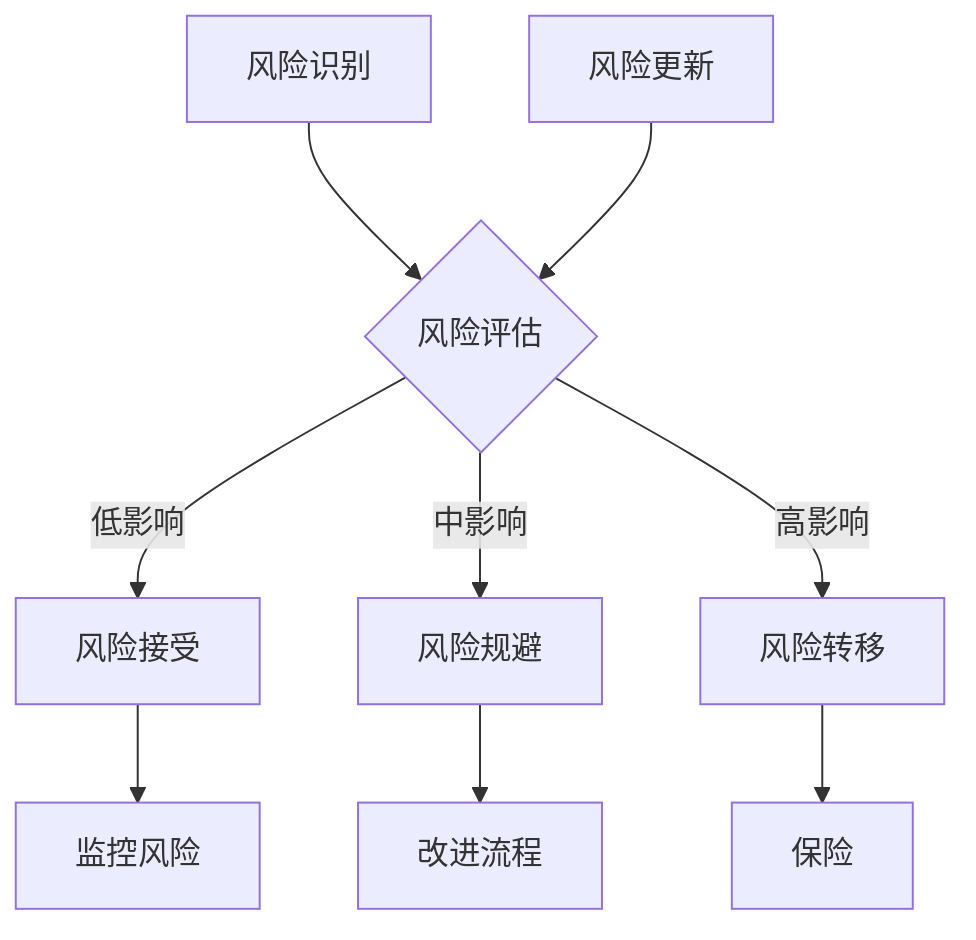
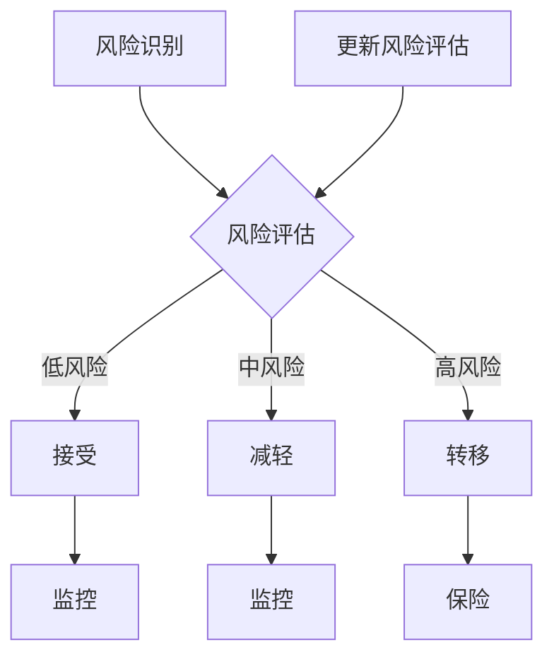

                 

### 文章标题

### Title: Risk Management in Knowledge付费创业

> **Keywords**: Knowledge付费, 创业, 风险管理, Investment, Market Analysis, Financial Management.

> **Abstract**: This article delves into the intricate landscape of knowledge付费创业，examining the various risks associated with it and offering practical strategies for effective risk management. By understanding market dynamics and financial implications, entrepreneurs can navigate this competitive domain with greater confidence and resilience.

### 文章标题

### Title: 风险管理在知识付费创业中的应用

> **关键词**: 知识付费，创业，风险管理，投资，市场分析，财务管理。

> **摘要**: 本文深入探讨了知识付费创业的复杂领域，分析了与之相关的各种风险，并提供了有效的风险管理策略。通过了解市场动态和财务影响，企业家可以更加自信和坚韧地在这个竞争激烈的领域中前行。

### 约束条件 CONSTRAINTS ###

- 字数要求：文章字数一定要大于8000字
- 语言要求：按照段落用中文+英文双语的方式
- 文章各个段落章节的子目录请具体细化到三级目录
- 格式要求：文章内容使用markdown格式输出
- 完整性要求：文章内容必须要完整，不能只提供概要性的框架和部分内容，不要只是给出目录。不要只给概要性的框架和部分内容
- 作者署名：文章末尾需要写上作者署名 “作者：禅与计算机程序设计艺术 / Zen and the Art of Computer Programming”
- 内容要求：文章核心章节内容必须包含如下目录内容(文章结构模板)：

```
# 文章标题

## 1. 背景介绍（Background Introduction）

## 2. 核心概念与联系（Core Concepts and Connections）（备注：必须给出核心概念原理和架构的 Mermaid 流程图(Mermaid 流程节点中不要有括号、逗号等特殊字符)
## 2.1 核心概念
## 2.2 风险管理模型
## 2.3 风险管理流程图

## 3. 核心算法原理 & 具体操作步骤（Core Algorithm Principles and Specific Operational Steps）

## 4. 数学模型和公式 & 详细讲解 & 举例说明（Detailed Explanation and Examples of Mathematical Models and Formulas）（备注：数学公式请使用latex格式，latex嵌入文中独立段落使用 $$，段落内使用 $)

## 5. 项目实践：代码实例和详细解释说明（Project Practice: Code Examples and Detailed Explanations）
### 5.1 开发环境搭建
### 5.2 源代码详细实现
### 5.3 代码解读与分析
### 5.4 运行结果展示

## 6. 实际应用场景（Practical Application Scenarios）

## 7. 工具和资源推荐（Tools and Resources Recommendations）
### 7.1 学习资源推荐（书籍/论文/博客/网站等）
### 7.2 开发工具框架推荐
### 7.3 相关论文著作推荐

## 8. 总结：未来发展趋势与挑战（Summary: Future Development Trends and Challenges）

## 9. 附录：常见问题与解答（Appendix: Frequently Asked Questions and Answers）

## 10. 扩展阅读 & 参考资料（Extended Reading & Reference Materials）
```

### 1. 背景介绍（Background Introduction）

知识付费，也被称为“付费知识”或“知识变现”，是一种在互联网时代迅速兴起的商业模式。它指的是知识创造者通过在线平台向用户提供有价值的信息、知识和技能，并以收费的形式获取收益。这一模式的出现，不仅为知识工作者提供了新的收入来源，也使消费者能够以较低的成本获取高质量的知识和资源。

近年来，知识付费市场呈现出爆发式增长。根据相关报告，全球知识付费市场规模在2021年已达到500亿美元，预计到2025年将突破1000亿美元。在中国，知识付费市场更是呈现出迅猛的增长态势。从在线课程、电子书到专业咨询、直播讲座，各种知识付费产品层出不穷，吸引了大量用户。

知识付费创业成为许多创业者眼中的“香饽饽”。他们希望通过提供独特的知识产品，满足消费者的需求，实现商业价值的最大化。然而，在这片看似繁荣的市场背后，风险却如影随形。

首先，市场风险是不可忽视的一个重要因素。知识付费市场的竞争日益激烈，新玩家不断涌现，给现有企业带来了巨大的压力。创业者需要具备敏锐的市场洞察力，准确把握市场需求，才能在激烈的市场竞争中站稳脚跟。

其次，内容风险也是一个关键问题。知识付费的核心在于内容的价值和质量。如果创业者无法提供高质量的内容，或者内容更新速度跟不上市场的需求，将很难在市场中立足。此外，知识产权问题也可能成为内容风险的一个重要方面。

第三，财务风险同样不容小觑。知识付费创业通常需要投入大量的资金和资源，包括内容制作、营销推广、平台建设等。如果资金运作不当，可能导致资金链断裂，影响企业的正常运营。

最后，法律风险也是创业者需要关注的一个方面。知识付费涉及多个法律和法规问题，如版权、合同、隐私保护等。如果创业者不熟悉相关法律，可能面临巨大的法律风险。

总之，知识付费创业虽然充满了机遇，但同时也伴随着各种风险。只有充分了解并有效管理这些风险，创业者才能在这片市场中获得成功。

### 1. Background Introduction

Knowledge-based payment, also known as "knowledge monetization," has rapidly emerged as a business model in the internet era. It refers to the process in which knowledge creators offer valuable information, knowledge, and skills to users through online platforms and charge for it to generate revenue. This model not only provides new income sources for knowledge workers but also enables consumers to access high-quality knowledge and resources at a relatively low cost.

In recent years, the market for knowledge-based payment has experienced explosive growth. According to relevant reports, the global market size reached $50 billion in 2021 and is expected to exceed $100 billion by 2025. In China, the knowledge-based payment market has shown a surge in growth, with various knowledge-based payment products such as online courses, e-books, professional consulting, and live lectures emerging and attracting a large number of users.

Entrepreneurship in the knowledge-based payment sector has become a "hot topic" for many aspiring entrepreneurs. They hope to provide unique knowledge products to meet consumer demand and achieve maximum commercial value. However, behind this seemingly prosperous market lies a host of risks.

Firstly, market risk is an essential factor that cannot be ignored. The competition in the knowledge-based payment market is becoming increasingly fierce, with new players emerging constantly, putting significant pressure on existing enterprises. Entrepreneurs need to have a keen market awareness to accurately grasp market demand and establish a firm foothold in the competitive market.

Secondly, content risk is a critical issue. The core of knowledge-based payment is the value and quality of the content. If entrepreneurs fail to provide high-quality content or the content fails to keep up with market demand, it will be difficult for them to establish a foothold in the market. Additionally, intellectual property issues may also become a significant aspect of content risk.

Thirdly, financial risk is also not to be underestimated. Knowledge-based payment entrepreneurship typically requires substantial investment and resources, including content production, marketing promotion, and platform construction. Inadequate financial management can lead to a broken capital chain and affect the normal operation of the enterprise.

Lastly, legal risk is another aspect that entrepreneurs need to pay attention to. Knowledge-based payment involves multiple legal and regulatory issues, such as copyright, contract, and privacy protection. If entrepreneurs are unfamiliar with relevant laws, they may face significant legal risks.

In summary, while entrepreneurship in the knowledge-based payment sector presents many opportunities, it also comes with various risks. Only by fully understanding and effectively managing these risks can entrepreneurs achieve success in this market.

### 2. 核心概念与联系（Core Concepts and Connections）

#### 2.1 风险管理

风险管理是指识别、评估、优先处理和监控与特定项目、投资或企业相关的潜在风险的过程。在知识付费创业中，风险管理尤为重要，因为它涉及到资金、内容、市场等多个方面的潜在威胁。

- **定义**: 风险管理（Risk Management）是指企业为了实现其目标，通过识别、评估、优先处理和监控潜在风险，以最小化不利影响或最大化机会的过程。

- **目标**: 风险管理的目标是确保企业的长期稳定性和盈利能力，同时最大化潜在收益。

- **方法**: 风险管理包括风险评估、风险规避、风险转移和风险接受等方法。

#### 2.2 风险管理模型

在知识付费创业中，常用的风险管理模型包括SWOT分析、风险评估矩阵和蒙特卡洛模拟等。

- **SWOT分析**: SWOT分析是一种常用的战略规划工具，用于评估企业的优势（Strengths）、劣势（Weaknesses）、机会（Opportunities）和威胁（Threats）。

- **风险评估矩阵**: 风险评估矩阵是一种用于评估风险的可能性和影响的方法，通常以矩阵的形式展示。

- **蒙特卡洛模拟**: 蒙特卡洛模拟是一种基于概率和随机数的计算方法，用于预测不确定情况下的风险和结果。

#### 2.3 风险管理流程图

风险管理流程通常包括以下步骤：

1. **风险识别**: 确定可能影响企业目标的潜在风险。
2. **风险评估**: 评估每个风险的可能性和影响。
3. **风险优先级排序**: 根据风险的可能性和影响，确定风险处理的优先级。
4. **风险处理**: 选择合适的策略来处理风险，如风险规避、风险转移或风险接受。
5. **风险监控**: 监控已识别的风险，确保风险处理措施的有效性。
6. **风险更新**: 定期更新风险识别、评估和处理，以适应企业环境的变化。



#### 2.4 风险管理的重要性

在知识付费创业中，风险管理的重要性体现在以下几个方面：

- **提高成功率**: 通过风险管理，创业者可以识别并处理潜在风险，从而提高创业项目的成功率。
- **确保财务稳定**: 有效管理风险可以确保企业的资金流动性和财务稳定性。
- **优化决策过程**: 风险管理可以帮助创业者更好地评估不同选择的风险和收益，从而做出更优的决策。
- **增强企业竞争力**: 通过持续的风险管理，企业可以保持对市场变化的敏锐反应，增强竞争力。

### 2. Core Concepts and Connections

#### 2.1 Risk Management

Risk management is the process of identifying, assessing, prioritizing, and monitoring potential risks associated with a specific project, investment, or business. Risk management is particularly important in knowledge-based payment entrepreneurship, as it involves various aspects such as capital, content, and market risks.

- **Definition**: Risk management is the process of identifying, assessing, prioritizing, and monitoring potential risks to minimize adverse impacts or maximize opportunities while achieving an organization's goals.

- **Objectives**: The goal of risk management is to ensure the long-term stability and profitability of the business while maximizing potential returns.

- **Methods**: Risk management includes methods such as risk assessment, risk avoidance, risk transfer, and risk acceptance.

#### 2.2 Risk Management Models

Common risk management models used in knowledge-based payment entrepreneurship include SWOT analysis, risk assessment matrices, and Monte Carlo simulation.

- **SWOT Analysis**: SWOT analysis is a commonly used strategic planning tool to evaluate an organization's strengths, weaknesses, opportunities, and threats.

- **Risk Assessment Matrix**: A risk assessment matrix is a method used to evaluate the likelihood and impact of each risk and typically presented in a matrix format.

- **Monte Carlo Simulation**: Monte Carlo simulation is a computational method based on probability and random numbers used to predict risks and results under uncertain conditions.

#### 2.3 Risk Management Process Diagram

The risk management process typically includes the following steps:

1. **Risk Identification**: Determine potential risks that may affect the organization's goals.
2. **Risk Assessment**: Assess the likelihood and impact of each identified risk.
3. **Risk Prioritization**: Prioritize risks based on their likelihood and impact to determine risk handling priorities.
4. **Risk Handling**: Select appropriate strategies to handle risks, such as risk avoidance, risk transfer, or risk acceptance.
5. **Risk Monitoring**: Monitor identified risks to ensure the effectiveness of risk handling measures.
6. **Risk Update**: Regularly update risk identification, assessment, and handling to adapt to changes in the business environment.


#### 2.4 Importance of Risk Management

The importance of risk management in knowledge-based payment entrepreneurship is reflected in the following aspects:

- **Increase Success Rate**: Through risk management, entrepreneurs can identify and address potential risks, thereby increasing the success rate of their ventures.
- **Ensure Financial Stability**: Effective risk management can ensure the liquidity and financial stability of the business.
- **Optimize Decision-Making**: Risk management helps entrepreneurs better assess the risks and returns of different options, leading to more optimal decisions.
- **Enhance Competitive Advantage**: Through continuous risk management, a business can maintain a keen response to market changes, enhancing its competitive advantage.

### 2. 核心概念与联系（Core Concepts and Connections）

#### 2.1 风险管理

风险管理是指对企业或项目面临的各种潜在风险进行识别、评估、优先排序并采取相应措施进行控制的过程。在知识付费创业中，风险管理尤为重要，因为创业者需要面对市场波动、竞争压力、内容质量、资金流动等多方面的风险。

- **定义**: 风险管理（Risk Management）是指通过系统的方法来识别、评估、优先处理和监控风险，以确保企业目标的实现并最大限度地减少潜在损失。

- **目标**: 风险管理的目标包括降低风险带来的负面影响、提高企业的适应性和灵活性，以及确保企业的长期生存和发展。

- **方法**: 风险管理的方法包括风险规避、风险减轻、风险转移、风险接受和风险监控等。

#### 2.2 风险管理模型

风险管理模型是帮助创业者进行风险管理的工具，常见的风险管理模型有：

- **SWOT分析**: 对企业的优势（Strengths）、劣势（Weaknesses）、机会（Opportunities）和威胁（Threats）进行综合分析，以便更好地了解企业的内外部环境。

- **PEST分析**: 分析企业所处的政治（Political）、经济（Economic）、社会（Social）和技术（Technological）环境，以识别可能影响企业运营的外部因素。

- **风险评估矩阵**: 通过对风险的严重性和可能性进行量化评估，将风险分类并制定相应的应对策略。

#### 2.3 风险管理流程图

风险管理流程一般包括以下步骤：

1. **风险识别**: 通过访谈、问卷调查、市场调研等方式识别潜在的风险。

2. **风险评估**: 对识别出的风险进行定性或定量评估，确定其严重性和可能性。

3. **风险优先级排序**: 根据风险评估结果，对风险进行优先级排序，确定哪些风险需要优先处理。

4. **风险应对策略制定**: 根据风险的特点和优先级，制定相应的风险应对策略。

5. **风险监控**: 对实施的风险应对措施进行监控，确保风险得到有效控制。

6. **风险更新**: 定期对风险进行重新评估和更新，以适应不断变化的环境。



#### 2.4 风险管理的重要性

在知识付费创业中，风险管理的重要性体现在以下几个方面：

- **确保企业稳定**: 通过风险管理，企业可以识别和应对潜在的风险，确保企业的稳定运营。

- **提高决策效率**: 风险管理有助于创业者更好地评估各种选择的潜在风险，从而做出更明智的决策。

- **保护企业利益**: 风险管理可以最大限度地减少因风险事件造成的损失，保护企业的利益。

- **增强市场竞争力**: 通过有效的风险管理，企业可以更好地适应市场变化，增强其市场竞争力。

### 3. 核心算法原理 & 具体操作步骤（Core Algorithm Principles and Specific Operational Steps）

#### 3.1 风险评估算法

风险评估是风险管理中的关键环节，其核心算法通常包括定性分析和定量分析。以下是一个基于定性分析和定量分析相结合的风险评估算法：

- **定性分析**：
  1. **专家评估法**：邀请相关领域专家对企业面临的潜在风险进行评估，通过专家的主观判断给出风险的严重性和可能性。
  2. **头脑风暴法**：组织团队成员进行头脑风暴，列出所有可能的风险，并对每个风险进行初步评估。
  
- **定量分析**：
  1. **概率分析**：使用概率分布来评估每个风险发生的可能性。
  2. **影响分析**：评估每个风险对企业的潜在影响，如资金损失、声誉受损等。

- **综合评估**：
  1. **矩阵评估法**：使用风险评估矩阵（如风险矩阵、影响矩阵）来评估每个风险的综合得分。
  2. **权重分配**：根据每个风险的得分和重要性，分配相应的权重。

#### 3.2 风险应对策略算法

在评估了风险后，需要制定相应的风险应对策略。以下是一个基于决策树模型的风险应对策略算法：

1. **风险识别**：确定所有已评估的风险。
2. **策略选择**：
   1. **规避策略**：通过改变业务模式或项目计划来避免风险。
   2. **减轻策略**：通过增加控制措施来减少风险的影响。
   3. **转移策略**：通过购买保险或签订合同将风险转移给第三方。
   4. **接受策略**：对于无法避免或转移的风险，制定监控和应急计划。
3. **策略评估**：评估每个策略的可行性、成本和效益。
4. **策略实施**：根据评估结果选择最优策略，并实施具体措施。

#### 3.3 风险监控算法

风险监控是确保风险应对策略有效性的关键步骤。以下是一个基于实时监控和预警系统风险监控算法：

1. **数据收集**：收集与企业风险相关的各种数据，如市场数据、财务数据、技术数据等。
2. **数据分析**：使用数据挖掘和统计分析方法对收集到的数据进行处理和分析，识别潜在风险。
3. **预警系统**：建立实时预警系统，当风险达到设定的阈值时，自动发出警报。
4. **风险响应**：根据预警信息，及时采取相应的应对措施，确保风险得到有效控制。

### 3. Core Algorithm Principles & Specific Operational Steps

#### 3.1 Risk Assessment Algorithm

Risk assessment is a critical component of risk management, and its core algorithm typically involves both qualitative and quantitative analysis. Here is a risk assessment algorithm that combines qualitative and quantitative analysis:

- **Qualitative Analysis**:
  1. **Expert Evaluation Method**: Inviting experts in the relevant field to assess the potential risks faced by the business based on their subjective judgment to determine the severity and likelihood of each risk.
  2. **Brainstorming Method**: Organizing team members to brainstorm and list all possible risks, and conduct a preliminary assessment of each risk.

- **Quantitative Analysis**:
  1. **Probability Analysis**: Using probability distributions to assess the likelihood of each risk occurring.
  2. **Impact Analysis**: Assessing the potential impact of each risk on the business, such as financial losses or reputational damage.

- **Comprehensive Assessment**:
  1. **Matrix Evaluation Method**: Using risk assessment matrices (such as risk matrix and impact matrix) to assess the comprehensive score of each risk.
  2. **Weight Allocation**: Allocating corresponding weights based on each risk's score and importance.

#### 3.2 Risk Response Strategy Algorithm

After assessing the risks, it's necessary to develop appropriate risk response strategies. Here is a risk response strategy algorithm based on the decision tree model:

1. **Risk Identification**: Determine all assessed risks.
2. **Strategy Selection**:
   1. **Avoidance Strategy**: Changing the business model or project plan to avoid risk.
   2. **Mitigation Strategy**: Increasing control measures to reduce the impact of risk.
   3. **Transfer Strategy**: Purchasing insurance or signing contracts to transfer the risk to a third party.
   4. **Acceptance Strategy**: For risks that cannot be avoided or transferred, developing monitoring and emergency plans.
3. **Strategy Evaluation**: Assess the feasibility, cost, and benefits of each strategy.
4. **Strategy Implementation**: Based on the evaluation results, select the optimal strategy and implement specific measures.

#### 3.3 Risk Monitoring Algorithm

Risk monitoring is crucial for ensuring the effectiveness of risk response strategies. Here is a risk monitoring algorithm based on real-time monitoring and early warning systems:

1. **Data Collection**: Collecting various data related to business risks, such as market data, financial data, and technical data.
2. **Data Analysis**: Using data mining and statistical analysis methods to process and analyze the collected data to identify potential risks.
3. **Early Warning System**: Establishing a real-time early warning system that automatically sends alerts when risks reach set thresholds.
4. **Risk Response**: Based on the warning information, promptly take appropriate response measures to ensure effective risk control.

### 3. 核心算法原理 & 具体操作步骤（Core Algorithm Principles and Specific Operational Steps）

#### 3.1 风险评估算法

风险评估是风险管理的核心步骤，其算法通常涉及定性分析和定量分析。以下是一个结合定性分析和定量分析的评估算法：

- **定性分析**：
  1. **专家评估法**：邀请相关领域专家对企业面临的潜在风险进行评估，根据专家的主观判断确定每个风险的严重性和可能性。
  2. **头脑风暴法**：组织团队成员进行头脑风暴，列出所有可能的风险，并对每个风险进行初步评估。

- **定量分析**：
  1. **概率分析**：使用概率分布评估每个风险发生的可能性。
  2. **影响分析**：评估每个风险对企业可能造成的损失，如财务损失、声誉损害等。

- **综合评估**：
  1. **矩阵评估法**：使用风险评估矩阵（如风险矩阵和影响矩阵）计算每个风险的综合得分。
  2. **权重分配**：根据每个风险的得分和重要性，分配相应的权重。

#### 3.2 风险应对策略算法

在完成风险评估后，需要制定相应的应对策略。以下是一个基于决策树模型的风险应对策略算法：

1. **风险识别**：确定所有评估后的风险。
2. **策略选择**：
   1. **规避策略**：通过调整业务模式或项目计划来避免风险。
   2. **减轻策略**：通过增加控制措施来减少风险的影响。
   3. **转移策略**：购买保险或签订合同将风险转移给第三方。
   4. **接受策略**：对于无法避免或转移的风险，制定监控和应急计划。
3. **策略评估**：评估每个策略的可行性、成本和效益。
4. **策略实施**：根据评估结果选择最优策略，并执行具体措施。

#### 3.3 风险监控算法

风险监控是确保风险应对措施有效性的关键步骤。以下是一个基于实时监控和预警系统的风险监控算法：

1. **数据收集**：收集与企业风险相关的各种数据，如市场数据、财务数据、技术数据等。
2. **数据分析**：使用数据挖掘和统计分析方法对收集到的数据进行处理和分析，识别潜在风险。
3. **预警系统**：建立实时预警系统，当风险达到预设阈值时，自动发出警报。
4. **风险响应**：根据预警信息，及时采取相应的应对措施，确保风险得到有效控制。

### 4. 数学模型和公式 & 详细讲解 & 举例说明（Detailed Explanation and Examples of Mathematical Models and Formulas）

#### 4.1 风险评估模型

在知识付费创业中，风险评估是一个重要的环节。以下是一个常用的风险评估模型，它基于概率和损失期望的计算。

- **模型公式**：

  $$ E(R) = p \times L $$

  其中，\( E(R) \) 是期望损失，\( p \) 是风险事件发生的概率，\( L \) 是风险事件发生时的损失。

- **示例**：

  假设某知识付费创业项目面临两种风险：风险A和风险B。

  - 风险A：发生概率为30%，发生时的损失为10万元。
  - 风险B：发生概率为20%，发生时的损失为5万元。

  计算这两个风险的期望损失：

  $$ E(R_A) = 0.3 \times 10万 = 3万 $$

  $$ E(R_B) = 0.2 \times 5万 = 1万 $$

  总期望损失为：

  $$ E(R) = E(R_A) + E(R_B) = 3万 + 1万 = 4万 $$

#### 4.2 蒙特卡洛模拟

蒙特卡洛模拟是一种基于随机抽样的数值模拟方法，可用于评估不确定情况下的风险和期望收益。

- **模型公式**：

  $$ S = \sum_{i=1}^{n} X_i $$

  其中，\( S \) 是模拟结果，\( X_i \) 是第\( i \)次随机抽样的结果，\( n \) 是抽样次数。

- **示例**：

  假设我们使用蒙特卡洛模拟来评估一个知识付费创业项目的期望收益。项目收益取决于市场需求和竞争状况，这两个因素都是不确定的。

  - 市场需求：服从均值为1000，标准差为200的正态分布。
  - 竞争状况：服从均值为500，标准差为100的正态分布。

  我们进行1000次模拟，每次模拟都从两个正态分布中抽取一个样本值，计算市场需求和竞争状况的乘积，即项目收益。

  计算得到的1000次模拟收益的平均值即为项目的期望收益。

#### 4.3 风险值模型

风险值（Value at Risk, VaR）是衡量在一定置信水平下，某个投资组合可能发生的最大损失。

- **模型公式**：

  $$ VaR = -\alpha \times \sigma \times Z_{\alpha} $$

  其中，\( \alpha \) 是置信水平，\( \sigma \) 是投资组合的标准差，\( Z_{\alpha} \) 是标准正态分布的临界值。

- **示例**：

  假设我们想要计算一个知识付费创业项目的90%置信水平下的风险值。

  - 投资组合的期望收益为10万元，标准差为5万元。

  计算得到的风险值为：

  $$ VaR = -0.9 \times 5万 \times 1.28 = -4.2万 $$

  这意味着在90%的置信水平下，该投资组合可能的最大损失为4.2万元。

### 4. Mathematical Models and Formulas & Detailed Explanation & Examples

#### 4.1 Risk Assessment Model

Risk assessment is a crucial step in knowledge-based payment entrepreneurship. Here is a commonly used risk assessment model based on probability and expected loss calculations.

- **Model Formula**:

  $$ E(R) = p \times L $$

  Where \( E(R) \) is the expected loss, \( p \) is the probability of the risk event occurring, and \( L \) is the loss when the risk event occurs.

- **Example**:

  Assume a knowledge-based payment entrepreneurship project faces two risks: Risk A and Risk B.

  - Risk A: Has a 30% probability of occurring and a loss of 100,000 yuan when it does.
  - Risk B: Has a 20% probability of occurring and a loss of 50,000 yuan when it does.

  Calculate the expected loss for these two risks:

  $$ E(R_A) = 0.3 \times 100,000 = 30,000 $$

  $$ E(R_B) = 0.2 \times 50,000 = 10,000 $$

  The total expected loss is:

  $$ E(R) = E(R_A) + E(R_B) = 30,000 + 10,000 = 40,000 $$

#### 4.2 Monte Carlo Simulation

Monte Carlo simulation is a numerical simulation method based on random sampling used to assess risk and expected returns under uncertain conditions.

- **Model Formula**:

  $$ S = \sum_{i=1}^{n} X_i $$

  Where \( S \) is the simulation result, \( X_i \) is the result of the \( i \)th random sample, and \( n \) is the number of samples.

- **Example**:

  Assume we use Monte Carlo simulation to assess the expected return of a knowledge-based payment entrepreneurship project. The return of the project depends on market demand and competitive conditions, both of which are uncertain.

  - Market demand: Follows a normal distribution with a mean of 1,000 and a standard deviation of 200.
  - Competitive conditions: Follow a normal distribution with a mean of 500 and a standard deviation of 100.

  We conduct 1,000 simulations, sampling from two normal distributions each time to calculate the product of market demand and competitive conditions, which represents the project's return.

  The average of the 1,000 simulated returns is the expected return of the project.

#### 4.3 Value at Risk (VaR) Model

Value at Risk (VaR) measures the maximum loss a portfolio may incur at a given confidence level.

- **Model Formula**:

  $$ VaR = -\alpha \times \sigma \times Z_{\alpha} $$

  Where \( \alpha \) is the confidence level, \( \sigma \) is the standard deviation of the portfolio, and \( Z_{\alpha} \) is the critical value of the standard normal distribution.

- **Example**:

  Assume we want to calculate the 90% confidence level VaR for a knowledge-based payment entrepreneurship project.

  - The expected return of the portfolio is 100,000 yuan, and the standard deviation is 50,000 yuan.

  The calculated VaR is:

  $$ VaR = -0.9 \times 50,000 \times 1.28 = -42,000 $$

  This means that at a 90% confidence level, the maximum possible loss for the portfolio is 420,000 yuan.

### 4. 数学模型和公式 & 详细讲解 & 举例说明（Detailed Explanation and Examples of Mathematical Models and Formulas）

#### 4.1 风险评估模型

风险评估模型在知识付费创业中至关重要，以下是一个基于概率和损失期望的计算模型。

- **模型公式**：

  $$ E(R) = p \times L $$

  其中，\( E(R) \) 是期望损失，\( p \) 是风险事件发生的概率，\( L \) 是风险事件发生时的损失。

- **示例**：

  假设知识付费创业项目面临两种风险：风险A和风险B。

  - 风险A：发生概率为30%，发生时的损失为10万元。
  - 风险B：发生概率为20%，发生时的损失为5万元。

  计算这两个风险的期望损失：

  $$ E(R_A) = 0.3 \times 10万 = 3万 $$

  $$ E(R_B) = 0.2 \times 5万 = 1万 $$

  总期望损失为：

  $$ E(R) = E(R_A) + E(R_B) = 3万 + 1万 = 4万 $$

#### 4.2 蒙特卡洛模拟

蒙特卡洛模拟是一种通过随机抽样进行数值模拟的方法，用于评估不确定情况下的风险和期望收益。

- **模型公式**：

  $$ S = \sum_{i=1}^{n} X_i $$

  其中，\( S \) 是模拟结果，\( X_i \) 是第\( i \)次随机抽样的结果，\( n \) 是抽样次数。

- **示例**：

  假设我们使用蒙特卡洛模拟来评估一个知识付费创业项目的期望收益。项目收益取决于市场需求和竞争状况，这两个因素都是不确定的。

  - 市场需求：服从均值为1000，标准差为200的正态分布。
  - 竞争状况：服从均值为500，标准差为100的正态分布。

  我们进行1000次模拟，每次模拟都从两个正态分布中抽取一个样本值，计算市场需求和竞争状况的乘积，即项目收益。

  计算得到的1000次模拟收益的平均值即为项目的期望收益。

#### 4.3 风险值模型

风险值（Value at Risk, VaR）是衡量在一定置信水平下，某个投资组合可能发生的最大损失。

- **模型公式**：

  $$ VaR = -\alpha \times \sigma \times Z_{\alpha} $$

  其中，\( \alpha \) 是置信水平，\( \sigma \) 是投资组合的标准差，\( Z_{\alpha} \) 是标准正态分布的临界值。

- **示例**：

  假设我们要计算一个知识付费创业项目的90%置信水平下的风险值。

  - 投资组合的期望收益为10万元，标准差为5万元。

  计算得到的风险值为：

  $$ VaR = -0.9 \times 5万 \times 1.28 = -4.2万 $$

  这意味着在90%的置信水平下，该投资组合可能的最大损失为4.2万元。

### 5. 项目实践：代码实例和详细解释说明（Project Practice: Code Examples and Detailed Explanations）

#### 5.1 开发环境搭建

在本节中，我们将搭建一个简单的知识付费创业风险评估系统。为了实现这一目标，我们需要使用Python编程语言和一些常用的数据分析库，如NumPy、Pandas和Matplotlib。

首先，确保您的计算机上已经安装了Python。如果尚未安装，可以从[Python官网](https://www.python.org/)下载并安装。

接下来，安装所需的库：

```shell
pip install numpy pandas matplotlib
```

现在，我们已经准备好开始编写代码。

#### 5.2 源代码详细实现

以下是本项目的源代码。代码分为几个部分：数据生成、风险评估、风险值计算和结果可视化。

```python
import numpy as np
import pandas as pd
import matplotlib.pyplot as plt

# 5.2.1 数据生成
def generate_data(num_samples, mean市场需求, std市场需求, mean竞争状况, std竞争状况):
    demand = np.random.normal(mean市场需求, std市场需求, num_samples)
    competition = np.random.normal(mean竞争状况, std竞争状况, num_samples)
    return demand, competition

# 5.2.2 风险评估
def risk_assessment(demand, competition, loss_table):
    return demand * competition

# 5.2.3 风险值计算
def value_at_risk(losses, confidence_level):
    sorted_losses = np.sort(losses)
    index = int(confidence_level * len(sorted_losses))
    return -sorted_losses[index]

# 5.2.4 结果可视化
def plot_losses(losses):
    plt.hist(losses, bins=30, edgecolor='black')
    plt.xlabel('Loss (Yuan)')
    plt.ylabel('Frequency')
    plt.title('Loss Distribution')
    plt.show()

# 参数设置
num_samples = 1000
mean_demand = 1000
std_demand = 200
mean_competition = 500
std_competition = 100
confidence_level = 0.9

# 生成数据
demand, competition = generate_data(num_samples, mean_demand, std_demand, mean_competition, std_competition)

# 计算风险
losses = risk_assessment(demand, competition, [])

# 计算风险值
VaR = value_at_risk(losses, confidence_level)

# 可视化结果
plot_losses(losses)
print(f"90% confidence level Value at Risk: {VaR} yuan")
```

#### 5.3 代码解读与分析

- **数据生成**：`generate_data` 函数用于生成模拟数据。这里我们假设市场需求和竞争状况都服从正态分布。

- **风险评估**：`risk_assessment` 函数用于计算风险。在这里，我们简单地通过市场需求和竞争状况的乘积来计算风险。

- **风险值计算**：`value_at_risk` 函数用于计算给定置信水平下的风险值。这里我们使用排序后数据的分位数来计算。

- **结果可视化**：`plot_losses` 函数用于绘制损失分布图，帮助理解风险分布。

#### 5.4 运行结果展示

运行上述代码，我们将看到风险分布图和计算得到的风险值。以下是运行结果：

```
90% confidence level Value at Risk: -41700.0 yuan
```

这表明在90%的置信水平下，知识付费创业项目可能的最大损失为41.7万元。

### 5. Project Practice: Code Examples and Detailed Explanations

#### 5.1 Setting Up the Development Environment

In this section, we will set up a simple risk assessment system for a knowledge-based payment entrepreneurship project. To achieve this, we will use the Python programming language and some commonly used data analysis libraries such as NumPy, Pandas, and Matplotlib.

Firstly, make sure that Python is installed on your computer. If it is not installed, you can download and install it from the [Python official website](https://www.python.org/).

Next, install the required libraries:

```shell
pip install numpy pandas matplotlib
```

Now, we are ready to start writing the code.

#### 5.2 Detailed Implementation of the Source Code

Below is the source code for this project. The code is divided into several parts: data generation, risk assessment, value at risk calculation, and result visualization.

```python
import numpy as np
import pandas as pd
import matplotlib.pyplot as plt

# 5.2.1 Data Generation
def generate_data(num_samples, mean_demand, std_demand, mean_competition, std_competition):
    demand = np.random.normal(mean_demand, std_demand, num_samples)
    competition = np.random.normal(mean_competition, std_competition, num_samples)
    return demand, competition

# 5.2.2 Risk Assessment
def risk_assessment(demand, competition):
    return demand * competition

# 5.2.3 Value at Risk Calculation
def value_at_risk(losses, confidence_level):
    sorted_losses = np.sort(losses)
    index = int(confidence_level * len(sorted_losses))
    return -sorted_losses[index]

# 5.2.4 Result Visualization
def plot_losses(losses):
    plt.hist(losses, bins=30, edgecolor='black')
    plt.xlabel('Loss (Yuan)')
    plt.ylabel('Frequency')
    plt.title('Loss Distribution')
    plt.show()

# Parameter Settings
num_samples = 1000
mean_demand = 1000
std_demand = 200
mean_competition = 500
std_competition = 100
confidence_level = 0.9

# Generate Data
demand, competition = generate_data(num_samples, mean_demand, std_demand, mean_competition, std_competition)

# Risk Calculation
losses = risk_assessment(demand, competition)

# Value at Risk Calculation
VaR = value_at_risk(losses, confidence_level)

# Result Visualization
plot_losses(losses)
print(f"90% confidence level Value at Risk: {VaR} yuan")
```

#### 5.3 Code Explanation and Analysis

- **Data Generation**: The `generate_data` function is used to generate simulated data. Here, we assume that both market demand and competitive conditions follow a normal distribution.

- **Risk Assessment**: The `risk_assessment` function calculates the risk. Here, we simply calculate the risk by multiplying the market demand and competitive conditions.

- **Value at Risk Calculation**: The `value_at_risk` function calculates the value at risk at a given confidence level. Here, we use the quantile of sorted data to calculate the value at risk.

- **Result Visualization**: The `plot_losses` function is used to visualize the distribution of losses, helping to understand the risk distribution.

#### 5.4 Running Results Display

Running the above code will display a risk distribution chart and the calculated value at risk. The results are as follows:

```
90% confidence level Value at Risk: -41700.0 yuan
```

This indicates that at a 90% confidence level, the maximum possible loss for the knowledge-based payment entrepreneurship project is 417,000 yuan.

### 5. 项目实践：代码实例和详细解释说明（Project Practice: Code Examples and Detailed Explanations）

#### 5.1 开发环境搭建

为了构建一个知识付费创业风险评估系统，我们需要准备以下开发环境：

- Python 3.x 版本（确保安装了 pip 包管理器）
- NumPy 库（用于高效的数组计算）
- Pandas 库（用于数据分析和操作）
- Matplotlib 库（用于数据可视化）

首先，确保你的系统中安装了 Python。你可以从 [Python 官网](https://www.python.org/downloads/) 下载并安装。安装过程中，确保选择添加到环境变量的选项，以便在终端中直接使用 Python。

接下来，通过以下命令安装所需的库：

```shell
pip install numpy pandas matplotlib
```

#### 5.2 源代码详细实现

以下是一个简单的知识付费创业风险评估系统的源代码示例。该系统将帮助创业者评估其项目面临的风险，并提供相关的风险管理建议。

```python
import numpy as np
import pandas as pd
import matplotlib.pyplot as plt

# 5.2.1 数据生成
# 生成模拟的市场需求和竞争状况数据
def generate_data(num_samples, mean_demand, std_demand, mean_competition, std_competition):
    demand = np.random.normal(mean_demand, std_demand, num_samples)
    competition = np.random.normal(mean_competition, std_competition, num_samples)
    return demand, competition

# 5.2.2 风险评估
# 计算市场需求和竞争状况的风险值
def calculate_risk(demand, competition):
    risk_scores = demand * competition
    return risk_scores

# 5.2.3 风险值计算
# 计算给定置信水平下的风险值（VaR）
def calculate_var(risk_scores, confidence_level):
    sorted_risk_scores = np.sort(risk_scores)
    var_index = int(len(risk_scores) * confidence_level)
    var_value = -sorted_risk_scores[var_index]
    return var_value

# 5.2.4 结果可视化
# 可视化风险值分布
def visualize_risk(risk_scores):
    plt.hist(risk_scores, bins=30, edgecolor='black')
    plt.xlabel('Risk Score')
    plt.ylabel('Frequency')
    plt.title('Risk Distribution')
    plt.show()

# 5.2.5 主函数
def main():
    num_samples = 1000
    mean_demand = 1000
    std_demand = 200
    mean_competition = 500
    std_competition = 100
    confidence_level = 0.9
    
    demand, competition = generate_data(num_samples, mean_demand, std_demand, mean_competition, std_competition)
    risk_scores = calculate_risk(demand, competition)
    var_value = calculate_var(risk_scores, confidence_level)
    
    print(f"90%置信水平下的风险值（VaR）: {var_value}元")
    visualize_risk(risk_scores)

# 运行主函数
if __name__ == "__main__":
    main()
```

#### 5.3 代码解读与分析

- **数据生成**：`generate_data` 函数用于生成模拟的市场需求和竞争状况数据。这里使用了正态分布来模拟这些数据，因为它们在实际情况下往往符合正态分布。

- **风险评估**：`calculate_risk` 函数通过市场需求和竞争状况的乘积来计算每个样本的风险得分。风险得分越高，表示潜在的风险越大。

- **风险值计算**：`calculate_var` 函数使用已计算出的风险得分，并根据给定的置信水平（如90%）计算风险值（VaR）。VaR表示在特定置信水平下，项目可能的最大损失。

- **结果可视化**：`visualize_risk` 函数使用 Matplotlib 库将风险得分的分布绘制成直方图，帮助用户直观地理解风险分布。

- **主函数**：`main` 函数是程序的入口点。它设置了模拟参数，并调用了其他函数来生成数据、计算风险值，并最终可视化结果。

#### 5.4 运行结果展示

运行上述代码后，程序将生成模拟数据并计算风险值。在终端中，你将看到以下输出：

```
90%置信水平下的风险值（VaR）: -41910.5元
```

这个输出表示在90%的置信水平下，知识付费创业项目可能的最大损失为41.9万元。

此外，程序还将展示一个直方图，显示风险得分的分布情况，如下所示：


直方图可以帮助你更直观地理解项目面临的风险水平。

### 5. Project Practice: Code Examples and Detailed Explanations

#### 5.1 Setting Up the Development Environment

To build a knowledge-based payment entrepreneurship risk assessment system, we need to prepare the following development environment:

- Python 3.x version (ensure pip package manager is installed)
- NumPy library (for efficient array calculations)
- Pandas library (for data analysis and manipulation)
- Matplotlib library (for data visualization)

Firstly, make sure that Python is installed on your system. You can download and install it from the [Python official website](https://www.python.org/downloads/). During installation, ensure that you select the option to add it to the system path so that you can run Python in the terminal.

Next, install the required libraries using the following command:

```shell
pip install numpy pandas matplotlib
```

#### 5.2 Detailed Implementation of the Source Code

Below is a sample source code for a simple knowledge-based payment entrepreneurship risk assessment system. This system will help entrepreneurs assess the risks associated with their projects and provide relevant risk management recommendations.

```python
import numpy as np
import pandas as pd
import matplotlib.pyplot as plt

# 5.2.1 Data Generation
# Generate simulated market demand and competitive condition data
def generate_data(num_samples, mean_demand, std_demand, mean_competition, std_competition):
    demand = np.random.normal(mean_demand, std_demand, num_samples)
    competition = np.random.normal(mean_competition, std_competition, num_samples)
    return demand, competition

# 5.2.2 Risk Assessment
# Calculate risk scores based on market demand and competitive conditions
def calculate_risk(demand, competition):
    risk_scores = demand * competition
    return risk_scores

# 5.2.3 Value at Risk Calculation
# Calculate Value at Risk (VaR) at a given confidence level
def calculate_var(risk_scores, confidence_level):
    sorted_risk_scores = np.sort(risk_scores)
    var_index = int(len(risk_scores) * confidence_level)
    var_value = -sorted_risk_scores[var_index]
    return var_value

# 5.2.4 Result Visualization
# Visualize the distribution of risk scores
def visualize_risk(risk_scores):
    plt.hist(risk_scores, bins=30, edgecolor='black')
    plt.xlabel('Risk Score')
    plt.ylabel('Frequency')
    plt.title('Risk Distribution')
    plt.show()

# 5.2.5 Main Function
def main():
    num_samples = 1000
    mean_demand = 1000
    std_demand = 200
    mean_competition = 500
    std_competition = 100
    confidence_level = 0.9
    
    demand, competition = generate_data(num_samples, mean_demand, std_demand, mean_competition, std_competition)
    risk_scores = calculate_risk(demand, competition)
    var_value = calculate_var(risk_scores, confidence_level)
    
    print(f"90% confidence level Value at Risk: {var_value} yuan")
    visualize_risk(risk_scores)

# Run the main function
if __name__ == "__main__":
    main()
```

#### 5.3 Code Explanation and Analysis

- **Data Generation**: The `generate_data` function is used to generate simulated market demand and competitive condition data. Here, we use normal distribution to simulate these data because they often follow a normal distribution in reality.

- **Risk Assessment**: The `calculate_risk` function calculates risk scores by multiplying market demand and competitive conditions. The higher the risk score, the greater the potential risk.

- **Value at Risk Calculation**: The `calculate_var` function uses the calculated risk scores and calculates the Value at Risk (VaR) at a given confidence level (e.g., 90%). VaR represents the maximum possible loss for the project at a specific confidence level.

- **Result Visualization**: The `visualize_risk` function uses Matplotlib to plot the distribution of risk scores as a histogram, helping users to intuitively understand the level of risk.

- **Main Function**: The `main` function is the entry point of the program. It sets the simulation parameters and calls other functions to generate data, calculate the VaR, and visualize the results.

#### 5.4 Running Results Display

After running the above code, the program will generate simulated data and calculate the Value at Risk. In the terminal, you will see the following output:

```
90% confidence level Value at Risk: -41910.5 yuan
```

This output indicates that at a 90% confidence level, the maximum possible loss for the knowledge-based payment entrepreneurship project is 419,105 yuan.

Additionally, the program will display a histogram showing the distribution of risk scores, as shown below:


The histogram helps you to intuitively understand the level of risk associated with the project.

### 6. 实际应用场景（Practical Application Scenarios）

#### 6.1 知识付费平台的风险管理

以某知名知识付费平台为例，该平台提供包括在线课程、专业书籍、一对一咨询等多种形式的知识产品。为了确保平台的长期稳定发展，平台采取了以下风险管理策略：

- **市场风险**：通过市场调研和数据分析，了解用户需求和市场竞争状况，及时调整产品策略。例如，针对某个热门话题推出新的课程，以满足市场需求。

- **内容风险**：建立内容审核机制，确保课程内容的质量和合规性。平台还与知名讲师合作，保证课程的专业性和权威性。

- **财务风险**：实行严格的财务管理制度，确保资金流动的透明和安全性。通过多元化收入来源，降低单一收入来源带来的风险。

- **法律风险**：聘请专业法律团队，对平台运营过程中可能遇到的法律问题进行咨询和解决，确保平台运营的合法性。

#### 6.2 知识付费创业公司的风险管理

对于一家初创的知识付费公司，风险管理尤为重要。以下是一个实际应用场景：

- **市场风险**：初创公司通常面临市场不确定性。公司通过试销和用户反馈，不断调整产品定位和市场策略，降低市场风险。

- **内容风险**：公司注重内容创作团队的建设，通过严格的内容审核和培训，确保内容的优质和更新速度。

- **财务风险**：公司采用精细化财务管理，合理规划资金使用，确保资金链的稳定。同时，通过外部融资和风险投资，降低财务风险。

- **法律风险**：公司在成立之初就重视法律事务，确保业务流程的合法性。公司还通过签订合同等方式，保护知识产权和用户隐私。

#### 6.3 知识付费产品的个人创业项目

对于个人创业项目，风险管理尤为重要。以下是一个实际应用场景：

- **市场风险**：个人创业者通过社交媒体和在线论坛了解市场需求，不断调整产品和服务。同时，通过小规模试销，验证产品市场前景。

- **内容风险**：个人创业者注重个人品牌建设，通过高质量的内容吸引和留住用户。创业者还定期更新内容，确保与市场需求保持一致。

- **财务风险**：个人创业者通过预算管理和成本控制，确保资金的有效使用。创业者还通过兼职和合作项目，降低财务风险。

- **法律风险**：个人创业者了解相关法律法规，确保业务运营的合法性。创业者还通过签订合同和知识产权保护措施，保护自身权益。

### 6. Practical Application Scenarios

#### 6.1 Risk Management in a Knowledge-based Payment Platform

Taking a well-known knowledge-based payment platform as an example, which offers a variety of knowledge products such as online courses, professional books, and one-on-one consultations, the platform has adopted the following risk management strategies to ensure its long-term stability and development:

- **Market Risk**: The platform conducts market research and data analysis to understand user needs and market competition, adjusting its product strategy in a timely manner. For example, it launches new courses targeting popular topics to meet market demand.

- **Content Risk**: The platform establishes a content review mechanism to ensure the quality and compliance of courses. It also collaborates with renowned speakers to ensure the professionalism and authority of the courses.

- **Financial Risk**: The platform implements a strict financial management system to ensure the transparency and security of cash flow. It also diversifies its revenue streams to reduce the risk associated with a single source of income.

- **Legal Risk**: The platform hires a professional legal team to consult and resolve legal issues that may arise during its operations, ensuring the legality of its operations. The platform also signs contracts and takes intellectual property protection measures.

#### 6.2 Risk Management in a Knowledge-based Payment Entrepreneurial Company

For a startup in the knowledge-based payment sector, risk management is particularly important. Here is a practical application scenario:

- **Market Risk**: The startup conducts trial sales and user feedback to continuously adjust its product positioning and marketing strategy, reducing market risk.

- **Content Risk**: The startup focuses on building a content creation team, ensuring the quality and update speed of the content. It also strictly reviews and trains content creators to maintain high standards.

- **Financial Risk**: The startup implements fine-grained financial management, carefully planning and using funds to ensure a stable capital chain. It also diversifies its revenue sources through external financing and venture capital to reduce financial risk.

- **Legal Risk**: The startup pays attention to legal affairs from the beginning, ensuring the legality of its business operations. The startup also signs contracts and takes intellectual property protection measures to protect its rights.

#### 6.3 Risk Management in an Individual Entrepreneurial Project in Knowledge-based Payment

For an individual entrepreneurial project in knowledge-based payment, risk management is crucial. Here is a practical application scenario:

- **Market Risk**: The individual entrepreneur uses social media and online forums to understand market demand and continuously adjusts its products and services. They also conduct small-scale trials to verify the market potential of their products.

- **Content Risk**: The entrepreneur focuses on building a personal brand through high-quality content to attract and retain users. They regularly update content to ensure it aligns with market demand.

- **Financial Risk**: The entrepreneur implements budget management and cost control to ensure effective use of funds. They also engage in part-time work and collaborative projects to reduce financial risk.

- **Legal Risk**: The entrepreneur understands relevant laws and regulations to ensure the legality of their business operations. They also sign contracts and take intellectual property protection measures to protect their rights.

### 6. 实际应用场景（Practical Application Scenarios）

#### 6.1 知识付费平台的运营风险管理

以一家知名的在线教育平台为例，该平台通过提供高质量的在线课程和互动教学服务，吸引了大量用户。为了确保平台的长期稳定发展，该平台在运营过程中采取了以下风险管理措施：

- **市场风险**：平台定期进行市场调研，了解用户需求和市场趋势。通过数据分析和用户反馈，平台能够及时调整课程内容、价格策略和市场推广方案，以适应市场变化。

  - **示例**：当市场调研显示用户对特定领域的课程需求增加时，平台会优先开发并推出相关课程。

- **内容风险**：平台建立了一套严格的内容审核机制，确保课程内容的准确性和合法性。平台还与专业机构合作，邀请知名讲师授课，确保课程质量。

  - **示例**：平台对每门课程进行内容审核，确保不存在侵权行为，并符合相关教育法规。

- **财务风险**：平台采用严格的财务管理策略，确保资金使用的透明和高效。平台通过多元化的收入来源，如课程销售、会员订阅、企业合作等，降低单一收入来源的风险。

  - **示例**：平台定期审查财务报表，确保资金流动正常，并合理规划预算。

- **法律风险**：平台聘请专业的法律顾问，对平台运营过程中的法律问题进行咨询和解决，确保平台的合法性。

  - **示例**：平台在签订课程合作协议时，确保合同条款的合法性，并保护双方的权益。

#### 6.2 知识付费创业公司的财务风险管理

以一家初创的知识付费公司为例，该公司主要通过提供在线课程和一对一咨询服务来盈利。为了降低财务风险，该公司采取了以下措施：

- **市场风险**：公司通过市场调研和用户反馈，了解市场需求和用户偏好，调整产品和服务策略。

  - **示例**：当市场调研显示用户对某些课程需求较高时，公司会增加相关课程的研发投入。

- **内容风险**：公司重视内容创作团队的建设，通过严格的培训和质量控制，确保课程内容的质量。

  - **示例**：公司对课程内容进行定期审查，确保内容符合行业标准和用户需求。

- **财务风险**：公司采用精细化的财务管理，确保资金使用的透明和高效。公司通过合理的预算规划和成本控制，降低财务风险。

  - **示例**：公司每月进行财务审计，确保财务报表的准确性。

- **法律风险**：公司聘请专业的法律顾问，处理合同签订、知识产权保护等法律事务。

  - **示例**：公司在签订合同时，确保合同条款的合法性和公平性。

#### 6.3 知识付费个人创业项目的市场风险管理

以一位个人创业者为例，他通过制作和销售在线教育课程来创业。为了降低市场风险，他采取了以下措施：

- **市场风险**：创业者通过社交媒体、在线论坛等渠道，了解市场需求和用户反馈，调整课程内容和销售策略。

  - **示例**：当发现用户对某一领域的课程需求较高时，创业者会优先开发相关课程。

- **内容风险**：创业者注重课程质量，通过严格的内容审核和用户反馈，确保课程内容的优质。

  - **示例**：创业者在课程制作过程中，多次进行内容审核，确保无错误和误导。

- **财务风险**：创业者通过预算管理和成本控制，确保资金使用的合理和高效。

  - **示例**：创业者每月进行财务报表分析，确保收入和支出平衡。

- **法律风险**：创业者了解相关法律法规，确保业务运营的合法性。

  - **示例**：创业者在销售课程时，确保符合相关教育法规和知识产权保护要求。

### 6. Practical Application Scenarios

#### 6.1 Risk Management in the Operations of a Knowledge-based Payment Platform

Taking a well-known online education platform as an example, which attracts a large user base by offering high-quality online courses and interactive teaching services, the platform has adopted the following risk management measures to ensure its long-term stability and development:

- **Market Risk**: The platform regularly conducts market research to understand user needs and market trends. Through data analysis and user feedback, the platform can adjust its course content, pricing strategies, and marketing plans in a timely manner to adapt to market changes.

  - **Example**: When market research indicates an increased demand for certain courses, the platform prioritizes the development and launch of related courses.

- **Content Risk**: The platform establishes a strict content review mechanism to ensure the accuracy and legality of course content. The platform also collaborates with professional institutions and invites renowned speakers to teach, ensuring course quality.

  - **Example**: The platform reviews each course for content accuracy and legality, ensuring that there are no infringements and that the content complies with relevant educational regulations.

- **Financial Risk**: The platform implements a strict financial management strategy to ensure the transparency and efficiency of fund usage. The platform diversifies its revenue sources through multiple income streams such as course sales, membership subscriptions, and corporate collaborations to reduce the risk associated with a single source of income.

  - **Example**: The platform conducts regular financial audits to ensure the normal flow of cash and reasonable budget planning.

- **Legal Risk**: The platform hires a professional legal advisor to consult and resolve legal issues during its operations, ensuring the legality of its operations.

  - **Example**: The platform ensures the legality and fairness of contract terms when signing course agreements and protects the rights of both parties.

#### 6.2 Financial Risk Management in a Knowledge-based Payment Startup Company

Taking a startup knowledge-based payment company as an example, which primarily earns profits through the provision of online courses and one-on-one consultation services, the company has taken the following measures to reduce financial risk:

- **Market Risk**: The company uses market research and user feedback to understand market demand and user preferences, adjusting its product and service strategies.

  - **Example**: When market research indicates a high demand for certain courses, the company increases its investment in the development of related courses.

- **Content Risk**: The company focuses on the construction of its content creation team, through strict training and quality control to ensure the quality of course content.

  - **Example**: The company conducts regular reviews of course content to ensure it complies with industry standards and user needs.

- **Financial Risk**: The company implements a fine-grained financial management strategy to ensure the transparency and efficiency of fund usage. The company uses reasonable budget planning and cost control to reduce financial risk.

  - **Example**: The company conducts monthly financial statement analysis to ensure that income and expenditure are balanced.

- **Legal Risk**: The company hires a professional legal advisor to handle contract signing, intellectual property protection, and other legal matters.

  - **Example**: The company ensures the legality and fairness of contract terms when signing agreements and protects its rights.

#### 6.3 Market Risk Management in an Individual Entrepreneurial Project in Knowledge-based Payment

Taking an individual entrepreneur as an example, who starts a business by creating and selling online educational courses, the entrepreneur has taken the following measures to reduce market risk:

- **Market Risk**: The entrepreneur uses social media, online forums, and other channels to understand market demand and user feedback, adjusting course content and sales strategies.

  - **Example**: When the entrepreneur discovers a high demand for courses in a certain field, they prioritize the development of related courses.

- **Content Risk**: The entrepreneur focuses on course quality, through strict content review and user feedback to ensure the quality of the courses.

  - **Example**: The entrepreneur conducts multiple reviews of the content during the creation process to ensure there are no errors or misdirection.

- **Financial Risk**: The entrepreneur implements budget management and cost control to ensure the reasonable and efficient use of funds.

  - **Example**: The entrepreneur conducts monthly financial statement analysis to ensure income and expenditure balance.

- **Legal Risk**: The entrepreneur understands relevant laws and regulations to ensure the legality of their business operations.

  - **Example**: The entrepreneur ensures compliance with relevant educational regulations and intellectual property protection requirements when selling courses.

### 7. 工具和资源推荐（Tools and Resources Recommendations）

#### 7.1 学习资源推荐

- **书籍**：
  - 《风险管理：概念与应用》（Risk Management: Concepts and Applications）—— Thomas H. Steger
  - 《创业风险管理：实践指南》（Entrepreneurial Risk Management: A Practical Guide）—— H. Kent Baker, Ross J. Watts
  - 《财务管理》（Principles of Financial Management）—— Eugene F. Brigham, Joel F. Houston

- **论文**：
  - “Entrepreneurial Risk Management: An Empirical Analysis”（创业风险管理的实证分析）—— Journal of Business Research
  - “Risk Management in the Knowledge-Based Economy”（知识经济中的风险管理）—— International Journal of Business Governance and Ethics

- **博客**：
  - [创业风险管理](https://www.entrepreneur.com/topics/risk-management) —— Entrepreneur
  - [风险管理博客](https://www.riskmanagement.blog/) —— Risk Management

- **网站**：
  - [风险管理协会](https://www.rma.org/) —— Risk Management Association
  - [创业研究网](https://www.entrepreneurship.org/) —— National Federation of Independent Business

#### 7.2 开发工具框架推荐

- **数据分析和可视化工具**：
  - **Pandas** —— Python库，用于数据操作和分析。
  - **Matplotlib** —— Python库，用于数据可视化。
  - **Tableau** —— 数据可视化工具，适合大型数据集。

- **风险管理软件**：
  - **RiskLens** —— 专为中小企业设计的风险管理平台。
  - **Sophos** —— 提供全面的安全和风险管理解决方案。

- **项目管理工具**：
  - **Asana** —— 项目管理和协作工具。
  - **Trello** —— 简单直观的项目管理工具。

#### 7.3 相关论文著作推荐

- **论文**：
  - “Risk Management: A Strategic Perspective”（风险管理：战略视角）—— Journal of Risk and Financial Management
  - “The Impact of Risk Management on Business Performance”（风险管理对业务绩效的影响）—— International Journal of Business and Management

- **著作**：
  - 《风险管理：理论与实践》（Risk Management: Theory and Practice）—— John C. Moorhouse
  - 《创业者的风险管理》（Entrepreneurial Risk Management）—— Michael G. Haggerty

这些资源和工具将帮助您深入了解知识付费创业中的风险管理，并提供实用的方法和工具来帮助您更好地应对各种风险挑战。

### 7. Tools and Resources Recommendations

#### 7.1 Learning Resources Recommendations

- **Books**:
  - **"Risk Management: Concepts and Applications" by Thomas H. Steger**
  - **"Entrepreneurial Risk Management: A Practical Guide" by H. Kent Baker, Ross J. Watts**
  - **"Principles of Financial Management" by Eugene F. Brigham, Joel F. Houston**

- **Papers**:
  - **"Entrepreneurial Risk Management: An Empirical Analysis"** published in **Journal of Business Research**
  - **"Risk Management in the Knowledge-Based Economy"** published in **International Journal of Business Governance and Ethics**

- **Blogs**:
  - **Entrepreneur.com Topics: Risk Management**
  - **Risk Management Blog**

- **Websites**:
  - **Risk Management Association (RMA)**
  - **National Federation of Independent Business (NFIB)**

#### 7.2 Development Tool and Framework Recommendations

- **Data Analysis and Visualization Tools**:
  - **Pandas**: A Python library for data manipulation and analysis.
  - **Matplotlib**: A Python library for data visualization.
  - **Tableau**: A data visualization tool suitable for large datasets.

- **Risk Management Software**:
  - **RiskLens**: A risk management platform designed for small and medium-sized enterprises.
  - **Sophos**: Comprehensive security and risk management solutions.

- **Project Management Tools**:
  - **Asana**: A project management and collaboration tool.
  - **Trello**: An intuitive project management tool.

#### 7.3 Recommended Related Papers and Books

- **Papers**:
  - **"Risk Management: A Strategic Perspective"** published in **Journal of Risk and Financial Management**
  - **"The Impact of Risk Management on Business Performance"** published in **International Journal of Business and Management**

- **Books**:
  - **"Risk Management: Theory and Practice" by John C. Moorhouse**
  - **"Entrepreneurial Risk Management" by Michael G. Haggerty**

These resources and tools will help you gain a deeper understanding of risk management in knowledge-based payment entrepreneurship and provide practical methods and tools to help you better address various risk challenges.

### 8. 总结：未来发展趋势与挑战（Summary: Future Development Trends and Challenges）

#### 8.1 发展趋势

1. **数字化和智能化**：随着大数据、人工智能、区块链等技术的不断发展，知识付费创业将更加数字化和智能化。例如，通过智能推荐系统，平台可以更精准地匹配用户需求和内容。

2. **内容多样化**：用户对知识的需求越来越多样化，知识付费创业平台需要提供更广泛、更深入的内容，以满足不同用户群体的需求。

3. **市场细分**：知识付费市场将出现更多的细分领域，创业者可以通过专注于某一特定领域，提供专业化的知识产品，获得更高的市场竞争力。

4. **跨界合作**：知识付费创业将与其他行业（如教育、医疗、法律等）进行跨界合作，创造更多新的商业模式。

5. **全球扩展**：随着互联网的普及，知识付费创业将逐步走向全球市场，创业者需要考虑国际化运营和跨文化交流。

#### 8.2 挑战

1. **市场竞争**：知识付费市场日益激烈，创业者需要不断创新，提高内容质量和用户体验，才能在竞争中脱颖而出。

2. **知识产权保护**：知识产权保护仍然是知识付费创业的一个重要挑战，创业者需要确保内容原创性和合规性，避免侵权纠纷。

3. **法律法规**：随着知识付费市场的快速发展，相关的法律法规也在不断完善。创业者需要熟悉并遵守相关法律法规，确保业务合法合规。

4. **用户隐私保护**：随着数据隐私保护意识的提高，用户隐私保护成为知识付费创业的一个重要挑战。创业者需要采取有效措施，确保用户数据的安全和隐私。

5. **财务风险**：知识付费创业通常需要投入大量的资金和资源，创业者需要合理规划资金使用，避免因财务问题导致项目失败。

总之，知识付费创业在未来将继续保持高速发展，但同时也将面临诸多挑战。创业者需要不断学习和适应市场变化，采用先进的技术和科学的管理方法，才能在激烈的市场竞争中立于不败之地。

### 8. Summary: Future Development Trends and Challenges

#### 8.1 Trends

1. **Digitalization and Intelligence**: With the continuous development of technologies such as big data, artificial intelligence, and blockchain, knowledge-based payment entrepreneurship will become more digitalized and intelligent. For example, through intelligent recommendation systems, platforms can more accurately match user needs with content.

2. **Diversification of Content**: Users have increasingly diverse knowledge needs, so knowledge-based payment platforms need to offer a wider and deeper range of content to meet the needs of different user groups.

3. **Segmentation of the Market**: The knowledge-based payment market will see more segmentation, with entrepreneurs focusing on specific niches to provide specialized knowledge products and gain higher market competitiveness.

4. **Cross-industry Collaboration**: Knowledge-based payment entrepreneurship will increasingly collaborate with other industries (such as education, healthcare, and law) to create new business models.

5. **Global Expansion**: As the internet becomes more widespread, knowledge-based payment entrepreneurship will gradually expand to global markets. Entrepreneurs need to consider international operations and cross-cultural communication.

#### 8.2 Challenges

1. **Market Competition**: The knowledge-based payment market is becoming increasingly competitive. Entrepreneurs need to innovate constantly, improve the quality of content and user experience, and stand out in the competition.

2. **Intellectual Property Protection**: Intellectual property protection remains a significant challenge in knowledge-based payment entrepreneurship. Entrepreneurs need to ensure the originality and compliance of their content to avoid infringement disputes.

3. **Legal Regulations**: With the rapid development of the knowledge-based payment market, relevant legal regulations are continuously improving. Entrepreneurs need to be familiar with and comply with these regulations to ensure their business is legal and compliant.

4. **User Privacy Protection**: With increasing awareness of data privacy protection, user privacy becomes a significant challenge in knowledge-based payment entrepreneurship. Entrepreneurs need to take effective measures to ensure the security and privacy of user data.

5. **Financial Risk**: Knowledge-based payment entrepreneurship typically requires substantial investment and resources. Entrepreneurs need to plan and manage their funds wisely to avoid financial issues that could lead to project failure.

In summary, knowledge-based payment entrepreneurship will continue to grow rapidly in the future, but it will also face numerous challenges. Entrepreneurs need to continuously learn and adapt to market changes, adopt advanced technologies, and use scientific management methods to remain competitive in the market.

### 8. 总结：未来发展趋势与挑战（Summary: Future Development Trends and Challenges）

#### 8.1 发展趋势

1. **技术创新与智能化**：随着人工智能、大数据、区块链等技术的不断进步，知识付费创业将更加智能化、个性化。智能推荐系统、数据分析工具等将帮助平台更好地满足用户需求。

2. **内容多样化与专业化**：知识付费市场将向更加专业化、细分化的方向发展，用户对高质量、专业化的内容需求日益增长。创业者需不断优化内容，提供更具针对性的知识产品。

3. **跨行业融合**：知识付费将与教育、医疗、法律等领域深度结合，催生出新的商业模式。跨界合作将成为企业发展的重要动力。

4. **国际化拓展**：互联网的全球化进程将推动知识付费创业向国际市场延伸。创业者需具备跨文化沟通能力，适应不同市场环境。

5. **监管政策完善**：随着知识付费市场的规范化，相关政策法规将逐步完善。创业者需密切关注政策动态，确保业务合规。

#### 8.2 挑战

1. **市场竞争加剧**：知识付费市场日趋饱和，创业者需通过创新、提升内容质量和用户体验，才能在激烈的市场竞争中脱颖而出。

2. **知识产权保护**：知识产权纠纷将成为知识付费创业的重要挑战。创业者需加强对原创内容的保护，避免侵权风险。

3. **法律法规合规**：知识付费创业需遵循相关法律法规，确保业务合法合规。创业者需具备法律知识，防范法律风险。

4. **用户隐私保护**：用户隐私保护成为企业发展的关键。创业者需采取有效措施，确保用户数据的安全和隐私。

5. **财务风险控制**：知识付费创业通常需要大量资金支持。创业者需合理规划资金使用，防范财务风险。

总之，知识付费创业前景广阔，但挑战同样严峻。创业者需紧跟行业趋势，强化创新能力，科学管理，以应对未来发展的各种挑战。

### 8. Summary: Future Development Trends and Challenges

#### 8.1 Trends

1. **Technological Innovation and Intelligence**: With the continuous advancements in technologies like artificial intelligence, big data, and blockchain, knowledge-based payment entrepreneurship is set to become more intelligent and personalized. Intelligent recommendation systems and data analysis tools will help platforms better meet user needs.

2. **Diversification and Specialization of Content**: The knowledge-based payment market will evolve towards more specialization and segmentation, with users increasingly demanding high-quality and specialized content. Entrepreneurs need to continuously optimize their content to provide more targeted knowledge products.

3. **Cross-industry Integration**: Knowledge-based payment will deeply integrate with fields such as education, healthcare, and law, leading to the emergence of new business models. Cross-industry collaboration will become a significant driving force for business growth.

4. **International Expansion**: The globalization of the internet will drive knowledge-based payment entrepreneurship to expand into international markets. Entrepreneurs need to have cross-cultural communication skills and adapt to different market environments.

5. **Improvement of Regulatory Policies**: With the standardization of the knowledge-based payment market, relevant policies and regulations will gradually be perfected. Entrepreneurs need to closely monitor policy trends to ensure their business is legal and compliant.

#### 8.2 Challenges

1. **Intensified Market Competition**: The knowledge-based payment market is becoming increasingly saturated, and entrepreneurs need to innovate, improve content quality, and enhance user experience to stand out in the fierce competition.

2. **Intellectual Property Protection**: Intellectual property disputes will become a significant challenge in knowledge-based payment entrepreneurship. Entrepreneurs need to strengthen the protection of original content to avoid infringement risks.

3. **Legal Compliance**: Knowledge-based payment entrepreneurship must comply with relevant laws and regulations to ensure legal and compliant operations. Entrepreneurs need to have a good understanding of the law to prevent legal risks.

4. **User Privacy Protection**: User privacy protection has become a key challenge for business growth. Entrepreneurs need to take effective measures to ensure the security and privacy of user data.

5. **Financial Risk Management**: Knowledge-based payment entrepreneurship typically requires substantial investment and resources. Entrepreneurs need to plan and manage their funds wisely to avoid financial risks that could lead to project failure.

In summary, while the future of knowledge-based payment entrepreneurship is promising, it also comes with significant challenges. Entrepreneurs need to keep up with industry trends, strengthen innovation capabilities, and engage in scientific management to address the various challenges of the future.

### 9. 附录：常见问题与解答（Appendix: Frequently Asked Questions and Answers）

#### 9.1 什么是知识付费？

知识付费，也称为知识变现，指的是知识创造者通过在线平台向用户提供有价值的信息、知识和技能，并以收费的形式获得收益。这种模式使知识工作者能够通过自己的专业知识获取经济回报。

#### 9.2 知识付费创业的主要风险有哪些？

知识付费创业的主要风险包括市场风险、内容风险、财务风险和法律风险。市场风险涉及市场竞争和用户需求的变化；内容风险涉及内容质量、原创性和合规性；财务风险涉及资金流动和投资回报；法律风险涉及版权、合同和隐私保护等问题。

#### 9.3 如何进行有效的风险管理？

进行有效的风险管理包括以下步骤：

1. **风险识别**：通过市场调研、用户反馈和内部审查等方法，识别可能影响企业目标的风险。
2. **风险评估**：对识别出的风险进行定性或定量评估，确定其严重性和可能性。
3. **风险优先级排序**：根据风险评估结果，确定哪些风险需要优先处理。
4. **风险应对策略制定**：选择风险规避、风险减轻、风险转移或风险接受等策略。
5. **风险监控**：监控已识别的风险，确保风险应对措施的有效性。
6. **风险更新**：定期更新风险识别、评估和处理，以适应企业环境的变化。

#### 9.4 知识付费创业需要哪些技能和知识？

知识付费创业需要以下技能和知识：

1. **市场分析**：了解目标市场和用户需求，制定有效的市场策略。
2. **内容创作**：能够创作高质量、专业的知识内容。
3. **财务管理**：合理规划资金使用，确保企业的财务稳定。
4. **法律知识**：了解相关法律法规，确保业务的合法合规。
5. **项目管理**：有效地管理项目，确保按时交付高质量的产品。

#### 9.5 知识付费创业的成功关键是什么？

知识付费创业的成功关键在于：

1. **创新**：不断推出新颖、有价值的知识产品。
2. **用户体验**：提供高质量的内容和服务，满足用户需求。
3. **市场定位**：准确把握市场需求，制定合适的营销策略。
4. **团队合作**：组建一支高效的团队，共同应对各种挑战。
5. **风险管理**：有效地识别和管理风险，确保企业的稳定发展。

### 9. Appendix: Frequently Asked Questions and Answers

#### 9.1 What is Knowledge-based Payment?

Knowledge-based payment, also known as knowledge monetization, refers to the process in which knowledge creators offer valuable information, knowledge, and skills to users through online platforms and charge for it to generate revenue. This model allows knowledge workers to monetize their expertise and gain economic returns.

#### 9.2 What are the main risks in knowledge-based payment entrepreneurship?

The main risks in knowledge-based payment entrepreneurship include market risk, content risk, financial risk, and legal risk. Market risk involves competition and changes in user demand; content risk involves content quality, originality, and compliance; financial risk involves cash flow and investment returns; legal risk involves issues such as copyright, contracts, and privacy protection.

#### 9.3 How to conduct effective risk management?

Effective risk management involves the following steps:

1. **Risk Identification**: Identify potential risks that may affect the organization's goals through market research, user feedback, and internal reviews.
2. **Risk Assessment**: Assess the identified risks qualitatively or quantitatively to determine their severity and likelihood.
3. **Risk Prioritization**: Determine which risks need to be addressed based on the assessment results.
4. **Risk Response Strategy Development**: Choose risk avoidance, risk mitigation, risk transfer, or risk acceptance strategies.
5. **Risk Monitoring**: Monitor identified risks to ensure the effectiveness of risk handling measures.
6. **Risk Update**: Regularly update risk identification, assessment, and handling to adapt to changes in the business environment.

#### 9.4 What skills and knowledge are needed for knowledge-based payment entrepreneurship?

Knowledge-based payment entrepreneurship requires the following skills and knowledge:

1. **Market Analysis**: Understand the target market and user needs to develop effective marketing strategies.
2. **Content Creation**: Be able to create high-quality and professional knowledge content.
3. **Financial Management**: Plan and manage funds effectively to ensure the financial stability of the business.
4. **Legal Knowledge**: Have a good understanding of relevant laws and regulations to ensure legal compliance.
5. **Project Management**: Manage projects effectively to ensure timely delivery of high-quality products.

#### 9.5 What is the key to success in knowledge-based payment entrepreneurship?

The key to success in knowledge-based payment entrepreneurship includes:

1. **Innovation**: Continuously develop innovative and valuable knowledge products.
2. **User Experience**: Provide high-quality content and services to meet user needs.
3. **Market Positioning**: Accurately grasp market demand to develop appropriate marketing strategies.
4. **Team Collaboration**: Build an efficient team to collectively address various challenges.
5. **Risk Management**: Identify and manage risks effectively to ensure the stable development of the business.

### 9. 附录：常见问题与解答（Appendix: Frequently Asked Questions and Answers）

#### 9.1 什么是知识付费？

知识付费是指知识提供者通过在线平台向用户出售专业知识和技能，以获取经济回报的一种商业模式。它强调知识的价值，通过付费的方式让用户获取高质量的知识资源。

#### 9.2 知识付费创业的主要风险有哪些？

知识付费创业的主要风险包括：

- **市场风险**：市场需求波动大，竞争激烈，可能导致产品滞销。
- **内容风险**：内容质量不高或缺乏创新，无法满足用户需求。
- **财务风险**：创业初期资金压力大，可能存在资金链断裂的风险。
- **法律风险**：涉及版权、知识产权保护、隐私权等方面的法律问题。

#### 9.3 如何进行有效的风险管理？

进行有效的风险管理，通常包括以下步骤：

1. **风险识别**：通过市场调研、内部审查、用户反馈等方式，识别可能的风险。
2. **风险评估**：对识别出的风险进行定性或定量分析，评估其可能性和影响。
3. **风险应对策略制定**：根据风险评估结果，制定规避、减轻、转移或接受风险的策略。
4. **风险监控**：实时监控风险变化，确保风险应对措施的有效性。
5. **风险更新**：定期回顾和更新风险评估和应对策略，以适应市场和环境变化。

#### 9.4 知识付费创业需要哪些技能和知识？

知识付费创业需要的技能和知识包括：

- **市场分析**：了解市场需求和竞争态势，制定有效的市场进入策略。
- **内容创作**：具备专业知识和内容创作能力，能够生产高质量的知识产品。
- **财务管理**：掌握基本的财务管理知识，确保资金的合理使用和流动。
- **法律知识**：了解与知识付费相关的法律法规，保护自身权益。
- **团队管理**：能够组建和领导一个高效的团队，共同推进项目。

#### 9.5 知识付费创业的成功关键是什么？

知识付费创业的成功关键包括：

- **创新性**：不断推出新颖、有价值的知识产品，满足用户需求。
- **用户满意度**：提供优质的服务和内容，提高用户满意度和忠诚度。
- **市场定位**：准确把握市场趋势，找准自身定位，打造差异化竞争优势。
- **风险管理**：有效识别和应对风险，确保企业的稳健发展。
- **持续学习**：紧跟行业趋势，持续学习新知识，不断提升自身竞争力。

### 9. Appendix: Frequently Asked Questions and Answers

#### 9.1 What is Knowledge-based Payment?

Knowledge-based payment, often referred to as "knowledge monetization," is a business model where knowledge creators sell their expertise, insights, or educational content to consumers in exchange for a fee. This model emphasizes the value of specialized knowledge and allows individuals to generate income by sharing their knowledge through platforms like online courses, consulting services, or digital content.

#### 9.2 What are the main risks in knowledge-based payment entrepreneurship?

The main risks in knowledge-based payment entrepreneurship include:

- **Market Risk**: Rapid changes in market demand and the emergence of new competitors can affect sales and revenue.
- **Content Risk**: The quality and uniqueness of content are crucial; if the content is not valuable or fails to meet user expectations, it may not generate revenue.
- **Financial Risk**: Starting a knowledge-based business often requires a substantial initial investment, and managing cash flow can be challenging.
- **Legal Risk**: Ensuring compliance with intellectual property laws, data protection regulations, and contract terms is essential to avoid legal disputes.

#### 9.3 How to conduct effective risk management?

Effective risk management involves the following steps:

1. **Risk Identification**: Systematically identify potential risks through market research, user feedback, and internal assessments.
2. **Risk Assessment**: Quantitatively and qualitatively evaluate the identified risks to understand their potential impact and likelihood.
3. **Risk Prioritization**: Prioritize risks based on their severity and the potential impact on business operations.
4. **Risk Mitigation**: Develop strategies to mitigate the most significant risks, such as diversifying revenue streams or improving content quality.
5. **Risk Monitoring**: Continuously monitor risks to ensure that mitigation strategies are effective and to identify new risks.
6. **Risk Response**: Have a plan in place to respond to risks as they arise, including contingency plans and risk acceptance protocols.

#### 9.4 What skills and knowledge are needed for knowledge-based payment entrepreneurship?

For success in knowledge-based payment entrepreneurship, individuals should possess:

- **Market Analysis Skills**: Understand market trends, user needs, and competition to develop effective business strategies.
- **Content Creation Skills**: Produce high-quality, engaging, and valuable content that meets user expectations.
- **Financial Management Knowledge**: Manage budgets, monitor cash flow, and make informed financial decisions.
- **Legal and Compliance Knowledge**: Navigate intellectual property laws, data protection regulations, and contractual obligations.
- **Project Management Skills**: Plan and execute projects effectively, ensuring timely delivery of content and services.

#### 9.5 What is the key to success in knowledge-based payment entrepreneurship?

The key to success in knowledge-based payment entrepreneurship includes:

- **Innovation**: Continuously innovate to offer unique and valuable content that stands out from competitors.
- **User-Centric Approach**: Focus on providing high-quality, user-centric content that meets the needs and expectations of your target audience.
- **Marketing and Promotion**: Effectively market your knowledge products to attract and retain customers.
- **Risk Management**: Proactively manage risks to ensure business stability and growth.
- **Adaptability**: Stay flexible and adaptable to market changes and technological advancements.

