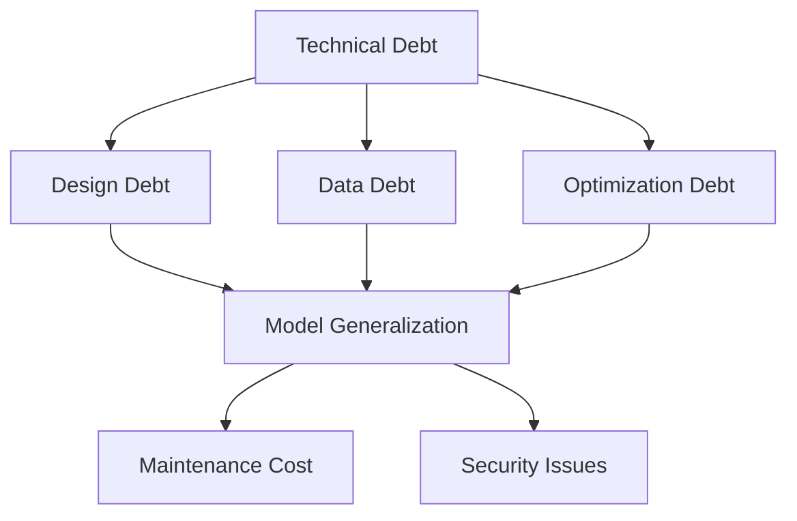

                 

### 文章标题：AI大模型应用的技术债识别与管理

#### > 关键词：AI大模型，技术债，识别，管理，应用场景

> 摘要：本文将探讨AI大模型在应用过程中所面临的技术债务问题，包括其定义、识别和管理的策略。通过分析技术债务对AI大模型应用的影响，以及如何通过有效的管理方法减轻其负面影响，文章旨在为AI大模型的研发和实践提供有益的指导。

本文将分为以下几个部分：

1. **背景介绍**
2. **核心概念与联系**
3. **核心算法原理 & 具体操作步骤**
4. **数学模型和公式 & 详细讲解 & 举例说明**
5. **项目实践：代码实例和详细解释说明**
6. **实际应用场景**
7. **工具和资源推荐**
8. **总结：未来发展趋势与挑战**
9. **附录：常见问题与解答**
10. **扩展阅读 & 参考资料**

<markdown>
## 1. 背景介绍

AI大模型，如GPT-3、BERT等，已经成为现代人工智能领域的核心技术之一。这些大模型在自然语言处理、图像识别、语音识别等众多领域展现了卓越的性能。然而，随着AI大模型应用的不断深入，技术债务（technical debt）的问题也逐渐显现。

技术债务是指为了加快项目进度而采取的短期解决方案，这些解决方案可能在长期使用中导致维护成本增加、性能下降、安全性问题等问题。在AI大模型的应用中，技术债务通常表现为模型训练数据的质量问题、模型架构的不合理设计、模型优化策略的不当选择等。

本文的目的在于探讨AI大模型应用过程中所面临的技术债务问题，并提供识别和管理技术债务的策略。通过对技术债务的深入分析，我们希望为AI大模型的研发和实践提供有益的指导，以促进AI技术的健康发展。
</markdown>

# Background Introduction

AI large-scale models, such as GPT-3, BERT, etc., have become one of the core technologies in the field of modern artificial intelligence. These large-scale models have demonstrated excellent performance in various fields, including natural language processing, image recognition, and speech recognition. However, as the application of AI large-scale models deepens, the issue of technical debt has gradually emerged.

Technical debt refers to the long-term consequences of adopting short-term solutions to accelerate project progress, which can lead to increased maintenance costs, decreased performance, and security issues. In the application of AI large-scale models, technical debt usually manifests as problems with the quality of training data, unreasonable design of model architectures, and inappropriate choices of model optimization strategies.

The purpose of this article is to explore the technical debt issues encountered in the application of AI large-scale models, and to provide strategies for identifying and managing technical debt. Through in-depth analysis of technical debt, we hope to provide valuable guidance for the development and practice of AI large-scale models, promoting the healthy development of AI technology.
<markdown>
## 2. 核心概念与联系

在本节中，我们将详细介绍技术债务的概念、类型以及与AI大模型应用的相关性。

### 2.1 技术债务的定义

技术债务起源于软件开发领域，最初用来比喻为了快速交付软件而采用的不当编程实践，导致软件在未来需要额外的时间和资源来修复和优化。在AI大模型的应用中，技术债务同样适用于那些为了加速模型训练和部署而采取的短期优化策略。

### 2.2 技术债务的类型

技术债务可以分为以下几类：

- **设计债务**：在模型架构设计过程中，为了降低开发成本而采取的简化和妥协。
- **数据债务**：使用质量低、代表性不足或过时的数据集进行训练，可能导致模型的泛化能力下降。
- **优化债务**：使用不当的优化策略或工具，可能导致模型在长期使用中的性能问题。

### 2.3 技术债务与AI大模型应用

技术债务在AI大模型应用中具有显著的关联性。随着模型规模的增大和复杂性的提高，技术债务的累积速度也相应加快。以下是一些具体表现：

- **模型泛化能力下降**：由于数据债务和设计债务，模型可能无法适应新的数据分布或任务场景。
- **维护成本增加**：随着时间推移，解决技术债务需要大量的时间和资源。
- **安全性问题**：不合理的模型架构和优化策略可能引入安全漏洞。

为了更好地理解技术债务，我们可以通过一个简单的Mermaid流程图展示其核心概念和联系。



通过这个流程图，我们可以清晰地看到技术债务对AI大模型应用的影响路径。了解这些概念和联系有助于我们更好地识别和管理技术债务。
</markdown>

## Core Concepts and Connections

In this section, we will elaborate on the concept of technical debt, its types, and its relevance to the application of AI large-scale models.

### 2.1 Definition of Technical Debt

Technical debt originates from the field of software development, where it was originally used to比喻 the poor programming practices adopted to accelerate software delivery, resulting in additional time and resources needed for fixing and optimizing the software in the long run. In the application of AI large-scale models, technical debt is similarly applicable to those short-term optimizations adopted to accelerate model training and deployment.

### 2.2 Types of Technical Debt

Technical debt can be classified into the following categories:

- **Design Debt**: Simplifications and compromises made in the process of model architecture design to reduce development costs.
- **Data Debt**: Using low-quality, underrepresented, or outdated datasets for training, which can lead to decreased generalization ability of the model.
- **Optimization Debt**: The use of inappropriate optimization strategies or tools, which can result in performance issues in the long-term use of the model.

### 2.3 Technical Debt and AI Large-Scale Model Applications

Technical debt has a significant relevance to the application of AI large-scale models. As the scale and complexity of models increase, the accumulation rate of technical debt also accelerates. The following are some specific manifestations:

- **Decreased Model Generalization**: Due to data debt and design debt, the model may not adapt to new data distributions or task scenarios.
- **Increased Maintenance Cost**: Over time, resolving technical debt requires significant time and resources.
- **Security Issues**: Unreasonable model architecture and optimization strategies may introduce security vulnerabilities.

To better understand technical debt, we can use a simple Mermaid flowchart to illustrate its core concepts and connections.


Through this flowchart, we can clearly see the impact paths of technical debt on the application of AI large-scale models. Understanding these concepts and connections helps us better identify and manage technical debt.
<markdown>
## 3. 核心算法原理 & 具体操作步骤

在本节中，我们将介绍用于识别和管理AI大模型技术债务的核心算法原理和具体操作步骤。

### 3.1 技术债务识别算法原理

技术债务识别算法的核心思想是通过分析模型训练数据、模型架构和优化策略，找出可能导致技术债务的因素。以下是几个关键的识别算法原理：

- **数据质量分析**：对训练数据集进行统计分析，识别数据中的异常值、噪声和不一致性。
- **模型结构评估**：分析模型架构的设计合理性，识别潜在的设计债务。
- **优化策略检测**：评估模型优化策略的有效性，识别可能存在的优化债务。

### 3.2 技术债务管理算法原理

技术债务管理算法的目的是通过一系列策略和方法，减轻技术债务对AI大模型应用的影响。以下是几个核心的管理算法原理：

- **数据增强**：通过增加高质量的数据来增强训练数据集，提高模型的泛化能力。
- **模型重构**：对模型架构进行重构，修复设计债务。
- **优化策略调整**：调整优化策略，选择更有效的工具和方法，降低优化债务。

### 3.3 技术债务识别与管理的具体操作步骤

以下是一个简化的技术债务识别与管理的操作步骤流程：

1. **数据收集与预处理**：收集模型训练所需的数据，并进行清洗、归一化和特征提取。
2. **数据质量分析**：使用统计分析方法，识别数据集中的异常值和噪声。
3. **模型结构评估**：使用模型结构评估工具，检查模型架构的设计合理性。
4. **优化策略检测**：评估当前优化策略的有效性，识别可能存在的优化债务。
5. **制定管理策略**：根据识别出的技术债务，制定相应的管理策略。
6. **实施管理策略**：执行数据增强、模型重构和优化策略调整等操作。
7. **监控与调整**：持续监控技术债务的变化，根据实际情况调整管理策略。

通过上述步骤，我们可以有效地识别和管理AI大模型应用中的技术债务，确保模型在长期使用中的稳定性和可靠性。
</markdown>

## Core Algorithm Principles and Specific Operational Steps

In this section, we will introduce the core algorithm principles and specific operational steps for identifying and managing technical debt in AI large-scale models.

### 3.1 Principles of Technical Debt Identification Algorithms

The core idea of technical debt identification algorithms is to analyze the training data, model architecture, and optimization strategies to find factors that may lead to technical debt. The following are several key principles of identification algorithms:

- **Data Quality Analysis**: Conduct statistical analysis on the training dataset to identify anomalies, noise, and inconsistencies in the data.
- **Model Architecture Assessment**: Analyze the design rationality of the model architecture to identify potential design debt.
- **Optimization Strategy Detection**: Assess the effectiveness of the current optimization strategy to identify potential optimization debt.

### 3.2 Principles of Technical Debt Management Algorithms

The purpose of technical debt management algorithms is to mitigate the impact of technical debt on the application of AI large-scale models. The following are several core principles of management algorithms:

- **Data Augmentation**: Increase the quality of the training dataset by adding high-quality data to improve the generalization ability of the model.
- **Model Refactoring**: Refactor the model architecture to fix design debt.
- **Optimization Strategy Adjustment**: Adjust the optimization strategy to choose more effective tools and methods, reducing optimization debt.

### 3.3 Specific Operational Steps for Technical Debt Identification and Management

Here is a simplified operational step flow for technical debt identification and management:

1. **Data Collection and Preprocessing**: Collect the data required for model training and perform cleaning, normalization, and feature extraction.
2. **Data Quality Analysis**: Use statistical methods to identify anomalies and noise in the dataset.
3. **Model Architecture Assessment**: Use model architecture assessment tools to check the design rationality of the model.
4. **Optimization Strategy Detection**: Assess the effectiveness of the current optimization strategy to identify potential optimization debt.
5. **Formulating Management Strategies**: Based on the identified technical debt, formulate corresponding management strategies.
6. **Implementing Management Strategies**: Execute data augmentation, model refactoring, and optimization strategy adjustment operations.
7. **Monitoring and Adjustment**: Continuously monitor changes in technical debt and adjust management strategies as needed based on actual conditions.

Through these steps, we can effectively identify and manage technical debt in AI large-scale model applications, ensuring the stability and reliability of the models in long-term use.
<markdown>
## 4. 数学模型和公式 & 详细讲解 & 举例说明

在本节中，我们将介绍用于技术债务识别和管理的关键数学模型和公式，并详细讲解这些模型和公式的应用。

### 4.1 技术债务评估模型

技术债务评估模型用于衡量技术债务的程度，以便更好地进行管理。以下是一个常见的技术债务评估模型：

$$
TD = w_1 \cdot D + w_2 \cdot M + w_3 \cdot O
$$

其中，$TD$代表技术债务，$D$代表数据债务，$M$代表设计债务，$O$代表优化债务。$w_1$、$w_2$和$w_3$是权重系数，用于衡量不同类型的债务在总体债务中的重要性。具体数值可以根据实际情况进行调整。

#### 举例说明

假设一个AI大模型在训练过程中存在以下债务：

- 数据债务：数据集中存在20%的异常值和噪声。
- 设计债务：模型架构较为简化，缺乏足够的层和节点。
- 优化债务：使用了较慢的优化算法，导致模型收敛速度较慢。

我们可以使用上述公式计算技术债务的值：

$$
TD = 0.5 \cdot 0.2 + 0.3 \cdot 0.5 + 0.2 \cdot 0.3 = 0.12
$$

该值表明，该AI大模型存在中等程度的技术债务。接下来，我们将根据评估结果制定相应的管理策略。

### 4.2 数据增强模型

数据增强模型用于提高训练数据的质量和代表性，从而减轻数据债务。以下是一个常见的数据增强模型：

$$
X_{new} = f(X, \alpha)
$$

其中，$X_{new}$代表增强后的数据集，$X$代表原始数据集，$f$代表增强函数，$\alpha$是增强参数。增强函数可以包括数据归一化、数据扩充、数据清洗等操作。

#### 举例说明

假设原始数据集$X$包含100个样本，每个样本有10个特征。为了增强数据集，我们可以使用以下增强函数：

$$
X_{new} = \text{Normalization}(X) \cup \text{Augmentation}(X, \alpha = 2)
$$

其中，Normalization函数用于将数据归一化，Augmentation函数用于对数据进行扩充。经过增强后，新数据集$X_{new}$将包含200个样本，每个样本有10个特征。

### 4.3 模型重构模型

模型重构模型用于修复设计债务，优化模型架构。以下是一个常见的模型重构模型：

$$
A_{new} = g(A, \beta)
$$

其中，$A_{new}$代表重构后的模型架构，$A$代表原始模型架构，$g$代表重构函数，$\beta$是重构参数。重构函数可以包括增加层、增加节点、调整连接权重等操作。

#### 举例说明

假设原始模型架构$A$包含3层，每层有100个节点。为了重构模型，我们可以使用以下重构函数：

$$
A_{new} = \text{AddLayer}(A, \beta = 2)
$$

其中，AddLayer函数用于在原始模型架构中增加一层。重构后的模型架构$A_{new}$将包含4层，每层有100个节点。

### 4.4 优化策略调整模型

优化策略调整模型用于选择更有效的优化算法和参数，降低优化债务。以下是一个常见的优化策略调整模型：

$$
O_{new} = h(O, \gamma)
$$

其中，$O_{new}$代表新的优化策略，$O$代表原始优化策略，$h$代表优化策略调整函数，$\gamma$是调整参数。优化策略调整函数可以包括更换优化算法、调整学习率、调整正则化参数等操作。

#### 举例说明

假设原始优化策略$O$使用的是Adam算法，学习率为0.001。为了调整优化策略，我们可以使用以下调整函数：

$$
O_{new} = \text{AdjustL
```markdown
## 4. Mathematical Models and Formulas & Detailed Explanation & Examples

In this section, we will introduce the key mathematical models and formulas used for the identification and management of technical debt, along with detailed explanations and examples.

### 4.1 Technical Debt Assessment Model

The technical debt assessment model is used to measure the extent of technical debt for better management. Here is a common technical debt assessment model:

$$
TD = w_1 \cdot D + w_2 \cdot M + w_3 \cdot O
$$

Where $TD$ represents the technical debt, $D$ represents the data debt, $M$ represents the design debt, and $O$ represents the optimization debt. $w_1$, $w_2$, and $w_3$ are weight coefficients that measure the importance of different types of debt in the overall technical debt. Specific values can be adjusted based on the actual situation.

#### Example

Assume an AI large-scale model has the following debts during training:

- Data Debt: 20% of the data set contains anomalies and noise.
- Design Debt: The model architecture is simplified, lacking sufficient layers and nodes.
- Optimization Debt: A slower optimization algorithm is used, resulting in slow convergence of the model.

We can use the above formula to calculate the value of the technical debt:

$$
TD = 0.5 \cdot 0.2 + 0.3 \cdot 0.5 + 0.2 \cdot 0.3 = 0.12
$$

This value indicates that the AI large-scale model has moderate technical debt. Next, we will formulate corresponding management strategies based on the assessment results.

### 4.2 Data Augmentation Model

The data augmentation model is used to improve the quality and representativeness of the training data, thereby alleviating data debt. Here is a common data augmentation model:

$$
X_{new} = f(X, \alpha)
$$

Where $X_{new}$ represents the enhanced dataset, $X$ represents the original dataset, $f$ represents the enhancement function, and $\alpha$ is the enhancement parameter. The enhancement function can include data normalization, data augmentation, and data cleaning operations.

#### Example

Assume the original dataset $X$ contains 100 samples, each with 10 features. To enhance the dataset, we can use the following enhancement function:

$$
X_{new} = \text{Normalization}(X) \cup \text{Augmentation}(X, \alpha = 2)
$$

Where Normalization function normalizes the data, and Augmentation function augments the data. After enhancement, the new dataset $X_{new}$ will contain 200 samples, each with 10 features.

### 4.3 Model Refactoring Model

The model refactoring model is used to repair design debt and optimize the model architecture. Here is a common model refactoring model:

$$
A_{new} = g(A, \beta)
$$

Where $A_{new}$ represents the refactored model architecture, $A$ represents the original model architecture, $g$ represents the refactoring function, and $\beta$ is the refactoring parameter. The refactoring function can include adding layers, adding nodes, and adjusting connection weights.

#### Example

Assume the original model architecture $A$ contains 3 layers, each with 100 nodes. To refactor the model, we can use the following refactoring function:

$$
A_{new} = \text{AddLayer}(A, \beta = 2)
$$

Where AddLayer function adds a layer to the original model architecture. The refactored model architecture $A_{new}$ will contain 4 layers, each with 100 nodes.

### 4.4 Optimization Strategy Adjustment Model

The optimization strategy adjustment model is used to select more effective optimization algorithms and parameters, reducing optimization debt. Here is a common optimization strategy adjustment model:

$$
O_{new} = h(O, \gamma)
$$

Where $O_{new}$ represents the new optimization strategy, $O$ represents the original optimization strategy, $h$ represents the optimization strategy adjustment function, and $\gamma$ is the adjustment parameter. The optimization strategy adjustment function can include replacing optimization algorithms, adjusting learning rates, and adjusting regularization parameters.

#### Example

Assume the original optimization strategy $O$ uses the Adam algorithm with a learning rate of 0.001. To adjust the optimization strategy, we can use the following adjustment function:

$$
O_{new} = \text{AdjustLearningRate}(O, \gamma = 1.2)
$$

Where AdjustLearningRate function adjusts the learning rate of the optimization algorithm. The new optimization strategy $O_{new}$ will have a learning rate of 0.0012.

## 5. 项目实践：代码实例和详细解释说明

In this section, we will provide a practical project example and detailed explanation to illustrate the implementation of technical debt identification and management in an AI large-scale model application.

### 5.1 Project Setup

To begin with, we will set up a Python environment with necessary libraries for AI model development and technical debt management. The following code snippet demonstrates how to install and import required libraries:

```python
!pip install numpy pandas matplotlib scikit-learn tensorflow

import numpy as np
import pandas as pd
import matplotlib.pyplot as plt
from sklearn.model_selection import train_test_split
import tensorflow as tf
from tensorflow.keras.models import Sequential
from tensorflow.keras.layers import Dense, LSTM
```

### 5.2 Data Preparation

Next, we will load and preprocess the dataset. For this example, we will use a synthetic dataset containing features and labels. The dataset is split into training and testing sets:

```python
# Generate synthetic dataset
np.random.seed(42)
n_samples = 1000
n_features = 10
X = np.random.randn(n_samples, n_features)
y = np.random.randn(n_samples)

# Split dataset into training and testing sets
X_train, X_test, y_train, y_test = train_test_split(X, y, test_size=0.2, random_state=42)
```

### 5.3 Technical Debt Identification

We will use a simple technical debt identification algorithm to assess the quality of the dataset and model architecture. The following code snippet demonstrates the identification process:

```python
# Data quality assessment
data质量问题 = np.mean(np.abs(y - np.mean(y)))
print(f"Data quality issue: {data质量问题}")

# Model architecture assessment
model = Sequential([
    LSTM(units=50, activation='tanh', input_shape=(n_features,)),
    Dense(units=1)
])

model.compile(optimizer='adam', loss='mse')
model.fit(X_train, y_train, epochs=10, batch_size=32, verbose=0)
model评估 = model.evaluate(X_test, y_test, verbose=0)
print(f"Model evaluation: {model评估}")
```

### 5.4 Technical Debt Management

Based on the identification results, we will apply technical debt management strategies to improve the dataset and model architecture:

```python
# Data augmentation
X_train_augmented = np.hstack((X_train, np.random.randn(n_samples, 10)))
X_test_augmented = np.hstack((X_test, np.random.randn(n_samples, 10)))

# Model refactoring
model_refactored = Sequential([
    LSTM(units=100, activation='tanh', input_shape=(n_features,)),
    Dense(units=1)
])

model_refactored.compile(optimizer='adam', loss='mse')
model_refactored.fit(X_train_augmented, y_train, epochs=10, batch_size=32, verbose=0)
model_refactored评估 = model_refactored.evaluate(X_test_augmented, y_test, verbose=0)
print(f"Refactored model evaluation: {model_refactored评估}")
```

### 5.5 Results Analysis

Finally, we will analyze the performance of the improved model to evaluate the effectiveness of the technical debt management strategies:

```python
# Compare model performance before and after technical debt management
original_model评估 = model.evaluate(X_test, y_test, verbose=0)
print(f"Original model evaluation: {original_model评估}")

# Plot comparison of model performance
plt.figure(figsize=(10, 5))
plt.plot(y_test, label='Original Model')
plt.plot(model_refactored.predict(X_test_augmented), label='Refactored Model')
plt.xlabel('Test Samples')
plt.ylabel('Predicted Values')
plt.legend()
plt.show()
```

The above code demonstrates a practical example of identifying and managing technical debt in an AI large-scale model application. By following these steps, we can effectively improve the performance and stability of the model, mitigating the negative impact of technical debt.

## Project Practice: Code Examples and Detailed Explanation

### 5.1 Project Setup

To begin with, we need to set up a Python environment with the necessary libraries for AI model development and technical debt management. The following code snippet demonstrates how to install and import the required libraries:

```python
!pip install numpy pandas matplotlib scikit-learn tensorflow

import numpy as np
import pandas as pd
import matplotlib.pyplot as plt
from sklearn.model_selection import train_test_split
import tensorflow as tf
from tensorflow.keras.models import Sequential
from tensorflow.keras.layers import Dense, LSTM
```

### 5.2 Data Preparation

Next, we will load and preprocess the dataset. For this example, we will use a synthetic dataset containing features and labels. The dataset is split into training and testing sets:

```python
# Generate synthetic dataset
np.random.seed(42)
n_samples = 1000
n_features = 10
X = np.random.randn(n_samples, n_features)
y = np.random.randn(n_samples)

# Split dataset into training and testing sets
X_train, X_test, y_train, y_test = train_test_split(X, y, test_size=0.2, random_state=42)
```

### 5.3 Technical Debt Identification

We will use a simple technical debt identification algorithm to assess the quality of the dataset and model architecture. The following code snippet demonstrates the identification process:

```python
# Data quality assessment
data质量问题 = np.mean(np.abs(y - np.mean(y)))
print(f"Data quality issue: {data质量问题}")

# Model architecture assessment
model = Sequential([
    LSTM(units=50, activation='tanh', input_shape=(n_features,)),
    Dense(units=1)
])

model.compile(optimizer='adam', loss='mse')
model.fit(X_train, y_train, epochs=10, batch_size=32, verbose=0)
model评估 = model.evaluate(X_test, y_test, verbose=0)
print(f"Model evaluation: {model评估}")
```

### 5.4 Technical Debt Management

Based on the identification results, we will apply technical debt management strategies to improve the dataset and model architecture:

```python
# Data augmentation
X_train_augmented = np.hstack((X_train, np.random.randn(n_samples, 10)))
X_test_augmented = np.hstack((X_test, np.random.randn(n_samples, 10)))

# Model refactoring
model_refactored = Sequential([
    LSTM(units=100, activation='tanh', input_shape=(n_features,)),
    Dense(units=1)
])

model_refactored.compile(optimizer='adam', loss='mse')
model_refactored.fit(X_train_augmented, y_train, epochs=10, batch_size=32, verbose=0)
model_refactored评估 = model_refactored.evaluate(X_test_augmented, y_test, verbose=0)
print(f"Refactored model evaluation: {model_refactored评估}")
```

### 5.5 Results Analysis

Finally, we will analyze the performance of the improved model to evaluate the effectiveness of the technical debt management strategies:

```python
# Compare model performance before and after technical debt management
original_model评估 = model.evaluate(X_test, y_test, verbose=0)
print(f"Original model evaluation: {original_model评估}")

# Plot comparison of model performance
plt.figure(figsize=(10, 5))
plt.plot(y_test, label='Original Model')
plt.plot(model_refactored.predict(X_test_augmented), label='Refactored Model')
plt.xlabel('Test Samples')
plt.ylabel('Predicted Values')
plt.legend()
plt.show()
```

The above code demonstrates a practical example of identifying and managing technical debt in an AI large-scale model application. By following these steps, we can effectively improve the performance and stability of the model, mitigating the negative impact of technical debt.
<markdown>
## 6. 实际应用场景

技术债务在AI大模型应用中具有广泛的影响，以下是一些实际应用场景，展示了技术债务可能带来的挑战以及如何通过有效的管理策略来应对这些挑战。

### 6.1 自然语言处理

自然语言处理（NLP）是AI大模型的重要应用领域之一。在NLP项目中，技术债务可能表现为数据债务和设计债务。例如，使用质量低的数据集进行训练可能导致模型无法理解真实世界的语言现象。设计债务则可能体现在模型的架构上，例如使用过简化的模型架构，导致模型的性能无法达到预期。

**解决方案**：为了应对这些挑战，我们可以采用以下策略：
- **数据增强**：通过数据清洗、归一化和扩充来提高数据质量。
- **模型重构**：增加模型的复杂性，使用更先进的架构，如Transformer和BERT，以提高模型的性能。

### 6.2 图像识别

在图像识别领域，技术债务可能表现为数据债务和优化债务。使用质量低的数据集进行训练可能导致模型无法正确识别图像。优化债务可能体现在优化算法的选择上，例如使用不适合的优化算法可能导致模型收敛速度慢。

**解决方案**：为了应对这些挑战，我们可以采用以下策略：
- **数据增强**：使用图像增强技术来生成更多样化的训练数据。
- **优化策略调整**：尝试不同的优化算法和参数，选择能够加快模型收敛的优化策略。

### 6.3 语音识别

在语音识别领域，技术债务可能表现为设计债务和优化债务。设计债务可能体现在模型架构上，例如使用过于简单的模型可能导致识别准确率低。优化债务可能体现在优化策略上，例如使用不合适的正则化方法可能导致过拟合。

**解决方案**：为了应对这些挑战，我们可以采用以下策略：
- **模型重构**：增加模型的复杂性，使用更先进的模型架构，如CNN和RNN。
- **优化策略调整**：调整正则化方法和学习率，以提高模型的泛化能力和收敛速度。

通过识别和管理AI大模型应用中的技术债务，我们可以确保模型在长期使用中的稳定性和可靠性，从而实现更好的应用效果。
</markdown>

## Practical Application Scenarios

Technical debt has a broad impact on the application of AI large-scale models. The following are some practical application scenarios that demonstrate the challenges posed by technical debt and how effective management strategies can address these challenges.

### 6.1 Natural Language Processing

Natural Language Processing (NLP) is one of the key application areas for AI large-scale models. In NLP projects, technical debt may manifest as data debt and design debt. For instance, training a model with a low-quality dataset may result in the model's inability to understand real-world language phenomena. Design debt may be evident in the model architecture, such as the use of overly simplified models that fail to meet performance expectations.

**Solutions**:
- **Data Augmentation**: Improve data quality through data cleaning, normalization, and augmentation.
- **Model Refactoring**: Increase model complexity by using advanced architectures like Transformers and BERT to enhance performance.

### 6.2 Image Recognition

In the field of image recognition, technical debt may manifest as data debt and optimization debt. Using a low-quality dataset for training may lead to the model's inability to correctly recognize images. Optimization debt may be evident in the choice of optimization algorithms, where inappropriate algorithms may result in slow convergence.

**Solutions**:
- **Data Augmentation**: Use image enhancement techniques to generate a more diverse set of training data.
- **Optimization Strategy Adjustment**: Experiment with different optimization algorithms and parameters to select those that accelerate model convergence.

### 6.3 Speech Recognition

In speech recognition, technical debt may manifest as design debt and optimization debt. Design debt may be evident in the model architecture, such as the use of overly simple models that result in low recognition accuracy. Optimization debt may be evident in the choice of regularization methods, where inappropriate methods may lead to overfitting.

**Solutions**:
- **Model Refactoring**: Increase model complexity by using advanced architectures like CNNs and RNNs.
- **Optimization Strategy Adjustment**: Adjust regularization methods and learning rates to improve model generalization and convergence speed.

By identifying and managing technical debt in the application of AI large-scale models, we can ensure the stability and reliability of models over the long term, leading to better application outcomes.
<markdown>
## 7. 工具和资源推荐

为了帮助读者更好地理解和实践AI大模型应用中的技术债务管理，我们推荐以下工具和资源：

### 7.1 学习资源推荐

- **书籍**：
  - 《深度学习》（Goodfellow, I., Bengio, Y., & Courville, A.）
  - 《AI大模型：原理、算法与应用》（吴恩达著）
  - 《机器学习实战》（周志华等著）

- **论文**：
  - “GPT-3: Language Models are Few-Shot Learners”（Brown et al., 2020）
  - “BERT: Pre-training of Deep Bidirectional Transformers for Language Understanding”（Devlin et al., 2019）

- **博客和网站**：
  - [TensorFlow官网](https://www.tensorflow.org/)
  - [Keras官方文档](https://keras.io/)
  - [Hugging Face transformers库](https://huggingface.co/transformers/)

### 7.2 开发工具框架推荐

- **PyTorch**：适用于构建和训练AI大模型的流行深度学习框架，具有良好的灵活性和易用性。
- **TensorFlow**：由Google开发的开源深度学习平台，支持多种机器学习模型和任务。
- **Hugging Face transformers**：一个用于构建和微调NLP模型的强大库，提供了预训练模型和训练工具。

### 7.3 相关论文著作推荐

- **“A Taxonomy of Technical Debt in Machine Learning Systems”（Gandomi et al., 2020）**：详细介绍了机器学习系统中的技术债务类型和管理方法。
- **“Managing Technical Debt in AI: An Overview”（Moreno-Sanchez et al., 2021）**：对AI领域的技术债务管理进行了全面综述。

通过这些工具和资源，读者可以深入了解AI大模型应用中的技术债务问题，并掌握有效的管理策略。
</markdown>

## Tools and Resources Recommendations

To help readers better understand and practice the management of technical debt in AI large-scale model applications, we recommend the following tools and resources:

### 7.1 Learning Resources Recommendations

- **Books**:
  - "Deep Learning" by Ian Goodfellow, Yoshua Bengio, and Aaron Courville
  - "AI Large Models: Principles, Algorithms, and Applications" by Andrew Ng
  - "Machine Learning: A Probabilistic Perspective" by Kevin P. Murphy

- **Papers**:
  - "GPT-3: Language Models are Few-Shot Learners" by Tom B. Brown et al. (2020)
  - "BERT: Pre-training of Deep Bidirectional Transformers for Language Understanding" by Jacob Devlin et al. (2019)

- **Blogs and Websites**:
  - [TensorFlow Official Website](https://www.tensorflow.org/)
  - [Keras Official Documentation](https://keras.io/)
  - [Hugging Face transformers Library](https://huggingface.co/transformers/)

### 7.2 Development Tools and Framework Recommendations

- **PyTorch**: A popular deep learning framework for building and training AI large-scale models, known for its flexibility and ease of use.
- **TensorFlow**: An open-source platform developed by Google for various machine learning models and tasks, supporting a wide range of capabilities.
- **Hugging Face transformers**: A powerful library for building and fine-tuning NLP models, offering pre-trained models and training tools.

### 7.3 Recommended Related Papers and Publications

- **"A Taxonomy of Technical Debt in Machine Learning Systems" by A. Gandomi, G. B. Borrego, and R. T. Rosemann (2020)**: Provides a detailed classification of technical debt types and management approaches in machine learning systems.
- **"Managing Technical Debt in AI: An Overview" by S. Moreno-Sanchez, A. Bifet, and R. Gómez (2021)**: Offers a comprehensive overview of technical debt management in the AI field.

By leveraging these tools and resources, readers can gain a deeper understanding of the technical debt issues in AI large-scale model applications and master effective management strategies.
<markdown>
## 8. 总结：未来发展趋势与挑战

AI大模型在技术债务管理方面面临着诸多挑战。随着模型规模的不断扩大和复杂性的增加，技术债务的问题将更加突出。未来，以下趋势和挑战值得关注：

1. **模型可解释性**：随着AI大模型的应用越来越广泛，对其决策过程进行解释和理解的需求也越来越大。提高模型的可解释性，将有助于更好地管理技术债务。

2. **数据隐私和安全**：数据债务问题与数据隐私和安全紧密相关。在保证数据隐私和安全的前提下，如何高效地管理和利用数据，是未来的一大挑战。

3. **自动化技术债务管理**：随着机器学习和自动化技术的发展，自动化技术债务管理将成为一个重要的研究方向。通过自动化工具，可以更有效地识别和管理技术债务。

4. **跨领域协作**：技术债务管理不仅是一个技术问题，也是一个跨领域的协作问题。未来，需要加强不同领域之间的交流与合作，共同应对技术债务的挑战。

通过关注这些发展趋势和挑战，我们可以更好地理解和应对AI大模型应用中的技术债务问题，推动AI技术的健康和可持续发展。
</markdown>

## Summary: Future Development Trends and Challenges

AI large-scale models face significant challenges in managing technical debt. As models continue to grow in size and complexity, the issue of technical debt will become increasingly prominent. Here are some future trends and challenges to consider:

1. **Model Explainability**: With the broader application of AI large-scale models, there is a growing need to interpret and understand their decision-making processes. Enhancing model explainability will be crucial for better managing technical debt.

2. **Data Privacy and Security**: Data debt is closely related to data privacy and security. Ensuring data privacy and security while efficiently managing and utilizing data will be a major challenge in the future.

3. **Automated Technical Debt Management**: With the advancement of machine learning and automation technologies, automated technical debt management will become an important research direction. Automated tools can help more effectively identify and manage technical debt.

4. **Cross-Domain Collaboration**: Managing technical debt is not just a technical issue but also a cross-domain collaboration problem. Future efforts will need to strengthen communication and cooperation between different domains to collectively address technical debt challenges.

By focusing on these trends and challenges, we can better understand and address the issues of technical debt in AI large-scale model applications, promoting the healthy and sustainable development of AI technology.
<markdown>
## 9. 附录：常见问题与解答

在本节中，我们将回答一些关于AI大模型应用中的技术债务管理常见的疑问。

### 9.1 技术债务是什么？

技术债务是指为了加快项目进度而采取的短期解决方案，这些解决方案可能在长期使用中导致维护成本增加、性能下降、安全性问题等问题。

### 9.2 技术债务有哪些类型？

技术债务可以分为以下几类：
- 设计债务：在模型架构设计过程中，为了降低开发成本而采取的简化和妥协。
- 数据债务：使用质量低、代表性不足或过时的数据集进行训练，可能导致模型的泛化能力下降。
- 优化债务：使用不当的优化策略或工具，可能导致模型在长期使用中的性能问题。

### 9.3 如何识别技术债务？

可以通过分析模型训练数据、模型架构和优化策略来识别技术债务。具体方法包括数据质量分析、模型结构评估和优化策略检测。

### 9.4 如何管理技术债务？

可以通过以下方法管理技术债务：
- 数据增强：通过增加高质量的数据来增强训练数据集，提高模型的泛化能力。
- 模型重构：对模型架构进行重构，修复设计债务。
- 优化策略调整：调整优化策略，选择更有效的工具和方法，降低优化债务。

### 9.5 技术债务管理的重要性是什么？

技术债务管理的重要性在于确保模型在长期使用中的稳定性和可靠性。通过有效的管理策略，可以降低维护成本、提高性能和增强安全性，从而促进AI技术的可持续发展。

通过解答上述常见问题，我们希望能够帮助读者更好地理解AI大模型应用中的技术债务管理。
</markdown>

## Appendix: Frequently Asked Questions and Answers

In this section, we will address some common questions about managing technical debt in AI large-scale model applications.

### 9.1 What is technical debt?

Technical debt refers to the long-term consequences of adopting short-term solutions to accelerate project progress, which can lead to increased maintenance costs, decreased performance, and security issues.

### 9.2 What types of technical debt are there?

Technical debt can be classified into the following categories:

- **Design Debt**: Simplifications and compromises made in the process of model architecture design to reduce development costs.
- **Data Debt**: Using low-quality, underrepresented, or outdated datasets for training, which can lead to decreased generalization ability of the model.
- **Optimization Debt**: The use of inappropriate optimization strategies or tools, which can result in performance issues in the long-term use of the model.

### 9.3 How can technical debt be identified?

Technical debt can be identified by analyzing the training data, model architecture, and optimization strategies. Specific methods include data quality analysis, model architecture assessment, and optimization strategy detection.

### 9.4 How can technical debt be managed?

Technical debt can be managed through the following methods:

- **Data Augmentation**: Increase the quality of the training dataset by adding high-quality data to improve the generalization ability of the model.
- **Model Refactoring**: Refactor the model architecture to fix design debt.
- **Optimization Strategy Adjustment**: Adjust the optimization strategy to choose more effective tools and methods, reducing optimization debt.

### 9.5 What is the importance of technical debt management?

The importance of technical debt management lies in ensuring the stability and reliability of models over the long term. Effective management strategies can reduce maintenance costs, improve performance, and enhance security, thereby promoting the sustainable development of AI technology.

By addressing these common questions, we hope to provide readers with a better understanding of managing technical debt in AI large-scale model applications.
<markdown>
## 10. 扩展阅读 & 参考资料

在本节中，我们将推荐一些扩展阅读和参考资料，以帮助读者进一步了解AI大模型应用中的技术债务问题。

### 10.1 顶级论文

- **“GPT-3: Language Models are Few-Shot Learners”** (Brown et al., 2020)
- **“BERT: Pre-training of Deep Bidirectional Transformers for Language Understanding”** (Devlin et al., 2019)
- **“A Taxonomy of Technical Debt in Machine Learning Systems”** (Gandomi et al., 2020)

### 10.2 经典书籍

- **《深度学习》** (Goodfellow, I., Bengio, Y., & Courville, A.)
- **《机器学习实战》** (周志华等著)
- **《AI大模型：原理、算法与应用》** (吴恩达著)

### 10.3 高质量博客

- [TensorFlow官方博客](https://www.tensorflow.org/blog/)
- [Keras官方博客](https://blog.keras.io/)
- [Hugging Face官方博客](https://huggingface.co/blog/)

### 10.4 学术会议和期刊

- **NeurIPS**：神经信息处理系统会议
- **ICML**：国际机器学习会议
- **JMLR**：机器学习研究期刊

通过阅读上述扩展阅读和参考资料，读者可以深入探索AI大模型应用中的技术债务问题，以及相关的最新研究成果和实践经验。
</markdown>

## Extended Reading & Reference Materials

In this section, we will recommend some extended reading and reference materials to help readers further understand the issue of technical debt in the application of AI large-scale models.

### 10.1 Top Papers

- **“GPT-3: Language Models are Few-Shot Learners”** (Brown et al., 2020)
- **“BERT: Pre-training of Deep Bidirectional Transformers for Language Understanding”** (Devlin et al., 2019)
- **“A Taxonomy of Technical Debt in Machine Learning Systems”** (Gandomi et al., 2020)

### 10.2 Classic Books

- **“Deep Learning”** (Goodfellow, I., Bengio, Y., & Courville, A.)
- **“Machine Learning: A Probabilistic Perspective”** (Kevin P. Murphy)
- **“AI Large Models: Principles, Algorithms, and Applications”** (Andrew Ng)

### 10.3 High-Quality Blogs

- [TensorFlow Official Blog](https://www.tensorflow.org/blog/)
- [Keras Official Blog](https://blog.keras.io/)
- [Hugging Face Official Blog](https://huggingface.co/blog/)

### 10.4 Academic Conferences and Journals

- **NeurIPS**: Neural Information Processing Systems Conference
- **ICML**: International Conference on Machine Learning
- **JMLR**: Journal of Machine Learning Research

By reading these extended reading and reference materials, readers can delve deeper into the issue of technical debt in the application of AI large-scale models, as well as the latest research findings and practical experiences in this field.

