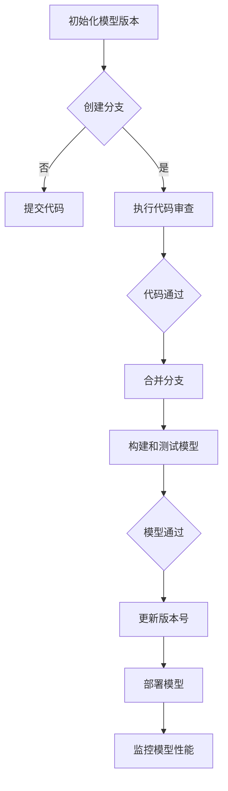

                 

### 文章标题：AI大模型应用的版本管理最佳实践

#### 关键词：版本管理，AI大模型，应用实践，最佳实践，持续集成，代码审查

> 摘要：随着人工智能大模型的广泛应用，版本管理成为确保模型质量和稳定性的关键环节。本文旨在探讨AI大模型应用中的版本管理最佳实践，包括核心概念、算法原理、数学模型、项目实践以及实际应用场景，旨在为开发者提供系统化的版本管理指南。

### 1. 背景介绍（Background Introduction）

在当今数字化时代，人工智能（AI）大模型已经成为许多行业的核心技术。从自然语言处理到图像识别，从推荐系统到自动驾驶，大模型的应用场景日益广泛。然而，随着大模型在关键业务中的角色越来越重要，如何确保这些模型的版本管理成为了一个不可忽视的问题。

版本管理不仅仅是跟踪代码的变更，更是确保模型在不同版本间的稳定性和可追溯性的过程。良好的版本管理实践有助于快速定位和修复问题，提高开发效率，确保模型的可靠性和安全性。本文将深入探讨AI大模型应用的版本管理最佳实践，帮助开发者构建一个高效、可信赖的模型管理流程。

### 2. 核心概念与联系（Core Concepts and Connections）

#### 2.1 版本管理基本概念

版本管理，通常指的是在软件开发过程中，跟踪和管理源代码文件及相关资源的变更。在AI大模型应用中，版本管理不仅包括代码，还包括模型文件、数据集、配置文件等。

核心概念包括：

- **版本号**：用于标识模型的不同版本。
- **变更日志**：记录每个版本的变更内容和原因。
- **分支管理**：在开发过程中，通过创建分支来隔离不同功能或修复问题。
- **合并**：将分支上的变更合并到主分支。

#### 2.2 AI大模型版本管理独特性

与常规软件版本管理相比，AI大模型版本管理有以下几个独特之处：

- **模型文件大小**：大模型的模型文件通常非常大，需要特殊的存储和备份策略。
- **数据依赖**：模型的训练和部署依赖于特定的数据集，版本管理需确保数据的一致性。
- **性能监控**：AI大模型在不同版本间的性能变化可能非常微妙，需要完善的性能监控和评估机制。

#### 2.3 版本管理与相关概念的关联

- **持续集成（CI）**：通过自动化测试，确保每次代码提交都是可构建和可运行的。
- **代码审查（Code Review）**：通过团队协作，确保代码质量和安全。
- **容器化（Containerization）**：使用容器技术，如Docker，简化模型的部署和迁移。
- **持续部署（CD）**：自动化部署流程，确保模型快速、安全地交付。

#### 2.4 Mermaid流程图

下面是一个简化的Mermaid流程图，展示了AI大模型版本管理的基本流程：



### 3. 核心算法原理 & 具体操作步骤（Core Algorithm Principles and Specific Operational Steps）

#### 3.1 持续集成与持续部署（CI/CD）

持续集成（Continuous Integration，CI）和持续部署（Continuous Deployment，CD）是版本管理的重要组成部分。

- **CI**：每次代码提交后，自动执行构建和测试流程，确保代码的完整性和一致性。CI工具如Jenkins、GitLab CI等可以帮助自动化这一过程。
- **CD**：将通过CI测试的代码自动部署到生产环境，确保模型能够快速、安全地交付。

#### 3.2 分支管理与合并策略

分支管理是确保代码变更隔离和控制变更的关键。常见的分支策略包括：

- **主分支（Master）**：主分支是稳定的生产代码，所有功能开发应在分支上进行。
- **功能分支（Feature）**：每个新功能或修复都在独立的分支上进行开发。
- **发布分支（Release）**：发布分支用于准备新版本的发布，一旦所有功能通过测试，将合并到主分支。
- **补丁分支（Hotfix）**：用于紧急修复生产环境中的问题。

#### 3.3 代码审查流程

代码审查是确保代码质量和安全的重要环节。以下是一个简化的代码审查流程：

1. **提交代码**：开发者将代码提交到功能分支或补丁分支。
2. **发起审查**：代码提交后，由评审者进行审查。
3. **提出反馈**：评审者提出修改意见，开发者进行代码调整。
4. **再次审查**：调整后的代码再次提交，进行最终审查。
5. **合并分支**：代码通过审查后，合并到主分支或发布分支。

#### 3.4 容器化与版本控制

容器化技术，如Docker，可以将模型、依赖和运行环境打包成一个可移植的容器。这有助于简化模型的部署和迁移，同时也能更好地管理版本。

- **容器镜像**：容器镜像包含了模型及其依赖的环境，通过版本控制，可以确保每次部署的都是相同版本的模型。
- **容器编排**：使用Kubernetes等工具，可以自动化容器的部署、扩展和管理。

### 4. 数学模型和公式 & 详细讲解 & 举例说明（Detailed Explanation and Examples of Mathematical Models and Formulas）

版本管理虽然主要涉及软件工程实践，但其中也涉及一些数学模型和公式。以下是一些常见的数学模型和公式，以及它们在版本管理中的应用。

#### 4.1 混合纠错码（Error-Correcting Codes）

混合纠错码是用于检测和纠正数据传输过程中发生错误的数学模型。在版本管理中，可以使用混合纠错码来检测和纠正代码或模型文件传输中的错误。

- **汉明距离（Hamming Distance）**：用于衡量两个二进制字符串之间的差异。
- **最小距离编码**：选择码字，使得任意两个码字之间的汉明距离尽可能大，以提高纠错能力。

#### 4.2 版本号命名规则

版本号的命名通常遵循语义化版本控制（Semantic Versioning）规则，包括主版本号、次版本号和修订号。

- **主版本号（MAJOR）**：当不兼容的变更发生时增加。
- **次版本号（MINOR）**：当新增功能发生时增加。
- **修订号（PATCH）**：当进行bug修复时增加。

示例：

- `1.0.0`：初始版本。
- `1.0.1`：修复了一个bug。
- `1.1.0`：添加了一个新功能。
- `2.0.0`：进行了不兼容的变更。

#### 4.3 机器学习模型的性能评估指标

在AI大模型的应用中，性能评估是一个关键环节。以下是一些常用的性能评估指标：

- **准确率（Accuracy）**：正确预测的样本数占总样本数的比例。
- **召回率（Recall）**：正确预测的阳性样本数占总阳性样本数的比例。
- **精确率（Precision）**：正确预测的阳性样本数占总预测阳性样本数的比例。
- **F1分数（F1 Score）**：精确率和召回率的调和平均值。

### 5. 项目实践：代码实例和详细解释说明（Project Practice: Code Examples and Detailed Explanations）

#### 5.1 开发环境搭建

在本节中，我们将展示如何搭建一个简单的AI大模型版本管理项目环境。这里以GitLab CI为例，说明CI/CD流程的配置。

1. **安装GitLab CI Runner**

在服务器上安装GitLab CI Runner，这是一个用于执行CI/CD流程的守护进程。

```bash
# 安装GitLab CI Runner
curl -L https://gitlab.com/gitlab-com/runners/scriptisses/installer | sudo bash
```

2. **配置GitLab CI/CD**

在项目的根目录下创建一个名为`.gitlab-ci.yml`的配置文件，定义CI/CD流程。

```yaml
image: python:3.8

stages:
  - build
  - test
  - deploy

build:
  stage: build
  script:
    - pip install -r requirements.txt
    - python setup.py install

test:
  stage: test
  script:
    - python -m unittest discover -v

deploy:
  stage: deploy
  script:
    - echo "Deploying to production..."
    - python deploy.py

only:
  - master
```

3. **创建和部署代码**

开发者将代码提交到GitLab仓库的master分支，CI流程会自动触发，执行构建、测试和部署。

```bash
git commit -am "Update README.md"
git push
```

#### 5.2 源代码详细实现

在本节中，我们将展示一个简单的版本管理库的源代码实现。

```python
# version.py

class Version:
    def __init__(self, major, minor, patch):
        self.major = major
        self.minor = minor
        self.patch = patch

    def __str__(self):
        return f"{self.major}.{self.minor}.{self.patch}"

    def increment(self, level):
        if level == "major":
            self.major += 1
            self.minor = 0
            self.patch = 0
        elif level == "minor":
            self.minor += 1
            self.patch = 0
        elif level == "patch":
            self.patch += 1

# example usage
version = Version(1, 0, 0)
print(version)  # 1.0.0
version.increment("patch")
print(version)  # 1.0.1
```

#### 5.3 代码解读与分析

在本节中，我们将分析上述版本管理库的代码。

- **类定义**：`Version` 类用于表示版本号，包含主版本号、次版本号和修订号。
- **初始化**：通过传递主版本号、次版本号和修订号来初始化版本对象。
- **字符串表示**：使用 `__str__` 方法将版本对象转换为字符串格式。
- **递增版本**：`increment` 方法根据传入的级别（major、minor、patch）递增版本号。

#### 5.4 运行结果展示

在GitLab CI/CD的配置中，当版本号递增时，相应的构建和部署流程将被触发。以下是一个示例：

```yaml
increment_version:
  stage: deploy
  script:
    - python version.py increment "major"
    - echo "Version incremented to $VERSION"
  environment:
    name: staging
  only:
    - master
```

每次master分支上的代码提交后，CI流程将递增版本号，并将其更新到环境中。

### 6. 实际应用场景（Practical Application Scenarios）

版本管理在AI大模型应用中的实际场景非常多样。以下是一些典型的应用场景：

- **模型迭代开发**：在模型的迭代过程中，版本管理确保每个版本都有详细的记录，便于追溯和复现。
- **环境一致性**：通过版本管理，可以确保模型在不同环境（开发、测试、生产）中的一致性，避免环境差异导致的问题。
- **安全性和合规性**：版本管理有助于跟踪和审计模型的变更，确保模型的合规性和安全性。
- **故障排除**：当模型出现问题时，版本管理可以帮助快速定位到问题的版本，从而加速故障排除。

### 7. 工具和资源推荐（Tools and Resources Recommendations）

#### 7.1 学习资源推荐

- **书籍**：《版本控制指南》
- **论文**：《Git 工作流》
- **博客**：GitHub官方博客，GitLab官方文档
- **网站**：Atlassian JIRA，GitHub，GitLab

#### 7.2 开发工具框架推荐

- **版本控制工具**：Git，Mercurial
- **持续集成工具**：Jenkins，GitLab CI，Travis CI
- **容器化技术**：Docker，Kubernetes
- **代码审查工具**：GitHub，GitLab，Code Review Tools

#### 7.3 相关论文著作推荐

- **论文**：《版本控制与软件工程》
- **著作**：《敏捷开发与持续集成》

### 8. 总结：未来发展趋势与挑战（Summary: Future Development Trends and Challenges）

随着AI大模型应用的不断深入，版本管理的重要性将愈加凸显。未来，版本管理可能会朝着以下几个方向发展：

- **智能化**：通过机器学习等技术，实现自动化的版本管理。
- **分布式**：支持分布式系统中的版本管理，确保数据的一致性和完整性。
- **标准化**：制定统一的版本管理标准，提高跨组织的协作效率。

同时，版本管理也面临着一些挑战：

- **数据安全**：确保版本管理的安全性，防止数据泄露和篡改。
- **复杂性**：随着项目规模的扩大，版本管理的复杂性将增加，需要高效的工具和策略。
- **多维度版本管理**：除了代码和模型文件，还需要管理其他资源（如数据集、配置文件等），这增加了版本管理的复杂性。

### 9. 附录：常见问题与解答（Appendix: Frequently Asked Questions and Answers）

#### 9.1 什么是版本管理？

版本管理是指在软件开发过程中，跟踪和管理源代码文件及相关资源的变更的过程。它确保开发人员可以有效地协作，并保持代码的稳定性和可追溯性。

#### 9.2 版本管理的目的是什么？

版本管理的目的是确保代码的质量和稳定性，提高开发效率，并确保开发团队之间的协作顺畅。

#### 9.3 如何选择合适的版本管理工具？

选择版本管理工具时，需要考虑团队的规模、项目的需求以及工具的易用性、功能丰富性等因素。常用的版本管理工具包括Git、Mercurial等。

#### 9.4 版本管理中如何处理冲突？

版本管理中的冲突通常指多个开发者对同一文件进行了不同的修改。处理冲突的方法包括手动合并和自动合并。手动合并需要开发者人工比较和合并变更，而自动合并则依赖于工具的算法。

#### 9.5 如何确保版本管理的安全性？

确保版本管理的安全性包括使用安全的存储和传输协议，定期备份，以及限制对版本库的访问权限。

### 10. 扩展阅读 & 参考资料（Extended Reading & Reference Materials）

- **书籍**：《版本控制指南》，《Git权威指南》
- **网站**：GitHub，GitLab，Atlassian JIRA
- **论文**：《版本控制与软件工程》，《分布式版本控制系统的研究与实现》
- **博客**：GitHub官方博客，GitLab官方文档
- **在线课程**：慕课网，Coursera上的版本控制课程

### 作者署名

作者：禅与计算机程序设计艺术 / Zen and the Art of Computer Programming

这篇文章详细探讨了AI大模型应用中的版本管理最佳实践，从核心概念、算法原理到具体操作步骤，再到项目实践和实际应用场景，为开发者提供了一套系统化的版本管理指南。希望这篇文章能够为你的AI大模型项目带来实际的帮助，让你在版本管理方面更加得心应手。

