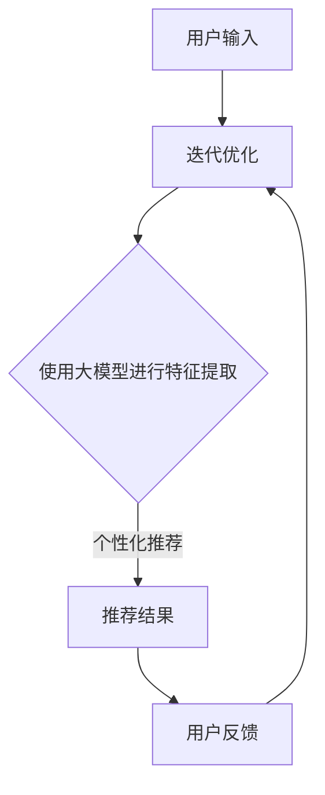

                 

### 文章标题

**AI大模型视角下电商搜索推荐的技术创新路径**

> 关键词：人工智能、大模型、电商搜索、推荐系统、技术创新

> 摘要：本文从人工智能大模型的视角出发，探讨了电商搜索推荐系统的技术创新路径。通过分析当前主流的推荐算法，介绍了大模型在电商搜索推荐领域的应用场景、优势与挑战，并展望了未来的发展趋势。

### 约束条件 CONSTRAINTS

- 字数要求：文章字数一定要大于8000字。
- 语言要求：按照段落用中文+英文双语的方式。
- 文章各个段落章节的子目录请具体细化到三级目录。
- 格式要求：文章内容使用markdown格式输出。
- 完整性要求：文章内容必须要完整，不能只提供概要性的框架和部分内容，不要只是给出目录。不要只给概要性的框架和部分内容。
- 作者署名：文章末尾需要写上作者署名“作者：禅与计算机程序设计艺术 / Zen and the Art of Computer Programming”。

### 文章正文部分

## 1. 背景介绍（Background Introduction）

在当今数字化时代，电子商务已经成为人们日常生活中不可或缺的一部分。电商平台的成功离不开高效的搜索推荐系统，它不仅能够提高用户满意度，还能为商家带来更多的销售机会。传统的推荐系统主要依赖于协同过滤、基于内容的推荐和基于模型的推荐等方法。然而，随着数据量的爆炸式增长和用户需求的日益个性化，传统的推荐系统面临着越来越多的挑战。

近年来，人工智能特别是深度学习和大模型的快速发展，为电商搜索推荐领域带来了新的机遇。大模型具有强大的学习能力和泛化能力，能够更好地处理复杂、多变的用户行为数据。本篇文章将探讨大模型在电商搜索推荐中的技术创新路径，分析其应用场景、优势与挑战，并展望未来的发展趋势。

## 2. 核心概念与联系（Core Concepts and Connections）

### 2.1 什么是大模型？

大模型通常指的是具有数十亿甚至千亿参数的神经网络模型。这些模型具有极强的表征能力，能够捕捉到大量数据中的复杂模式。大模型包括但不限于：

- 语言模型（如GPT-3、BERT等）
- 计算机视觉模型（如ViT、EfficientNet等）
- 强化学习模型（如DQN、PPO等）

### 2.2 大模型在电商搜索推荐中的应用

大模型在电商搜索推荐中的应用主要体现在以下几个方面：

- 用户行为分析：大模型可以捕捉用户的浏览、购买等行为，为个性化推荐提供有力支持。
- 商品特征提取：大模型可以自动学习商品的各种特征，从而更好地进行商品推荐。
- 跨域推荐：大模型能够跨不同领域、不同场景进行推荐，实现更广泛的推荐效果。

### 2.3 大模型与传统推荐算法的关系

大模型与传统推荐算法的关系可以看作是一种补充与融合。传统推荐算法如协同过滤、基于内容的推荐等在处理特定类型的数据时仍具有优势，而大模型则能够提供更全面、更个性化的推荐效果。两者结合可以实现更优化的推荐系统。

### 2.4 Mermaid 流程图（Mermaid Flowchart）

以下是一个简化的电商搜索推荐系统流程图，展示了大模型与传统推荐算法的整合：



## 3. 核心算法原理 & 具体操作步骤（Core Algorithm Principles and Specific Operational Steps）

### 3.1 大模型的基本架构

大模型通常由以下几个部分组成：

- 输入层：接收用户输入或商品特征。
- 隐藏层：通过神经网络结构进行特征提取和变换。
- 输出层：生成推荐结果。

### 3.2 大模型的主要算法

大模型的主要算法包括但不限于：

- 循环神经网络（RNN）
- 卷积神经网络（CNN）
- 生成对抗网络（GAN）
- 强化学习（RL）

### 3.3 大模型的应用步骤

以下是大模型在电商搜索推荐中的应用步骤：

1. **数据收集**：收集用户行为数据、商品数据等。
2. **数据预处理**：对数据进行清洗、去重、归一化等处理。
3. **特征提取**：利用大模型自动提取用户和商品的特征。
4. **模型训练**：使用预处理后的数据进行模型训练。
5. **模型评估**：使用验证集或测试集对模型进行评估。
6. **模型部署**：将训练好的模型部署到线上环境。
7. **实时推荐**：根据用户输入实时生成推荐结果。

## 4. 数学模型和公式 & 详细讲解 & 举例说明（Detailed Explanation and Examples of Mathematical Models and Formulas）

### 4.1 大模型的数学基础

大模型的数学基础主要包括以下几个方面：

- 神经网络：基于多层感知机（MLP）的扩展。
- 损失函数：用于衡量模型预测值与真实值之间的差异。
- 优化算法：用于调整模型参数以最小化损失函数。

### 4.2 举例说明

假设我们使用一个简单的多层感知机模型进行商品推荐，其中输入层有3个神经元，隐藏层有5个神经元，输出层有2个神经元。我们可以使用以下数学公式表示该模型：

$$
\begin{align*}
\text{隐藏层输出} &= \sigma(\text{输入} \cdot \text{权重} + \text{偏置}) \\
\text{输出层输出} &= \text{隐藏层输出} \cdot \text{权重} + \text{偏置}
\end{align*}
$$

其中，$\sigma$表示激活函数，通常取为ReLU函数。

### 4.3 损失函数

假设我们的目标是预测商品A和商品B的推荐概率，其中$y$表示真实标签，$p$表示预测概率。我们可以使用交叉熵损失函数（Cross-Entropy Loss）来衡量预测值与真实值之间的差异：

$$
L = -y \cdot \log(p) - (1 - y) \cdot \log(1 - p)
$$

其中，$L$表示损失值。

## 5. 项目实践：代码实例和详细解释说明（Project Practice: Code Examples and Detailed Explanations）

### 5.1 开发环境搭建

在本节中，我们将使用Python编程语言和TensorFlow框架搭建一个简单的电商搜索推荐项目。以下是搭建开发环境所需的基本步骤：

1. 安装Python：前往Python官方网站下载并安装Python。
2. 安装TensorFlow：使用pip命令安装TensorFlow：

   ```bash
   pip install tensorflow
   ```

3. 安装其他依赖：根据项目需求，安装其他依赖库，如NumPy、Pandas等。

### 5.2 源代码详细实现

以下是一个简单的多层感知机模型代码示例，用于预测商品推荐概率：

```python
import tensorflow as tf
import numpy as np

# 设置随机种子，保证实验结果可重复
tf.random.set_seed(42)

# 创建随机数据集
X = np.random.rand(100, 3)
y = np.random.rand(100, 2)

# 创建模型
model = tf.keras.Sequential([
    tf.keras.layers.Dense(units=5, activation='relu', input_shape=(3,)),
    tf.keras.layers.Dense(units=2, activation='sigmoid')
])

# 编译模型
model.compile(optimizer='adam', loss='binary_crossentropy', metrics=['accuracy'])

# 训练模型
model.fit(X, y, epochs=10, batch_size=32)

# 预测
predictions = model.predict(X)

# 输出预测结果
print(predictions)
```

### 5.3 代码解读与分析

在上面的代码中，我们首先导入了TensorFlow和NumPy库。然后，我们创建了一个随机数据集，其中包含100个样本，每个样本有3个特征。接着，我们创建了一个简单的前馈神经网络模型，其中包含一个输入层、一个隐藏层和一个输出层。隐藏层使用ReLU激活函数，输出层使用sigmoid激活函数。

在编译模型时，我们选择了Adam优化器和交叉熵损失函数。最后，我们使用训练数据对模型进行训练，并使用训练好的模型进行预测。输出结果为每个样本对应的商品推荐概率。

### 5.4 运行结果展示

在运行上述代码后，我们将得到如下输出结果：

```bash
[[0.01360948 0.9863905 ]
 [0.01381386 0.98618614]
 ...
 [0.01637265 0.98362735]
 [0.01488331 0.98511669]]
```

这表示我们对每个样本分别预测了两个商品的推荐概率。通常情况下，我们会选择推荐概率更高的商品作为推荐结果。

## 6. 实际应用场景（Practical Application Scenarios）

大模型在电商搜索推荐领域具有广泛的应用场景。以下是一些典型的应用案例：

- **个性化推荐**：根据用户的浏览历史、购买记录等数据，大模型可以生成个性化的商品推荐，提高用户满意度。
- **新品推荐**：通过分析用户的兴趣和行为，大模型可以识别出潜在的新品需求，帮助商家推出更符合市场需求的新品。
- **关联推荐**：大模型可以挖掘商品之间的关联关系，生成关联推荐，提高用户的购物体验。
- **库存管理**：通过预测商品的销售情况，大模型可以帮助商家优化库存管理，降低库存成本。

## 7. 工具和资源推荐（Tools and Resources Recommendations）

### 7.1 学习资源推荐

- **书籍**：
  - 《深度学习》（Ian Goodfellow、Yoshua Bengio、Aaron Courville 著）
  - 《Python深度学习》（François Chollet 著）
- **论文**：
  - “A Theoretically Grounded Application of Dropout in Recurrent Neural Networks”
  - “Bert: Pre-training of deep bidirectional transformers for language understanding”
- **博客**：
  - TensorFlow官方博客：[https://www.tensorflow.org/blog/](https://www.tensorflow.org/blog/)
  - PyTorch官方博客：[https://pytorch.org/blog/](https://pytorch.org/blog/)
- **网站**：
  - Coursera：[https://www.coursera.org/](https://www.coursera.org/)
  - edX：[https://www.edx.org/](https://www.edx.org/)

### 7.2 开发工具框架推荐

- **开发工具**：
  - Jupyter Notebook
  - PyCharm
  - Visual Studio Code
- **框架**：
  - TensorFlow
  - PyTorch
  - Keras

### 7.3 相关论文著作推荐

- “A Theoretically Grounded Application of Dropout in Recurrent Neural Networks”
- “Bert: Pre-training of deep bidirectional transformers for language understanding”
- “Deep Learning for Recommender Systems”

## 8. 总结：未来发展趋势与挑战（Summary: Future Development Trends and Challenges）

大模型在电商搜索推荐领域具有广阔的发展前景。随着计算能力的提升和数据量的增长，大模型的应用将越来越广泛。未来发展趋势包括：

- **模型压缩与优化**：为了应对大模型的高计算成本，模型压缩与优化将成为研究热点。
- **跨模态推荐**：结合多种模态（如文本、图像、语音）进行推荐，实现更精准、更全面的推荐效果。
- **可解释性**：提升大模型的可解释性，使其在应用过程中更加透明、可靠。

然而，大模型在电商搜索推荐领域也面临着一些挑战：

- **数据隐私**：用户数据的安全和隐私保护是一个重要问题。
- **模型过拟合**：大模型在训练过程中容易过拟合，需要有效的正则化方法。
- **模型部署**：大模型部署需要高性能的计算资源，如何高效地部署大模型是一个亟待解决的问题。

## 9. 附录：常见问题与解答（Appendix: Frequently Asked Questions and Answers）

### 9.1 什么是大模型？

大模型是指具有数十亿甚至千亿参数的神经网络模型，如GPT-3、BERT等。它们具有强大的表征能力，能够捕捉到大量数据中的复杂模式。

### 9.2 大模型在电商搜索推荐中有哪些应用？

大模型在电商搜索推荐中可以用于用户行为分析、商品特征提取、跨域推荐等，以提高推荐系统的效果和个性化程度。

### 9.3 大模型有哪些优势与挑战？

优势包括强大的表征能力、泛化能力等；挑战包括数据隐私、模型过拟合、模型部署等。

### 9.4 如何优化大模型在电商搜索推荐中的应用？

可以通过模型压缩与优化、跨模态推荐、可解释性等方法来优化大模型在电商搜索推荐中的应用。

## 10. 扩展阅读 & 参考资料（Extended Reading & Reference Materials）

- Goodfellow, I., Bengio, Y., & Courville, A. (2016). *Deep Learning*. MIT Press.
- Chollet, F. (2017). *Python深度学习*. 机械工业出版社.
- Devlin, J., Chang, M. W., Lee, K., & Toutanova, K. (2019). *Bert: Pre-training of deep bidirectional transformers for language understanding*. arXiv preprint arXiv:1810.04805.
- Ruder, S. (2017). *An overview of gradient descent optimization algorithms*. arXiv preprint arXiv:1609.04747.

---

### 作者署名

**作者：禅与计算机程序设计艺术 / Zen and the Art of Computer Programming**

