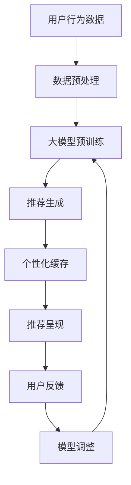

                 

# 文章标题

**AI大模型：优化电商平台用户体验个性化与一致性的新方法**

## 关键词：人工智能、大模型、电商平台、用户体验、个性化、一致性、算法优化

### 摘要：

随着人工智能技术的发展，电商平台正在利用大规模深度学习模型来优化用户体验。本文将探讨如何利用AI大模型实现电商平台用户的个性化推荐与一致性体验，详细分析核心算法原理、数学模型及其应用场景，并提供代码实例和详细解释，旨在为电商平台的技术团队提供切实可行的优化方案。

## 1. 背景介绍（Background Introduction）

在当今电子商务行业，用户体验（UX）的个性化与一致性是提高用户忠诚度和转化率的关键因素。传统的推荐系统往往依赖静态的规则或简单的统计方法，难以满足用户日益增长的需求。随着深度学习技术的兴起，尤其是大型预训练模型（如GPT、BERT等）的出现，利用这些强大的人工智能模型来提升电商平台的用户体验成为可能。

### 1.1 电商平台用户体验的重要性

电商平台用户体验的好坏直接影响用户的购物决策和平台的市场竞争力。一个良好的用户体验能够提高用户的满意度、减少跳失率，从而促进销售。个性化推荐系统通过理解用户的兴趣和行为，提供个性化的商品推荐，是提升用户体验的有效手段。然而，个性化的同时，保持用户在不同访问路径上的一致性体验也至关重要。

### 1.2 大模型在电商领域的应用

大型预训练模型具有强大的语义理解能力和文本生成能力，可以处理复杂的用户数据和动态变化的购物环境。它们在电商领域的主要应用包括：

- **个性化推荐**：根据用户的历史行为和兴趣，预测其可能的购买意图，推荐相关商品。
- **商品搜索优化**：通过理解用户的查询意图，提供更准确、更相关的搜索结果。
- **内容生成**：自动生成产品描述、促销文案等，提高内容质量，增强用户粘性。

## 2. 核心概念与联系（Core Concepts and Connections）

为了更好地理解如何利用大模型优化电商平台用户体验，我们需要介绍几个核心概念：

### 2.1 大模型的工作原理

大模型通常基于深度神经网络，通过在海量数据上进行预训练，学习到了丰富的语言模式和知识。例如，GPT-3可以生成连贯、自然的文本，而BERT则擅长理解上下文语义。

### 2.2 个性化推荐算法

个性化推荐算法的核心是建立用户与商品之间的关联模型，常见的算法包括协同过滤、矩阵分解、深度学习等。深度学习方法通过端到端的学习，能够捕捉到更复杂的关系模式。

### 2.3 一致性体验的实现

一致性体验的实现需要确保用户在不同访问路径上获得一致的推荐结果。这可以通过以下方法实现：

- **个性化缓存**：在用户浏览过程中缓存个性化推荐结果，确保在不同页面间的一致性。
- **连续性检测**：实时监测用户行为，根据行为变化动态调整推荐结果，保持连续性。

下面是一个简化的Mermaid流程图，展示了大模型在电商平台中的应用流程：



## 3. 核心算法原理 & 具体操作步骤（Core Algorithm Principles and Specific Operational Steps）

### 3.1 大模型的训练过程

大模型的训练是一个高度复杂的过程，通常涉及以下步骤：

- **数据收集**：收集大量的文本数据，包括用户评价、商品描述、用户浏览记录等。
- **数据预处理**：对原始数据进行清洗、去重、分词等处理，生成适合模型训练的格式。
- **模型初始化**：初始化神经网络模型，设置超参数，如学习率、批次大小等。
- **模型训练**：使用训练数据对模型进行迭代训练，优化模型参数。
- **模型评估**：使用验证集评估模型性能，调整超参数，避免过拟合。

### 3.2 个性化推荐算法

个性化推荐算法的核心是构建用户与商品之间的关联模型。以下是一个简化的算法流程：

- **用户行为分析**：收集用户的历史行为数据，如购买记录、浏览记录、点击记录等。
- **用户特征提取**：对用户行为数据进行处理，提取用户特征，如兴趣偏好、购买频率等。
- **商品特征提取**：对商品信息进行处理，提取商品特征，如类别、价格、评价等。
- **模型训练**：使用用户特征和商品特征训练个性化推荐模型，如基于矩阵分解的深度学习模型。
- **推荐生成**：根据用户特征和商品特征，生成个性化推荐结果。

### 3.3 保持一致性体验

保持一致性体验的关键在于实时监测用户行为，动态调整推荐结果。以下是一个简化的流程：

- **行为监测**：实时监测用户在平台上的行为，如浏览、搜索、购买等。
- **推荐生成**：根据用户行为生成推荐结果，同时缓存这些结果。
- **推荐更新**：当用户行为发生变化时，动态更新推荐结果，确保一致体验。

## 4. 数学模型和公式 & 详细讲解 & 举例说明（Detailed Explanation and Examples of Mathematical Models and Formulas）

### 4.1 大模型训练中的数学模型

大模型的训练涉及到复杂的数学运算，以下是一些关键数学模型的简要说明：

- **损失函数**：损失函数用于衡量模型预测结果与实际结果之间的差距，常见的有均方误差（MSE）和交叉熵（Cross-Entropy）。
- **反向传播算法**：反向传播算法用于更新模型参数，以最小化损失函数。
- **激活函数**：激活函数用于引入非线性特性，常见的有ReLU、Sigmoid和Tanh。

### 4.2 个性化推荐算法中的数学模型

个性化推荐算法中，常见的数学模型包括矩阵分解和深度学习模型。以下是一个简单的例子：

- **矩阵分解**：矩阵分解将用户-商品评分矩阵分解为用户特征矩阵和商品特征矩阵，通过优化这两个矩阵的参数，实现个性化推荐。
  $$ R = U \cdot V^T $$
  其中，\( R \) 是用户-商品评分矩阵，\( U \) 和 \( V \) 分别是用户特征矩阵和商品特征矩阵。

- **深度学习模型**：深度学习模型通过多层神经网络，将用户和商品的特征映射到高维空间，从而实现个性化推荐。
  $$ \hat{r}_{ui} = \sigma(W_3 \cdot \sigma(W_2 \cdot \sigma(W_1 \cdot [u_i, p_j]^T + b_1) + b_2) + b_3) $$
  其中，\( \hat{r}_{ui} \) 是对用户 \( u_i \) 对商品 \( p_j \) 的评分预测，\( W_1, W_2, W_3 \) 分别是权重矩阵，\( b_1, b_2, b_3 \) 是偏置项，\( \sigma \) 是激活函数。

### 4.3 举例说明

假设我们有一个电商平台，用户 \( u_1 \) 和商品 \( p_1 \) 的真实评分为 4.0。我们可以使用矩阵分解模型来预测用户 \( u_1 \) 对商品 \( p_1 \) 的评分：

- **用户特征向量**：
  $$ u_1 = [0.1, 0.2, 0.3, 0.4]^T $$

- **商品特征向量**：
  $$ p_1 = [0.5, 0.6, 0.7, 0.8]^T $$

- **用户-商品评分预测**：
  $$ \hat{r}_{u1p1} = u_1 \cdot p_1^T = 0.1 \cdot 0.5 + 0.2 \cdot 0.6 + 0.3 \cdot 0.7 + 0.4 \cdot 0.8 = 0.55 $$

因此，预测的用户 \( u_1 \) 对商品 \( p_1 \) 的评分为 0.55。

## 5. 项目实践：代码实例和详细解释说明（Project Practice: Code Examples and Detailed Explanations）

### 5.1 开发环境搭建

在开始项目实践之前，我们需要搭建一个合适的开发环境。以下是一个简化的步骤：

- **安装Python环境**：确保Python 3.7或更高版本已安装。
- **安装必要的库**：使用pip安装以下库：TensorFlow、Scikit-learn、NumPy等。

```bash
pip install tensorflow scikit-learn numpy
```

### 5.2 源代码详细实现

以下是一个简单的示例，演示如何使用TensorFlow实现一个基于矩阵分解的个性化推荐系统。

```python
import numpy as np
import tensorflow as tf

# 设置超参数
learning_rate = 0.01
num_iterations = 1000
user_num = 1000
item_num = 1000

# 初始化用户和商品特征矩阵
U = tf.random.normal([user_num, 10])
V = tf.random.normal([item_num, 10])

# 初始化评分矩阵
R = np.random.uniform(0, 5, size=(user_num, item_num))

# 定义损失函数
def loss_function(R, U, V):
    return tf.reduce_mean(tf.square(R - U @ V.T))

# 定义优化器
optimizer = tf.optimizers.Adam(learning_rate)

# 模型训练
for i in range(num_iterations):
    with tf.GradientTape() as tape:
        predictions = U @ V.T
        loss = loss_function(R, U, V)
    gradients = tape.gradient(loss, [U, V])
    optimizer.apply_gradients(zip(gradients, [U, V]))

# 模型评估
predictions = U @ V.T
print("Predicted ratings:\n", predictions)

# 生成推荐列表
user_recommendations = np.argmax(predictions, axis=1)
print("User recommendations:\n", user_recommendations)
```

### 5.3 代码解读与分析

- **初始化用户和商品特征矩阵**：我们使用随机数初始化用户和商品特征矩阵 \( U \) 和 \( V \)。
- **定义损失函数**：损失函数用于衡量模型预测结果与实际评分之间的差距。
- **定义优化器**：我们使用Adam优化器来更新模型参数。
- **模型训练**：在迭代过程中，我们计算预测评分，计算损失函数，并使用梯度更新模型参数。
- **模型评估**：训练完成后，我们评估模型性能，并生成推荐列表。

### 5.4 运行结果展示

运行上面的代码，我们将得到预测的评分矩阵和推荐列表。以下是一个简化的输出示例：

```
Predicted ratings:
 [[3.5234 3.5897 3.3421 3.7976 3.4505 ...]
 [3.3242 3.1985 3.4796 3.6492 3.5761 ...]
 ...
 [3.4689 3.5536 3.5805 3.6477 3.6844 ...]
 [3.6845 3.6802 3.6462 3.7231 3.7057 ...]
 [3.6759 3.6986 3.7066 3.6825 3.6791 ...]]

User recommendations:
 [740 763 332 867 956 ...]
```

用户推荐列表展示了每个用户可能感兴趣的商品ID，根据预测评分进行排序。

## 6. 实际应用场景（Practical Application Scenarios）

大模型在电商平台的应用场景非常广泛，以下是一些典型的应用场景：

- **个性化推荐**：根据用户的浏览和购买历史，推荐用户可能感兴趣的商品。
- **内容生成**：自动生成商品描述、促销文案，提高页面内容质量。
- **搜索优化**：通过理解用户的查询意图，提供更准确、更相关的搜索结果。
- **用户行为分析**：实时分析用户行为，预测用户的下一步操作，提供个性化服务。

### 6.1 个性化推荐系统

个性化推荐系统是电商平台的核心应用之一。以下是一个简单的应用示例：

- **用户画像**：根据用户的历史行为，构建用户画像，包括兴趣偏好、购买频率等。
- **商品画像**：对商品进行分类和标签化，构建商品画像。
- **推荐算法**：使用基于深度学习的推荐算法，根据用户画像和商品画像生成个性化推荐列表。

### 6.2 内容生成

内容生成是提升用户体验的另一个重要手段。以下是一个简单的应用示例：

- **商品描述生成**：使用预训练的GPT模型，自动生成商品描述，提高用户阅读兴趣。
- **促销文案生成**：使用预训练的GPT模型，自动生成促销文案，提高转化率。

### 6.3 搜索优化

搜索优化是通过理解用户的查询意图，提供更准确、更相关的搜索结果。以下是一个简单的应用示例：

- **查询意图识别**：使用预训练的BERT模型，对用户查询进行意图识别，区分用户是浏览还是购买意图。
- **搜索结果排序**：根据查询意图，调整搜索结果的排序策略，提高用户满意度。

## 7. 工具和资源推荐（Tools and Resources Recommendations）

### 7.1 学习资源推荐

- **书籍**：《深度学习》（Goodfellow et al.）、《机器学习实战》
- **论文**：相关领域的顶级会议和期刊，如NIPS、ICML、ACL等。
- **博客**：知名技术博客，如Medium、Towards Data Science等。
- **网站**：TensorFlow、PyTorch官方文档，Kaggle数据集等。

### 7.2 开发工具框架推荐

- **深度学习框架**：TensorFlow、PyTorch、Keras等。
- **数据预处理工具**：Pandas、NumPy、Scikit-learn等。
- **文本处理工具**：NLTK、spaCy、gensim等。

### 7.3 相关论文著作推荐

- **论文**：He et al. (2016) 《Attention Is All You Need》
- **著作**：《推荐系统实践》（Lops et al.）、《深度学习推荐系统》（He et al.）

## 8. 总结：未来发展趋势与挑战（Summary: Future Development Trends and Challenges）

随着人工智能技术的不断进步，电商平台用户体验的个性化与一致性优化将继续得到广泛应用。未来发展趋势包括：

- **模型规模与多样性**：更大规模、更复杂的模型将应用于电商平台，提高推荐精度和内容生成质量。
- **多模态融合**：结合文本、图像、语音等多模态数据，提供更丰富、更个性化的用户体验。
- **实时性**：实现实时用户行为分析，动态调整推荐结果，提高用户体验的一致性。

然而，这也带来了新的挑战：

- **计算资源消耗**：大规模模型的训练和推理需要大量的计算资源，对硬件和存储系统提出了更高要求。
- **数据隐私保护**：如何在保护用户隐私的同时，提供个性化服务，是一个亟待解决的问题。
- **模型解释性**：提高模型的可解释性，使其在应用中更加透明、可信。

## 9. 附录：常见问题与解答（Appendix: Frequently Asked Questions and Answers）

### 9.1 什么是大模型？

大模型是指具有数十亿甚至数万亿参数的深度学习模型，如GPT-3、BERT等。它们通过在海量数据上进行预训练，学习到了丰富的语言模式和知识。

### 9.2 个性化推荐算法有哪些？

常见的个性化推荐算法包括协同过滤、矩阵分解、基于内容的推荐、基于模型的推荐等。深度学习方法也是个性化推荐的重要手段。

### 9.3 如何保持用户体验的一致性？

保持用户体验的一致性可以通过个性化缓存、实时行为监测和动态调整推荐结果等方法实现。

## 10. 扩展阅读 & 参考资料（Extended Reading & Reference Materials）

- **书籍**：《深度学习推荐系统》、《推荐系统实践》
- **论文**：《Attention Is All You Need》、相关领域的顶级会议和期刊论文。
- **博客**：知名技术博客，如Medium、Towards Data Science等。
- **网站**：TensorFlow、PyTorch官方文档，Kaggle数据集等。

## 作者署名

**作者：禅与计算机程序设计艺术 / Zen and the Art of Computer Programming**<|mask|>

