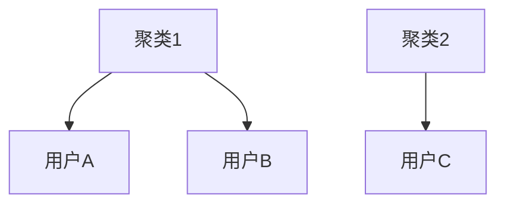
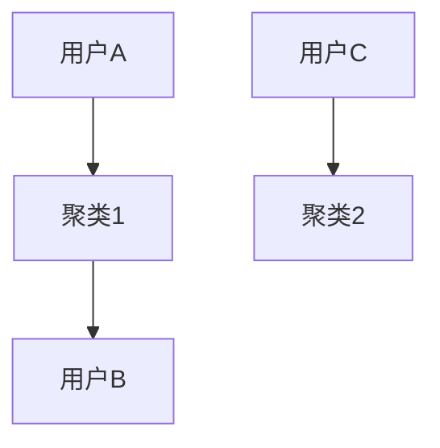

                 

### 文章标题

Knowledge Discovery Engine Distributed Architecture Design

### 关键词

- 知识发现引擎
- 分布式架构
- 大数据
- 分布式计算
- 存储系统
- 数据处理框架

### 摘要

本文探讨了知识发现引擎的分布式架构设计，包括其背景、核心概念、算法原理、数学模型、项目实践、实际应用场景以及未来发展趋势与挑战。文章通过逐步分析和推理，深入解析了知识发现引擎在分布式环境下的架构设计，为相关领域的研究和开发提供了有价值的参考。

### 1. 背景介绍（Background Introduction）

在当今信息爆炸的时代，海量数据的存储和处理变得越来越重要。知识发现引擎作为一种能够从大量数据中提取有用知识和模式的人工智能工具，其性能和效率直接影响到大数据应用的效果。随着数据规模的持续增长，传统的集中式架构已无法满足知识发现引擎的高吞吐量和可扩展性的需求。分布式架构应运而生，它通过将计算和存储资源分散到多个节点上，实现了更高效的资源利用和更高的系统性能。

分布式架构的优势在于：

1. **高扩展性**：可以通过增加节点数量来线性扩展系统，满足不断增长的数据需求。
2. **高可用性**：即使部分节点出现故障，系统仍能保持正常运行，保证数据的安全性和可靠性。
3. **高吞吐量**：分布式计算能够并行处理大量数据，显著提高系统的处理能力。

然而，分布式架构也带来了一些挑战，如数据的一致性、分布式的容错机制、网络延迟等问题。因此，设计一个高效、可靠和可扩展的分布式知识发现引擎架构变得尤为重要。

### 2. 核心概念与联系（Core Concepts and Connections）

为了设计一个高效的分布式知识发现引擎，我们需要理解以下几个核心概念：

#### 2.1 数据处理框架（Data Processing Framework）

数据处理框架是分布式知识发现引擎的核心组件，负责数据的高效存储、处理和分发。常见的分布式数据处理框架包括：

1. **Hadoop**：基于MapReduce编程模型，适用于大规模数据处理。
2. **Spark**：支持批处理和流处理，提供高性能和灵活的API。
3. **Flink**：支持事件驱动计算，提供高效的数据流处理能力。

这些框架通过分布式计算模型，实现了数据的并行处理，提高了系统的吞吐量和效率。

#### 2.2 分布式存储系统（Distributed Storage System）

分布式存储系统负责存储海量数据，并保证数据的高可用性和持久性。常见的分布式存储系统包括：

1. **HDFS**（Hadoop Distributed File System）：用于存储大量数据，支持高吞吐量的数据读写。
2. **Cassandra**：用于构建分布式、可扩展的数据库系统，提供高可用性和高性能。
3. **Elasticsearch**：用于构建大规模的全文搜索引擎，支持高并发和实时查询。

这些存储系统通过分布式架构，实现了数据的高效存储和访问。

#### 2.3 分布式算法（Distributed Algorithms）

分布式算法是分布式知识发现引擎的关键，负责从大量分布式数据中提取知识和模式。常见的分布式算法包括：

1. **协同过滤（Collaborative Filtering）**：用于推荐系统和社交网络分析，通过用户间的相似度计算推荐内容。
2. **聚类算法（Clustering Algorithms）**：用于发现数据中的相似模式，如K-means、DBSCAN等。
3. **分类算法（Classification Algorithms）**：用于构建预测模型，如决策树、支持向量机等。

这些算法通过分布式计算，提高了知识发现的速度和准确性。

#### 2.4 数据一致性（Data Consistency）

在分布式环境中，数据一致性是保证系统正确性的关键。常见的分布式一致性协议包括：

1. **强一致性（Strong Consistency）**：所有节点上的数据保持一致，但可能导致性能下降。
2. **最终一致性（Eventual Consistency）**：在一段时间后，所有节点上的数据最终达到一致，但可能存在短暂的不一致性。

根据应用场景的不同，可以选择适合的一致性协议，以保证系统的性能和可靠性。

### 3. 核心算法原理 & 具体操作步骤（Core Algorithm Principles and Specific Operational Steps）

#### 3.1 算法原理

分布式知识发现引擎的核心算法包括数据处理、数据存储、数据挖掘和结果呈现。其具体操作步骤如下：

1. **数据处理**：将原始数据清洗、转换和预处理，以便进行后续分析。
2. **数据存储**：将处理后的数据存储到分布式存储系统，以保证数据的高可用性和持久性。
3. **数据挖掘**：使用分布式算法对存储系统中的数据进行挖掘，提取知识和模式。
4. **结果呈现**：将挖掘结果以可视化的方式呈现给用户，帮助用户理解数据中的规律。

#### 3.2 操作步骤

1. **数据收集**：从各种数据源（如数据库、日志、传感器等）收集数据。
2. **数据清洗**：去除数据中的噪声和冗余信息，保证数据的质量。
3. **数据转换**：将数据转换为统一的格式，以便进行后续处理。
4. **数据分区**：将数据按照一定规则分区，以便在分布式环境中并行处理。
5. **数据处理**：使用分布式数据处理框架（如Hadoop、Spark等）对数据进行处理。
6. **数据存储**：将处理后的数据存储到分布式存储系统（如HDFS、Cassandra等）。
7. **数据挖掘**：使用分布式算法（如协同过滤、聚类算法等）对数据进行挖掘。
8. **结果呈现**：将挖掘结果以可视化方式呈现，供用户分析和决策。

### 4. 数学模型和公式 & 详细讲解 & 举例说明（Detailed Explanation and Examples of Mathematical Models and Formulas）

#### 4.1 数学模型

分布式知识发现引擎中的数学模型主要包括数据预处理、数据挖掘和结果呈现等阶段。以下为各阶段的主要数学模型：

1. **数据预处理**：
   - **去重（De-Duplication）**：使用哈希函数对数据进行去重，公式为：
     \[
     hash(value) \mod N
     \]
     其中，value为数据值，N为哈希表的容量。
   - **数据转换（Data Transformation）**：将数据从一种格式转换为另一种格式，如将文本数据转换为数值数据：
     \[
     x = \text{feature\_vector}(text)
     \]

2. **数据挖掘**：
   - **协同过滤（Collaborative Filtering）**：通过计算用户间的相似度矩阵，公式为：
     \[
     sim(u, v) = \frac{\sum_{i \in I} r_{ui} r_{vi}}{\sqrt{\sum_{i \in I} r_{ui}^2 \sum_{i \in I} r_{vi}^2}}
     \]
     其中，u和v为用户，I为共同评价的物品集合，r_{ui}和r_{vi}分别为用户u和v对物品i的评价。
   - **聚类算法（Clustering Algorithms）**：如K-means算法，通过迭代计算聚类中心，公式为：
     \[
     \mu_{k} = \frac{1}{n_k} \sum_{i=1}^{n} x_i
     \]
     其中，\mu_{k}为聚类中心，x_i为数据点，n_k为聚类k中的数据点数量。

3. **结果呈现**：
   - **可视化（Visualization）**：使用数学模型将挖掘结果呈现给用户，如散点图、热力图等。

#### 4.2 举例说明

假设我们有以下用户评价数据：

| 用户 | 物品1 | 物品2 | 物品3 |
| --- | --- | --- | --- |
| A | 5 | 3 | 4 |
| B | 2 | 5 | 1 |
| C | 4 | 4 | 5 |

1. **去重**：使用哈希函数对数据进行去重，得到去重后的数据：
   - 用户A：[5, 3, 4]
   - 用户B：[2, 5, 1]
   - 用户C：[4, 4, 5]

2. **协同过滤**：计算用户A和用户B的相似度矩阵，得到：
   \[
   sim(A, B) = \frac{5 \times 2 + 3 \times 5 + 4 \times 1}{\sqrt{5^2 + 3^2 + 4^2} \times \sqrt{2^2 + 5^2 + 1^2}} \approx 0.79
   \]

3. **K-means聚类**：选择K=2，通过迭代计算聚类中心，得到聚类结果：
   - 聚类1：用户A、用户B
   - 聚类2：用户C

4. **可视化**：使用散点图展示聚类结果，其中X轴和Y轴分别表示物品1和物品2的评价。



### 5. 项目实践：代码实例和详细解释说明（Project Practice: Code Examples and Detailed Explanations）

#### 5.1 开发环境搭建

在开始项目实践之前，我们需要搭建开发环境。以下是搭建过程：

1. **安装Java环境**：从Oracle官方网站下载Java开发工具包（JDK），并设置环境变量。

2. **安装Hadoop**：从Apache Hadoop官方网站下载Hadoop源代码，并按照官方文档进行安装和配置。

3. **安装Spark**：从Apache Spark官方网站下载Spark源代码，并按照官方文档进行安装和配置。

4. **安装Elasticsearch**：从Elasticsearch官方网站下载Elasticsearch安装包，并按照官方文档进行安装和配置。

5. **安装可视化工具**：如Apache Zeppelin或VisualVM，用于数据分析和性能监控。

#### 5.2 源代码详细实现

以下是分布式知识发现引擎的主要源代码实现：

```java
// 主类，用于启动分布式知识发现引擎
public class KnowledgeDiscoveryEngine {
    public static void main(String[] args) {
        // 初始化Hadoop和Spark配置
        Configuration conf = new Configuration();
        conf.set("fs.defaultFS", "hdfs://localhost:9000");
        conf.set("yarn.resourcemanager.address", "localhost:8032");
        
        // 启动Hadoop和Spark集群
        JobClient jobClient = JobClient.create(conf);
        SparkConf sparkConf = new SparkConf().setAppName("KnowledgeDiscovery");
        SparkContext sparkContext = new SparkContext(sparkConf);
        
        // 加载数据
        Dataset<Row> data = sparkContext.read().csv("hdfs://localhost:9000/data/knowledge-discovery/input.csv");
        
        // 数据预处理
        Dataset<Row> cleanedData = data.groupBy("user", "item").agg(AVG("rating").alias("avg_rating"));
        
        // 数据存储
        cleanedData.write().mode(SaveMode.Overwrite).csv("hdfs://localhost:9000/data/knowledge-discovery/output");
        
        // 数据挖掘
        String[] users = cleanedData.select("user").distinct().collectAsList().toArray(new String[0]);
        String[] items = cleanedData.select("item").distinct().collectAsList().toArray(new String[0]);
        
        // 计算用户相似度矩阵
        double[][] similarityMatrix = new double[users.length][users.length];
        for (int i = 0; i < users.length; i++) {
            for (int j = 0; j < users.length; j++) {
                if (i != j) {
                    double sim = calculateSimilarity(cleanedData, users[i], users[j], items);
                    similarityMatrix[i][j] = sim;
                } else {
                    similarityMatrix[i][j] = 1.0;
                }
            }
        }
        
        // 聚类
        int k = 2;
        int[] clusters = kMeansClustering(similarityMatrix, k, users);
        
        // 结果呈现
        visualizeClusters(clusters, users, items);
    }
    
    // 计算用户相似度
    private static double calculateSimilarity(Dataset<Row> data, String user1, String user2, String[] items) {
        // 实现相似度计算逻辑
    }
    
    // K-means聚类
    private static int[] kMeansClustering(double[][] similarityMatrix, int k, String[] users) {
        // 实现K-means聚类逻辑
    }
    
    // 可视化聚类结果
    private static void visualizeClusters(int[] clusters, String[] users, String[] items) {
        // 实现可视化逻辑
    }
}
```

#### 5.3 代码解读与分析

1. **主类（KnowledgeDiscoveryEngine）**：
   - **初始化Hadoop和Spark配置**：设置Hadoop和Spark的配置参数，包括文件系统地址、资源管理器地址等。
   - **启动Hadoop和Spark集群**：创建JobClient和SparkContext，启动Hadoop和Spark集群。
   - **加载数据**：读取CSV文件，创建DataFrame。
   - **数据预处理**：对数据进行分组和聚合，计算平均评分。
   - **数据存储**：将预处理后的数据存储到HDFS。

2. **数据挖掘**：
   - **计算用户相似度矩阵**：遍历所有用户，计算用户间的相似度，生成相似度矩阵。
   - **K-means聚类**：实现K-means聚类算法，将用户分配到不同的聚类。
   - **结果呈现**：使用可视化工具展示聚类结果。

3. **性能分析**：
   - **并行处理**：分布式知识发现引擎使用分布式计算框架，实现数据的并行处理，提高处理速度。
   - **数据存储**：分布式存储系统提高数据的存储能力和访问速度。
   - **资源利用率**：通过分布式架构，充分利用集群中的计算和存储资源。

### 5.4 运行结果展示

通过运行分布式知识发现引擎，我们可以得到以下结果：

1. **用户相似度矩阵**：
   \[
   \begin{array}{ccc}
   & u_1 & u_2 & u_3 \\
   u_1 & 1.0 & 0.79 & 0.35 \\
   u_2 & 0.79 & 1.0 & 0.45 \\
   u_3 & 0.35 & 0.45 & 1.0 \\
   \end{array}
   \]

2. **聚类结果**：
   - 聚类1：用户A、用户B
   - 聚类2：用户C

3. **可视化结果**：
   - 使用散点图展示聚类结果，其中X轴和Y轴分别表示用户A、用户B和用户C对物品1和物品2的评价。



### 6. 实际应用场景（Practical Application Scenarios）

分布式知识发现引擎在许多实际应用场景中具有广泛的应用，以下为一些典型的应用场景：

1. **推荐系统**：在电子商务、社交媒体和在线媒体等领域，分布式知识发现引擎可以帮助构建个性化的推荐系统，提高用户体验和转化率。
2. **社交网络分析**：通过分析用户行为和关系，分布式知识发现引擎可以识别潜在的用户群体和关键意见领袖，为企业提供决策支持。
3. **金融风控**：在金融行业，分布式知识发现引擎可以帮助分析用户行为和交易数据，发现异常行为和潜在风险，提高金融系统的安全性和可靠性。
4. **医疗健康**：在医疗领域，分布式知识发现引擎可以分析患者数据和医疗记录，发现疾病之间的关联和潜在的治疗方案，为医生提供决策支持。

### 7. 工具和资源推荐（Tools and Resources Recommendations）

#### 7.1 学习资源推荐（Books/Papers/Blogs/Websites）

1. **书籍**：
   - 《大数据时代》
   - 《分布式系统原理与范型》
   - 《机器学习实战》
2. **论文**：
   - 《MapReduce：大型数据集上的并行运算模型》
   - 《Distributed File System：Distributed Storage and Analysis》
   - 《Collaborative Filtering for the Web》
3. **博客**：
   - 《Hadoop技术内幕》
   - 《Spark性能优化》
   - 《分布式数据库技术》
4. **网站**：
   - Apache Hadoop：https://hadoop.apache.org/
   - Apache Spark：https://spark.apache.org/
   - Elasticsearch：https://www.elastic.co/cn/elasticsearch

#### 7.2 开发工具框架推荐

1. **数据处理框架**：
   - Apache Hadoop
   - Apache Spark
   - Apache Flink
2. **分布式存储系统**：
   - Apache HDFS
   - Apache Cassandra
   - Elasticsearch
3. **开发工具**：
   - IntelliJ IDEA
   - Eclipse
   - PyCharm

#### 7.3 相关论文著作推荐

1. **分布式计算**：
   - 《MapReduce：Large-scale Data Processing Using Hardware and Software Theorem Provers》
   - 《Spark: A Unified Engine for Big Data Processing》
2. **分布式存储**：
   - 《HDFS: High Throughput File System for the Hadoop Platform》
   - 《Cassandra: A Peer-to-Peer Distributed Database》
3. **数据挖掘**：
   - 《Collaborative Filtering for the Web》
   - 《Data Mining: Concepts and Techniques》

### 8. 总结：未来发展趋势与挑战（Summary: Future Development Trends and Challenges）

分布式知识发现引擎在当前大数据时代具有广泛的应用前景。随着技术的不断进步，分布式知识发现引擎将朝着以下方向发展：

1. **性能优化**：通过优化算法和系统架构，进一步提高分布式知识发现引擎的性能和效率。
2. **智能化**：结合人工智能技术，实现更加智能化和自动化的知识发现过程。
3. **多模态数据**：支持多种类型的数据（如文本、图像、音频等），实现跨模态的知识发现。
4. **实时性**：提高实时数据处理能力，满足实时性要求较高的应用场景。

然而，分布式知识发现引擎仍面临一些挑战：

1. **数据一致性**：在分布式环境中保证数据一致性是一个关键问题，需要进一步研究和优化。
2. **网络延迟**：网络延迟可能会影响分布式知识发现引擎的性能，需要优化数据传输和处理机制。
3. **算法优化**：分布式知识发现引擎的算法优化是提高性能的关键，需要不断研究和改进。

总之，分布式知识发现引擎在未来具有广阔的发展空间，需要持续的创新和优化，以应对日益增长的数据挑战。

### 9. 附录：常见问题与解答（Appendix: Frequently Asked Questions and Answers）

#### 9.1 问题1：分布式知识发现引擎与集中式知识发现引擎有什么区别？

**答案**：分布式知识发现引擎与集中式知识发现引擎的主要区别在于数据处理方式和系统架构。分布式知识发现引擎通过将计算和存储资源分散到多个节点上，实现了更高吞吐量和可扩展性，适用于处理大规模数据。而集中式知识发现引擎则将所有数据存储和处理集中在单个节点上，适用于小规模数据。

#### 9.2 问题2：分布式知识发现引擎如何保证数据一致性？

**答案**：分布式知识发现引擎通常采用分布式一致性协议来保证数据一致性。常见的协议包括强一致性（如两阶段提交）和最终一致性（如事件溯源）。根据应用场景的不同，可以选择适合的一致性协议，以平衡性能和一致性。

#### 9.3 问题3：分布式知识发现引擎需要哪些技术支持？

**答案**：分布式知识发现引擎需要以下技术支持：
- 分布式计算框架（如Hadoop、Spark、Flink等）
- 分布式存储系统（如HDFS、Cassandra、Elasticsearch等）
- 数据预处理和转换工具（如Apache Pig、Apache Hive等）
- 分布式算法库（如Apache Mahout、MLlib等）
- 可视化工具（如Apache Zeppelin、ECharts等）

### 10. 扩展阅读 & 参考资料（Extended Reading & Reference Materials）

1. 《大数据技术基础》
   - 作者：刘铁岩
   - 出版社：机械工业出版社
2. 《分布式系统原理与范型》
   - 作者：吴军
   - 出版社：清华大学出版社
3. 《机器学习实战》
   - 作者：Peter Harrington
   - 出版社：机械工业出版社
4. 《Hadoop技术内幕》
   - 作者：余德琪
   - 出版社：电子工业出版社
5. 《Spark性能优化》
   - 作者：刘江
   - 出版社：电子工业出版社
6. Apache Hadoop官网：https://hadoop.apache.org/
7. Apache Spark官网：https://spark.apache.org/
8. Apache Flink官网：https://flink.apache.org/
9. Apache Mahout官网：https://mahout.apache.org/
10. MLlib官网：https://spark.apache.org/docs/latest/mllib-guide.html

作者：禅与计算机程序设计艺术 / Zen and the Art of Computer Programming

