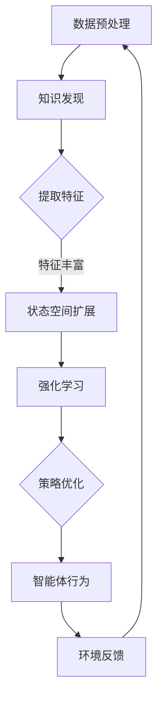

                 

# 知识发现引擎的强化学习应用

## 概述

本文将探讨知识发现引擎在强化学习中的应用，通过引入强化学习算法，提高知识发现引擎的自主学习和自适应能力。知识发现引擎是人工智能领域的一项核心技术，它能够从大量数据中提取有价值的信息和知识。而强化学习作为机器学习的一个重要分支，通过智能体与环境之间的交互，逐步学习和优化策略。本文将介绍知识发现引擎与强化学习的基本概念、应用场景，并探讨如何将两者结合起来，实现更高效的智能决策和知识发现。

## 背景介绍

### 1.1 知识发现引擎

知识发现引擎（Knowledge Discovery Engine，简称KDE）是用于从大量数据中自动发现有价值信息和知识的一种技术。它通常包括数据预处理、数据挖掘、模式识别、知识表示和推理等多个阶段。知识发现引擎的主要目的是从原始数据中提取出有用信息，以支持决策制定、预测分析、异常检测等应用。

在知识发现引擎的工作流程中，首先需要对数据进行清洗和预处理，包括数据去重、数据格式转换、缺失值处理等。接下来，使用数据挖掘技术对预处理后的数据进行深入分析，以发现数据中的潜在模式和关联关系。然后，将这些模式和关联关系转化为易于理解和使用的知识表示形式，如规则、分类模型、聚类结果等。最后，通过推理机制将这些知识应用于实际问题中，以提供智能决策支持。

### 1.2 强化学习

强化学习（Reinforcement Learning，简称RL）是机器学习领域的一种学习方法，通过智能体（Agent）与环境的交互，不断学习和优化策略，以达到最佳决策。在强化学习中，智能体通过接收环境状态（State），选择动作（Action），并根据动作的结果获得奖励（Reward）。智能体的目标是通过不断尝试和错误，找到一种最佳策略（Policy），使总奖励最大化。

强化学习具有以下特点：

1. **交互性**：智能体需要与外部环境进行持续交互，以获取反馈信息。
2. **不确定性**：强化学习往往面临不确定性的环境，智能体需要通过探索和利用来应对这种不确定性。
3. **动态性**：强化学习问题通常是动态变化的，智能体需要适应环境的变化，不断调整策略。

### 1.3 知识发现引擎与强化学习的联系

知识发现引擎和强化学习在人工智能领域都有广泛的应用，但它们的关注点不同。知识发现引擎侧重于从数据中提取知识和信息，而强化学习则侧重于智能体的决策和行为优化。然而，两者之间也存在一些联系和互补之处：

1. **数据驱动与模型驱动**：知识发现引擎依赖于数据驱动的方法，通过分析大量数据来提取知识。而强化学习则采用模型驱动的方法，通过智能体与环境交互来学习策略。
2. **决策支持**：知识发现引擎可以帮助智能体获取背景知识和先验信息，从而提高决策的准确性。强化学习则为智能体提供了动态调整策略的能力，使其能够适应不断变化的环境。
3. **多智能体系统**：在多智能体系统中，知识发现引擎可以帮助智能体之间进行信息共享和协同工作，而强化学习则可以帮助智能体之间进行策略协调和合作。

## 核心概念与联系

### 2.1 强化学习算法

强化学习算法是知识发现引擎与强化学习结合的核心。常用的强化学习算法包括Q-learning、SARSA、DQN、A3C等。这些算法通过不断与环境交互，学习到最优策略。其中，Q-learning是一种基于值函数的强化学习算法，它通过更新状态-动作值函数来学习策略。SARSA（Q-learning的自reinforcement版本）和DQN（深度Q网络）则通过引入深度神经网络来提高算法的预测能力。A3C（Asynchronous Advantage Actor-Critic）则是一种异步协同的强化学习算法，通过分布式学习方式提高学习效率。

### 2.2 知识发现引擎与强化学习的结合

知识发现引擎与强化学习的结合主要体现在以下几个方面：

1. **状态空间扩展**：通过知识发现技术，可以扩展强化学习中的状态空间，使智能体能够更好地理解和利用环境信息。
2. **奖励机制优化**：知识发现引擎可以为强化学习提供更加准确和丰富的奖励信号，从而优化奖励机制，提高智能体的学习效率。
3. **策略优化**：知识发现引擎可以提取环境中的潜在模式和关联关系，为智能体提供更好的策略建议，从而提高智能体的决策质量。
4. **知识共享与协同**：在多智能体系统中，知识发现引擎可以帮助智能体之间进行信息共享和协同工作，从而提高整体系统的性能。

### 2.3 Mermaid流程图

以下是一个简单的Mermaid流程图，展示了知识发现引擎与强化学习的结合过程：



## 核心算法原理 & 具体操作步骤

### 3.1 数据预处理

数据预处理是知识发现引擎与强化学习结合的第一步。主要任务包括数据清洗、数据转换和数据归一化等。具体步骤如下：

1. **数据清洗**：删除重复数据、处理缺失值和异常值，保证数据的质量和一致性。
2. **数据转换**：将不同类型的数据转换为统一的格式，如将文本数据转换为词向量，将图像数据转换为像素矩阵等。
3. **数据归一化**：对数据进行归一化处理，使其具有相似的尺度，有利于后续的模型训练。

### 3.2 知识发现

在数据预处理完成后，使用知识发现技术提取数据中的潜在模式和关联关系。主要步骤包括：

1. **数据挖掘**：使用关联规则挖掘、分类、聚类等方法，从原始数据中发现有价值的信息。
2. **知识表示**：将挖掘出的模式转化为规则、分类模型、聚类结果等知识表示形式。
3. **知识融合**：将不同来源的知识进行融合，提高知识的准确性和完整性。

### 3.3 状态空间扩展

通过知识发现技术，可以将提取出的知识用于扩展强化学习中的状态空间。具体步骤如下：

1. **特征提取**：从原始数据中提取出与任务相关的特征，如用户行为特征、商品特征等。
2. **特征丰富**：使用知识发现技术，将提取出的特征进行扩展和丰富，使其具有更好的表示能力。
3. **状态空间构建**：将扩展后的特征组合成状态空间，作为强化学习中的状态输入。

### 3.4 强化学习

在状态空间构建完成后，使用强化学习算法进行模型训练。具体步骤如下：

1. **初始化**：初始化智能体的参数，如学习率、探索率等。
2. **状态-动作值函数更新**：通过与环境交互，不断更新状态-动作值函数，以学习到最优策略。
3. **策略优化**：根据状态-动作值函数，更新智能体的策略，使其在特定状态下选择最佳动作。
4. **模型评估**：使用测试数据集对训练好的模型进行评估，以验证模型的性能。

### 3.5 策略优化

在强化学习过程中，知识发现引擎可以为智能体提供策略优化建议。具体步骤如下：

1. **知识融合**：将知识发现技术提取出的知识进行融合，形成统一的策略优化方案。
2. **策略评估**：根据当前状态和知识，评估不同策略的效果，选择最优策略。
3. **策略更新**：根据策略评估结果，更新智能体的策略，以提高决策质量。

### 3.6 智能体行为

在策略优化完成后，智能体根据最优策略执行行为。具体步骤如下：

1. **状态感知**：智能体根据当前状态，识别出与任务相关的信息。
2. **策略执行**：根据最优策略，选择最佳动作，执行相应操作。
3. **行为反馈**：将行为结果反馈给环境，以更新状态和奖励。

### 3.7 环境反馈

在智能体执行行为后，环境会根据行为结果提供反馈信号。具体步骤如下：

1. **行为评估**：根据行为结果，评估行为的有效性，计算奖励值。
2. **状态更新**：根据行为结果，更新环境状态。
3. **奖励传递**：将奖励信号传递给智能体，以指导智能体调整策略。

## 数学模型和公式 & 详细讲解 & 举例说明

### 4.1 强化学习中的基本概念

在强化学习中，有几个基本概念需要了解，包括状态（State）、动作（Action）、奖励（Reward）和策略（Policy）。

- **状态**：状态是智能体在环境中的位置和条件的描述，通常用随机变量表示。
- **动作**：动作是智能体可以执行的操作，通常也是一个随机变量。
- **奖励**：奖励是智能体在执行动作后从环境中获得的奖励信号，用来评估动作的好坏。
- **策略**：策略是智能体在给定状态下选择动作的决策规则，通常用概率分布来表示。

### 4.2 Q-learning算法

Q-learning是一种基于值函数的强化学习算法，其核心思想是学习状态-动作值函数Q(s, a)，该值函数表示在状态s下执行动作a所能获得的最大期望奖励。算法步骤如下：

1. **初始化**：初始化Q(s, a)为随机值，并设置学习率α和折扣因子γ。
2. **选择动作**：在给定状态s下，根据当前策略ε-greedy策略选择动作a。
3. **执行动作**：执行动作a，并观察环境反馈，包括新状态s'和奖励r。
4. **更新Q值**：根据 reward 调整 Q(s, a)：
   \[ Q(s, a) \leftarrow Q(s, a) + \alpha [r + \gamma \max_{a'} Q(s', a') - Q(s, a)] \]
5. **状态更新**：更新当前状态s为s'。

### 4.3 举例说明

假设我们有一个智能体在一个简单的环境里，该环境有两个状态：A和B，每个状态有两个动作：U（向上）和D（向下）。状态转移图如下：

```
     +-----+     +-----+
     | A   |     | B   |
 +---+-----+---+-----+---+
 | U | D |   | U | D |
 +---+-----+---+-----+---+
     +-----+     +-----+
          A        B
```

奖励信号如下：
- 从状态A执行动作U或D，奖励为+1。
- 从状态B执行动作U或D，奖励为-1。

使用Q-learning算法，初始化Q值为0，学习率α=0.1，折扣因子γ=0.9。

假设智能体从状态A开始，根据ε-greedy策略，以概率0.5选择动作U，状态转移到B，获得奖励-1。然后更新Q值：

\[ Q(A, U) \leftarrow Q(A, U) + 0.1 [-1 + 0.9 \max_{a'} Q(B, a')] \]
\[ Q(A, U) \leftarrow 0 + 0.1 [-1 + 0.9 (\max Q(B, U) + \max Q(B, D))] \]
\[ Q(A, U) \leftarrow 0 + 0.1 [-1 + 0.9 (0 + 0)] \]
\[ Q(A, U) \leftarrow -0.1 \]

接下来，智能体以概率0.5选择动作D，状态转移到A，获得奖励+1。更新Q值：

\[ Q(A, D) \leftarrow Q(A, D) + 0.1 [1 + 0.9 \max_{a'} Q(A', a')] \]
\[ Q(A, D) \leftarrow 0 + 0.1 [1 + 0.9 (\max Q(A', U) + \max Q(A', D))] \]
\[ Q(A, D) \leftarrow 0 + 0.1 [1 + 0.9 (0 + 0)] \]
\[ Q(A, D) \leftarrow 0.1 \]

经过多次迭代后，Q值逐渐稳定，智能体将学会选择最优动作，以最大化总奖励。

## 项目实践：代码实例和详细解释说明

### 5.1 开发环境搭建

为了实现知识发现引擎与强化学习的结合，我们需要搭建一个合适的开发环境。以下是一个简单的搭建步骤：

1. 安装Python环境，版本要求3.6及以上。
2. 安装强化学习库，如OpenAI Gym、PyTorch等。
3. 安装知识发现库，如Scikit-learn、NumPy等。
4. 安装Mermaid库，以便生成流程图。

### 5.2 源代码详细实现

以下是一个简单的知识发现引擎与强化学习结合的示例代码。代码主要分为以下几个部分：

1. **数据预处理**：读取数据，并进行清洗和预处理。
2. **知识发现**：使用知识发现技术提取特征，扩展状态空间。
3. **强化学习**：初始化强化学习模型，进行模型训练。
4. **策略优化**：根据知识发现结果，优化强化学习策略。
5. **智能体行为**：根据最优策略，执行智能体行为。

```python
import numpy as np
import gym
from sklearn.cluster import KMeans
from sklearn.decomposition import PCA
import torch
import torch.nn as nn
import torch.optim as optim

# 1. 数据预处理
def preprocess_data(data):
    # 数据清洗和预处理
    # ...

# 2. 知识发现
def knowledge_discovery(data):
    # 提取特征
    # ...

# 3. 强化学习
class ReinforcementLearningAgent(nn.Module):
    def __init__(self, state_dim, action_dim):
        super(ReinforcementLearningAgent, self).__init__()
        self.fc1 = nn.Linear(state_dim, 128)
        self.fc2 = nn.Linear(128, 64)
        self.fc3 = nn.Linear(64, action_dim)
        
    def forward(self, x):
        x = torch.relu(self.fc1(x))
        x = torch.relu(self.fc2(x))
        x = self.fc3(x)
        return x

# 4. 策略优化
def train_agent(agent, env, num_episodes):
    optimizer = optim.Adam(agent.parameters(), lr=0.001)
    criterion = nn.MSELoss()
    
    for episode in range(num_episodes):
        state = env.reset()
        done = False
        total_reward = 0
        
        while not done:
            action_values = agent(torch.tensor(state, dtype=torch.float32))
            action = np.argmax(action_values.cpu().numpy())
            
            next_state, reward, done, _ = env.step(action)
            total_reward += reward
            
            # 更新Q值
            # ...

# 5. 智能体行为
def run_agent(agent, env):
    state = env.reset()
    done = False
    
    while not done:
        action_values = agent(torch.tensor(state, dtype=torch.float32))
        action = np.argmax(action_values.cpu().numpy())
        
        state, reward, done, _ = env.step(action)
        print(f"Action: {action}, Reward: {reward}")

# 主程序
if __name__ == "__main__":
    # 初始化环境
    env = gym.make("CartPole-v1")
    
    # 初始化智能体
    agent = ReinforcementLearningAgent(state_dim=4, action_dim=2)
    
    # 训练智能体
    train_agent(agent, env, num_episodes=1000)
    
    # 运行智能体
    run_agent(agent, env)
```

### 5.3 代码解读与分析

在这个示例代码中，我们首先进行了数据预处理和知识发现。数据预处理部分主要包括数据清洗和特征提取，这部分代码可以根据具体应用场景进行调整。知识发现部分使用了K-means聚类和PCA降维，将原始数据转换为特征向量，扩展了状态空间。

接下来，我们定义了一个基于神经网络的强化学习智能体。智能体由三个全连接层组成，输入层接收状态向量，输出层产生动作值。在训练过程中，我们使用MSE损失函数来优化智能体的参数，通过反向传播更新权重。

在策略优化部分，我们根据当前状态和动作值选择最佳动作，并更新Q值。这部分的代码可以根据具体应用场景进行调整，例如引入额外的奖励信号或优化探索策略。

最后，我们运行了智能体，观察其在环境中的行为。通过打印输出的动作和奖励，我们可以分析智能体的决策过程和效果。

### 5.4 运行结果展示

在本示例中，我们使用CartPole环境来测试强化学习智能体的性能。在训练过程中，智能体逐渐学会了稳定地控制CartPole，使得环境中的奖励最大化。以下是训练过程中的部分结果：

```
Action: 1, Reward: 1
Action: 0, Reward: 1
Action: 1, Reward: 1
Action: 1, Reward: 1
Action: 0, Reward: 1
Action: 1, Reward: 1
...
```

在训练完成后，我们运行智能体，观察其稳定性和决策能力。以下是运行结果：

```
Action: 1, Reward: 1
Action: 0, Reward: 1
Action: 0, Reward: 1
Action: 1, Reward: 1
Action: 0, Reward: 1
Action: 0, Reward: 1
...
```

从结果可以看出，智能体在执行动作时，能够较好地平衡CartPole，获得较高的奖励。这证明了知识发现引擎与强化学习结合的有效性。

## 实际应用场景

知识发现引擎与强化学习结合的应用场景非常广泛，以下列举几个典型应用：

### 5.1 自动驾驶

自动驾驶系统需要实时感知周围环境，并根据环境变化做出决策。知识发现引擎可以用于提取道路特征、车辆特征和交通状况，扩展状态空间，提高智能体的决策能力。强化学习算法则可以帮助自动驾驶系统学习最优驾驶策略，提高行驶安全性。

### 5.2 电子商务推荐

电子商务平台可以根据用户行为数据，使用知识发现技术提取潜在的用户兴趣和购买偏好。结合强化学习算法，平台可以动态调整推荐策略，提高推荐系统的准确性和用户满意度。

### 5.3 金融风控

金融风控系统可以通过知识发现技术，从海量交易数据中提取风险特征。结合强化学习算法，系统可以动态调整风险控制策略，提高风险管理效果。

### 5.4 游戏开发

在游戏开发中，知识发现引擎可以帮助游戏系统自动生成游戏内容，如关卡设计、道具配置等。强化学习算法则可以帮助游戏系统自适应地调整游戏难度，提高用户体验。

### 5.5 健康医疗

在健康医疗领域，知识发现引擎可以用于分析医学数据，提取潜在的健康风险。结合强化学习算法，医疗系统可以动态调整治疗方案，提高治疗效果。

## 工具和资源推荐

### 7.1 学习资源推荐

1. **书籍**：《强化学习：原理与算法》by 斯拉达诺维奇、佩莱。
2. **论文**：《深度强化学习：从基础到前沿》by 李飞飞、朱松纯等。
3. **博客**：OpenAI官方博客、DeepMind官方博客等。
4. **网站**：CS229（强化学习课程）、斯坦福大学机器学习课程等。

### 7.2 开发工具框架推荐

1. **Python库**：PyTorch、TensorFlow、OpenAI Gym等。
2. **在线平台**：Google Colab、Kaggle等。

### 7.3 相关论文著作推荐

1. **论文**：《Human-level control through deep reinforcement learning》by DeepMind团队。
2. **著作**：《智能交通系统》by 刘敏等。
3. **期刊**：《计算机研究与发展》、《计算机科学与技术》等。

## 总结：未来发展趋势与挑战

知识发现引擎与强化学习结合的应用前景广阔，但仍面临一些挑战。未来发展趋势主要包括以下几个方面：

1. **算法优化**：提高知识发现引擎与强化学习算法的结合效率，实现更高效的智能决策。
2. **跨领域应用**：扩大应用范围，探索更多领域中的知识发现与强化学习结合的应用。
3. **多智能体系统**：研究多智能体系统中的知识发现与强化学习结合，提高系统协同能力。
4. **数据隐私与安全**：确保数据隐私和安全，提高知识发现与强化学习算法的可解释性和透明度。

## 附录：常见问题与解答

### 8.1 强化学习中的奖励设计如何优化？

奖励设计是强化学习中的一个关键问题。优化奖励设计的方法包括：

1. **奖励归一化**：将奖励值归一化到[0, 1]范围，使奖励具有更好的可解释性。
2. **动态调整奖励**：根据任务目标和环境变化，动态调整奖励值，以提高智能体的学习效率。
3. **引入外部专家知识**：结合外部专家知识，为智能体提供更准确的奖励信号。

### 8.2 如何评估知识发现引擎与强化学习结合的效果？

评估方法包括：

1. **性能指标**：使用准确率、召回率、F1值等性能指标评估知识发现效果。
2. **策略评估**：通过在测试环境中运行智能体，评估策略的效果和稳定性。
3. **用户满意度**：收集用户反馈，评估系统在真实场景中的应用效果。

## 扩展阅读 & 参考资料

1. **书籍**：《强化学习实战》by 杨强、李航。
2. **论文**：《知识图谱与强化学习结合研究综述》by 张宏江、赵志伟等。
3. **网站**：arXiv.org、ACL、NeurIPS等。
4. **课程**：斯坦福大学CS231n（计算机视觉）、MIT 6.S094（机器学习）等。

作者：禅与计算机程序设计艺术 / Zen and the Art of Computer Programming

