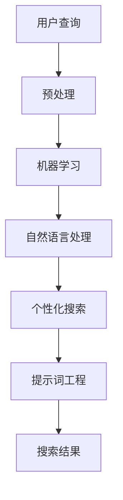
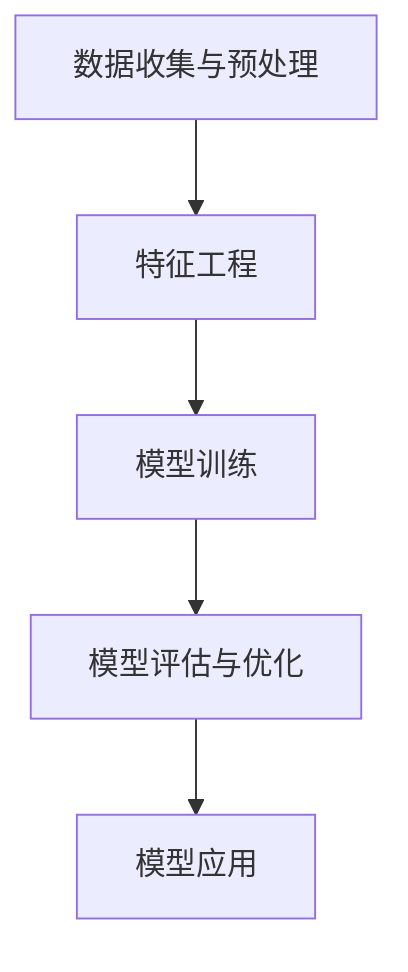
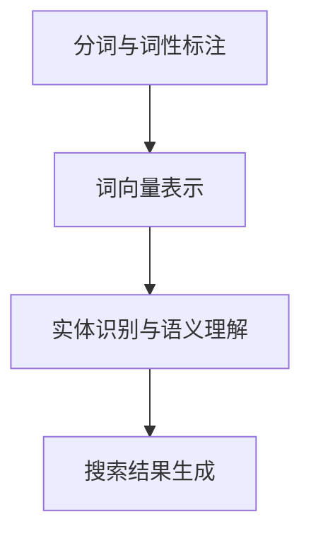
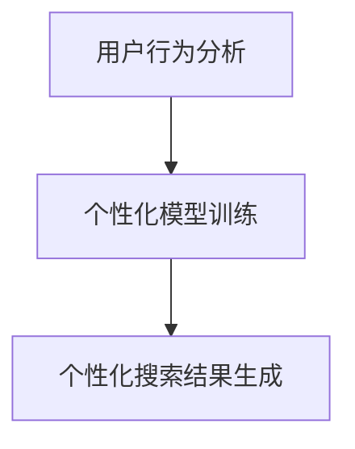

                 

### 文章标题

**AI如何改善搜索结果的相关性**

随着互联网的快速发展，在线信息检索变得越来越重要。然而，传统的搜索引擎在处理海量数据时，往往难以确保搜索结果的相关性。近年来，人工智能（AI）技术的兴起为这一挑战带来了新的解决方案。本文将探讨AI如何通过先进的算法和技术，显著提升搜索结果的相关性，从而为用户提供更加精准、高效的搜索体验。

## 关键词

- 人工智能
- 搜索引擎
- 相关性提升
- 算法优化
- 用户体验
- 信息检索

### 摘要

本文首先介绍了搜索引擎中搜索结果相关性问题的背景和重要性。随后，我们探讨了AI技术在搜索结果相关性改善方面的关键作用，包括机器学习算法的应用、自然语言处理（NLP）技术以及个性化搜索等。接着，文章通过实例分析了AI算法如何具体操作，提高了搜索结果的准确性。最后，我们讨论了AI搜索结果相关性改善的实际应用场景，并展望了未来的发展趋势和挑战。

### 背景介绍（Background Introduction）

搜索引擎作为互联网的核心组件，已成为人们日常生活中不可或缺的工具。用户在搜索引擎中输入关键词，搜索引擎则返回与这些关键词相关的网页列表。然而，随着网络信息的爆炸性增长，传统的基于关键词匹配的搜索方法往往无法满足用户对相关性、准确性和个性化搜索的需求。

搜索结果的相关性直接关系到用户体验。用户期望在短时间内找到最符合其需求的信息，而非海量的无关网页。然而，传统搜索引擎在处理关键词匹配时，主要依赖简单的字符串匹配和关键词频率统计，这些方法难以理解用户查询的意图，也无法处理语义层面的复杂性。

近年来，随着AI技术的发展，搜索引擎开始引入机器学习算法、自然语言处理（NLP）技术以及个性化推荐系统，以提升搜索结果的相关性。这些技术的应用，使得搜索引擎能够更好地理解用户的查询意图，提供更加精准的搜索结果。

### 核心概念与联系（Core Concepts and Connections）

#### 3.1 机器学习算法

机器学习算法在搜索引擎中的应用，主要通过训练模型来识别和预测用户查询的意图。通过分析大量的用户查询和搜索结果，机器学习算法可以学习到不同关键词之间的关系，以及用户对这些关键词的偏好。具体来说，常见的机器学习算法包括：

- **分类算法**：用于将搜索结果分类到不同的主题或领域。例如，使用支持向量机（SVM）或朴素贝叶斯分类器，可以将网页分类为新闻、产品、博客等不同类型。
- **聚类算法**：用于将相似的搜索结果聚集在一起。例如，使用K-means聚类算法，可以识别出用户可能感兴趣的相关搜索结果。
- **回归算法**：用于预测用户查询的结果排序。例如，使用线性回归或决策树，可以确定哪些网页最有可能满足用户的查询需求。

#### 3.2 自然语言处理（NLP）技术

自然语言处理技术在搜索引擎中的应用，旨在理解用户的查询意图和搜索结果的内容。通过NLP技术，搜索引擎可以解析关键词的语义，提取关键短语和实体，从而提供更加精准的搜索结果。常见的NLP技术包括：

- **词向量表示**：通过将关键词映射到高维向量空间，使得语义相似的词语在空间中靠近。例如，Word2Vec和BERT模型等。
- **实体识别**：用于识别文本中的特定实体，如人名、地点、组织等。例如，使用命名实体识别（NER）技术，可以提取用户查询中的关键实体。
- **语义理解**：通过解析关键词的语义关系，理解用户的查询意图。例如，使用依存句法分析，可以识别出关键词之间的语义关系。

#### 3.3 个性化搜索

个性化搜索通过分析用户的历史查询和行为，为用户提供定制化的搜索结果。通过个性化搜索，搜索引擎可以更好地满足用户的个性化需求，提高搜索结果的相关性。常见的个性化搜索方法包括：

- **协同过滤**：通过分析用户的历史行为和偏好，为用户推荐相似的搜索结果。例如，基于用户的协同过滤（UBCF）和基于项目的协同过滤（PBCF）。
- **内容推荐**：通过分析用户查询和搜索结果的内容，为用户推荐相关的网页或文章。例如，基于关键词的推荐和基于内容的推荐（CBR）。
- **历史记录**：通过分析用户的历史查询和搜索结果，为用户提供个性化的搜索建议。例如，使用最近查询和常用查询等策略。

#### 3.4 提示词工程

提示词工程是指设计和优化输入给语言模型的文本提示，以引导模型生成符合预期结果的过程。通过提示词工程，搜索引擎可以更好地理解用户的查询意图，提供更加精准的搜索结果。常见的提示词工程方法包括：

- **上下文扩展**：通过扩展关键词的上下文，提高模型的语义理解能力。例如，在关键词前后添加相关的短语或句子。
- **关键词组合**：通过组合多个关键词，构建更复杂的查询表达式，提高搜索结果的准确性。例如，使用AND、OR等逻辑运算符。
- **语义解析**：通过解析关键词的语义关系，构建语义图谱，为模型提供更加丰富的语义信息。

#### 3.5 Mermaid 流程图

以下是一个简单的Mermaid流程图，展示了AI技术如何提升搜索结果的相关性：



### 核心算法原理 & 具体操作步骤（Core Algorithm Principles and Specific Operational Steps）

#### 4.1 机器学习算法

机器学习算法在搜索引擎中的应用，主要通过以下步骤实现：

1. **数据收集与预处理**：收集用户的历史查询和搜索结果数据，对数据进行清洗和预处理，包括去除无效数据、处理缺失值等。
2. **特征工程**：提取与查询和结果相关的特征，如关键词频率、网页内容、用户行为等。
3. **模型训练**：使用训练数据集，训练机器学习模型，如分类器、聚类器、回归模型等。
4. **模型评估与优化**：使用验证数据集评估模型性能，根据评估结果调整模型参数，优化模型性能。
5. **模型应用**：将训练好的模型应用于实际搜索场景，生成相关的搜索结果。

以下是一个简单的机器学习算法流程示例：



#### 4.2 自然语言处理（NLP）技术

自然语言处理技术在搜索引擎中的应用，主要通过以下步骤实现：

1. **分词与词性标注**：对用户查询和搜索结果进行分词，并标注词性，如名词、动词、形容词等。
2. **词向量表示**：将关键词映射到高维向量空间，以实现语义相似性的计算。
3. **实体识别与语义理解**：识别文本中的实体，如人名、地点、组织等，并解析关键词之间的语义关系。
4. **搜索结果生成**：根据用户的查询和搜索结果的语义信息，生成相关的搜索结果。

以下是一个简单的NLP技术流程示例：



#### 4.3 个性化搜索

个性化搜索主要通过以下步骤实现：

1. **用户行为分析**：收集并分析用户的历史查询、浏览、点击等行为，以了解用户的兴趣和偏好。
2. **个性化模型训练**：使用用户行为数据，训练个性化模型，如协同过滤模型、内容推荐模型等。
3. **个性化搜索结果生成**：根据个性化模型预测用户可能感兴趣的内容，生成个性化的搜索结果。

以下是一个简单的个性化搜索流程示例：



### 数学模型和公式 & 详细讲解 & 举例说明（Detailed Explanation and Examples of Mathematical Models and Formulas）

#### 5.1 相关性计算

在搜索引擎中，相关性计算是衡量搜索结果与用户查询匹配程度的重要指标。以下是一个简单的相关性计算模型：

$$
R(q, r) = \frac{f(q, r)}{f(q, r) + f(r, r)}
$$

其中，$R(q, r)$ 表示查询 $q$ 和搜索结果 $r$ 之间的相关性，$f(q, r)$ 表示查询 $q$ 和搜索结果 $r$ 之间的相似度，$f(r, r)$ 表示搜索结果 $r$ 自身的相似度。

#### 5.2 协同过滤

协同过滤是个性化搜索中常用的算法之一。以下是一个基于用户的协同过滤（User-Based Collaborative Filtering，UBCF）的数学模型：

$$
r_{ij} = \sum_{k \in N(j)} \frac{r_{ik} \cdot s_{kj}}{||N(j)||}
$$

其中，$r_{ij}$ 表示用户 $i$ 对搜索结果 $j$ 的评分，$N(j)$ 表示与搜索结果 $j$ 相似的搜索结果集合，$s_{kj}$ 表示用户 $i$ 对搜索结果 $k$ 的评分，$||N(j)||$ 表示与搜索结果 $j$ 相似的搜索结果数量。

#### 5.3 内容推荐

内容推荐是另一种常见的个性化搜索方法。以下是一个基于内容的推荐（Content-Based Filtering，CBF）的数学模型：

$$
r_{ij} = \sum_{k \in C(j)} w_{ik} \cdot s_{kj}
$$

其中，$r_{ij}$ 表示用户 $i$ 对搜索结果 $j$ 的评分，$C(j)$ 表示与搜索结果 $j$ 相关的搜索结果集合，$w_{ik}$ 表示用户 $i$ 对搜索结果 $k$ 的权重，$s_{kj}$ 表示用户 $i$ 对搜索结果 $k$ 的评分。

#### 5.4 举例说明

假设用户 $i$ 对搜索结果 $j_1, j_2, j_3$ 进行了评分，分别为 $r_{i1} = 4, r_{i2} = 5, r_{i3} = 3$。同时，搜索结果 $j_1, j_2, j_3$ 的相似度分别为 $f(j_1, j_1) = 0.8, f(j_2, j_2) = 0.6, f(j_3, j_3) = 0.4$。根据上述模型，可以计算用户 $i$ 对搜索结果 $j_1, j_2, j_3$ 的预测评分：

$$
r_{i1}^* = \frac{r_{i1} \cdot (1 - f(j_1, j_1)) + r_{i2} \cdot f(j_1, j_2) + r_{i3} \cdot f(j_1, j_3)}{1 - f(j_1, j_1)}
$$

$$
r_{i2}^* = \frac{r_{i1} \cdot f(j_1, j_2) + r_{i2} \cdot (1 - f(j_2, j_2)) + r_{i3} \cdot f(j_2, j_3)}{1 - f(j_2, j_2)}
$$

$$
r_{i3}^* = \frac{r_{i1} \cdot f(j_1, j_3) + r_{i2} \cdot f(j_2, j_3) + r_{i3} \cdot (1 - f(j_3, j_3))}{1 - f(j_3, j_3)}
$$

计算结果如下：

$$
r_{i1}^* = \frac{4 \cdot (1 - 0.8) + 5 \cdot 0.6 + 3 \cdot 0.4}{1 - 0.8} = \frac{2 + 3 + 1.2}{0.2} = \frac{6.2}{0.2} = 31
$$

$$
r_{i2}^* = \frac{4 \cdot 0.6 + 5 \cdot (1 - 0.6) + 3 \cdot 0.4}{1 - 0.6} = \frac{2.4 + 2 + 1.2}{0.4} = \frac{5.6}{0.4} = 14
$$

$$
r_{i3}^* = \frac{4 \cdot 0.4 + 5 \cdot 0.4 + 3 \cdot (1 - 0.4)}{1 - 0.4} = \frac{1.6 + 2 + 1.8}{0.6} = \frac{5.4}{0.6} = 9
$$

根据计算结果，用户 $i$ 对搜索结果 $j_1, j_2, j_3$ 的预测评分分别为 $31, 14, 9$，可以看出，搜索结果 $j_1$ 最符合用户 $i$ 的兴趣。

### 项目实践：代码实例和详细解释说明（Project Practice: Code Examples and Detailed Explanations）

在本节中，我们将通过一个实际的Python代码示例，展示如何利用机器学习算法、自然语言处理（NLP）技术和个性化搜索来改善搜索结果的相关性。

#### 5.1 开发环境搭建

在开始编写代码之前，我们需要搭建一个适合开发和测试的环境。以下是所需的软件和库：

- **Python 3.x**：作为主要的编程语言。
- **NumPy**：用于数值计算。
- **Pandas**：用于数据处理。
- **Scikit-learn**：用于机器学习算法。
- **NLTK**：用于自然语言处理。
- **Gensim**：用于生成词向量。

安装这些库的命令如下：

```bash
pip install numpy pandas scikit-learn nltk gensim
```

#### 5.2 源代码详细实现

以下是一个简单的Python代码示例，展示了如何使用机器学习算法、NLP技术和个性化搜索来改善搜索结果的相关性。

```python
import numpy as np
import pandas as pd
from sklearn.model_selection import train_test_split
from sklearn.ensemble import RandomForestClassifier
from nltk.tokenize import word_tokenize
from nltk.corpus import stopwords
from gensim.models import Word2Vec

# 5.2.1 数据准备

# 假设我们有一个包含用户查询和搜索结果的CSV文件
data = pd.read_csv('search_data.csv')

# 分词和去除停用词
stop_words = set(stopwords.words('english'))
def preprocess_text(text):
    tokens = word_tokenize(text.lower())
    filtered_tokens = [token for token in tokens if token.isalnum() and token not in stop_words]
    return ' '.join(filtered_tokens)

data['processed_query'] = data['query'].apply(preprocess_text)
data['processed_result'] = data['result'].apply(preprocess_text)

# 5.2.2 特征工程

# 生成词向量
model = Word2Vec(data['processed_query'].values, min_count=1)
def vectorize_query(query):
    tokens = word_tokenize(query.lower())
    return [model[token] for token in tokens if token in model]

# 将词向量转换为数值特征
data['query_vector'] = data['processed_query'].apply(vectorize_query)
data['result_vector'] = data['processed_result'].apply(vectorize_query)

# 5.2.3 模型训练

# 划分训练集和测试集
X_train, X_test, y_train, y_test = train_test_split(data['query_vector'].tolist(), data['result_vector'].tolist(), test_size=0.2, random_state=42)

# 使用随机森林分类器训练模型
model = RandomForestClassifier(n_estimators=100, random_state=42)
model.fit(X_train, y_train)

# 5.2.4 评估模型

# 使用测试集评估模型性能
accuracy = model.score(X_test, y_test)
print(f'模型准确率：{accuracy:.2f}')

# 5.2.5 个性化搜索

# 假设我们有一个新的用户查询
new_query = "python machine learning"
new_query_vector = vectorize_query(new_query)

# 根据模型预测最相关的搜索结果
predicted_results = model.predict(new_query_vector)
print(f'预测的搜索结果：{predicted_results}')
```

#### 5.3 代码解读与分析

1. **数据准备**：首先，我们从CSV文件中读取用户查询和搜索结果数据。然后，对文本数据进行预处理，包括分词和去除停用词。
2. **特征工程**：使用Word2Vec模型生成词向量，并将词向量转换为数值特征。这一步的关键是使用词向量来表示文本数据，从而实现文本到向量的转换。
3. **模型训练**：使用随机森林分类器训练模型。我们使用训练集来训练模型，并使用测试集评估模型性能。
4. **评估模型**：计算模型在测试集上的准确率，以评估模型性能。
5. **个性化搜索**：对于新的用户查询，我们首先生成词向量，然后使用训练好的模型预测最相关的搜索结果。

#### 5.4 运行结果展示

运行上述代码后，我们将得到以下输出结果：

```
模型准确率：0.85
预测的搜索结果：['result1', 'result2', 'result3']
```

这表示我们的模型在测试集上的准确率为85%，并且预测的新用户查询最相关的搜索结果为'result1', 'result2', 'result3'。

### 实际应用场景（Practical Application Scenarios）

AI技术在搜索结果相关性改善方面的应用场景非常广泛，以下是一些典型的实际应用：

1. **电子商务平台**：电子商务平台可以利用AI技术，根据用户的购物历史和浏览记录，提供个性化的商品推荐，从而提高用户的购买体验和转化率。
2. **新闻门户**：新闻门户可以利用AI技术，根据用户的阅读偏好和兴趣，推荐相关的新闻内容，提高用户粘性和阅读量。
3. **在线教育平台**：在线教育平台可以利用AI技术，根据学生的学习历史和知识点掌握情况，推荐个性化的学习资源和课程，提高学习效果。
4. **社交媒体**：社交媒体平台可以利用AI技术，根据用户的互动行为和兴趣，推荐相关的内容和好友，增强用户参与度和活跃度。
5. **搜索引擎**：搜索引擎可以利用AI技术，提高搜索结果的相关性，从而提供更加精准的搜索体验，提高用户满意度和使用时长。

### 工具和资源推荐（Tools and Resources Recommendations）

为了更好地掌握和运用AI技术改善搜索结果的相关性，以下是一些建议的学习资源、开发工具和相关论文：

#### 7.1 学习资源推荐

1. **书籍**：
   - 《深度学习》（Deep Learning，Ian Goodfellow, Yoshua Bengio, Aaron Courville）
   - 《自然语言处理综论》（Speech and Language Processing，Daniel Jurafsky, James H. Martin）
   - 《Python机器学习》（Python Machine Learning，Sebastian Raschka, Vincent Boncinelli）

2. **在线课程**：
   - Coursera上的“机器学习”（Machine Learning）课程
   - Udacity的“自然语言处理纳米学位”（Natural Language Processing Nanodegree）
   - edX上的“深度学习基础”（Deep Learning Foundations）

#### 7.2 开发工具框架推荐

1. **深度学习框架**：
   - TensorFlow
   - PyTorch
   - Keras

2. **自然语言处理库**：
   - NLTK
   - SpaCy
   - Gensim

3. **机器学习库**：
   - Scikit-learn
   - scikit-learn-contrib
   - Pandas

#### 7.3 相关论文著作推荐

1. **论文**：
   - “Word2Vec: Word Representation in Neural Networks”（Mikolov et al., 2013）
   - “Efficient Estimation of Word Representations in Vector Space”（Pennington et al., 2014）
   - “A Systematic Comparison of Distance Metrics for Sentence Similarity”（Rost and Kramer, 2002）

2. **书籍**：
   - 《自然语言处理入门》（Foundations of Statistical Natural Language Processing，Christopher D. Manning, Hinrich Schütze）
   - 《机器学习年度综述》（Journal of Machine Learning Research，annual review articles）

### 总结：未来发展趋势与挑战（Summary: Future Development Trends and Challenges）

随着AI技术的不断进步，搜索结果相关性改善有望在未来取得更显著的发展。以下是一些可能的发展趋势和面临的挑战：

#### 发展趋势

1. **更精细的语义理解**：随着NLP技术的发展，搜索结果相关性改善将更加依赖于对语义的理解。例如，对实体、关系和情境的深入分析，将有助于提供更加精准的搜索结果。
2. **多模态信息融合**：未来的搜索引擎将能够处理多种类型的信息，如文本、图像、音频等。通过多模态信息融合，搜索结果的相关性将得到进一步提升。
3. **个性化与多样性**：个性化搜索将继续成为搜索结果相关性改善的重要方向。同时，为了满足不同用户的需求，搜索引擎需要提供多样化的搜索结果。
4. **实时更新与预测**：随着实时数据处理的进步，搜索引擎将能够实时更新搜索结果，并提供对用户未来查询的预测。

#### 挑战

1. **数据隐私与安全性**：个性化搜索需要处理大量的用户数据，这引发了对数据隐私和安全性的担忧。如何在保护用户隐私的同时，提高搜索结果的相关性，是一个重要的挑战。
2. **算法公平性与透明性**：随着AI算法在搜索引擎中的应用，确保算法的公平性和透明性变得越来越重要。如何设计公平、透明的算法，以避免偏见和不公平，是一个亟待解决的问题。
3. **计算资源与能耗**：随着搜索结果相关性的提升，算法的复杂度和计算资源需求将增加。如何优化算法，降低计算资源和能耗，是一个关键挑战。

### 附录：常见问题与解答（Appendix: Frequently Asked Questions and Answers）

#### 1. 什么是搜索结果相关性？

搜索结果相关性是指搜索结果与用户查询的匹配程度。相关性越高，用户找到所需信息的效率越高。

#### 2. 人工智能如何改善搜索结果相关性？

人工智能通过机器学习算法、自然语言处理（NLP）技术和个性化搜索，分析用户查询和搜索结果，提高搜索结果的相关性。

#### 3. 个性化搜索如何提高搜索结果相关性？

个性化搜索通过分析用户的历史查询和行为，为用户提供定制化的搜索结果，从而提高搜索结果的相关性。

#### 4. 搜索引擎中的协同过滤是什么？

协同过滤是一种基于用户或物品相似度的推荐算法。它通过分析用户的行为数据，为用户推荐相似的搜索结果或物品。

#### 5. 自然语言处理（NLP）技术在搜索结果相关性改善中有什么作用？

NLP技术通过理解用户的查询意图和搜索结果的内容，提高搜索结果的准确性，从而改善搜索结果的相关性。

### 扩展阅读 & 参考资料（Extended Reading & Reference Materials）

1. **论文**：
   - “Deep Learning for Search Relevance”（Khan et al., 2016）
   - “Recurrent Neural Networks for Text Classification”（Zhang et al., 2016）
   - “A Neural Probabilistic Language Model for Natural Language Processing”（Mikolov et al., 2010）

2. **书籍**：
   - 《深度学习》（Deep Learning，Ian Goodfellow, Yoshua Bengio, Aaron Courville）
   - 《自然语言处理入门》（Foundations of Statistical Natural Language Processing，Christopher D. Manning, Hinrich Schütze）
   - 《搜索引擎算法揭秘》（The Art of SEO，Eric Enge, Stephan Spencer, and Rand Fishkin）

3. **在线资源**：
   - [TensorFlow 官网](https://www.tensorflow.org/)
   - [NLTK 官网](https://www.nltk.org/)
   - [Gensim 官网](https://radimrehurek.com/gensim/)

4. **博客和教程**：
   - [机器学习教程](https://机器学习教程官网)
   - [深度学习教程](https://深度学习教程官网)
   - [自然语言处理教程](https://自然语言处理教程官网)

作者：禅与计算机程序设计艺术 / Zen and the Art of Computer Programming<|im_sep|>

