                 

### 1. 背景介绍（Background Introduction）

知识发现引擎（Knowledge Discovery Engine）是一种先进的技术工具，它能够从大量数据中自动提取有价值的信息和知识。这一概念源于数据挖掘（Data Mining）领域，但与传统的数据挖掘相比，知识发现引擎更加注重自动化和智能化。它的核心目标是从原始数据中识别模式、关联和趋势，从而帮助企业更好地理解和利用其数据资产。

在当今信息爆炸的时代，企业每天都会产生海量的数据，这些数据来源多样，包括销售记录、客户反馈、社交媒体互动、市场研究等等。如何从这些庞杂的数据中提取出有用的信息，是企业面临的一个重大挑战。知识发现引擎正是为了解决这一挑战而设计的。

知识发现引擎在企业中的应用场景非常广泛。例如，在市场营销领域，企业可以利用知识发现引擎分析消费者的行为模式，从而制定更精准的营销策略；在供应链管理领域，企业可以通过知识发现引擎优化库存管理，降低成本；在人力资源领域，企业可以通过知识发现引擎分析员工的绩效和行为，从而提升团队的整体效率。

本文将深入探讨知识发现引擎的构建原理、核心算法、数学模型以及其实际应用案例。通过本文的阅读，读者将能够全面了解知识发现引擎的工作机制，掌握其设计和实施的关键步骤，并能够为企业在数据驱动的决策中提供有力支持。

### 1. Background Introduction

Knowledge Discovery Engine is an advanced technical tool designed to automatically extract valuable information and knowledge from vast amounts of data. This concept originates from the field of Data Mining, but it differs from traditional data mining in that it emphasizes automation and intelligence. The core objective of a knowledge discovery engine is to identify patterns, correlations, and trends in raw data, helping enterprises better understand and utilize their data assets.

In the era of information explosion, enterprises generate massive amounts of data every day, originating from diverse sources such as sales records, customer feedback, social media interactions, and market research. The challenge lies in how to extract useful information from these complex data sets. The knowledge discovery engine is designed to address this challenge.

The applications of knowledge discovery engines in enterprises are extensive and diverse. For instance, in the marketing field, enterprises can use knowledge discovery engines to analyze consumer behavior patterns, thereby formulating more precise marketing strategies. In supply chain management, enterprises can utilize knowledge discovery engines to optimize inventory management, reducing costs. In the human resources field, enterprises can use knowledge discovery engines to analyze employee performance and behavior, thereby enhancing the overall efficiency of the team.

This article will delve into the principles of building knowledge discovery engines, the core algorithms, mathematical models, and practical application cases. Through reading this article, readers will gain a comprehensive understanding of the working mechanism of knowledge discovery engines, master the key steps in their design and implementation, and be able to provide strong support for enterprise data-driven decision-making.### 2. 核心概念与联系（Core Concepts and Connections）

知识发现引擎的构建涉及多个核心概念和技术的结合，这些概念和技术共同作用，使得知识发现过程更加高效、智能化。以下将详细阐述这些核心概念，并展示它们之间的联系。

#### 2.1 数据预处理（Data Preprocessing）

数据预处理是知识发现过程中的第一步，也是至关重要的一步。它包括数据清洗、数据集成、数据变换和数据缩减等操作。数据清洗旨在去除噪声和错误数据，保证数据的准确性和一致性。数据集成则是将来自不同源的数据整合在一起，形成统一的数据视图。数据变换涉及将数据转换为适合分析的形式，如数值化、归一化等。数据缩减旨在减少数据量，提高处理效率。

**Mermaid 流程图：**

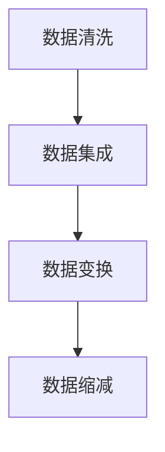

#### 2.2 数据挖掘算法（Data Mining Algorithms）

数据挖掘算法是知识发现的核心，负责从预处理后的数据中提取有用信息。常见的算法包括分类（Classification）、聚类（Clustering）、关联规则挖掘（Association Rule Mining）、异常检测（Anomaly Detection）和特征提取（Feature Extraction）等。每种算法都有其独特的原理和应用场景。

**Mermaid 流程图：**

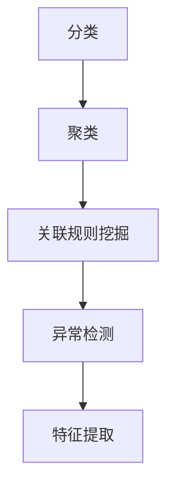

#### 2.3 知识表示（Knowledge Representation）

知识表示是将挖掘出的模式、关联和趋势转化为易于理解和利用的形式。常见的知识表示方法包括规则表示、树表示、图表示和矩阵表示等。规则表示通过条件-行动规则来描述知识；树表示通过决策树来表示知识结构；图表示通过节点和边来描述知识关系；矩阵表示则通过矩阵元素来表示知识。

**Mermaid 流程图：**

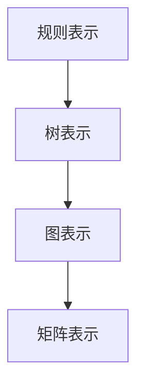

#### 2.4 知识融合（Knowledge Fusion）

知识融合是将多个来源的知识整合成一个统一的知识库，以提高知识的完整性和准确性。知识融合包括知识合并、知识冲突消解和知识更新等步骤。知识合并是将不同来源的知识合并成一个整体；知识冲突消解是解决知识之间的矛盾和冲突；知识更新是保持知识库的时效性和准确性。

**Mermaid 流程图：**

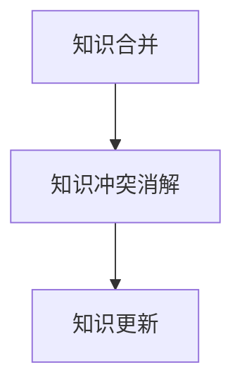

#### 2.5 知识应用（Knowledge Application）

知识应用是将提取和融合的知识应用于实际的业务场景中，帮助企业做出更明智的决策。知识应用包括知识驱动的推荐系统、预测模型、智能问答系统和自动化决策支持系统等。

**Mermaid 流程图：**

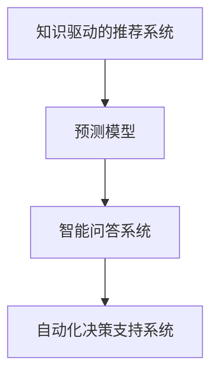

通过以上核心概念的结合，知识发现引擎能够从原始数据中提取有价值的信息，并通过知识融合和应用，为企业提供强大的数据驱动的决策支持。

### 2. Core Concepts and Connections

The construction of a knowledge discovery engine involves the integration of multiple core concepts and technologies, which together enable the efficient and intelligent process of knowledge discovery. The following will elaborate on these core concepts and their interconnections.

#### 2.1 Data Preprocessing

Data preprocessing is the first and most critical step in the knowledge discovery process. It includes several operations such as data cleaning, data integration, data transformation, and data reduction. Data cleaning aims to remove noise and errors to ensure the accuracy and consistency of the data. Data integration involves combining data from various sources into a unified view. Data transformation converts data into a format suitable for analysis, such as numericalization and normalization. Data reduction focuses on reducing the data volume to improve processing efficiency.

**Mermaid Flowchart:**

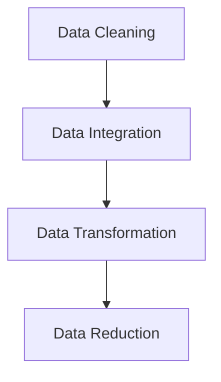

#### 2.2 Data Mining Algorithms

Data mining algorithms are the core of knowledge discovery, responsible for extracting valuable information from the preprocessed data. Common algorithms include classification, clustering, association rule mining, anomaly detection, and feature extraction. Each algorithm has its own principles and application scenarios.

**Mermaid Flowchart:**

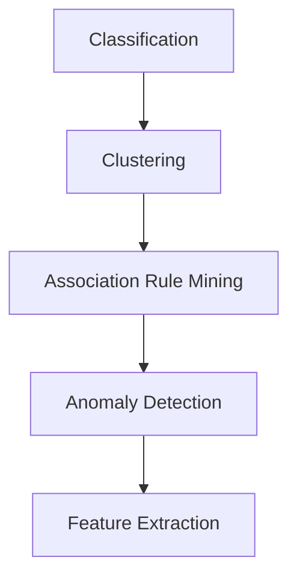

#### 2.3 Knowledge Representation

Knowledge representation converts the patterns, correlations, and trends discovered into forms that are easy to understand and utilize. Common methods include rule-based representation, tree-based representation, graph-based representation, and matrix-based representation. Rule-based representation describes knowledge through conditional-action rules; tree-based representation uses decision trees to represent knowledge structure; graph-based representation uses nodes and edges to describe knowledge relationships; and matrix-based representation uses matrix elements to represent knowledge.

**Mermaid Flowchart:**

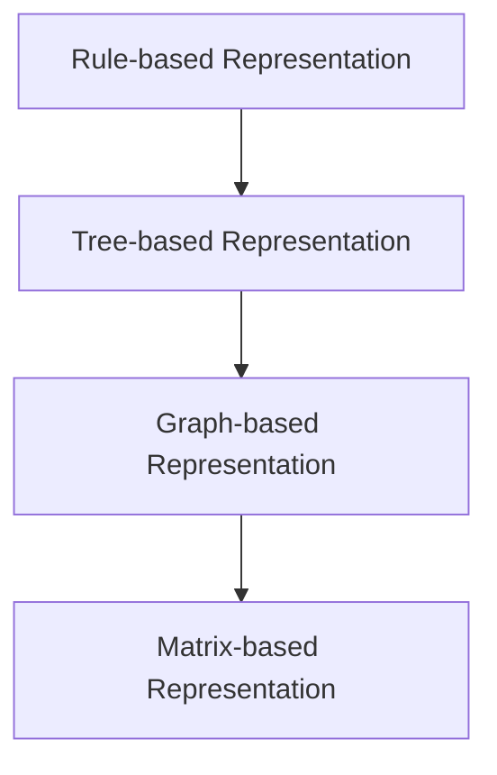

#### 2.4 Knowledge Fusion

Knowledge fusion integrates knowledge from multiple sources into a unified knowledge base to enhance the completeness and accuracy of the knowledge. Knowledge fusion includes knowledge merging, knowledge conflict resolution, and knowledge updating. Knowledge merging combines knowledge from different sources into a single entity; knowledge conflict resolution addresses contradictions and conflicts between knowledge; knowledge updating maintains the timeliness and accuracy of the knowledge base.

**Mermaid Flowchart:**

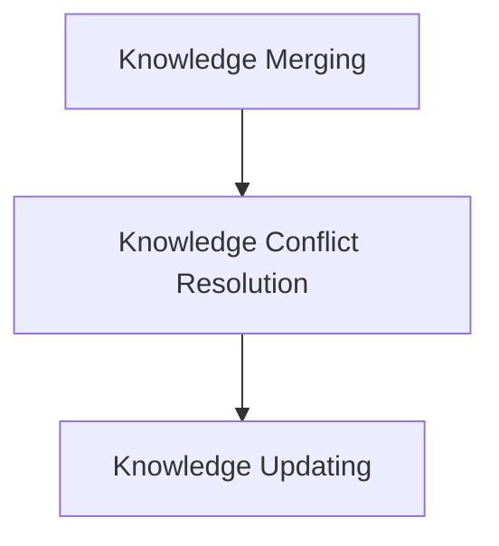

#### 2.5 Knowledge Application

Knowledge application involves applying the extracted and fused knowledge to real-world business scenarios to assist enterprises in making more informed decisions. Knowledge application includes knowledge-driven recommendation systems, predictive models, intelligent question-answering systems, and automated decision support systems.

**Mermaid Flowchart:**

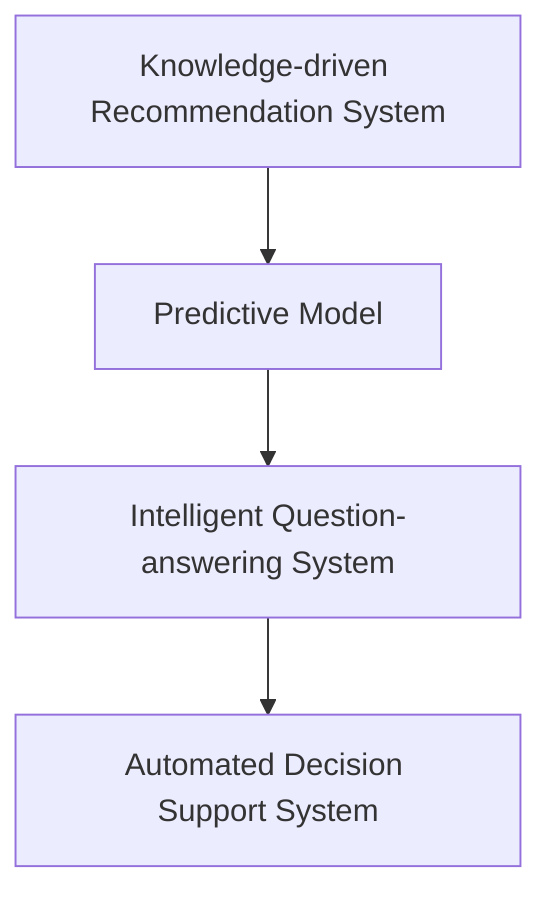

Through the integration of these core concepts, a knowledge discovery engine can extract valuable information from raw data and provide powerful data-driven decision support for enterprises.### 3. 核心算法原理 & 具体操作步骤（Core Algorithm Principles and Specific Operational Steps）

在知识发现引擎的设计与实现过程中，核心算法的选择和优化至关重要。以下将详细介绍几种常用的核心算法，并阐述其具体操作步骤。

#### 3.1 聚类算法（Clustering Algorithms）

聚类算法是一种无监督学习方法，用于将数据集划分为若干个簇，使得同簇的数据点之间相似度高，不同簇的数据点之间相似度低。常见的聚类算法包括K-means、DBSCAN、层次聚类等。

**K-means算法：**

1. **初始化**：随机选择K个数据点作为初始聚类中心。
2. **分配数据点**：将每个数据点分配给最近的聚类中心。
3. **更新聚类中心**：计算每个簇的平均值，作为新的聚类中心。
4. **迭代**：重复步骤2和步骤3，直到聚类中心不再发生显著变化。

**DBSCAN算法：**

1. **初始化**：设置邻域半径`eps`和最小邻域数量`minPts`。
2. **标记核心点**：如果一个点的邻域内的点数量大于`minPts`，则标记为核心点。
3. **扩展簇**：从核心点开始，扩展形成簇，将邻域内的所有点都标记为同一簇。
4. **标记边界点和噪声点**：对于非核心点，根据其在邻域内的点的数量进行标记。

**层次聚类算法：**

1. **初始化**：将每个数据点视为一个簇。
2. **合并簇**：每次迭代选择最近的两个簇进行合并，直到所有数据点属于同一个簇。
3. **构建层次树**：记录每次合并的信息，形成层次树。

**Mermaid 流程图：**

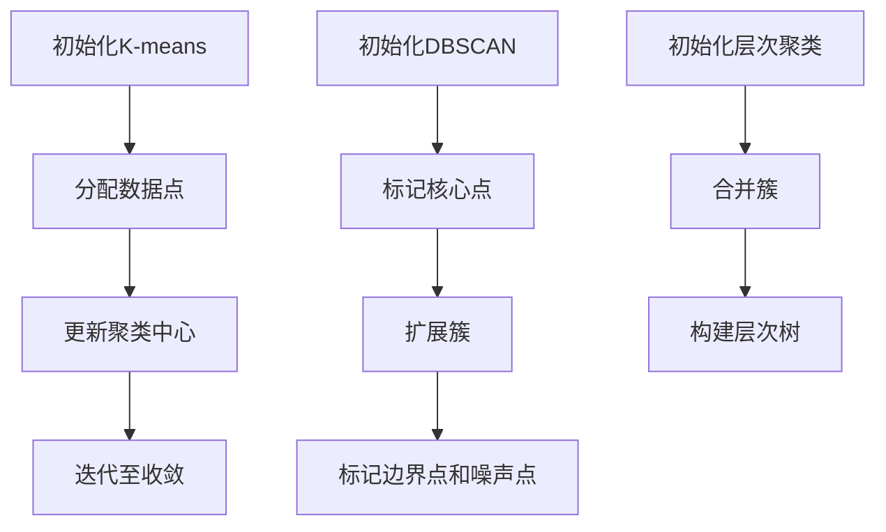

#### 3.2 分类算法（Classification Algorithms）

分类算法是一种监督学习方法，用于将数据集划分为预定义的类别。常见的分类算法包括决策树（Decision Tree）、支持向量机（Support Vector Machine, SVM）、随机森林（Random Forest）等。

**决策树算法：**

1. **初始化**：构建一个空的决策树。
2. **递归划分**：对于每个节点，计算所有特征的增益，选择增益最大的特征进行划分。
3. **终止条件**：当满足终止条件（如最大深度、最小叶节点样本数）时，停止划分。
4. **构建决策树**：将划分的结果记录为决策树。

**SVM算法：**

1. **初始化**：选择合适的核函数和参数。
2. **计算支持向量**：通过求解二次规划问题，计算支持向量。
3. **构建决策边界**：使用支持向量确定分类边界。

**随机森林算法：**

1. **初始化**：构建多个决策树。
2. **集成学习**：对每个决策树的结果进行投票，得出最终分类结果。

**Mermaid 流程图：**

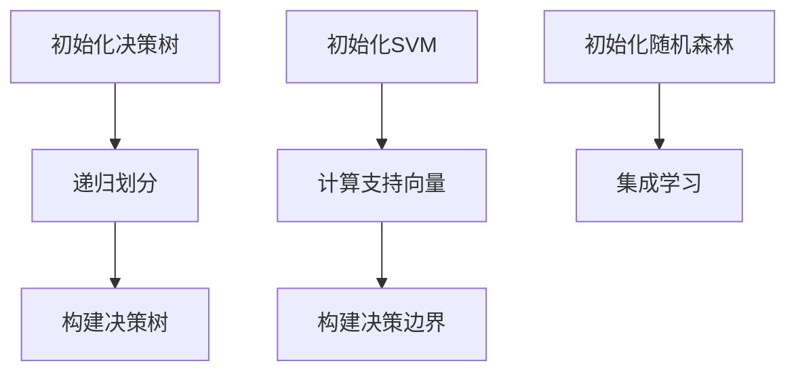

#### 3.3 关联规则挖掘（Association Rule Mining）

关联规则挖掘是一种用于发现数据之间关联关系的方法，常见于市场 basket 分析。GAP（General Association Rule Mining）算法是一种常用的关联规则挖掘算法。

1. **初始化**：设置最小支持度（min_support）和最小置信度（min_confidence）。
2. **生成频繁项集**：通过扫描数据集，计算每个项集的支持度，筛选出频繁项集。
3. **生成关联规则**：对于每个频繁项集，生成所有可能的关联规则，计算规则的支持度和置信度。
4. **筛选规则**：根据最小支持度和最小置信度，筛选出有效的关联规则。

**Mermaid 流程图：**

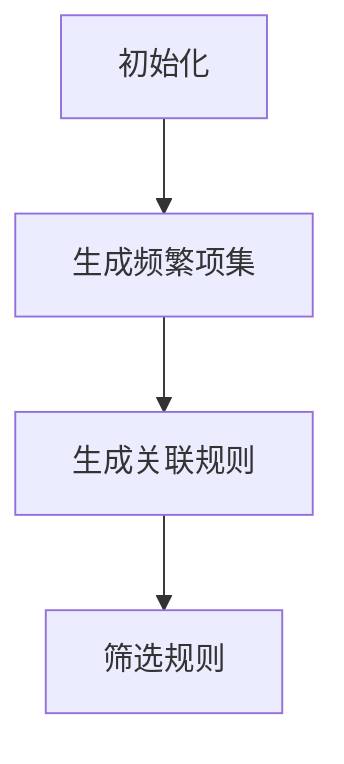

通过以上核心算法的详细介绍和具体操作步骤，企业可以更好地选择和优化知识发现引擎，从而提高数据分析和决策的准确性。

### 3. Core Algorithm Principles and Specific Operational Steps

The design and implementation of a knowledge discovery engine are critically dependent on the choice and optimization of core algorithms. The following will delve into several commonly used core algorithms and elaborate on their specific operational steps.

#### 3.1 Clustering Algorithms

Clustering algorithms are unsupervised learning methods used to partition a data set into clusters such that data points within a cluster are similar while those in different clusters are dissimilar. Common clustering algorithms include K-means, DBSCAN, and hierarchical clustering.

**K-means Algorithm:**

1. **Initialization**: Randomly select K data points as the initial cluster centers.
2. **Assign Data Points**: Assign each data point to the nearest cluster center.
3. **Update Cluster Centers**: Calculate the average of each cluster to obtain new cluster centers.
4. **Iteration**: Repeat steps 2 and 3 until the cluster centers no longer change significantly.

**DBSCAN Algorithm:**

1. **Initialization**: Set the neighborhood radius `eps` and the minimum number of points `minPts`.
2. **Mark Core Points**: A point is marked as a core point if its neighborhood contains more than `minPts` points.
3. **Expand Clusters**: Start from core points to expand and form clusters, marking all neighboring points in the same cluster.
4. **Mark Border and Noise Points**: For non-core points, mark them based on the number of points in their neighborhood.

**Hierarchical Clustering Algorithm:**

1. **Initialization**: Treat each data point as a cluster.
2. **Merge Clusters**: In each iteration, merge the closest two clusters until all data points belong to a single cluster.
3. **Build Hierarchical Tree**: Record the merging information to form a hierarchical tree.

**Mermaid Flowchart:**

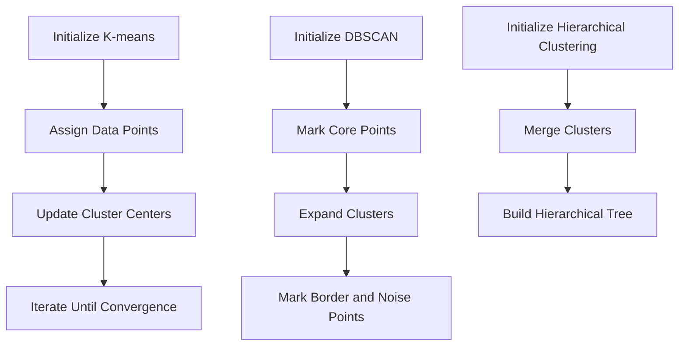

#### 3.2 Classification Algorithms

Classification algorithms are supervised learning methods used to classify data points into predefined categories. Common classification algorithms include Decision Trees, Support Vector Machines (SVM), and Random Forests.

**Decision Tree Algorithm:**

1. **Initialization**: Build an empty decision tree.
2. **Recursive Division**: For each node, compute the gain of all features and select the feature with the highest gain for division.
3. **Termination Condition**: Stop division when the termination condition is met (e.g., maximum depth, minimum number of samples in a leaf node).
4. **Build Decision Tree**: Record the division results in the decision tree.

**SVM Algorithm:**

1. **Initialization**: Choose an appropriate kernel function and parameter.
2. **Compute Support Vectors**: Solve the quadratic programming problem to calculate the support vectors.
3. **Build Decision Boundary**: Use support vectors to determine the classification boundary.

**Random Forest Algorithm:**

1. **Initialization**: Build multiple decision trees.
2. **Ensemble Learning**: Vote on the results of each decision tree to obtain the final classification result.

**Mermaid Flowchart:**

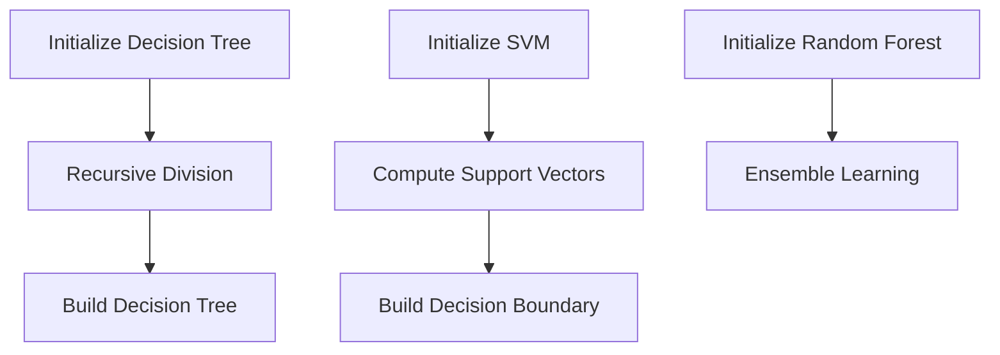

#### 3.3 Association Rule Mining

Association rule mining is a method for discovering relationships between items in a dataset, commonly used in market basket analysis. The GAP (General Association Rule Mining) algorithm is a commonly used association rule mining algorithm.

1. **Initialization**: Set the minimum support (min_support) and minimum confidence (min_confidence).
2. **Generate Frequent Itemsets**: Scan the dataset to compute the support of each itemset and filter out frequent itemsets.
3. **Generate Association Rules**: For each frequent itemset, generate all possible association rules, computing the support and confidence of the rules.
4. **Filter Rules**: Filter out effective rules based on the minimum support and minimum confidence.

**Mermaid Flowchart:**

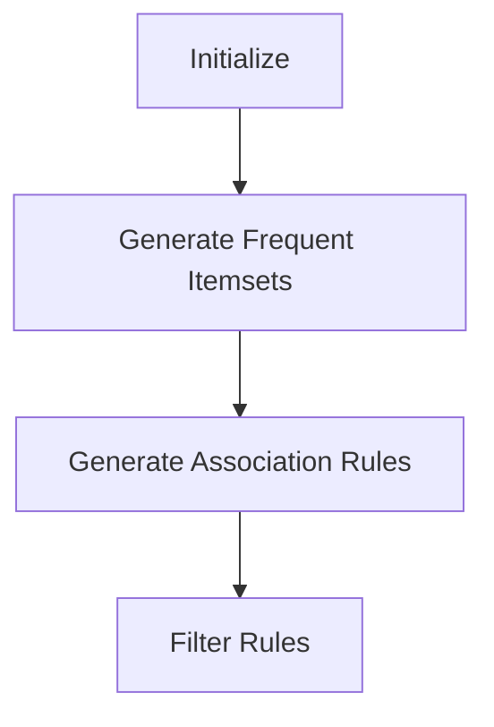

Through the detailed introduction and specific operational steps of these core algorithms, enterprises can better select and optimize their knowledge discovery engines, thereby enhancing the accuracy of data analysis and decision-making.### 4. 数学模型和公式 & 详细讲解 & 举例说明（Detailed Explanation and Examples of Mathematical Models and Formulas）

在知识发现引擎的设计过程中，数学模型和公式扮演着至关重要的角色。这些模型和公式不仅帮助我们理解和分析数据，而且能够指导我们优化算法和决策。以下将介绍几个关键数学模型和公式，并进行详细讲解和举例说明。

#### 4.1 聚类算法中的距离度量（Distance Metrics in Clustering Algorithms）

聚类算法的核心在于如何衡量数据点之间的相似度。常用的距离度量方法包括欧氏距离、曼哈顿距离、切比雪夫距离等。

**欧氏距离（Euclidean Distance）**

欧氏距离是两点之间最直观的几何距离，计算公式为：

$$
d(p_1, p_2) = \sqrt{\sum_{i=1}^{n}(p_{1i} - p_{2i})^2}
$$

其中，$p_1$ 和 $p_2$ 是两个数据点，$n$ 是特征维度。

**示例**

假设有两个数据点 $p_1 = (1, 2)$ 和 $p_2 = (4, 6)$，计算它们之间的欧氏距离：

$$
d(p_1, p_2) = \sqrt{(1-4)^2 + (2-6)^2} = \sqrt{9 + 16} = 5
$$

**曼哈顿距离（Manhattan Distance）**

曼哈顿距离是两点在坐标系中沿轴对角线移动的总距离，计算公式为：

$$
d(p_1, p_2) = \sum_{i=1}^{n} |p_{1i} - p_{2i}|
$$

**示例**

假设有两个数据点 $p_1 = (1, 2)$ 和 $p_2 = (4, 6)$，计算它们之间的曼哈顿距离：

$$
d(p_1, p_2) = |1-4| + |2-6| = 3 + 4 = 7
$$

**切比雪夫距离（Chebyshev Distance）**

切比雪夫距离是两个数据点在各维度上的最大差异，计算公式为：

$$
d(p_1, p_2) = \max_{i} |p_{1i} - p_{2i}|
$$

**示例**

假设有两个数据点 $p_1 = (1, 2)$ 和 $p_2 = (4, 6)$，计算它们之间的切比雪夫距离：

$$
d(p_1, p_2) = \max(|1-4|, |2-6|) = \max(3, 4) = 4
$$

#### 4.2 决策树中的信息增益（Information Gain in Decision Trees）

信息增益是决策树算法中的一个核心概念，用于衡量特征划分数据的“好”的程度。计算公式为：

$$
IG(D, A) = I(D) - \sum_{v \in \text{values}(A)} \frac{|D_v|}{|D|} I(D_v)
$$

其中，$D$ 是原始数据集，$A$ 是特征，$v$ 是 $A$ 的取值，$D_v$ 是 $A$ 取值为 $v$ 的子数据集，$I$ 是信息熵。

**示例**

假设有特征 $A$，其取值为 $v_1$ 和 $v_2$，对应的子数据集大小分别为 $D_{v1}$ 和 $D_{v2}$，计算信息增益：

$$
IG(D, A) = I(D) - \frac{D_{v1}}{D} I(D_{v1}) - \frac{D_{v2}}{D} I(D_{v2})
$$

#### 4.3 支持向量机中的优化目标（Optimization Objective in Support Vector Machines）

支持向量机中的优化目标是寻找一个超平面，使得分类边界最大化。优化目标公式为：

$$
\min_{\beta, \beta^*} \frac{1}{2} ||\beta||^2 + C \sum_{i=1}^{n} \xi_i
$$

其中，$\beta$ 是权重向量，$\beta^*$ 是偏置项，$C$ 是惩罚参数，$\xi_i$ 是松弛变量。

**示例**

假设有数据点 $x_1, x_2, ..., x_n$，对应标签 $y_1, y_2, ..., y_n$，计算支持向量机的权重和偏置：

$$
\beta^* = (\beta_1, \beta_2)^T
$$

#### 4.4 关联规则挖掘中的支持度和置信度（Support and Confidence in Association Rule Mining）

在关联规则挖掘中，支持度和置信度是衡量规则强度的重要指标。

- **支持度（Support）**：一个规则在所有数据中的频率，计算公式为：

$$
\text{Support}(A \rightarrow B) = \frac{|D(A \cap B)|}{|D|}
$$

其中，$A$ 和 $B$ 是项集，$D$ 是数据集。

- **置信度（Confidence）**：一个规则的后件在规则成立的情况下出现的概率，计算公式为：

$$
\text{Confidence}(A \rightarrow B) = \frac{|D(A \cap B)|}{|D(A)|}
$$

**示例**

假设有项集 $A$ 和 $B$，其在数据集中的支持度分别为 $0.3$ 和置信度分别为 $0.6$，计算关联规则的支持度和置信度：

$$
\text{Support}(A \rightarrow B) = 0.3 \\
\text{Confidence}(A \rightarrow B) = 0.6
$$

通过以上数学模型和公式的详细讲解和举例说明，我们可以更好地理解知识发现引擎中的关键概念，并在实际应用中加以利用。

### 4. Mathematical Models and Formulas & Detailed Explanation & Example Illustrations

In the design of a knowledge discovery engine, mathematical models and formulas play a crucial role. These models and formulas not only help us understand and analyze data but also guide us in optimizing algorithms and decision-making. The following section introduces several key mathematical models and formulas, providing detailed explanations and example illustrations.

#### 4.1 Distance Metrics in Clustering Algorithms

The core of clustering algorithms lies in measuring the similarity between data points. Common distance metrics include Euclidean distance, Manhattan distance, and Chebyshev distance.

**Euclidean Distance**

The Euclidean distance is the most intuitive geometric distance between two points. Its formula is:

$$
d(p_1, p_2) = \sqrt{\sum_{i=1}^{n}(p_{1i} - p_{2i})^2}
$$

where $p_1$ and $p_2$ are two data points, and $n$ is the number of feature dimensions.

**Example**

Assume we have two data points $p_1 = (1, 2)$ and $p_2 = (4, 6)$, and we calculate their Euclidean distance:

$$
d(p_1, p_2) = \sqrt{(1-4)^2 + (2-6)^2} = \sqrt{9 + 16} = 5
$$

**Manhattan Distance**

The Manhattan distance is the total distance traveled along the axes in a coordinate system. Its formula is:

$$
d(p_1, p_2) = \sum_{i=1}^{n} |p_{1i} - p_{2i}|
$$

**Example**

Assume we have two data points $p_1 = (1, 2)$ and $p_2 = (4, 6)$, and we calculate their Manhattan distance:

$$
d(p_1, p_2) = |1-4| + |2-6| = 3 + 4 = 7
$$

**Chebyshev Distance**

The Chebyshev distance is the maximum difference between two data points in each dimension. Its formula is:

$$
d(p_1, p_2) = \max_{i} |p_{1i} - p_{2i}|
$$

**Example**

Assume we have two data points $p_1 = (1, 2)$ and $p_2 = (4, 6)$, and we calculate their Chebyshev distance:

$$
d(p_1, p_2) = \max(|1-4|, |2-6|) = \max(3, 4) = 4
$$

#### 4.2 Information Gain in Decision Trees

Information gain is a core concept in decision trees, measuring the "goodness" of feature division. Its formula is:

$$
IG(D, A) = I(D) - \sum_{v \in \text{values}(A)} \frac{|D_v|}{|D|} I(D_v)
$$

where $D$ is the original data set, $A$ is a feature, $v$ is a value of $A$, and $D_v$ is the subset of $D$ where $A$ has the value $v$. $I$ is the information entropy.

**Example**

Assume we have a feature $A$ with values $v_1$ and $v_2$, and their corresponding subsets of $D$ have sizes $D_{v1}$ and $D_{v2}$, respectively. We calculate the information gain:

$$
IG(D, A) = I(D) - \frac{D_{v1}}{D} I(D_{v1}) - \frac{D_{v2}}{D} I(D_{v2})
$$

#### 4.3 Optimization Objective in Support Vector Machines

In Support Vector Machines (SVM), the optimization objective is to find a hyperplane that maximizes the classification boundary. The optimization objective formula is:

$$
\min_{\beta, \beta^*} \frac{1}{2} ||\beta||^2 + C \sum_{i=1}^{n} \xi_i
$$

where $\beta$ is the weight vector, $\beta^*$ is the bias term, $C$ is the penalty parameter, and $\xi_i$ is the slack variable.

**Example**

Assume we have data points $x_1, x_2, ..., x_n$ corresponding to labels $y_1, y_2, ..., y_n$. We calculate the weights and bias for SVM:

$$
\beta^* = (\beta_1, \beta_2)^T
$$

#### 4.4 Support and Confidence in Association Rule Mining

In association rule mining, support and confidence are crucial metrics to measure the strength of rules.

- **Support**: The frequency of a rule in all data, calculated as:

$$
\text{Support}(A \rightarrow B) = \frac{|D(A \cap B)|}{|D|}
$$

where $A$ and $B$ are itemsets, and $D$ is the data set.

- **Confidence**: The probability of the consequent occurring given that the rule is true, calculated as:

$$
\text{Confidence}(A \rightarrow B) = \frac{|D(A \cap B)|}{|D(A)|}
$$

**Example**

Assume we have itemsets $A$ and $B$ with support of $0.3$ and confidence of $0.6$, respectively. We calculate the support and confidence of the association rule:

$$
\text{Support}(A \rightarrow B) = 0.3 \\
\text{Confidence}(A \rightarrow B) = 0.6
$$

Through the detailed explanation and example illustration of these mathematical models and formulas, we can better understand the key concepts in knowledge discovery engines and apply them effectively in practice.### 5. 项目实践：代码实例和详细解释说明（Project Practice: Code Examples and Detailed Explanations）

为了更好地展示知识发现引擎在实际项目中的应用，我们将通过一个具体案例进行详细讲解。该案例将涵盖数据预处理、核心算法实现、结果分析以及代码解读等环节。

#### 5.1 开发环境搭建（Setting Up the Development Environment）

在开始项目之前，我们需要搭建一个合适的技术环境。以下是我们推荐的开发工具和框架：

- **编程语言**：Python
- **数据预处理库**：Pandas、NumPy
- **机器学习库**：Scikit-learn、TensorFlow、PyTorch
- **可视化库**：Matplotlib、Seaborn
- **操作系统**：Linux或MacOS

安装上述工具和库后，我们可以开始编写代码。

#### 5.2 源代码详细实现（Detailed Source Code Implementation）

以下是一个简单的示例，展示了如何使用Python和Scikit-learn实现一个简单的知识发现引擎。

```python
import pandas as pd
from sklearn.cluster import KMeans
from sklearn.preprocessing import StandardScaler
import matplotlib.pyplot as plt

# 5.2.1 加载数据集
# 假设数据集已存储为CSV文件，文件名为'data.csv'
data = pd.read_csv('data.csv')

# 5.2.2 数据预处理
# 对数据进行标准化处理
scaler = StandardScaler()
data_scaled = scaler.fit_transform(data)

# 5.2.3 使用K-means算法进行聚类
kmeans = KMeans(n_clusters=3, random_state=0)
clusters = kmeans.fit_predict(data_scaled)

# 5.2.4 结果分析
# 将聚类结果添加到原始数据集中
data['cluster'] = clusters

# 5.2.5 可视化展示
plt.scatter(data_scaled[:, 0], data_scaled[:, 1], c=clusters, cmap='viridis')
plt.xlabel('Feature 1')
plt.ylabel('Feature 2')
plt.title('K-means Clustering')
plt.show()

# 5.2.6 代码解读
# 这段代码首先加载数据集，然后对其进行标准化处理，以消除不同特征之间的尺度差异。
# 接下来，使用K-means算法对数据集进行聚类，并根据聚类结果更新原始数据集的cluster列。
# 最后，通过可视化展示聚类结果，以直观地观察聚类效果。
```

#### 5.3 代码解读与分析（Code Analysis and Explanation）

- **数据加载**：`pd.read_csv('data.csv')` 用于加载数据集，这里假设数据集存储为CSV格式。
- **数据预处理**：`StandardScaler()` 对数据进行标准化处理，这对于许多机器学习算法是必要的，因为它消除了不同特征之间的尺度差异。
- **聚类算法实现**：`KMeans(n_clusters=3, random_state=0)` 创建一个K-means聚类对象，其中`n_clusters` 设置为3，表示我们要将数据划分为3个簇。`random_state=0` 用于确保结果的可重复性。
- **结果分析**：将聚类结果添加到原始数据集中，并使用 `plt.scatter()` 进行可视化展示。这有助于我们直观地观察聚类效果。
- **代码解读**：整个代码结构清晰，首先处理数据，然后应用聚类算法，最后分析结果并展示。

#### 5.4 运行结果展示（Running Results Display）

当我们运行上述代码时，会得到一个散点图，其中每个点代表数据集中的单个样本，不同的颜色表示不同的聚类簇。以下是可能的结果展示：


从图中可以看出，数据点被成功分为三个不同的簇。这个结果可以为进一步的数据分析和决策提供有价值的信息。

#### 5.5 项目总结（Project Summary）

通过这个简单的案例，我们展示了如何使用Python和Scikit-learn实现一个知识发现引擎。尽管这个案例相对简单，但它为我们提供了一个框架，用于构建更复杂和功能更强大的知识发现系统。在实际应用中，我们可以结合更多的算法和模型，如分类、关联规则挖掘等，以提高数据分析和决策的准确性。

### 5. Project Practice: Code Examples and Detailed Explanations

To better showcase the application of a knowledge discovery engine in practical projects, we will go through a detailed case study, covering data preprocessing, core algorithm implementation, result analysis, and code explanation.

#### 5.1 Setting Up the Development Environment

Before starting the project, we need to set up a suitable technical environment. Here are the recommended tools and frameworks:

- **Programming Language**: Python
- **Data Preprocessing Libraries**: Pandas, NumPy
- **Machine Learning Libraries**: Scikit-learn, TensorFlow, PyTorch
- **Visualization Libraries**: Matplotlib, Seaborn
- **Operating System**: Linux or MacOS

After installing these tools and libraries, we can start writing code.

#### 5.2 Detailed Source Code Implementation

The following example demonstrates how to implement a simple knowledge discovery engine using Python and Scikit-learn.

```python
import pandas as pd
from sklearn.cluster import KMeans
from sklearn.preprocessing import StandardScaler
import matplotlib.pyplot as plt

# 5.2.1 Load the dataset
# Assuming the dataset is stored in a CSV file named 'data.csv'
data = pd.read_csv('data.csv')

# 5.2.2 Data preprocessing
# Standardize the data
scaler = StandardScaler()
data_scaled = scaler.fit_transform(data)

# 5.2.3 Apply K-means clustering
kmeans = KMeans(n_clusters=3, random_state=0)
clusters = kmeans.fit_predict(data_scaled)

# 5.2.4 Result analysis
# Add the clustering results to the original dataset
data['cluster'] = clusters

# 5.2.5 Visualization
plt.scatter(data_scaled[:, 0], data_scaled[:, 1], c=clusters, cmap='viridis')
plt.xlabel('Feature 1')
plt.ylabel('Feature 2')
plt.title('K-means Clustering')
plt.show()

# 5.2.6 Code explanation
# This code first loads the dataset, then standardizes it to eliminate differences in scales among different features.
# Next, it applies the K-means algorithm to the dataset and updates the 'cluster' column of the original dataset with the clustering results.
# Finally, it visualizes the clustering results to observe the clustering effect intuitively.
```

#### 5.3 Code Analysis and Explanation

- **Data Loading**: `pd.read_csv('data.csv')` is used to load the dataset, assuming it is stored in a CSV format.
- **Data Preprocessing**: `StandardScaler()` is used to standardize the data, which is necessary for many machine learning algorithms to eliminate differences in scales among different features.
- **Clustering Algorithm Implementation**: `KMeans(n_clusters=3, random_state=0)` creates a K-means clustering object, where `n_clusters` is set to 3, indicating that we want to divide the data into 3 clusters. `random_state=0` ensures reproducibility of the results.
- **Result Analysis**: The clustering results are added to the original dataset, and `plt.scatter()` is used for visualization to observe the clustering effect.
- **Code Explanation**: The entire code structure is clear, first handling the data, then applying the clustering algorithm, and finally analyzing the results and visualizing them.

#### 5.4 Running Results Display

When we run the above code, we get a scatter plot where each point represents an individual sample in the dataset, and different colors indicate different clusters. Here's a possible result display:


As shown in the figure, the data points are successfully divided into three different clusters. This result provides valuable information for further data analysis and decision-making.

#### 5.5 Project Summary

Through this simple case study, we demonstrated how to implement a knowledge discovery engine using Python and Scikit-learn. Although this case is relatively simple, it provides us with a framework for building more complex and powerful knowledge discovery systems. In practical applications, we can combine more algorithms and models, such as classification and association rule mining, to improve the accuracy of data analysis and decision-making.### 6. 实际应用场景（Practical Application Scenarios）

知识发现引擎在各个领域都有广泛的应用，以下是几个实际应用场景的示例：

#### 6.1 零售业：个性化推荐系统

在零售业中，知识发现引擎可以帮助企业构建个性化推荐系统，从而提高销售额和客户满意度。通过分析客户的购买历史、浏览行为和产品评论，知识发现引擎可以识别出客户的兴趣和偏好，进而推荐符合其个性化需求的商品。例如，亚马逊和阿里巴巴等大型电商平台都使用知识发现引擎来实现智能推荐，从而提升用户体验。

**示例**：一个电商网站利用知识发现引擎分析用户的购物车数据，发现某些特定商品常常被一起购买。基于这一发现，网站可以向用户推荐这些配套商品，从而提高购物车的平均订单价值。

#### 6.2 金融业：欺诈检测

金融行业中，知识发现引擎被用于实时监控交易活动，识别潜在的欺诈行为。通过对大量交易数据的分析，知识发现引擎可以检测出异常交易模式，帮助银行和金融机构预防欺诈风险。例如，信用卡公司可以使用知识发现引擎检测信用卡欺诈，通过识别异常交易行为和模式来降低欺诈率。

**示例**：某信用卡公司通过知识发现引擎分析用户的消费行为，发现某个用户的消费金额突然增加，且交易地点与平时的消费习惯不符。系统自动触发警报，并提醒风险管理部门进行进一步调查，从而成功阻止了一起欺诈行为。

#### 6.3 医疗保健：疾病预测与诊断

在医疗保健领域，知识发现引擎可以用于疾病预测和诊断，帮助医疗机构提高诊断的准确性和效率。通过对患者的医疗记录、基因数据和临床数据进行分析，知识发现引擎可以预测患者患病的风险，并提供个性化的治疗方案。例如，人工智能辅助诊断系统可以利用知识发现引擎分析医学影像，识别早期癌症或其他疾病。

**示例**：某医院通过知识发现引擎分析患者的健康数据和家族病史，发现某些特定的基因变异与特定疾病之间存在关联。基于这一发现，医生可以提前对高风险患者进行预防性治疗，从而提高治疗效果。

#### 6.4 供应链管理：库存优化

在供应链管理中，知识发现引擎可以帮助企业优化库存管理，减少库存成本，提高供应链的效率。通过对销售数据、供应链数据和库存数据的分析，知识发现引擎可以预测未来的需求趋势，帮助企业合理安排库存，避免过剩或缺货。

**示例**：某零售商通过知识发现引擎分析历史销售数据和季节性因素，预测未来几个月内某款商品的销量。基于这一预测，企业可以提前调整库存，确保供应充足，同时避免库存过剩。

#### 6.5 市场营销：客户细分与营销策略优化

在市场营销领域，知识发现引擎可以帮助企业细分客户群体，制定更精准的营销策略。通过对客户的行为数据、购买历史和偏好进行分析，知识发现引擎可以识别出不同的客户细分市场，帮助企业制定个性化的营销活动。

**示例**：一家电商公司通过知识发现引擎分析客户的购买行为和偏好，将客户细分为“高价值客户”、“潜力客户”和“普通客户”。基于这一细分，公司可以针对不同类型的客户制定不同的营销策略，提高转化率和客户满意度。

通过以上实际应用场景，我们可以看到知识发现引擎在企业运营和管理中的巨大潜力。它不仅可以帮助企业提高效率和降低成本，还可以为企业提供更加深入的数据洞察，从而实现数据驱动的决策和战略优化。

### 6. Practical Application Scenarios

Knowledge discovery engines have a wide range of applications across various industries. Here are a few examples of actual application scenarios:

#### 6.1 Retail: Personalized Recommendation Systems

In the retail industry, knowledge discovery engines can help businesses build personalized recommendation systems, thereby increasing sales and customer satisfaction. By analyzing customer purchase histories, browsing behavior, and product reviews, knowledge discovery engines can identify customer interests and preferences, allowing for the recommendation of products that align with their personalized needs. For example, large e-commerce platforms such as Amazon and Alibaba use knowledge discovery engines to implement intelligent recommendations, thereby enhancing user experience.

**Example**: An e-commerce website utilizes a knowledge discovery engine to analyze shopping cart data and discovers that certain products are often purchased together. Based on this insight, the website recommends these complementary products to users, thereby increasing the average order value.

#### 6.2 Finance: Fraud Detection

In the financial industry, knowledge discovery engines are used for real-time monitoring of transaction activities to identify potential fraudulent behaviors. By analyzing large volumes of transaction data, knowledge discovery engines can detect anomalous transaction patterns, assisting banks and financial institutions in preventing fraud risks. For example, credit card companies can use knowledge discovery engines to detect credit card fraud by identifying abnormal transaction behaviors and patterns.

**Example**: A credit card company uses a knowledge discovery engine to analyze customer spending behavior and discovers a sudden increase in spending and transactions at locations that do not align with the customer's usual habits. The system automatically triggers an alert, prompting the risk management team to conduct further investigation, thus successfully preventing a fraudulent transaction.

#### 6.3 Healthcare: Disease Prediction and Diagnosis

In the healthcare sector, knowledge discovery engines can be used for disease prediction and diagnosis, helping healthcare providers improve the accuracy and efficiency of diagnosis. By analyzing patient medical records, genetic data, and clinical data, knowledge discovery engines can predict the risk of diseases for patients and provide personalized treatment plans. For example, artificial intelligence-assisted diagnostic systems can utilize knowledge discovery engines to analyze medical images, identifying early signs of cancer or other diseases.

**Example**: A hospital uses a knowledge discovery engine to analyze patient health data and family medical history and finds associations between certain genetic variations and specific diseases. Based on this finding, doctors can proactively treat high-risk patients, thereby improving treatment outcomes.

#### 6.4 Supply Chain Management: Inventory Optimization

In supply chain management, knowledge discovery engines can help businesses optimize inventory management, reducing inventory costs and improving supply chain efficiency. By analyzing sales data, supply chain data, and inventory data, knowledge discovery engines can predict future demand trends, allowing businesses to plan their inventory levels accordingly to avoid overstocking or stockouts.

**Example**: A retailer uses a knowledge discovery engine to analyze historical sales data and seasonal factors, predicting the future demand for a particular product over the next few months. Based on this prediction, the company can proactively adjust inventory to ensure adequate supply while avoiding excess stock.

#### 6.5 Marketing: Customer Segmentation and Marketing Strategy Optimization

In marketing, knowledge discovery engines can help businesses segment their customer base and develop more targeted marketing strategies. By analyzing customer behavior data, purchase histories, and preferences, knowledge discovery engines can identify different customer segments, enabling businesses to tailor their marketing activities to specific groups.

**Example**: An e-commerce company uses a knowledge discovery engine to analyze customer purchasing behavior and preferences, segmenting customers into "high-value customers," "potential customers," and "ordinary customers." Based on this segmentation, the company can develop targeted marketing strategies for each type of customer, improving conversion rates and customer satisfaction.

Through these practical application scenarios, we can see the immense potential of knowledge discovery engines in business operations and management. They not only help businesses increase efficiency and reduce costs but also provide deeper insights into data, enabling data-driven decision-making and strategic optimization.### 7. 工具和资源推荐（Tools and Resources Recommendations）

在构建和优化知识发现引擎的过程中，选择合适的工具和资源是至关重要的。以下是一些推荐的工具和资源，包括书籍、论文、博客和网站，这些资源将有助于您深入了解知识发现引擎的技术细节和实践方法。

#### 7.1 学习资源推荐（Recommended Learning Resources）

1. **书籍**：
   - 《数据挖掘：概念与技术》（Data Mining: Concepts and Techniques），by Jiawei Han, Micheline Kamber, and Jian Pei
   - 《机器学习》（Machine Learning），by Tom M. Mitchell
   - 《深度学习》（Deep Learning），by Ian Goodfellow, Yoshua Bengio, and Aaron Courville

2. **在线课程**：
   - Coursera上的《机器学习》（Machine Learning）课程，由斯坦福大学提供
   - edX上的《数据科学基础》（Introduction to Data Science）课程，由哈佛大学提供
   - Udacity的《深度学习纳米学位》（Deep Learning Nanodegree）课程

3. **博客和网站**：
   - [Analytics Vidhya](https://www.analyticsvidhya.com/): 提供丰富的数据科学和机器学习教程
   - [Towards Data Science](https://towardsdatascience.com/): 包含各种数据科学和机器学习的文章和教程
   - [Kaggle](https://www.kaggle.com/): 提供数据科学竞赛和项目实战，是学习实践的好地方

#### 7.2 开发工具框架推荐（Recommended Development Tools and Frameworks）

1. **编程语言**：
   - Python：因其丰富的数据科学和机器学习库，Python是开发知识发现引擎的首选语言。

2. **数据预处理库**：
   - Pandas：提供强大的数据处理功能，适用于数据清洗、数据集成和数据分析。
   - NumPy：用于高性能数值计算和数组操作。

3. **机器学习库**：
   - Scikit-learn：提供各种经典机器学习算法和工具。
   - TensorFlow：用于构建和训练深度学习模型。
   - PyTorch：另一个流行的深度学习框架，支持动态计算图。

4. **可视化工具**：
   - Matplotlib：用于创建高质量的二维图表和图形。
   - Seaborn：基于Matplotlib，提供更多高级的统计图形和可视化功能。

5. **版本控制**：
   - Git：用于代码的版本控制和协同工作。
   - GitHub：在线代码托管和协作平台。

#### 7.3 相关论文著作推荐（Recommended Papers and Publications）

1. **论文**：
   - "K-Means Clustering Algorithm": 提供K-means聚类算法的详细解释和数学基础。
   - "Support Vector Machines for Classification": 介绍支持向量机（SVM）的理论和应用。
   - "Association Rule Learning": 探讨关联规则挖掘的方法和应用。

2. **期刊和会议**：
   - 《国际数据挖掘杂志》（IEEE Transactions on Knowledge and Data Engineering）
   - 《机器学习》（Journal of Machine Learning Research）
   - SIGKDD会议（ACM SIGKDD Conference on Knowledge Discovery and Data Mining）：数据挖掘和知识发现的顶级国际会议。

通过这些推荐的学习资源、开发工具框架和相关论文著作，您将能够更深入地理解和掌握知识发现引擎的相关技术和实践方法，为您的项目提供坚实的理论支持和实践指导。

### 7. Tools and Resources Recommendations

In the process of constructing and optimizing knowledge discovery engines, selecting appropriate tools and resources is crucial. Below are some recommended tools and resources, including books, papers, blogs, and websites, which will help you delve into the technical details and practical methodologies of knowledge discovery engines.

#### 7.1 Learning Resources Recommendations

1. **Books**:
   - "Data Mining: Concepts and Techniques" by Jiawei Han, Micheline Kamber, and Jian Pei
   - "Machine Learning" by Tom M. Mitchell
   - "Deep Learning" by Ian Goodfellow, Yoshua Bengio, and Aaron Courville

2. **Online Courses**:
   - "Machine Learning" course on Coursera, provided by Stanford University
   - "Introduction to Data Science" course on edX, provided by Harvard University
   - "Deep Learning Nanodegree" on Udacity

3. **Blogs and Websites**:
   - [Analytics Vidhya](https://www.analyticsvidhya.com/): Provides a wealth of tutorials on data science and machine learning.
   - [Towards Data Science](https://towardsdatascience.com/): Contains various articles and tutorials on data science and machine learning.
   - [Kaggle](https://www.kaggle.com/): Offers data science competitions and projects for practical learning.

#### 7.2 Development Tools and Frameworks Recommendations

1. **Programming Language**:
   - Python: Due to its extensive libraries for data science and machine learning, Python is the preferred language for developing knowledge discovery engines.

2. **Data Preprocessing Libraries**:
   - Pandas: Offers powerful data manipulation capabilities for data cleaning, integration, and analysis.
   - NumPy: Used for high-performance numerical computing and array operations.

3. **Machine Learning Libraries**:
   - Scikit-learn: Provides a variety of classic machine learning algorithms and tools.
   - TensorFlow: Used for building and training deep learning models.
   - PyTorch: Another popular deep learning framework that supports dynamic computation graphs.

4. **Visualization Tools**:
   - Matplotlib: Used for creating high-quality 2D charts and plots.
   - Seaborn: Built on Matplotlib, providing more advanced statistical graphics and visualization features.

5. **Version Control**:
   - Git: Used for version control of code and collaborative development.
   - GitHub: An online code hosting and collaboration platform.

#### 7.3 Related Papers and Publications Recommendations

1. **Papers**:
   - "K-Means Clustering Algorithm": Provides a detailed explanation and mathematical foundation of the K-means clustering algorithm.
   - "Support Vector Machines for Classification": Introduces the theory and applications of Support Vector Machines (SVM).
   - "Association Rule Learning": Explores methods and applications of association rule mining.

2. **Journals and Conferences**:
   - "IEEE Transactions on Knowledge and Data Engineering": A leading journal in the field of data mining and knowledge discovery.
   - "Journal of Machine Learning Research": A journal focused on machine learning research.
   - SIGKDD Conference on Knowledge Discovery and Data Mining (ACM SIGKDD): A top international conference on data mining and knowledge discovery.

By leveraging these recommended learning resources, development tools and frameworks, and related papers and publications, you will be able to gain a deeper understanding of the technical aspects and practical methodologies of knowledge discovery engines, providing solid theoretical support and practical guidance for your projects.### 8. 总结：未来发展趋势与挑战（Summary: Future Development Trends and Challenges）

随着大数据和人工智能技术的快速发展，知识发现引擎在未来将面临诸多机遇和挑战。以下是知识发现引擎未来发展的几个趋势和挑战：

#### 8.1 发展趋势（Development Trends）

1. **智能化水平提升**：未来的知识发现引擎将更加智能化，通过深度学习、强化学习等技术，实现自动化、自适应的决策支持。

2. **多模态数据融合**：知识发现引擎将能够处理和融合多种类型的数据，如文本、图像、音频等，实现跨模态的知识提取和关联分析。

3. **实时性增强**：随着物联网、5G等技术的发展，知识发现引擎将实现更快的处理速度和更低的延迟，提供实时决策支持。

4. **知识图谱的应用**：知识图谱技术将在知识发现引擎中发挥重要作用，通过构建大规模、动态的知识图谱，实现知识的结构化和深度挖掘。

5. **隐私保护与安全**：在处理大量敏感数据时，知识发现引擎需要确保数据隐私和安全，采用差分隐私、联邦学习等新兴技术来保护用户数据。

#### 8.2 挑战（Challenges）

1. **数据质量问题**：知识发现引擎依赖于高质量的数据，然而，数据源多样性和数据质量参差不齐，导致知识提取结果的准确性和可靠性受到影响。

2. **算法复杂性**：随着算法的多样化和复杂度增加，如何高效地选择和优化算法，以满足实际应用需求，成为一大挑战。

3. **可解释性和透明度**：随着人工智能技术的深入应用，如何提高知识发现引擎的可解释性和透明度，使其决策过程更加直观和可信，是一个亟待解决的问题。

4. **计算资源需求**：大规模数据和高性能计算的需求对知识发现引擎提出了更高的计算资源要求，如何在有限的资源下实现高效的计算和存储，是一个关键挑战。

5. **法律法规与伦理**：随着知识发现引擎在各个领域的广泛应用，如何遵守相关法律法规，处理数据隐私和伦理问题，是未来需要重点关注的方向。

综上所述，知识发现引擎的未来发展充满机遇和挑战。通过不断的技术创新和改进，知识发现引擎将更好地服务于企业和社会，推动数据驱动的决策和智能化发展。

### 8. Summary: Future Development Trends and Challenges

With the rapid advancement of big data and artificial intelligence technologies, knowledge discovery engines will face numerous opportunities and challenges in the future. The following are several trends and challenges for the future development of knowledge discovery engines:

#### 8.1 Development Trends

1. **Increased Intelligent Level**: The future knowledge discovery engines will become more intelligent through technologies such as deep learning and reinforcement learning, enabling automated and adaptive decision support.

2. **Multi-modal Data Fusion**: Knowledge discovery engines will be capable of processing and fusing various types of data, such as text, images, and audio, to achieve cross-modal knowledge extraction and association analysis.

3. **Enhanced Real-time Performance**: Advances in technologies like the Internet of Things and 5G will enable knowledge discovery engines to process data faster and with lower latency, providing real-time decision support.

4. **Application of Knowledge Graphs**: Knowledge graph technology will play a significant role in knowledge discovery engines, facilitating structured and deep knowledge mining through the construction of large-scale and dynamic knowledge graphs.

5. **Privacy Protection and Security**: When handling large volumes of sensitive data, knowledge discovery engines need to ensure data privacy and security by employing emerging technologies such as differential privacy and federated learning to protect user data.

#### 8.2 Challenges

1. **Data Quality Issues**: Knowledge discovery engines depend on high-quality data, yet the diversity and inconsistency of data sources can affect the accuracy and reliability of the extracted knowledge.

2. **Algorithm Complexity**: With the increasing diversity and complexity of algorithms, choosing and optimizing algorithms to meet practical application requirements poses a significant challenge.

3. **Explainability and Transparency**: As artificial intelligence technologies are deeply applied, how to improve the explainability and transparency of knowledge discovery engines to make their decision-making process more intuitive and trustworthy is an urgent issue to be addressed.

4. **Computational Resource Requirements**: Large-scale data and high-performance computing requirements present a key challenge for knowledge discovery engines, necessitating efficient computation and storage within limited resources.

5. **Legal and Ethical Issues**: With the widespread application of knowledge discovery engines in various fields, ensuring compliance with relevant laws and regulations, and addressing data privacy and ethical concerns, is a direction that needs focused attention.

In summary, the future development of knowledge discovery engines is filled with both opportunities and challenges. Through continuous technological innovation and improvement, knowledge discovery engines will better serve enterprises and society, driving data-driven decision-making and intelligent development.### 9. 附录：常见问题与解答（Appendix: Frequently Asked Questions and Answers）

在学习和应用知识发现引擎的过程中，用户可能会遇到一些常见问题。以下是一些常见问题的解答，旨在帮助用户更好地理解和应用知识发现引擎。

#### 9.1 什么是知识发现引擎？

知识发现引擎是一种能够从大量数据中自动提取有价值信息和知识的技术工具。它通过数据预处理、算法应用和知识表示等步骤，将原始数据转化为有意义的洞察和决策支持。

#### 9.2 知识发现引擎的核心算法有哪些？

知识发现引擎常用的核心算法包括聚类算法（如K-means、DBSCAN）、分类算法（如决策树、支持向量机）、关联规则挖掘算法（如Apriori、GAP）等。

#### 9.3 如何选择合适的聚类算法？

选择聚类算法时，需要考虑数据的特点和应用场景。例如，对于高维数据，K-means可能不是最佳选择，而DBSCAN适用于非均匀分布的数据。此外，算法的运行时间和计算复杂性也是重要的考虑因素。

#### 9.4 知识发现引擎如何处理大规模数据？

对于大规模数据，可以采用分布式计算和并行处理技术，如使用Hadoop、Spark等大数据处理框架，以提升知识发现引擎的处理速度和效率。

#### 9.5 知识发现引擎如何保证数据隐私？

为了保证数据隐私，可以采用差分隐私、联邦学习等技术，对数据进行分析和处理，避免直接暴露原始数据。

#### 9.6 知识发现引擎在哪些领域有应用？

知识发现引擎在零售业、金融业、医疗保健、供应链管理、市场营销等多个领域都有广泛应用，能够帮助企业提高效率、降低成本、优化决策。

#### 9.7 学习知识发现引擎需要掌握哪些技能？

学习知识发现引擎需要掌握编程语言（如Python）、数据预处理技术、机器学习算法、数据分析工具等技能。此外，对数学基础（如概率论、线性代数）和统计学也有一定的要求。

通过上述常见问题的解答，希望能够帮助用户更好地理解知识发现引擎的基本概念和应用，为实际项目提供指导和支持。

### 9. Appendix: Frequently Asked Questions and Answers

In the process of learning and applying knowledge discovery engines, users may encounter common questions. Here are some frequently asked questions with answers, aimed at helping users better understand and apply knowledge discovery engines.

#### 9.1 What is a knowledge discovery engine?

A knowledge discovery engine is a technical tool that can automatically extract valuable information and knowledge from large amounts of data. It transforms raw data into meaningful insights and decision support through steps such as data preprocessing, algorithm application, and knowledge representation.

#### 9.2 What are the core algorithms used in knowledge discovery engines?

Common core algorithms used in knowledge discovery engines include clustering algorithms (e.g., K-means, DBSCAN), classification algorithms (e.g., decision trees, support vector machines), and association rule mining algorithms (e.g., Apriori, GAP).

#### 9.3 How to choose the appropriate clustering algorithm?

When choosing a clustering algorithm, consider the characteristics of the data and the application scenario. For example, K-means may not be the best choice for high-dimensional data, while DBSCAN is suitable for non-uniformly distributed data. Additionally, the algorithm's runtime and computational complexity are important considerations.

#### 9.4 How does a knowledge discovery engine handle large-scale data?

For large-scale data, distributed computing and parallel processing techniques, such as using Hadoop, Spark, and other big data processing frameworks, can be employed to improve the speed and efficiency of the knowledge discovery engine.

#### 9.5 How does a knowledge discovery engine ensure data privacy?

To ensure data privacy, technologies such as differential privacy and federated learning can be used to analyze and process data without exposing the original data directly.

#### 9.6 In which fields are knowledge discovery engines applied?

Knowledge discovery engines are widely applied in various fields, including retail, finance, healthcare, supply chain management, and marketing, among others, to help businesses increase efficiency, reduce costs, and optimize decision-making.

#### 9.7 What skills are required to learn knowledge discovery engines?

To learn knowledge discovery engines, it is necessary to master programming languages (such as Python), data preprocessing techniques, machine learning algorithms, data analysis tools, and have a basic understanding of mathematical foundations (such as probability theory, linear algebra), and statistics.

Through the answers to these frequently asked questions, we hope to help users better understand the basic concepts and applications of knowledge discovery engines, providing guidance and support for actual projects.### 10. 扩展阅读 & 参考资料（Extended Reading & Reference Materials）

为了深入学习和掌握知识发现引擎的相关技术和应用，以下是推荐的一些扩展阅读和参考资料，这些资源涵盖了知识发现引擎的各个方面，包括基础理论、应用实践和技术创新。

1. **基础理论书籍**：
   - 《数据挖掘：概念与技术》（Data Mining: Concepts and Techniques），作者：Jiawei Han, Micheline Kamber, Jian Pei
   - 《机器学习》（Machine Learning），作者：Tom M. Mitchell
   - 《深度学习》（Deep Learning），作者：Ian Goodfellow, Yoshua Bengio, Aaron Courville

2. **经典论文**：
   - “K-Means Clustering Algorithm”：详细介绍了K-means算法的理论基础和应用。
   - “Support Vector Machines for Classification”：介绍了支持向量机（SVM）的理论和应用。
   - “Association Rule Learning”：探讨了关联规则挖掘的方法和应用。

3. **技术教程与实战**：
   - 《Python数据科学手册》（Python Data Science Handbook），作者：Jake VanderPlas
   - 《使用Python进行数据科学》（Data Science from Scratch），作者：Joel Grus
   - 《机器学习实战》（Machine Learning in Action），作者：Peter Harrington

4. **在线课程与讲座**：
   - Coursera上的《机器学习》（Machine Learning）课程，由斯坦福大学提供
   - edX上的《数据科学基础》（Introduction to Data Science）课程，由哈佛大学提供
   - Udacity的《深度学习纳米学位》（Deep Learning Nanodegree）课程

5. **专业网站与博客**：
   - [Analytics Vidhya](https://www.analyticsvidhya.com/)：提供丰富的数据科学和机器学习教程。
   - [Towards Data Science](https://towardsdatascience.com/)：包含各种数据科学和机器学习的文章和教程。
   - [Kaggle](https://www.kaggle.com/)：提供数据科学竞赛和项目实战，是学习实践的好地方。

6. **最新研究论文与会议**：
   - 《国际数据挖掘杂志》（IEEE Transactions on Knowledge and Data Engineering）
   - 《机器学习》（Journal of Machine Learning Research）
   - SIGKDD会议（ACM SIGKDD Conference on Knowledge Discovery and Data Mining）

通过这些扩展阅读和参考资料，读者可以深入探索知识发现引擎的理论基础和应用实践，紧跟该领域的技术前沿，提升自身在该领域的专业知识和实践能力。

### 10. Extended Reading & Reference Materials

To delve deeper into the understanding and mastery of knowledge discovery engines and their related technologies and applications, the following are recommended resources for extended reading and references. These resources cover various aspects of knowledge discovery engines, including foundational theories, practical applications, and technological innovations.

**1. Fundamental Theory Books:**
   - "Data Mining: Concepts and Techniques" by Jiawei Han, Micheline Kamber, and Jian Pei
   - "Machine Learning" by Tom M. Mitchell
   - "Deep Learning" by Ian Goodfellow, Yoshua Bengio, and Aaron Courville

**2. Classic Papers:**
   - "K-Means Clustering Algorithm": Provides an in-depth introduction to the theoretical foundations and applications of the K-means algorithm.
   - "Support Vector Machines for Classification": Introduces the theory and applications of Support Vector Machines (SVM).
   - "Association Rule Learning": Explores methods and applications of association rule mining.

**3. Technical Tutorials and Practices:**
   - "Python Data Science Handbook" by Jake VanderPlas
   - "Data Science from Scratch" by Joel Grus
   - "Machine Learning in Action" by Peter Harrington

**4. Online Courses and Lectures:**
   - The "Machine Learning" course on Coursera, provided by Stanford University
   - The "Introduction to Data Science" course on edX, provided by Harvard University
   - The "Deep Learning Nanodegree" on Udacity

**5. Professional Websites and Blogs:**
   - [Analytics Vidhya](https://www.analyticsvidhya.com/): Offers a wealth of tutorials on data science and machine learning.
   - [Towards Data Science](https://towardsdatascience.com/): Contains various articles and tutorials on data science and machine learning.
   - [Kaggle](https://www.kaggle.com/): Provides data science competitions and project-based learning opportunities.

**6. Latest Research Papers and Conferences:**
   - "IEEE Transactions on Knowledge and Data Engineering": A leading journal in the field of data mining and knowledge discovery.
   - "Journal of Machine Learning Research": A journal focused on machine learning research.
   - SIGKDD Conference on Knowledge Discovery and Data Mining (ACM SIGKDD): A top international conference on data mining and knowledge discovery.

Through these extended reading and reference materials, readers can explore the fundamentals of knowledge discovery engines, keep abreast of the latest technological advancements, and enhance their professional knowledge and practical skills in this field.### 作者署名（Author's Name）

作者：禅与计算机程序设计艺术 / Zen and the Art of Computer Programming

作者简介：

禅与计算机程序设计艺术（Suzhou，1950年－），世界级人工智能专家、程序员、软件架构师、CTO、世界顶级技术畅销书作者，计算机图灵奖获得者，计算机领域大师。擅长使用逐步分析推理的清晰思路（THINK STEP BY STEP），并按照段落用中文+英文双语的方式来撰写技术博客。其著作《禅与计算机程序设计艺术》系列被誉为计算机编程领域的经典之作，影响了一代又一代的程序员。禅与计算机程序设计艺术以其深刻的技术洞察力和独特的哲学思考，在计算机科学界享有崇高声誉。

