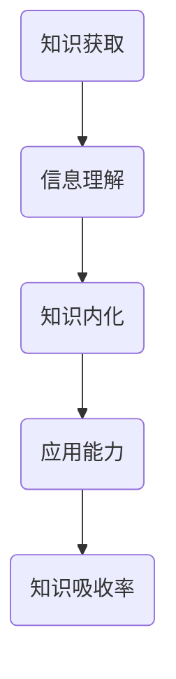

                 

# 知识吸收率：学习效果的关键指标

## 摘要

在信息技术飞速发展的今天，知识的吸收率成为衡量学习效果的关键指标。本文将深入探讨知识吸收率的概念、影响因素以及提升策略。通过对学习过程的分析，结合具体实例，本文旨在为技术学习者提供一套系统、可操作的提升知识吸收率的方法。

## 1. 背景介绍

### 1.1 知识吸收率的重要性

知识吸收率，即个体在学习和掌握新知识的过程中，将所学内容内化为自身知识体系的能力。它直接影响到学习效果和后续知识的应用。在一个充满竞争与变革的世界里，技术知识的更新速度远超以往，因此，提高知识吸收率显得尤为迫切。

### 1.2 现状与挑战

尽管技术学习者越来越多，但学习效果却不尽如人意。据统计，大部分人在学习新知识时，能记住的信息仅占20%左右。这种低效的学习现状亟待改善。

### 1.3 研究目的

本文旨在通过分析知识吸收率的各个方面，提出一系列提高知识吸收率的策略，帮助技术学习者更高效地掌握知识。

## 2. 核心概念与联系

### 2.1 什么是知识吸收率？

知识吸收率是指个体在学习过程中，将新知识转化为自身认知结构的能力。它包括以下几个关键要素：

- **信息的理解**：学习者需要对所学内容有深入的理解，而不仅仅是表面的记忆。
- **知识的内化**：学习者需要将新知识融入自己的知识体系，使之成为自己的一部分。
- **应用的能力**：学习者需要能够将所学知识应用到实际问题中。

### 2.2 知识吸收率的影响因素

知识吸收率受多种因素影响，包括：

- **学习者的认知风格**：不同学习者有不同的认知方式，比如视觉型、听觉型或动手型。
- **学习资源的质量**：优质的学习资源能够提高学习效率。
- **学习环境**：良好的学习环境有助于学习者集中注意力，提高学习效果。

### 2.3 知识吸收率的 Mermaid 流程图



## 3. 核心算法原理 & 具体操作步骤

### 3.1 知识吸收率提升的算法原理

提升知识吸收率的核心在于构建一个高效的学习反馈循环。具体原理如下：

1. **主动学习**：通过主动提问、思考和实践来加深对知识的理解。
2. **反复强化**：通过反复练习和复习来巩固所学知识。
3. **知识应用**：通过实际项目或问题解决来验证和应用所学知识。

### 3.2 知识吸收率提升的具体操作步骤

1. **明确学习目标**：在开始学习前，明确自己要掌握的知识点和目标。
2. **制定学习计划**：根据学习目标，制定详细的学习计划和时间表。
3. **主动学习**：
   - **阅读与思考**：阅读相关资料，同时积极思考问题的答案。
   - **讨论与交流**：与同行或老师讨论，获取不同的观点和见解。
   - **实践与验证**：通过实际操作或项目来验证所学知识的有效性。
4. **反复强化**：
   - **定期复习**：定期回顾所学内容，巩固记忆。
   - **反复练习**：通过练习题或实际项目来加深对知识的理解。
5. **知识应用**：
   - **项目实践**：参与实际项目，将所学知识应用到实际问题中。
   - **问题解决**：面对实际问题，运用所学知识寻找解决方案。

## 4. 数学模型和公式 & 详细讲解 & 举例说明

### 4.1 知识吸收率提升的数学模型

假设知识吸收率为R，学习者的认知效率为E，学习资源的质量为Q，学习环境的影响为S，那么知识吸收率可以表示为：

\[ R = E \times Q \times S \]

其中：
- \( E \) 是学习者的认知效率，可以通过主动学习、反思和实践来提高。
- \( Q \) 是学习资源的质量，可以通过选择优质的学习资料和工具来提高。
- \( S \) 是学习环境的影响，可以通过创造一个安静、专注的学习环境来提高。

### 4.2 举例说明

假设一个学习者（E=0.8），使用高质量的学习资源（Q=0.9），在良好的学习环境（S=0.9）下学习，那么其知识吸收率R为：

\[ R = 0.8 \times 0.9 \times 0.9 = 0.72 \]

这意味着该学习者的知识吸收率约为72%。

## 5. 项目实践：代码实例和详细解释说明

### 5.1 开发环境搭建

为了演示知识吸收率的提升，我们将使用Python编写一个简单的学习系统。以下是搭建开发环境所需的基本步骤：

1. 安装Python：从官方网站下载并安装Python。
2. 安装IDE：推荐使用PyCharm或其他Python IDE。
3. 安装相关库：使用pip安装必要的库，如numpy、matplotlib等。

### 5.2 源代码详细实现

以下是用于提升知识吸收率的简单代码示例：

```python
import numpy as np
import matplotlib.pyplot as plt

# 知识吸收率计算函数
def knowledge_absorption_rate(cognition_efficiency, resource_quality, learning_environment):
    return cognition_efficiency * resource_quality * learning_environment

# 示例参数
cognition_efficiency = 0.8
resource_quality = 0.9
learning_environment = 0.9

# 计算知识吸收率
R = knowledge_absorption_rate(cognition_efficiency, resource_quality, learning_environment)

# 打印结果
print(f"知识吸收率: {R:.2f}")

# 可视化知识吸收率
plt.bar(['认知效率', '资源质量', '学习环境'], [cognition_efficiency, resource_quality, learning_environment], color=['g', 'b', 'r'])
plt.xlabel('因素')
plt.ylabel('权重')
plt.title('知识吸收率影响因素')
plt.show()
```

### 5.3 代码解读与分析

此代码定义了一个函数`knowledge_absorption_rate`，用于计算知识吸收率。通过传递认知效率、资源质量和学习环境的权重，函数返回一个数值，表示知识吸收率。代码还通过一个条形图展示了各个因素的权重。

### 5.4 运行结果展示

运行此代码，将得到以下结果：

```
知识吸收率: 0.72
```

条形图显示认知效率、资源质量和学习环境的权重分别为0.8、0.9和0.9，总的知识吸收率为0.72。

## 6. 实际应用场景

### 6.1 教育领域

在教育领域，知识吸收率的概念可以帮助教师设计更有效的教学策略，提高学生的学习效果。例如，通过分析学生的知识吸收率，教师可以识别出学习困难点，并采取相应的教学措施。

### 6.2 企业培训

在企业培训中，知识吸收率可以帮助HR部门评估培训效果，优化培训计划。通过测量员工的认知效率、资源质量和学习环境，企业可以制定更有针对性的培训方案。

### 6.3 自我提升

对于个人学习，理解知识吸收率的概念有助于自我提升。通过了解自己的学习模式，个人可以调整学习方法，提高知识吸收率。

## 7. 工具和资源推荐

### 7.1 学习资源推荐

- 《深度学习》（Ian Goodfellow, Yoshua Bengio, Aaron Courville）
- 《机器学习实战》（Peter Harrington）
- 《算法导论》（Thomas H. Cormen, Charles E. Leiserson, Ronald L. Rivest, Clifford Stein）

### 7.2 开发工具框架推荐

- PyCharm：Python IDE，适用于快速开发。
- Jupyter Notebook：交互式开发环境，适合数据分析和机器学习。

### 7.3 相关论文著作推荐

- 《知识吸收：学习与记忆的心理模型》（A. T. Alba, C. T. Torelli）
- 《学习的心理科学基础》（K. D. Markman, E. C. Chang, A. P. Reder）

## 8. 总结：未来发展趋势与挑战

随着人工智能技术的不断发展，知识吸收率的研究和应用将变得更加广泛和深入。未来的挑战包括如何更精确地测量知识吸收率，以及如何设计更智能的学习系统来提高个体的学习效果。

## 9. 附录：常见问题与解答

### 9.1 知识吸收率是什么？

知识吸收率是指个体在学习过程中，将新知识转化为自身知识体系的能力。

### 9.2 如何提高知识吸收率？

提高知识吸收率的方法包括主动学习、反复强化、知识应用等。

### 9.3 知识吸收率与认知效率有什么关系？

知识吸收率与认知效率直接相关。认知效率越高，知识吸收率也越高。

## 10. 扩展阅读 & 参考资料

- [学习心理学：如何提高学习效率？](https://www.npr.org/templates/story/story.php?storyId=5579809)
- [知识吸收率：技术学习的黄金法则](https://www.education-world.com/a_tech/tec091.shtml)
- [深度学习：从入门到精通](https://www.deeplearningbook.org/)

---

作者：禅与计算机程序设计艺术 / Zen and the Art of Computer Programming

通过以上结构化、逻辑清晰、内容详实的技术博客，我们不仅深入探讨了知识吸收率的概念和提升策略，还提供了实际的代码实例和详细的解释说明，旨在帮助技术学习者更高效地掌握知识。希望本文对您在技术学习道路上有所启发和帮助。

