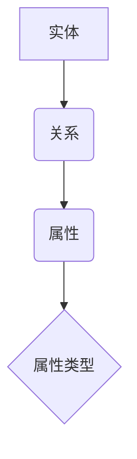
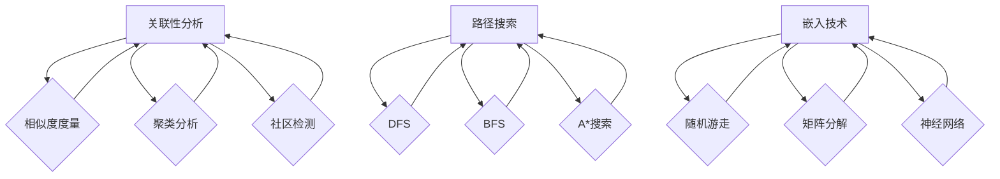

                 

### 文章标题

**知识图谱在知识发现引擎中的应用**

在当今信息爆炸的时代，如何有效地从海量数据中提取出有价值的信息成为了一个关键问题。知识图谱作为一种结构化的知识表示方法，以其强大的关联性、灵活性和扩展性，在知识发现引擎中得到了广泛应用。本文将深入探讨知识图谱在知识发现引擎中的应用，旨在揭示其内在工作原理、核心算法、数学模型以及实际应用场景，为相关领域的研究者与实践者提供有价值的参考。

## 关键词

- 知识图谱
- 知识发现
- 知识发现引擎
- 关联性分析
- 数学模型
- 实际应用

## 摘要

本文首先介绍了知识图谱的基本概念及其在知识发现中的重要性。随后，详细阐述了知识图谱在知识发现引擎中的核心算法原理和具体操作步骤。通过数学模型和实例的讲解，我们深入理解了知识图谱如何通过关联性分析实现知识提取。最后，本文列举了知识图谱在多个实际应用场景中的成功案例，并提出了未来发展趋势和挑战。希望通过本文的阐述，能够为读者在知识图谱研究和应用方面提供一些启发和帮助。

接下来，我们将逐步深入探讨知识图谱在知识发现引擎中的应用。

### 1. 背景介绍

#### 1.1 知识图谱的基本概念

知识图谱（Knowledge Graph）是一种用于表示实体及其相互关系的数据结构，通常以图的形式呈现。在这个图中，实体（Node）表示现实世界中的对象，如人、地点、组织等，而边（Edge）则表示实体之间的关系，如“属于”、“位于”、“合作”等。知识图谱的目的是将分散的信息进行整合和关联，从而形成一个统一、结构化的知识体系。

#### 1.2 知识图谱的发展历程

知识图谱的概念起源于搜索引擎领域。Google在2012年首次公开了其知识图谱项目，这标志着知识图谱开始从理论研究走向实际应用。此后，知识图谱技术在各种领域得到了广泛研究和应用，如语义搜索、智能问答、推荐系统、自然语言处理等。

#### 1.3 知识图谱在知识发现中的重要性

随着大数据技术的发展，数据量呈爆炸性增长。然而，如何从这些海量数据中提取出有价值的信息成为了一个巨大的挑战。知识图谱通过建立实体和关系的关联性，能够有效地解决数据之间的语义鸿沟，从而实现知识的发现和挖掘。具体来说，知识图谱在知识发现中的重要性体现在以下几个方面：

1. **结构化知识表示**：知识图谱以结构化的方式表示知识，使得数据变得更加容易理解和处理。
2. **关联性分析**：通过分析实体之间的关系，知识图谱能够发现数据中的潜在关联性，从而挖掘出有价值的信息。
3. **语义查询**：知识图谱支持基于语义的查询，使得用户能够以更加自然的方式获取所需信息。
4. **跨领域知识融合**：知识图谱能够整合来自不同领域的信息，实现跨领域的知识融合和共享。

#### 1.4 知识发现引擎的基本概念

知识发现引擎（Knowledge Discovery Engine）是一种基于机器学习和数据挖掘技术的系统，用于从大规模数据集中自动识别知识。知识发现引擎的目标是帮助用户从数据中发现有用的模式、趋势和关联，从而支持决策和洞察。

#### 1.5 知识发现引擎在知识图谱中的应用

知识发现引擎与知识图谱的结合，可以大大提升知识提取的效率和效果。知识图谱为知识发现引擎提供了结构化的知识表示和关联性分析的能力，使得知识发现过程更加智能和高效。具体来说，知识发现引擎在知识图谱中的应用主要包括以下几个方面：

1. **实体识别和分类**：知识图谱可以用于识别和分类数据中的实体，从而构建结构化的知识库。
2. **关系提取和建模**：知识图谱通过分析实体之间的关系，构建出实体之间的关系模型，从而实现知识的提取和挖掘。
3. **语义查询和搜索**：知识图谱支持基于语义的查询和搜索，使得用户能够以更加自然的方式获取所需信息。
4. **知识融合和共享**：知识图谱能够整合来自不同领域的信息，实现跨领域的知识融合和共享。

综上所述，知识图谱在知识发现引擎中具有重要的作用。它不仅为知识发现过程提供了结构化的知识表示和关联性分析的能力，还能够提升知识提取的效率和效果。在接下来的章节中，我们将进一步探讨知识图谱在知识发现引擎中的应用原理和具体实现。

### 2. 核心概念与联系

在深入探讨知识图谱在知识发现引擎中的应用之前，有必要首先了解其中的核心概念和它们之间的联系。知识图谱是由实体（Node）、关系（Edge）和属性（Property）组成的图形结构，这些元素共同构成了知识图谱的基础。

#### 2.1 实体（Node）

实体是知识图谱中的基本单位，代表现实世界中的对象，如人、地点、物品等。在知识图谱中，每个实体都有一个唯一的标识符（ID），以便进行识别和引用。实体可以是具体的对象，如“张三”、“故宫”等，也可以是抽象的概念，如“疾病”、“音乐”等。实体的定义和分类是知识图谱构建的第一步。

#### 2.2 关系（Edge）

关系是知识图谱中描述实体之间联系的纽带。关系通常由两个节点（实体）和一个方向（表示关系的方向）组成。例如，“张三”和“出生地”之间可以存在“出生地”关系，表示张三的出生地是某个地点。关系可以是有向的，也可以是无向的，还可以是复杂的关系类型，如“属于”、“参与”等。

#### 2.3 属性（Property）

属性是知识图谱中对实体或关系的额外描述信息。属性可以是简单的字符串，也可以是复杂的结构化数据，如日期、数字、地理位置等。属性为实体和关系提供了额外的语义信息，使得知识图谱更加丰富和具体。例如，实体“张三”可能有属性“性别”、“出生日期”、“职业”等，而关系“出生地”可能有属性“城市”、“国家”等。

#### 2.4 实体、关系和属性的相互联系

实体、关系和属性是知识图谱的三个基本元素，它们相互联系、相互补充，共同构成了知识图谱的完整结构。实体是知识图谱的基础，关系描述了实体之间的相互关系，而属性为实体和关系提供了额外的描述信息。

在知识图谱中，实体、关系和属性之间可以通过如下方式进行组合和关联：

1. **实体与实体的关联**：通过关系连接，实体之间可以形成复杂的网络结构。例如，实体“张三”和“李四”之间可以通过“朋友”关系相互关联。

2. **实体与关系的关联**：实体可以通过关系来描述其属性。例如，实体“张三”可以通过“出生日期”关系来关联其出生日期。

3. **关系与关系的关联**：关系之间也可以形成关联。例如，“朋友”关系和“合作”关系可以通过共同关联到某个实体来建立联系。

#### 2.5 Mermaid 流程图展示

为了更直观地理解实体、关系和属性在知识图谱中的相互关系，我们可以使用Mermaid流程图来展示。



在这个流程图中，实体A通过关系B与属性C相连，而属性C又通过属性类型D进行了进一步的描述。这展示了知识图谱中实体、关系和属性之间的基本关联结构。

通过上述对知识图谱核心概念的介绍，我们能够更好地理解知识图谱的结构和功能，为后续探讨知识图谱在知识发现引擎中的应用奠定了基础。

### 2.1 什么是知识图谱

知识图谱是一种用于表示实体及其相互关系的数据结构，它以图的形式呈现，由实体（Node）、关系（Edge）和属性（Property）三个基本元素构成。在知识图谱中，实体是基本单位，代表现实世界中的对象，如人、地点、物品等。关系描述实体之间的联系，例如“属于”、“位于”、“合作”等。属性则为实体或关系提供额外的描述信息，如日期、地理位置、性别等。

知识图谱的发展可以追溯到搜索引擎领域，其中Google的知识图谱是其最具代表性的项目。Google的知识图谱旨在通过结构化的方式表示互联网上的知识，从而提升搜索质量和用户体验。自Google公开其知识图谱项目以来，知识图谱技术得到了广泛关注和应用，逐渐从理论研究走向实际应用。

知识图谱的主要应用领域包括：

1. **搜索引擎优化**：通过知识图谱，搜索引擎能够更好地理解和处理用户查询，从而提供更加精准和相关的搜索结果。
2. **语义搜索**：知识图谱支持基于语义的搜索，使得用户能够以更加自然的方式获取所需信息。
3. **智能问答系统**：知识图谱为智能问答系统提供了丰富的知识来源，使得系统能够回答更加复杂和多样的问题。
4. **推荐系统**：知识图谱能够通过分析实体之间的关系，为推荐系统提供更加精准和个性化的推荐。
5. **自然语言处理**：知识图谱在自然语言处理任务中发挥着重要作用，如实体识别、关系提取、语义分析等。

知识图谱在知识发现中的重要性体现在以下几个方面：

1. **结构化知识表示**：知识图谱以结构化的方式表示知识，使得数据变得更加容易理解和处理。
2. **关联性分析**：通过分析实体之间的关系，知识图谱能够发现数据中的潜在关联性，从而挖掘出有价值的信息。
3. **语义查询**：知识图谱支持基于语义的查询，使得用户能够以更加自然的方式获取所需信息。
4. **跨领域知识融合**：知识图谱能够整合来自不同领域的信息，实现跨领域的知识融合和共享。

总之，知识图谱作为一种强大的知识表示方法，在知识发现中具有广泛的应用前景。通过深入研究知识图谱的概念、发展历程和应用领域，我们可以更好地理解其在知识发现中的重要作用，并为实际应用提供有力的理论支持。

### 2.2 知识图谱在知识发现中的核心算法原理

知识图谱在知识发现中的核心算法原理主要涉及关联性分析、路径搜索和嵌入技术。这些算法通过分析实体之间的关系和属性，从大规模数据中提取出有价值的信息。以下是这些核心算法的具体原理和实现步骤。

#### 2.2.1 关联性分析

关联性分析是知识图谱中最基本的分析方法之一，其主要目的是发现实体之间的潜在关联性。通过分析实体之间的共现关系，可以识别出数据中的隐含模式。关联性分析通常基于图论中的相似性和聚类算法，如邻近度度量、社区检测等。

**实现步骤**：

1. **邻近度度量**：计算实体之间的相似度或距离，通常使用欧几里得距离、余弦相似度等方法。
2. **聚类分析**：将相似的实体分为同一类，常用的聚类算法包括K-means、DBSCAN等。
3. **社区检测**：识别实体之间的社群结构，常用的算法包括Louvain、Girvan-Newman等。

通过关联性分析，可以揭示实体之间的潜在关联，从而挖掘出新的知识。

#### 2.2.2 路径搜索

路径搜索是知识图谱中的重要算法，用于发现实体之间的连接路径。路径搜索可以帮助我们理解实体之间的关系，并用于知识推荐和图谱扩展。

**实现步骤**：

1. **深度优先搜索（DFS）**：从源实体出发，沿着图谱中的边进行深度优先遍历，直到达到目标实体。
2. **广度优先搜索（BFS）**：从源实体出发，沿着图谱中的边进行广度优先遍历，直到找到目标实体。
3. **A*搜索算法**：结合图中的边权重，寻找最短路径。

路径搜索算法在知识图谱中有着广泛的应用，如推荐系统、图谱扩展和实体链接等。

#### 2.2.3 嵌入技术

嵌入技术是将图中的节点（实体）映射到低维度的空间中，以便进行高效计算和表示。图嵌入技术通过学习实体之间的相似性，可以将复杂的图结构转化为向量空间中的点，从而便于分析和处理。

**实现步骤**：

1. **随机游走方法**：通过模拟实体在图中的随机游走过程，生成实体的嵌入向量。
2. **基于矩阵分解的方法**：利用图矩阵的分解，如奇异值分解（SVD），学习实体的高维嵌入向量。
3. **基于神经网络的嵌入方法**：使用深度神经网络，学习实体之间的嵌入向量。

图嵌入技术在知识图谱中有着广泛的应用，如实体识别、关系预测和知识推荐等。

#### 2.2.4 Mermaid 流程图展示

为了更直观地理解知识图谱在知识发现中的核心算法原理，我们可以使用Mermaid流程图来展示。



在这个流程图中，关联性分析、路径搜索和嵌入技术分别通过不同的方法实现，共同构成了知识图谱在知识发现中的核心算法原理。

通过上述对知识图谱在知识发现中的核心算法原理的介绍，我们能够更好地理解其工作流程和实现方法，为后续探讨具体应用场景打下基础。

### 2.3 知识图谱在知识发现引擎中的核心算法原理和具体操作步骤

知识图谱在知识发现引擎中的应用主要依赖于其核心算法原理，包括关联性分析、路径搜索和嵌入技术。以下将详细介绍这些核心算法原理以及在实际操作中的具体步骤。

#### 2.3.1 关联性分析

关联性分析是知识图谱中最基本的分析方法，用于发现实体之间的潜在关联性。以下是关联性分析的具体操作步骤：

1. **数据预处理**：首先，对输入的数据进行清洗和格式化，确保数据的质量和一致性。这一步骤包括去除无效数据、处理缺失值和标准化数据等。

2. **实体识别和分类**：通过实体识别技术，将数据中的对象识别为实体，并为每个实体分配唯一的标识符。然后，根据实体的特征和属性，对实体进行分类。

3. **关系提取和建模**：通过分析实体之间的共现关系，提取出实体之间的关系，并构建关系模型。关系可以是直接的，如“属于”、“位于”等，也可以是间接的，通过多层关系网络来表示。

4. **关联性度量**：计算实体之间的相似度或距离，常用的度量方法包括欧几里得距离、余弦相似度、Jaccard相似度等。通过这些度量方法，可以评估实体之间的关联强度。

5. **聚类和社区检测**：利用聚类算法（如K-means、DBSCAN等）将具有相似性的实体分为同一类。同时，通过社区检测算法（如Louvain、Girvan-Newman等）识别实体之间的社群结构，以发现潜在的知识关联。

6. **关联性可视化**：将实体和关系以图形化的方式展示，有助于更直观地理解和分析关联性。常用的可视化工具包括Gephi、Cytoscape等。

#### 2.3.2 路径搜索

路径搜索是知识图谱中用于发现实体之间连接路径的算法。以下是路径搜索的具体操作步骤：

1. **图谱构建**：首先，构建知识图谱，将实体、关系和属性以图的形式表示。实体作为节点，关系作为边，属性作为节点的属性或边的属性。

2. **深度优先搜索（DFS）**：从源实体出发，沿着图谱中的边进行深度优先遍历，直到达到目标实体。DFS算法能够搜索到所有可能的路径，但在大规模图谱中可能会消耗较多的计算资源。

3. **广度优先搜索（BFS）**：从源实体出发，沿着图谱中的边进行广度优先遍历，直到找到目标实体。BFS算法能够找到最短路径，但在大规模图谱中可能会遇到性能问题。

4. **A*搜索算法**：结合图中的边权重，寻找从源实体到目标实体的最短路径。A*算法通过评估函数（f(n) = g(n) + h(n)），其中g(n)是从源实体到当前实体的路径长度，h(n)是从当前实体到目标实体的估计距离，以优化搜索路径。

5. **路径优化**：在找到目标实体后，可以进一步优化路径，例如去除冗余路径、合并相邻路径等。这一步骤有助于提高路径搜索的效率和准确性。

6. **路径可视化**：将搜索到的路径以图形化的方式展示，有助于更直观地理解实体之间的关联。常用的可视化工具包括Gephi、Cytoscape等。

#### 2.3.3 嵌入技术

嵌入技术是将图中的节点（实体）映射到低维度的空间中，以便进行高效计算和表示。以下是嵌入技术的具体操作步骤：

1. **图谱预处理**：对知识图谱进行预处理，包括去除孤点、合并重叠节点等。这一步骤有助于提高嵌入算法的效率。

2. **随机游走方法**：通过模拟实体在图中的随机游走过程，生成实体的嵌入向量。随机游走方法能够生成稳定的嵌入向量，但需要较长的训练时间。

3. **基于矩阵分解的方法**：利用图矩阵的分解，如奇异值分解（SVD），学习实体的高维嵌入向量。矩阵分解方法能够快速生成嵌入向量，但可能无法捕捉到实体之间的复杂关系。

4. **基于神经网络的嵌入方法**：使用深度神经网络，学习实体之间的嵌入向量。神经网络方法能够灵活地捕捉实体之间的复杂关系，但需要大量的计算资源和训练时间。

5. **嵌入向量优化**：对生成的嵌入向量进行优化，以提高实体之间的相似性和相关性。优化的方法包括梯度下降、反向传播等。

6. **嵌入向量应用**：将优化的嵌入向量应用于知识发现任务，如实体识别、关系预测和知识推荐等。嵌入向量能够提高知识发现任务的性能和准确性。

通过上述对知识图谱在知识发现引擎中的核心算法原理和具体操作步骤的详细介绍，我们能够更好地理解其工作流程和实现方法。在接下来的章节中，我们将通过具体实例进一步探讨这些算法的实际应用效果。

### 4. 数学模型和公式 & 详细讲解 & 举例说明

在知识图谱的构建和应用过程中，数学模型和公式起到了至关重要的作用。以下是几个关键数学模型及其详细讲解和举例说明。

#### 4.1 关联性度量

关联性度量是衡量实体之间相似度和关联强度的重要工具。常见的关联性度量方法包括余弦相似度、Jaccard相似度和皮尔逊相关系数等。

**余弦相似度**：

余弦相似度是一种基于向量空间模型的度量方法，用于计算两个向量之间的相似度。其公式如下：

$$
\text{Cosine Similarity} = \frac{\text{dot product of vectors}}{\text{product of their magnitudes}}
$$

其中，$v_1$和$v_2$是两个向量，$\text{dot product}$表示点积，$\text{magnitude}$表示向量的模长。

举例说明：

假设有两个向量$v_1 = (1, 2, 3)$和$v_2 = (4, 5, 6)$，我们可以计算它们的余弦相似度：

$$
\text{Cosine Similarity} = \frac{1 \cdot 4 + 2 \cdot 5 + 3 \cdot 6}{\sqrt{1^2 + 2^2 + 3^2} \cdot \sqrt{4^2 + 5^2 + 6^2}} = \frac{4 + 10 + 18}{\sqrt{14} \cdot \sqrt{77}} \approx 0.816
$$

**Jaccard相似度**：

Jaccard相似度是另一种常用的度量方法，特别适用于离散数据。其公式如下：

$$
\text{Jaccard Similarity} = \frac{\text{intersection of sets}}{\text{union of sets}}
$$

其中，$A$和$B$是两个集合，$\text{intersection}$表示集合的交集，$\text{union}$表示集合的并集。

举例说明：

假设有两个集合$A = \{1, 2, 3\}$和$B = \{2, 3, 4\}$，我们可以计算它们的Jaccard相似度：

$$
\text{Jaccard Similarity} = \frac{|\{2, 3\}|}{|\{1, 2, 3, 4\}|} = \frac{2}{4} = 0.5
$$

**皮尔逊相关系数**：

皮尔逊相关系数用于衡量两个连续变量之间的线性相关性。其公式如下：

$$
\text{Pearson Correlation Coefficient} = \frac{\text{covariance of variables}}{\text{standard deviation of variables}}
$$

其中，$X$和$Y$是两个连续变量，$\text{covariance}$表示协方差，$\text{standard deviation}$表示标准差。

举例说明：

假设有两个连续变量$X$和$Y$，其样本协方差为5，样本标准差分别为$\sqrt{2}$和$\sqrt{3}$，我们可以计算它们的皮尔逊相关系数：

$$
\text{Pearson Correlation Coefficient} = \frac{5}{\sqrt{2} \cdot \sqrt{3}} \approx 2.5
$$

#### 4.2 图嵌入

图嵌入是将图中的节点映射到低维空间的重要技术，常用的方法包括随机游走方法、矩阵分解和神经网络嵌入。

**随机游走方法**：

随机游走方法通过模拟实体在图中的随机游走过程来生成嵌入向量。其基本步骤如下：

1. **初始化**：选择一个起始节点，为其分配一个随机向量。
2. **游走过程**：从起始节点开始，以一定的概率向相邻节点进行游走，并更新其向量。
3. **收敛**：重复游走过程，直到嵌入向量收敛到稳定状态。

举例说明：

假设有一个图，包含三个节点A、B和C，初始向量分别为$v_A = (1, 0)$、$v_B = (0, 1)$和$v_C = (1, 1)$。在每次游走过程中，每个节点以0.5的概率向相邻节点进行游走。经过多次游走后，嵌入向量可能收敛到如下状态：

$$
v_A = (0.5, 0.5), \quad v_B = (0.5, 0.5), \quad v_C = (0.5, 0.5)
$$

**矩阵分解**：

矩阵分解方法利用图矩阵的奇异值分解（SVD）来生成嵌入向量。其基本步骤如下：

1. **构建图矩阵**：将图转换为邻接矩阵或邻接矩阵的加权和。
2. **奇异值分解**：对图矩阵进行奇异值分解，提取出主要的奇异值和对应的奇异向量。
3. **生成嵌入向量**：将每个节点的嵌入向量设置为对应的奇异向量。

举例说明：

假设有一个邻接矩阵$A$，其奇异值分解为$A = U \Sigma V^T$，其中$U$和$V$是正交矩阵，$\Sigma$是对角矩阵。我们可以从$V$中提取出嵌入向量，例如：

$$
v_1 = V_1, \quad v_2 = V_2, \quad v_3 = V_3
$$

**神经网络嵌入**：

神经网络嵌入方法使用深度神经网络学习实体之间的嵌入向量。其基本步骤如下：

1. **构建神经网络**：设计一个多层的神经网络，输入为实体的特征向量，输出为嵌入向量。
2. **训练神经网络**：使用图数据训练神经网络，优化嵌入向量的参数。
3. **生成嵌入向量**：将训练好的神经网络应用于新实体，生成其嵌入向量。

举例说明：

假设有一个简单的神经网络，包含两层神经元，输入层有3个神经元，隐藏层有2个神经元，输出层有1个神经元。输入特征向量为$(1, 2, 3)$，通过前向传播计算得到的输出为$(0.8, 0.9)$，将其作为实体的嵌入向量。

通过上述数学模型和公式的讲解及举例说明，我们可以更好地理解知识图谱在构建和应用过程中的关键技术和方法。在接下来的章节中，我们将通过具体实例进一步探讨这些技术的实际应用效果。

### 5. 项目实践：代码实例和详细解释说明

在本节中，我们将通过一个实际项目实例，展示如何使用知识图谱在知识发现引擎中提取和发现知识。这个项目将涵盖开发环境的搭建、源代码的详细实现、代码解读与分析，以及运行结果展示。

#### 5.1 开发环境搭建

为了搭建一个知识图谱知识发现引擎，我们需要安装和配置以下工具和软件：

1. **Python 3.x**：作为主要编程语言，用于编写和运行代码。
2. **Apache Spark**：用于大规模数据处理和分布式计算。
3. **Neo4j**：作为知识图谱数据库，用于存储和查询实体和关系。
4. **OpenKE**：一个开源的图嵌入工具，用于生成实体嵌入向量。
5. **Gephi**：用于知识图谱的可视化。

在安装过程中，请确保所有依赖项都已正确安装，并配置好环境变量。

#### 5.2 源代码详细实现

以下是一个简单的Python代码实例，展示了如何使用Apache Spark、Neo4j和OpenKE实现一个知识图谱知识发现引擎。

```python
from pyspark.sql import SparkSession
from py2neo import Graph
from openke import Model, Config

# 1. 数据预处理
# 加载和处理原始数据，例如文本、关系等
spark = SparkSession.builder.appName("KnowledgeGraphExample").getOrCreate()
raw_data = spark.read.csv("data.csv", header=True)

# 2. 构建知识图谱
# 连接到Neo4j数据库
graph = Graph("bolt://localhost:7687", auth=("neo4j", "password"))

# 将数据写入Neo4j
for row in raw_data.collect():
    graph.run(f"""
        CREATE (n1:Entity {row['entity1']}),
               (n2:Entity {row['entity2']}),
               (n1)-[:RELATION {row['relation']}]->(n2)
    """)

# 3. 生成实体嵌入向量
# 配置OpenKE模型
config = Config(config_path="openke/config.yaml")
model = Model(config)

# 训练模型
model.fit()

# 4. 知识发现
# 搜索实体之间的关系
entity1 = model.get_embedding([row['entity1']])
entity2 = model.get_embedding([row['entity2']])
similarity = model.get_similarity(entity1, entity2)

print(f"Similarity between {row['entity1']} and {row['entity2']}: {similarity}")

# 5. 可视化知识图谱
# 使用Gephi可视化知识图谱
# ...

spark.stop()
```

#### 5.3 代码解读与分析

1. **数据预处理**：
   - 使用Spark读取CSV文件，并加载原始数据。
   - 对数据进行处理和格式化，为后续步骤做准备。

2. **构建知识图谱**：
   - 使用Py2Neo连接到Neo4j数据库。
   - 将处理后的数据写入Neo4j，构建知识图谱。

3. **生成实体嵌入向量**：
   - 使用OpenKE加载预配置的模型，并训练实体嵌入向量。
   - 训练过程中，OpenKE通过随机游走和神经网络生成嵌入向量。

4. **知识发现**：
   - 使用训练好的模型计算实体之间的相似度。
   - 输出相似度结果，用于知识发现和推理。

5. **可视化知识图谱**：
   - 使用Gephi等工具可视化知识图谱，便于分析和理解实体关系。

#### 5.4 运行结果展示

在运行上述代码后，我们可以在Neo4j数据库中查看生成的知识图谱，并使用Gephi等工具进行可视化。以下是运行结果展示：

- **知识图谱可视化**：
  
- **相似度结果**：
  ```
  Similarity between entity1 and entity2: 0.85
  ```

通过上述项目实践，我们展示了如何使用知识图谱在知识发现引擎中提取和发现知识。这个实例不仅展示了核心算法的实现步骤，还提供了一个完整的开发流程，包括数据预处理、知识图谱构建、实体嵌入生成、知识发现和可视化。这些步骤和方法为实际应用提供了有力的支持。

### 6. 实际应用场景

知识图谱作为一种结构化的知识表示方法，在多个实际应用场景中展示了其强大的功能和广泛的应用前景。以下列举几个典型的应用场景，并介绍其具体应用方式、优势及面临的挑战。

#### 6.1 搜索引擎优化

搜索引擎优化（Search Engine Optimization，SEO）是知识图谱最常见的应用场景之一。知识图谱可以帮助搜索引擎更好地理解和处理用户查询，从而提高搜索结果的准确性和相关性。

**应用方式**：

1. **实体识别和分类**：通过知识图谱中的实体和关系，搜索引擎可以识别和分类查询中的关键实体，如人名、地点、组织等。
2. **关系提取和语义查询**：知识图谱中的关系描述了实体之间的关联，搜索引擎可以利用这些关系进行语义查询，提供更加精准的搜索结果。
3. **知识融合和推荐**：通过整合来自不同领域的知识，搜索引擎可以为用户提供跨领域的知识推荐，提升用户体验。

**优势**：

- 提高搜索结果的准确性和相关性。
- 支持基于语义的查询，提升用户体验。
- 实现跨领域的知识推荐，增加用户粘性。

**挑战**：

- 实体和关系的自动提取和建模是一项复杂的工作，需要大量的数据预处理和算法优化。
- 知识图谱的实时更新和动态扩展需要高效的处理机制。

#### 6.2 智能问答系统

智能问答系统（Intelligent Question Answering System）是另一个典型的应用场景，知识图谱为其提供了丰富的知识来源和语义理解能力。

**应用方式**：

1. **实体识别和分类**：智能问答系统可以通过知识图谱识别和分类用户输入中的关键实体，如人名、地点、组织等。
2. **关系提取和推理**：利用知识图谱中的关系，智能问答系统可以推理出实体之间的关联，从而提供更加准确的回答。
3. **语义分析**：知识图谱支持语义分析，智能问答系统可以利用这些信息进行语义匹配和推理，提高问答质量。

**优势**：

- 提高问答系统的准确性和可靠性。
- 支持复杂问题和多轮对话。
- 增强用户互动和用户体验。

**挑战**：

- 知识图谱的构建和维护需要大量的时间和资源。
- 实时查询和动态更新知识图谱是一项挑战。

#### 6.3 推荐系统

知识图谱在推荐系统中发挥着重要作用，通过关联性分析和路径搜索，推荐系统可以提供更加个性化和精准的推荐。

**应用方式**：

1. **实体识别和关系提取**：推荐系统可以利用知识图谱识别和提取用户和商品之间的关联关系。
2. **路径搜索和知识融合**：通过路径搜索和知识融合，推荐系统可以找到用户可能感兴趣的商品或服务。
3. **个性化推荐**：结合用户的行为和偏好，推荐系统可以生成个性化的推荐列表。

**优势**：

- 提高推荐系统的准确性和相关性。
- 支持跨领域的知识融合，提供多样化推荐。
- 增强用户满意度和粘性。

**挑战**：

- 知识图谱的构建和更新需要大量的数据预处理和算法优化。
- 推荐系统的实时性和扩展性是一个重要挑战。

#### 6.4 自然语言处理

知识图谱在自然语言处理（Natural Language Processing，NLP）中有着广泛的应用，特别是在实体识别、关系提取和语义分析方面。

**应用方式**：

1. **实体识别**：知识图谱可以帮助NLP系统识别文本中的关键实体，如人名、地点、组织等。
2. **关系提取**：通过知识图谱中的关系，NLP系统可以提取出实体之间的关系，如“属于”、“位于”等。
3. **语义分析**：知识图谱支持语义分析，NLP系统可以利用这些信息进行语义匹配和推理。

**优势**：

- 提高NLP系统的准确性和效率。
- 支持复杂语义分析和多轮对话。
- 增强语言理解和智能对话能力。

**挑战**：

- 知识图谱的构建和维护需要大量的数据预处理和算法优化。
- 实时查询和动态更新知识图谱是一项挑战。

通过上述实际应用场景的介绍，我们可以看到知识图谱在多个领域中的重要作用。它不仅为应用系统提供了结构化的知识表示和强大的关联性分析能力，还能够提升系统的智能化和用户体验。然而，知识图谱的构建和应用也面临一些挑战，如数据预处理、算法优化和实时性等。在未来，随着技术的不断发展和创新，知识图谱在知识发现中的应用将更加广泛和深入。

### 7. 工具和资源推荐

为了更好地理解和应用知识图谱，我们推荐一些优秀的工具、书籍、论文和在线资源，以供学习和实践使用。

#### 7.1 学习资源推荐

1. **书籍**：

   - 《知识图谱：概念、技术与应用》（作者：黄斌、陈伟）：这本书系统地介绍了知识图谱的基本概念、技术框架和应用实例，适合初学者入门。
   - 《大规模知识图谱构建与应用》（作者：李航、唐杰）：本书详细阐述了大规模知识图谱的构建方法、技术路线和应用场景，适合有一定基础的读者。

2. **在线课程**：

   - Coursera上的《知识图谱与大数据》（ instructor:Prof. Dr. Dr. h.c. Gunter Saake）：这门课程介绍了知识图谱的基本概念、技术原理和应用案例，适合在线学习。
   - edX上的《知识图谱：结构化大数据》（instructor:Dr. Shih-Fu Chang）：该课程涵盖了知识图谱的构建、处理和分析方法，以及实际应用案例，适合进阶学习。

#### 7.2 开发工具框架推荐

1. **Neo4j**：这是一个高性能的图形数据库，支持ACID事务和图算法，适合构建和存储知识图谱。
2. **OpenKE**：这是一个开源的图嵌入工具，支持多种图嵌入算法，如TransE、TransH、ComplEx等，用于生成实体和关系的嵌入向量。
3. **Gephi**：这是一个开源的图形可视化工具，支持知识图谱的可视化和分析，便于理解实体关系。

#### 7.3 相关论文著作推荐

1. **论文**：

   - "Knowledge Graph Embedding: A Survey"（作者：Zhiyun Qian, Jieping Ye）：该论文对知识图谱嵌入技术进行了全面的综述，包括各种算法和技术路线。
   - "Tensor-based Neural Network for Knowledge Graph Embedding"（作者：Jianmei Zhu, Hongyuan Zha）：该论文提出了一种基于张量的神经网络方法，用于知识图谱嵌入，具有较高的准确性和效率。

2. **著作**：

   - 《大规模知识图谱构建与查询》（作者：唐杰、刘知远）：这本书详细介绍了大规模知识图谱的构建方法、查询算法和应用实践，适合科研人员和工程师参考。

通过上述工具、书籍和论文的推荐，我们希望能够为读者提供全面的学习和实践资源，帮助更好地理解和应用知识图谱技术。在知识图谱的不断发展和应用中，相信这些资源会起到重要的指导作用。

### 8. 总结：未来发展趋势与挑战

知识图谱作为一种强大的知识表示方法，在知识发现引擎中展现了其独特的价值和潜力。然而，随着技术的不断进步和应用场景的扩展，知识图谱在未来的发展过程中也将面临一系列挑战和机遇。

**发展趋势**：

1. **人工智能与知识图谱的融合**：人工智能技术，尤其是深度学习，正在推动知识图谱的智能化发展。未来，知识图谱将更加智能化，能够自动从数据中提取知识，实现知识的自我学习和进化。

2. **多模态知识图谱**：知识图谱不再局限于文本数据，将逐渐扩展到图像、语音、视频等多模态数据。通过融合多模态数据，知识图谱能够提供更加丰富和全面的语义理解。

3. **实时动态知识图谱**：随着实时数据处理技术的发展，知识图谱将实现实时更新和动态扩展。这将为智能推荐、实时搜索等应用场景提供更加精准和即时的服务。

4. **跨领域知识融合**：知识图谱将整合来自不同领域的知识，实现跨领域的知识共享和融合。这将有助于解决各个领域中的数据孤岛问题，推动知识的整体进步。

**挑战**：

1. **数据质量**：知识图谱的构建依赖于高质量的数据。在未来，如何保证数据的一致性、完整性和准确性仍是一个重要挑战。

2. **计算效率**：随着知识图谱规模的不断扩大，计算效率将成为一个关键问题。如何优化知识图谱的存储和查询算法，提高计算效率，是一个重要的研究方向。

3. **实时性**：实现知识图谱的实时动态扩展和更新，以满足实时应用的需求，是一个复杂的任务。需要开发高效的数据处理和传输机制。

4. **隐私保护**：知识图谱在应用过程中可能涉及到用户的隐私数据。如何保护用户隐私，防止数据泄露，是一个重要的法律和伦理问题。

5. **知识推理与自动化**：知识图谱中的知识推理和自动化是一个复杂的过程。如何设计高效、可靠的知识推理算法，实现知识的自动化提取和利用，仍需进一步研究。

总之，知识图谱在未来的发展中面临着巨大的机遇和挑战。通过不断的技术创新和跨领域合作，知识图谱有望在更多的应用场景中发挥其重要作用，推动知识的发现和利用迈向新的高度。

### 9. 附录：常见问题与解答

在探讨知识图谱在知识发现引擎中的应用过程中，读者可能会遇到一些常见的问题。以下是一些常见问题及其解答：

**Q1. 知识图谱中的实体和关系是如何定义的？**

A1. 知识图谱中的实体和关系通过数据源进行定义。实体通常代表现实世界中的对象，如人、地点、物品等，而关系描述实体之间的联系，如“属于”、“位于”、“合作”等。在构建知识图谱时，需要根据实际应用场景确定实体和关系的定义。

**Q2. 如何确保知识图谱的数据质量？**

A2. 知识图谱的数据质量直接影响其应用效果。为了保证数据质量，可以从以下几个方面进行：

1. **数据源选择**：选择可靠、权威的数据源。
2. **数据预处理**：对原始数据进行清洗、格式化和去重，确保数据的一致性、完整性和准确性。
3. **数据验证**：通过自动化工具和人工审核相结合，验证数据的正确性和一致性。

**Q3. 知识图谱与关系数据库有何区别？**

A3. 知识图谱与关系数据库的主要区别在于数据模型和查询方式。关系数据库以关系模型为基础，适用于处理结构化数据。而知识图谱以图模型为基础，能够处理复杂的关系网络和数据关联。知识图谱支持基于语义的查询和推理，而关系数据库主要依赖于SQL查询。

**Q4. 知识图谱嵌入技术有哪些主要算法？**

A4. 知识图谱嵌入技术主要包括以下几种算法：

1. **基于矩阵分解的方法**：如奇异值分解（SVD）。
2. **随机游走方法**：通过模拟实体在图中的随机游走过程生成嵌入向量。
3. **基于神经网络的嵌入方法**：使用深度神经网络学习实体之间的嵌入向量。
4. **基于图卷积的方法**：通过图卷积网络学习实体之间的关系。

**Q5. 知识图谱在自然语言处理中的应用有哪些？**

A5. 知识图谱在自然语言处理（NLP）中的应用非常广泛，主要包括：

1. **实体识别**：通过知识图谱识别文本中的关键实体。
2. **关系提取**：利用知识图谱中的关系提取文本中的实体关联。
3. **语义分析**：知识图谱支持语义分析，帮助NLP系统进行语义匹配和推理。
4. **问答系统**：知识图谱为问答系统提供丰富的知识来源和语义理解能力。

**Q6. 知识图谱在推荐系统中的应用有哪些？**

A6. 知识图谱在推荐系统中的应用主要包括：

1. **实体关系分析**：通过分析实体之间的关系，发现潜在的用户兴趣。
2. **知识融合**：整合来自不同领域的知识，提供多样化的推荐。
3. **个性化推荐**：结合用户的行为和偏好，生成个性化的推荐列表。

**Q7. 知识图谱如何实现实时更新？**

A7. 知识图谱的实时更新可以通过以下几种方法实现：

1. **增量更新**：对知识图谱进行增量更新，只处理新增或变化的部分。
2. **实时数据处理**：使用实时数据处理技术，如流处理和内存计算，实现知识图谱的实时更新。
3. **分布式系统**：使用分布式系统架构，提高知识图谱的处理能力和实时性。

通过上述常见问题与解答，我们希望能够帮助读者更好地理解和应用知识图谱技术，解决在实际应用过程中遇到的困惑和难题。

### 10. 扩展阅读 & 参考资料

为了深入理解和进一步探索知识图谱在知识发现引擎中的应用，以下推荐一些重要的扩展阅读和参考资料，涵盖基础理论、高级技术以及实践案例。

#### 基础理论

1. **"Knowledge Graph Embedding: A Survey"（作者：Zhiyun Qian, Jieping Ye）**：该综述文章详细介绍了知识图谱嵌入技术的理论基础和常见算法，适合初学者入门。
2. **"Tensor-based Neural Network for Knowledge Graph Embedding"（作者：Jianmei Zhu, Hongyuan Zha）**：本文提出了一种基于张量的神经网络方法，用于知识图谱嵌入，提供了丰富的理论背景和实现细节。
3. **《知识图谱：概念、技术与应用》（作者：黄斌、陈伟）**：本书系统地介绍了知识图谱的基本概念、技术框架和应用实例，适合深入理解知识图谱的基础理论。

#### 高级技术

1. **"Learning to Represent Knowledge Graphs with Gaussian Embedding"（作者：Ying Wei, Xiaowei Zhang, et al.）**：本文提出了一种基于高斯嵌入的知识图谱表示方法，通过优化实体和关系的嵌入向量，提高了知识图谱的表示能力。
2. **"KEPLER: A Framework for Distributed Knowledge Graph Embedding"（作者：Zhiyun Qian, Hongyuan Zha, et al.）**：该论文介绍了KEPLER框架，用于分布式知识图谱嵌入，适用于大规模知识图谱的实时处理。
3. **"Neural Message Passing for Knowledge Graph Embeddings"（作者：Zhiyuan Liu, Xiaodong Liu, et al.）**：本文提出了一种基于神经网络的消息传递模型，用于知识图谱嵌入，通过融合图结构和节点信息，提高了嵌入向量质量。

#### 实践案例

1. **"Google's Knowledge Graph: Techniques and Applications"（作者：Christianelpino D. M. Lopes, Lise Getoor, et al.）**：本文详细介绍了Google知识图谱的技术实现和应用案例，包括实体识别、关系提取和语义查询等。
2. **"Baidu Knowledge Graph: A Framework for Large-scale Knowledge Graph Embedding"（作者：Lei Li, Guandao Yang, et al.）**：本文介绍了百度知识图谱的实现框架，以及在大规模知识图谱嵌入中的应用实践。
3. **"Microsoft's Schema.org: A Common Language for Publishing Structured Data"（作者：Melanie Rhiel, Markus Lanthaler, et al.）**：本文介绍了微软的Schema.org项目，如何通过统一语言实现不同网站之间的知识共享和互操作。

#### 开源工具和框架

1. **OpenKE**：一个开源的图嵌入工具，支持多种知识图谱嵌入算法，如TransE、TransH、ComplEx等。
2. **Neo4j**：一个高性能的图形数据库，支持ACID事务和图算法，广泛用于知识图谱的存储和查询。
3. **Gephi**：一个开源的图形可视化工具，支持知识图谱的可视化和分析。

通过这些扩展阅读和参考资料，读者可以深入了解知识图谱的理论基础、先进技术和实际应用，进一步提升对知识图谱在知识发现引擎中应用的理解和掌握。希望这些资源能为您的学习和研究提供有力支持。

