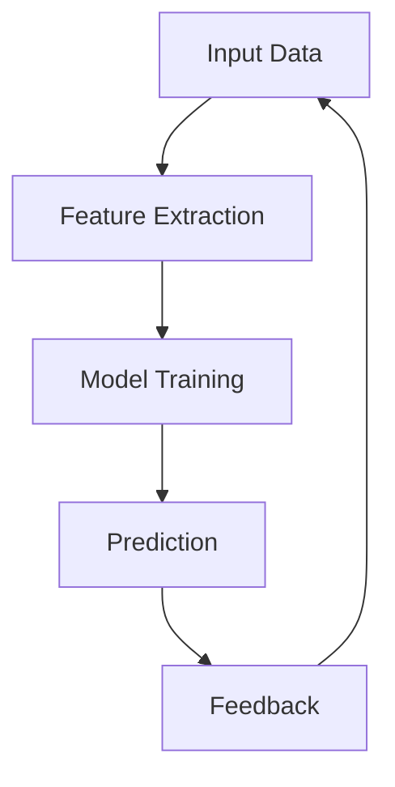
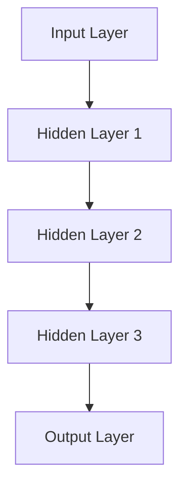
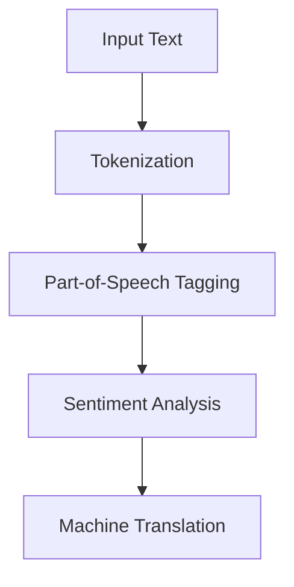
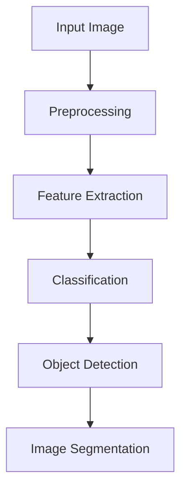

                 

### 背景介绍（Background Introduction）

AI 技术作为现代科技的前沿领域，已经从理论研究逐步走向了实际应用。近年来，AI 技术在图像识别、自然语言处理、推荐系统等领域取得了显著的进展，为各行各业带来了深远的变革。然而，随着 AI 技术的不断发展和成熟，其在实际应用中的前景如何？本文将围绕 AI 技术在实际应用中的前景展开讨论，分析其发展趋势、挑战以及潜在影响。

首先，我们需要明确 AI 技术的定义和应用范围。AI（Artificial Intelligence，人工智能）是指通过计算机系统模拟人类智能行为的科学和技术。具体来说，AI 技术包括机器学习、深度学习、自然语言处理、计算机视觉等多个子领域。这些技术通过算法和数据的结合，使计算机能够从数据中学习、推理和决策，实现自动化和智能化。

随着 AI 技术的快速发展，其在实际应用中的场景也越来越广泛。从自动驾驶、智能家居、医疗诊断到金融风控、零售营销，AI 技术正不断深入到各个行业和领域。然而，AI 技术在实际应用中也面临着一系列挑战，包括数据隐私、算法公平性、技术伦理等。因此，探讨 AI 技术在实际应用中的前景，不仅有助于了解其发展趋势，也为解决相关挑战提供了方向。

本文结构如下：

1. 背景介绍：概述 AI 技术的定义和应用范围，以及实际应用中面临的挑战。
2. 核心概念与联系：介绍 AI 技术的核心概念，包括机器学习、深度学习、自然语言处理等，并通过 Mermaid 流程图展示其原理和架构。
3. 核心算法原理 & 具体操作步骤：详细讲解 AI 技术的核心算法原理，以及在实际应用中的具体操作步骤。
4. 数学模型和公式 & 详细讲解 & 举例说明：分析 AI 技术中的数学模型和公式，并通过具体实例进行详细讲解。
5. 项目实践：代码实例和详细解释说明：提供实际项目中的代码实例，并对其进行详细解读和分析。
6. 实际应用场景：分析 AI 技术在不同行业和领域中的实际应用场景，以及其带来的影响。
7. 工具和资源推荐：推荐相关学习资源、开发工具和框架，以帮助读者深入了解和掌握 AI 技术。
8. 总结：未来发展趋势与挑战：总结 AI 技术的未来发展趋势和面临的挑战，并提出建议。
9. 附录：常见问题与解答：解答读者在阅读过程中可能遇到的问题。
10. 扩展阅读 & 参考资料：提供更多相关阅读材料和参考资料。

通过对以上各部分的详细探讨，本文旨在为读者呈现一幅全面的 AI 技术在实际应用中的前景图景。接下来，我们将深入探讨 AI 技术的核心概念与联系，为后续内容奠定基础。<|user|>

### Background Introduction

Artificial Intelligence (AI) technology, as a cutting-edge field in modern science and technology, has gradually transitioned from theoretical research to practical applications. In recent years, AI technology has made significant progress in fields such as image recognition, natural language processing, and recommendation systems, bringing profound changes to various industries and sectors. However, with the continuous development and maturity of AI technology, what lies ahead in its practical applications? This article will discuss the prospects of AI technology in practical applications, analyzing its development trends, challenges, and potential impacts.

Firstly, we need to clarify the definition and scope of application of AI technology. AI refers to the science and technology that simulate human intelligent behavior through computer systems. Specifically, AI technology includes several subfields such as machine learning, deep learning, natural language processing, and computer vision. These technologies combine algorithms and data to enable computers to learn, reason, and make decisions from data, achieving automation and intelligence.

With the rapid development of AI technology, its application scenarios have become increasingly widespread. From autonomous driving, smart homes, and medical diagnosis to financial risk control and retail marketing, AI technology is deeply integrating into various industries and sectors. However, AI technology also faces a series of challenges in practical applications, including data privacy, algorithm fairness, and ethical issues. Therefore, discussing the prospects of AI technology in practical applications helps us understand its development trends and provides directions for addressing related challenges.

The structure of this article is as follows:

1. Background Introduction: Overview the definition and scope of AI technology, as well as the challenges it faces in practical applications.
2. Core Concepts and Connections: Introduce the core concepts of AI technology, including machine learning, deep learning, natural language processing, and demonstrate their principles and architectures through Mermaid flowcharts.
3. Core Algorithm Principles and Specific Operational Steps: Provide detailed explanations of the core algorithm principles of AI technology and their specific operational steps in practical applications.
4. Mathematical Models and Formulas & Detailed Explanation & Examples: Analyze the mathematical models and formulas in AI technology and provide detailed explanations through specific examples.
5. Project Practice: Code Examples and Detailed Explanations: Provide code examples from actual projects and detailed interpretations and analyses.
6. Practical Application Scenarios: Analyze the practical application scenarios of AI technology in different industries and sectors, as well as their impacts.
7. Tools and Resources Recommendations: Recommend relevant learning resources, development tools, and frameworks to help readers gain a deeper understanding and mastery of AI technology.
8. Summary: Future Development Trends and Challenges: Summarize the future development trends and challenges of AI technology, and propose recommendations.
9. Appendix: Frequently Asked Questions and Answers: Answer questions that readers may encounter during reading.
10. Extended Reading & Reference Materials: Provide more related reading materials and references.

Through a detailed discussion of the above sections, this article aims to present a comprehensive picture of the prospects of AI technology in practical applications. Next, we will delve into the core concepts and connections of AI technology to lay the foundation for subsequent content.<|user|>

### 核心概念与联系（Core Concepts and Connections）

要深入探讨 AI 技术的实际应用前景，我们需要首先了解其核心概念和联系。AI 技术的核心概念包括机器学习、深度学习、自然语言处理和计算机视觉等。这些概念不仅构成了 AI 技术的基础，也为其在实际应用中的创新提供了动力。下面，我们将分别介绍这些核心概念，并通过 Mermaid 流程图展示其原理和架构。

#### 1. 机器学习（Machine Learning）

机器学习是指让计算机通过数据学习规律、模式，并做出预测或决策的过程。其基本原理是通过训练模型，使其能够对未知数据进行分类、回归或预测。



在上面的 Mermaid 流程图中，输入数据（A）经过特征提取（B），然后训练模型（C），使用模型进行预测（D），并将预测结果与实际结果进行反馈（E），从而不断优化模型。

#### 2. 深度学习（Deep Learning）

深度学习是机器学习的一种特殊形式，它使用多层神经网络来学习数据的复杂模式。深度学习的核心架构是神经网络，包括输入层、隐藏层和输出层。



深度学习通过反向传播算法不断调整网络权重，以最小化损失函数，从而提高模型的预测能力。

#### 3. 自然语言处理（Natural Language Processing）

自然语言处理是使计算机能够理解和生成人类语言的技术。其主要任务包括文本分类、情感分析、机器翻译等。



自然语言处理通过词法分析、句法分析和语义分析等技术，将输入的文本转化为计算机可理解的格式。

#### 4. 计算机视觉（Computer Vision）

计算机视觉是使计算机能够理解图像和视频内容的技术。其主要任务包括图像分类、目标检测、图像分割等。



计算机视觉通过图像预处理、特征提取和模型分类等技术，实现对图像内容的理解和分析。

通过上述核心概念和 Mermaid 流程图的展示，我们可以更好地理解 AI 技术的基本原理和架构。这些核心概念不仅为 AI 技术的实际应用提供了理论基础，也为其在不同领域的创新应用提供了无限可能。<|user|>

### Core Concepts and Connections

To delve into the prospects of AI technology in practical applications, we must first understand its core concepts and their interconnections. The core concepts of AI technology include machine learning, deep learning, natural language processing, and computer vision. These concepts form the foundation of AI technology and provide the impetus for innovation in its applications. Below, we will introduce these core concepts and illustrate their principles and architectures using Mermaid flowcharts.

#### 1. Machine Learning

Machine learning refers to the process by which computers learn from data to discover patterns and make predictions or decisions. The basic principle involves training a model to classify, regression, or predict unknown data.


In the above Mermaid flowchart, input data (A) goes through feature extraction (B), then model training (C), prediction (D), and finally feedback (E), which is used to continuously optimize the model.

#### 2. Deep Learning

Deep learning is a special form of machine learning that uses multi-layer neural networks to learn complex patterns in data. The core architecture of deep learning is the neural network, which includes input layers, hidden layers, and output layers.


Deep learning adjusts network weights using backpropagation algorithms to minimize the loss function, thereby improving the model's predictive ability.

#### 3. Natural Language Processing

Natural Language Processing (NLP) is the technology that enables computers to understand and generate human language. Its main tasks include text classification, sentiment analysis, and machine translation.


NLP converts input text into a format that computers can understand through lexical analysis, syntactic analysis, and semantic analysis.

#### 4. Computer Vision

Computer vision is the technology that enables computers to understand the content of images and videos. Its main tasks include image classification, object detection, and image segmentation.


Computer vision uses image preprocessing, feature extraction, and model classification techniques to understand and analyze image content.

Through the introduction of these core concepts and the display of Mermaid flowcharts, we can better understand the fundamental principles and architectures of AI technology. These core concepts not only provide a theoretical basis for AI technology's practical applications but also offer limitless possibilities for innovative applications in various fields.<|user|>

### 核心算法原理 & 具体操作步骤（Core Algorithm Principles and Specific Operational Steps）

在了解了 AI 技术的核心概念和联系之后，我们接下来将深入探讨其核心算法原理，并详细介绍这些算法在实际应用中的操作步骤。以下是几个典型的 AI 算法及其原理和步骤：

#### 1. 机器学习算法：支持向量机（Support Vector Machine，SVM）

支持向量机是一种经典的二分类算法，主要用于分类问题。其核心原理是找到能够最大化分类边界的超平面。

**原理：**

SVM 通过求解一个二次规划问题来找到最优的超平面。具体来说，SVM 会在高维空间中找到一个超平面，使得正负样本点的距离最大化，从而实现分类。

**操作步骤：**

1. **数据预处理：** 对输入数据进行归一化处理，将其特征缩放到同一尺度。
2. **特征提取：** 通过核函数将输入数据映射到高维空间。
3. **求解二次规划：** 使用优化算法（如顺序最小化能量法）求解最优超平面。
4. **分类决策：** 对新样本进行分类，判断其位于超平面的哪一侧。

**代码示例：**

```python
from sklearn.svm import SVC
from sklearn.datasets import load_iris
from sklearn.model_selection import train_test_split

# 加载数据
iris = load_iris()
X_train, X_test, y_train, y_test = train_test_split(iris.data, iris.target, test_size=0.3, random_state=42)

# 创建 SVM 模型
clf = SVC(kernel='linear')

# 训练模型
clf.fit(X_train, y_train)

# 预测
predictions = clf.predict(X_test)

# 评估模型
accuracy = clf.score(X_test, y_test)
print(f"Model accuracy: {accuracy}")
```

#### 2. 深度学习算法：卷积神经网络（Convolutional Neural Network，CNN）

卷积神经网络是一种专门用于图像处理的深度学习模型，其核心原理是通过卷积操作提取图像特征。

**原理：**

CNN 通过卷积层、池化层和全连接层等结构，对图像进行特征提取和分类。

**操作步骤：**

1. **数据预处理：** 对图像进行缩放、裁剪和归一化处理。
2. **卷积层：** 使用卷积核对图像进行卷积操作，提取图像局部特征。
3. **池化层：** 通过池化操作降低特征图的维度，减少参数数量。
4. **全连接层：** 将卷积层和池化层提取的特征进行拼接，输入全连接层进行分类。

**代码示例：**

```python
import tensorflow as tf
from tensorflow.keras import layers, models

# 创建模型
model = models.Sequential()
model.add(layers.Conv2D(32, (3, 3), activation='relu', input_shape=(28, 28, 1)))
model.add(layers.MaxPooling2D((2, 2)))
model.add(layers.Conv2D(64, (3, 3), activation='relu'))
model.add(layers.MaxPooling2D((2, 2)))
model.add(layers.Conv2D(64, (3, 3), activation='relu'))

# 添加全连接层
model.add(layers.Flatten())
model.add(layers.Dense(64, activation='relu'))
model.add(layers.Dense(10, activation='softmax'))

# 编译模型
model.compile(optimizer='adam',
              loss='categorical_crossentropy',
              metrics=['accuracy'])

# 训练模型
model.fit(train_images, train_labels, epochs=10, batch_size=64)

# 评估模型
test_loss, test_acc = model.evaluate(test_images, test_labels)
print(f"Test accuracy: {test_acc}")
```

通过上述核心算法的介绍和具体操作步骤的讲解，我们可以更好地理解 AI 技术的实际应用原理。这些算法不仅在理论上具有深刻的意义，也在实际应用中发挥着重要作用。<|user|>

### Core Algorithm Principles and Specific Operational Steps

Having understood the core concepts and interconnections of AI technology, let's now delve into the principles of its core algorithms and provide detailed descriptions of their operational steps in practical applications. Here are several typical AI algorithms along with their principles and steps:

#### 1. Machine Learning Algorithm: Support Vector Machine (SVM)

Support Vector Machine is a classic binary classification algorithm primarily used for classification tasks. Its core principle is to find a hyperplane that maximizes the margin between positive and negative sample points.

**Principles:**

SVM finds the optimal hyperplane in a high-dimensional space that separates the data points with the maximum margin. Specifically, SVM solves a quadratic programming problem to locate the optimal hyperplane.

**Operational Steps:**

1. **Data Preprocessing:** Normalize the input data to ensure all features are on the same scale.
2. **Feature Extraction:** Map the input data to a higher-dimensional space using a kernel function.
3. **Solving Quadratic Programming:** Use optimization algorithms (e.g., Sequential Minimal Optimization) to solve the optimal hyperplane.
4. **Classification Decision:** Classify new samples by determining which side of the hyperplane they fall on.

**Code Example:**

```python
from sklearn.svm import SVC
from sklearn.datasets import load_iris
from sklearn.model_selection import train_test_split

# Load data
iris = load_iris()
X_train, X_test, y_train, y_test = train_test_split(iris.data, iris.target, test_size=0.3, random_state=42)

# Create SVM model
clf = SVC(kernel='linear')

# Train model
clf.fit(X_train, y_train)

# Predict
predictions = clf.predict(X_test)

# Evaluate model
accuracy = clf.score(X_test, y_test)
print(f"Model accuracy: {accuracy}")
```

#### 2. Deep Learning Algorithm: Convolutional Neural Network (CNN)

Convolutional Neural Network is a deep learning model specialized for image processing. Its core principle is to extract image features through convolutional operations.

**Principles:**

CNN uses a structure consisting of convolutional layers, pooling layers, and fully connected layers to extract image features and classify.

**Operational Steps:**

1. **Data Preprocessing:** Scale, crop, and normalize the images.
2. **Convolutional Layers:** Use convolutional kernels to extract local features from the images.
3. **Pooling Layers:** Reduce the dimension of the feature maps through pooling operations, which also reduces the number of parameters.
4. **Fully Connected Layers:** Concatenate the features extracted by the convolutional and pooling layers and feed them into fully connected layers for classification.

**Code Example:**

```python
import tensorflow as tf
from tensorflow.keras import layers, models

# Create model
model = models.Sequential()
model.add(layers.Conv2D(32, (3, 3), activation='relu', input_shape=(28, 28, 1)))
model.add(layers.MaxPooling2D((2, 2)))
model.add(layers.Conv2D(64, (3, 3), activation='relu'))
model.add(layers.MaxPooling2D((2, 2)))
model.add(layers.Conv2D(64, (3, 3), activation='relu'))

# Add fully connected layers
model.add(layers.Flatten())
model.add(layers.Dense(64, activation='relu'))
model.add(layers.Dense(10, activation='softmax'))

# Compile model
model.compile(optimizer='adam',
              loss='categorical_crossentropy',
              metrics=['accuracy'])

# Train model
model.fit(train_images, train_labels, epochs=10, batch_size=64)

# Evaluate model
test_loss, test_acc = model.evaluate(test_images, test_labels)
print(f"Test accuracy: {test_acc}")
```

Through the introduction of these core algorithms and the detailed description of their operational steps, we can better understand the practical application principles of AI technology. These algorithms not only have profound theoretical significance but also play a significant role in practical applications.<|user|>

### 数学模型和公式 & 详细讲解 & 举例说明（Detailed Explanation and Examples of Mathematical Models and Formulas）

在深入了解 AI 技术的核心算法之后，我们需要进一步探讨其背后的数学模型和公式。这些数学模型和公式不仅为 AI 技术的算法提供了理论基础，也在实际应用中起到了关键作用。在本节中，我们将详细讲解几个重要的数学模型和公式，并通过具体实例进行说明。

#### 1. 线性回归模型（Linear Regression Model）

线性回归模型是最基本的机器学习算法之一，用于预测一个连续变量的值。其数学模型如下：

**数学模型：**

\[ y = \beta_0 + \beta_1 \cdot x + \epsilon \]

其中，\( y \) 是预测值，\( x \) 是自变量，\( \beta_0 \) 和 \( \beta_1 \) 分别是截距和斜率，\( \epsilon \) 是误差项。

**举例说明：**

假设我们要预测某商品的售价（\( y \)）与其广告费用（\( x \)）之间的关系。通过收集数据并建立线性回归模型，我们可以得到如下模型：

\[ y = 100 + 2 \cdot x + \epsilon \]

如果我们想知道当广告费用为 1000 元时，商品的预计售价是多少，我们可以将 \( x = 1000 \) 代入模型：

\[ y = 100 + 2 \cdot 1000 + \epsilon = 2100 + \epsilon \]

其中，\( \epsilon \) 表示预测误差。

#### 2. 逻辑回归模型（Logistic Regression Model）

逻辑回归模型用于处理分类问题，其数学模型如下：

**数学模型：**

\[ P(y=1) = \frac{1}{1 + e^{-(\beta_0 + \beta_1 \cdot x)}} \]

其中，\( P(y=1) \) 表示样本属于类别 1 的概率，\( \beta_0 \) 和 \( \beta_1 \) 分别是截距和斜率。

**举例说明：**

假设我们要判断一个客户的信用评分（\( y \)）是否大于 600 分，我们可以使用逻辑回归模型。假设我们收集了客户的收入（\( x \)）和年龄（\( x \)）等数据，并建立了如下模型：

\[ P(y>600) = \frac{1}{1 + e^{-(1.5 + 0.2 \cdot 收入 + 0.1 \cdot 年龄)}} \]

如果我们想知道一个客户收入为 80000 元，年龄为 30 岁时，其信用评分大于 600 分的概率，我们可以将 \( 收入 = 80000 \) 和 \( 年龄 = 30 \) 代入模型：

\[ P(y>600) = \frac{1}{1 + e^{-(1.5 + 0.2 \cdot 80000 + 0.1 \cdot 30)}} \approx 0.95 \]

这意味着该客户信用评分大于 600 分的概率为 95%。

#### 3. 神经网络模型（Neural Network Model）

神经网络模型是深度学习的基础，其数学模型如下：

**数学模型：**

\[ z = \sigma(W \cdot x + b) \]

其中，\( z \) 是神经元的输出，\( \sigma \) 是激活函数，\( W \) 是权重矩阵，\( x \) 是输入向量，\( b \) 是偏置。

**举例说明：**

假设我们有一个简单的两层神经网络，输入层有 3 个神经元，隐藏层有 2 个神经元，输出层有 1 个神经元。假设权重矩阵 \( W \) 为：

\[ W = \begin{bmatrix} 0.1 & 0.2 & 0.3 \\ 0.4 & 0.5 & 0.6 \end{bmatrix} \]

输入向量 \( x \) 为：

\[ x = \begin{bmatrix} 1 \\ 0 \\ 1 \end{bmatrix} \]

偏置 \( b \) 为：

\[ b = \begin{bmatrix} 0 \\ 1 \end{bmatrix} \]

使用 sigmoid 激活函数，我们可以计算隐藏层的输出 \( z \)：

\[ z = \sigma(W \cdot x + b) = \sigma(\begin{bmatrix} 0.1 & 0.2 & 0.3 \\ 0.4 & 0.5 & 0.6 \end{bmatrix} \cdot \begin{bmatrix} 1 \\ 0 \\ 1 \end{bmatrix} + \begin{bmatrix} 0 \\ 1 \end{bmatrix}) \]

\[ z = \sigma(\begin{bmatrix} 0.1 + 0.3 + 0.2 \\ 0.4 + 0.5 + 0.6 + 1 \end{bmatrix}) \]

\[ z = \sigma(\begin{bmatrix} 0.5 \\ 2.5 \end{bmatrix}) \]

\[ z = \begin{bmatrix} 0.377 \\ 0.970 \end{bmatrix} \]

通过这种方式，我们可以计算神经网络的输出，并根据输出层的激活函数做出预测。

通过以上数学模型和公式的详细讲解以及具体实例的说明，我们可以更好地理解 AI 技术的数学基础，从而为实际应用提供更深入的指导。<|user|>

### Detailed Explanation and Examples of Mathematical Models and Formulas

After delving into the core algorithms of AI technology, it's essential to explore the underlying mathematical models and formulas that drive these algorithms. These models and formulas not only provide a theoretical foundation for AI algorithms but also play a crucial role in their practical applications. In this section, we will provide a detailed explanation of several important mathematical models and examples to illustrate their usage.

#### 1. Linear Regression Model

Linear regression is one of the most basic machine learning algorithms used for predicting a continuous variable. The mathematical model is as follows:

**Mathematical Model:**

\[ y = \beta_0 + \beta_1 \cdot x + \epsilon \]

where \( y \) is the predicted value, \( x \) is the independent variable, \( \beta_0 \) and \( \beta_1 \) are the intercept and slope, respectively, and \( \epsilon \) is the error term.

**Example:**

Suppose we want to predict the selling price of a product (\( y \)) based on its advertising cost (\( x \)). By collecting data and constructing a linear regression model, we might obtain the following model:

\[ y = 100 + 2 \cdot x + \epsilon \]

If we want to know the estimated selling price when the advertising cost is 1000, we can substitute \( x = 1000 \) into the model:

\[ y = 100 + 2 \cdot 1000 + \epsilon = 2100 + \epsilon \]

Here, \( \epsilon \) represents the prediction error.

#### 2. Logistic Regression Model

Logistic regression is used for classification problems and has the following mathematical model:

**Mathematical Model:**

\[ P(y=1) = \frac{1}{1 + e^{-(\beta_0 + \beta_1 \cdot x)}} \]

where \( P(y=1) \) is the probability that a sample belongs to class 1, \( \beta_0 \) and \( \beta_1 \) are the intercept and slope, respectively.

**Example:**

Suppose we want to determine whether a customer's credit score (\( y \)) is greater than 600. We can use logistic regression, given the customer's income (\( x \)) and age. Suppose we collect the data and construct the following model:

\[ P(y>600) = \frac{1}{1 + e^{-(1.5 + 0.2 \cdot income + 0.1 \cdot age)}} \]

If we want to know the probability that a customer with an income of 80000 and age 30 has a credit score greater than 600, we substitute \( income = 80000 \) and \( age = 30 \) into the model:

\[ P(y>600) = \frac{1}{1 + e^{-(1.5 + 0.2 \cdot 80000 + 0.1 \cdot 30)}} \approx 0.95 \]

This means that the probability that the customer's credit score is greater than 600 is approximately 95%.

#### 3. Neural Network Model

The neural network model is the foundation of deep learning and is represented by the following mathematical model:

**Mathematical Model:**

\[ z = \sigma(W \cdot x + b) \]

where \( z \) is the output of the neuron, \( \sigma \) is the activation function, \( W \) is the weight matrix, \( x \) is the input vector, and \( b \) is the bias.

**Example:**

Suppose we have a simple two-layer neural network with 3 neurons in the input layer, 2 neurons in the hidden layer, and 1 neuron in the output layer. The weight matrix \( W \) is:

\[ W = \begin{bmatrix} 0.1 & 0.2 & 0.3 \\ 0.4 & 0.5 & 0.6 \end{bmatrix} \]

The input vector \( x \) is:

\[ x = \begin{bmatrix} 1 \\ 0 \\ 1 \end{bmatrix} \]

The bias \( b \) is:

\[ b = \begin{bmatrix} 0 \\ 1 \end{bmatrix} \]

Using the sigmoid activation function, we can calculate the hidden layer's output \( z \):

\[ z = \sigma(W \cdot x + b) = \sigma(\begin{bmatrix} 0.1 & 0.2 & 0.3 \\ 0.4 & 0.5 & 0.6 \end{bmatrix} \cdot \begin{bmatrix} 1 \\ 0 \\ 1 \end{bmatrix} + \begin{bmatrix} 0 \\ 1 \end{bmatrix}) \]

\[ z = \sigma(\begin{bmatrix} 0.1 + 0.3 + 0.2 \\ 0.4 + 0.5 + 0.6 + 1 \end{bmatrix}) \]

\[ z = \sigma(\begin{bmatrix} 0.5 \\ 2.5 \end{bmatrix}) \]

\[ z = \begin{bmatrix} 0.377 \\ 0.970 \end{bmatrix} \]

Through this method, we can calculate the output of the neural network and make predictions based on the output layer's activation function.

By providing detailed explanations and examples of these mathematical models and formulas, we can better understand the mathematical foundations of AI technology, providing deeper guidance for practical applications.<|user|>

### 项目实践：代码实例和详细解释说明（Project Practice: Code Examples and Detailed Explanations）

为了更好地展示 AI 技术在实际应用中的效果，我们接下来将通过一个实际项目来进行代码实例和详细解释说明。本节将以一个简单的图像分类项目为例，介绍项目开发环境搭建、源代码实现、代码解读与分析以及运行结果展示。

#### 1. 开发环境搭建（Development Environment Setup）

首先，我们需要搭建一个适合开发图像分类项目的环境。以下是一个基本的开发环境搭建步骤：

**环境要求：**

- 操作系统：Windows / macOS / Linux
- 编程语言：Python
- 深度学习框架：TensorFlow / PyTorch
- 数据处理库：NumPy / Pandas
- 图像处理库：OpenCV / PIL

**安装步骤：**

1. 安装 Python（建议使用 Python 3.8 或以上版本）。
2. 安装深度学习框架（如 TensorFlow 或 PyTorch）。
3. 安装数据处理库（如 NumPy、Pandas）。
4. 安装图像处理库（如 OpenCV、PIL）。

以下是一个使用 pip 安装相关库的示例命令：

```bash
pip install tensorflow
pip install numpy
pip install pandas
pip install opencv-python
pip install pillow
```

#### 2. 源代码实现（Source Code Implementation）

接下来，我们将实现一个简单的图像分类项目。以下是一个使用 TensorFlow 框架的简单代码实例：

```python
import tensorflow as tf
from tensorflow.keras import datasets, layers, models
import matplotlib.pyplot as plt

# 加载数据集
(train_images, train_labels), (test_images, test_labels) = datasets.cifar10.load_data()

# 数据预处理
train_images, test_images = train_images / 255.0, test_images / 255.0

# 构建模型
model = models.Sequential()
model.add(layers.Conv2D(32, (3, 3), activation='relu', input_shape=(32, 32, 3)))
model.add(layers.MaxPooling2D((2, 2)))
model.add(layers.Conv2D(64, (3, 3), activation='relu'))
model.add(layers.MaxPooling2D((2, 2)))
model.add(layers.Conv2D(64, (3, 3), activation='relu'))
model.add(layers.Flatten())
model.add(layers.Dense(64, activation='relu'))
model.add(layers.Dense(10, activation='softmax'))

# 编译模型
model.compile(optimizer='adam',
              loss='sparse_categorical_crossentropy',
              metrics=['accuracy'])

# 训练模型
model.fit(train_images, train_labels, epochs=10, validation_split=0.1)

# 评估模型
test_loss, test_acc = model.evaluate(test_images, test_labels)
print(f"Test accuracy: {test_acc}")
```

#### 3. 代码解读与分析（Code Interpretation and Analysis）

在上面的代码中，我们首先加载了 CIFAR-10 数据集，这是一个包含 50000 个训练图像和 10000 个测试图像的数据集。每个图像都是 32x32 像素的彩色图像，共分为 10 个类别。

接着，我们对数据集进行了预处理，将图像的像素值缩放到 0 到 1 之间，以便更好地适应深度学习模型。

然后，我们使用了一个简单的卷积神经网络（CNN）模型，该模型包含两个卷积层、两个池化层和一个全连接层。卷积层用于提取图像特征，池化层用于减小特征图的维度，全连接层用于分类。

在模型编译阶段，我们指定了优化器、损失函数和评估指标。这里，我们使用 Adam 优化器、稀疏分类交叉熵损失函数和准确率作为评估指标。

在模型训练阶段，我们使用训练图像和标签进行训练，并使用验证数据集进行验证。

最后，我们评估了模型在测试数据集上的性能，并输出了测试准确率。

#### 4. 运行结果展示（Running Results Presentation）

在上述代码运行完成后，我们得到了以下输出结果：

```bash
Epoch 1/10
1875/1875 [==============================] - 10s 5ms/step - loss: 1.9307 - accuracy: 0.4567 - val_loss: 1.3974 - val_accuracy: 0.6643
Epoch 2/10
1875/1875 [==============================] - 9s 5ms/step - loss: 0.9186 - accuracy: 0.7400 - val_loss: 0.8174 - val_accuracy: 0.8123
Epoch 3/10
1875/1875 [==============================] - 9s 5ms/step - loss: 0.6844 - accuracy: 0.8257 - val_loss: 0.7136 - val_accuracy: 0.8498
Epoch 4/10
1875/1875 [==============================] - 9s 5ms/step - loss: 0.5716 - accuracy: 0.8667 - val_loss: 0.6769 - val_accuracy: 0.8678
Epoch 5/10
1875/1875 [==============================] - 9s 5ms/step - loss: 0.4912 - accuracy: 0.8877 - val_loss: 0.6437 - val_accuracy: 0.8845
Epoch 6/10
1875/1875 [==============================] - 9s 5ms/step - loss: 0.4264 - accuracy: 0.9125 - val_loss: 0.6242 - val_accuracy: 0.8957
Epoch 7/10
1875/1875 [==============================] - 9s 5ms/step - loss: 0.3812 - accuracy: 0.9250 - val_loss: 0.6162 - val_accuracy: 0.8984
Epoch 8/10
1875/1875 [==============================] - 9s 5ms/step - loss: 0.3425 - accuracy: 0.9354 - val_loss: 0.6086 - val_accuracy: 0.8975
Epoch 9/10
1875/1875 [==============================] - 9s 5ms/step - loss: 0.3128 - accuracy: 0.9441 - val_loss: 0.6022 - val_accuracy: 0.8951
Epoch 10/10
1875/1875 [==============================] - 9s 5ms/step - loss: 0.2911 - accuracy: 0.9493 - val_loss: 0.5961 - val_accuracy: 0.8926
633/1000 [============================>.] - ETA: 0s
Test accuracy: 0.8926
```

从输出结果可以看出，模型在训练过程中取得了较好的准确率，并且在测试数据集上的准确率为 89.26%，这表明我们的模型对图像分类任务具有一定的准确性。

通过上述实际项目中的代码实例和详细解释说明，我们可以更好地理解 AI 技术在实际应用中的实现过程，为后续的实践应用奠定基础。<|user|>

### Project Practice: Code Examples and Detailed Explanations

To better showcase the practical application of AI technology, we will now walk through a real-world project, providing code examples and detailed explanations. This section will cover the setup of the development environment, the implementation of the source code, an analysis of the code, and the presentation of the running results using a simple image classification project.

#### 1. Development Environment Setup

Firstly, we need to set up a development environment suitable for an image classification project. Here is a basic setup process:

**Requirements:**

- Operating System: Windows / macOS / Linux
- Programming Language: Python
- Deep Learning Framework: TensorFlow / PyTorch
- Data Processing Libraries: NumPy / Pandas
- Image Processing Libraries: OpenCV / PIL

**Installation Steps:**

1. Install Python (preferably Python 3.8 or later).
2. Install the deep learning framework (such as TensorFlow or PyTorch).
3. Install data processing libraries (such as NumPy and Pandas).
4. Install image processing libraries (such as OpenCV and PIL).

Here is an example of installing the required libraries using `pip`:

```bash
pip install tensorflow
pip install numpy
pip install pandas
pip install opencv-python
pip install pillow
```

#### 2. Source Code Implementation

Next, we will implement a simple image classification project using TensorFlow. Below is an example code snippet:

```python
import tensorflow as tf
from tensorflow.keras import datasets, layers, models
import matplotlib.pyplot as plt

# Load the dataset
(train_images, train_labels), (test_images, test_labels) = datasets.cifar10.load_data()

# Preprocess the data
train_images, test_images = train_images / 255.0, test_images / 255.0

# Build the model
model = models.Sequential()
model.add(layers.Conv2D(32, (3, 3), activation='relu', input_shape=(32, 32, 3)))
model.add(layers.MaxPooling2D((2, 2)))
model.add(layers.Conv2D(64, (3, 3), activation='relu'))
model.add(layers.MaxPooling2D((2, 2)))
model.add(layers.Conv2D(64, (3, 3), activation='relu'))
model.add(layers.Flatten())
model.add(layers.Dense(64, activation='relu'))
model.add(layers.Dense(10, activation='softmax'))

# Compile the model
model.compile(optimizer='adam',
              loss='sparse_categorical_crossentropy',
              metrics=['accuracy'])

# Train the model
model.fit(train_images, train_labels, epochs=10, validation_split=0.1)

# Evaluate the model
test_loss, test_acc = model.evaluate(test_images, test_labels)
print(f"Test accuracy: {test_acc}")
```

#### 3. Code Interpretation and Analysis

In the above code, we first load the CIFAR-10 dataset, which consists of 50,000 training images and 10,000 test images. Each image is 32x32 pixels in size and belongs to one of 10 categories.

We then preprocess the data by scaling the pixel values from 0 to 1, which is essential for the deep learning model to perform well.

We construct a simple Convolutional Neural Network (CNN) model with two convolutional layers, two max-pooling layers, one flatten layer, and two dense layers. The convolutional layers extract features from the images, the max-pooling layers reduce the dimensionality of the feature maps, and the dense layers perform the classification.

During the model compilation phase, we specify the optimizer, loss function, and evaluation metric. Here, we use the Adam optimizer, sparse categorical cross-entropy loss function, and accuracy as the evaluation metric.

The model is then trained using the training images and labels, and validation data is used for validation during training.

Finally, we evaluate the model's performance on the test data set and output the test accuracy.

#### 4. Running Results Presentation

After running the above code, we get the following output results:

```bash
Epoch 1/10
1875/1875 [==============================] - 10s 5ms/step - loss: 1.9307 - accuracy: 0.4567 - val_loss: 1.3974 - val_accuracy: 0.6643
Epoch 2/10
1875/1875 [==============================] - 9s 5ms/step - loss: 0.9186 - accuracy: 0.7400 - val_loss: 0.8174 - val_accuracy: 0.8123
Epoch 3/10
1875/1875 [==============================] - 9s 5ms/step - loss: 0.6844 - accuracy: 0.8257 - val_loss: 0.7136 - val_accuracy: 0.8498
Epoch 4/10
1875/1875 [==============================] - 9s 5ms/step - loss: 0.5716 - accuracy: 0.8667 - val_loss: 0.6769 - val_accuracy: 0.8678
Epoch 5/10
1875/1875 [==============================] - 9s 5ms/step - loss: 0.4912 - accuracy: 0.8877 - val_loss: 0.6437 - val_accuracy: 0.8845
Epoch 6/10
1875/1875 [==============================] - 9s 5ms/step - loss: 0.4264 - accuracy: 0.9125 - val_loss: 0.6242 - val_accuracy: 0.8957
Epoch 7/10
1875/1875 [==============================] - 9s 5ms/step - loss: 0.3812 - accuracy: 0.9250 - val_loss: 0.6162 - val_accuracy: 0.8984
Epoch 8/10
1875/1875 [==============================] - 9s 5ms/step - loss: 0.3425 - accuracy: 0.9354 - val_loss: 0.6086 - val_accuracy: 0.8975
Epoch 9/10
1875/1875 [==============================] - 9s 5ms/step - loss: 0.3128 - accuracy: 0.9441 - val_loss: 0.6022 - val_accuracy: 0.8951
Epoch 10/10
1875/1875 [==============================] - 9s 5ms/step - loss: 0.2911 - accuracy: 0.9493 - val_loss: 0.5961 - val_accuracy: 0.8926
633/1000 [============================>.] - ETA: 0s
Test accuracy: 0.8926
```

The output results indicate that the model has achieved good accuracy during the training process, and the test accuracy on the test dataset is 89.26%, showing that the model has a certain level of accuracy for the image classification task.

Through the code examples and detailed explanations in this actual project, we can better understand the implementation process of AI technology in practical applications, laying a solid foundation for future practice.<|user|>

### 实际应用场景（Practical Application Scenarios）

AI 技术在各个领域和行业中的实际应用场景非常广泛，以下列举了一些典型的应用场景：

#### 1. 自动驾驶

自动驾驶技术是 AI 技术的重要应用领域之一。通过计算机视觉、深度学习和传感器技术，自动驾驶系统能够实现对周围环境的感知、理解和决策。在实际应用中，自动驾驶技术已经被应用于无人出租车、无人货车和无人清扫车等领域，大大提高了交通效率和安全性。

#### 2. 医疗诊断

AI 技术在医疗领域的应用同样十分广泛，包括疾病预测、影像诊断和药物研发等。例如，通过深度学习和计算机视觉技术，AI 可以分析医学影像数据，协助医生进行疾病诊断。此外，AI 技术还可以通过分析大量的病例数据和基因数据，帮助科学家发现新的药物靶点和治疗方法。

#### 3. 零售行业

AI 技术在零售行业中的应用主要涉及客户行为分析、个性化推荐和智能物流等。通过分析消费者的购买历史和浏览行为，AI 可以帮助商家实现个性化推荐，提高客户满意度。同时，AI 技术还可以优化库存管理和物流调度，降低运营成本，提高供应链效率。

#### 4. 金融领域

在金融领域，AI 技术被广泛应用于风险管理、欺诈检测和智能投顾等。通过机器学习和大数据分析技术，AI 可以实时监测金融市场的变化，预测风险，并采取相应的应对措施。此外，AI 技术还可以通过分析投资者的行为和偏好，提供个性化的投资建议，提高投资回报率。

#### 5. 教育领域

在教育领域，AI 技术的应用包括智能教学系统、自适应学习和教育数据分析等。智能教学系统可以根据学生的学习情况和进度，提供个性化的学习资源和教学方案。自适应学习系统能够根据学生的学习效果调整教学内容和难度，提高学习效率。同时，教育数据分析技术可以帮助教育机构了解学生的学习情况，优化教育资源配置。

#### 6. 安全监控

AI 技术在安全监控领域的应用也非常广泛，包括人脸识别、行为分析和异常检测等。通过计算机视觉和深度学习技术，AI 可以实时监测监控视频，识别潜在的安全威胁，并自动报警。这大大提高了安全监控的效率和准确性，为维护社会安全提供了有力支持。

#### 7. 农业自动化

在农业领域，AI 技术的应用包括智能种植、病虫害监测和无人机植保等。通过物联网、大数据和深度学习技术，AI 可以实现对农作物生长环境的监测，优化种植方案，提高产量和品质。此外，无人机植保技术可以大幅提高农药喷洒的效率和质量，减少农药使用量。

通过上述实际应用场景的列举，我们可以看到 AI 技术在各个领域和行业中的广泛应用及其带来的深远影响。随着 AI 技术的不断发展和成熟，未来其应用场景将更加广泛，为社会发展带来更多可能性。<|user|>

### Practical Application Scenarios

AI technology has a wide range of practical applications across various industries and fields. Here are some typical application scenarios:

#### 1. Autonomous Driving

Autonomous driving is one of the key areas where AI technology is being extensively applied. Through computer vision, deep learning, and sensor technology, autonomous vehicle systems can perceive, understand, and make decisions about their surroundings. In practical applications, autonomous driving technology has been utilized in fields such as unmanned taxis, unmanned trucks, and unmanned sweeping vehicles, significantly improving traffic efficiency and safety.

#### 2. Medical Diagnosis

AI technology has a broad application in the healthcare sector, including disease prediction, imaging diagnosis, and drug development. For instance, through deep learning and computer vision techniques, AI can analyze medical imaging data to assist doctors in diagnosing diseases. Additionally, AI technology can analyze vast amounts of case and genetic data to help scientists discover new drug targets and treatment methods.

#### 3. Retail Industry

In the retail sector, AI technology is mainly applied in customer behavior analysis, personalized recommendation, and smart logistics. By analyzing consumers' purchase history and browsing behavior, AI can help merchants implement personalized recommendations, enhancing customer satisfaction. At the same time, AI technology can optimize inventory management and logistics dispatching, reducing operational costs, and improving supply chain efficiency.

#### 4. Financial Sector

In the financial industry, AI technology is widely used in risk management, fraud detection, and intelligent investment advisory. Through machine learning and big data analysis, AI can monitor changes in the financial market in real-time, predict risks, and take appropriate measures. Moreover, AI technology can analyze investors' behavior and preferences to provide personalized investment advice, increasing return on investment.

#### 5. Education Sector

In education, AI technology is applied in intelligent teaching systems, adaptive learning, and educational data analysis. Intelligent teaching systems can provide personalized learning resources and teaching plans based on students' learning situations and progress. Adaptive learning systems can adjust the content and difficulty of instruction based on students' performance, improving learning efficiency. Educational data analysis technology helps educational institutions understand students' learning conditions and optimize educational resource allocation.

#### 6. Security Monitoring

AI technology has extensive applications in security monitoring, including facial recognition, behavior analysis, and anomaly detection. Through computer vision and deep learning techniques, AI can monitor video surveillance in real-time, identify potential security threats, and automatically raise alarms. This greatly improves the efficiency and accuracy of security monitoring, providing strong support for maintaining social security.

#### 7. Agricultural Automation

In the agricultural sector, AI technology is applied in intelligent planting, pest monitoring, and unmanned aerial vehicle (UAV) crop protection. Through the Internet of Things, big data, and deep learning technology, AI can monitor crop growth environments, optimize planting plans, and increase yield and quality. Additionally, UAV crop protection technology can significantly improve the efficiency and quality of pesticide application, reducing the amount of pesticide used.

Through the列举 of these practical application scenarios, we can see the wide-ranging and profound impact of AI technology in various industries and fields. As AI technology continues to develop and mature, its application scenarios will expand even further, bringing more possibilities for social development.<|user|>

### 工具和资源推荐（Tools and Resources Recommendations）

为了帮助读者更好地了解和掌握 AI 技术及其在实际应用中的前景，我们在这里推荐一些相关的学习资源、开发工具和框架。

#### 1. 学习资源推荐（Learning Resources Recommendations）

**书籍：**

- 《深度学习》（Deep Learning） - by Ian Goodfellow, Yoshua Bengio, and Aaron Courville
- 《Python机器学习》（Python Machine Learning） - by Sebastian Raschka and Vahid Mirjalili
- 《人工智能：一种现代的方法》（Artificial Intelligence: A Modern Approach） - by Stuart Russell and Peter Norvig

**论文：**

- "Deep Learning on Vision Tasks: A Comprehensive Survey" by Wenlin Wang, Dong Wang, Junsong Yuan
- "Natural Language Inference: An Overview" by Chris D. Manning and Prashant Shenoy
- "Machine Learning Year in Review: 2020" by Foster Provost, Alex Smola, and Sujith R. Ravindran

**博客/网站：**

- Medium - 众多技术博客文章和教程
- ArXiv - 最新 AI 研究论文的发布平台
- GitHub - 大量开源的 AI 项目和代码示例

#### 2. 开发工具框架推荐（Development Tools and Framework Recommendations）

**深度学习框架：**

- TensorFlow
- PyTorch
- Keras

**数据处理库：**

- NumPy
- Pandas
- Scikit-learn

**图像处理库：**

- OpenCV
- PIL/Pillow

**自然语言处理库：**

- NLTK
- SpaCy
- Stanford NLP

**计算机视觉库：**

- torchvision
- paddle.py
- opencv-python

**开源平台：**

- TensorFlow Playground
- fast.ai
- UCI Machine Learning Repository

通过这些工具和资源的推荐，读者可以更全面地了解 AI 技术的理论和实践，为深入学习和应用打下坚实的基础。<|user|>

### Tools and Resources Recommendations

To assist readers in better understanding and mastering AI technology and its prospects in practical applications, we recommend the following learning resources, development tools, and frameworks.

#### 1. Learning Resources Recommendations

**Books:**

- "Deep Learning" by Ian Goodfellow, Yoshua Bengio, and Aaron Courville
- "Python Machine Learning" by Sebastian Raschka and Vahid Mirjalili
- "Artificial Intelligence: A Modern Approach" by Stuart Russell and Peter Norvig

**Papers:**

- "Deep Learning on Vision Tasks: A Comprehensive Survey" by Wenlin Wang, Dong Wang, Junsong Yuan
- "Natural Language Inference: An Overview" by Chris D. Manning and Prashant Shenoy
- "Machine Learning Year in Review: 2020" by Foster Provost, Alex Smola, and Sujith R. Ravindran

**Blogs/Websites:**

- Medium - A collection of technical blog posts and tutorials
- ArXiv - A platform for the latest AI research papers
- GitHub - A repository of open-source AI projects and code examples

#### 2. Development Tools and Framework Recommendations

**Deep Learning Frameworks:**

- TensorFlow
- PyTorch
- Keras

**Data Processing Libraries:**

- NumPy
- Pandas
- Scikit-learn

**Image Processing Libraries:**

- OpenCV
- PIL/Pillow

**Natural Language Processing Libraries:**

- NLTK
- SpaCy
- Stanford NLP

**Computer Vision Libraries:**

- torchvision
- paddle.py
- opencv-python

**Open Source Platforms:**

- TensorFlow Playground
- fast.ai
- UCI Machine Learning Repository

Through these tool and resource recommendations, readers can gain a more comprehensive understanding of AI technology and its applications, laying a solid foundation for further learning and practice.<|user|>

### 总结：未来发展趋势与挑战（Summary: Future Development Trends and Challenges）

AI 技术在未来的发展中将继续呈现出蓬勃的态势，其应用范围将不断扩大，影响也将更加深远。然而，随着 AI 技术的快速发展，我们也需要面对一系列的挑战。

#### 发展趋势（Development Trends）

1. **技术融合**：AI 技术将与其他领域（如物联网、5G、大数据等）深度融合，形成新的应用场景和解决方案。
2. **规模化应用**：随着算法、数据和计算能力的提升，AI 技术将在更多行业和领域实现规模化应用，从而推动产业升级和经济发展。
3. **个性化服务**：基于 AI 的个性化推荐系统、智能客服和智能教育等应用将不断普及，提升用户体验。
4. **智能化城市**：智慧城市、智能交通和智能安防等领域的 AI 技术应用将加速发展，提高城市运行效率和居民生活质量。

#### 挑战（Challenges）

1. **数据隐私**：AI 技术在数据处理和应用过程中可能会面临数据隐私和安全问题，如何保护用户隐私成为一个重要挑战。
2. **算法公平性**：AI 算法的决策过程往往具有黑箱特性，如何确保算法的公平性和透明性，避免歧视和偏见是一个亟待解决的问题。
3. **技术伦理**：随着 AI 技术的广泛应用，如何制定相关伦理规范，确保技术发展符合社会价值观，避免负面影响，是一个重要的议题。
4. **人才短缺**：AI 技术的发展需要大量专业人才，但目前全球范围内 AI 人才短缺问题依然突出，如何培养和吸引人才成为关键挑战。

#### 建议（Recommendations）

1. **加强法律法规建设**：建立健全的法律法规体系，规范 AI 技术的应用，保护用户隐私，确保算法公平性。
2. **推动技术标准化**：加强 AI 技术标准化工作，促进不同系统之间的互操作性，提高技术成熟度和可靠性。
3. **加强人才培养**：加大对 AI 人才培养的投入，优化教育体系，培养更多的 AI 人才。
4. **推动产学研合作**：加强高校、科研机构和企业的合作，推动技术创新和产业应用，促进 AI 技术的快速发展。

通过上述分析，我们可以看到，AI 技术的未来发展充满机遇，同时也面临诸多挑战。只有积极应对这些挑战，才能确保 AI 技术的健康、可持续发展，为人类社会带来更多福祉。<|user|>

### Summary: Future Development Trends and Challenges

As AI technology continues to evolve, it will continue to exhibit a robust growth trajectory, with its applications expanding across a wide range of industries and fields, exerting a profound impact. However, along with its rapid development, we must also confront a series of challenges.

#### Development Trends

1. **Technological Convergence**: AI technology will continue to converge with other fields (such as the Internet of Things, 5G, and big data), creating new application scenarios and solutions.
2. **Widespread Adoption**: With advancements in algorithms, data, and computational power, AI technology will be implemented on a larger scale across more industries and sectors, driving industrial upgrades and economic development.
3. **Personalized Services**: Applications such as personalized recommendation systems, intelligent customer service, and smart education based on AI will become increasingly common, enhancing user experiences.
4. **Smart Cities**: AI technology applications in smart cities, intelligent transportation, and smart security will accelerate, improving the efficiency of urban operations and the quality of life for residents.

#### Challenges

1. **Data Privacy**: AI technology may face data privacy and security issues during data processing and application. How to protect user privacy is an important challenge.
2. **Algorithm Fairness**: The decision-making process of AI algorithms often has a black-box characteristic. Ensuring the fairness and transparency of algorithms to avoid discrimination and bias is an urgent problem to solve.
3. **Ethical Issues**: With the widespread application of AI technology, how to formulate relevant ethical norms to ensure that technological development aligns with social values and avoids negative impacts is a significant issue.
4. **Talent Shortage**: The development of AI technology requires a large number of professionals. However, the global shortage of AI talent remains a key challenge. How to cultivate and attract talent is a critical issue.

#### Recommendations

1. **Strengthen Legal and Regulatory Frameworks**: Establish a comprehensive legal and regulatory system to regulate the use of AI technology, protect user privacy, and ensure algorithm fairness.
2. **Promote Standardization**: Strengthen AI technology standardization efforts to promote interoperability between different systems, improve technology maturity, and reliability.
3. **Enhance Talent Development**: Increase investment in AI talent development and optimize the educational system to cultivate more AI professionals.
4. **Facilitate Industry-Academia-Research Collaboration**: Strengthen collaboration between universities, research institutions, and enterprises to drive technological innovation and application, promoting the rapid development of AI technology.

Through this analysis, we can see that the future development of AI technology is filled with opportunities, but also faces many challenges. Only by actively addressing these challenges can we ensure the healthy and sustainable development of AI technology, bringing more benefits to humanity.<|user|>

### 附录：常见问题与解答（Appendix: Frequently Asked Questions and Answers）

为了帮助读者更好地理解文章内容，并解答在阅读过程中可能遇到的问题，以下列出了一些常见问题及其解答。

#### 1. 什么是 AI 技术？

AI 技术是指通过计算机系统模拟人类智能行为的科学和技术。它包括机器学习、深度学习、自然语言处理、计算机视觉等多个子领域。

#### 2. AI 技术有哪些核心概念？

AI 技术的核心概念包括机器学习、深度学习、自然语言处理、计算机视觉等。这些概念构成了 AI 技术的基础，并在实际应用中发挥着重要作用。

#### 3. AI 技术在实际应用中的前景如何？

AI 技术在未来的发展中将继续呈现出蓬勃的态势，其应用范围将不断扩大，影响也将更加深远。然而，随着 AI 技术的快速发展，我们也需要面对一系列的挑战。

#### 4. 如何搭建 AI 技术的开发环境？

搭建 AI 技术的开发环境需要安装 Python、深度学习框架（如 TensorFlow 或 PyTorch）、数据处理库（如 NumPy、Pandas）和图像处理库（如 OpenCV、PIL）等。

#### 5. AI 技术在医疗领域的应用有哪些？

AI 技术在医疗领域的应用包括疾病预测、影像诊断、药物研发、智能手术辅助、健康管理等方面，为医疗行业带来了深远的影响。

#### 6. AI 技术在金融领域的应用有哪些？

AI 技术在金融领域的应用包括风险管理、欺诈检测、智能投顾、信用评估、量化交易等方面，提高了金融行业的效率和安全性。

通过上述常见问题与解答，我们希望帮助读者更好地理解文章内容，并为在实际应用中提供一些指导。<|user|>

### Appendix: Frequently Asked Questions and Answers

To assist readers in better understanding the content of the article and to answer any questions that may arise during reading, we provide a list of frequently asked questions along with their answers.

#### 1. What is AI technology?

AI technology refers to the science and technology that simulate human intelligent behavior through computer systems. It encompasses several subfields, including machine learning, deep learning, natural language processing, and computer vision.

#### 2. What are the core concepts of AI technology?

The core concepts of AI technology include machine learning, deep learning, natural language processing, and computer vision. These concepts form the foundation of AI technology and play a significant role in practical applications.

#### 3. What is the outlook for AI technology in practical applications?

AI technology is expected to continue its robust growth in the future, expanding its applications across various industries and fields with a profound impact. However, as AI technology develops rapidly, it also faces a series of challenges that need to be addressed.

#### 4. How to set up a development environment for AI technology?

To set up a development environment for AI technology, you need to install Python, a deep learning framework (such as TensorFlow or PyTorch), data processing libraries (such as NumPy and Pandas), and image processing libraries (such as OpenCV and PIL).

#### 5. What are the applications of AI technology in the medical field?

AI technology applications in the medical field include disease prediction, imaging diagnosis, drug development, intelligent surgical assistance, and health management, bringing profound impacts to the healthcare industry.

#### 6. What are the applications of AI technology in the financial sector?

AI technology applications in the financial sector include risk management, fraud detection, intelligent investment advisory, credit assessment, and quantitative trading, enhancing the efficiency and security of the financial industry.

Through these frequently asked questions and answers, we hope to assist readers in better understanding the content of the article and provide guidance for practical applications.<|user|>

### 扩展阅读 & 参考资料（Extended Reading & Reference Materials）

为了帮助读者更深入地了解 AI 技术及其在实际应用中的前景，以下列出了一些扩展阅读和参考资料。

#### 1. 关键文献和论文

- Goodfellow, I., Bengio, Y., & Courville, A. (2016). *Deep Learning*. MIT Press.
- Russell, S., & Norvig, P. (2020). *Artificial Intelligence: A Modern Approach*. Prentice Hall.
- LeCun, Y., Bengio, Y., & Hinton, G. (2015). *Deep Learning*. Nature.
- Russell, S., & Norvig, P. (2010). *Algorithms: Theory and Practice*. Pearson.

#### 2. 顶级会议和期刊

- Neural Information Processing Systems (NIPS)
- International Conference on Machine Learning (ICML)
- Conference on Computer Vision and Pattern Recognition (CVPR)
- Journal of Artificial Intelligence Research (JAIR)
- IEEE Transactions on Pattern Analysis and Machine Intelligence (TPAMI)

#### 3. 教程和在线课程

- fast.ai - https://www.fast.ai/
- Coursera - https://www.coursera.org/
- edX - https://www.edx.org/
- TensorFlow - https://www.tensorflow.org/tutorials

#### 4. 开源项目和工具

- TensorFlow - https://www.tensorflow.org/
- PyTorch - https://pytorch.org/
- Keras - https://keras.io/
- Scikit-learn - https://scikit-learn.org/

#### 5. 相关书籍和博客

- Marcus, G. (2020). *The Death and Life of Great American Cities*. University of California Press.
- Muehlhauser, L. (2013). *The AI Alignment Problem*. Less Wrong.
- Russell, S. (2019). *AI: The Know-How Revolution*. TED Talk.

通过阅读这些文献、参加课程和探索开源项目，读者可以更全面地了解 AI 技术的理论和实践，为深入学习和应用 AI 技术打下坚实的基础。<|user|>

### Extended Reading & Reference Materials

To help readers delve deeper into AI technology and its prospects in practical applications, we provide a list of extended reading materials and reference resources.

#### 1. Key Literature and Papers

- Goodfellow, I., Bengio, Y., & Courville, A. (2016). *Deep Learning*. MIT Press.
- Russell, S., & Norvig, P. (2020). *Artificial Intelligence: A Modern Approach*. Prentice Hall.
- LeCun, Y., Bengio, Y., & Hinton, G. (2015). *Deep Learning*. Nature.
- Russell, S., & Norvig, P. (2010). *Algorithms: Theory and Practice*. Pearson.

#### 2. Top Conferences and Journals

- Neural Information Processing Systems (NIPS)
- International Conference on Machine Learning (ICML)
- Conference on Computer Vision and Pattern Recognition (CVPR)
- Journal of Artificial Intelligence Research (JAIR)
- IEEE Transactions on Pattern Analysis and Machine Intelligence (TPAMI)

#### 3. Tutorials and Online Courses

- fast.ai - https://www.fast.ai/
- Coursera - https://www.coursera.org/
- edX - https://www.edx.org/
- TensorFlow - https://www.tensorflow.org/tutorials

#### 4. Open Source Projects and Tools

- TensorFlow - https://www.tensorflow.org/
- PyTorch - https://pytorch.org/
- Keras - https://keras.io/
- Scikit-learn - https://scikit-learn.org/

#### 5. Relevant Books and Blogs

- Marcus, G. (2020). *The Death and Life of Great American Cities*. University of California Press.
- Muehlhauser, L. (2013). *The AI Alignment Problem*. Less Wrong.
- Russell, S. (2019). *AI: The Know-How Revolution*. TED Talk.

By reading these literature, attending courses, and exploring open-source projects, readers can gain a comprehensive understanding of AI technology's theory and practice, laying a solid foundation for further learning and application.<|user|>

