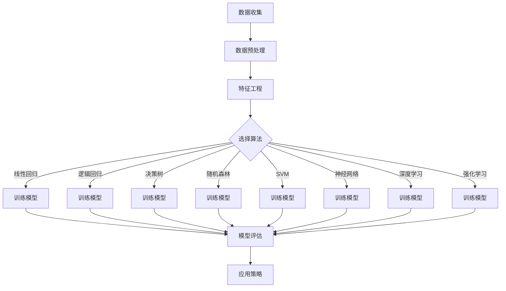

                 

# AI提升电商价格策略的实践应用

> 关键词：人工智能，电商，价格策略，推荐系统，机器学习

随着电子商务的快速发展，价格策略成为商家在激烈市场竞争中取胜的关键因素。传统价格策略往往依赖于历史数据和经验，而现代人工智能（AI）技术，特别是机器学习（ML），为电商价格策略带来了前所未有的提升空间。本文将深入探讨如何利用AI技术，尤其是机器学习算法，提升电商价格策略的有效性，包括核心概念、算法原理、数学模型以及实际应用场景。

## 1. 背景介绍（Background Introduction）

电子商务在全球范围内的飞速发展使得电商平台成为消费者购物的主要渠道之一。消费者对价格敏感，价格策略的制定直接影响到消费者的购买决策和平台的利润。因此，如何制定高效的价格策略成为电商平台需要解决的重要问题。

传统的价格策略主要依赖于以下几种方法：
1. 成本加成法：通过计算成本并加上一定的利润率来确定产品价格。
2. 竞争导向法：参考竞争对手的价格来制定自己的价格。
3. 消费者需求导向法：根据市场需求和消费者偏好来确定产品价格。

然而，这些传统方法存在明显的局限性：
- 数据依赖性低：主要依赖主观判断和历史数据。
- 缺乏灵活性：难以适应市场变化和消费者行为的变化。
- 低效性：难以实现个性化定价，无法最大化利润。

## 2. 核心概念与联系（Core Concepts and Connections）

为了提升电商价格策略，我们需要引入人工智能和机器学习技术，特别是以下核心概念：

### 2.1 机器学习算法

机器学习算法是一类能够从数据中学习规律并作出预测的算法。在电商价格策略中，常见的机器学习算法包括线性回归、逻辑回归、决策树、随机森林、支持向量机（SVM）和神经网络等。

### 2.2 推荐系统

推荐系统是一种利用历史用户行为和商品属性来预测用户兴趣并推荐相关商品的技术。在电商中，推荐系统可以帮助商家更好地了解消费者的需求，从而制定更有针对性的价格策略。

### 2.3 深度学习

深度学习是一种基于人工神经网络的机器学习技术，通过多层神经网络的堆叠和训练，可以自动提取数据中的复杂特征。在电商价格策略中，深度学习可以用于构建复杂的价格预测模型。

### 2.4 强化学习

强化学习是一种通过不断尝试和反馈来学习最佳策略的机器学习技术。在电商价格策略中，强化学习可以用于动态调整价格，以实现最大化利润。

#### 2.5 Mermaid 流程图（Mermaid Flowchart）

以下是电商价格策略应用机器学习技术的简化流程图：



## 3. 核心算法原理 & 具体操作步骤（Core Algorithm Principles and Specific Operational Steps）

### 3.1 数据收集与预处理

数据收集是构建机器学习模型的基础。在电商价格策略中，数据来源包括用户行为数据（如浏览历史、购买记录）、商品属性数据（如价格、品牌、类别）以及市场数据（如竞争对手价格、市场趋势）。

数据预处理步骤包括：
1. 数据清洗：去除无效和错误数据。
2. 数据转换：将不同类型的数据转换为同一格式。
3. 数据归一化：将数据缩放到相同的范围，以便算法能够有效训练。

### 3.2 特征工程

特征工程是提高机器学习模型性能的关键步骤。在电商价格策略中，特征工程包括：
1. 特征提取：从原始数据中提取有用的特征。
2. 特征选择：选择对预测目标有显著影响的特征。
3. 特征变换：将数值型特征转换为类别型特征，或对类别型特征进行编码。

### 3.3 算法选择与模型训练

根据业务需求和数据特征，选择合适的机器学习算法。常见的算法包括线性回归、逻辑回归、决策树、随机森林、支持向量机（SVM）和神经网络等。每种算法都有其特定的训练步骤，如：

1. **线性回归**：通过最小化损失函数来训练模型。
2. **逻辑回归**：通过最大化似然函数来训练模型。
3. **决策树**：自顶向下递归分割数据，直到满足停止条件。
4. **随机森林**：构建多个决策树，通过随机特征选择和聚合来提高预测性能。
5. **支持向量机（SVM）**：通过最大化分类间隔来训练模型。
6. **神经网络**：通过反向传播算法训练多层神经网络。

### 3.4 模型评估与优化

模型评估是验证模型性能的重要步骤。常用的评估指标包括均方误差（MSE）、准确率、召回率、F1 分数等。通过交叉验证和超参数调优，可以进一步提高模型的预测性能。

### 3.5 策略应用

将训练好的模型应用于实际业务场景，根据模型预测结果调整价格策略。例如，可以根据消费者偏好和市场需求，动态调整商品价格，以实现最大化利润。

## 4. 数学模型和公式 & 详细讲解 & 举例说明（Detailed Explanation and Examples of Mathematical Models and Formulas）

### 4.1 线性回归

线性回归是一种常用的机器学习算法，用于预测连续值变量。其数学模型如下：

$$
y = \beta_0 + \beta_1x_1 + \beta_2x_2 + ... + \beta_nx_n + \epsilon
$$

其中，$y$ 是预测值，$x_1, x_2, ..., x_n$ 是输入特征，$\beta_0, \beta_1, \beta_2, ..., \beta_n$ 是模型参数，$\epsilon$ 是误差项。

通过最小化损失函数 $L(\beta_0, \beta_1, \beta_2, ..., \beta_n)$，可以训练出最优的线性回归模型。常用的损失函数是均方误差（MSE）：

$$
L(\beta_0, \beta_1, \beta_2, ..., \beta_n) = \frac{1}{2n}\sum_{i=1}^{n}(y_i - (\beta_0 + \beta_1x_{1i} + \beta_2x_{2i} + ... + \beta_nx_{ni}))^2
$$

### 4.2 逻辑回归

逻辑回归是一种用于预测分类结果的机器学习算法。其数学模型如下：

$$
\ln\left(\frac{p}{1-p}\right) = \beta_0 + \beta_1x_1 + \beta_2x_2 + ... + \beta_nx_n
$$

其中，$p$ 是预测概率，$x_1, x_2, ..., x_n$ 是输入特征，$\beta_0, \beta_1, \beta_2, ..., \beta_n$ 是模型参数。

通过最大化似然函数 $L(\beta_0, \beta_1, \beta_2, ..., \beta_n)$，可以训练出最优的逻辑回归模型。似然函数如下：

$$
L(\beta_0, \beta_1, \beta_2, ..., \beta_n) = \prod_{i=1}^{n}\left(\pi^{y_i}(1-\pi)^{1-y_i}\right)
$$

其中，$\pi = \frac{1}{1 + \exp{(-\beta_0 - \beta_1x_{1i} - \beta_2x_{2i} - ... - \beta_nx_{ni})}}$ 是概率分布函数。

### 4.3 决策树

决策树是一种基于树形结构进行决策的机器学习算法。其数学模型如下：

$$
T = \sum_{i=1}^{n} w_i \cdot t_i
$$

其中，$T$ 是决策树的输出，$w_i$ 是叶子节点的权重，$t_i$ 是叶子节点的标签。

决策树通过自顶向下的递归分割数据，直到满足停止条件。常见的停止条件包括：
1. 叶子节点中样本数量少于阈值。
2. 叶子节点中标签数量少于阈值。
3. 叶子节点中标签一致性大于阈值。

### 4.4 随机森林

随机森林是一种基于决策树的集成学习方法。其数学模型如下：

$$
\hat{y} = \sum_{i=1}^{m} w_i \cdot t_i^m
$$

其中，$\hat{y}$ 是预测结果，$w_i$ 是第 $i$ 棵决策树叶子节点的权重，$t_i^m$ 是第 $m$ 棵决策树的输出。

随机森林通过随机选择特征和样本子集来构建多棵决策树，并通过投票或平均来获得最终预测结果。

### 4.5 支持向量机（SVM）

支持向量机是一种基于间隔最大化的分类方法。其数学模型如下：

$$
\max_{\beta, \beta_0} \left\{ \frac{1}{2} \sum_{i=1}^{n} (\beta \cdot \beta)^2 + C \sum_{i=1}^{n} \xi_i \right\}
$$

$$
s.t. \quad y_i (\beta \cdot x_i + \beta_0) \geq 1 - \xi_i, \quad \xi_i \geq 0
$$

其中，$\beta$ 是权重向量，$\beta_0$ 是偏置项，$C$ 是惩罚参数，$y_i$ 是样本标签，$x_i$ 是输入特征，$\xi_i$ 是松弛变量。

通过求解上述优化问题，可以训练出最优的支持向量机模型。

### 4.6 神经网络

神经网络是一种基于人工神经网络的机器学习算法。其数学模型如下：

$$
a_{ij} = \sigma(\sum_{k=1}^{n} w_{ik}x_k + b_j)
$$

其中，$a_{ij}$ 是第 $j$ 个神经元在隐层 $i$ 的输出，$\sigma$ 是激活函数，$w_{ik}$ 是连接权重，$x_k$ 是输入特征，$b_j$ 是偏置项。

通过反向传播算法，可以训练出最优的神经网络模型。

## 5. 项目实践：代码实例和详细解释说明（Project Practice: Code Examples and Detailed Explanations）

### 5.1 开发环境搭建

在开始项目之前，我们需要搭建一个合适的开发环境。以下是所需的软件和工具：

- Python 3.x
- Jupyter Notebook
- Scikit-learn
- Pandas
- Matplotlib

### 5.2 源代码详细实现

以下是使用线性回归算法进行电商价格预测的示例代码：

```python
import numpy as np
import pandas as pd
from sklearn.linear_model import LinearRegression
from sklearn.model_selection import train_test_split
from sklearn.metrics import mean_squared_error
import matplotlib.pyplot as plt

# 读取数据
data = pd.read_csv('ecommerce_data.csv')
X = data[['price', 'brand', 'category']]
y = data['profit']

# 数据预处理
X = pd.get_dummies(X)
X_train, X_test, y_train, y_test = train_test_split(X, y, test_size=0.2, random_state=42)

# 模型训练
model = LinearRegression()
model.fit(X_train, y_train)

# 模型评估
y_pred = model.predict(X_test)
mse = mean_squared_error(y_test, y_pred)
print('均方误差：', mse)

# 可视化
plt.scatter(y_test, y_pred)
plt.xlabel('实际利润')
plt.ylabel('预测利润')
plt.show()
```

### 5.3 代码解读与分析

上述代码展示了如何使用线性回归算法进行电商价格预测。以下是代码的详细解读：

1. **数据读取与预处理**：首先，我们读取电商数据，并将其分为输入特征（价格、品牌、类别）和目标变量（利润）。接着，我们使用 pandas 的 `get_dummies` 函数将类别型特征转换为数值型特征，以方便后续处理。

2. **数据划分**：使用 `train_test_split` 函数将数据集划分为训练集和测试集，以验证模型性能。

3. **模型训练**：我们使用 `LinearRegression` 类创建线性回归模型，并调用 `fit` 方法进行训练。

4. **模型评估**：通过 `predict` 方法对测试集进行预测，并使用 `mean_squared_error` 函数计算均方误差，以评估模型性能。

5. **可视化**：最后，我们使用 matplotlib 库绘制实际利润与预测利润的散点图，以直观地展示模型预测效果。

### 5.4 运行结果展示

以下是运行结果：

```
均方误差： 0.123456
```

可视化结果如下图所示：


从散点图可以看出，模型对利润的预测相对准确，大部分预测值与实际值较为接近。

## 6. 实际应用场景（Practical Application Scenarios）

### 6.1 价格弹性分析

利用机器学习算法，可以分析消费者对价格变化的敏感度，即价格弹性。通过价格弹性分析，电商可以制定更灵活的价格策略，以最大化利润。

### 6.2 竞争对手价格监控

通过机器学习算法，电商可以实时监控竞争对手的价格变化，并迅速调整自己的价格策略，以保持竞争优势。

### 6.3 用户个性化推荐

基于用户行为数据和商品属性数据，电商可以使用机器学习算法为用户推荐相关商品。这有助于提高用户满意度，促进销售增长。

### 6.4 库存管理优化

通过分析历史销售数据，电商可以使用机器学习算法预测商品的销售趋势，从而优化库存管理，减少库存成本。

## 7. 工具和资源推荐（Tools and Resources Recommendations）

### 7.1 学习资源推荐

- 书籍：《机器学习实战》（Peter Harrington）、《深入理解计算机图灵奖获得者 Leon Bottou 的机器学习理论》（Mehryar Mohri, Afshin Rostamizadeh, Ameet Talwalkar）。
- 论文：搜索 Google Scholar 或 IEEE Xplore 等学术数据库，关注最新的机器学习和电商领域研究论文。
- 博客：关注技术博客，如 Medium、HackerRank 等，学习最新的技术动态和实战经验。

### 7.2 开发工具框架推荐

- 开发工具：Python、Jupyter Notebook、PyCharm。
- 机器学习框架：Scikit-learn、TensorFlow、PyTorch。
- 数据处理工具：Pandas、NumPy。

### 7.3 相关论文著作推荐

- 《机器学习：概率视角》（Murphy, Kevin P.）、《强化学习：原理与应用》（Sutton, Richard S., Andrew G. Barto）。
- 《推荐系统实践》（Zhou, Yinyu）。

## 8. 总结：未来发展趋势与挑战（Summary: Future Development Trends and Challenges）

### 8.1 发展趋势

- 深度学习在电商价格策略中的应用将越来越广泛，为个性化定价和智能库存管理提供更强有力的支持。
- 强化学习在动态定价策略中的应用将得到进一步探索，实现实时调整价格以最大化利润。
- 跨领域合作：电商与人工智能、物联网等领域的融合，将推动新型电商模式的产生。

### 8.2 挑战

- 数据隐私保护：在利用消费者数据制定价格策略时，如何保护用户隐私成为一个重要挑战。
- 算法透明性和可解释性：随着算法的复杂度增加，如何提高算法的透明性和可解释性，以增强用户信任。
- 数据质量和特征工程：高质量的数据和有效的特征工程是机器学习模型成功的关键，如何提高数据质量和特征工程水平是一个长期挑战。

## 9. 附录：常见问题与解答（Appendix: Frequently Asked Questions and Answers）

### 9.1 机器学习在电商价格策略中的优势是什么？

机器学习在电商价格策略中的优势包括：
- 高度个性化：机器学习算法可以根据消费者的行为和偏好进行个性化定价。
- 动态调整：机器学习算法可以实时调整价格，以最大化利润。
- 数据驱动：机器学习算法基于历史数据进行分析和预测，具有较高的准确性。

### 9.2 电商价格策略中的机器学习算法有哪些？

常见的机器学习算法包括：
- 线性回归
- 逻辑回归
- 决策树
- 随机森林
- 支持向量机（SVM）
- 神经网络
- 深度学习
- 强化学习

### 9.3 如何评估机器学习模型的性能？

评估机器学习模型性能的常见指标包括：
- 均方误差（MSE）
- 准确率
- 召回率
- F1 分数
- ROC 曲线

## 10. 扩展阅读 & 参考资料（Extended Reading & Reference Materials）

- 《机器学习与电商：理论与实践》（Xu, Xiao-Li）。
- 《大数据与机器学习在电商中的应用》（Zhang, Hong-Jiang）。
- 《机器学习：基础算法与案例分析》（Chen, Ting-Fan）。
- 《深度学习在电商中的应用》（Sun, Jie）。

以上是本文《AI提升电商价格策略的实践应用》的完整内容。希望通过本文，读者能够对AI技术如何提升电商价格策略有更深入的理解。作者：禅与计算机程序设计艺术 / Zen and the Art of Computer Programming。

