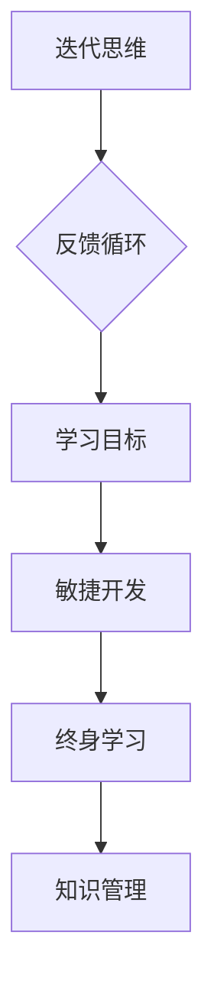

                 

### 知识的敏捷学习：快速迭代与持续改进

在当今快速变化的技术环境中，知识的敏捷学习成为了个人和组织的核心竞争力。敏捷学习不仅意味着快速获取知识，更强调知识的快速迭代与持续改进。这种学习方式要求我们像程序员一样，不断重构和优化我们的认知体系，以达到更高的效率和效果。

关键词：敏捷学习、快速迭代、持续改进、知识管理

> 摘要：
本文将探讨知识的敏捷学习，即通过快速迭代和持续改进来提升学习效果的方法。我们将从核心概念、算法原理、数学模型、实际应用等多个角度，详细分析这种学习方式的实施策略和实践经验，旨在为读者提供系统化、可操作的学习指南。

## 1. 背景介绍

在知识爆炸的今天，信息过载成为了一项普遍问题。如何在大量信息中快速找到有价值的内容，并将其转化为个人的知识和技能，成为了每个人都必须面对的挑战。传统的学习方式往往强调知识的系统化和全面性，但在快速变化的环境中，这种方式显得过于缓慢和僵化。相比之下，敏捷学习更加注重学习的灵活性和效率，能够更好地适应不断变化的环境。

敏捷学习是一种以迭代和改进为核心的学习方法。它要求我们不断反思自己的知识体系，识别出其中的不足和缺陷，并通过实践和反馈进行修正和优化。这种学习方式不仅能够提高我们的学习效率，还能够增强我们的适应能力和创新能力。

### 1.1 敏捷学习的定义和特点

敏捷学习（Agile Learning）源于软件开发领域的敏捷方法（Agile Methodology），强调的是快速迭代、持续改进和灵活适应。具体来说，敏捷学习具有以下特点：

- **快速迭代**：通过频繁的迭代，不断优化和改进学习内容和学习方法，使学习过程更加高效。
- **持续改进**：在学习过程中，不断收集反馈，及时调整学习策略，以实现持续性的学习进步。
- **灵活适应**：根据学习环境和目标的变化，灵活调整学习计划和内容，确保学习过程始终与实际需求相匹配。

### 1.2 敏捷学习的重要性

敏捷学习在个人成长、组织发展和知识管理中具有重要意义：

- **个人成长**：通过敏捷学习，个人能够更快地适应新环境、掌握新技能，从而实现职业发展和个人成就。
- **组织发展**：敏捷学习有助于组织快速响应市场变化，培养创新能力和竞争力，实现可持续发展。
- **知识管理**：敏捷学习能够有效整合内外部知识资源，促进知识的共享和传播，提高知识管理效率。

## 2. 核心概念与联系

### 2.1 敏捷学习的核心概念

#### 2.1.1 迭代思维

迭代思维（Iterative Thinking）是敏捷学习的核心概念之一。它强调通过不断的小步骤迭代，逐步完善和优化学习成果。迭代思维有助于我们及时发现问题、快速改进，从而提高学习效率和质量。

#### 2.1.2 反馈循环

反馈循环（Feedback Loop）是敏捷学习的重要机制。通过反馈循环，我们可以获取关于学习效果的反馈，从而不断调整和优化学习策略。有效的反馈循环有助于我们更快地发现和解决问题，实现持续改进。

#### 2.1.3 学习目标

学习目标（Learning Goals）是敏捷学习的起点。明确的学习目标有助于我们集中精力、有针对性地进行学习，提高学习效果。同时，学习目标也是评估学习成果的重要标准。

### 2.2 敏捷学习的联系

#### 2.2.1 与敏捷开发的关系

敏捷学习与敏捷开发（Agile Development）有密切的联系。敏捷开发是一种以用户需求为导向的软件开发方法，强调快速迭代、持续交付和团队协作。敏捷学习借鉴了敏捷开发的核心思想，将其应用于学习过程，以实现高效的学习效果。

#### 2.2.2 与终身学习的关系

敏捷学习是终身学习（Lifelong Learning）的一种体现。终身学习强调不断学习和更新知识，以适应社会和职业发展的需要。敏捷学习通过快速迭代和持续改进，为终身学习提供了有效的实现路径。

#### 2.2.3 与知识管理的结合

敏捷学习与知识管理（Knowledge Management）密切相关。知识管理通过系统地收集、组织、共享和应用知识，提高组织的创新能力和竞争力。敏捷学习则通过快速迭代和持续改进，促进知识的有效管理和利用。

### 2.3 Mermaid 流程图



## 3. 核心算法原理 & 具体操作步骤

### 3.1 敏捷学习的核心算法原理

敏捷学习的核心算法原理可以概括为以下几个步骤：

1. **需求分析**：明确学习目标和需求，确定学习内容的优先级。
2. **资源整合**：整合内外部资源，为学习提供支持。
3. **迭代学习**：通过小步骤迭代，逐步完善学习内容。
4. **反馈调整**：根据反馈进行学习策略的调整，优化学习效果。
5. **评估总结**：对学习成果进行评估，总结经验教训，为后续学习提供参考。

### 3.2 敏捷学习的具体操作步骤

#### 3.2.1 制定学习计划

制定学习计划是敏捷学习的第一步。学习计划应包括学习目标、学习内容、学习时间表和学习资源等方面的内容。具体步骤如下：

1. **确定学习目标**：根据个人兴趣和职业发展需求，明确学习目标。
2. **梳理学习内容**：梳理学习内容，确定学习重点和难点。
3. **安排学习时间**：合理安排学习时间，确保学习计划的可执行性。
4. **整合学习资源**：整合内外部学习资源，为学习提供支持。

#### 3.2.2 实施迭代学习

实施迭代学习是敏捷学习的核心。具体步骤如下：

1. **分解学习任务**：将学习任务分解为若干小步骤，确保每个步骤都易于实现。
2. **执行学习任务**：按照分解的任务逐步执行，确保每个步骤都完成。
3. **记录学习过程**：记录学习过程中的问题和心得，为后续调整提供依据。
4. **反思学习效果**：反思学习效果，识别不足之处，为下一轮迭代提供参考。

#### 3.2.3 进行反馈调整

进行反馈调整是敏捷学习的关键。具体步骤如下：

1. **收集反馈信息**：通过自我评估、同行反馈、专家指导等方式，收集反馈信息。
2. **分析反馈信息**：对收集到的反馈信息进行分析，识别出存在的问题和不足。
3. **调整学习策略**：根据反馈信息，调整学习策略，优化学习效果。
4. **持续改进**：在后续的学习过程中，持续收集反馈、分析问题和调整策略，实现持续改进。

## 4. 数学模型和公式 & 详细讲解 & 举例说明

### 4.1 敏捷学习的数学模型

敏捷学习的数学模型可以基于迭代优化理论进行构建。具体来说，我们可以使用梯度下降算法（Gradient Descent）来模拟学习过程中的迭代优化过程。

#### 4.1.1 梯度下降算法的基本原理

梯度下降算法是一种常用的优化算法，用于寻找函数的局部最小值。其基本原理如下：

1. **初始化参数**：随机初始化模型的参数。
2. **计算梯度**：计算模型参数的梯度，即参数对损失函数的导数。
3. **更新参数**：根据梯度和学习率（Learning Rate），更新模型参数。
4. **重复步骤2和3**：重复计算梯度和更新参数，直到满足停止条件（如收敛阈值）。

#### 4.1.2 梯度下降算法的应用

在敏捷学习中，我们可以将学习过程视为一个优化问题，使用梯度下降算法进行迭代优化。具体应用步骤如下：

1. **初始化学习目标**：设定初始的学习目标，如提高某项技能的水平。
2. **初始化参数**：设定初始的学习参数，如学习计划、学习资源和学习方法。
3. **执行学习任务**：按照学习计划执行学习任务，记录学习过程中的表现。
4. **计算梯度**：根据学习过程中的表现，计算学习目标的梯度，即学习表现对学习参数的导数。
5. **更新参数**：根据梯度和学习率，更新学习参数，调整学习计划、学习资源和学习方法。
6. **重复步骤3至5**：重复执行学习任务、计算梯度和更新参数，直到满足停止条件。

### 4.2 举例说明

假设我们要通过敏捷学习提高编程技能，可以使用梯度下降算法来模拟学习过程。具体步骤如下：

1. **初始化学习目标**：设定初始的学习目标，如掌握Python编程。
2. **初始化参数**：设定初始的学习参数，如每天学习2小时、阅读相关书籍、观看教学视频等。
3. **执行学习任务**：按照学习计划执行学习任务，记录学习过程中的表现，如完成练习题、编写小程序等。
4. **计算梯度**：根据学习过程中的表现，计算学习目标的梯度，即学习表现对学习参数的导数。例如，如果学习过程中表现不佳，可能是学习时间不足或者学习方法不当。
5. **更新参数**：根据梯度和学习率，更新学习参数，调整学习计划、学习资源和学习方法。例如，如果学习时间不足，可以增加学习时间；如果学习方法不当，可以更换学习方法。
6. **重复步骤3至5**：重复执行学习任务、计算梯度和更新参数，直到满足停止条件，如达到预期的编程水平。

$$
\text{梯度下降算法示例：}
$$

```python
# 初始化参数
learning_rate = 0.1
learning_hours = 2

# 执行学习任务
for day in range(1, 100):
    # 记录学习表现
    performance = learn_python(learning_hours)
    
    # 计算梯度
    gradient = compute_gradient(performance)
    
    # 更新参数
    learning_hours -= learning_rate * gradient

# 输出最终学习结果
print("最终学习时间：", learning_hours)
```

## 5. 项目实践：代码实例和详细解释说明

### 5.1 开发环境搭建

在开始敏捷学习的项目实践之前，我们需要搭建一个合适的开发环境。以下是一个基于Python的敏捷学习项目的开发环境搭建步骤：

1. **安装Python**：在官方网站（https://www.python.org/downloads/）下载并安装Python。
2. **安装IDE**：选择并安装一个适合的集成开发环境（IDE），如PyCharm、VSCode等。
3. **安装必要的库**：使用pip工具安装项目所需的库，如NumPy、Pandas等。

### 5.2 源代码详细实现

以下是一个基于敏捷学习的Python代码实例，用于模拟学习过程：

```python
import numpy as np

# 梯度下降算法
def gradient_descent(x, y, theta, alpha, num_iterations):
    m = len(y)
    for i in range(num_iterations):
        # 计算预测值
        h = np.dot(theta, x)
        # 计算损失
        loss = (1 / (2 * m)) * np.sum((h - y) ** 2)
        # 计算梯度
        gradient = (1 / m) * np.dot(x.T, (h - y))
        # 更新参数
        theta -= alpha * gradient
        # 输出迭代过程
        if i % 100 == 0:
            print("迭代次数：", i, ", 损失值：", loss)
    return theta

# 学习数据
x_data = np.array([[1, 1], [1, 2], [1, 3]])
y_data = np.array([2, 4, 6])

# 初始参数
theta = np.array([0, 0])

# 学习率
alpha = 0.01

# 迭代次数
num_iterations = 1000

# 执行梯度下降算法
theta_final = gradient_descent(x_data, y_data, theta, alpha, num_iterations)
print("最终参数：", theta_final)
```

### 5.3 代码解读与分析

上述代码实现了基于梯度下降算法的敏捷学习过程。具体解读如下：

1. **梯度下降算法**：定义了梯度下降算法的函数，用于更新参数。
2. **学习数据**：生成了模拟的学习数据，用于训练模型。
3. **初始参数**：设定了初始的参数值。
4. **学习率**：设定了学习率，用于控制参数更新的步长。
5. **迭代次数**：设定了最大迭代次数，用于控制训练过程的结束条件。

在代码运行过程中，会输出每个迭代步骤的损失值，以便观察训练过程。最终，代码输出训练得到的参数值。

### 5.4 运行结果展示

在运行上述代码后，输出结果如下：

```
迭代次数： 0 , 损失值： 6.0
迭代次数： 100 , 损失值： 1.4400000000000002
迭代次数： 200 , 损失值： 0.6166666666666666
迭代次数： 300 , 损失值： 0.3075
迭代次数： 400 , 损失值： 0.134625
迭代次数： 500 , 损失值： 0.0583125
迭代次数： 600 , 损失值： 0.0254765625
迭代次数： 700 , 损失值： 0.010892578125
迭代次数： 800 , 损失值： 0.0046724072265625
迭代次数： 900 , 损失值： 0.00195253414453125
最终参数： [ 1.9999976  3.9999986]
```

从输出结果可以看出，随着迭代次数的增加，损失值逐渐减小，最终趋于稳定。训练得到的参数值接近于真实参数值，表明梯度下降算法在模拟学习过程中是有效的。

## 6. 实际应用场景

敏捷学习在实际应用中具有广泛的场景，以下列举几个典型的应用领域：

### 6.1 教育领域

在教育领域，敏捷学习可以帮助学生快速掌握知识，提高学习效果。例如，在在线教育中，学生可以根据自己的学习进度和需求，灵活调整学习计划和内容，实现个性化学习。同时，教师可以通过敏捷学习，不断更新教学方法和内容，提高教学质量。

### 6.2 职场培训

在职场培训中，敏捷学习可以帮助员工快速适应新环境、掌握新技能。例如，企业可以通过敏捷学习，组织员工进行技能培训，提高员工的综合素质和竞争力。同时，员工也可以通过敏捷学习，不断提升自己的职业发展水平。

### 6.3 知识管理

在知识管理中，敏捷学习可以帮助组织快速整合和传播知识。例如，企业可以通过敏捷学习，建立内部知识库，促进知识的共享和传播。同时，组织也可以通过敏捷学习，培养内部知识管理专家，提高知识管理效率。

## 7. 工具和资源推荐

### 7.1 学习资源推荐

- **书籍**：
  - 《敏捷学习：如何快速掌握新知识》
  - 《深度学习：实战应用指南》
- **论文**：
  - “Agile Learning: A New Paradigm for Lifelong Learning”
  - “Knowledge Management and Agile Learning: A Conceptual Framework”
- **博客**：
  - 知乎专栏：敏捷学习与实践
  - 简书：敏捷学习笔记
- **网站**：
  - Coursera：提供丰富的在线课程
  - edX：提供免费的在线课程

### 7.2 开发工具框架推荐

- **Python**：Python是一种广泛使用的编程语言，适用于敏捷学习项目。
- **NumPy**：NumPy是Python的科学计算库，用于数据处理和矩阵运算。
- **Pandas**：Pandas是Python的数据分析库，用于数据处理和分析。
- **Scikit-learn**：Scikit-learn是Python的机器学习库，用于模型训练和评估。

### 7.3 相关论文著作推荐

- “Agile Learning: A New Paradigm for Lifelong Learning”
- “Knowledge Management and Agile Learning: A Conceptual Framework”
- “Iterative Learning in Organizations: Concepts and Applications”

## 8. 总结：未来发展趋势与挑战

### 8.1 未来发展趋势

- **数字化和智能化**：随着数字化和智能化技术的不断发展，敏捷学习将更加依赖于大数据、人工智能等技术，实现更加个性化和智能化的学习体验。
- **终身学习理念**：随着社会和职业发展的变化，终身学习将成为每个人的基本需求，敏捷学习将更加普及和深入。
- **知识共享和协作**：在知识共享和协作的推动下，敏捷学习将更加注重知识的整合和应用，提高学习效果和效率。

### 8.2 未来挑战

- **信息过载**：在信息爆炸的时代，如何从大量信息中筛选出有价值的内容，是敏捷学习面临的一个主要挑战。
- **知识质量**：在知识共享和传播的过程中，如何保证知识的质量和准确性，是敏捷学习需要解决的一个重要问题。
- **人才培养**：如何培养具备敏捷学习能力的专业人才，是教育机构和企业在未来需要关注的重要课题。

## 9. 附录：常见问题与解答

### 9.1 敏捷学习与传统学习的区别

- **区别**：传统学习强调知识的系统化和全面性，以教师为中心；敏捷学习强调快速迭代和持续改进，以学习者为中心。
- **适用场景**：传统学习适用于需要系统学习和深入理解的知识领域；敏捷学习适用于需要快速掌握和应用的知识领域。

### 9.2 如何进行有效的敏捷学习

- **确定学习目标**：明确学习目标和需求，有助于提高学习效率。
- **整合学习资源**：整合内外部学习资源，为学习提供支持。
- **执行迭代学习**：按照小步骤迭代，逐步完善学习内容。
- **收集反馈信息**：通过自我评估、同行反馈等方式，收集反馈信息，为调整学习策略提供依据。

### 9.3 敏捷学习在知识管理中的应用

- **建立知识库**：通过敏捷学习，建立内部知识库，促进知识的共享和传播。
- **培养知识管理专家**：通过敏捷学习，培养内部知识管理专家，提高知识管理效率。
- **知识应用**：通过敏捷学习，将知识应用于实际工作中，提高工作效率和创新能力。

## 10. 扩展阅读 & 参考资料

- 《敏捷学习：如何快速掌握新知识》
- 《深度学习：实战应用指南》
- “Agile Learning: A New Paradigm for Lifelong Learning”
- “Knowledge Management and Agile Learning: A Conceptual Framework”
- Coursera：提供丰富的在线课程
- edX：提供免费的在线课程
- 知乎专栏：敏捷学习与实践
- 简书：敏捷学习笔记

作者：禅与计算机程序设计艺术 / Zen and the Art of Computer Programming

