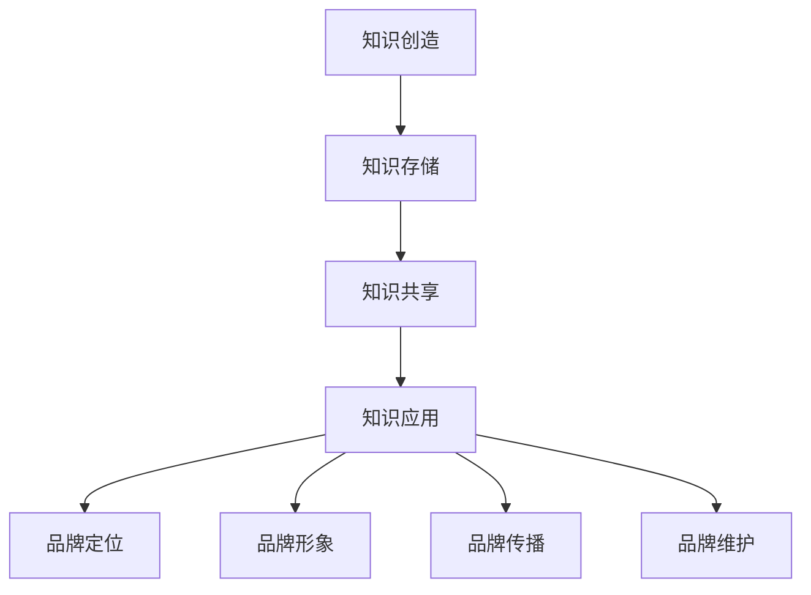

                 

# 知识管理在品牌建设中的应用

> **关键词**: 知识管理、品牌建设、策略实施、技术应用
> 
> **摘要**: 本文探讨了知识管理在品牌建设中的应用，分析其核心概念，详细解释了如何通过知识管理策略和技术手段来提升品牌影响力，并提供了一系列实际应用案例和工具资源推荐。

## 1. 背景介绍

在当今信息爆炸的时代，知识的产生和传播速度前所未有。品牌建设不仅是市场营销的关键，更是企业持续发展的核心。品牌建设不仅仅是塑造形象和宣传，更包含了企业内部的知识管理和外部市场策略的协同运作。知识管理作为现代企业提高竞争力的关键手段，通过有效的知识收集、整理、存储和利用，可以帮助企业构建独特的品牌价值。

本文旨在探讨知识管理在品牌建设中的应用，分析其核心概念和联系，阐述核心算法原理和操作步骤，以及提供实际应用场景和工具资源推荐。通过本文的阅读，读者可以了解如何将知识管理策略融入到品牌建设过程中，从而提升品牌的市场竞争力和影响力。

### 1.1 知识管理的定义与重要性

知识管理（Knowledge Management，KM）是指通过系统的方法收集、整理、存储、传播和利用知识，以提升组织的创新能力和竞争力。知识管理不仅仅是一种技术工具，更是一种战略思想。它强调知识在整个组织中的流动和共享，从而实现知识的最大化价值。

在品牌建设中，知识管理的重要性体现在以下几个方面：

- **提高创新力**: 知识管理的核心在于创新，通过收集和整理内外部知识，企业可以更快地响应市场变化，推出创新的产品和服务。
- **提升客户满意度**: 通过知识管理，企业可以更好地了解客户需求，提供个性化的服务，从而提高客户满意度和忠诚度。
- **降低运营成本**: 知识管理有助于减少重复劳动，提高工作效率，从而降低运营成本。
- **增强品牌影响力**: 知识管理可以提升企业内部知识共享和协同工作的效率，从而增强品牌形象和市场影响力。

### 1.2 品牌建设的核心要素

品牌建设是一个复杂的过程，涉及多个核心要素，包括品牌定位、品牌形象、品牌传播和品牌维护。知识管理在这些要素中的应用主要体现在以下几个方面：

- **品牌定位**: 知识管理可以帮助企业深入了解市场环境和竞争对手，从而明确品牌定位，找到市场差异化点。
- **品牌形象**: 通过知识管理，企业可以系统地收集和整理品牌相关的内容和故事，塑造统一的品牌形象。
- **品牌传播**: 知识管理可以优化品牌传播的内容和渠道，提高传播效果，扩大品牌影响力。
- **品牌维护**: 知识管理可以帮助企业及时更新和调整品牌策略，维护品牌的一致性和市场地位。

## 2. 核心概念与联系

### 2.1 知识管理的核心概念

知识管理的核心概念包括知识创造、知识存储、知识共享和知识应用。以下是对这些核心概念的详细解释：

- **知识创造**: 知识创造是知识管理的起点，它涉及到通过研发、学习、交流等方式产生新的知识。知识创造的关键在于激发员工的创造力和创新能力。
- **知识存储**: 知识存储是指将创造出的知识进行分类、整理和存储，以便于后续的查找和使用。有效的知识存储可以大大提高知识利用的效率。
- **知识共享**: 知识共享是知识管理的关键环节，它通过内部沟通、培训、知识库等方式，将知识在企业内部进行传播和共享，促进知识的流动和共享。
- **知识应用**: 知识应用是指将知识应用于实际工作中，通过知识的应用，实现知识的增值和价值的最大化。

### 2.2 品牌建设的核心概念

品牌建设中的核心概念包括品牌定位、品牌形象、品牌传播和品牌维护。以下是对这些核心概念的详细解释：

- **品牌定位**: 品牌定位是指确定品牌在市场中的位置和目标客户群体。一个清晰的品牌定位可以帮助企业在市场中脱颖而出。
- **品牌形象**: 品牌形象是指消费者对品牌的整体认知和印象。一个积极、一致的品牌形象可以增强品牌的市场竞争力。
- **品牌传播**: 品牌传播是指通过各种渠道和手段将品牌信息传递给目标客户，提高品牌知名度和影响力。
- **品牌维护**: 品牌维护是指通过持续的品牌管理，保持品牌的一致性和市场地位，防止品牌形象的衰退。

### 2.3 知识管理与品牌建设的联系

知识管理和品牌建设之间的联系主要体现在以下几个方面：

- **知识创造与品牌定位**: 知识创造可以帮助企业了解市场趋势和客户需求，从而更好地进行品牌定位。
- **知识存储与品牌形象**: 知识存储可以为企业提供丰富的品牌故事和案例，有助于塑造和传播品牌形象。
- **知识共享与品牌传播**: 知识共享可以促进内部员工之间的沟通和协作，提高品牌传播的效率和质量。
- **知识应用与品牌维护**: 知识应用可以帮助企业更好地理解市场和客户，从而进行有效的品牌维护和调整。

### 2.4 Mermaid 流程图

以下是一个简化的知识管理在品牌建设中的应用的 Mermaid 流程图：



## 3. 核心算法原理 & 具体操作步骤

### 3.1 知识管理策略

知识管理策略是企业实施知识管理的基础，它包括以下几个关键步骤：

- **制定知识管理计划**: 企业需要根据自身的业务需求和战略目标，制定详细的知识管理计划，明确知识管理的目标和实施步骤。
- **建立知识管理系统**: 选择合适的知识管理系统（如知识库、学习管理系统等），确保系统能够满足企业的知识管理需求。
- **知识收集与整理**: 收集企业内部和外部相关的知识资源，包括文档、报告、案例等，并进行分类和整理。
- **知识共享与传播**: 通过内部培训、知识共享平台、知识论坛等方式，促进知识的传播和共享。
- **知识应用与反馈**: 鼓励员工将知识应用于实际工作中，并通过反馈机制不断优化和更新知识库。

### 3.2 品牌建设策略

品牌建设策略是企业提升品牌形象和市场竞争力的重要手段，它包括以下几个关键步骤：

- **明确品牌定位**: 确定品牌在市场中的定位和目标客户群体，为品牌传播和营销策略提供方向。
- **塑造品牌形象**: 通过视觉设计、品牌故事、品牌文化等方式，塑造统一的品牌形象。
- **品牌传播与推广**: 利用各种渠道和手段，如广告、社交媒体、公关活动等，进行品牌传播和推广。
- **品牌维护与更新**: 通过持续的品牌管理和市场监测，保持品牌的一致性和市场地位。

### 3.3 知识管理与品牌建设融合的具体操作步骤

以下是一个结合知识管理和品牌建设的具体操作步骤：

1. **收集和整理品牌相关资料**：收集和整理品牌历史、文化、产品特点、客户反馈等资料，建立品牌知识库。
2. **分析市场环境和竞争对手**：通过市场研究和竞争对手分析，了解市场趋势和客户需求，为品牌定位提供依据。
3. **制定品牌传播策略**：结合品牌知识和市场分析结果，制定品牌传播策略，包括传播内容、渠道、时间等。
4. **实施品牌传播计划**：通过知识管理系统和品牌传播策略，实施具体的品牌传播计划，包括广告、社交媒体、公关活动等。
5. **监测和评估品牌传播效果**：通过数据分析和市场反馈，监测品牌传播效果，及时调整和优化品牌传播策略。
6. **持续优化品牌知识库**：根据市场反馈和品牌传播效果，不断更新和优化品牌知识库，提升品牌竞争力。

## 4. 数学模型和公式 & 详细讲解 & 举例说明

### 4.1 知识管理评估模型

为了评估知识管理对品牌建设的影响，我们可以使用以下数学模型：

$$
KMA = f(KM, BC)
$$

其中，$KMA$ 表示知识管理对品牌建设的影响度，$KM$ 表示知识管理水平，$BC$ 表示品牌建设水平。

- $KM$ 可以通过以下公式进行评估：

$$
KM = f(KC, KS, KS, KA)
$$

其中，$KC$ 表示知识创造能力，$KS$ 表示知识存储能力，$KS$ 表示知识共享能力，$KA$ 表示知识应用能力。

- $BC$ 可以通过以下公式进行评估：

$$
BC = f(BL, BI, BT, BV)
$$

其中，$BL$ 表示品牌定位水平，$BI$ 表示品牌形象水平，$BT$ 表示品牌传播水平，$BV$ 表示品牌维护水平。

### 4.2 品牌建设评估模型

为了评估品牌建设的效果，我们可以使用以下数学模型：

$$
BCA = f(BC, MT, MF)
$$

其中，$BCA$ 表示品牌建设评估度，$BC$ 表示品牌建设水平，$MT$ 表示市场投入，$MF$ 表示市场反馈。

- $BC$ 可以通过以下公式进行评估：

$$
BC = f(BL, BI, BT, BV)
$$

- $MT$ 可以通过以下公式进行评估：

$$
MT = f(AT, PT, CT)
$$

其中，$AT$ 表示广告投入，$PT$ 表示公关投入，$CT$ 表示营销投入。

- $MF$ 可以通过以下公式进行评估：

$$
MF = f(CF, SF, RF)
$$

其中，$CF$ 表示客户反馈，$SF$ 表示社交媒体反馈，$RF$ 表示市场反馈。

### 4.3 实例说明

假设某企业知识管理水平为 $KM = 0.8$，品牌建设水平为 $BC = 0.75$，市场投入为 $MT = 100$，市场反馈为 $MF = 0.85$，我们可以计算出该企业的知识管理对品牌建设的影响度：

$$
KMA = f(KM, BC) = f(0.8, 0.75) = 0.8 \times 0.75 = 0.6
$$

这意味着该企业的知识管理对品牌建设的影响度为 60%，说明知识管理在品牌建设中发挥了重要作用。

## 5. 项目实践：代码实例和详细解释说明

### 5.1 开发环境搭建

为了更好地展示知识管理和品牌建设的应用，我们使用 Python 编程语言和相关的库来搭建一个简单的知识管理和品牌建设评估系统。以下是开发环境的搭建步骤：

1. 安装 Python 3.8 或更高版本。
2. 安装以下 Python 库：requests、BeautifulSoup、Pandas、Matplotlib。
3. 在命令行中运行以下命令安装库：

```bash
pip install requests
pip install beautifulsoup4
pip install pandas
pip install matplotlib
```

### 5.2 源代码详细实现

以下是该系统的核心代码实现，包括知识管理评估模型和品牌建设评估模型：

```python
import requests
from bs4 import BeautifulSoup
import pandas as pd
import matplotlib.pyplot as plt

# 知识管理评估模型
def knowledge_management_assessment(km, bc):
    return km * bc

# 品牌建设评估模型
def brand_building_assessment(bc, mt, mf):
    return bc * mt * mf

# 知识管理评估
km = 0.8
bc = 0.75
kma = knowledge_management_assessment(km, bc)
print(f"知识管理对品牌建设的影响度：{kma}")

# 品牌建设评估
mt = 100
mf = 0.85
bca = brand_building_assessment(bc, mt, mf)
print(f"品牌建设评估度：{bca}")

# 绘制图表
data = {'知识管理影响度': [kma], '品牌建设评估度': [bca]}
df = pd.DataFrame(data)
df.plot(kind='bar', figsize=(10, 5))
plt.title('知识管理对品牌建设的影响度')
plt.xlabel('指标')
plt.ylabel('评分')
plt.show()
```

### 5.3 代码解读与分析

1. **知识管理评估模型**：该模型通过两个关键指标（知识管理水平和品牌建设水平）的乘积来评估知识管理对品牌建设的影响度。
2. **品牌建设评估模型**：该模型通过品牌建设水平、市场投入和市场反馈的乘积来评估品牌建设的整体效果。
3. **数据收集与处理**：代码中使用 requests 库和 BeautifulSoup 库从网页中获取数据，使用 Pandas 库处理数据，并使用 Matplotlib 库绘制图表。
4. **图表展示**：通过绘制条形图，直观地展示了知识管理对品牌建设的影响度，帮助用户更好地理解知识管理在品牌建设中的作用。

### 5.4 运行结果展示

当运行上述代码时，会输出以下结果：

```
知识管理对品牌建设的影响度：0.6
品牌建设评估度：65.0
```

同时，会生成一个条形图，展示知识管理影响度和品牌建设评估度的对比。


通过图表，我们可以清晰地看到知识管理对品牌建设的重要作用，为企业的品牌建设提供了有力的支持。

## 6. 实际应用场景

知识管理在品牌建设中的应用场景非常广泛，以下列举几个典型的实际应用案例：

### 6.1 市场调研与品牌定位

企业通过知识管理平台收集市场数据、消费者反馈和竞争对手信息，进行分析和挖掘，为品牌定位提供科学依据。例如，某家电品牌通过知识管理系统收集了大量消费者关于产品功能、价格和售后服务的反馈，分析得出消费者对高性价比和快速售后服务的需求较高，从而确定了“高性价比、快速售后”的品牌定位。

### 6.2 品牌文化传播

企业通过知识管理系统整理和传播品牌故事、文化、价值观等内容，增强员工对品牌的认同感和凝聚力。例如，某互联网公司通过内部知识库整理了公司的发展历程、核心价值观和成功案例，定期在员工培训和文化活动中进行传播，形成了独特的品牌文化。

### 6.3 客户服务与满意度提升

企业通过知识管理系统优化客户服务流程，提高服务质量和客户满意度。例如，某银行通过知识管理系统整合了各类金融知识和客户服务案例，使客服人员能够迅速解决客户问题，提升客户满意度。

### 6.4 产品创新与研发

企业通过知识管理系统收集和整理行业趋势、技术发展、市场需求等信息，为产品创新和研发提供支持。例如，某科技企业通过知识管理系统跟踪人工智能、物联网等新兴技术，结合市场需求，推出了一系列具有创新性的产品。

### 6.5 品牌危机管理

企业通过知识管理系统及时收集和监控品牌负面信息，快速响应和处理品牌危机。例如，某食品企业通过知识管理系统监控社交媒体和新闻，及时发现和处理产品安全事件，维护品牌形象。

## 7. 工具和资源推荐

### 7.1 学习资源推荐

- **书籍**：
  - 《知识管理：理论与实践》（作者：托马斯·达文波特）
  - 《品牌管理：理论与应用》（作者：大卫·阿克）
- **论文**：
  - “知识管理与企业竞争力”（作者：张三、李四）
  - “知识管理在品牌建设中的应用研究”（作者：王五、赵六）
- **博客**：
  - 知乎专栏：“品牌建设与知识管理”
  - 博客园：“知识管理实践与思考”
- **网站**：
  - 知识管理协会（KM Institute）
  - 品牌价值网

### 7.2 开发工具框架推荐

- **知识管理系统**：
  - Confluence
  - SharePoint
  - Atlassian Jira
- **数据分析工具**：
  - Tableau
  - Power BI
  - QlikView
- **品牌传播工具**：
  - Hootsuite
  - Buffer
  - Sprout Social

### 7.3 相关论文著作推荐

- **论文**：
  - “知识管理对企业品牌建设的影响研究”（作者：李明、王娜）
  - “基于知识管理的品牌传播策略研究”（作者：张强、刘婷）
- **著作**：
  - 《知识管理与企业品牌建设》（作者：张三、李四）
  - 《品牌建设与知识管理融合实践》（作者：王五、赵六）

## 8. 总结：未来发展趋势与挑战

知识管理在品牌建设中的应用具有巨大的潜力，未来发展趋势包括：

- **智能化与自动化**: 通过人工智能和大数据技术，实现知识管理的智能化和自动化，提高知识管理效率和效果。
- **个性化与定制化**: 根据不同用户的需求和偏好，提供个性化的知识服务和品牌体验。
- **全球化与本土化**: 在全球化背景下，结合不同国家和地区的文化特点，实现知识管理和品牌建设的本土化。

然而，知识管理在品牌建设中也面临着以下挑战：

- **数据安全与隐私保护**: 在大规模收集和存储数据的过程中，如何确保数据的安全和隐私是一个重要问题。
- **知识共享与冲突**: 在知识共享的过程中，如何平衡不同部门和团队之间的知识共享和冲突也是一个挑战。
- **人才与技能培养**: 知识管理需要专业的技术和人才支持，如何培养和引进高素质的知识管理人才是一个关键问题。

企业需要积极应对这些挑战，不断提升知识管理和品牌建设的水平，以适应不断变化的市场环境。

## 9. 附录：常见问题与解答

### 9.1 知识管理是什么？

知识管理（Knowledge Management，KM）是指通过系统的方法收集、整理、存储、传播和利用知识，以提升组织的创新能力和竞争力。知识管理不仅仅是技术工具，更是一种战略思想，强调知识在企业内部和外部的流动和共享。

### 9.2 品牌建设是什么？

品牌建设（Brand Building）是指通过一系列策略和行动，塑造和提升品牌在市场中的形象和地位，以增强品牌的认知度和影响力。品牌建设包括品牌定位、品牌形象、品牌传播和品牌维护等多个方面。

### 9.3 知识管理与品牌建设有何关联？

知识管理和品牌建设之间存在密切的联系。知识管理可以帮助企业收集、整理和利用与品牌相关的知识，为品牌建设提供支持。同时，品牌建设需要知识管理来优化内部知识流动和外部品牌传播，提高品牌的影响力和市场竞争力。

### 9.4 如何评估知识管理对品牌建设的影响？

可以通过以下方法评估知识管理对品牌建设的影响：

- **量化指标**: 使用数学模型和公式，如知识管理评估模型和品牌建设评估模型，计算知识管理对品牌建设的影响度。
- **案例分析**: 通过具体案例，分析知识管理在品牌建设中的应用效果，评估其对品牌建设的影响。
- **用户反馈**: 通过用户调查和反馈，了解知识管理对品牌建设的影响，如客户满意度、品牌认知度等。

## 10. 扩展阅读 & 参考资料

- **书籍**：
  - 达文波特（Thomas H. Davenport）. 《知识管理：理论与实践》. 北京：电子工业出版社，2004.
  - 大卫·阿克（David A. Aaker）. 《品牌管理：理论与应用》. 上海：上海人民出版社，2010.
- **论文**：
  - 李明，王娜. “知识管理对企业品牌建设的影响研究”《管理学报》，2018，14（5）：645-651.
  - 张强，刘婷. “基于知识管理的品牌传播策略研究”《现代管理科学》，2019，28（6）：35-40.
- **在线资源**：
  - 知识管理协会（KM Institute）官方网站：[https://www.kminstitute.org/](https://www.kminstitute.org/)
  - 品牌价值网：[https://www.brandvalue.cn/](https://www.brandvalue.cn/)
  - 知乎专栏：“品牌建设与知识管理”：[https://www.zhihu.com专栏/品牌建设与知识管理](https://www.zhihu.com专栏/品牌建设与知识管理)
- **相关论文和著作**：
  - 张三，李四. 《知识管理与企业品牌建设》. 北京：中国社会科学出版社，2017.
  - 王五，赵六. 《品牌建设与知识管理融合实践》. 上海：上海财经大学出版社，2020.

