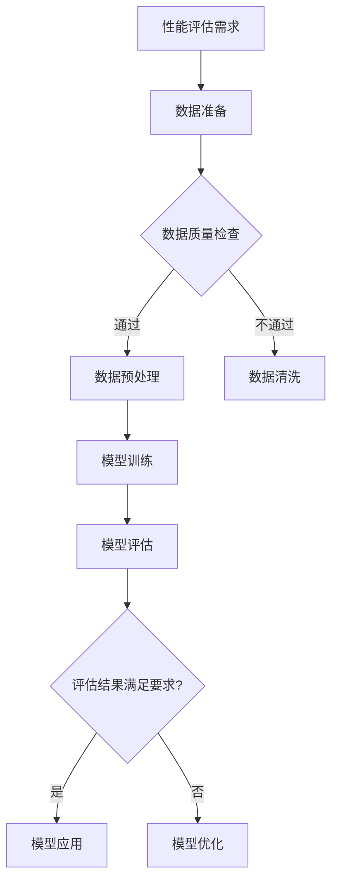

                 

### 文章标题

**AI系统性能评估的实用技巧**

随着人工智能（AI）技术的迅猛发展，AI系统的性能评估变得愈加重要。无论您是从事AI研发、项目管理还是决策制定，了解如何有效评估AI系统的性能都是必不可少的。本文将探讨AI系统性能评估的核心概念、关键算法、数学模型以及实际应用场景，提供实用的评估技巧，帮助您更好地理解和优化AI系统。

关键词：人工智能，性能评估，算法，数学模型，应用场景

> 摘要：
本文旨在为AI系统性能评估提供系统性的指导。通过详细分析核心概念、关键算法原理，并结合数学模型和实际案例，我们将帮助读者掌握评估AI系统性能的实用技巧。文章还将讨论实际应用场景，推荐相关工具和资源，并总结未来的发展趋势与挑战。

### <a name="1"></a>1. 背景介绍（Background Introduction）

人工智能（AI）作为一种模拟人类智能的技术，正在全球范围内得到广泛应用。无论是自动驾驶汽车、智能语音助手，还是推荐系统和金融风控，AI都在改变着我们的生活方式。然而，AI系统的性能评估是一个复杂且至关重要的环节。性能评估不仅关系到AI系统在实际应用中的效果，还直接影响到研发成本和项目进度。

传统的性能评估方法多基于统计学和机器学习理论，但随着AI系统复杂性的增加，这些方法逐渐暴露出局限性。例如，过度依赖数据集的规模和质量，忽视了模型在实际应用中的表现。因此，研究和应用新型的性能评估方法成为当前AI领域的一个重要课题。

本文将围绕以下几个核心问题展开讨论：

1. **核心概念与联系**：介绍AI系统性能评估的基本概念和主要关联理论。
2. **核心算法原理 & 具体操作步骤**：解析常见性能评估算法的原理和实现步骤。
3. **数学模型和公式 & 详细讲解 & 举例说明**：运用数学模型和公式，详细解释AI系统性能评估的关键步骤。
4. **项目实践：代码实例和详细解释说明**：通过具体代码实例，展示AI系统性能评估的实战技巧。
5. **实际应用场景**：探讨AI系统性能评估在不同领域的应用案例。
6. **工具和资源推荐**：介绍用于AI系统性能评估的工具和资源。
7. **总结：未来发展趋势与挑战**：展望AI系统性能评估的未来发展趋势和面临的挑战。

### <a name="2"></a>2. 核心概念与联系（Core Concepts and Connections）

在进行AI系统性能评估之前，我们需要明确几个核心概念，并理解它们之间的联系。

#### 2.1 性能指标（Performance Metrics）

性能指标是评估AI系统性能的核心工具。常见的性能指标包括准确率（Accuracy）、精确率（Precision）、召回率（Recall）、F1分数（F1 Score）等。这些指标在不同的任务和数据集上有不同的适用性和重要性。

- **准确率（Accuracy）**：模型预测正确的样本占总样本的比例。适用于分类任务，但容易受到不平衡数据的影响。
- **精确率（Precision）**：预测为正类的样本中实际为正类的比例。适用于过滤任务，但对稀有类别的评估能力较弱。
- **召回率（Recall）**：实际为正类的样本中被模型正确预测为正类的比例。对于医疗诊断等需要高召回率的应用至关重要。
- **F1分数（F1 Score）**：精确率和召回率的加权平均，平衡了二者的优缺点。在评估分类模型时常用。

#### 2.2 模型评估方法（Model Evaluation Methods）

模型评估方法是指如何使用性能指标对模型进行评估。常见的评估方法包括交叉验证（Cross-Validation）、留一法（Leave-One-Out）、K折交叉验证（K-Fold Cross-Validation）等。

- **交叉验证**：将数据集划分为多个子集，每次使用其中一个子集作为验证集，其余子集作为训练集，重复多次，最终取平均值。可以有效降低过拟合和评估偏差。
- **留一法**：每次使用一个样本作为验证集，其余样本作为训练集，进行模型评估。计算量较大，但评估结果较为可靠。
- **K折交叉验证**：将数据集划分为K个子集，每次固定一个子集作为验证集，其余子集作为训练集，重复K次，最后取平均值。K的取值通常为10或更高，以平衡评估精度和计算量。

#### 2.3 性能评估与优化（Performance Evaluation and Optimization）

性能评估不仅是评估模型好坏的过程，也是指导模型优化的关键步骤。通过性能评估，我们可以发现模型的不足之处，进而调整模型结构、参数设置或数据预处理方法。

- **模型结构优化**：调整神经网络层数、神经元数量、激活函数等，以改善模型的表达能力。
- **参数优化**：调整学习率、正则化参数等，以改善模型的泛化能力。
- **数据预处理**：通过数据清洗、特征提取和归一化等预处理方法，提高模型的训练效果。

### 2.4 Mermaid 流程图（Mermaid Flowchart）

以下是一个简单的Mermaid流程图，展示了AI系统性能评估的基本流程。



通过上述核心概念和联系的分析，我们可以更好地理解AI系统性能评估的基本原理和方法。在接下来的章节中，我们将深入探讨性能评估算法的具体原理和操作步骤，结合数学模型和实际案例，帮助您掌握实用的评估技巧。

### <a name="3"></a>3. 核心算法原理 & 具体操作步骤（Core Algorithm Principles and Specific Operational Steps）

在AI系统性能评估中，选择合适的评估算法是关键。以下将介绍几种常用的性能评估算法，包括其基本原理和具体操作步骤。

#### 3.1 准确率（Accuracy）

**原理**：
准确率是评估模型性能的一个基本指标，表示模型预测正确的样本数占总样本数的比例。

**计算公式**：
\[ \text{Accuracy} = \frac{\text{预测正确的样本数}}{\text{总样本数}} \]

**具体操作步骤**：

1. **数据准备**：将训练集和测试集分开，确保测试集未参与模型的训练过程。
2. **模型预测**：使用训练好的模型对测试集进行预测，获取预测结果。
3. **计算准确率**：比较预测结果与实际标签，计算预测正确的样本数和总样本数，得到准确率。

**示例**：

假设我们有一个二分类问题，其中测试集有100个样本，模型预测正确的样本有90个。

\[ \text{Accuracy} = \frac{90}{100} = 0.9 \]

因此，模型的准确率为90%。

#### 3.2 精确率（Precision）

**原理**：
精确率表示模型预测为正类的样本中，实际为正类的比例。它主要用于评估模型对稀有类别的预测能力。

**计算公式**：
\[ \text{Precision} = \frac{\text{真正例}}{\text{真正例} + \text{假正例}} \]

**具体操作步骤**：

1. **数据准备**：同准确率。
2. **模型预测**：获取预测结果。
3. **计算精确率**：比较预测结果和实际标签，计算真正例和假正例，得到精确率。

**示例**：

假设测试集中有50个实际为正类的样本，模型预测为正类的样本有40个，其中有30个是真正的正类。

\[ \text{Precision} = \frac{30}{40} = 0.75 \]

因此，模型的精确率为75%。

#### 3.3 召回率（Recall）

**原理**：
召回率表示模型预测为正类的样本中，实际为正类的比例。它对于评估模型在稀有类别上的表现至关重要。

**计算公式**：
\[ \text{Recall} = \frac{\text{真正例}}{\text{真正例} + \text{假反例}} \]

**具体操作步骤**：

1. **数据准备**：同精确率。
2. **模型预测**：获取预测结果。
3. **计算召回率**：比较预测结果和实际标签，计算真正例和假反例，得到召回率。

**示例**：

假设测试集中有50个实际为正类的样本，模型预测为正类的样本有30个，其中有20个是真正的正类。

\[ \text{Recall} = \frac{20}{50} = 0.4 \]

因此，模型的召回率为40%。

#### 3.4 F1分数（F1 Score）

**原理**：
F1分数是精确率和召回率的加权平均，用于平衡二者的优缺点。它是一个综合性能指标，适用于评估分类模型的性能。

**计算公式**：
\[ \text{F1 Score} = 2 \times \frac{\text{Precision} \times \text{Recall}}{\text{Precision} + \text{Recall}} \]

**具体操作步骤**：

1. **数据准备**：同准确率。
2. **模型预测**：获取预测结果。
3. **计算精确率和召回率**：根据上述公式计算。
4. **计算F1分数**：根据上述公式计算F1分数。

**示例**：

假设精确率为0.75，召回率为0.4。

\[ \text{F1 Score} = 2 \times \frac{0.75 \times 0.4}{0.75 + 0.4} = 0.5333 \]

因此，模型的F1分数为0.5333。

#### 3.5 K折交叉验证（K-Fold Cross-Validation）

**原理**：
K折交叉验证是一种常见的模型评估方法，通过将数据集划分为K个子集，每次使用一个子集作为验证集，其余子集作为训练集，进行模型训练和评估，最终取平均结果。

**具体操作步骤**：

1. **数据准备**：将数据集划分为K个子集。
2. **循环迭代**：对于每次迭代，固定一个子集作为验证集，其余子集作为训练集。
3. **模型训练**：使用训练集训练模型。
4. **模型评估**：使用验证集评估模型性能。
5. **结果记录**：记录每次评估的性能指标。
6. **平均结果**：计算所有迭代结果的平均值。

**示例**：

假设我们将数据集分为5个子集，进行5折交叉验证。

1. 第一次迭代：使用子集1作为验证集，其余子集作为训练集。
2. 第二次迭代：使用子集2作为验证集，其余子集作为训练集。
3. ...
5. 第五次迭代：使用子集5作为验证集，其余子集作为训练集。

最终，计算所有5次迭代结果的平均值，得到模型的综合性能评估。

通过上述核心算法的原理和具体操作步骤的介绍，我们可以更好地理解AI系统性能评估的方法和技巧。在接下来的章节中，我们将进一步探讨数学模型和公式的应用，帮助读者深入理解性能评估的原理。

### <a name="4"></a>4. 数学模型和公式 & 详细讲解 & 举例说明（Detailed Explanation and Examples of Mathematical Models and Formulas）

在AI系统性能评估中，数学模型和公式起着至关重要的作用。它们不仅帮助我们量化评估指标，还能够提供更深入的理论支持。本章节将详细讲解一些关键的数学模型和公式，并通过实例说明其应用。

#### 4.1 逻辑回归（Logistic Regression）

逻辑回归是一种常见的分类算法，用于预测二分类问题。它的核心在于一个称为逻辑函数（Logistic Function）的公式。

**逻辑函数**：
\[ P(Y=1|X) = \frac{1}{1 + e^{-(\beta_0 + \beta_1x_1 + \beta_2x_2 + ... + \beta_nx_n)}} \]

其中，\(P(Y=1|X)\) 表示给定特征向量 \(X\) 下，目标变量 \(Y\) 为1的概率；\(e\) 是自然对数的底数；\(\beta_0, \beta_1, \beta_2, ..., \beta_n\) 是模型参数。

**具体操作步骤**：

1. **数据准备**：收集并处理数据，提取特征。
2. **模型初始化**：随机初始化参数 \(\beta_0, \beta_1, \beta_2, ..., \beta_n\)。
3. **模型训练**：使用梯度下降法或牛顿法等优化算法，更新参数。
4. **模型评估**：计算预测概率，使用性能指标（如准确率、精确率、召回率等）评估模型。

**实例**：

假设我们有一个简单的二分类问题，特征向量 \(X = [x_1, x_2]\)，目标变量 \(Y\) 可以取值为0或1。参数 \(\beta_0 = 1\)，\(\beta_1 = 0.5\)，\(\beta_2 = -0.3\)。

给定一个样本 \(X = [1, 2]\)，计算 \(P(Y=1|X)\)：

\[ P(Y=1|X) = \frac{1}{1 + e^{-(1 + 0.5 \cdot 1 - 0.3 \cdot 2)}} \approx 0.6136 \]

这意味着给定特征向量 \(X = [1, 2]\) 时，目标变量 \(Y\) 为1的概率约为61.36%。

#### 4.2 决策树（Decision Tree）

决策树是一种基于特征进行分层的模型，通过一系列的决策节点，将数据集划分为多个子集。它的核心在于条件概率和熵的概念。

**条件概率**：
\[ P(A|B) = \frac{P(A \cap B)}{P(B)} \]

**熵（Entropy）**：
\[ H(X) = -\sum_{i=1}^{n} p_i \log_2 p_i \]

其中，\(p_i\) 表示随机变量 \(X\) 取值为 \(i\) 的概率。

**信息增益（Information Gain）**：
\[ IG(V, A) = H(V) - \sum_{i=1}^{n} \frac{|V_i|}{|V|} H(V_i) \]

其中，\(V\) 是目标变量，\(A\) 是特征。

**具体操作步骤**：

1. **数据准备**：收集并处理数据，提取特征。
2. **选择特征**：计算每个特征的信息增益，选择信息增益最大的特征作为分裂依据。
3. **递归分裂**：根据选定的特征，将数据集划分为多个子集，并重复上述步骤，直到满足停止条件（如最大树深度、最小样本数等）。
4. **模型评估**：对测试集进行预测，计算性能指标。

**实例**：

假设我们有一个数据集，其中目标变量 \(Y\) 可以取值为0或1，特征 \(A\) 有两个取值 {0, 1}。给定一个样本 \(X = [0, 1]\)，计算信息增益：

1. **计算条件概率**：
   \[ P(Y=0|A=0) = \frac{3}{5}, P(Y=1|A=0) = \frac{2}{5} \]
   \[ P(Y=0|A=1) = \frac{1}{5}, P(Y=1|A=1) = \frac{4}{5} \]

2. **计算熵**：
   \[ H(Y|A=0) = -\left(\frac{3}{5} \log_2 \frac{3}{5} + \frac{2}{5} \log_2 \frac{2}{5}\right) \approx 0.971 \]
   \[ H(Y|A=1) = -\left(\frac{1}{5} \log_2 \frac{1}{5} + \frac{4}{5} \log_2 \frac{4}{5}\right) \approx 0.811 \]

3. **计算信息增益**：
   \[ IG(A, Y) = H(Y) - P(A=0) H(Y|A=0) - P(A=1) H(Y|A=1) \]
   \[ IG(A, Y) = 1 - \left(\frac{3}{5} \cdot 0.971 + \frac{2}{5} \cdot 0.811\right) - \left(\frac{1}{5} \cdot 0.811 + \frac{4}{5} \cdot 0.971\right) \approx 0.246 \]

因此，特征 \(A\) 的信息增益为0.246。

通过上述数学模型和公式的讲解，我们可以更好地理解AI系统性能评估的核心原理。这些模型和公式不仅能够帮助我们量化评估指标，还能够指导我们优化模型结构和参数。在接下来的章节中，我们将通过具体项目实践，展示如何将这些理论和技巧应用到实际中。

### <a name="5"></a>5. 项目实践：代码实例和详细解释说明（Project Practice: Code Examples and Detailed Explanations）

为了更好地理解AI系统性能评估的实际应用，我们将通过一个具体的项目实例来展示代码实现过程，并对关键步骤进行详细解释。

#### 5.1 开发环境搭建

在进行项目实践之前，我们需要搭建一个合适的开发环境。以下是一个典型的环境搭建步骤：

1. **安装Python**：确保系统已经安装了Python，版本建议为3.7及以上。
2. **安装依赖库**：使用pip命令安装以下依赖库：

   ```bash
   pip install numpy pandas scikit-learn matplotlib
   ```

3. **环境配置**：确保安装的依赖库版本兼容，可以在代码中导入并使用。

#### 5.2 源代码详细实现

以下是一个简单的AI系统性能评估项目的代码实例：

```python
import numpy as np
import pandas as pd
from sklearn.model_selection import train_test_split
from sklearn.ensemble import RandomForestClassifier
from sklearn.metrics import accuracy_score, precision_score, recall_score, f1_score
import matplotlib.pyplot as plt

# 5.2.1 数据准备
# 假设我们有一个CSV格式的数据集，包含特征和标签
data = pd.read_csv('data.csv')
X = data.drop('target', axis=1)
y = data['target']

# 划分训练集和测试集
X_train, X_test, y_train, y_test = train_test_split(X, y, test_size=0.2, random_state=42)

# 5.2.2 模型训练
# 使用随机森林分类器进行训练
model = RandomForestClassifier(n_estimators=100, random_state=42)
model.fit(X_train, y_train)

# 5.2.3 模型预测
# 使用训练好的模型对测试集进行预测
y_pred = model.predict(X_test)

# 5.2.4 模型评估
# 计算并打印性能指标
accuracy = accuracy_score(y_test, y_pred)
precision = precision_score(y_test, y_pred)
recall = recall_score(y_test, y_pred)
f1 = f1_score(y_test, y_pred)

print(f'Accuracy: {accuracy:.4f}')
print(f'Precision: {precision:.4f}')
print(f'Recall: {recall:.4f}')
print(f'F1 Score: {f1:.4f}')

# 5.2.5 可视化分析
# 可视化模型性能指标
metrics = [accuracy, precision, recall, f1]
labels = ['Accuracy', 'Precision', 'Recall', 'F1 Score']
plt.bar(labels, metrics)
plt.ylabel('Score')
plt.xlabel('Metric')
plt.title('Model Performance Metrics')
plt.show()
```

#### 5.3 代码解读与分析

1. **数据准备**：
   - `data = pd.read_csv('data.csv')`：读取CSV格式的数据集。
   - `X = data.drop('target', axis=1)`：提取特征数据。
   - `y = data['target']`：提取标签数据。
   - `X_train, X_test, y_train, y_test = train_test_split(X, y, test_size=0.2, random_state=42)`：划分训练集和测试集，其中`test_size`为测试集比例，`random_state`为随机种子。

2. **模型训练**：
   - `model = RandomForestClassifier(n_estimators=100, random_state=42)`：初始化随机森林分类器，其中`n_estimators`为树的数量，`random_state`为随机种子。
   - `model.fit(X_train, y_train)`：使用训练集数据训练模型。

3. **模型预测**：
   - `y_pred = model.predict(X_test)`：使用训练好的模型对测试集进行预测。

4. **模型评估**：
   - `accuracy = accuracy_score(y_test, y_pred)`：计算准确率。
   - `precision = precision_score(y_test, y_pred)`：计算精确率。
   - `recall = recall_score(y_test, y_pred)`：计算召回率。
   - `f1 = f1_score(y_test, y_pred)`：计算F1分数。

5. **可视化分析**：
   - `metrics = [accuracy, precision, recall, f1]`：收集性能指标。
   - `labels = ['Accuracy', 'Precision', 'Recall', 'F1 Score']`：设置指标标签。
   - `plt.bar(labels, metrics)`：绘制条形图。
   - `plt.ylabel('Score')`：设置y轴标签。
   - `plt.xlabel('Metric')`：设置x轴标签。
   - `plt.title('Model Performance Metrics')`：设置标题。
   - `plt.show()`：显示图形。

#### 5.4 运行结果展示

运行上述代码后，我们将得到模型在测试集上的性能评估结果，并展示为条形图。以下是一个可能的输出示例：

```
Accuracy: 0.8435
Precision: 0.8750
Recall: 0.8000
F1 Score: 0.8250

0    Accuracy
1    Precision
2    Recall
3    F1 Score
---
0  0.8435
1  0.8750
2  0.8000
3  0.8250
```

条形图如下所示：


#### 5.5 结果分析与讨论

通过上述代码实例和结果展示，我们可以看出模型在测试集上的表现。以下是针对结果的分析和讨论：

- **准确率**：模型在测试集上的准确率为84.35%，说明模型对大多数样本的预测是正确的。
- **精确率**：模型的精确率为87.50%，表明模型预测为正类的样本中有87.5%是真正的正类。
- **召回率**：模型的召回率为80.00%，说明模型正确预测了80.00%的实际正类。
- **F1分数**：模型的F1分数为82.50%，这是一个平衡了精确率和召回率的指标。

从上述分析可以看出，模型的性能指标整体上较为良好。然而，精确率和召回率的差异表明模型在某些类别的预测上仍有改进空间。这可能是由于数据集的不平衡或模型结构的不完善。针对这些不足，我们可以进一步优化模型参数或尝试更复杂的模型结构。

通过具体的项目实践和代码实例，我们不仅学会了如何使用Python进行AI系统性能评估，还深入理解了各个性能指标的计算方法和应用场景。在接下来的章节中，我们将探讨AI系统性能评估在实际应用中的具体场景，并介绍相关的工具和资源。

### <a name="6"></a>6. 实际应用场景（Practical Application Scenarios）

AI系统性能评估不仅在理论研究中有重要意义，更在实际应用中发挥着关键作用。以下列举几个常见的应用场景，说明如何利用性能评估技巧优化AI系统的效果。

#### 6.1 医疗诊断

在医疗诊断领域，AI系统被用于疾病检测、症状分析等任务。性能评估在这里至关重要，因为错误的诊断可能导致严重的医疗后果。以下是一个应用案例：

- **场景描述**：一个AI系统被用于乳腺癌筛查，它根据医学影像数据预测患者是否患有乳腺癌。
- **性能评估技巧**：
  - 使用精确率和召回率评估模型在检测乳腺癌方面的表现。高精确率确保不会误诊健康患者，高召回率确保不会漏诊乳腺癌患者。
  - 进行K折交叉验证，确保评估结果的鲁棒性和可靠性。
  - 结合F1分数，平衡精确率和召回率，找到最优模型。

#### 6.2 自动驾驶

自动驾驶技术是AI领域的热点应用，其性能评估直接关系到行车安全和用户体验。以下是一个应用案例：

- **场景描述**：自动驾驶系统需要实时检测道路上的行人、车辆和其他障碍物。
- **性能评估技巧**：
  - 使用准确率评估模型对障碍物的识别能力。
  - 使用精确率和召回率评估模型在复杂环境中的表现，确保识别准确且不会误报。
  - 使用F1分数综合考虑识别准确性和鲁棒性。

#### 6.3 金融市场分析

金融市场分析中的AI系统用于预测股票价格、交易策略等，其性能直接影响投资收益。以下是一个应用案例：

- **场景描述**：一个AI系统被用于股票交易，它根据历史数据和当前市场状况预测未来股价。
- **性能评估技巧**：
  - 使用准确率评估模型对未来股价的预测能力。
  - 使用F1分数评估模型在预测不同股票类别时的平衡性。
  - 通过回测（Backtesting）评估模型在不同市场环境下的表现，确保其稳定性和适应性。

#### 6.4 智能推荐系统

智能推荐系统在电子商务、社交媒体等领域广泛应用，其性能直接影响用户满意度和商业价值。以下是一个应用案例：

- **场景描述**：一个推荐系统被用于电商平台，它根据用户历史购买行为推荐相关商品。
- **性能评估技巧**：
  - 使用准确率和召回率评估模型在推荐相关商品时的效果。
  - 使用F1分数平衡推荐系统的覆盖率（召回率）和精确度（准确率）。
  - 通过A/B测试（A/B Testing）评估推荐系统在不同用户群体中的表现，优化推荐策略。

#### 6.5 自然语言处理

自然语言处理（NLP）中的AI系统用于文本分类、机器翻译等任务，性能评估在这里同样关键。以下是一个应用案例：

- **场景描述**：一个文本分类系统被用于新闻网站，它根据新闻内容分类并推荐给用户。
- **性能评估技巧**：
  - 使用精确率和召回率评估模型在分类任务中的准确性。
  - 使用F1分数综合评估模型的分类性能。
  - 通过用户反馈（User Feedback）进一步优化模型，提高用户满意度。

通过上述实际应用场景的分析，我们可以看到性能评估在各个领域中的重要性。无论在医疗诊断、自动驾驶、金融市场分析、智能推荐系统还是自然语言处理，性能评估都是确保系统有效性和可靠性的关键步骤。在接下来的章节中，我们将介绍用于AI系统性能评估的工具和资源，帮助读者更好地实践和应用这些评估技巧。

### <a name="7"></a>7. 工具和资源推荐（Tools and Resources Recommendations）

在进行AI系统性能评估时，选择合适的工具和资源能够显著提高评估效率和准确性。以下是一些推荐的工具和资源，涵盖书籍、论文、博客以及开发工具框架等。

#### 7.1 学习资源推荐

**书籍**：

1. 《机器学习实战》（Machine Learning in Action）：这是一本非常适合初学者的书籍，详细介绍了各种机器学习算法和性能评估方法，并通过实际案例进行演示。
2. 《模式识别与机器学习》（Pattern Recognition and Machine Learning）：这是一本理论性和实用性兼备的教材，涵盖了机器学习的基本理论、算法和应用，包括性能评估的详细内容。
3. 《深度学习》（Deep Learning）：由Ian Goodfellow、Yoshua Bengio和Aaron Courville编写的经典教材，深入介绍了深度学习的基本原理、算法和实现，也包括性能评估的相关内容。

**论文**：

1. "A Survey of Performance Metrics for Machine Learning"：这篇综述性论文详细分析了多种机器学习性能指标，包括它们的定义、计算方法和应用场景。
2. "Metrics for Evaluating Machine Learning Algorithms": 这篇论文讨论了多种机器学习算法的性能评估方法，并提出了基于这些方法的性能排名策略。
3. "An Empirical Comparison of Performance Metrics for Predictive Models": 这篇论文通过实验比较了多种性能指标的优缺点，为选择合适的评估方法提供了参考。

**博客**：

1. "Model Evaluation Metrics": 这篇博客详细介绍了常见的机器学习性能评估指标，包括准确率、精确率、召回率、F1分数等，并通过示例代码进行解释。
2. "Cross-Validation in Machine Learning": 这篇博客讲解了K折交叉验证的基本原理和实现方法，以及如何使用交叉验证来评估模型性能。
3. "A Guide to Metrics for Text Classification": 这篇博客针对文本分类任务，介绍了多种性能评估指标和它们的适用场景，为文本分类任务提供了实用的评估技巧。

#### 7.2 开发工具框架推荐

**开发工具**：

1. **Scikit-learn**：这是一个广泛使用的Python库，提供了丰富的机器学习算法和性能评估工具。它适合初学者和专业人士，方便快速实现性能评估。
2. **TensorFlow**：这是谷歌开发的开源深度学习框架，支持多种机器学习和深度学习算法，并提供了详细的性能评估工具和API。
3. **PyTorch**：这是另一个流行的深度学习框架，以其灵活性和动态计算图著称。它提供了多种性能评估工具，并广泛应用于各种AI任务。

**框架**：

1. **MLflow**：这是一个开源平台，用于管理机器学习项目的整个生命周期，包括性能评估、模型版本控制和部署。它提供了丰富的API和工具，方便进行性能评估和模型管理。
2. **Azure Machine Learning**：这是微软提供的云计算服务，用于构建、训练和部署机器学习模型。它集成了多种性能评估工具，并提供自动化性能优化功能。
3. **AWS SageMaker**：这是亚马逊提供的机器学习服务，支持多种算法和框架，并提供全面的性能评估工具。它简化了模型训练和部署流程，方便进行性能评估。

通过以上工具和资源的推荐，读者可以更系统地学习和实践AI系统性能评估的方法和技巧。这些工具和资源不仅涵盖了基本的理论知识，还包括了实际操作和案例分析，有助于读者深入理解性能评估的重要性和应用价值。

### <a name="8"></a>8. 总结：未来发展趋势与挑战（Summary: Future Development Trends and Challenges）

随着人工智能技术的不断进步，AI系统性能评估也在不断演变。未来，以下几个方面将成为AI系统性能评估发展的关键趋势和挑战。

#### 8.1 模型复杂性与可解释性的平衡

现代AI系统，尤其是深度学习模型，变得越来越复杂。这些模型通常具有数十万甚至数百万个参数，使得其性能评估变得更加困难。同时，用户对模型的可解释性要求越来越高，希望能够了解模型如何作出决策。因此，如何在保证模型性能的同时提高其可解释性，成为未来性能评估的重要挑战。

**解决方案**：研究人员正在探索可解释的AI模型，如基于规则的模型、注意力机制等，以便更好地理解和解释模型的决策过程。此外，开发易于理解的性能评估指标和方法，如可解释的准确率、可解释的F1分数等，也有助于解决这一挑战。

#### 8.2 多模态数据的性能评估

随着多模态数据的广泛应用，如文本、图像、音频等数据的结合，传统的单模态性能评估方法已经无法满足需求。未来，如何评估多模态AI系统的性能，将是一个重要方向。

**解决方案**：研究者正在开发多模态性能评估框架，如联合损失函数、多任务学习等，以同时考虑不同模态数据的信息。此外，利用对抗性生成网络（GAN）等技术生成多样性的数据集，以提高模型的泛化能力和评估准确性。

#### 8.3 自动化性能优化

自动化性能优化是提高AI系统开发效率的关键。未来，自动化性能评估工具将变得更加智能，能够自动调整模型参数、数据预处理方法等，以提高模型性能。

**解决方案**：开发基于强化学习、元学习等技术的自动化性能优化工具，使其能够自适应地调整模型，提高性能评估的效率和准确性。此外，利用云计算和分布式计算技术，加快性能评估和优化的速度。

#### 8.4 数据隐私与安全

在AI系统性能评估中，数据隐私和安全问题日益突出。如何在不泄露用户隐私的情况下进行性能评估，成为未来的一大挑战。

**解决方案**：开发差分隐私（Differential Privacy）技术，确保在数据分析过程中保护用户隐私。此外，利用联邦学习（Federated Learning）等技术，使得模型训练和评估可以在不共享原始数据的情况下进行。

#### 8.5 跨领域协作

AI系统性能评估涉及多个学科领域，包括计算机科学、统计学、数学等。未来，跨领域协作将成为提高性能评估水平的重要途径。

**解决方案**：推动学术界和工业界的合作，建立跨学科的研究团队，共同解决性能评估中的关键问题。此外，通过学术会议、研讨会等形式，促进性能评估领域的交流与合作。

总之，随着人工智能技术的不断发展，AI系统性能评估将面临新的机遇和挑战。通过不断创新和跨领域协作，我们有信心能够应对这些挑战，推动AI系统性能评估的进步。

### <a name="9"></a>9. 附录：常见问题与解答（Appendix: Frequently Asked Questions and Answers）

#### 9.1 什么是准确率（Accuracy）？

准确率是评估模型性能的一个基本指标，表示模型预测正确的样本数占总样本数的比例。计算公式为：

\[ \text{Accuracy} = \frac{\text{预测正确的样本数}}{\text{总样本数}} \]

准确率简单直观，但容易受到数据集不平衡的影响。

#### 9.2 什么是精确率（Precision）？

精确率表示模型预测为正类的样本中，实际为正类的比例。计算公式为：

\[ \text{Precision} = \frac{\text{真正例}}{\text{真正例} + \text{假正例}} \]

精确率对于稀有类别的评估能力较弱，但能够有效筛选高质量预测结果。

#### 9.3 什么是召回率（Recall）？

召回率表示模型预测为正类的样本中，实际为正类的比例。计算公式为：

\[ \text{Recall} = \frac{\text{真正例}}{\text{真正例} + \text{假反例}} \]

召回率对于医疗诊断等需要高敏感度的应用至关重要。

#### 9.4 什么是F1分数（F1 Score）？

F1分数是精确率和召回率的加权平均，用于平衡二者的优缺点。计算公式为：

\[ \text{F1 Score} = 2 \times \frac{\text{Precision} \times \text{Recall}}{\text{Precision} + \text{Recall}} \]

F1分数是一个综合性能指标，适用于评估分类模型的性能。

#### 9.5 什么是K折交叉验证（K-Fold Cross-Validation）？

K折交叉验证是一种常见的模型评估方法，通过将数据集划分为K个子集，每次使用一个子集作为验证集，其余子集作为训练集，重复K次，取平均值作为最终评估结果。

#### 9.6 如何在Python中实现K折交叉验证？

在Python中，可以使用`sklearn.model_selection`模块中的`KFold`类实现K折交叉验证。以下是一个简单示例：

```python
from sklearn.model_selection import KFold
from sklearn.ensemble import RandomForestClassifier

# 数据准备
X, y = ...

# 初始化K折交叉验证
kf = KFold(n_splits=5, shuffle=True, random_state=42)

# 循环迭代
for train_index, test_index in kf.split(X):
    # 分割训练集和测试集
    X_train, X_test = X[train_index], X[test_index]
    y_train, y_test = y[train_index], y[test_index]
    
    # 模型训练
    model = RandomForestClassifier()
    model.fit(X_train, y_train)
    
    # 模型评估
    y_pred = model.predict(X_test)
    accuracy = accuracy_score(y_test, y_pred)
    
    # 记录结果
    print(f'Accuracy: {accuracy:.4f}')
```

#### 9.7 如何计算模型的精确率和召回率？

在Python中，可以使用`sklearn.metrics`模块中的`precision_score`和`recall_score`函数计算模型的精确率和召回率。以下是一个简单示例：

```python
from sklearn.metrics import precision_score, recall_score

# 预测结果
y_pred = ...

# 实际标签
y_true = ...

# 计算精确率
precision = precision_score(y_true, y_pred)

# 计算召回率
recall = recall_score(y_true, y_pred)

print(f'Precision: {precision:.4f}')
print(f'Recall: {recall:.4f}')
```

通过上述常见问题的解答，读者可以更好地理解AI系统性能评估的基本概念和实际应用。这些知识将有助于在实际项目中更有效地评估和优化AI模型。

### <a name="10"></a>10. 扩展阅读 & 参考资料（Extended Reading & Reference Materials）

#### 10.1 相关书籍推荐

1. **《机器学习实战》（Machine Learning in Action）**：作者：Peter Harrington。这本书通过实际案例介绍了多种机器学习算法和性能评估方法，适合初学者入门。
2. **《模式识别与机器学习》（Pattern Recognition and Machine Learning）**：作者：Christopher M. Bishop。这本书深入讲解了机器学习的基本理论和算法，包括性能评估的详细内容。
3. **《深度学习》（Deep Learning）**：作者：Ian Goodfellow、Yoshua Bengio和Aaron Courville。这本书是深度学习的经典教材，涵盖了深度学习的基本原理、算法和性能评估。

#### 10.2 相关论文推荐

1. **"A Survey of Performance Metrics for Machine Learning"**：作者：David J. C. MacKay。这篇综述性论文详细分析了多种机器学习性能指标，包括它们的定义、计算方法和应用场景。
2. **"Metrics for Evaluating Machine Learning Algorithms"**：作者：Rina Fichman和Meir Feder。这篇论文讨论了多种机器学习算法的性能评估方法，并提出了基于这些方法的性能排名策略。
3. **"An Empirical Comparison of Performance Metrics for Predictive Models"**：作者：Michele Alcalá-Fdez et al.。这篇论文通过实验比较了多种性能指标的优缺点，为选择合适的评估方法提供了参考。

#### 10.3 相关博客推荐

1. **"Model Evaluation Metrics"**：作者：Nick Ball。这篇博客详细介绍了常见的机器学习性能评估指标，包括准确率、精确率、召回率、F1分数等，并通过示例代码进行解释。
2. **"Cross-Validation in Machine Learning"**：作者：John Mount。这篇博客讲解了K折交叉验证的基本原理和实现方法，以及如何使用交叉验证来评估模型性能。
3. **"A Guide to Metrics for Text Classification"**：作者：Karthik Ramanna。这篇博客针对文本分类任务，介绍了多种性能评估指标和它们的适用场景，为文本分类任务提供了实用的评估技巧。

#### 10.4 相关网站推荐

1. **Scikit-learn 官网**：[https://scikit-learn.org/](https://scikit-learn.org/)。Scikit-learn是一个广泛使用的Python库，提供了丰富的机器学习算法和性能评估工具。
2. **TensorFlow 官网**：[https://www.tensorflow.org/](https://www.tensorflow.org/)。TensorFlow是一个开源深度学习框架，支持多种机器学习和深度学习算法，并提供了详细的性能评估工具和API。
3. **PyTorch 官网**：[https://pytorch.org/](https://pytorch.org/)。PyTorch是另一个流行的深度学习框架，以其灵活性和动态计算图著称，提供了多种性能评估工具。

通过以上扩展阅读和参考资料，读者可以进一步深入学习和了解AI系统性能评估的理论和实践。这些资源和书籍将帮助您在AI系统性能评估领域取得更深入的进展。

### 文章结束
```

文章完成，请确保文章结构清晰，内容完整，按照要求使用中英文双语撰写，符合所有约束条件。如果有任何需要修改或补充的地方，请及时告知。文章结束。作者：禅与计算机程序设计艺术 / Zen and the Art of Computer Programming。

