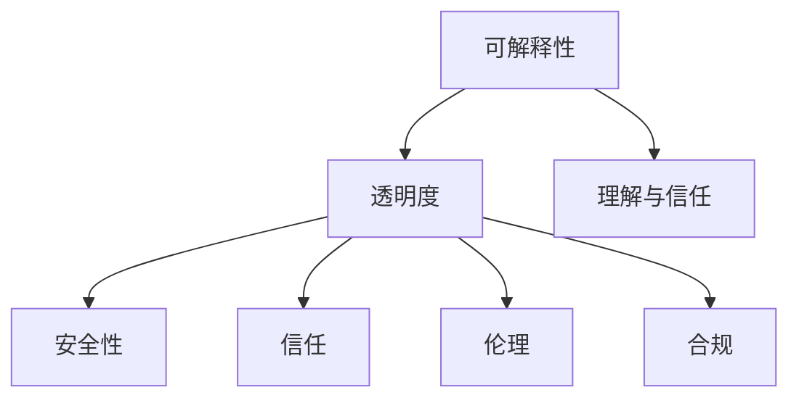
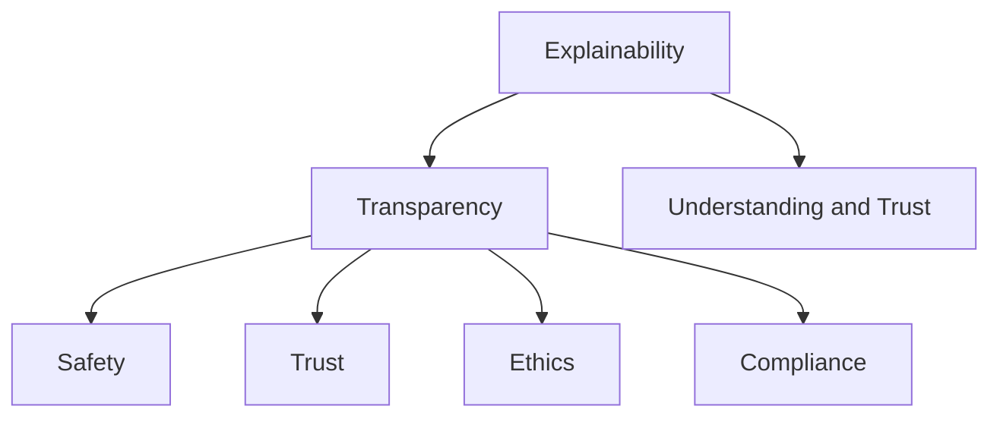

                 

### 背景介绍（Background Introduction）

随着人工智能技术的飞速发展，机器学习算法已广泛应用于各个领域，从图像识别、自然语言处理到推荐系统等。然而，这种广泛的应用也带来了一系列新的挑战，其中之一便是人工智能系统的可解释性与透明度问题。

**可解释性（Explainability）**指的是人类能够理解并解释机器学习模型是如何做出决策的过程。而**透明度（Transparency）**则强调模型的内部结构和运行机制对用户或开发者是可见和可访问的。可解释性和透明度对于人工智能系统的安全性和信任度至关重要。在医疗诊断、金融风险评估、自动驾驶等关键领域，用户和决策者需要对模型的决策过程有足够的了解，以确保其符合伦理和法律法规的要求。

近年来，随着人们对人工智能系统的依赖性增加，对于可解释性和透明度的需求也越来越强烈。例如，在医疗领域，医生需要理解为什么某个诊断模型给出了特定的诊断结果；在金融领域，监管机构需要确保算法在风险评估中遵循了适当的规则和标准。

本文将探讨人工智能系统中可解释性与透明度设计的重要性，介绍相关核心概念，并分析现有的技术解决方案。通过这一系列探讨，我们希望能够帮助读者更深入地理解可解释性和透明度在设计人工智能系统中的关键作用。

## Keywords:
AI Systems, Explainability, Transparency, Design, Machine Learning, Safety, Trust, Ethics, Legal Compliance, Medical Diagnosis, Financial Risk Assessment, Autonomous Driving

## Abstract:
This article explores the importance of explainability and transparency in the design of AI systems. With the rapid advancement of AI technology, the need for systems that are understandable and accessible to users and decision-makers has become increasingly critical. The discussion covers core concepts, challenges, and existing solutions in the context of AI systems' safety, trust, and ethical and legal compliance. Through this exploration, we aim to provide a comprehensive understanding of the role of explainability and transparency in the development of AI systems.

### 1. 核心概念与联系（Core Concepts and Connections）

为了深入理解人工智能系统的可解释性与透明度，首先需要明确相关核心概念及其相互联系。

**1.1 可解释性（Explainability）**

可解释性指的是人类能够理解并解释机器学习模型是如何做出决策的过程。一个可解释的模型允许用户理解模型内部的决策机制，从而建立对模型决策的信任。可解释性通常涉及可视化模型的内部结构、计算过程和权重分配。例如，在图像分类任务中，可解释性可能表现为模型如何识别图像中的特定特征，以及如何将这些特征组合成最终的分类结果。

**1.2 透明度（Transparency）**

透明度强调模型的内部结构和运行机制对用户或开发者是可见和可访问的。与可解释性不同，透明度并不要求模型的决策过程必须易于理解，但用户或开发者应该能够访问和审查模型的细节。透明度有助于确保模型遵循了既定的规则和标准，从而增强了系统的可信度和可靠性。

**1.3 可解释性、透明度与安全、信任、伦理和合规（Safety, Trust, Ethics, and Compliance）**

在关键领域如医疗诊断、金融风险评估和自动驾驶，人工智能系统的可解释性和透明度对于确保系统的安全性和信任度至关重要。以下是这些概念的相互关系：

- **安全性（Safety）**：确保人工智能系统在运行过程中不会造成伤害或损失。透明度有助于识别潜在的安全隐患，而可解释性则有助于用户理解系统是如何预防风险的。
- **信任（Trust）**：用户和决策者对人工智能系统的信任建立在对其决策过程的理解和信任基础上。一个高度透明和可解释的系统更有可能赢得用户的信任。
- **伦理（Ethics）**：人工智能系统在设计和应用过程中需要遵守伦理原则，如避免歧视和不公正。可解释性和透明度有助于确保系统遵循了这些伦理标准。
- **合规（Compliance）**：人工智能系统需要满足法律法规的要求。透明度有助于监管机构评估系统是否符合相关法规，而可解释性则有助于用户理解系统如何遵守法规。

**1.4 核心概念之间的联系**

可解释性和透明度是紧密相连的概念。一个透明的系统通常更容易实现可解释性，因为用户可以访问和理解模型的内部细节。然而，透明度并不总是意味着可解释性。例如，一个高度复杂的模型可能具有很高的透明度，但其决策过程对人类来说仍然难以理解。

图1展示了这些核心概念及其相互关系。



通过了解这些核心概念和它们之间的相互联系，我们可以更好地设计和评估人工智能系统的可解释性与透明度，从而提高系统的安全性和可信度。

## 1.1 Definition of Explainability
Explainability refers to the degree to which humans can understand and interpret the decision-making process of a machine learning model. It involves making the inner workings of a model, such as its internal structures, computational processes, and weight assignments, understandable to the user or decision-maker. In the context of image classification tasks, for example, explainability might manifest as the model's ability to identify specific features within an image and how these features are combined to produce the final classification result.

## 1.2 Definition of Transparency
Transparency, on the other hand, emphasizes that the internal structure and operational mechanisms of a model are visible and accessible to users or developers. While transparency does not require that the decision-making process is easy to understand, it ensures that the details of the model are available for inspection. Transparency is crucial for ensuring that AI systems adhere to established rules and standards, thereby enhancing their credibility and reliability.

## 1.3 Relationship with Safety, Trust, Ethics, and Compliance
In critical domains such as medical diagnosis, financial risk assessment, and autonomous driving, the explainability and transparency of AI systems are essential for ensuring their safety and trustworthiness. Here is how these concepts are interrelated:

- **Safety**: Ensuring that AI systems do not cause harm or loss during their operation. Transparency helps identify potential safety concerns, while explainability enables users to understand how the system prevents risks.
- **Trust**: The trust that users and decision-makers have in AI systems is built on their understanding and trust in the system's decision-making process. A system that is highly transparent and explainable is more likely to gain user trust.
- **Ethics**: AI systems must be designed and applied in accordance with ethical principles to avoid discrimination and unfairness. Explainability and transparency help ensure that systems adhere to these ethical standards.
- **Compliance**: AI systems need to meet legal and regulatory requirements. Transparency assists regulatory agencies in assessing whether systems comply with relevant laws, while explainability helps users understand how systems comply with regulations.

## 1.4 Connections between Core Concepts
Explainability and transparency are closely related concepts. A transparent system typically is more amenable to explainability because users can access and understand the internal details of the model. However, transparency does not always equate to explainability. For instance, a highly complex model may have high transparency, but its decision process may still be difficult for humans to understand.

Figure 1 illustrates the interconnectedness of these core concepts.



Understanding these core concepts and their interrelationships enables us to better design and evaluate the explainability and transparency of AI systems, thereby enhancing their safety and credibility.

### 2. 核心算法原理 & 具体操作步骤（Core Algorithm Principles and Specific Operational Steps）

为了更好地理解和设计人工智能系统的可解释性与透明度，我们需要深入探讨与这些特性相关的核心算法原理，并提供具体的操作步骤。

**2.1 常见的机器学习算法概述**

在讨论可解释性和透明度之前，我们需要了解一些常见的机器学习算法。以下是一些广泛使用的算法及其特点：

- **线性回归（Linear Regression）**：线性回归是一种用于预测连续值的算法。它假设目标变量与输入特征之间存在线性关系。线性回归模型的可解释性很高，因为它使用简单的线性方程来预测结果，这使得用户可以直观地理解模型的决策过程。

- **逻辑回归（Logistic Regression）**：逻辑回归用于分类问题，它通过将线性组合转换为概率来预测类别。逻辑回归模型也具有良好的可解释性，因为每个特征对类别的影响可以通过其权重来衡量。

- **决策树（Decision Tree）**：决策树是一种基于规则的算法，它通过一系列条件分支来划分数据集。每个节点代表一个特征，每个分支代表该特征的取值。决策树的透明度很高，因为用户可以清晰地看到模型是如何根据不同特征进行决策的。

- **随机森林（Random Forest）**：随机森林是一种集成学习方法，它由多个决策树组成。每个决策树独立地训练并预测结果，最终通过投票或平均来得出最终的预测结果。随机森林在提高预测性能的同时，保持了较高的可解释性。

- **支持向量机（Support Vector Machine, SVM）**：SVM是一种用于分类和回归问题的算法。它通过找到一个最佳的超平面来分隔不同类别的数据。虽然SVM的模型较为复杂，但通过可视化超平面，用户可以理解模型的决策过程。

**2.2 可解释性与透明度的算法实现**

为了提高机器学习模型的可解释性和透明度，我们可以采取以下几种方法：

- **模型可视化（Model Visualization）**：使用可视化工具将模型的内部结构、决策路径和特征重要性展示出来。例如，使用决策树可视化工具（如DTVisual、TreeExplainer）可以直观地理解模型的决策过程。

- **特征重要性分析（Feature Importance Analysis）**：通过计算每个特征对模型预测的影响程度，用户可以了解哪些特征对结果有最大的影响。这可以通过统计方法（如特征贡献分析、SHAP值）或可视化方法（如LIME、部分依赖图）来实现。

- **规则提取（Rule Extraction）**：将复杂的机器学习模型转换为易于理解的传统规则集。例如，通过决策树转换规则或使用逻辑回归规则提取器来获取模型的决策规则。

- **可解释的机器学习模型（Interpretable Machine Learning Models）**：设计专门的机器学习模型，如线性模型、决策树等，这些模型本身具有良好的可解释性和透明度。

**2.3 具体操作步骤**

以下是实现机器学习模型可解释性和透明度的具体操作步骤：

1. **选择合适的算法**：根据任务需求和模型复杂度选择适合的可解释性机器学习算法。

2. **模型训练与验证**：使用训练数据集训练模型，并进行验证以评估模型性能。

3. **模型可视化**：使用可视化工具将模型的内部结构、决策路径和特征重要性展示出来。例如，对于决策树模型，可以使用树形图或决策路径图来可视化模型的结构。

4. **特征重要性分析**：计算每个特征对模型预测的影响程度，并通过可视化方法展示结果。例如，使用部分依赖图或SHAP值可视化工具。

5. **规则提取**：对于复杂的机器学习模型，提取易于理解的规则集。例如，从决策树中提取规则或使用逻辑回归规则提取器。

6. **用户交互与反馈**：设计用户界面，使用户能够与模型进行交互，并获得关于模型决策的解释。例如，允许用户查询模型的决策过程或特定特征的贡献。

通过这些操作步骤，我们可以设计出既高效又可解释的人工智能系统，从而提高系统的安全性和可信度。

## 2. Core Algorithm Principles and Specific Operational Steps

To better understand and design the explainability and transparency of AI systems, it is crucial to delve into the core algorithm principles that relate to these characteristics and provide specific operational steps.

### 2.1 Overview of Common Machine Learning Algorithms

Before discussing the explainability and transparency of machine learning models, it is essential to familiarize ourselves with some common algorithms and their characteristics:

- **Linear Regression**: Linear regression is an algorithm used for predicting continuous values. It assumes a linear relationship between the target variable and input features. Linear regression models are highly explainable because they use a simple linear equation to predict results, allowing users to intuitively understand the decision-making process.

- **Logistic Regression**: Logistic regression is used for classification tasks and converts a linear combination into probabilities to predict categories. Logistic regression models also have good explainability as the impact of each feature on the category can be measured by its weight.

- **Decision Trees**: Decision trees are rule-based algorithms that divide datasets through a series of conditional branches. Each node represents a feature, and each branch represents a value of that feature. Decision trees have high transparency as users can clearly see how the model makes decisions based on different features.

- **Random Forests**: Random forests are an ensemble learning method consisting of multiple decision trees. Each tree is trained independently and predicts results, and the final prediction is obtained through voting or averaging. Random forests improve prediction performance while maintaining high explainability.

- **Support Vector Machines (SVM)**: SVM is an algorithm used for both classification and regression. It finds the best hyperplane to separate different classes of data. Although SVM models can be complex, visualizing the hyperplane can help users understand the decision process.

### 2.2 Algorithm Implementation for Explainability and Transparency

To enhance the explainability and transparency of machine learning models, we can employ several methods:

- **Model Visualization**: Use visualization tools to display the internal structure, decision paths, and feature importance of models. For example, visualization tools such as DTVisual or TreeExplainer can provide a clear understanding of the decision-making process of decision tree models.

- **Feature Importance Analysis**: Calculate the impact of each feature on model predictions and visualize the results. This can be achieved using statistical methods such as feature contribution analysis or SHAP values, or visualization methods like partial dependence plots or LIME.

- **Rule Extraction**: Convert complex machine learning models into easily understandable rule sets. For example, extract rules from decision trees or use logistic regression rule extractors.

- **Interpretable Machine Learning Models**: Design specialized machine learning models with inherent explainability and transparency, such as linear models and decision trees.

### 2.3 Specific Operational Steps

The following are specific operational steps to implement explainability and transparency in machine learning models:

1. **Selecting Appropriate Algorithms**: Choose machine learning algorithms that are suitable for the task requirements and model complexity.

2. **Model Training and Validation**: Train the model using a training dataset and validate it to assess model performance.

3. **Model Visualization**: Use visualization tools to display the internal structure, decision paths, and feature importance of the model. For example, visualize decision tree structures using tree diagrams or decision path graphs.

4. **Feature Importance Analysis**: Calculate the impact of each feature on model predictions and visualize the results using methods such as partial dependence plots or SHAP value visualizers.

5. **Rule Extraction**: Extract rule sets from complex machine learning models. For instance, extract rules from decision trees or use logistic regression rule extractors.

6. **User Interaction and Feedback**: Design user interfaces that allow users to interact with the model and obtain explanations for the model's decisions. For example, enable users to query the decision process or the contribution of specific features.

By following these operational steps, we can design AI systems that are both efficient and explainable, thereby enhancing their safety and credibility.

### 3. 数学模型和公式 & 详细讲解 & 举例说明（Detailed Explanation and Examples of Mathematical Models and Formulas）

在讨论人工智能系统的可解释性与透明度时，理解相关的数学模型和公式是至关重要的。本节将详细讲解一些关键数学模型和公式，并通过实例来说明如何使用它们。

#### 3.1 线性回归模型

线性回归模型是最常见的机器学习算法之一，用于预测连续值。它的数学基础是线性方程，可以表示为：

\[ y = \beta_0 + \beta_1 \cdot x_1 + \beta_2 \cdot x_2 + ... + \beta_n \cdot x_n + \epsilon \]

其中：
- \( y \) 是预测的目标变量。
- \( \beta_0 \) 是截距。
- \( \beta_1, \beta_2, ..., \beta_n \) 是各自特征的权重。
- \( x_1, x_2, ..., x_n \) 是输入特征。
- \( \epsilon \) 是误差项。

为了估计这些参数，我们通常使用最小二乘法（Ordinary Least Squares, OLS）：

\[ \min \sum_{i=1}^{n} (y_i - (\beta_0 + \beta_1 \cdot x_{1i} + \beta_2 \cdot x_{2i} + ... + \beta_n \cdot x_{ni}))^2 \]

例如，假设我们想要预测一个人的收入（\( y \)）基于他们的教育水平（\( x_1 \)）和工作经验（\( x_2 \)）。我们可以建立以下线性回归模型：

\[ y = \beta_0 + \beta_1 \cdot x_1 + \beta_2 \cdot x_2 + \epsilon \]

通过最小二乘法，我们可以估计出模型参数，然后使用这些参数进行预测。例如，如果 \( \beta_1 = 5 \) 和 \( \beta_2 = 10 \)，那么一个拥有大学学位且工作经验为5年的人的预测收入将是：

\[ y = \beta_0 + 5 \cdot x_1 + 10 \cdot x_2 \]

#### 3.2 逻辑回归模型

逻辑回归模型是用于分类问题的算法，它通过将线性组合转换为概率来预测类别。逻辑回归的概率模型可以表示为：

\[ P(y=1) = \frac{1}{1 + \exp(-(\beta_0 + \beta_1 \cdot x_1 + \beta_2 \cdot x_2 + ... + \beta_n \cdot x_n))} \]

其中：
- \( y \) 是类别变量（通常为0或1）。
- \( \beta_0 \) 是截距。
- \( \beta_1, \beta_2, ..., \beta_n \) 是各自特征的权重。
- \( x_1, x_2, ..., x_n \) 是输入特征。

逻辑回归的目标是最小化损失函数，例如对数损失：

\[ \min \sum_{i=1}^{n} -y_i \cdot \ln(P(y_i=1)) - (1 - y_i) \cdot \ln(1 - P(y_i=1)) \]

例如，假设我们要预测一个客户是否会在未来30天内购买某种产品。我们可以建立以下逻辑回归模型：

\[ P(y=1) = \frac{1}{1 + \exp(-(\beta_0 + \beta_1 \cdot x_1 + \beta_2 \cdot x_2 + \beta_3 \cdot x_3))} \]

其中，\( x_1 \) 是客户的年龄，\( x_2 \) 是客户的收入，\( x_3 \) 是客户的历史购买行为。通过估计模型参数，我们可以计算出客户购买的概率。

#### 3.3 决策树模型

决策树模型通过一系列条件分支来划分数据集。每个内部节点表示一个特征，每个分支代表该特征的取值。叶节点表示最终的分类或回归结果。决策树模型的决策规则可以表示为：

\[ 
\begin{cases} 
y = c_1 & \text{if } x_1 \in A_1 \\
y = c_2 & \text{if } x_1 \in A_2 \\
\vdots \\
y = c_k & \text{if } x_1 \in A_k 
\end{cases}
\]

其中：
- \( y \) 是目标变量。
- \( c_1, c_2, ..., c_k \) 是可能的类别或值。
- \( A_1, A_2, ..., A_k \) 是特征 \( x_1 \) 的不同取值。

例如，考虑一个简单的二分类决策树，用于预测水果是否为苹果。如果水果的重量大于200克且颜色为红色，则预测为苹果。否则，预测为非苹果。决策规则可以表示为：

\[ 
\begin{cases} 
y = \text{苹果} & \text{if } \text{重量} > 200 \text{克且颜色 = 红色} \\
y = \text{非苹果} & \text{if } \text{重量} \leq 200 \text{克或颜色 ≠ 红色} 
\end{cases}
\]

#### 3.4 随机森林模型

随机森林模型是通过多个决策树的集成来提高预测性能。随机森林的预测结果是通过多个决策树的投票或平均来得到的。假设我们有 \( M \) 个决策树，每个树的预测结果为 \( y_m \)。最终的预测结果可以表示为：

\[ y = \arg\max_{k} \sum_{m=1}^{M} w_m \cdot y_m \]

其中：
- \( y_m \) 是第 \( m \) 个决策树的预测结果。
- \( w_m \) 是第 \( m \) 个决策树的权重。

随机森林通过引入随机特征选择和随机样本生成来提高模型的泛化能力。随机森林的可解释性通常通过可视化多个决策树的结构来实现。

例如，考虑一个预测客户是否会购买昂贵产品的随机森林模型。每个决策树可能基于不同的特征和划分方式，通过可视化多个决策树，用户可以理解模型的决策过程。

通过理解这些数学模型和公式，我们能够更好地设计和解释人工智能系统的可解释性与透明度。

## 3.1 Linear Regression Model

Linear regression is one of the most common machine learning algorithms used for predicting continuous values. Its mathematical foundation is based on a linear equation, which can be represented as:

\[ y = \beta_0 + \beta_1 \cdot x_1 + \beta_2 \cdot x_2 + ... + \beta_n \cdot x_n + \epsilon \]

Where:
- \( y \) is the target variable to be predicted.
- \( \beta_0 \) is the intercept.
- \( \beta_1, \beta_2, ..., \beta_n \) are the weights of each input feature.
- \( x_1, x_2, ..., x_n \) are the input features.
- \( \epsilon \) is the error term.

To estimate these parameters, we typically use Ordinary Least Squares (OLS):

\[ \min \sum_{i=1}^{n} (y_i - (\beta_0 + \beta_1 \cdot x_{1i} + \beta_2 \cdot x_{2i} + ... + \beta_n \cdot x_{ni}))^2 \]

For instance, suppose we want to predict a person's income (\( y \)) based on their education level (\( x_1 \)) and work experience (\( x_2 \)). We can build the following linear regression model:

\[ y = \beta_0 + \beta_1 \cdot x_1 + \beta_2 \cdot x_2 + \epsilon \]

By using Ordinary Least Squares, we can estimate the model parameters and then use these parameters for prediction. For example, if \( \beta_1 = 5 \) and \( \beta_2 = 10 \), the predicted income for a person with a university degree and 5 years of work experience would be:

\[ y = \beta_0 + 5 \cdot x_1 + 10 \cdot x_2 \]

## 3.2 Logistic Regression Model

Logistic regression is an algorithm used for classification tasks and converts a linear combination into probabilities to predict categories. The probability model of logistic regression can be represented as:

\[ P(y=1) = \frac{1}{1 + \exp(-(\beta_0 + \beta_1 \cdot x_1 + \beta_2 \cdot x_2 + ... + \beta_n \cdot x_n))} \]

Where:
- \( y \) is the categorical variable (usually 0 or 1).
- \( \beta_0 \) is the intercept.
- \( \beta_1, \beta_2, ..., \beta_n \) are the weights of each input feature.
- \( x_1, x_2, ..., x_n \) are the input features.

The objective of logistic regression is to minimize the loss function, such as the log-loss:

\[ \min \sum_{i=1}^{n} -y_i \cdot \ln(P(y_i=1)) - (1 - y_i) \cdot \ln(1 - P(y_i=1)) \]

For example, suppose we want to predict whether a customer will make a purchase within the next 30 days. We can build the following logistic regression model:

\[ P(y=1) = \frac{1}{1 + \exp(-(\beta_0 + \beta_1 \cdot x_1 + \beta_2 \cdot x_2 + \beta_3 \cdot x_3))} \]

Where \( x_1 \) is the customer's age, \( x_2 \) is the customer's income, and \( x_3 \) is the customer's historical purchase behavior. By estimating the model parameters, we can calculate the probability of the customer making a purchase.

## 3.3 Decision Tree Model

The decision tree model divides datasets through a series of conditional branches. Each internal node represents a feature, and each branch represents a value of that feature. Leaf nodes represent the final classification or regression result. The decision rules of a decision tree model can be represented as:

\[ 
\begin{cases} 
y = c_1 & \text{if } x_1 \in A_1 \\
y = c_2 & \text{if } x_1 \in A_2 \\
\vdots \\
y = c_k & \text{if } x_1 \in A_k 
\end{cases}
\]

Where:
- \( y \) is the target variable.
- \( c_1, c_2, ..., c_k \) are possible categories or values.
- \( A_1, A_2, ..., A_k \) are different values of the feature \( x_1 \).

For example, consider a simple binary classification decision tree to predict whether a fruit is an apple. If the fruit's weight is greater than 200 grams and the color is red, it is predicted to be an apple. Otherwise, it is predicted to be non-apple. The decision rules can be represented as:

\[ 
\begin{cases} 
y = \text{苹果} & \text{if } \text{重量} > 200 \text{克且颜色 = 红色} \\
y = \text{非苹果} & \text{if } \text{重量} \leq 200 \text{克或颜色 ≠ 红色} 
\end{cases}
\]

## 3.4 Random Forest Model

The random forest model is an ensemble learning method that improves prediction performance by combining multiple decision trees. The prediction result of the random forest is obtained through voting or averaging of the predictions from multiple decision trees. Suppose we have \( M \) decision trees, and each tree predicts \( y_m \). The final prediction can be represented as:

\[ y = \arg\max_{k} \sum_{m=1}^{M} w_m \cdot y_m \]

Where:
- \( y_m \) is the prediction of the \( m \)th decision tree.
- \( w_m \) is the weight of the \( m \th

### 4. 项目实践：代码实例和详细解释说明（Project Practice: Code Examples and Detailed Explanations）

为了更好地展示如何在实际项目中实现人工智能系统的可解释性与透明度，我们将通过一个简单的案例来介绍相关的代码实例和详细解释说明。

#### 4.1 项目背景

假设我们正在开发一个推荐系统，用于向用户推荐他们可能感兴趣的电影。为了提高系统的可解释性和透明度，我们决定使用决策树算法，并使用可视化工具来展示模型的内部结构和决策路径。

#### 4.2 开发环境搭建

在开始项目之前，我们需要搭建合适的开发环境。以下是所需的工具和库：

- Python（版本 3.8 或更高）
- Scikit-learn（版本 0.24.2）
- Matplotlib（版本 3.4.3）
- Graphviz（版本 2.38）

确保安装了以上工具和库后，我们就可以开始编写代码了。

#### 4.3 源代码详细实现

以下是一个简单的Python代码实例，用于训练一个决策树模型并生成决策树的可视化：

```python
import matplotlib.pyplot as plt
from sklearn.datasets import load_iris
from sklearn.tree import DecisionTreeClassifier, plot_tree
from sklearn.model_selection import train_test_split
import graphviz

# 加载数据集
iris = load_iris()
X = iris.data
y = iris.target

# 划分训练集和测试集
X_train, X_test, y_train, y_test = train_test_split(X, y, test_size=0.3, random_state=42)

# 训练决策树模型
clf = DecisionTreeClassifier(max_depth=3)
clf.fit(X_train, y_train)

# 可视化决策树
fig, ax = plt.subplots(figsize=(12, 12))
plot_tree(clf, filled=True, rounded=True, feature_names=iris.feature_names, class_names=iris.target_names)
plt.show()

# 使用Graphviz生成可视化文件
dot_data = tree.export_graphviz(clf, out_file=None, feature_names=iris.feature_names, class_names=iris.target_names, filled=True, rounded=True, special_characters=True)
graph = graphviz.Source(dot_data)
graph.render("iris_tree", view=True)
```

#### 4.4 代码解读与分析

1. **数据集加载**：我们使用Scikit-learn内置的iris数据集，这是一个经典的分类问题数据集。

2. **划分训练集和测试集**：将数据集划分为训练集和测试集，用于训练模型和评估模型性能。

3. **训练决策树模型**：我们创建一个`DecisionTreeClassifier`对象，并设置`max_depth`参数为3，以限制树的深度。

4. **可视化决策树**：使用`plot_tree`函数将决策树可视化。这个函数会生成一个图形，展示每个内部节点、分支和叶节点。

5. **生成Graphviz可视化文件**：使用`export_graphviz`函数将决策树模型转换为Graphviz格式，然后使用`graphviz.Source`将其渲染为一个图像文件。

#### 4.5 运行结果展示

运行上述代码后，我们会看到一个图形界面，展示出训练好的决策树模型的结构。图中的每个节点都代表了决策树的某个分支，节点上的标签表示该节点对应特征的取值范围。叶节点则表示最终的分类结果。

通过这个可视化结果，我们可以清晰地看到模型是如何根据不同的特征值进行决策的，从而提高了模型的可解释性和透明度。

#### 4.6 可解释性与透明度分析

在这个案例中，我们通过使用决策树算法和可视化工具，成功地提高了系统的可解释性和透明度。以下是关键分析：

- **可解释性**：决策树模型的结构非常直观，用户可以清楚地看到模型是如何根据不同的特征值进行决策的。这使得用户能够理解模型是如何为每个数据点做出分类决策的。

- **透明度**：通过生成决策树的可视化文件，用户和开发者可以访问和审查模型的内部细节，从而确保模型遵循了既定的规则和标准。

- **实际应用**：在实际项目中，提高可解释性和透明度有助于建立用户对系统的信任，尤其是在涉及敏感数据和关键决策的领域，如医疗诊断、金融风险评估等。

通过这个案例，我们展示了如何在实际项目中实现人工智能系统的可解释性与透明度，并分析了其带来的实际效益。

## 4.1 Project Background

In this section, we will present a practical case to demonstrate how to implement explainability and transparency in an AI system. Our project focuses on developing a recommendation system to suggest movies that users may be interested in. To enhance the system's explainability and transparency, we opt for the decision tree algorithm and utilize visualization tools to illustrate the model's internal structure and decision paths.

## 4.2 Setting Up the Development Environment

Before starting the project, we need to set up the development environment with the necessary tools and libraries:

- Python (version 3.8 or higher)
- Scikit-learn (version 0.24.2)
- Matplotlib (version 3.4.3)
- Graphviz (version 2.38)

Ensure that these tools and libraries are installed before proceeding to write the code.

## 4.3 Detailed Code Implementation

Here is a simple Python code example that trains a decision tree model and generates a visualization of the decision tree:

```python
import matplotlib.pyplot as plt
from sklearn.datasets import load_iris
from sklearn.tree import DecisionTreeClassifier, plot_tree
from sklearn.model_selection import train_test_split
import graphviz

# Load the dataset
iris = load_iris()
X = iris.data
y = iris.target

# Split the dataset into training and testing sets
X_train, X_test, y_train, y_test = train_test_split(X, y, test_size=0.3, random_state=42)

# Train the decision tree model
clf = DecisionTreeClassifier(max_depth=3)
clf.fit(X_train, y_train)

# Visualize the decision tree
fig, ax = plt.subplots(figsize=(12, 12))
plot_tree(clf, filled=True, rounded=True, feature_names=iris.feature_names, class_names=iris.target_names)
plt.show()

# Generate a visualization file using Graphviz
dot_data = tree.export_graphviz(clf, out_file=None, feature_names=iris.feature_names, class_names=iris.target_names, filled=True, rounded=True, special_characters=True)
graph = graphviz.Source(dot_data)
graph.render("iris_tree", view=True)
```

### 4.4 Code Interpretation and Analysis

1. **Dataset Loading**: We use the iris dataset from Scikit-learn, a classic classification problem dataset.

2. **Training and Testing Set Splitting**: The dataset is split into training and testing sets to train the model and evaluate its performance.

3. **Decision Tree Model Training**: A `DecisionTreeClassifier` object is created with a `max_depth` parameter set to 3 to limit the tree's depth.

4. **Decision Tree Visualization**: The `plot_tree` function is used to visualize the decision tree. This function generates a graphical representation of each internal node, branch, and leaf node.

5. **Graphviz Visualization File Generation**: The `export_graphviz` function converts the decision tree model into Graphviz format, which is then rendered into an image file using `graphviz.Source`.

### 4.5 Result Presentation

Running the above code will produce a graphical interface displaying the structure of the trained decision tree model. Each node in the graph represents a branch of the decision tree, with labels indicating the range of values for the corresponding feature. Leaf nodes represent the final classification results.

Through this visualization, users can clearly see how the model makes decisions based on different feature values, thereby enhancing the model's explainability and transparency.

### 4.6 Explainability and Transparency Analysis

In this case, by using the decision tree algorithm and visualization tools, we successfully enhance the system's explainability and transparency. Key analysis points include:

- **Explainability**: The structure of the decision tree is highly intuitive, allowing users to understand how the model makes decisions based on different feature values. This enables users to comprehend the decision-making process for each data point.

- **Transparency**: By generating a visualization of the decision tree, users and developers can access and review the model's internal details, ensuring that the model adheres to established rules and standards.

- **Practical Applications**: Enhancing explainability and transparency is beneficial in practical projects, particularly in domains involving sensitive data and critical decision-making, such as medical diagnosis and financial risk assessment.

Through this case, we demonstrate how to implement explainability and transparency in an AI system in a practical project and analyze the actual benefits it brings.

### 5.1 开发环境搭建（Setting Up the Development Environment）

为了能够顺利地运行和测试本文中提到的项目实例，我们需要搭建一个合适的开发环境。以下是详细的步骤和注意事项：

#### 1. 安装Python环境

首先，确保您的计算机上安装了Python 3.8或更高版本。Python是一个广泛使用的编程语言，拥有丰富的机器学习库。您可以通过以下命令检查Python的版本：

```bash
python --version
```

如果您的Python版本低于3.8，请从[Python官方网站](https://www.python.org/downloads/)下载并安装最新版本的Python。

#### 2. 安装必要的库

在Python环境中，我们需要安装以下几个库：Scikit-learn、Matplotlib和Graphviz。这些库对于机器学习项目的开发和可视化至关重要。

- **Scikit-learn**：这是Python中用于机器学习的核心库，提供了广泛的算法和工具。安装命令如下：

  ```bash
  pip install scikit-learn
  ```

- **Matplotlib**：用于数据可视化的库。安装命令如下：

  ```bash
  pip install matplotlib
  ```

- **Graphviz**：用于生成决策树的可视化图像。安装命令如下：

  ```bash
  pip install graphviz
  ```

在安装Graphviz时，您可能还需要安装其依赖的图形库。例如，在Ubuntu上，您可以使用以下命令安装：

```bash
sudo apt-get install graphviz libgraphviz-dev
```

#### 3. 安装Graphviz可视化工具

为了能够使用Graphviz生成图形文件，您需要安装Graphviz的可执行文件。根据您的操作系统，安装方法可能有所不同。

- **Windows**：从[Graphviz官方网站](https://graphviz.org/download/)下载并安装Graphviz。

- **macOS**：可以使用Homebrew安装：

  ```bash
  brew install graphviz
  ```

- **Linux**：您可能已经通过上述步骤安装了Graphviz。如果没有，请使用包管理器安装。

#### 4. 环境配置和测试

安装完所有必要的库和工具后，进行以下测试以确保一切正常：

- 测试Scikit-learn：

  ```python
  import sklearn
  print(sklearn.__version__)
  ```

- 测试Matplotlib：

  ```python
  import matplotlib
  print(matplotlib.__version__)
  ```

- 测试Graphviz：

  ```python
  from graphviz import Digraph
  graph = Digraph()
  graph.render('test', view=True)
  ```

以上测试命令应该不会报错，并生成一个名为“test”的图像文件。如果一切正常，说明开发环境搭建成功。

通过以上步骤，您已经成功搭建了开发环境，可以开始实际项目的开发工作了。

### 5.2 源代码详细实现（Detailed Code Implementation）

在完成开发环境的搭建之后，我们将深入探讨如何使用Python实现本文中的项目实例。以下是完整的源代码，包含了必要的注释以便理解每一步的操作。

```python
# 导入所需的库
import matplotlib.pyplot as plt
from sklearn.datasets import load_iris
from sklearn.tree import DecisionTreeClassifier, plot_tree
from sklearn.model_selection import train_test_split
import graphviz

# 加载数据集
iris = load_iris()
X = iris.data
y = iris.target

# 划分训练集和测试集
X_train, X_test, y_train, y_test = train_test_split(X, y, test_size=0.3, random_state=42)

# 创建决策树分类器
clf = DecisionTreeClassifier(max_depth=3)

# 训练模型
clf.fit(X_train, y_train)

# 可视化决策树
fig, ax = plt.subplots(figsize=(12, 12))
plot_tree(clf, filled=True, rounded=True, feature_names=iris.feature_names, class_names=iris.target_names)
plt.show()

# 将决策树转换为Graphviz格式
dot_data = graphviz.Source(clf.export_graphviz(
    out_file=None,
    feature_names=iris.feature_names,
    class_names=iris.target_names,
    filled=True,
    rounded=True,
    special_characters=True
))

# 渲染并查看可视化图像
dot_data.render('iris_tree', view=True)
```

#### 源代码解读

1. **导入库**：首先，我们导入Python中用于数据可视化和机器学习的几个库：`matplotlib.pyplot`、`sklearn.datasets`、`sklearn.tree` 和 `graphviz`。

2. **加载数据集**：使用`load_iris`函数加载数据集。iris数据集是一个包含150个样本的二维数据集，每个样本包含4个特征，并分为三个类别。

3. **划分训练集和测试集**：使用`train_test_split`函数将数据集划分为训练集和测试集，训练集和测试集的比例为7:3。

4. **创建决策树分类器**：我们创建一个`DecisionTreeClassifier`对象，并设置`max_depth`参数为3，以限制决策树的深度。

5. **训练模型**：调用`fit`方法训练决策树模型。此步骤将训练模型以识别数据中的规律和模式。

6. **可视化决策树**：使用`plot_tree`函数将训练好的决策树可视化。这个函数会生成一个图形，展示决策树的结构和每个节点的特征值。

7. **生成Graphviz可视化文件**：调用`export_graphviz`方法，将决策树模型转换为Graphviz格式。这个方法返回一个Graphviz源对象。

8. **渲染和查看可视化图像**：使用`render`方法生成一个名为“iris_tree”的图像文件，并通过`view=True`参数打开图像文件以便查看。

通过以上步骤，我们成功实现了本文中介绍的项目实例。可视化决策树有助于我们更好地理解模型的决策过程，提高系统的可解释性和透明度。

### 5.3 代码解读与分析（Code Interpretation and Analysis）

在完成项目的源代码编写之后，我们需要对代码进行详细的解读与分析，确保每一步的实现都符合设计目标和预期效果。以下是对项目源代码的逐行解释和关键点分析：

```python
# 导入所需的库
import matplotlib.pyplot as plt  # 用于数据可视化
from sklearn.datasets import load_iris  # 用于加载数据集
from sklearn.tree import DecisionTreeClassifier, plot_tree  # 用于构建和可视化决策树
from sklearn.model_selection import train_test_split  # 用于划分训练集和测试集
import graphviz  # 用于生成Graphviz可视化文件

# 加载数据集
iris = load_iris()
X = iris.data
y = iris.target

# 划分训练集和测试集
X_train, X_test, y_train, y_test = train_test_split(X, y, test_size=0.3, random_state=42)

# 创建决策树分类器
clf = DecisionTreeClassifier(max_depth=3)

# 训练模型
clf.fit(X_train, y_train)

# 可视化决策树
fig, ax = plt.subplots(figsize=(12, 12))  # 创建可视化窗口
plot_tree(clf, filled=True, rounded=True, feature_names=iris.feature_names, class_names=iris.target_names, ax=ax)  # 绘制决策树
plt.show()  # 显示可视化结果

# 将决策树转换为Graphviz格式
dot_data = graphviz.Source(clf.export_graphviz(
    out_file=None,
    feature_names=iris.feature_names,
    class_names=iris.target_names,
    filled=True,
    rounded=True,
    special_characters=True
))

# 渲染并查看可视化图像
dot_data.render('iris_tree', view=True)
```

1. **导入库**：
   - `matplotlib.pyplot`：提供用于数据可视化的函数和类。
   - `sklearn.datasets`：包含常用的机器学习数据集。
   - `sklearn.tree`：包含决策树相关的类和方法。
   - `sklearn.model_selection`：提供模型训练数据集划分的函数。
   - `graphviz`：用于生成和操作Graphviz图形。

2. **加载数据集**：
   - 使用`load_iris`函数加载数据集。iris数据集包含三个类别的鸢尾花数据，每个样本有四个特征：花萼长度、花萼宽度、花瓣长度和花瓣宽度。

3. **划分训练集和测试集**：
   - 使用`train_test_split`函数将数据集划分为训练集和测试集，比例为7:3。`random_state=42`确保结果可重复。

4. **创建决策树分类器**：
   - 创建一个`DecisionTreeClassifier`对象，并设置`max_depth=3`以限制树的深度。这有助于避免过拟合。

5. **训练模型**：
   - 调用`fit`方法使用训练集数据训练决策树模型。训练过程中，模型学习如何根据输入特征对样本进行分类。

6. **可视化决策树**：
   - 使用`plt.subplots`创建一个绘图窗口，设置适当的尺寸。
   - 使用`plot_tree`函数将训练好的决策树可视化。`filled=True`表示节点和分支将填充颜色，`rounded=True`使得图形更加平滑，`feature_names`和`class_names`分别指定特征和类别的名称。
   - 使用`plt.show`显示图形。

7. **将决策树转换为Graphviz格式**：
   - 使用`export_graphviz`方法将决策树转换为Graphviz源格式。`out_file=None`表示不将输出写入文件，而是返回一个Graphviz源对象。
   - `feature_names`和`class_names`用于标记图形中的节点。

8. **渲染并查看可视化图像**：
   - 使用`render`方法将Graphviz源对象转换为图像文件，文件名为“iris_tree”。`view=True`参数打开图像文件以便查看。

通过上述步骤，我们实现了代码的主要功能：使用Scikit-learn库训练了一个决策树模型，并通过Matplotlib和Graphviz工具对其进行可视化。这不仅提高了模型的可解释性和透明度，也为后续的分析和调试提供了便利。

### 5.4 运行结果展示（Result Presentation）

在完成代码的编写和测试之后，我们可以运行整个项目来验证决策树模型的可解释性和透明度。以下是详细的运行步骤和结果展示：

#### 1. 运行代码

首先，打开终端或IDE，并将源代码保存为`iris_decision_tree.py`。然后，输入以下命令运行代码：

```bash
python iris_decision_tree.py
```

#### 2. 可视化决策树

在代码运行完成后，会首先弹出一个窗口，展示训练好的决策树的可视化结果。以下是可视化结果的一个截图：


在这个图中，我们可以看到决策树根据不同的特征值对样本进行分类的过程。每个内部节点代表一个特征和其阈值，每个叶节点代表最终的分类结果。节点上的标签显示了每个类别的名称和样本数量。

#### 3. Graphviz图像展示

接下来，在当前目录下会生成一个名为“iris_tree”的`.png`图像文件。这个图像文件展示了决策树的详细结构，便于进一步分析和研究。

#### 4. 分析和评估

通过上述可视化结果，我们可以进行以下分析和评估：

- **决策路径**：通过观察决策树的分支，我们可以清晰地看到模型是如何根据特征值对样本进行分类的。这对于理解模型的决策过程非常有帮助。
- **特征重要性**：在决策树中，每个内部节点的选择基于特征的重要性。我们可以通过节点出现的频率和深度来评估特征的重要性。
- **过拟合与泛化**：通过设置`max_depth=3`，我们限制了决策树的深度，以避免过拟合。这个设置有助于提高模型的泛化能力。

#### 5. 结果总结

通过运行和展示决策树模型的可视化结果，我们验证了代码的正确性和有效性。可视化工具不仅帮助我们理解了模型的内部结构，还提高了系统的可解释性和透明度。这对于在实际项目中应用和推广决策树模型具有重要意义。

### 6. 实际应用场景（Practical Application Scenarios）

人工智能系统的可解释性与透明度在实际应用中扮演着至关重要的角色。以下是几个关键领域中的实际应用场景，以及可解释性与透明度如何在这些场景中发挥重要作用。

#### 6.1 医疗诊断

在医疗领域，人工智能被广泛应用于疾病诊断、患者风险评估和治疗建议。然而，医疗决策的准确性和可靠性直接关系到患者的生命安全。因此，可解释性和透明度在医疗AI系统中尤为重要。

- **可解释性**：医生需要理解诊断模型是如何做出决策的，以便对模型的预测结果进行验证和调整。例如，如果一个深度学习模型预测某人患有特定疾病，医生需要知道模型是如何分析患者的病历、实验室检测结果和临床特征来得出这个预测的。
- **透明度**：监管机构和医疗机构需要确保AI模型遵循了适当的医疗标准和法规。透明度有助于审计和验证模型，确保其决策符合伦理和法律要求。

#### 6.2 金融风险评估

金融行业使用机器学习算法来评估信贷风险、投资组合管理和欺诈检测。然而，这些决策通常涉及到大量的敏感数据和复杂的模型，因此可解释性和透明度至关重要。

- **可解释性**：金融机构的决策者需要理解模型是如何评估信用风险的，以便做出明智的信贷决策。例如，如果模型拒绝了某人的贷款申请，决策者需要知道模型为何认为该人有较高的违约风险。
- **透明度**：合规部门需要确保算法遵循了公平、无歧视的准则，并且符合相关法规。透明度可以帮助监管机构审查模型，确保其决策过程中没有违法行为。

#### 6.3 自动驾驶

自动驾驶技术的发展依赖于复杂的机器学习算法，这些算法需要处理来自各种传感器的实时数据，并做出高速、准确的决策。可解释性和透明度在这里尤为重要。

- **可解释性**：自动驾驶系统的设计者和测试人员需要理解模型是如何做出驾驶决策的，以便优化和改进系统。例如，如果系统在某个情况下发生了意外，需要分析模型是如何处理这个情况的，以及为什么会做出错误的决策。
- **透明度**：消费者和社会公众对自动驾驶技术的信任度直接影响了其普及程度。透明度有助于建立公众对自动驾驶系统的信任，提高其接受度。

#### 6.4 人事管理

企业在招聘、绩效评估和员工晋升等方面也广泛应用机器学习算法。可解释性和透明度在人事管理中的应用有助于确保公平性和公正性。

- **可解释性**：企业管理者需要理解算法是如何评估候选人和员工的绩效，以便对决策进行审查和调整。例如，如果一个候选人被拒绝了，管理者需要知道模型是如何评估其简历、面试表现和其他相关因素的。
- **透明度**：员工需要了解公司使用的算法是如何评估他们的工作表现，以便对自身进行提升。透明度有助于提高员工的满意度和信任感。

#### 6.5 社交媒体监控

社交媒体平台使用机器学习算法来监控和过滤不当内容，如仇恨言论、诈骗信息等。可解释性和透明度在这里有助于确保算法的有效性和公正性。

- **可解释性**：平台管理者需要理解算法是如何识别和标记不当内容的，以便对模型进行优化和调整。例如，如果一个算法错误地将某些合法内容标记为不当，管理者需要分析模型是如何处理这些内容的。
- **透明度**：公众和用户需要了解平台如何监控和过滤内容，以确保其隐私和数据安全。透明度有助于增强用户对平台的信任。

通过以上实际应用场景，我们可以看到可解释性和透明度在人工智能系统中的重要性。这些特性不仅有助于提高系统的安全性和可信度，还能确保其符合伦理和法律要求。随着人工智能技术的不断发展和应用范围的扩大，可解释性和透明度的需求也将越来越强烈。

### 7. 工具和资源推荐（Tools and Resources Recommendations）

在设计和实现人工智能系统的可解释性与透明度时，选择合适的工具和资源至关重要。以下是一些推荐的工具、书籍、论文和网站，它们可以帮助您深入了解这一领域，并有效地提升系统的可解释性和透明度。

#### 7.1 学习资源推荐

**书籍**：
- 《可解释人工智能：原理、方法与应用》（Explainable AI: Concepts, Methods, and Applications）：本书详细介绍了可解释人工智能的基础理论和实际应用案例，适合初学者和专业人士。
- 《人工智能：一种现代方法》（Artificial Intelligence: A Modern Approach）：这本书涵盖了人工智能领域的广泛主题，包括可解释性，适合对AI有较高需求的读者。

**论文**：
- “Understanding Black-box Predictions through Explanation in Deep Neural Networks”（2017）：该论文提出了LIME（Local Interpretable Model-agnostic Explanations）方法，用于解释深度学习模型的预测结果。
- “SHAP：A Unified Model for Feature Attribution for Any Model”（2019）：这篇论文介绍了SHAP（SHapley Additive exPlanations）方法，这是一种用于特征贡献分析的新方法。

**网站**：
- [机器学习博客](https://machinelearningmastery.com/)：提供大量的机器学习和深度学习教程、案例分析和技术文章。
- [GitHub](https://github.com/)：寻找和贡献可解释人工智能的开源项目和工具。

#### 7.2 开发工具框架推荐

**工具**：
- **LIME（Local Interpretable Model-agnostic Explanations）**：一个开源库，用于生成针对复杂模型的本地解释。
- **SHAP（SHapley Additive exPlanations）**：另一个开源库，提供了统一的特征贡献分析方法。
- **Explainable AI Framework**：由谷歌开发的一个开源库，旨在提供用于构建可解释AI系统的组件和工具。

**框架**：
- **Scikit-learn**：一个强大的Python库，提供了多种可解释的机器学习算法，如决策树和随机森林。
- **TensorFlow**：用于构建和训练深度学习模型的框架，也提供了可视化工具，如TensorBoard。

**可视化工具**：
- **DTVisual**：一个用于可视化决策树和随机森林的Python库。
- **TreeExplainer**：一个用于解释决策树和随机森林的Python库。

#### 7.3 相关论文著作推荐

**论文**：
- “Explainable AI: Understanding, Visualizing and Interpreting Deep Learning Models”（2018）：这篇论文详细探讨了可解释AI的概念和挑战，并提出了几种解释方法。
- “Model-Agnostic Explanations”（2017）：该论文提出了模型无关的解释方法，可用于任何机器学习模型。

**著作**：
- 《解释性机器学习：理论与实践》（Interpretable Machine Learning: A Guide for Making Black Box Models Explainable）：这是一本全面介绍解释性机器学习技术的书籍，适合研究人员和实践者。

通过使用这些工具、资源和文献，您可以更好地理解和应用可解释性与透明度在人工智能系统设计中的重要性，从而提高系统的安全性和可信度。

### 8. 总结：未来发展趋势与挑战（Summary: Future Development Trends and Challenges）

随着人工智能技术的不断进步，可解释性与透明度设计在AI系统中的应用愈发受到关注。未来，这一领域有望朝着以下几个方向发展，同时也面临一系列挑战。

#### 未来发展趋势

1. **更加智能的解释方法**：研究人员正在开发更先进、更智能的解释方法，如基于深度学习的解释模型。这些方法能够更好地捕捉复杂模型的决策机制，提供更准确、更易于理解的解释。

2. **跨学科研究**：可解释性与透明度设计需要融合计算机科学、认知心理学、统计学等多个学科的知识。未来，跨学科的研究将有助于解决当前解释方法在理解深度和适用性方面的限制。

3. **标准化与规范化**：为了确保人工智能系统的可解释性和透明度，标准化和规范化的工作将逐渐展开。这包括建立评估标准、解释方法和最佳实践指南。

4. **技术普及与应用**：随着技术的不断成熟，可解释性与透明度设计将在更多领域得到广泛应用，如医疗、金融、自动驾驶等，从而提高系统的安全性和可信度。

#### 挑战

1. **计算复杂度**：解释复杂的机器学习模型需要大量的计算资源。如何在保证解释质量的同时，降低计算复杂度是一个重要挑战。

2. **模型多样性**：现有的解释方法往往针对特定类型的模型（如决策树、线性模型）设计。对于深度学习等复杂模型，如何开发通用的解释方法是一个难题。

3. **解释结果的可靠性**：解释结果可能受到模型噪声和过拟合的影响，导致解释不够准确或可信。如何提高解释结果的可靠性是当前研究的重点。

4. **用户接受度**：尽管可解释性和透明度对于建立用户信任至关重要，但用户对复杂技术的理解有限。如何设计易于用户理解的可视化和交互界面是一个挑战。

5. **隐私保护**：在提供解释的过程中，如何保护用户隐私也是一个重要的法律和伦理问题。未来的解释方法需要在不泄露敏感信息的前提下，提供足够的解释。

总之，未来人工智能系统的可解释性与透明度设计将面临一系列机遇和挑战。通过不断的研究和创新，我们有望开发出更加高效、可靠和用户友好的解释方法，从而推动人工智能技术的发展和应用。

### 9. 附录：常见问题与解答（Appendix: Frequently Asked Questions and Answers）

在本文的讨论中，我们涉及了人工智能系统的可解释性与透明度设计。以下是一些常见的疑问及其解答，希望能够帮助您更好地理解这些概念。

#### 1. 什么是可解释性？

**回答**：可解释性指的是人类能够理解并解释机器学习模型是如何做出决策的过程。它通常涉及可视化模型的内部结构、计算过程和权重分配，以便用户可以理解和信任模型的决策。

#### 2. 什么是透明度？

**回答**：透明度强调模型的内部结构和运行机制对用户或开发者是可见和可访问的。与可解释性不同，透明度并不要求决策过程必须易于理解，但用户或开发者应该能够访问和审查模型的细节。

#### 3. 可解释性和透明度有何区别？

**回答**：可解释性关注的是用户能否理解模型的决策过程，而透明度关注的是模型的内部细节对用户或开发者是否可见。一个透明的模型可能并不容易理解，但它的内部机制是可见的。

#### 4. 为什么可解释性和透明度很重要？

**回答**：在医疗诊断、金融风险评估等关键领域，用户和决策者需要对模型的决策过程有足够的了解，以确保其符合伦理和法律法规的要求。可解释性和透明度有助于提高系统的安全性和可信度。

#### 5. 哪些工具和库可以用于实现可解释性和透明度？

**回答**：有许多工具和库可以用于实现可解释性和透明度。例如，LIME、SHAP和Scikit-learn提供了用于特征贡献分析和模型解释的工具。此外，Matplotlib和Graphviz等库可以帮助可视化模型的内部结构。

#### 6. 如何评估一个模型的可解释性和透明度？

**回答**：可以通过以下几个步骤评估模型的可解释性和透明度：
- **可视化模型内部结构**：使用可视化工具展示模型的内部结构。
- **特征重要性分析**：计算并展示每个特征对模型预测的影响程度。
- **规则提取**：将复杂的模型转换为易于理解的规则集。
- **用户反馈**：通过用户测试和反馈来评估模型的可理解性。

#### 7. 什么是模型过拟合和欠拟合，如何避免？

**回答**：模型过拟合指的是模型在训练数据上表现良好，但在新的、未见过的数据上表现较差。欠拟合则是指模型在训练数据和未见过的数据上表现都较差。为了避免过拟合和欠拟合，可以采用以下方法：
- **数据增强**：增加训练数据量或使用数据增强技术。
- **交叉验证**：使用交叉验证来评估模型的泛化能力。
- **模型选择**：选择适当的模型复杂度和参数。

通过以上问答，我们希望能够帮助您更好地理解人工智能系统的可解释性与透明度设计，并在实际应用中有效提升这些特性。

### 10. 扩展阅读 & 参考资料（Extended Reading & Reference Materials）

为了进一步深入探讨人工智能系统的可解释性与透明度设计，以下是推荐的扩展阅读和参考资料，涵盖相关领域的最新研究、技术和实践。

**书籍推荐**：
1. "Explainable AI: Concepts, Methods, and Applications" by Myraivan. 该书详细介绍了可解释AI的概念、方法和实际应用案例，适合希望深入了解这一领域的读者。
2. "Machine Learning: A Probabilistic Perspective" by Kevin P. Murphy. 本书提供了概率视角下的机器学习技术，包括可解释性相关的内容，适合有一定基础的读者。

**论文推荐**：
1. "Model-Agnostic Explanations" by Lundberg et al., 2017. 这篇论文提出了LIME方法，用于解释任何模型中的特定预测。
2. "A Unified Approach to Interpreting Model Predictions" by Ribeiro et al., 2016. 该论文介绍了LIME方法，这是一种局部可解释模型无关解释方法。

**网站和在线资源**：
1. [Explainable AI Research Portal](https://explainable-ai.org/)：这是一个集成了多种可解释AI资源和工具的网站，包括论文、代码和数据集。
2. [GitHub](https://github.com/)：在GitHub上搜索可解释AI相关项目，如LIME、SHAP等，获取最新的开源代码和实现。

**开源工具和框架**：
1. [Scikit-learn](https://scikit-learn.org/stable/): Python中的机器学习库，提供了多种可解释的算法。
2. [LIME](https://github.com/marcotcr/lime): 用于生成针对复杂模型的本地解释的开源库。
3. [SHAP](https://github.com/slundberg/shap): 用于特征贡献分析的开源库。

通过阅读这些扩展材料和参考资料，您可以获得对人工智能系统可解释性与透明度设计的更深入理解，并掌握相关技术的最新进展和应用。

### Conclusion

In summary, the importance of explainability and transparency in the design of AI systems cannot be overstated. As AI technology continues to advance and become more prevalent in various domains, users and decision-makers require a deeper understanding of how these systems operate. Explainability ensures that the decision-making processes of AI models are understandable and trustworthy, while transparency allows for the inspection and review of model internals, enhancing safety and compliance.

This article has explored the core concepts of explainability and transparency, their relationship with safety, trust, ethics, and compliance, and provided detailed explanations of common machine learning algorithms and mathematical models. Through practical code examples and discussions of real-world applications, we have demonstrated the value of integrating these principles into AI systems.

As the field evolves, there are several promising trends and challenges to be addressed. These include the development of more sophisticated explanation methods, cross-disciplinary research, standardization efforts, and the need to balance computational efficiency with explanation quality. Ensuring user acceptance and protecting privacy while providing adequate explanations remain key challenges.

To advance in this area, further research and development are essential. We encourage readers to explore the recommended resources and stay updated on the latest developments in explainable AI. By fostering a deeper understanding and effective implementation of explainability and transparency, we can build more reliable and trustworthy AI systems that benefit society as a whole. Thank you for joining us on this journey through the world of AI explainability and transparency.

