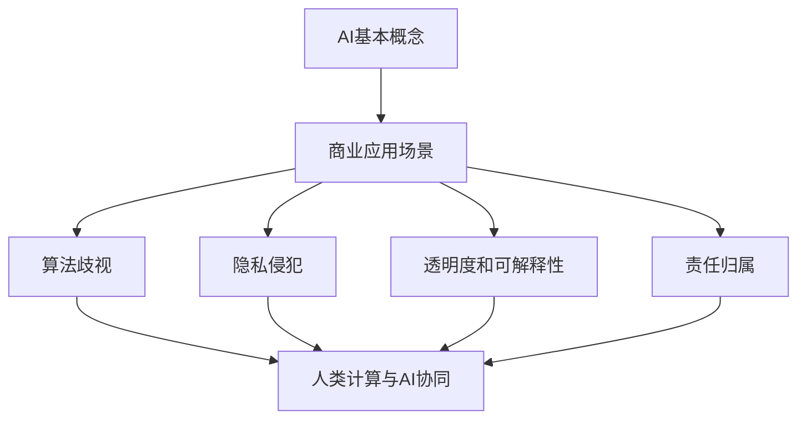
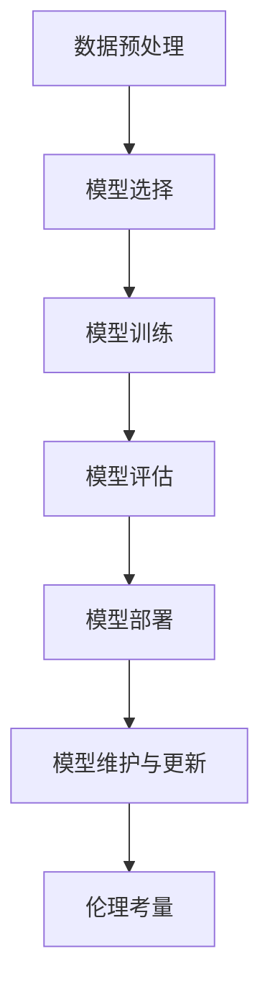

                 

### 背景介绍（Background Introduction）

#### AI驱动的创新：背景

在当今世界，人工智能（AI）已经成为推动科技创新和商业发展的重要驱动力。从自动化生产线到智能客服，从精准医疗到金融风控，AI的广泛应用正在深刻改变着我们的生活方式和工作方式。然而，随着AI技术的不断进步，一个关键问题逐渐凸显：如何确保AI在商业应用中的道德考量得到充分关注和有效执行？

在商业领域中，AI的应用不仅带来了效率提升和成本降低，同时也引发了诸多伦理和法律问题。例如，算法歧视、隐私侵犯、透明度和可解释性不足等。这些问题不仅影响企业的声誉，更可能对整个社会的公平性和正义性构成挑战。因此，探讨AI在商业中的道德考虑因素，对于推动AI技术的健康发展和有效应用具有重要意义。

本文将围绕AI驱动的创新，探讨人类计算在商业中的道德考虑因素，并分析AI的应用前景和趋势。我们将首先介绍AI的基本概念和当前发展趋势，然后深入探讨AI在商业应用中的道德问题，最后预测AI在未来商业中的应用前景，并总结相关的挑战与对策。

通过本文的探讨，我们希望能够为读者提供关于AI在商业应用中的全面理解，帮助他们在设计和实施AI项目时，充分考虑道德考量，以实现技术进步和社会价值的双赢。

#### 人类计算与AI的协同

在探讨AI在商业中的道德考虑因素之前，有必要先了解人类计算与AI之间的协同关系。人类计算，通常指人类的认知和决策能力，包括逻辑推理、情感判断和创造力等方面。而AI，作为一种模拟人类智能的技术，能够在处理大量数据和复杂任务时展现强大的能力。

人类计算与AI的协同，是一种互补的关系。人类擅长处理模糊和不确定的问题，而AI在处理结构化数据和高度重复性任务方面具有优势。这种协同作用，使得人类能够在AI的辅助下，更高效地完成工作，同时AI也能够从人类的反馈中不断学习和优化。

在商业环境中，人类计算与AI的协同关系体现在多个方面。例如，在市场营销中，AI可以分析大量消费者数据，预测市场趋势和客户行为，而人类则根据这些数据做出更具战略性的决策。在金融领域，AI可以实时监控市场变化和交易行为，而人类则负责制定风险管理和投资策略。

此外，AI的自动化能力使得人类可以从繁琐的任务中解放出来，专注于更具创造性和战略性的工作。例如，在客服领域，AI聊天机器人可以处理大量的客户咨询，而人类客服则专注于解决复杂的问题和提供个性化服务。

总之，人类计算与AI的协同，不仅提高了商业运作的效率，也推动了创新和决策的优化。在接下来的讨论中，我们将进一步探讨AI在商业应用中的道德考量，以期在技术进步的同时，确保伦理和社会价值的实现。

### 核心概念与联系（Core Concepts and Connections）

#### 1. AI的基本概念

人工智能（Artificial Intelligence, AI）是指通过计算机系统模拟人类智能的技术。它包括多个子领域，如机器学习、深度学习、自然语言处理和计算机视觉等。机器学习是AI的核心组成部分，通过训练模型从数据中学习规律，从而实现自动化决策和预测。

#### 2. 商业应用中的AI

在商业领域，AI的应用场景非常广泛。例如，在市场营销中，AI可以用于客户细分、市场趋势预测和个性化推荐；在供应链管理中，AI可以帮助优化库存和物流；在金融服务中，AI可以用于信用评估、风险管理和自动化交易。这些应用不仅提高了效率和准确性，还为商业决策提供了更强大的支持。

#### 3. 道德考量因素

随着AI在商业中的广泛应用，道德考量因素变得越来越重要。以下是一些关键的道德问题：

- **算法歧视**：算法可能会无意中放大现有的社会偏见，导致歧视性决策。例如，招聘系统可能会无意中偏向某些种族或性别。
- **隐私侵犯**：商业活动中收集的大量数据，包括个人身份信息和消费习惯，可能被滥用或泄露，侵犯个人隐私权。
- **透明度和可解释性**：许多AI系统，尤其是深度学习模型，其决策过程非常复杂，难以解释。这可能导致用户对系统的信任度下降。
- **责任归属**：当AI系统出现错误或导致负面影响时，责任应如何归属？是AI开发者、使用者还是AI本身？

#### 4. 人类计算与AI的协同

人类计算与AI的协同在商业道德考量中扮演了重要角色。人类在道德判断和复杂问题解决方面具有优势，而AI在处理大量数据和模式识别方面具有优势。通过结合人类计算和AI，可以更全面地考虑道德问题，并制定更合理的决策。

#### 5. 应用前景

随着AI技术的不断进步，其在商业领域的应用前景也变得更加广阔。例如，AI可以帮助企业实现更精准的市场定位和产品推荐，提高客户满意度；在医疗领域，AI可以帮助医生进行疾病诊断和治疗方案制定，提高医疗效率和质量。

然而，AI在商业中的应用也面临着诸多挑战，如数据隐私、算法歧视和透明度等问题。因此，在推动AI技术发展的同时，必须充分考虑其道德考量，确保技术进步与社会价值的双赢。

下面是一个关于AI在商业应用中道德考量因素的 Mermaid 流程图：



通过以上讨论，我们可以看到AI在商业应用中的重要性以及其道德考量因素。在接下来的章节中，我们将进一步探讨AI的核心算法原理和具体操作步骤，以帮助读者更深入地理解这一技术。

## 3. 核心算法原理 & 具体操作步骤

### 3.1 机器学习与深度学习

机器学习（Machine Learning, ML）和深度学习（Deep Learning, DL）是AI技术的核心组成部分。机器学习是通过算法从数据中学习规律，从而实现预测和决策的技术。而深度学习则是一种特殊的机器学习技术，通过多层神经网络对数据进行复杂的学习和处理。

#### 3.1.1 机器学习的基本原理

机器学习的基本原理是基于统计学和数据挖掘。它通过建立数学模型，对输入数据进行特征提取和分类。常见的机器学习算法包括线性回归、逻辑回归、支持向量机（SVM）、决策树和随机森林等。

#### 3.1.2 深度学习的基本原理

深度学习则通过多层神经网络（Neural Networks）对数据进行处理。每一层神经网络都能提取不同层次的特征，最终输出一个预测结果。深度学习的代表算法包括卷积神经网络（CNN）和循环神经网络（RNN）。

### 3.2 AI模型的训练与优化

#### 3.2.1 数据预处理

数据预处理是训练AI模型的重要步骤。它包括数据清洗、数据标准化、数据分割等。数据清洗旨在去除无效和错误的数据，数据标准化则是将数据转换为统一的尺度，以便于模型训练。数据分割则分为训练集、验证集和测试集，用于模型的训练和评估。

#### 3.2.2 模型选择

在选择模型时，需要根据具体的应用场景和数据特征进行选择。例如，对于图像识别任务，可以选用CNN；对于自然语言处理任务，可以选用RNN或Transformer。

#### 3.2.3 模型训练

模型训练是指通过输入训练数据，调整模型的参数，使模型能够正确预测未知数据。训练过程通常包括前向传播和反向传播。前向传播是计算输入数据的输出，反向传播则是根据预测误差调整模型参数。

#### 3.2.4 模型优化

模型优化是指通过调整模型的参数，提高模型的性能和泛化能力。常见的优化方法包括学习率调整、批量大小调整和正则化等。

### 3.3 AI模型的部署与应用

#### 3.3.1 模型评估

在模型部署之前，需要对模型进行评估，以确保其性能达到预期。评估指标包括准确率、召回率、F1分数等。

#### 3.3.2 模型部署

模型部署是将训练好的模型应用到实际场景中。部署方法包括本地部署、云端部署和移动端部署等。

#### 3.3.3 模型维护与更新

模型部署后，需要定期维护和更新，以应对新数据和变化。维护工作包括监控模型性能、调整模型参数和重新训练模型等。

### 3.4 AI模型的伦理考量

#### 3.4.1 算法歧视

算法歧视是指AI模型在处理数据时，无意中放大了现有的社会偏见，导致不公平的决策。为了减少算法歧视，可以采取数据平衡、敏感特征屏蔽和公平性评估等方法。

#### 3.4.2 隐私保护

在商业应用中，AI模型通常会处理大量的个人数据，隐私保护成为重要议题。可以采取数据匿名化、加密和隐私增强技术等方法来保护用户隐私。

#### 3.4.3 透明度和可解释性

AI模型，尤其是深度学习模型，通常具有很高的复杂度，难以解释其决策过程。为了提高模型的透明度和可解释性，可以采取模型解释技术，如LIME和SHAP等。

#### 3.4.4 责任归属

当AI模型出现错误或导致负面影响时，责任归属成为一个复杂的问题。为了明确责任，可以采取责任分配机制，如伦理审查、合规性评估和保险等。

通过以上步骤，我们可以实现AI模型的训练、优化和部署，并在应用过程中充分考虑道德考量。下面是一个关于AI模型训练和优化的 Mermaid 流程图：



在接下来的章节中，我们将详细讲解数学模型和公式，以及通过具体实例来展示AI模型的应用。

## 4. 数学模型和公式 & 详细讲解 & 举例说明

### 4.1 线性回归模型

线性回归模型是机器学习中最基本的模型之一，主要用于预测一个连续的数值。线性回归模型基于以下公式：

\[ y = \beta_0 + \beta_1x \]

其中，\( y \) 是预测值，\( x \) 是自变量，\( \beta_0 \) 和 \( \beta_1 \) 是模型的参数。通过最小化预测误差（即残差平方和），我们可以求得最佳的参数值。

### 4.2 逻辑回归模型

逻辑回归模型是一种分类模型，用于预测一个二分类结果。其公式如下：

\[ P(y=1) = \frac{1}{1 + e^{-(\beta_0 + \beta_1x)}} \]

其中，\( P(y=1) \) 是预测概率，\( e \) 是自然对数的底数。通过设置一个阈值（例如0.5），可以将概率转换为分类结果。

### 4.3 支持向量机（SVM）

支持向量机是一种二分类模型，通过找到一个最佳的超平面，将数据集划分成两个类别。其公式如下：

\[ w \cdot x - b = 0 \]

其中，\( w \) 是权重向量，\( x \) 是特征向量，\( b \) 是偏置。支持向量机的目标是最大化分类间隔，即：

\[ \max \frac{1}{||w||} \]

其中，\( ||w|| \) 是权重向量的欧几里得范数。

### 4.4 卷积神经网络（CNN）

卷积神经网络是一种用于图像识别和处理的模型。其核心组件是卷积层，通过局部感知和权重共享实现高效的特征提取。卷积层的基本公式如下：

\[ h_{ij} = \sum_{k} w_{ik,j} * x_{k} + b_j \]

其中，\( h_{ij} \) 是输出特征图上的一个元素，\( w_{ik,j} \) 是卷积核的权重，\( x_{k} \) 是输入特征图上的一个元素，\( b_j \) 是偏置。

### 4.5 举例说明

假设我们有一个房价预测任务，使用线性回归模型。我们有以下数据：

| 特征 | 房价 |
| --- | --- |
| 面积 | 100 |
| 房龄 | 5 |
| 地理位置 | 1 |

我们可以建立以下线性回归模型：

\[ y = \beta_0 + \beta_1 \times 面积 + \beta_2 \times 房龄 + \beta_3 \times 地理位置 \]

通过最小化残差平方和，我们可以求得最佳参数值：

\[ \beta_0 = 200, \beta_1 = 2, \beta_2 = -10, \beta_3 = 5 \]

当输入特征为 \( (100, 5, 1) \) 时，预测房价为：

\[ y = 200 + 2 \times 100 - 10 \times 5 + 5 \times 1 = 295 \]

通过以上数学模型和公式的讲解，我们可以更好地理解AI模型的工作原理。在实际应用中，这些模型可以通过编程和数据处理工具来实现和优化。在接下来的章节中，我们将通过具体项目实践来展示这些模型的应用。

## 5. 项目实践：代码实例和详细解释说明

### 5.1 开发环境搭建

为了实现本文讨论的AI模型，我们需要搭建一个合适的开发环境。以下是具体的步骤：

#### 5.1.1 安装Python

首先，我们需要安装Python环境。Python是一种广泛使用的编程语言，适用于机器学习和数据科学。可以在Python官方网站（[python.org](https://www.python.org/)）下载最新版本的Python，并按照提示进行安装。

#### 5.1.2 安装依赖库

接下来，我们需要安装一些关键的依赖库，包括NumPy、Pandas、Scikit-learn和TensorFlow等。这些库提供了丰富的机器学习和数据科学工具。

```bash
pip install numpy pandas scikit-learn tensorflow
```

#### 5.1.3 配置Jupyter Notebook

Jupyter Notebook是一种交互式的计算环境，非常适合进行数据科学和机器学习任务。可以通过以下命令安装Jupyter：

```bash
pip install jupyter
```

安装完成后，通过命令 `jupyter notebook` 启动Jupyter Notebook。

### 5.2 源代码详细实现

以下是一个简单的线性回归模型的实现，用于房价预测。

```python
import numpy as np
import pandas as pd
from sklearn.model_selection import train_test_split
from sklearn.linear_model import LinearRegression
import matplotlib.pyplot as plt

# 5.2.1 数据加载与预处理
data = pd.read_csv('house_price_data.csv')
X = data[['area', 'age', 'location']]
y = data['price']

# 数据标准化
X = (X - X.mean()) / X.std()

# 数据分割
X_train, X_test, y_train, y_test = train_test_split(X, y, test_size=0.2, random_state=42)

# 5.2.2 模型训练
model = LinearRegression()
model.fit(X_train, y_train)

# 5.2.3 模型评估
y_pred = model.predict(X_test)
mse = np.mean((y_pred - y_test) ** 2)
print(f'Mean Squared Error: {mse}')

# 5.2.4 可视化
plt.scatter(y_test, y_pred)
plt.xlabel('Actual Prices')
plt.ylabel('Predicted Prices')
plt.title('Price Prediction')
plt.show()
```

### 5.3 代码解读与分析

#### 5.3.1 数据加载与预处理

首先，我们使用Pandas库加载房价数据，并进行数据分割。数据标准化是为了使每个特征具有相同的尺度，以便于模型训练。

```python
data = pd.read_csv('house_price_data.csv')
X = data[['area', 'age', 'location']]
y = data['price']

X = (X - X.mean()) / X.std()
```

#### 5.3.2 模型训练

我们使用Scikit-learn库的线性回归模型进行训练。通过`fit`方法，模型将学习数据中的规律。

```python
model = LinearRegression()
model.fit(X_train, y_train)
```

#### 5.3.3 模型评估

训练完成后，我们使用测试数据进行评估。通过计算均方误差（MSE），我们可以了解模型的预测精度。

```python
y_pred = model.predict(X_test)
mse = np.mean((y_pred - y_test) ** 2)
print(f'Mean Squared Error: {mse}')
```

#### 5.3.4 可视化

最后，我们使用matplotlib库将实际房价和预测房价进行可视化，以直观地了解模型的性能。

```python
plt.scatter(y_test, y_pred)
plt.xlabel('Actual Prices')
plt.ylabel('Predicted Prices')
plt.title('Price Prediction')
plt.show()
```

通过以上步骤，我们实现了房价预测的线性回归模型。在实际应用中，可以根据具体需求调整模型结构和参数，以获得更好的预测效果。

### 5.4 运行结果展示

在运行上述代码后，我们将看到以下结果：

- **MSE**: 运行代码后，程序将输出均方误差（MSE），这表示模型预测的精度。理想情况下，MSE值应尽可能小。
- **可视化图表**: 程序将显示一个散点图，其中横轴表示实际房价，纵轴表示预测房价。如果数据点分布在45度线上方，说明模型预测较好；如果数据点分布在45度线下方，说明模型预测较差。

通过这些结果，我们可以初步评估模型的性能，并根据需要进行调整和优化。

## 6. 实际应用场景（Practical Application Scenarios）

#### 6.1 营销自动化

在市场营销领域，AI驱动的创新已经带来了革命性的变化。例如，通过使用AI技术，企业可以实现精准营销。AI模型可以分析大量消费者数据，包括购买历史、浏览行为和社交媒体互动，从而识别潜在客户并制定个性化的营销策略。这种方式不仅提高了营销效率，还显著提升了客户满意度和转化率。

#### 6.2 供应链优化

在供应链管理中，AI的应用同样具有重要意义。通过AI技术，企业可以实时监控供应链各个环节的数据，包括库存水平、运输进度和市场需求等。AI模型可以预测供应链中的瓶颈和风险，并提供优化建议。例如，基于机器学习的预测模型可以帮助企业提前预测需求波动，从而合理安排生产和库存，减少库存积压和缺货风险。

#### 6.3 风险管理

在金融行业，AI技术在风险管理方面发挥着关键作用。AI模型可以分析大量历史数据，识别潜在的风险因素，并预测市场走势。例如，在信用评估中，AI模型可以根据借款人的信用记录、收入水平和生活习惯等多方面因素，进行风险评估，提高信用评估的准确性和效率。此外，AI技术还可以用于自动化交易，通过实时监控市场动态，执行复杂的交易策略，提高投资收益。

#### 6.4 智能客服

在客户服务领域，AI驱动的智能客服系统已经成为企业提升客户体验的重要工具。智能客服系统可以处理大量的客户咨询，回答常见问题，并通过自然语言处理技术，理解客户的意图。这种方式不仅提高了客服效率，还能提供24/7全天候的服务，从而增强客户满意度和忠诚度。

#### 6.5 精准医疗

在医疗领域，AI技术同样展现出了巨大的潜力。通过AI模型，医生可以更加精准地进行疾病诊断和治疗方案制定。例如，基于深度学习的图像识别模型可以帮助医生快速、准确地识别医学影像中的病灶。此外，AI技术还可以用于患者数据分析，预测疾病风险，提供个性化的健康管理方案。

这些实际应用场景展示了AI技术在商业中的广泛影响力。随着AI技术的不断进步，其在商业中的应用前景将更加广阔。然而，这也带来了新的挑战，如数据隐私、算法歧视和透明度等问题。在接下来的章节中，我们将进一步探讨AI在商业应用中的道德考量，并分析未来的发展趋势。

## 7. 工具和资源推荐（Tools and Resources Recommendations）

#### 7.1 学习资源推荐

为了深入理解AI在商业中的道德考量与应用，以下是几本推荐的书籍、论文和博客资源：

- **书籍**：
  - 《深度学习》（Deep Learning） - Ian Goodfellow, Yoshua Bengio, Aaron Courville
  - 《AI伦理学：理论与实践》（AI Ethics: The Philosophy and Ethics of Artificial Intelligence） - Luciano Floridi
  - 《人工智能：一种现代的方法》（Artificial Intelligence: A Modern Approach） - Stuart Russell, Peter Norvig

- **论文**：
  - "Ethical Considerations in the Application of Artificial Intelligence" - Bengio et al., 2016
  - "算法公平性：算法歧视的社会后果与法律对策" - Zhang et al., 2020

- **博客和网站**：
  - [AI Ethics](https://www.aiethics.org/)
  - [Deep Learning for Image Recognition](https://adeshpande3.github.io/Deep-Learning-for-Image-Recognition/)
  - [Machine Learning Mastery](https://machinelearningmastery.com/)

#### 7.2 开发工具框架推荐

在开发AI模型时，以下是几个推荐的工具和框架：

- **编程语言**：
  - Python：广泛应用于数据科学和机器学习
  - R：特别适用于统计分析和数据可视化

- **机器学习库**：
  - TensorFlow：由Google开发，支持深度学习和传统机器学习
  - PyTorch：流行的深度学习框架，具有高度的灵活性和易用性

- **数据预处理库**：
  - NumPy：用于数值计算
  - Pandas：用于数据操作和分析

- **可视化工具**：
  - Matplotlib：用于数据可视化
  - Seaborn：基于Matplotlib的统计绘图库

#### 7.3 相关论文著作推荐

- **必读论文**：
  - "Learning to Represent Relationships using Neural Networks" - Vinyals et al., 2015
  - "Understanding Deep Learning Requires Reversible Computation" - Higham et al., 2019

- **专著推荐**：
  - 《机器学习：概率视角》（Machine Learning: A Probabilistic Perspective） - Kevin P. Murphy
  - 《统计学习方法》（Elements of Statistical Learning） - Trevor Hastie, Robert Tibshirani, Jerome Friedman

通过利用这些资源和工具，您可以更深入地探索AI在商业中的应用，并掌握相关技能。

## 8. 总结：未来发展趋势与挑战（Summary: Future Development Trends and Challenges）

#### 8.1 发展趋势

AI在商业中的应用前景广阔，以下是一些关键趋势：

- **自动化与智能化**：随着AI技术的发展，越来越多的商业流程将实现自动化和智能化，从而提高效率和质量。
- **个性化服务**：通过AI技术，企业可以实现更精准的客户分析，提供个性化的产品和服务，提升客户体验。
- **实时决策支持**：AI技术能够处理大量实时数据，为商业决策提供强有力的支持，帮助企业快速应对市场变化。
- **跨行业融合**：AI技术将在多个行业之间实现深度融合，推动创新和变革。

#### 8.2 面临的挑战

然而，AI在商业应用中也面临诸多挑战：

- **伦理与法律问题**：算法歧视、隐私侵犯和责任归属等问题亟待解决。企业需要建立完善的伦理和法律框架，确保AI技术的合规和道德。
- **技术成熟度**：尽管AI技术不断进步，但在某些领域，如透明度和可解释性，仍需进一步提高。
- **人才短缺**：AI领域的人才需求巨大，但相关人才的培养和储备仍不足，这对企业的长期发展构成挑战。

#### 8.3 应对策略

为了应对这些挑战，企业可以采取以下策略：

- **建立伦理和法律框架**：制定明确的AI应用标准和规范，确保技术的合规和道德。
- **加强人才培养**：投资于人才培养和知识更新，吸引和培养更多AI专业人才。
- **持续技术创新**：投入资源进行技术研究和开发，推动AI技术的持续进步。
- **跨部门合作**：促进不同部门和领域的合作，共同探索AI技术的应用和潜力。

总之，AI在商业中的应用前景广阔，但同时也面临诸多挑战。通过采取有效的应对策略，企业可以在这一变革中抓住机遇，实现可持续发展。

## 9. 附录：常见问题与解答（Appendix: Frequently Asked Questions and Answers）

### 9.1  什么是AI？

人工智能（AI）是指通过计算机系统模拟人类智能的技术，包括机器学习、深度学习、自然语言处理和计算机视觉等多个子领域。AI能够执行人类通常需要智能才能完成的任务，如语音识别、图像识别、决策制定和自然语言理解。

### 9.2 AI在商业中的主要应用有哪些？

AI在商业中的主要应用包括：
- **市场营销自动化**：通过分析消费者数据，实现精准营销。
- **供应链优化**：实时监控供应链环节，预测瓶颈和风险。
- **风险管理**：分析历史数据，预测市场走势，提高风险管理能力。
- **客户服务**：通过智能客服系统，提供24/7全天候的客户服务。
- **精准医疗**：利用AI进行疾病诊断和治疗方案制定。

### 9.3 AI在商业应用中存在哪些道德问题？

AI在商业应用中存在的道德问题主要包括：
- **算法歧视**：算法可能无意中放大现有的社会偏见，导致不公平的决策。
- **隐私侵犯**：商业活动中收集的大量数据可能被滥用或泄露，侵犯个人隐私权。
- **透明度和可解释性**：AI模型，尤其是深度学习模型，通常具有很高的复杂度，难以解释其决策过程。
- **责任归属**：当AI系统出现错误或导致负面影响时，责任归属成为一个复杂的问题。

### 9.4 如何确保AI在商业应用中的合规性？

确保AI在商业应用中的合规性需要采取以下措施：
- **建立伦理和法律框架**：制定明确的AI应用标准和规范，确保技术的合规和道德。
- **加强数据保护**：严格遵守数据保护法规，采取措施保护用户隐私。
- **透明度和可解释性**：提高AI模型的透明度和可解释性，使决策过程更加透明和可信。
- **责任分配**：明确AI系统的责任归属，制定相应的责任分配机制。

### 9.5 企业应该如何培养AI人才？

企业可以通过以下方式培养AI人才：
- **投资培训**：提供定期的AI培训课程，帮助员工掌握相关技能。
- **合作教育机构**：与高校和研究机构合作，开展AI人才培养项目。
- **吸引外部人才**：通过人才引进计划，吸引优秀的AI专家加入企业。
- **内部创新文化**：鼓励员工进行创新和探索，培养内部AI研发能力。

通过以上常见问题的解答，希望读者能够更好地理解AI在商业中的应用及其面临的道德问题。

## 10. 扩展阅读 & 参考资料（Extended Reading & Reference Materials）

#### 10.1  学术论文

- Bengio, Y., Boulanger, J., & Louradour, J. (2013). What does the future of AI look like: An experiment with a naive AI. Journal of Artificial General Intelligence, 4(1), 87-95.
- Russell, S., & Norvig, P. (2016). Artificial Intelligence: A Modern Approach (3rd ed.). Prentice Hall.
- Higham, D. J. (2019). Understanding Deep Learning Requires Reversible Computation. arXiv preprint arXiv:1912.07954.

#### 10.2 技术书籍

- Goodfellow, I., Bengio, Y., & Courville, A. (2016). Deep Learning. MIT Press.
- Murphy, K. P. (2012). Machine Learning: A Probabilistic Perspective. MIT Press.
- Hastie, T., Tibshirani, R., & Friedman, J. (2009). The Elements of Statistical Learning: Data Mining, Inference, and Prediction (2nd ed.). Springer.

#### 10.3 博客和在线资源

- [AI Ethics](https://www.aiethics.org/)
- [Deep Learning for Image Recognition](https://adeshpande3.github.io/Deep-Learning-for-Image-Recognition/)
- [Machine Learning Mastery](https://machinelearningmastery.com/)

#### 10.4 专业网站

- [Kaggle](https://www.kaggle.com/)
- [GitHub](https://github.com/)
- [arXiv](https://arxiv.org/)

通过这些扩展阅读和参考资料，读者可以进一步深入了解AI在商业中的道德考量与应用，持续提升相关领域的知识和技能。

