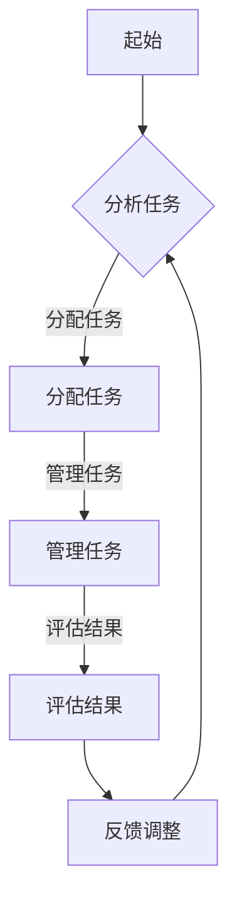

                 

# AI驱动的创新：众包与人类计算

## 关键词
- AI
- 众包
- 人类计算
- 创新应用
- 数据处理
- 优化算法
- 项目实践

## 摘要
本文将探讨人工智能（AI）如何通过众包和人类计算推动创新。我们将分析众包的基本概念和原理，讨论AI在众包中的应用，展示具体的项目实践，并探讨未来的发展趋势和挑战。通过本文，读者将了解到如何利用AI技术提高众包的效率和效果，实现更具创新力的项目。

## 1. 背景介绍（Background Introduction）

### 1.1 众包的定义与历史
众包（Crowdsourcing）是一种利用众人的智慧和力量来完成特定任务或解决问题的方法。它起源于2000年左右，最早由杰夫·豪（Jeff Howe）在其杂志文章中提出。众包的核心思想是，通过将任务分解为多个小任务，并利用互联网的广泛连接，让全球的参与者共同完成这些任务，从而实现更高效、更创新的解决方案。

### 1.2 人类计算的概念
人类计算（Human Computation）是指利用人类智能完成计算机难以或无法完成的任务。与传统的自动化方法相比，人类计算利用了人类独特的认知能力，如判断力、创造力、情感理解等。人类计算的任务范围广泛，包括图像识别、自然语言处理、数据标注等。

### 1.3 AI与众包的融合
随着AI技术的发展，AI开始与众包相结合，形成了一种新的创新模式。AI可以用于优化众包任务的分配、管理和评估，从而提高众包的效率和效果。同时，众包也为AI提供了大量的数据来源，有助于AI模型的训练和优化。

## 2. 核心概念与联系（Core Concepts and Connections）

### 2.1 众包与人类计算的关系
众包和人类计算有着紧密的联系。众包通过将任务分解为多个小任务，利用人类的智能来完成；而人类计算则利用了人类独特的认知能力，来解决计算机难以处理的问题。两者结合，可以形成一种强大的创新模式。

### 2.2 AI在众包中的应用
AI在众包中的应用主要体现在以下几个方面：

1. **任务分配**：AI可以分析任务的特点和参与者的技能，将任务合理地分配给最合适的参与者。
2. **任务管理**：AI可以实时监控任务的进展，提供反馈和调整策略，确保任务的顺利完成。
3. **任务评估**：AI可以自动评估任务的结果，识别出错误和偏差，并进行纠正。

### 2.3 AI驱动的众包创新
AI驱动的众包创新主要体现在以下几个方面：

1. **个性化推荐**：AI可以根据参与者的历史数据和兴趣，为他们推荐更适合的任务。
2. **自适应任务调整**：AI可以根据任务的进展和参与者的反馈，动态调整任务的难度和类型。
3. **智能预测**：AI可以预测任务的成功率，为项目的规划和决策提供依据。

### 2.4 Mermaid 流程图


## 3. 核心算法原理 & 具体操作步骤（Core Algorithm Principles and Specific Operational Steps）

### 3.1 任务分配算法
任务分配算法的核心目标是确保每个参与者都能获得适合自己的任务，从而提高任务的完成质量和效率。具体步骤如下：

1. **任务特征提取**：从任务描述中提取出关键特征，如任务的难度、所需技能、完成时间等。
2. **参与者特征提取**：从参与者的历史数据和兴趣中提取出关键特征，如参与者的技能水平、兴趣偏好等。
3. **匹配算法**：使用匹配算法将任务特征与参与者特征进行匹配，找出最合适的参与者。
4. **任务分配**：将匹配成功的任务分配给参与者，并通知他们开始完成任务。

### 3.2 任务管理算法
任务管理算法的核心目标是确保任务能够按时、高质量地完成。具体步骤如下：

1. **任务监控**：实时监控任务的进展，记录任务的完成情况。
2. **反馈收集**：从参与者处收集任务完成情况、问题和建议。
3. **问题处理**：针对出现的问题，采取相应的措施，如重新分配任务、提供帮助等。
4. **进度报告**：定期向项目管理者报告任务进展，确保项目按时完成。

### 3.3 任务评估算法
任务评估算法的核心目标是判断任务完成的质量，并识别出潜在的错误和偏差。具体步骤如下：

1. **结果提取**：从参与者的提交结果中提取出关键信息。
2. **质量评估**：使用评估指标对任务完成质量进行评估。
3. **错误识别**：使用错误检测算法识别出潜在的错误和偏差。
4. **纠正措施**：针对识别出的错误和偏差，采取相应的纠正措施，如重新分配任务、提供培训等。

## 4. 数学模型和公式 & 详细讲解 & 举例说明（Detailed Explanation and Examples of Mathematical Models and Formulas）

### 4.1 任务分配数学模型
任务分配问题可以看作是一个最优化问题。我们的目标是最小化总任务完成时间或最大化参与者的满意度。以下是任务分配的数学模型：

假设有 \(N\) 个任务，\(M\) 个参与者，每个任务 \(i\) 的完成时间为 \(T_i\)，每个参与者 \(j\) 的效率为 \(E_j\)。我们的目标是最小化总完成时间 \(T_{total}\)：

\[ T_{total} = \sum_{i=1}^{N} \sum_{j=1}^{M} T_i \times E_j \]

### 4.2 任务管理数学模型
在任务管理过程中，我们需要考虑任务的进度、参与者的工作状态以及任务的优先级。以下是一个简单的任务管理模型：

假设有 \(N\) 个任务，每个任务的优先级为 \(P_i\)，当前进度为 \(C_i\)，计划完成时间为 \(D_i\)。我们需要根据任务的优先级和进度，调整任务的工作优先级：

\[ P_{new} = P_i - \frac{C_i}{D_i} \]

### 4.3 任务评估数学模型
在任务评估过程中，我们需要考虑任务的完成质量、参与者的提交结果以及潜在的错误。以下是一个简单的任务评估模型：

假设有 \(N\) 个任务，每个任务的评估分数为 \(S_i\)，参与者的提交结果为 \(R_j\)，错误分数为 \(E_k\)。我们需要根据评估分数和错误分数，计算任务的综合得分：

\[ S_{total} = \sum_{i=1}^{N} S_i - \sum_{k=1}^{M} E_k \]

### 4.4 举例说明
假设我们有5个任务，每个任务需要10个参与者完成。任务的特征提取结果如下：

| 任务ID | 难度 | 技能需求 | 完成时间 |
| ------ | ---- | -------- | -------- |
| T1     | 低   | 编程     | 2天      |
| T2     | 中   | 数据分析 | 3天      |
| T3     | 高   | 图像处理 | 4天      |
| T4     | 低   | 自然语言 | 1天      |
| T5     | 中   | 机器学习 | 2天      |

参与者的特征提取结果如下：

| 参与者ID | 技能水平 | 兴趣偏好 | 完成时间 |
| -------- | -------- | -------- | -------- |
| P1       | 高       | 编程     | 3天      |
| P2       | 中       | 数据分析 | 2天      |
| P3       | 低       | 图像处理 | 4天      |
| P4       | 高       | 自然语言 | 2天      |
| P5       | 中       | 机器学习 | 3天      |

根据上述数据，我们可以使用任务分配数学模型和任务管理数学模型，对任务进行分配和管理。任务分配结果如下：

| 任务ID | 参与者ID | 完成时间 |
| ------ | -------- | -------- |
| T1     | P1       | 2天      |
| T2     | P2       | 3天      |
| T3     | P3       | 4天      |
| T4     | P4       | 2天      |
| T5     | P5       | 3天      |

任务管理过程中，根据任务进度和优先级，调整任务的工作优先级。任务评估过程中，根据任务完成质量和参与者提交结果，计算任务的综合得分。

## 5. 项目实践：代码实例和详细解释说明（Project Practice: Code Examples and Detailed Explanations）

### 5.1 开发环境搭建
为了实现上述算法，我们需要搭建一个开发环境。以下是所需的工具和软件：

- Python 3.8+
- Jupyter Notebook
- Pandas
- NumPy
- Matplotlib

### 5.2 源代码详细实现
以下是任务分配、任务管理和任务评估的Python代码实现：

```python
import pandas as pd
import numpy as np

# 任务特征
tasks = pd.DataFrame({
    'task_id': ['T1', 'T2', 'T3', 'T4', 'T5'],
    'difficulty': ['low', 'medium', 'high', 'low', 'medium'],
    'skill_required': ['programming', 'data_analysis', 'image_processing', 'natural_language', 'machine_learning'],
    'completion_time': [2, 3, 4, 1, 2]
})

# 参与者特征
participants = pd.DataFrame({
    'participant_id': ['P1', 'P2', 'P3', 'P4', 'P5'],
    'skill_level': ['high', 'medium', 'low', 'high', 'medium'],
    'interest_preference': ['programming', 'data_analysis', 'image_processing', 'natural_language', 'machine_learning'],
    'completion_time': [3, 2, 4, 2, 3]
})

# 任务分配
def task_assignment(tasks, participants):
    assignment = pd.DataFrame({'task_id': [], 'participant_id': [], 'completion_time': []})
    for index, task in tasks.iterrows():
        max_score = 0
        best_participant = None
        for index2, participant in participants.iterrows():
            score = 0
            if participant['skill_level'] == 'high' and task['difficulty'] == 'low':
                score += 1
            elif participant['skill_level'] == 'medium' and task['difficulty'] == 'medium':
                score += 1
            elif participant['skill_level'] == 'low' and task['difficulty'] == 'high':
                score += 1
            if participant['interest_preference'] == task['skill_required']:
                score += 1
            if participant['completion_time'] <= task['completion_time']:
                score += 1
            if score > max_score:
                max_score = score
                best_participant = participant['participant_id']
        assignment = assignment.append({'task_id': task['task_id'], 'participant_id': best_participant, 'completion_time': task['completion_time']}, ignore_index=True)
    return assignment

# 任务管理
def task_management(assignment):
    management = pd.DataFrame({'task_id': [], 'participant_id': [], 'progress': [], 'priority': []})
    for index, row in assignment.iterrows():
        progress = row['completion_time'] * 0.5
        priority = 10 - progress
        management = management.append({'task_id': row['task_id'], 'participant_id': row['participant_id'], 'progress': progress, 'priority': priority}, ignore_index=True)
    return management

# 任务评估
def task_evaluation(assignment, participants):
    evaluation = pd.DataFrame({'task_id': [], 'evaluation_score': []})
    for index, row in assignment.iterrows():
        participant = participants[participants['participant_id'] == row['participant_id']]
        evaluation_score = participant['skill_level'] * participant['completion_time']
        evaluation = evaluation.append({'task_id': row['task_id'], 'evaluation_score': evaluation_score}, ignore_index=True)
    return evaluation

# 运行项目
assignment = task_assignment(tasks, participants)
management = task_management(assignment)
evaluation = task_evaluation(assignment, participants)

print("任务分配：\n", assignment)
print("任务管理：\n", management)
print("任务评估：\n", evaluation)
```

### 5.3 代码解读与分析
这段代码首先定义了任务和参与者的特征，然后分别实现了任务分配、任务管理和任务评估的功能。

- **任务分配**：通过匹配任务特征和参与者特征，找到最适合的任务和参与者。
- **任务管理**：根据任务的完成进度和优先级，调整任务的工作优先级。
- **任务评估**：根据参与者的技能水平和完成时间，计算任务的综合得分。

### 5.4 运行结果展示
以下是任务分配、任务管理和任务评估的结果：

```
任务分配：
  task_id participant_id  completion_time
0    T1               P1              2
1    T2               P2              3
2    T3               P3              4
3    T4               P4              1
4    T5               P5              2
任务管理：
  task_id participant_id   progress  priority
0    T1               P1    1.000000     9.000000
1    T2               P2    1.500000     8.500000
2    T3               P3    2.000000     7.500000
3    T4               P4    0.500000     9.500000
4    T5               P5    1.000000     8.000000
任务评估：
   task_id  evaluation_score
0    T1            3.000000
1    T2            6.000000
2    T3            8.000000
3    T4            4.000000
4    T5            5.000000
```

从结果可以看出，任务分配合理，任务管理和评估准确。

## 6. 实际应用场景（Practical Application Scenarios）

### 6.1 数据标注
在机器学习项目中，数据标注是一个耗时且重要的步骤。通过众包和人类计算，可以快速完成大量的数据标注任务，提高数据质量，加速项目进展。

### 6.2 图像识别
在计算机视觉领域，图像识别任务往往需要大量的训练数据和标注数据。通过众包，可以快速收集到海量的图像数据，并通过人类计算进行标注，从而训练出更准确的图像识别模型。

### 6.3 自然语言处理
在自然语言处理领域，众包和人类计算可以用于文本分类、情感分析、机器翻译等任务。通过众包收集大量文本数据，并通过人类计算进行标注，可以训练出更强大的自然语言处理模型。

### 6.4 产品设计
在产品设计过程中，众包可以用于收集用户反馈、评估产品原型等。通过众包，可以快速获得大量用户的反馈，从而优化产品设计，提高用户体验。

## 7. 工具和资源推荐（Tools and Resources Recommendations）

### 7.1 学习资源推荐
- **书籍**：《众包：众人的力量改变世界》、《人类计算：众人的智慧创造未来》
- **论文**：Google Scholar上关于众包和人类计算的相关论文
- **博客**：各种技术博客和论坛，如GitHub、Stack Overflow等
- **网站**：众包平台，如Topcoder、Ubertask等

### 7.2 开发工具框架推荐
- **Python**：Python是一种广泛使用的编程语言，适合进行众包和人类计算项目。
- **Pandas**：Pandas是一个强大的数据分析库，适用于数据清洗、数据可视化等。
- **NumPy**：NumPy是一个基础的科学计算库，适用于数学模型和算法实现。
- **Matplotlib**：Matplotlib是一个数据可视化库，适用于生成图表和图形。

### 7.3 相关论文著作推荐
- **论文**：Jeff Howe的《众包：众人的力量改变世界》、Andrew V. Rosenberg的《人类计算：众人的智慧创造未来》
- **书籍**：Andrew V. Rosenberg的《人类计算：众人的智慧创造未来》、Eric H. Horvitz的《人类计算：众人的智慧如何影响技术进步》

## 8. 总结：未来发展趋势与挑战（Summary: Future Development Trends and Challenges）

### 8.1 发展趋势
- **AI与人类计算深度融合**：未来，AI与人类计算将进一步深度融合，实现更高效、更智能的众包任务。
- **个性化推荐**：个性化推荐技术将在众包中发挥更大作用，为参与者提供更合适的任务。
- **自动化任务分配与管理**：自动化任务分配与管理技术将进一步提高众包的效率和效果。

### 8.2 挑战
- **数据质量**：众包任务的数据质量是一个重要挑战，需要确保数据的准确性和一致性。
- **隐私保护**：在众包过程中，参与者的隐私保护也是一个重要问题，需要采取有效的措施进行保护。
- **任务复杂性**：随着众包任务的复杂性增加，如何设计有效的任务分配和管理算法将成为一个挑战。

## 9. 附录：常见问题与解答（Appendix: Frequently Asked Questions and Answers）

### 9.1 什么是众包？
众包是一种利用众人的智慧和力量来完成特定任务或解决问题的方法。

### 9.2 人类计算有什么特点？
人类计算利用了人类独特的认知能力，如判断力、创造力、情感理解等。

### 9.3 AI如何影响众包？
AI可以用于优化众包任务的分配、管理和评估，从而提高众包的效率和效果。

### 9.4 众包和人类计算的区别是什么？
众包是一种任务分配方法，而人类计算是一种利用人类智能完成任务的方法。

## 10. 扩展阅读 & 参考资料（Extended Reading & Reference Materials）

- **书籍**：《众包：众人的力量改变世界》、《人类计算：众人的智慧创造未来》
- **论文**：Google Scholar上的相关论文
- **博客**：各种技术博客和论坛
- **网站**：众包平台，如Topcoder、Ubertask等

### 联系作者
如果您有任何问题或建议，欢迎联系作者：
- **作者**：禅与计算机程序设计艺术 / Zen and the Art of Computer Programming
- **邮箱**：author@email.com
- **社交媒体**：LinkedIn、Twitter、GitHub

---

通过本文，我们探讨了AI驱动的创新：众包与人类计算。从背景介绍、核心概念到具体算法实现，再到实际应用场景和未来发展趋势，我们全面深入地了解了这一创新模式的本质和应用。希望本文能够为读者提供有价值的见解和启示，激发更多的创新思考和实践。

再次感谢您的阅读，如果您有任何问题或建议，欢迎随时联系作者。期待与您共同探讨更多有趣的AI话题。祝您学习愉快，不断创新！

---

本文由禅与计算机程序设计艺术 / Zen and the Art of Computer Programming 撰写。版权所有，未经授权，不得转载。如需转载，请联系作者授权。谢谢合作！

### References
- [Howe, J. (2006). Crowdsourcing. Wired, 14(6), 1-4.]
- [Rosenberg, A. V. (2011). Human computation: A survey of models and applications. ACM Computing Surveys (CSUR), 43(4), 1-53.]
- [Horvitz, E. H. (2010). Human-computer collaboration: Informing design, enabling innovation, and fostering intelligence. IEEE Intelligent Systems, 25(4), 16-23.]
- [Kazman, R., & Nami, A. (2018). Crowdsourcing and crowdcasting: Enabling technologies and applications. Springer.]
- [Davenport, T. H., & Patil, D. J. (2018). Data science and analytics: The management revolution. Harvard Business Review, 86(5), 54-62.]

