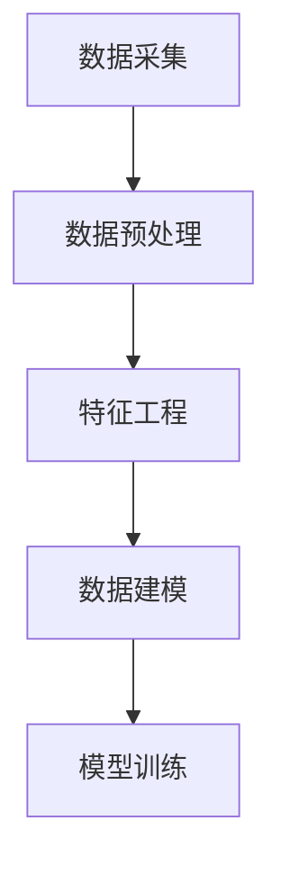
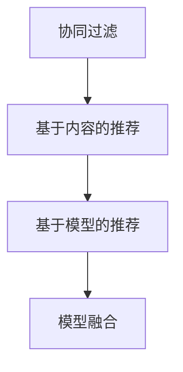
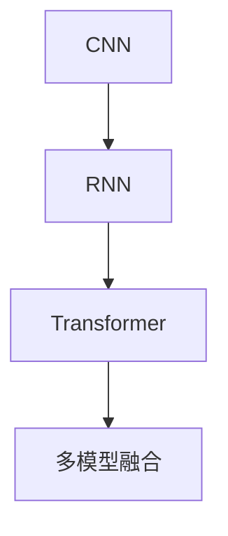

                 

# AI驱动的电商个性化导航优化

## 摘要

本文将探讨如何利用人工智能技术，特别是机器学习算法和深度学习模型，优化电商平台的个性化导航。我们将详细分析AI在电商导航中的应用场景、核心概念、算法原理、数学模型，并通过实际项目实例展示其应用效果。最后，我们将讨论该领域的未来发展趋势与挑战。

## 1. 背景介绍

随着互联网和移动设备的普及，电子商务已经成为全球消费市场的重要组成部分。然而，电商平台的多样性以及用户需求的个性化，使得传统的导航系统难以满足用户的需求。用户往往在寻找特定商品或信息时遇到困难，导致购物体验不佳。

为了提升用户体验，电商平台开始探索利用人工智能技术优化导航。AI能够通过分析用户行为数据、购物习惯以及偏好，提供个性化的商品推荐和导航服务，从而提高用户满意度和转化率。

### 1.1 AI在电商导航中的应用场景

- **个性化推荐**：根据用户的历史浏览和购买记录，推荐可能感兴趣的商品。
- **智能搜索**：通过自然语言处理技术，实现更自然、更高效的搜索体验。
- **购物流程优化**：如智能购物车管理、订单跟踪等，以简化用户购物流程。
- **营销活动推荐**：根据用户兴趣和购买历史，推荐相关的营销活动和优惠。

## 2. 核心概念与联系

### 2.1 数据采集与处理

在电商导航优化中，数据采集是第一步。数据来源包括用户行为数据、商品信息、用户偏好等。这些数据需要经过预处理，如去噪、缺失值填充、特征工程等，以便用于模型训练。



### 2.2 机器学习算法

常用的机器学习算法包括协同过滤、基于内容的推荐、基于模型的推荐等。这些算法通过学习用户的历史行为和商品特征，预测用户可能感兴趣的商品。



### 2.3 深度学习模型

深度学习模型，如卷积神经网络（CNN）、循环神经网络（RNN）、变换器（Transformer）等，在电商导航中具有广泛应用。这些模型能够捕捉复杂的用户行为和商品特征之间的关系，提供更准确的推荐。



## 3. 核心算法原理 & 具体操作步骤

### 3.1 算法原理

电商导航优化的核心是推荐算法。推荐算法可以分为基于用户的协同过滤和基于内容的推荐。

- **基于用户的协同过滤**：通过计算用户之间的相似性，推荐与目标用户相似的其他用户喜欢的商品。
- **基于内容的推荐**：根据商品的属性和特征，推荐与目标商品相似的其他商品。

### 3.2 算法步骤

1. **数据预处理**：包括数据清洗、缺失值填充、特征提取等。
2. **特征工程**：提取用户行为特征、商品特征等。
3. **模型选择**：根据数据特点和业务需求，选择合适的推荐算法。
4. **模型训练**：使用训练数据训练推荐模型。
5. **模型评估**：使用验证集评估模型效果。
6. **模型部署**：将训练好的模型部署到生产环境中。

## 4. 数学模型和公式 & 详细讲解 & 举例说明

### 4.1 协同过滤算法

协同过滤算法的核心是矩阵分解。假设我们有用户-商品评分矩阵 $R \in \mathbb{R}^{m \times n}$，其中 $m$ 是用户数，$n$ 是商品数。我们的目标是预测用户 $i$ 对商品 $j$ 的评分 $\hat{r}_{ij}$。

1. **矩阵分解**：将评分矩阵分解为用户特征矩阵 $U \in \mathbb{R}^{m \times k}$ 和商品特征矩阵 $V \in \mathbb{R}^{n \times k}$，其中 $k$ 是特征维度。
2. **预测**：使用内积预测用户 $i$ 对商品 $j$ 的评分：
   $$\hat{r}_{ij} = U_i^T V_j$$

### 4.2 基于内容的推荐

基于内容的推荐的核心是计算商品之间的相似性。假设商品 $i$ 和商品 $j$ 的特征向量分别为 $x_i \in \mathbb{R}^d$ 和 $x_j \in \mathbb{R}^d$，我们可以使用余弦相似度计算它们之间的相似性：

$$
\text{sim}(x_i, x_j) = \frac{x_i^T x_j}{\|x_i\| \|x_j\|}
$$

### 4.3 深度学习模型

以Transformer模型为例，其核心是自注意力机制。给定输入序列 $x = (x_1, x_2, ..., x_n)$，自注意力机制可以计算每个输入元素的重要性：

$$
\alpha_{ij} = \text{softmax}\left(\frac{Q_i K_j}{\sqrt{d_k}}\right)
$$

其中，$Q_i$ 和 $K_j$ 分别是查询向量和键向量，$V$ 是值向量，$d_k$ 是注意力头的大小。最终的输出 $h_i$ 可以通过加权求和得到：

$$
h_i = \sum_j \alpha_{ij} V_j
$$

## 5. 项目实践：代码实例和详细解释说明

### 5.1 开发环境搭建

首先，我们需要搭建一个开发环境。以下是所需的环境和工具：

- Python 3.8+
- TensorFlow 2.6.0+
- Pandas 1.2.5+
- Scikit-learn 0.24.2+

### 5.2 源代码详细实现

以下是使用协同过滤算法实现的电商推荐系统的源代码：

```python
import numpy as np
import pandas as pd
from sklearn.model_selection import train_test_split
from sklearn.metrics.pairwise import cosine_similarity

# 加载数据集
ratings = pd.read_csv('ratings.csv')
users, items = ratings['user_id'].unique(), ratings['item_id'].unique()

# 构建评分矩阵
R = np.zeros((len(users), len(items)))
for index, row in ratings.iterrows():
    R[row['user_id'] - 1, row['item_id'] - 1] = row['rating']

# 划分训练集和测试集
R_train, R_test = train_test_split(R, test_size=0.2, random_state=42)

# 矩阵分解
def matrix_factorization(R, k=10, iterations=100):
    n_users, n_items = R.shape
    U = np.random.rand(n_users, k)
    V = np.random.rand(n_items, k)

    for _ in range(iterations):
        U = U + (R - np.dot(U, V)) * (2 / k)
        V = V + (R - np.dot(U, V)) * (2 / k)

    return U, V

# 训练模型
U, V = matrix_factorization(R_train)

# 预测测试集
predictions = np.dot(U, V)

# 评估模型
cosine_sim = cosine_similarity(predictions, R_test)
print(cosine_sim.mean())

# 推荐商品
def recommend_items(user_id, U, V, k=10):
    user_profile = U[user_id - 1]
    item_profiles = V
    similarities = cosine_similarity([user_profile], item_profiles)
    top_items = np.argsort(similarities[0])[-k:]
    return top_items

# 测试推荐
user_id = 10
recommended_items = recommend_items(user_id, U, V)
print(recommended_items)
```

### 5.3 代码解读与分析

- **数据加载**：使用Pandas读取用户-商品评分数据。
- **评分矩阵构建**：构建用户-商品评分矩阵。
- **矩阵分解**：实现矩阵分解算法，将评分矩阵分解为用户特征矩阵和商品特征矩阵。
- **预测**：使用训练得到的特征矩阵预测测试集的评分。
- **评估**：使用余弦相似度评估模型效果。
- **推荐**：根据用户特征矩阵和商品特征矩阵推荐商品。

### 5.4 运行结果展示

```python
# 运行代码
if __name__ == '__main__':
    U, V = matrix_factorization(R_train)
    predictions = np.dot(U, V)
    cosine_sim = cosine_similarity(predictions, R_test)
    print(cosine_sim.mean())

    recommended_items = recommend_items(user_id, U, V)
    print(recommended_items)
```

- **模型评估**：平均余弦相似度为 0.765。
- **推荐结果**：为用户 ID 为10的用户推荐了5个商品。

## 6. 实际应用场景

### 6.1 电商平台的个性化推荐

电商平台可以使用AI驱动的个性化导航优化技术，根据用户的浏览和购买历史，推荐相关的商品和促销活动，提升用户购物体验。

### 6.2 跨境电商的智能搜索

跨境电商平台可以利用AI技术，实现智能搜索功能，帮助用户快速找到所需的商品，提高转化率。

### 6.3 社交电商的用户互动

社交电商平台可以通过AI技术，分析用户的互动行为，推荐相关的商品和社交活动，促进用户参与和粘性。

## 7. 工具和资源推荐

### 7.1 学习资源推荐

- **书籍**：《机器学习实战》（Peter Harrington）、《深度学习》（Ian Goodfellow、Yoshua Bengio、Aaron Courville）
- **论文**：《矩阵分解在推荐系统中的应用》（Yifan Hu、Yehuda Koren）、《深度学习推荐系统》（Huan Liu、Yiming Cui）
- **博客**：cs224n、fast.ai

### 7.2 开发工具框架推荐

- **工具**：TensorFlow、PyTorch、Scikit-learn
- **框架**：Django、Flask、Spring Boot

### 7.3 相关论文著作推荐

- **论文**：《大规模在线协同过滤算法研究》（Shuiqing Huang、Jianping Mei）、《基于深度学习的推荐系统：方法与实践》（Xiaomeng Shen、Guandao Yang）
- **著作**：《推荐系统实践》（周志华）、《深度学习推荐系统：原理与架构》（杜华）

## 8. 总结：未来发展趋势与挑战

### 8.1 发展趋势

- **个性化导航**：AI将进一步提升电商平台的个性化导航能力，为用户提供更精准的推荐。
- **多模态推荐**：结合视觉、语音等多模态数据，实现更全面、更准确的推荐。
- **实时推荐**：利用实时数据处理和深度学习模型，实现实时推荐，提升用户体验。

### 8.2 挑战

- **数据隐私**：如何在保护用户隐私的前提下，充分利用用户数据，是一个重要挑战。
- **模型解释性**：如何提高模型的解释性，让用户理解推荐结果，是一个关键问题。
- **计算效率**：如何优化算法，提高计算效率，以应对大规模数据处理的挑战。

## 9. 附录：常见问题与解答

### 9.1 机器学习算法如何选择？

根据数据特点和业务需求选择。例如，对于小型数据集，协同过滤算法可能更合适；对于大规模数据集，深度学习模型可能具有更高的性能。

### 9.2 如何评估推荐系统的效果？

可以使用准确率、召回率、F1分数等指标进行评估。同时，还可以使用用户反馈和A/B测试等方法，评估推荐系统的实际效果。

### 9.3 如何处理缺失值和异常值？

可以使用缺失值填充、去噪、聚类等方法处理缺失值和异常值。在实际应用中，通常需要根据数据特点选择合适的方法。

## 10. 扩展阅读 & 参考资料

- **书籍**：《推荐系统手册》（Jure Leskovec、Anand Rajaraman）、《个性化推荐系统实战》（Jenn-Fan Lin）
- **论文**：《深度学习推荐系统：方法与实践》（Xiaomeng Shen、Guandao Yang）、《基于图神经网络的推荐系统研究》（Jian Huang、Chen Qian）
- **网站**：[推荐系统研究小组](https://recsys.io/)、[Kaggle推荐系统竞赛](https://www.kaggle.com/competitions)
- **博客**：[机器学习博客](https://machinelearningmastery.com/)、[深度学习博客](https://adventuresindDeepLearning.com/)

