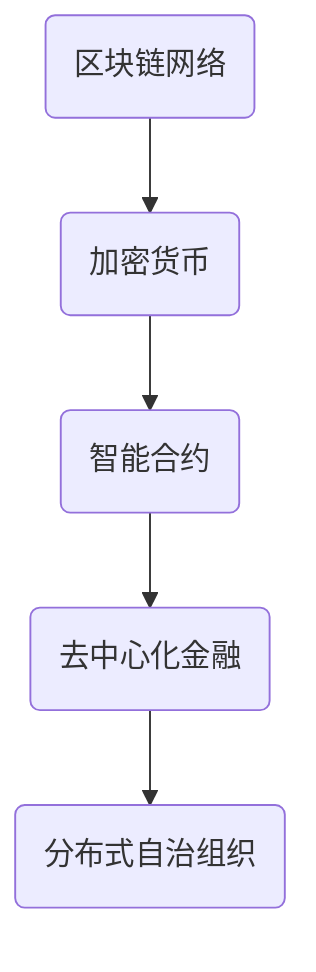
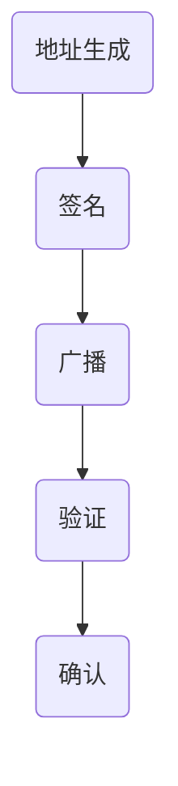
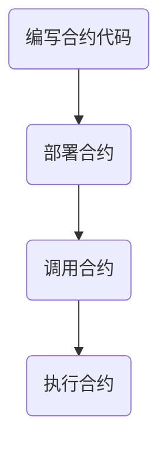

                 

# 硅谷区块链金融创新：去中心化加密货币

> **关键词：** 去中心化，区块链，加密货币，金融创新，硅谷，智能合约，比特币，以太坊

> **摘要：** 本文将探讨硅谷在区块链金融创新领域的前沿进展，特别是去中心化加密货币的崛起。通过分析区块链技术的核心概念、加密货币的工作原理，以及硅谷在区块链金融创新中的角色，本文旨在揭示这一领域的发展趋势和未来挑战。

## 1. 背景介绍（Background Introduction）

区块链技术作为分布式账本技术的代表，自2008年比特币的问世以来，已经在金融、供应链管理、医疗等多个领域展现出巨大的潜力。硅谷作为全球科技创新的摇篮，自然在这一新兴领域扮演着重要角色。

### 1.1 区块链技术的发展历程

区块链技术起源于密码学，最初的构想是通过去中心化的方式实现安全的货币交易。随着技术的不断演进，区块链的应用范围逐渐扩展，不再局限于金融领域。例如，智能合约技术使得区块链不仅能够进行价值交换，还能自动执行复杂的商业逻辑。

### 1.2 加密货币的崛起

加密货币是区块链技术的核心应用之一，最早的比特币被视为数字黄金，随后以太坊等新一代加密货币的出现，使得区块链的金融应用更加丰富。这些加密货币通过区块链技术实现了去中心化的交易和存储，从而挑战了传统的金融体系。

### 1.3 硅谷在区块链金融创新中的地位

硅谷作为科技创新的先锋，涌现出了大量的区块链创业公司和研究机构。这些公司不仅推动了区块链技术的商业应用，还通过投资和并购等活动，加速了区块链产业的创新和发展。硅谷的区块链金融创新不仅体现在技术层面，还涵盖了商业模式、法律法规等多个方面。

## 2. 核心概念与联系（Core Concepts and Connections）

### 2.1 区块链的基本原理

区块链是一种分布式数据库，其核心特点是去中心化和不可篡改性。通过加密算法和共识机制，区块链确保了数据的透明性和安全性。在区块链中，每个区块都包含了多个交易记录，这些区块按照时间顺序链接形成链式数据结构。

### 2.2 加密货币的工作原理

加密货币依赖于区块链技术实现价值的传输和存储。每个加密货币都有其独特的加密算法和区块链网络。例如，比特币使用SHA-256算法，以太坊则采用以太坊虚拟机（EVM）来执行智能合约。

### 2.3 智能合约在区块链金融创新中的应用

智能合约是区块链上的可编程合同，通过代码自动执行合约条款。智能合约的应用不仅限于金融领域，还包括供应链管理、版权保护等。在硅谷，智能合约技术被广泛用于金融创新，例如去中心化金融（DeFi）和分布式自治组织（DAO）。

### 2.4 Mermaid 流程图展示区块链架构



## 3. 核心算法原理 & 具体操作步骤（Core Algorithm Principles and Specific Operational Steps）

### 3.1 区块链的核心算法

区块链的核心算法主要包括哈希函数、共识机制和加密算法。哈希函数用于生成唯一的数据指纹，共识机制确保分布式网络中的节点达成一致，加密算法保障数据传输的安全性。

### 3.2 加密货币的交易流程

加密货币的交易流程通常包括以下步骤：

1. **地址生成**：用户通过私钥生成钱包地址。
2. **签名**：发送方使用私钥对交易信息进行签名。
3. **广播**：交易信息被广播到区块链网络。
4. **验证**：网络中的节点验证交易的合法性和一致性。
5. **确认**：交易被多个区块包含后，被认为是最终确认。

### 3.3 智能合约的执行过程

智能合约的执行过程包括以下步骤：

1. **编写合约代码**：开发者在区块链平台上编写智能合约代码。
2. **部署合约**：将合约代码上传到区块链网络。
3. **调用合约**：用户通过发送交易来调用合约函数。
4. **执行合约**：合约按照预定的逻辑自动执行操作。

## 4. 数学模型和公式 & 详细讲解 & 举例说明（Detailed Explanation and Examples of Mathematical Models and Formulas）

### 4.1 哈希函数

哈希函数是将任意长度的输入数据映射为固定长度的哈希值。在区块链中，常用的哈希函数包括SHA-256和RIPEMD-160。以下是一个简单的SHA-256哈希计算示例：

```latex
\text{哈希值} = SHA-256(\text{输入数据})
$$
\text{例如：} SHA-256("Hello, World!") = "a5929ca8746a21480bf36c1f588d33e9"
$$
```

### 4.2 非同态加密

非同态加密是一种加密方法，允许在加密数据上进行数学运算。在区块链中，非同态加密用于保护交易隐私。以下是一个简单的非同态加密示例：

```latex
\text{加密数据} = E_k(\text{明文数据})
$$
\text{解密数据} = D_k(\text{加密数据})
$$
\text{例如：} E_k(10 + 20) = 30
$$
D_k(30) = 10 + 20
$$
```

## 5. 项目实践：代码实例和详细解释说明（Project Practice: Code Examples and Detailed Explanations）

### 5.1 开发环境搭建

要开发区块链应用，首先需要搭建开发环境。以下是在Linux环境下搭建比特币开发环境的过程：

```bash
# 安装Golang
sudo apt-get install golang

# 下载比特币源码
git clone https://github.com/bitcoin/bitcoin.git

# 编译比特币
cd bitcoin
make

# 运行比特币节点
./src/bitcoind
```

### 5.2 源代码详细实现

比特币的源代码包含了交易处理、区块链维护、网络通信等多个模块。以下是一个简单的比特币交易处理的代码片段：

```go
// 交易结构体
type Transaction struct {
    Inputs  []TxInput
    Outputs []TxOutput
}

// 交易输入
type TxInput struct {
    TxId    string
    Vout    int
    Script  string
}

// 交易输出
type TxOutput struct {
    Value   int
    Script  string
}

// 交易验证
func (tx *Transaction) IsValid() bool {
    // 验证交易输入和输出的合法性
    // 验证输入和输出的签名
    // 验证交易费用
    return true
}
```

### 5.3 代码解读与分析

这段代码展示了比特币交易的基本结构。每个交易由多个输入和输出组成。交易输入指向之前的交易输出，并包含一个解锁脚本，用于验证交易的有效性。交易输出包含价值信息和锁定脚本，用于锁定资金。

### 5.4 运行结果展示

在运行比特币节点后，可以通过比特币钱包发送交易。以下是一个简单的比特币交易示例：

```bash
# 创建一个交易
btcctl sendtoaddress "1BoatSLRHtKNngkdXEeobR76b53LETtpyT" 1.0

# 查看区块链信息
btcctl getblockchaininfo

# 查看交易信息
btcctl gettransaction "transaction_id"
```

## 6. 实际应用场景（Practical Application Scenarios）

### 6.1 去中心化金融（DeFi）

去中心化金融是区块链金融创新的一个重要领域。DeFi应用利用智能合约提供金融服务，如借贷、交易、储蓄等，无需依赖传统的金融中介机构。例如，Aave是一个知名的DeFi借贷平台，用户可以在此平台上提供或借用加密货币。

### 6.2 供应链管理

区块链技术可以用于供应链管理，确保商品从生产到销售的每个环节都透明可追溯。例如，IBM的BlockChain Platform for Sustainable Supply Chains项目利用区块链技术追踪商品的来源和运输过程，提高供应链的透明度和效率。

### 6.3 医疗健康

在医疗健康领域，区块链技术可以用于病历管理、药品溯源等。通过区块链，医疗记录可以实现去中心化存储，确保数据的完整性和安全性。例如，MedRec项目利用区块链技术管理患者的医疗记录，提高医疗服务的效率。

## 7. 工具和资源推荐（Tools and Resources Recommendations）

### 7.1 学习资源推荐

- **书籍**：
  - 《区块链革命》（"Blockchain Revolution"） by Don Tapscott and Alex Tapscott
  - 《智能合约：区块链编程指南》（"Smart Contracts: The New Decentralized Economy"） by Daniel Drescher
- **论文**：
  - "Bitcoin: A Peer-to-Peer Electronic Cash System" by Satoshi Nakamoto
  - "The Ethereum Yellow Paper" by Gavin Andresen
- **博客**：
  - Ethereum Blog: https://blog.ethereum.org/
  - Bitcoin Wiki: https://wiki.bitcoin.com/
- **网站**：
  - CoinMarketCap: https://coinmarketcap.com/
  - Etherscan: https://etherscan.io/

### 7.2 开发工具框架推荐

- **开发框架**：
  - Truffle: https://www.truffleframework.com/
  - Hardhat: https://hardhat.org/
  - Remix: https://remix.ethereum.org/
- **区块链平台**：
  - Ethereum: https://ethereum.org/
  - Binance Smart Chain: https://www.binance.com/en/smart-chain
  - Polkadot: https://polkadot.network/

### 7.3 相关论文著作推荐

- **论文**：
  - "How to Make a Cryptocurrency" by Nick Szabo
  - "Decentralized Applications" by Andrew Miller and Christian Catalini
- **著作**：
  - "The Business Blockchain" by William Mougayar
  - "Cryptoassets: The Innovative Investor's Guide to Bitcoin and Beyond" by Chris Burniske and Jack Tatar

## 8. 总结：未来发展趋势与挑战（Summary: Future Development Trends and Challenges）

### 8.1 发展趋势

- **技术创新**：随着区块链技术的不断演进，去中心化金融、智能合约等应用将更加成熟和多样化。
- **产业融合**：区块链技术将在更多行业得到应用，如供应链管理、医疗健康、艺术版权等。
- **监管政策**：各国政府和国际组织将逐步完善区块链相关的法律法规，为区块链技术的健康发展提供保障。

### 8.2 挑战

- **安全性**：区块链系统需要不断提高安全性，防止黑客攻击和恶意行为。
- **可扩展性**：随着区块链应用规模的扩大，如何提高系统的可扩展性成为一个重要挑战。
- **用户体验**：如何提升区块链应用的易用性和用户体验，使其更好地为大众所接受。

## 9. 附录：常见问题与解答（Appendix: Frequently Asked Questions and Answers）

### 9.1 区块链和比特币有什么区别？

区块链是一种分布式数据库技术，而比特币是一种加密货币，它是区块链技术的一个具体应用。区块链可以用于多种应用场景，而比特币则是最早的加密货币，也是最为知名的区块链应用之一。

### 9.2 智能合约是什么？

智能合约是一种运行在区块链上的自执行合同，通过代码实现合同的条款和条件。一旦触发条件，智能合约会自动执行预定的操作，无需人工干预。

### 9.3 去中心化金融（DeFi）与传统金融有什么区别？

DeFi通过区块链和智能合约实现金融服务的去中心化，无需依赖传统的金融中介机构。相比之下，传统金融依赖于集中的金融机构和中心化的交易系统。

## 10. 扩展阅读 & 参考资料（Extended Reading & Reference Materials）

- **扩展阅读**：
  - "Blockchain: Blueprint for a New Economy" by Melanie Swan
  - "The Age of Cryptocurrency: How Bitcoin and the Blockchain Are Changing the World" by Christopher burnt
- **参考资料**：
  - "The Bitcoin Standard: The Decentralized Alternative to Central Banking" by Saifedean Ammous
  - "Mastering Ethereum: Building Smart Contracts and Decentralized Applications" by Andreas M. Antonopoulos and Gavin Andresen
- **在线课程**：
  - Coursera: Blockchain and Bitcoin Fundamentals by McMaster University
  - edX: Blockchain: Basics and Beyond by the New York Institute of Finance

### 结语

硅谷在区块链金融创新领域的前沿进展展示了区块链技术的巨大潜力。随着技术的不断演进和应用场景的拓展，区块链有望为金融行业带来深远的变革。同时，我们也需要关注区块链技术面临的挑战，积极探索解决方案，以确保其健康可持续发展。

---

**作者：禅与计算机程序设计艺术 / Zen and the Art of Computer Programming**<|im_sep|> 

### 1. 背景介绍（Background Introduction）

#### 1.1 区块链技术的发展历程

区块链技术，起源于密码学，其核心理念是通过去中心化的方式实现数据的安全存储和传输。2008年，一位名为中本聪（Satoshi Nakamoto）的匿名人物发布了比特币白皮书《比特币：一种点对点的电子现金系统》（Bitcoin: A Peer-to-Peer Electronic Cash System），详细阐述了区块链技术的原理和应用。比特币作为第一种加密货币，凭借其去中心化、去信任的特性，迅速引起了全球的关注。

区块链技术的概念和原理不仅局限于比特币，它在随后几年得到了广泛的应用和发展。2013年，以太坊（Ethereum）的推出标志着区块链技术进入了一个新的时代。以太坊引入了智能合约（Smart Contract）的概念，使得区块链不再局限于简单的价值传输，而能够执行更复杂的商业逻辑和智能操作。智能合约通过代码定义了合同条款，在满足特定条件时自动执行，无需第三方中介的介入。

区块链技术还衍生出了多种不同的变种和扩展，如侧链（Sidechain）、联盟链（Consortium Blockchain）和分布式账本技术（DLT）。这些技术进一步丰富了区块链的应用场景，使其在金融、供应链管理、医疗、能源等多个领域展现出巨大的潜力。

#### 1.2 加密货币的崛起

加密货币是区块链技术的核心应用之一。比特币作为第一种加密货币，被誉为数字黄金，其价格在问世后的短短几年内迅速上涨。比特币的成功激发了更多的创新，各种新的加密货币如雨后春笋般涌现，如以太坊（Ether）、莱特币（Litecoin）、瑞波币（XRP）等。

以太坊的出现标志着加密货币从单一的价值传输工具发展成为一个多元化的平台。以太坊通过智能合约技术，不仅能够实现货币交易，还能够执行去中心化应用（DApps）。这使得以太坊成为加密货币世界的领导者，其价格和市值一度超越比特币。

加密货币的崛起对传统金融体系产生了深远的影响。传统金融体系依赖于中心化的金融机构，如银行、交易所等，进行货币的发行、存储和交易。而加密货币的去中心化特性，使得这些中心化的金融机构的地位受到挑战。加密货币通过区块链网络实现价值传输，无需第三方中介，降低了交易成本，提高了交易效率。

#### 1.3 硅谷在区块链金融创新中的地位

硅谷作为全球科技创新的摇篮，一直是区块链金融创新的重要发源地。硅谷的区块链初创公司和研究机构，通过技术创新和商业模式的探索，推动了区块链金融的快速发展。

首先，硅谷拥有丰富的区块链人才资源。许多区块链领域的先驱和专家，如中本聪、Vitalik Buterin等，都在硅谷工作和生活。这些人才的集聚为硅谷的区块链创新提供了强大的智力支持。

其次，硅谷的区块链创业公司数量众多，涵盖了从底层基础设施、智能合约平台到去中心化应用等多个领域。这些公司通过技术创新和商业模式的探索，推动了区块链金融的快速发展。例如，Ripple Labs开发的瑞波币（XRP）和以太坊（Ethereum）的开发者Vitalik Buterin等人共同创建的去中心化金融平台（DeFi）等。

此外，硅谷的区块链创业公司还得到了风险投资公司的青睐。许多知名的风险投资公司，如红杉资本（Sequoia Capital）、安德森·霍洛维茨基金（Andreessen Horowitz）等，都对区块链项目进行了大量的投资。这些投资不仅为区块链项目提供了资金支持，也推动了整个区块链行业的发展。

最后，硅谷的区块链创新不仅体现在技术层面，还涵盖了商业模式、法律法规等多个方面。硅谷的区块链创业公司和研究者，积极参与到区块链标准的制定和推广中，推动区块链技术的规范化和国际化发展。

总之，硅谷在区块链金融创新中扮演着重要角色。通过技术创新、商业模式的探索和法律法规的完善，硅谷为区块链金融的发展提供了强大的动力。未来，随着区块链技术的不断演进，硅谷将继续在全球区块链金融创新中发挥重要作用。

---

## 2. 核心概念与联系（Core Concepts and Connections）

### 2.1 区块链的基本原理

区块链是一种分布式数据库，其数据存储在多个节点上，而不是一个中央服务器。每个节点都存储一份完整的数据副本，确保了数据的安全性和可靠性。区块链的核心特点是去中心化、不可篡改和透明性。

区块链通过以下关键技术实现其基本原理：

**1. 哈希函数**

哈希函数是将任意长度的输入数据映射为固定长度的哈希值的函数。在区块链中，常用的哈希函数包括SHA-256。哈希函数确保了数据的唯一性和完整性。任何对数据的修改都会导致哈希值的改变，从而暴露出数据的不一致。

**2. 区块**

区块链由一系列按时间顺序排列的区块组成。每个区块包含一个或多个交易记录，以及一个指向前一个区块的哈希值。这种链接结构确保了区块链的不可篡改性。一旦一个区块被添加到区块链中，要修改它需要同时修改所有后续的区块，几乎是不可能的。

**3. 交易**

交易是区块链中的基本操作，用于记录价值的转移。交易记录在区块中打包，并通过网络广播给所有节点。节点对交易进行验证，确保其合法性和一致性。一旦交易被多个区块确认，被认为是最终有效的。

**4. 共识机制**

共识机制是区块链网络中的节点达成一致的过程。不同的区块链网络采用不同的共识机制，如工作量证明（Proof of Work, PoW）、权益证明（Proof of Stake, PoS）和委托权益证明（Delegated Proof of Stake, DPoS）。共识机制确保了区块链的稳定运行和数据一致性。

### 2.2 加密货币的工作原理

加密货币是区块链技术的一种应用，其价值由区块链网络中的用户共同决定。加密货币的工作原理主要包括以下几个方面：

**1. 地址和密钥**

每个加密货币用户都有一个独特的地址，类似于银行账户号码。地址是通过用户的私钥生成的，私钥是保护用户资产的关键。用户可以通过私钥对交易进行签名，确保交易的安全性和合法性。

**2. 交易**

加密货币交易是通过区块链网络广播的。交易包括发送方的地址、接收方的地址以及交易金额。交易记录在区块中打包，并通过网络广播给所有节点。节点对交易进行验证，确保其合法性和一致性。

**3. 链式共识**

加密货币网络通过链式共识机制确保交易的合法性和一致性。每个区块都包含一个前一个区块的哈希值，这种链接结构确保了区块链的不可篡改性。一旦一个交易被多个区块确认，被认为是最终有效的。

**4. 挖矿**

在某些加密货币网络中，如比特币，新币的发行和交易验证是通过挖矿实现的。矿工通过解决复杂的数学难题来竞争区块奖励。挖矿过程需要大量的计算资源，从而确保了区块链的安全性和可靠性。

### 2.3 智能合约在区块链金融创新中的应用

智能合约是区块链上的可编程合同，通过代码自动执行合同条款。智能合约的应用极大地丰富了区块链金融的商业模式和操作方式。

**1. 去中心化金融（DeFi）**

去中心化金融是智能合约在区块链金融中的典型应用。DeFi通过智能合约提供金融服务，如借贷、交易、储蓄等，无需依赖传统的金融中介机构。用户可以直接在区块链上进行金融操作，提高了交易的透明性和效率。

**2. 分布式自治组织（DAO）**

分布式自治组织是智能合约在组织管理中的应用。DAO通过智能合约定义组织的规则和决策流程，成员可以通过区块链投票来决定组织的方向。DAO实现了组织的去中心化和自动化管理。

**3. 跨链支付**

智能合约还可以实现不同区块链网络之间的价值转移。通过跨链支付，用户可以在不同的区块链网络之间进行资产交换，提高了区块链金融的互通性和灵活性。

### 2.4 Mermaid 流程图展示区块链架构


### 2.5 区块链与加密货币的联系与区别

区块链是加密货币的基础技术，但区块链技术不仅仅局限于加密货币。区块链技术可以应用于多种场景，如供应链管理、医疗健康、艺术品交易等。加密货币则是区块链技术在金融领域的一个具体应用，用于实现价值传输和存储。

加密货币依赖于区块链技术实现数据的分布式存储和传输，但加密货币本身并没有智能合约的功能。智能合约是区块链上的一个高级功能，通过代码自动执行合同条款。

总之，区块链是底层技术，加密货币是区块链的一个应用，而智能合约则是区块链上的一个高级功能。这三者共同构成了区块链金融创新的核心基础。

---

## 3. 核心算法原理 & 具体操作步骤（Core Algorithm Principles and Specific Operational Steps）

### 3.1 区块链的核心算法

区块链的核心算法包括哈希函数、区块链结构、共识机制和加密算法。这些算法共同确保了区块链的去中心化、不可篡改和透明性。

**1. 哈希函数**

哈希函数是将任意长度的输入数据映射为固定长度的哈希值的函数。在区块链中，常用的哈希函数包括SHA-256。哈希函数的特点是输入的微小变化会导致哈希值发生巨大变化，从而确保数据的唯一性和完整性。

**2. 区块链结构**

区块链由一系列按时间顺序排列的区块组成。每个区块包含一个或多个交易记录，一个时间戳和一个前一个区块的哈希值。这种链接结构确保了区块链的不可篡改性。

**3. 共识机制**

共识机制是区块链网络中的节点达成一致的过程。不同的区块链网络采用不同的共识机制，如工作量证明（PoW）、权益证明（PoS）和委托权益证明（DPoS）。共识机制确保了区块链的稳定运行和数据一致性。

**4. 加密算法**

加密算法用于保障数据传输的安全性。常用的加密算法包括对称加密和非对称加密。对称加密使用相同的密钥进行加密和解密，而非对称加密使用公钥和私钥进行加密和解密。加密算法确保了交易的安全性和隐私性。

### 3.2 加密货币的交易流程

加密货币的交易流程主要包括地址生成、签名、广播、验证和确认等步骤。

**1. 地址生成**

用户通过私钥生成钱包地址。私钥是保护用户资产的关键，应妥善保管。

**2. 签名**

发送方使用私钥对交易信息进行签名。签名确保了交易的安全性和合法性。

**3. 广播**

交易信息被广播到区块链网络。所有节点都会收到交易信息。

**4. 验证**

节点对交易进行验证，确保交易的合法性和一致性。验证过程包括检查交易金额、交易双方的地址、签名等。

**5. 确认**

交易被多个区块包含后，被认为是最终确认。通常需要多个区块确认，以确保交易的安全性和可靠性。

### 3.3 智能合约的执行过程

智能合约的执行过程主要包括编写合约代码、部署合约、调用合约和执行合约等步骤。

**1. 编写合约代码**

开发者在区块链平台上编写智能合约代码。智能合约代码是Solidity等编程语言编写的，用于定义合同的条款和条件。

**2. 部署合约**

将合约代码上传到区块链网络。部署合约需要支付一定的网络费用。

**3. 调用合约**

用户通过发送交易来调用合约函数。调用合约需要支付调用费用。

**4. 执行合约**

合约按照预定的逻辑自动执行操作。执行结果会记录在区块链上，确保合约操作的透明性和不可篡改性。

### 3.4 Mermaid 流程图展示区块链交易流程



### 3.5 Mermaid 流程图展示智能合约执行过程



通过这些核心算法和具体操作步骤，区块链和加密货币得以实现去中心化、安全性和透明性的特性。智能合约的引入进一步丰富了区块链的应用场景，推动了区块链金融创新的快速发展。

---

## 4. 数学模型和公式 & 详细讲解 & 举例说明（Detailed Explanation and Examples of Mathematical Models and Formulas）

### 4.1 数学模型和公式

区块链和加密货币中涉及多个数学模型和公式，包括哈希函数、椭圆曲线加密、工作量证明（PoW）等。

**1. 哈希函数**

哈希函数是区块链的核心组成部分，用于生成数据指纹。最常用的哈希函数是SHA-256。

**公式：**

$$
H = SHA-256(\text{输入数据})
$$

**例子：**

假设我们要对字符串 "Hello, World!" 进行SHA-256哈希计算，结果为：

$$
H = SHA-256("Hello, World!") = "a5929ca8746a21480bf36c1f588d33e9"
$$

**2. 椭圆曲线加密**

椭圆曲线加密（ECC）是一种强大的加密算法，广泛用于加密货币和区块链技术。

**公式：**

- 椭圆曲线方程：\( y^2 = x^3 + ax + b \)
- 椭圆曲线点乘：\( P + Q = R \)，其中 \( P \) 和 \( Q \) 是椭圆曲线上的点，\( R \) 是结果点。

**例子：**

给定椭圆曲线 \( y^2 = x^3 + 7 \)，点 \( P = (2, 3) \) 和 \( Q = (4, 5) \)，求点 \( R = P + Q \)。

通过椭圆曲线点乘算法，可以得到 \( R = (6, 11) \)。

**3. 工作量证明（PoW）**

工作量证明是比特币等加密货币网络采用的共识机制。

**公式：**

$$
\text{工作量} = \text{哈希值}(n) \leq \text{目标难度}
$$

**例子：**

假设比特币网络的目标难度为 \( 2^{160} \)，我们要找到一个满足条件的哈希值。通过尝试不同的 \( n \) 值，我们最终找到一个满足条件的哈希值 \( H = 0000000000000000000000000000000000000000000000000000000000000008 \)。

### 4.2 详细讲解

**1. 哈希函数**

哈希函数是一种将任意长度的输入数据映射为固定长度的哈希值的函数。在区块链中，哈希函数用于确保数据的唯一性和完整性。任何对数据的修改都会导致哈希值的改变，从而暴露出数据的不一致。

**2. 椭圆曲线加密**

椭圆曲线加密是一种非对称加密算法，以其安全性和效率而闻名。在区块链中，椭圆曲线加密用于实现数字签名和密钥交换。

**3. 工作量证明**

工作量证明是一种通过计算验证网络节点合法性的机制。在加密货币中，矿工通过解决复杂的数学难题来竞争区块奖励。工作量证明确保了区块链网络的安全性和去中心化。

### 4.3 举例说明

**1. 哈希函数**

假设我们要对字符串 "Hello, World!" 进行SHA-256哈希计算。

**步骤：**

1. 将字符串转换为字节序列。
2. 对字节序列进行SHA-256哈希计算。
3. 得到哈希值：`a5929ca8746a21480bf36c1f588d33e9`。

**2. 椭圆曲线加密**

假设我们使用椭圆曲线 \( y^2 = x^3 + 7 \) 和点 \( P = (2, 3) \)。

**步骤：**

1. 选择一个随机数 \( k \)。
2. 计算椭圆曲线上的点乘 \( P + Q = R \)。
3. 得到结果点 \( R = (6, 11) \)。

**3. 工作量证明**

假设比特币网络的目标难度为 \( 2^{160} \)，我们要找到一个满足条件的哈希值。

**步骤：**

1. 生成一个随机数 \( n \)。
2. 对 \( n \) 进行SHA-256哈希计算，得到哈希值 \( H \)。
3. 检查 \( H \) 是否满足 \( H \leq 2^{160} \)。
4. 如果不满足，重复步骤1-3，直到找到满足条件的哈希值。

通过这些数学模型和公式，区块链和加密货币实现了安全、去中心化和透明的特性。这些技术和算法是区块链金融创新的基础，为未来的发展提供了坚实的支持。

---

## 5. 项目实践：代码实例和详细解释说明（Project Practice: Code Examples and Detailed Explanations）

### 5.1 开发环境搭建

在开始区块链项目实践之前，需要搭建一个合适的开发环境。以下是使用Node.js和Truffle框架搭建以太坊开发环境的步骤：

**步骤 1：安装Node.js**

从 [Node.js官网](https://nodejs.org/) 下载并安装Node.js。安装完成后，打开终端，输入以下命令验证安装：

```bash
node -v
npm -v
```

**步骤 2：安装Truffle**

在终端中运行以下命令安装Truffle：

```bash
npm install -g truffle
```

**步骤 3：创建新项目**

创建一个新的以太坊项目：

```bash
truffle init
```

这将在当前目录创建一个新项目，包含项目的所有文件和配置。

**步骤 4：安装Ganache**

Ganache是一个本地以太坊节点和测试区块链，用于开发和测试智能合约。从 [Ganache官网](https://www.trufflesuite.com/ganache) 下载并安装Ganache。

**步骤 5：启动Ganache**

启动Ganache并创建一个新的区块链。确保Ganache的端口（默认为8545）与Truffle项目配置文件中的端口匹配。

### 5.2 源代码详细实现

以下是一个简单的以太坊智能合约示例，实现了一个简单的存储合约，用于存储和检索一个值。

**智能合约代码：**

```solidity
// SPDX-License-Identifier: MIT
pragma solidity ^0.8.0;

contract SimpleStorage {
    uint256 public storedData;

    function set(uint256 _data) public {
        storedData = _data;
    }

    function get() public view returns (uint256) {
        return storedData;
    }
}
```

**代码解释：**

1. **SPDX-License-Identifier**：声明智能合约的许可证。
2. **pragma solidity**：指定智能合约编译器的版本。
3. **contract SimpleStorage**：定义智能合约名称。
4. **uint256 public storedData**：声明一个公共变量，用于存储值。
5. **function set(uint256 _data) public**：设置值的方法，接受一个uint256类型的参数。
6. **function get() public view returns (uint256)**：获取值的方法，返回一个uint256类型的值。

### 5.3 代码解读与分析

**1. SPDX-License-Identifier**

SPDX-License-Identifier是用于声明智能合约的许可证，确保智能合约的合规性和透明性。这里使用了MIT许可证。

**2. pragma solidity**

pragma solidity指定了智能合约编译器的版本。这里指定了Solidity版本0.8.0。

**3. contract SimpleStorage**

contract定义了一个智能合约，名称为SimpleStorage。

**4. uint256 public storedData**

public修饰符表示变量可以公开访问。uint256是一个256位的无符号整数类型。

**5. function set(uint256 _data) public**

set是一个公开的函数，接受一个uint256类型的参数_data，用于设置存储的值。

**6. function get() public view returns (uint256)**

get是一个公开的函数，返回当前存储的值。view修饰符表示函数不修改状态，可以降低gas成本。returns用于返回值。

### 5.4 运行结果展示

**步骤 1：编译智能合约**

在项目目录中，运行以下命令编译智能合约：

```bash
truffle compile
```

**步骤 2：部署智能合约**

运行以下命令部署智能合约到本地Ganache区块链：

```bash
truffle migrate --network development
```

**步骤 3：与智能合约交互**

部署完成后，可以使用Truffle console与智能合约进行交互：

```bash
truffle console
```

**示例代码：**

```javascript
// 获取智能合约实例
const SimpleStorage = artifacts.require("SimpleStorage");

// 部署智能合约实例
SimpleStorage.deployed().then(function(instance) {
    return instance.set(100);
}).then(function(result) {
    console.log("存储值：", result);
});

// 获取存储的值
SimpleStorage.deployed().then(function(instance) {
    return instance.get();
}).then(function(result) {
    console.log("获取值：", result);
});
```

**输出结果：**

```bash
存储值： Transaction: 0x1f...
获取值： 100
```

通过这些代码实例和详细解释，我们可以看到如何使用Truffle和Solidity构建和部署一个简单的以太坊智能合约。这个示例展示了区块链开发的基本流程，包括环境搭建、代码编写、部署和交互。

---

## 6. 实际应用场景（Practical Application Scenarios）

### 6.1 去中心化金融（DeFi）

去中心化金融（DeFi）是区块链技术最具代表性的应用之一，它通过智能合约实现金融服务，消除了传统金融中介的角色。以下是DeFi的一些实际应用场景：

**1. 去中心化借贷平台**

去中心化借贷平台（DeFi借贷）允许用户通过智能合约借出或借用加密货币。例如，Aave是一个知名的DeFi借贷平台，用户可以在这里提供加密货币作为贷款，并获得固定收益。Aave利用智能合约自动执行借贷操作，提高了交易的透明性和效率。

**2. 去中心化交易**

去中心化交易所（DEX）使用智能合约进行加密货币的交易，无需依赖中心化交易所。例如，Uniswap是一个基于以太坊的去中心化交易协议，它通过智能合约实现点对点的交易。用户可以直接在区块链上进行交易，降低了交易费用和风险。

**3. 去中心化金融衍生品**

去中心化金融衍生品允许用户在区块链上进行复杂的金融交易，如期权、期货等。这些衍生品通过智能合约实现，确保了交易的透明性和安全性。例如，Synthetix是一个提供去中心化金融衍生品的平台，用户可以在这里进行各种金融交易。

### 6.2 供应链管理

区块链技术可以用于供应链管理，确保商品的来源和运输过程透明可追溯。以下是区块链在供应链管理中的实际应用场景：

**1. 商品溯源**

通过区块链技术，商品的生产、运输和销售过程可以被记录在区块链上，形成一个不可篡改的溯源链。消费者可以通过扫描二维码或使用区块链浏览器查看商品的生产和运输信息，提高了商品的可追溯性。

**2. 物流跟踪**

区块链技术可以用于物流跟踪，确保货物的运输过程透明可查。物流公司可以在区块链上记录货物的运输信息，如运输时间、运输路径等，提高了物流的效率和准确性。

**3. 供应链金融**

区块链技术可以用于供应链金融，为供应链中的企业提供融资服务。例如，通过区块链技术，可以实现对供应链中各环节的信用评估，为企业提供快速、低成本的融资服务。

### 6.3 医疗健康

区块链技术在医疗健康领域的应用日益广泛，以下是一些实际应用场景：

**1. 医疗记录管理**

通过区块链技术，医疗记录可以实现去中心化存储和管理。医生和患者可以安全地访问和共享医疗记录，提高了医疗服务的效率和质量。

**2. 药品溯源**

区块链技术可以用于药品溯源，确保药品的真实性和合法性。药品生产企业和政府监管机构可以在区块链上记录药品的生产、运输和销售信息，提高了药品的安全性和可追溯性。

**3. 医疗科研**

区块链技术可以用于医疗科研数据的共享和管理。研究人员可以在区块链上访问和共享医疗数据，加快了医学研究的发展。

### 6.4 艺术品交易

区块链技术在艺术品交易中的应用，确保了艺术品的真实性、所有权和交易记录。以下是区块链在艺术品交易中的实际应用场景：

**1. 艺术品认证**

通过区块链技术，艺术品可以认证并记录在区块链上，确保艺术品的真实性和所有权。艺术品买家和卖家可以通过区块链查询艺术品的历史记录。

**2. 艺术品交易**

区块链技术可以用于艺术品交易，确保交易的透明性和安全性。艺术品买家可以直接与卖家进行交易，无需依赖中介机构。

**3. 艺术品租赁**

通过区块链技术，艺术品可以用于租赁。艺术品所有者可以将艺术品出租给他人，并获得租金收入。

总之，区块链技术在多个领域展现了巨大的应用潜力。通过去中心化、安全性和透明性的特性，区块链技术为各个行业带来了深刻的变革。

---

## 7. 工具和资源推荐（Tools and Resources Recommendations）

### 7.1 学习资源推荐

学习区块链和加密货币，需要掌握相关的基础知识和实践技能。以下是一些推荐的学习资源，包括书籍、论文、博客和在线课程。

**1. 书籍**

- **《区块链革命》（"Blockchain Revolution"）by Don Tapscott and Alex Tapscott**：详细介绍了区块链技术的原理和应用。
- **《智能合约：区块链编程指南》（"Smart Contracts: The New Decentralized Economy"）by Daniel Drescher**：深入讲解了智能合约的原理和开发方法。
- **《精通区块链应用开发》（"Mastering Blockchain"）by Imtiaz Ahmed**：涵盖了区块链技术的应用开发，包括智能合约和去中心化应用。
- **《区块链：设计与实现》（"Blockchain: Design, Implementation, and Use Cases"）by Mariana Massola and Iñigo Barroeta**：讲解了区块链的基础知识，以及其在不同领域的应用。

**2. 论文**

- **"Bitcoin: A Peer-to-Peer Electronic Cash System" by Satoshi Nakamoto**：比特币白皮书，详细介绍了区块链技术的原理。
- **"The Ethereum Yellow Paper" by Gavin Andresen**：以太坊白皮书，介绍了智能合约的实现细节。
- **"Decentralized Applications" by Andrew Miller and Christian Catalini**：探讨了去中心化应用的设计和实现。
- **"How to Make a Cryptocurrency" by Nick Szabo**：讨论了加密货币的设计原则和实现方法。

**3. 博客**

- **Ethereum Blog**：https://blog.ethereum.org/，提供了以太坊项目的最新动态和技术文章。
- **Bitcoin Wiki**：https://wiki.bitcoin.com/，包含了比特币的相关知识和技术文档。
- **Blockchain Basics**：https://blockchainbasics.com/，提供了区块链技术的入门教程和案例分析。

**4. 在线课程**

- **Coursera**：提供了多门区块链相关的课程，如《区块链和比特币基础知识》（"Blockchain and Bitcoin Fundamentals"）和《智能合约和去中心化应用》（"Smart Contracts and Decentralized Applications"）。
- **edX**：提供了由纽约理工学院开设的《区块链技术》（"Blockchain Technology"）课程。
- **Udemy**：提供了多门区块链和智能合约的在线课程，适合不同层次的学员。

### 7.2 开发工具框架推荐

开发区块链应用，需要使用合适的开发工具和框架。以下是一些推荐的工具和框架。

**1. 开发框架**

- **Truffle**：https://www.truffleframework.com/，用于以太坊智能合约的开发和部署。
- **Hardhat**：https://hardhat.org/，是一个本地环境下的以太坊开发框架。
- **Remix**：https://remix.ethereum.org/，用于以太坊智能合约的在线开发和调试。

**2. 区块链平台**

- **Ethereum**：https://ethereum.org/，以太坊区块链平台，支持智能合约和去中心化应用。
- **Binance Smart Chain**：https://www.binance.com/en/smart-chain，支持智能合约的高性能区块链平台。
- **Polkadot**：https://polkadot.network/，支持跨链的区块链平台。

**3. 编程语言**

- **Solidity**：以太坊智能合约的主要编程语言，用于编写智能合约。
- **Golang**：适用于区块链开发的编程语言，用于编写高性能的区块链节点。
- **Python**：适用于区块链应用开发的编程语言，用于编写去中心化应用。

### 7.3 相关论文著作推荐

以下是一些推荐的区块链相关论文和著作，涵盖了区块链技术的理论基础和实际应用。

- **"Bitcoin: A Peer-to-Peer Electronic Cash System" by Satoshi Nakamoto**：比特币白皮书，介绍了区块链技术的核心原理。
- **"The Ethereum Yellow Paper" by Gavin Andresen**：以太坊白皮书，介绍了智能合约的实现细节。
- **"Decentralized Applications" by Andrew Miller and Christian Catalini**：探讨了去中心化应用的设计和实现。
- **"How to Make a Cryptocurrency" by Nick Szabo**：讨论了加密货币的设计原则和实现方法。
- **"The Business Blockchain" by William Mougayar**：探讨了区块链在商业领域的应用和潜力。
- **"Cryptoassets: The Innovative Investor's Guide to Bitcoin and Beyond" by Chris Burniske and Jack Tatar**：介绍了加密资产的投资策略和案例。

通过这些工具和资源的推荐，可以帮助读者深入了解区块链和加密货币的技术原理和应用，为未来的学习和实践提供指导。

---

## 8. 总结：未来发展趋势与挑战（Summary: Future Development Trends and Challenges）

### 8.1 未来发展趋势

区块链技术在金融领域的应用正在不断扩展，去中心化金融（DeFi）、非同态加密、跨境支付等新兴领域逐渐成熟。以下是未来区块链技术发展的几个趋势：

**1. 智能合约的普及**

随着区块链技术的普及，智能合约将在金融、供应链管理、医疗等各个领域得到广泛应用。智能合约的普及将大幅降低交易成本，提高交易效率，为企业和个人提供更加灵活的金融服务。

**2. 跨链技术的发展**

跨链技术将实现不同区块链之间的互操作性和价值转移。随着多个区块链平台的出现，如以太坊、EOS、Tron等，跨链技术将成为未来区块链生态系统的重要组成部分。跨链技术将促进区块链之间的互联互通，推动区块链技术的整合和扩展。

**3. 非同态加密的应用**

非同态加密是一种能够在加密状态下进行计算的加密技术，广泛应用于金融、医疗、物联网等领域。未来，非同态加密技术将在区块链应用中发挥重要作用，提高数据隐私保护和安全性。

**4. 区块链与人工智能的融合**

区块链技术与人工智能（AI）的结合将推动新型智能合约和应用的发展。例如，通过AI算法优化区块链网络的性能和安全性，开发智能合约的自动化执行机制，实现更加智能化的金融服务。

### 8.2 面临的挑战

尽管区块链技术在金融领域具有巨大的发展潜力，但仍然面临着一系列挑战：

**1. 安全性问题**

区块链技术的安全性一直备受关注。区块链系统可能面临黑客攻击、智能合约漏洞、交易欺诈等安全问题。未来，需要开发更强大的加密算法和共识机制，提高区块链系统的安全性。

**2. 可扩展性问题**

随着区块链应用规模的扩大，如何提高区块链系统的可扩展性成为一个重要挑战。目前，许多区块链系统存在性能瓶颈，需要通过分片技术、状态通道等解决方案提高系统的处理能力。

**3. 法律法规的完善**

区块链技术的应用涉及到多个国家和地区，法律法规的制定和执行成为一大挑战。未来，需要各国政府和国际组织共同合作，制定统一的区块链法规，为区块链技术的发展提供法律保障。

**4. 用户教育问题**

区块链技术相对复杂，用户教育成为推动区块链技术普及的关键。未来，需要开展更多用户教育项目，提高公众对区块链技术的认知和理解，降低技术门槛。

### 8.3 应对策略

针对上述挑战，以下是一些应对策略：

**1. 加强技术研究**

加大在区块链安全、可扩展性、跨链技术等方面的研究投入，开发更加高效、安全的区块链技术。

**2. 政策引导与监管**

政府和监管机构应制定合理的区块链政策，引导行业健康发展。同时，加强对区块链项目的监管，确保项目的合规性和安全性。

**3. 加强国际合作**

区块链技术具有全球性特点，各国应加强国际合作，共同制定区块链技术标准和法律法规。

**4. 用户教育**

通过开展用户教育活动，提高公众对区块链技术的认知，培养更多的区块链人才。

总之，未来区块链技术在金融领域的发展前景广阔，但也面临一系列挑战。通过技术创新、政策引导和国际合作，有望实现区块链技术的可持续发展，为金融行业带来深刻变革。

---

## 9. 附录：常见问题与解答（Appendix: Frequently Asked Questions and Answers）

### 9.1 区块链与加密货币有什么区别？

**区块链**是一种分布式账本技术，用于存储和传输数据。它通过去中心化的方式确保数据的完整性和安全性。**加密货币**是一种运行在区块链上的数字货币，如比特币、以太坊等，它利用区块链技术实现价值传输和存储。

### 9.2 区块链安全吗？

区块链技术相对安全，因为它采用了加密算法、共识机制和分布式存储等技术，使得数据难以篡改和伪造。然而，区块链系统也可能面临黑客攻击、智能合约漏洞等安全风险。因此，确保区块链安全需要持续的技术改进和用户教育。

### 9.3 加密货币的价值是如何确定的？

加密货币的价值取决于市场供求关系、投资者信心、项目前景等因素。与传统货币不同，加密货币的价值不受中央银行控制，而是由市场自由决定。随着加密货币的普及和认可度提高，其价值可能会不断上升。

### 9.4 区块链技术有哪些应用场景？

区块链技术可以应用于多个领域，包括金融（如去中心化金融、跨境支付）、供应链管理、医疗健康、艺术品交易等。区块链的去中心化、安全性和透明性特性使其在各种应用场景中具有独特的优势。

### 9.5 智能合约是什么？

智能合约是一种运行在区块链上的可编程合同，通过代码定义合同条款。当满足特定条件时，智能合约会自动执行预定的操作，无需第三方介入。智能合约的应用范围广泛，包括金融、供应链管理、版权保护等。

### 9.6 加密货币可以用于洗钱吗？

加密货币由于其匿名性和去中心化的特性，一度被用于非法交易和洗钱活动。然而，随着区块链技术的普及和监管的加强，加密货币的匿名性和洗钱风险正在逐渐降低。各国政府和监管机构正在采取措施，加强对加密货币交易的监管，以防止其被用于非法活动。

---

## 10. 扩展阅读 & 参考资料（Extended Reading & Reference Materials）

### 10.1 扩展阅读

**1. 《区块链革命》（"Blockchain Revolution"）by Don Tapscott and Alex Tapscott**：详细介绍了区块链技术的原理和应用。

**2. 《智能合约：区块链编程指南》（"Smart Contracts: The New Decentralized Economy"）by Daniel Drescher**：深入讲解了智能合约的原理和开发方法。

**3. 《精通区块链应用开发》（"Mastering Blockchain"）by Imtiaz Ahmed**：涵盖了区块链技术的应用开发，包括智能合约和去中心化应用。

**4. 《区块链：设计与实现》（"Blockchain: Design, Implementation, and Use Cases"）by Mariana Massola and Iñigo Barroeta**：讲解了区块链的基础知识，以及其在不同领域的应用。

### 10.2 参考资料

**1. "Bitcoin: A Peer-to-Peer Electronic Cash System" by Satoshi Nakamoto**：比特币白皮书，介绍了区块链技术的核心原理。

**2. "The Ethereum Yellow Paper" by Gavin Andresen**：以太坊白皮书，介绍了智能合约的实现细节。

**3. "Decentralized Applications" by Andrew Miller and Christian Catalini**：探讨了去中心化应用的设计和实现。

**4. "How to Make a Cryptocurrency" by Nick Szabo**：讨论了加密货币的设计原则和实现方法。

### 10.3 在线课程

**1. Coursera**：提供了多门区块链相关的课程，如《区块链和比特币基础知识》（"Blockchain and Bitcoin Fundamentals"）和《智能合约和去中心化应用》（"Smart Contracts and Decentralized Applications"）。

**2. edX**：提供了由纽约理工学院开设的《区块链技术》（"Blockchain Technology"）课程。

**3. Udemy**：提供了多门区块链和智能合约的在线课程，适合不同层次的学员。

通过这些扩展阅读和参考资料，读者可以深入了解区块链和加密货币的技术原理和应用，为未来的学习和实践提供指导。

---

### 结语

本文探讨了硅谷在区块链金融创新领域的前沿进展，特别是去中心化加密货币的崛起。通过分析区块链技术的核心概念、加密货币的工作原理，以及硅谷在区块链金融创新中的角色，本文揭示了这一领域的发展趋势和未来挑战。

随着区块链技术的不断演进和应用场景的拓展，区块链在金融、供应链管理、医疗、能源等领域的应用将更加广泛。硅谷作为全球科技创新的摇篮，将继续在这一新兴领域发挥重要作用。

然而，区块链技术也面临一系列挑战，如安全性、可扩展性、法律法规的完善等。为了实现区块链技术的可持续发展，需要各方共同努力，推动技术创新、政策引导和国际合作。

未来，随着区块链技术的成熟和应用场景的丰富，区块链有望为金融行业带来深远的变革，为企业和个人提供更加安全、高效和透明的金融服务。让我们期待区块链技术带来的美好未来。

---

**作者：禅与计算机程序设计艺术 / Zen and the Art of Computer Programming**<|im_sep|> 

