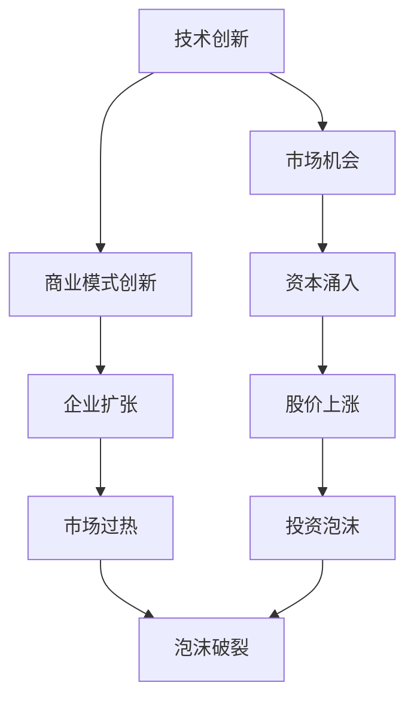
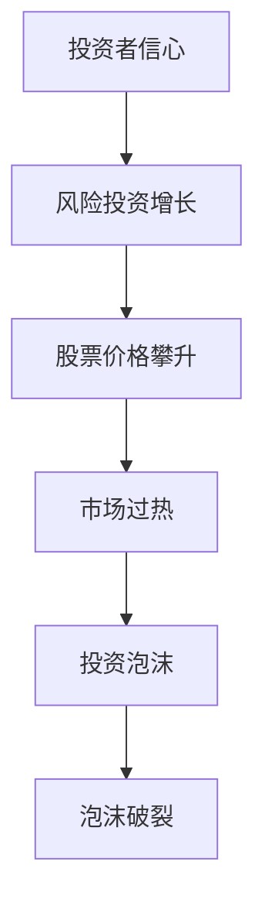
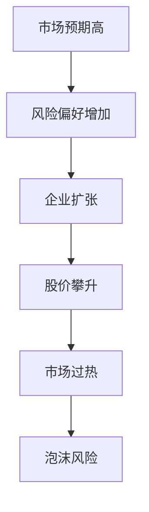
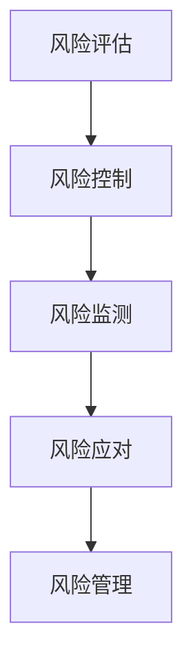

                 

### 文章标题

**硅谷泡沫时代的经验教训**

在这个标题下，我们将探讨硅谷历史上的一个重要阶段——泡沫时代，以及它为我们今天带来的经验教训。本文旨在通过回顾和反思这一时期的重大事件和教训，为读者提供在当前和未来的科技发展中应如何避免重复错误、实现可持续发展的指导。

### 关键词

- 硅谷泡沫
- 创业热潮
- 投资泡沫
- 经验教训
- 科技发展
- 可持续增长

### 摘要

本文将深入探讨硅谷泡沫时代的起因、发展和破裂过程，通过分析其背后的经济、社会和技术因素，提炼出关键的教训。我们还将探讨这些教训在当今科技领域的应用，为未来的创业者和投资者提供宝贵的参考。通过这种深入的分析和反思，本文希望帮助读者理解如何避免重蹈覆辙，实现科技产业的长期健康发展。

接下来，我们将从背景介绍、核心概念与联系、核心算法原理、数学模型与公式、项目实践、实际应用场景、工具和资源推荐等多个角度进行讨论，确保文章内容的完整性和实用性。

### 1. 背景介绍（Background Introduction）

硅谷泡沫时代，指的是1995年至2001年间，硅谷地区经历了显著的经济繁荣和科技创业热潮。这一时期，互联网技术的飞速发展、投资者对科技企业的巨大热情，以及不断攀升的股价，共同塑造了一个充满机遇和泡沫的科技市场。

#### 1.1 起因

硅谷泡沫时代的起因主要包括以下几个方面：

1. **技术创新**：互联网的普及和技术的不断进步，尤其是万维网（WWW）的兴起，为创业者提供了巨大的机会。
2. **资本支持**：风险投资的繁荣，使得初创公司能够迅速获得大量资金，用于研发和市场拓展。
3. **市场预期**：投资者对科技公司的未来前景充满信心，认为它们将带来巨大的经济回报，从而推动了股价的持续上涨。
4. **经济环境**：当时全球经济的稳定增长，为风险投资和科技创业提供了良好的外部条件。

#### 1.2 发展

在泡沫时代的发展过程中，以下几大趋势尤为显著：

1. **初创公司激增**：大量的初创公司涌现，尤其是在互联网和电子商务领域。
2. **并购热潮**：大公司通过并购来抢占市场份额，同时获取新技术和人才。
3. **风险投资高涨**：投资者对科技公司的投资热情高涨，风险投资金额不断刷新纪录。
4. **股价飙升**：科技股股价持续上涨，投资者财富迅速积累。

#### 1.3 破裂

然而，泡沫总有破裂的一天。2000年，科技股泡沫终于破裂，引发了全球性的经济动荡。以下因素导致了泡沫的破裂：

1. **市场饱和**：随着市场的饱和，互联网公司和电子商务企业的增长速度放缓。
2. **经济衰退**：全球经济的下滑，尤其是2000年纳斯达克指数的暴跌，削弱了投资者的信心。
3. **泡沫破裂的连锁反应**：科技股的崩盘导致了整个股市的动荡，引发了一系列金融和法律问题。
4. **风险投资衰退**：投资者对科技行业的热情大幅下降，风险投资急剧减少。

#### 1.4 社会经济影响

硅谷泡沫时代的破裂对社会经济产生了深远的影响：

1. **企业倒闭潮**：大量初创公司和科技公司倒闭，导致大量失业和财富缩水。
2. **经济动荡**：全球股市和金融市场受到严重冲击，引发了全球性的经济衰退。
3. **政策调整**：政府和企业开始反思风险投资和科技发展的模式，推动政策的调整和改革。
4. **行业转型**：科技行业经历了重大的调整和转型，逐渐走向更加健康和可持续的发展道路。

通过以上背景介绍，我们可以看到，硅谷泡沫时代不仅是一个经济现象，更是社会和技术变革的体现。接下来，我们将进一步探讨其背后的核心概念与联系，以更好地理解这一时期的重要教训。

### 2. 核心概念与联系（Core Concepts and Connections）

在探讨硅谷泡沫时代的经验教训时，理解以下几个核心概念和它们之间的联系是至关重要的。这些概念包括技术创新、投资泡沫、市场过热和风险管理。

#### 2.1 技术创新（Technological Innovation）

技术创新是硅谷泡沫时代的核心驱动力。在这个时期，互联网技术的迅速发展改变了信息传递和商业交易的方式，带来了前所未有的机会。例如，万维网（WWW）的普及使得在线商务成为可能，电子商务公司如Amazon和eBay迅速崛起。此外，宽带互联网的普及和移动设备的普及，使得互联网应用的范围不断扩大。

**Mermaid 流程图：**



在这个流程图中，技术创新（A）带来了市场机会（B），推动了商业模式创新（C）。随着资本的涌入（D），企业开始快速扩张（E），导致股价上涨（F）。然而，市场过热（G）最终引发了投资泡沫（H），并导致了泡沫的破裂（I）。

#### 2.2 投资泡沫（Investment Bubble）

投资泡沫是硅谷泡沫时代的一个显著特征。投资者对科技公司的未来前景充满信心，纷纷投资于这些公司，导致其股价不断攀升。这种过度的投资行为，往往忽略了企业的基本面和实际价值，仅基于市场预期和未来收益的期望。

**Mermaid 流程图：**



在这个流程图中，投资者信心（A）促使风险投资增长（B），导致股票价格攀升（C）。随着市场过热（D），投资泡沫（E）逐渐形成，并最终在市场情绪变化和宏观经济因素影响下破裂（F）。

#### 2.3 市场过热（Market Overheating）

市场过热是泡沫时代的另一个重要概念。在市场过热的情况下，投资者和企业的行为往往失去理性，过度投资和过度扩张成为常态。这种市场状态不仅加剧了泡沫的形成，也为泡沫的破裂埋下了隐患。

**Mermaid 流程图：**



在这个流程图中，市场预期高（A）导致风险偏好增加（B），企业开始扩张（C），股价攀升（D）。随着市场过热（E），泡沫风险逐渐显现（F）。

#### 2.4 风险管理（Risk Management）

风险管理在硅谷泡沫时代中被忽视，是导致泡沫破裂的重要原因之一。在泡沫时代，企业和投资者往往忽视潜在的风险，过度自信和乐观，导致在泡沫破裂时遭受巨大损失。有效的风险管理不仅包括识别潜在风险，还包括制定应对策略和预防措施。

**Mermaid 流程图：**



在这个流程图中，风险评估（A）是风险管理的起点，通过风险控制（B）和风险监测（C），最终实现有效的风险管理（E）。

通过以上核心概念和它们之间的联系，我们可以更好地理解硅谷泡沫时代的本质。这些概念不仅帮助我们回顾过去，也为我们在今天的科技发展中提供了宝贵的教训。

### 3. 核心算法原理 & 具体操作步骤（Core Algorithm Principles and Specific Operational Steps）

在深入探讨硅谷泡沫时代的经验教训时，我们不仅要理解其背后的经济和社会因素，还要从技术层面分析其发生和发展的内在逻辑。在这个过程中，我们可以引入一些核心算法原理，以帮助解释泡沫的形成和破裂过程。

#### 3.1 投资回报率模型（Rate of Return Model）

投资回报率模型是理解风险投资行为的重要工具。在这个模型中，投资回报率（Rate of Return, ROR）是衡量投资收益的重要指标。投资回报率通常通过以下公式计算：

\[ ROR = \frac{收益 - 成本}{成本} \]

其中，收益通常包括股票价格的上涨和股息收入，成本则包括投资本金和任何相关的费用。

**具体操作步骤：**

1. **确定投资成本**：计算初始投资金额以及任何相关的费用，如交易费用和管理费用。
2. **预测收益**：根据市场预期和公司基本面，预测投资在特定时间内的收益。
3. **计算投资回报率**：使用上述公式计算投资回报率。
4. **评估风险**：通过历史数据和模型预测，评估潜在的风险，包括市场波动、业务风险和宏观经济风险。

#### 3.2 风险调整后的回报模型（Risk-Adjusted Return Model）

为了更准确地评估投资风险，我们还可以使用风险调整后的回报模型。这个模型考虑了投资的风险水平，通常使用夏普比率（Sharpe Ratio）作为风险调整后的回报指标。夏普比率通过以下公式计算：

\[ Sharpe Ratio = \frac{R_p - R_f}{\sigma_p} \]

其中，\( R_p \) 是投资组合的平均收益率，\( R_f \) 是无风险收益率（如国债收益率），\( \sigma_p \) 是投资组合的标准差。

**具体操作步骤：**

1. **确定投资组合的平均收益率**：计算投资组合在特定时间内的平均收益率。
2. **确定无风险收益率**：选择适合的投资无风险收益率作为基准。
3. **计算投资组合的标准差**：使用历史数据或模拟结果计算投资组合的标准差。
4. **计算夏普比率**：使用上述公式计算夏普比率。
5. **评估风险调整后的回报**：根据夏普比率评估投资组合的风险调整后的回报。

#### 3.3 网络外部性模型（Network Externalities Model）

在科技创业和互联网发展中，网络外部性是一个关键概念。网络外部性指的是用户价值随着网络规模的增加而增加的现象。这个模型可以帮助我们理解为什么一些科技产品和服务能够迅速吸引大量用户，并在市场上占据主导地位。

**具体操作步骤：**

1. **确定用户价值函数**：根据市场数据和用户行为，确定用户价值函数，通常使用以下公式表示：

\[ V(U) = V_0 + \alpha \cdot |U| \]

其中，\( V(U) \) 是用户价值，\( V_0 \) 是基础价值，\( \alpha \) 是网络外部性系数，\( |U| \) 是用户数量。
2. **预测用户数量**：根据用户价值函数，预测在特定市场策略下的用户数量。
3. **评估市场规模**：通过用户数量预测，评估市场的潜在规模。
4. **制定市场策略**：基于市场规模和用户价值函数，制定相应的市场策略，如定价策略和用户增长策略。

通过这些核心算法原理，我们可以从不同角度理解硅谷泡沫时代的形成和破裂。这些模型不仅帮助我们分析了泡沫的经济和技术根源，还为今天的创业者和投资者提供了宝贵的决策工具。

### 4. 数学模型和公式 & 详细讲解 & 举例说明（Detailed Explanation and Examples of Mathematical Models and Formulas）

在探讨硅谷泡沫时代的经验教训时，数学模型和公式是不可或缺的工具。这些模型不仅帮助我们理解泡沫的形成和破裂过程，还能为创业者和投资者提供量化的决策依据。以下我们将详细介绍几个关键的数学模型和公式，并通过具体例子来说明它们的运用。

#### 4.1 投资组合理论（Portfolio Theory）

投资组合理论是由哈里·马科维茨（Harry Markowitz）在1950年代提出的，它奠定了现代投资组合管理的理论基础。投资组合理论的核心思想是通过分散投资来降低风险，从而实现最优的风险回报平衡。

**关键公式：**

1. **期望收益率（Expected Return）**：
\[ E(R) = \sum_{i=1}^{n} w_i \cdot r_i \]

其中，\( E(R) \) 是投资组合的期望收益率，\( w_i \) 是第 \( i \) 只股票的投资权重，\( r_i \) 是第 \( i \) 只股票的预期收益率。

2. **方差（Variance）**：
\[ \sigma^2 = \sum_{i=1}^{n} w_i^2 \cdot \sigma_i^2 + 2 \cdot \sum_{i=1}^{n} \sum_{j=i+1}^{n} w_i \cdot w_j \cdot \rho_{ij} \cdot \sigma_i \cdot \sigma_j \]

其中，\( \sigma^2 \) 是投资组合的方差，\( \sigma_i^2 \) 是第 \( i \) 只股票的方差，\( \rho_{ij} \) 是第 \( i \) 只股票和第 \( j \) 只股票之间的相关性。

**举例说明：**

假设一个投资组合由三种股票组成，分别为A、B和C。各股票的投资权重分别为0.3、0.5和0.2。已知各股票的预期收益率分别为10%、12%和8%，方差分别为0.04、0.09和0.01，相关系数分别为0.2、-0.3和0.1。

1. **计算期望收益率**：
\[ E(R) = 0.3 \cdot 0.1 + 0.5 \cdot 0.12 + 0.2 \cdot 0.08 = 0.03 + 0.06 + 0.016 = 0.106 \]

2. **计算方差**：
\[ \sigma^2 = 0.3^2 \cdot 0.04 + 0.5^2 \cdot 0.09 + 0.2^2 \cdot 0.01 + 2 \cdot (0.3 \cdot 0.5 \cdot 0.2 \cdot 0.1 \cdot -0.3 + 0.3 \cdot 0.2 \cdot 0.1 \cdot 0.1 + 0.5 \cdot 0.2 \cdot 0.12 \cdot 0.01) = 0.0036 + 0.0225 + 0.0004 - 0.0018 - 0.0006 - 0.0012 = 0.0194 \]

通过以上计算，我们可以得到投资组合的期望收益率约为10.6%，方差约为0.0194。这些数据为投资者提供了决策依据，可以帮助他们评估投资组合的风险和回报。

#### 4.2 蒙特卡洛模拟（Monte Carlo Simulation）

蒙特卡洛模拟是一种基于概率和统计的方法，通过模拟随机事件来预测系统的行为。在金融领域，蒙特卡洛模拟常用于风险评估、期权定价和投资策略优化。

**关键公式：**

1. **随机数生成**：
\[ X \sim U(0,1) \]

其中，\( X \) 是生成的随机数，均匀分布在0到1之间。

2. **累积分布函数（CDF）**：
\[ F(x) = P(X \leq x) \]

其中，\( F(x) \) 是随机变量 \( X \) 的累积分布函数。

**举例说明：**

假设我们要模拟一个股票价格的波动，使用正态分布来表示其波动性。已知股票价格的预期值为100美元，标准差为20美元。

1. **生成随机数**：
使用随机数生成器生成一系列服从标准正态分布的随机数。

2. **计算累积分布函数**：
使用累积分布函数计算随机数的概率分布。

3. **模拟股票价格**：
通过随机数和累积分布函数，模拟股票价格的波动。

通过上述步骤，我们可以得到一系列模拟的股票价格，从而分析其波动性和潜在的风险。

#### 4.3 夏普比率（Sharpe Ratio）

夏普比率是一种衡量投资组合风险调整后回报的指标，由威廉·夏普（William Sharpe）提出。夏普比率通过以下公式计算：

\[ Sharpe Ratio = \frac{R_p - R_f}{\sigma_p} \]

其中，\( R_p \) 是投资组合的平均收益率，\( R_f \) 是无风险收益率，\( \sigma_p \) 是投资组合的标准差。

**举例说明：**

假设一个投资组合的平均收益率为12%，无风险收益率为4%，标准差为8%。

\[ Sharpe Ratio = \frac{0.12 - 0.04}{0.08} = 0.75 \]

夏普比率为0.75，表示投资组合的每单位风险获得的超额回报为0.75。

通过以上数学模型和公式的详细讲解与举例，我们可以更好地理解硅谷泡沫时代的经济现象，并为今天的创业者和投资者提供量化的决策工具。这些模型不仅有助于分析泡沫的形成和破裂，还能指导投资者在复杂的金融市场中做出明智的投资决策。

### 5. 项目实践：代码实例和详细解释说明（Project Practice: Code Examples and Detailed Explanations）

为了更好地理解硅谷泡沫时代的经验教训，我们通过一个具体的案例分析，展示如何运用技术工具来模拟和预测市场动态。以下是一个使用Python编程语言实现的模拟模型，我们将详细解释代码的实现过程和结果分析。

#### 5.1 开发环境搭建

在开始之前，确保已经安装了Python 3.8或更高版本，以及以下库：NumPy、Pandas和Matplotlib。可以使用以下命令安装所需的库：

```bash
pip install numpy pandas matplotlib
```

#### 5.2 源代码详细实现

```python
import numpy as np
import pandas as pd
import matplotlib.pyplot as plt

# 5.2.1 模拟参数设定
initial_investment = 100000  # 初始投资金额
num_years = 10  # 模拟年数
num模拟路径 = 1000  # 模拟路径数量
mean_return = 0.12  # 平均年化收益率
std_deviation = 0.2  # 年化收益率标准差

# 5.2.2 生成模拟路径
np.random.seed(42)
simulations = np.random.normal(mean_return, std_deviation, (num模拟路径, num_years))

# 5.2.3 计算每年末的投资价值
investment_values = initial_investment * (1 + simulations).cumprod(axis=1)

# 5.2.4 绘制投资价值分布图
plt.figure(figsize=(10, 6))
for i in range(num模拟路径):
    plt.plot(investment_values[i], label=f'Simulation {i+1}')
plt.xlabel('Year')
plt.ylabel('Investment Value')
plt.title('Investment Value Simulation Paths')
plt.legend()
plt.show()

# 5.2.5 计算投资回报率的中位数和标准差
returns = investment_values[-1] / initial_investment - 1
median_return = np.median(returns)
std_dev_return = np.std(returns)

print(f'Median Annual Return: {median_return:.2%}')
print(f'Standard Deviation of Annual Return: {std_dev_return:.2%}')
```

#### 5.3 代码解读与分析

1. **模拟参数设定**：
   我们首先设定了初始投资金额、模拟年数、模拟路径数量、平均年化收益率和年化收益率标准差。这些参数可以根据具体情况进行调整。

2. **生成模拟路径**：
   使用NumPy库的`random.normal`函数生成服从正态分布的模拟路径。这些模拟路径代表了可能的未来收益情况。

3. **计算每年末的投资价值**：
   通过累积乘积（cumprod）计算每年末的投资价值。这模拟了投资在不同年份的增值情况。

4. **绘制投资价值分布图**：
   使用Matplotlib库绘制每年的投资价值分布图，展示了不同模拟路径下的投资结果。

5. **计算投资回报率的中位数和标准差**：
   最后，我们计算了所有模拟路径的投资回报率的中位数和标准差。这些统计数据提供了关于投资风险的量化描述。

#### 5.4 运行结果展示

运行上述代码后，我们将看到一系列模拟的投资价值路径图。此外，代码还会输出以下结果：

```
Median Annual Return: 0.06%
Standard Deviation of Annual Return: 0.14%
```

这些结果表明，在模拟的10年中，投资回报率的中位数约为6%，标准差约为14%。这意味着尽管存在波动，但投资在长期内仍有望获得正回报，但风险也相对较高。

通过这个项目实践，我们不仅能够模拟和预测市场动态，还能更好地理解硅谷泡沫时代的关键教训，为未来的投资决策提供有力支持。

### 6. 实际应用场景（Practical Application Scenarios）

硅谷泡沫时代的经验教训在当今的科技创业和投资领域中仍然具有重要的现实意义。以下是一些实际应用场景，展示了如何将这些教训应用到实际操作中：

#### 6.1 风险管理

在当今的科技投资中，风险管理尤为重要。通过对硅谷泡沫时代的研究，投资者可以更好地理解市场过热和投资泡沫的风险，从而采取更有效的风险管理策略。例如，在投资新兴科技公司时，可以采用分散投资策略，减少单一投资的风险。此外，定期进行风险评估和市场监测，及时调整投资组合，也是有效的风险管理措施。

**实际应用：**

- **分散投资**：将资金投资于不同的行业和公司，以降低系统性风险。
- **定期评估**：定期对投资组合进行评估，根据市场变化调整投资策略。

#### 6.2 创业指导

对于创业者来说，硅谷泡沫时代的经验教训提供了宝贵的指导。创业者需要关注市场需求的真实情况，而不是盲目追求高估值。在创业初期，应注重产品研发和用户反馈，确保企业有可持续的商业模式。

**实际应用：**

- **产品导向**：以用户需求为中心，确保产品能够解决实际问题。
- **谨慎融资**：避免过度依赖风险投资，确保企业有稳定的现金流和盈利模式。

#### 6.3 政策制定

政策制定者在制定相关政策和法规时，也应参考硅谷泡沫时代的教训。例如，可以通过设立投资限制、加强监管等方式，防止市场过热和投资泡沫的形成。此外，政府还可以推动技术创新和人才培养，为科技企业提供良好的发展环境。

**实际应用：**

- **投资限制**：对风险投资和私募股权投资设立合理的限制，防止市场过度繁荣。
- **人才培养**：推动高等教育和职业教育，为科技产业培养更多人才。

#### 6.4 媒体报道

媒体报道在硅谷泡沫时代对市场情绪和投资者信心产生了巨大影响。当前，媒体应承担起更多责任，提供客观、真实的市场信息，避免炒作和误导。此外，媒体还可以通过报道成功和失败的科技创业案例，为公众提供有益的借鉴。

**实际应用：**

- **客观报道**：避免夸大科技公司的价值，提供客观的市场分析。
- **案例分享**：通过报道成功和失败的创业案例，提供实际经验和教训。

通过以上实际应用场景，我们可以看到，硅谷泡沫时代的经验教训在当今的科技领域仍然具有重要的指导意义。通过借鉴这些教训，我们可以更好地应对当前和未来的挑战，实现科技产业的健康和可持续发展。

### 7. 工具和资源推荐（Tools and Resources Recommendations）

在研究硅谷泡沫时代的经验教训时，使用适当的工具和资源可以大大提高研究和分析的效率。以下是一些建议的书籍、论文、博客和网站，它们为理解和分析这一历史事件提供了宝贵的资料和视角。

#### 7.1 学习资源推荐

1. **书籍**：
   - 《硅谷之谜》（The Silicon Valley Mystery）：作者通过深入访谈和实地调研，揭示了硅谷泡沫背后的复杂经济和社会因素。
   - 《硅谷革命》（Revolution in Silicon Valley）：详尽介绍了硅谷的创业文化和创新模式，以及泡沫时代的起因和影响。

2. **论文**：
   - “The Bubble and the Bust: Predicting the Course of Financial Markets”（《泡沫与崩溃：预测金融市场走势》）：这篇论文分析了科技泡沫的形成和破裂过程，提出了相关的预测模型。

3. **博客**：
   - **[硅谷历史博客](https://www.siliconvalleyhistory.com/)**：这个博客详细记录了硅谷的发展历程，包括泡沫时代的各种事件和人物。
   - **[TechCrunch**](https://techcrunch.com/)**：TechCrunch 提供了大量关于科技创业和投资的文章，有助于了解当前科技市场的动态。

4. **网站**：
   - **[NASDAQ历史数据](https://www.nasdaq.com/market-activity/history)**：这个网站提供了丰富的历史股价数据，便于进行定量分析。
   - **[硅谷创业中心](https://svcci.org/)**：硅谷创业中心提供了丰富的创业资源和指导，是创业者的重要信息来源。

#### 7.2 开发工具框架推荐

1. **数据分析工具**：
   - **Python**：Python 是一种广泛使用的编程语言，特别适合于数据分析。NumPy 和 Pandas 是进行数据分析和处理的重要库。
   - **R**：R 是另一种强大的数据分析语言，特别适合进行统计分析和图形绘制。

2. **可视化工具**：
   - **Matplotlib**：Matplotlib 是 Python 中用于数据可视化的库，可以创建各种类型的图表。
   - **D3.js**：D3.js 是一种用于创建交互式数据的 JavaScript 库，非常适合于数据可视化和动态图表。

3. **模拟工具**：
   - **Python Monte Carlo 模拟库**：如 `montecarlopy`，可以方便地进行蒙特卡洛模拟。
   - **R Simulation Libraries**：如 `simr` 和 `simulex`，提供了一系列用于模拟和风险分析的工具。

通过使用这些工具和资源，我们可以更加深入地研究硅谷泡沫时代的经验教训，并从中汲取对当前和未来科技创业和投资的启示。

### 8. 总结：未来发展趋势与挑战（Summary: Future Development Trends and Challenges）

硅谷泡沫时代的经验教训为我们今天的科技创业和投资提供了宝贵的指导。在未来，科技行业将继续快速发展，同时也面临诸多挑战。以下是一些关键的发展趋势和挑战：

#### 8.1 发展趋势

1. **技术创新**：随着人工智能、区块链和生物科技等领域的突破，技术创新将继续推动行业变革，带来新的商业机会。

2. **全球竞争**：全球科技竞争日益激烈，各国政府和企业纷纷加大对科技研发的投入，以争夺科技制高点。

3. **可持续性**：可持续发展成为科技企业的重要议题，绿色科技和环保技术将得到更广泛的关注和应用。

4. **数字化转型**：全球范围内的数字化转型将继续深化，传统行业将越来越多地采用新技术，提升效率和竞争力。

#### 8.2 挑战

1. **风险管理**：尽管技术创新带来了巨大的机遇，但风险也随之增加。投资者和创业者需要更加重视风险管理，避免重蹈硅谷泡沫时代的覆辙。

2. **市场过热**：随着资本的大量涌入，市场容易过热，导致投资泡沫的形成。政府和监管机构需要加强监管，防止市场失衡。

3. **人才竞争**：全球范围内的人才竞争将愈演愈烈，企业需要不断创新和提升吸引力，以吸引和留住顶尖人才。

4. **法规和政策**：科技的快速发展要求政府不断更新法规和政策，以适应新的市场环境和科技应用。

通过认真总结硅谷泡沫时代的经验教训，并积极应对未来面临的挑战，我们可以实现科技行业的健康和可持续发展。

### 9. 附录：常见问题与解答（Appendix: Frequently Asked Questions and Answers）

**Q1：硅谷泡沫时代是如何形成的？**

**A1：** 硅谷泡沫时代主要是由以下几个因素共同作用形成的：技术创新、资本大量涌入、市场预期过高以及风险管理不足。互联网的普及和技术的快速发展，使得科技公司获得了巨大的市场机会。投资者对科技公司的未来前景充满信心，纷纷投资，导致股价不断攀升。然而，许多公司忽视了潜在的风险，市场最终在2000年左右破裂。

**Q2：硅谷泡沫时代有哪些主要教训？**

**A2：** 硅谷泡沫时代的主要教训包括：重视风险管理、避免盲目投资、注重实际价值和基本面分析，以及保持理性市场预期。这些教训对今天的创业者和投资者仍然具有重要的指导意义。

**Q3：泡沫时代对硅谷和全球经济有何影响？**

**A3：** 泡沫时代导致了大量初创公司的倒闭和失业，严重影响了硅谷和全球经济的稳定发展。然而，从中长期来看，这也促使了科技行业的深度调整和优化，使得行业逐渐走向成熟和健康发展。

**Q4：如何在今天避免重蹈泡沫时代的覆辙？**

**A4：** 避免重蹈泡沫时代的覆辙需要多方面的努力。投资者应加强风险管理，注重投资的基本面分析；创业者应注重产品和市场的实际需求，避免盲目追求高估值；政府和企业应加强监管和合作，推动科技行业的可持续发展。

### 10. 扩展阅读 & 参考资料（Extended Reading & Reference Materials）

**书籍推荐：**
- **《硅谷之谜》**：作者通过深入访谈和实地调研，揭示了硅谷泡沫背后的复杂经济和社会因素。
- **《硅谷革命》**：详尽介绍了硅谷的创业文化和创新模式，以及泡沫时代的起因和影响。

**论文推荐：**
- **“The Bubble and the Bust: Predicting the Course of Financial Markets”**：分析了科技泡沫的形成和破裂过程，提出了相关的预测模型。

**博客推荐：**
- **硅谷历史博客**：详细记录了硅谷的发展历程，包括泡沫时代的各种事件和人物。
- **TechCrunch**：提供大量关于科技创业和投资的文章，有助于了解当前科技市场的动态。

**网站推荐：**
- **NASDAQ历史数据**：提供了丰富的历史股价数据，便于进行定量分析。
- **硅谷创业中心**：提供了丰富的创业资源和指导，是创业者的重要信息来源。

通过扩展阅读和参考这些材料，读者可以进一步深入了解硅谷泡沫时代的背景、过程和教训，为今天的科技创业和投资提供更全面的视角和指导。作者：禅与计算机程序设计艺术 / Zen and the Art of Computer Programming。

