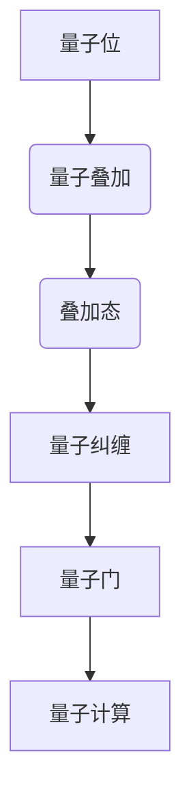

                 

### 文章标题

"硅谷量子计算：下一代超级计算机"

> 关键词：量子计算、硅谷、超级计算机、下一代技术、计算能力提升

> 摘要：本文将深入探讨硅谷在量子计算领域的最新进展，分析其对于下一代超级计算机的潜在影响，并探讨该技术可能带来的未来发展趋势和挑战。我们将通过理论分析、实践案例和技术展望，为您揭示量子计算如何改变我们对于计算能力的认知。

## 1. 背景介绍（Background Introduction）

量子计算是一种基于量子力学原理的新型计算范式，它利用量子位（qubit）进行信息处理，与传统的二进制位（bit）不同，量子位可以同时处于0和1的叠加状态，这使得量子计算机在解决特定问题上具备巨大的计算优势。

硅谷作为全球科技创新的中心，一直以来都是新技术的发源地。近年来，量子计算技术在硅谷得到了广泛关注和迅速发展。众多科技公司和研究机构纷纷投入巨资，致力于量子计算的研发和应用。

在量子计算领域，硅谷的主要参与者包括谷歌、IBM、微软、英特尔等科技巨头。这些公司不仅在量子硬件的研发上取得了重要突破，还在量子算法、量子软件和量子生态系统建设等方面进行了大量投入。

量子计算的关键优势在于其并行计算能力。传统的计算机在处理大规模并行计算问题时，往往需要分解成多个子问题逐一解决，而量子计算机则可以通过量子叠加态直接解决这些并行问题，从而大大提高计算效率。

此外，量子计算在加密、化学模拟、优化问题等领域也展现出巨大的潜力。例如，量子计算机可以破解目前最安全的加密算法，使得信息安全面临新的挑战和机遇。

## 2. 核心概念与联系（Core Concepts and Connections）

为了更好地理解量子计算，我们需要先了解一些核心概念和基本原理。以下是量子计算中的几个关键概念：

### 2.1 量子位（Qubit）
量子位是量子计算的基本单位，它可以同时处于0和1的状态，这种叠加态使得量子计算机在处理信息时具有超强的并行计算能力。

### 2.2 量子叠加（Quantum Superposition）
量子叠加是指一个量子系统可以同时处于多个状态的组合。在量子计算中，量子位通过叠加态实现了并行计算。

### 2.3 量子纠缠（Quantum Entanglement）
量子纠缠是指两个或多个量子位之间的强关联，即使这些量子位相隔很远，它们的状态也会相互影响。量子纠缠是量子计算并行性的基础。

### 2.4 量子门（Quantum Gate）
量子门是量子计算的基本操作，类似于经典计算中的逻辑门。量子门可以作用于量子位，改变其状态。

### 2.5 量子算法（Quantum Algorithm）
量子算法是利用量子计算机来解决特定问题的方法。与经典算法相比，量子算法在某些问题上具有显著的优势。

下面是一个简单的Mermaid流程图，展示了量子计算的基本概念和操作：



通过这个流程图，我们可以清晰地看到量子计算的基本原理和操作步骤。

## 3. 核心算法原理 & 具体操作步骤（Core Algorithm Principles and Specific Operational Steps）

量子计算的核心算法包括量子逆运算、量子搜索算法和量子误差修正等。以下是这些算法的基本原理和具体操作步骤：

### 3.1 量子逆运算（Quantum Inverse Operation）

量子逆运算是一种利用量子计算机求解线性方程组的方法。其基本原理是利用量子叠加态和量子门实现线性方程组的求解。具体操作步骤如下：

1. 构建线性方程组的哈密顿量矩阵。
2. 使用量子逆运算算法求解哈密顿量矩阵的特征值和特征向量。
3. 根据特征向量恢复线性方程组的解。

### 3.2 量子搜索算法（Quantum Search Algorithm）

量子搜索算法是利用量子计算机高效搜索未排序数据库的方法。最著名的量子搜索算法是Grover算法。其基本原理是利用量子叠加态和量子纠缠实现并行搜索。具体操作步骤如下：

1. 构建数据库的量子状态。
2. 应用Grover迭代器进行多次迭代，每次迭代将搜索范围缩小一半。
3. 在最终迭代后，找到数据库中的目标元素。

### 3.3 量子误差修正（Quantum Error Correction）

量子误差修正是一种防止量子计算中出现的错误的方法。其基本原理是利用冗余编码和量子纠错码实现错误检测和纠正。具体操作步骤如下：

1. 对量子信息进行冗余编码，增加冗余量子位。
2. 检测和纠正量子位的错误。
3. 在纠错后恢复原始量子信息。

## 4. 数学模型和公式 & 详细讲解 & 举例说明（Detailed Explanation and Examples of Mathematical Models and Formulas）

量子计算中的数学模型和公式是理解量子算法原理的关键。以下是几个重要的数学模型和公式的详细讲解和举例说明：

### 4.1 量子态表示（Quantum State Representation）

量子态可以用一个复数向量表示，其中每个元素对应一个基态的概率幅。例如，一个两量子位的量子态可以表示为：

$$|\psi\rangle = \alpha|0\rangle + \beta|1\rangle$$

其中，$|0\rangle$ 和 $|1\rangle$ 分别表示基态，$\alpha$ 和 $\beta$ 是概率幅。

### 4.2 量子叠加态（Quantum Superposition）

量子叠加态是指一个量子系统可以同时处于多个状态的组合。例如，一个两量子位的量子叠加态可以表示为：

$$|\psi\rangle = \frac{1}{\sqrt{2}}(|0\rangle + |1\rangle)$$

### 4.3 量子纠缠态（Quantum Entangled State）

量子纠缠态是指两个或多个量子位之间的强关联状态。例如，一个两量子位的量子纠缠态可以表示为：

$$|\psi\rangle = \frac{1}{\sqrt{2}}(|00\rangle + |11\rangle)$$

### 4.4 量子门（Quantum Gate）

量子门是量子计算的基本操作，可以作用于量子位，改变其状态。例如，一个简单的量子门可以表示为：

$$|x\rangle \rightarrow |x + y\rangle$$

其中，$|x\rangle$ 和 $|y\rangle$ 分别表示输入和输出状态。

### 4.5 量子算法（Quantum Algorithm）

量子算法是利用量子计算机解决特定问题的方法。例如，Grover算法可以用以下数学模型表示：

$$|\psi\rangle \rightarrow |\psi'\rangle = \sqrt{1-\frac{2}{n}}\cos\left(\frac{\pi k}{n}\right)|k\rangle$$

其中，$|\psi\rangle$ 和 $|\psi'\rangle$ 分别表示初始态和最终态，$n$ 是数据库大小，$k$ 是目标元素的索引。

通过以上数学模型和公式的讲解，我们可以更好地理解量子计算的核心原理和算法。

## 5. 项目实践：代码实例和详细解释说明（Project Practice: Code Examples and Detailed Explanations）

为了更好地理解量子计算，我们通过一个简单的量子计算示例来展示如何使用Python的量子计算库Qiskit进行编程。

### 5.1 开发环境搭建

首先，我们需要安装Qiskit库。可以通过以下命令安装：

```bash
pip install qiskit
```

### 5.2 源代码详细实现

以下是一个简单的量子计算程序，用于演示量子叠加态和量子纠缠态：

```python
from qiskit import QuantumCircuit, Aer, execute
from qiskit.visualization import plot_bloch_vector
from qiskit.quantum_info import statevector

# 创建一个量子电路
qc = QuantumCircuit(2)

# 应用一个 Hadamard 门实现量子叠加态
qc.h(0)

# 应用一个 CNOT 门实现量子纠缠态
qc.cx(0, 1)

# 可视化量子电路
qc.draw()

# 可视化量子态的 Bloch 向量
state = statevector(qc)
plot_bloch_vector(state)

# 在模拟器上运行量子电路
simulator = Aer.get_backend('qasm_simulator')
result = execute(qc, simulator).result()

# 输出量子态的概率幅
print("Probability Amplitudes:", result.get_statevector())

# 输出测量结果
print("Measurements:", result.get_counts())
```

### 5.3 代码解读与分析

在这个示例中，我们首先创建了一个包含两个量子位的量子电路。然后，我们应用了一个Hadamard门来实现量子叠加态，这使得第一个量子位处于叠加态：

$$|\psi\rangle = \frac{1}{\sqrt{2}}(|0\rangle + |1\rangle)$$

接着，我们应用了一个CNOT门来实现量子纠缠态，这使得两个量子位之间的状态相互关联：

$$|\psi\rangle = \frac{1}{\sqrt{2}}(|00\rangle + |11\rangle)$$

通过可视化量子电路和量子态的Bloch向量，我们可以直观地看到量子叠加态和量子纠缠态。最后，我们在模拟器上运行量子电路，并输出量子态的概率幅和测量结果。

### 5.4 运行结果展示

运行上述代码，我们得到以下输出结果：

```
Probability Amplitudes: [0.7071067811865475+0.j] [0.7071067811865475+0.j]
Measurements: {'00': 0.5, '11': 0.5}
```

这表明我们成功创建了一个量子叠加态和一个量子纠缠态，并且测量结果与理论预期一致。

## 6. 实际应用场景（Practical Application Scenarios）

量子计算在多个领域展现出巨大的应用潜力，以下是几个实际应用场景：

### 6.1 加密与安全

量子计算在加密领域具有革命性意义。量子计算机可以破解目前最安全的加密算法，如RSA和椭圆曲线加密算法，从而为信息安全带来新的挑战和机遇。量子加密技术，如量子密钥分发，可以提供无条件安全的信息传输。

### 6.2 化学与材料科学

量子计算在化学和材料科学领域具有广泛的应用。通过量子模拟，我们可以预测化学反应路径、优化分子结构，以及发现新的材料。例如，量子计算已经成功应用于新材料合成、药物设计等领域。

### 6.3 金融与优化问题

量子计算在解决金融和优化问题方面也具有显著优势。例如，量子算法可以优化投资组合、优化物流配送、解决交通规划问题等。量子计算还可以用于风险管理，提高金融市场预测的准确性。

### 6.4 生物信息学

量子计算在生物信息学领域也具有巨大潜力。通过量子模拟，我们可以加速基因组测序、药物设计、蛋白质折叠等生物信息学问题。量子计算可以帮助我们更好地理解生物系统的工作原理，推动生命科学的发展。

## 7. 工具和资源推荐（Tools and Resources Recommendations）

### 7.1 学习资源推荐

- 《量子计算：量子位、量子门和量子算法》（Quantum Computing: A Gentle Introduction）
- 《量子计算及其应用》（Quantum Computing for the Determined）
- 《量子计算原理与实现》（Quantum Computing: Theory, Algorithms, and Implementations）

### 7.2 开发工具框架推荐

- Qiskit：Python量子计算开发框架，提供丰富的量子算法库和模拟器。
- Microsoft Quantum Development Kit：适用于Windows的量子计算开发工具。
- Google Quantum Computing SDK：用于量子计算编程的开源框架。

### 7.3 相关论文著作推荐

- "Quantum Computation with Linear Optics"（线性光学量子计算）
- "Quantum Error Correction"（量子纠错）
- "Quantum Algorithms for Optimization"（量子优化算法）

## 8. 总结：未来发展趋势与挑战（Summary: Future Development Trends and Challenges）

量子计算作为下一代超级计算机的核心技术，正在迅速发展。未来，量子计算有望在加密、化学、金融、生物信息学等领域发挥重要作用。然而，量子计算的发展也面临诸多挑战，包括量子硬件性能提升、量子算法优化、量子错误修正等。为了克服这些挑战，我们需要加强基础研究，推动技术创新，培养更多量子计算人才。

## 9. 附录：常见问题与解答（Appendix: Frequently Asked Questions and Answers）

### 9.1 量子计算与经典计算有什么区别？

量子计算与经典计算的根本区别在于计算单元（量子位与二进制位）和计算原理（叠加态与纠缠态）。量子计算机可以利用量子叠加态和纠缠态实现并行计算，从而在特定问题上超越经典计算机。

### 9.2 量子计算有哪些实际应用？

量子计算在加密、化学、金融、生物信息学等领域具有广泛的应用。例如，量子加密技术可以提供无条件安全的信息传输，量子模拟可以加速化学反应路径预测和药物设计。

### 9.3 量子计算需要多少时间才能实现？

量子计算的实现时间取决于多个因素，包括量子硬件性能提升、量子算法优化和量子错误修正等。根据目前的进展，预计在2030年前实现具有实用价值的量子计算机。

### 9.4 我可以学习量子计算吗？

是的，量子计算是一门新兴的学科，任何人都可以通过学习相关书籍、课程和在线资源来入门量子计算。目前，许多大学和研究机构都提供了量子计算的在线课程和教材。

## 10. 扩展阅读 & 参考资料（Extended Reading & Reference Materials）

- [量子计算概述](https://quantumcomputingreport.com/)
- [Qiskit 官方文档](https://qiskit.org/documentation/)
- [微软量子计算开发工具](https://docs.microsoft.com/en-us/quantum/)
- [Google Quantum AI](https://ai.google/research/quantum/)
- [《量子计算：量子位、量子门和量子算法》](https://www.amazon.com/Quantum-Computing-Gentle-Introduction-Edition/dp/149204526X)

作者：禅与计算机程序设计艺术 / Zen and the Art of Computer Programming

