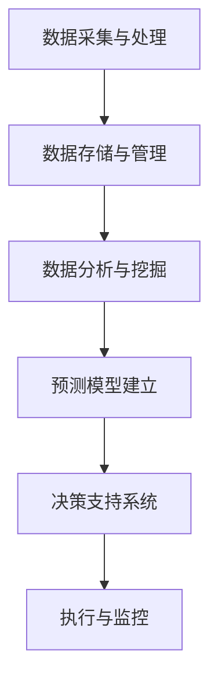
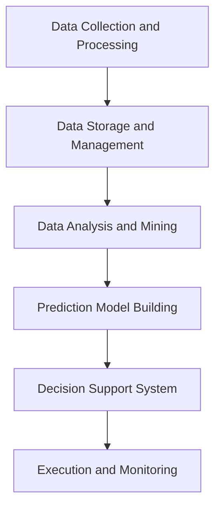

                 

## 文章标题

### AI驱动的电商平台供应链优化

在当今快速变化和竞争激烈的电子商务环境中，高效的供应链管理是电商平台成功的关键。随着人工智能（AI）技术的不断进步，AI驱动的供应链优化已成为电商平台提升运营效率、降低成本和改善客户体验的重要手段。本文将深入探讨AI在电商平台供应链优化中的应用，包括核心概念、算法原理、数学模型、项目实践、应用场景及未来趋势等。希望本文能为电商平台管理者和技术人员提供有价值的见解和实用的指导。

关键词：人工智能、电商平台、供应链优化、算法、数学模型、应用场景、未来趋势

摘要：本文首先介绍了AI驱动供应链优化的背景和重要性。接着，详细阐述了AI在供应链管理中的核心概念和算法原理，包括数据挖掘、机器学习、优化算法等。随后，通过数学模型和公式，深入分析了供应链优化中的关键问题。此外，本文还通过项目实践展示了AI驱动的供应链优化的实际应用，包括环境搭建、代码实现、运行结果等。最后，本文探讨了AI驱动供应链优化的应用场景，并提出了未来发展的挑战和趋势。

<|assistant|>### 1. 背景介绍

供应链是电商平台的核心组成部分，它涉及从原材料采购到产品交付给最终用户的整个过程。传统供应链管理依赖于人工干预和经验，往往效率低下、成本高昂，且难以适应快速变化的市场需求。随着互联网和电子商务的兴起，供应链管理面临越来越多的挑战，如订单量波动、库存管理、物流配送等。这些挑战要求电商平台具备快速响应能力、灵活的运营策略和高效的管理方式。

人工智能（AI）作为一种新兴技术，具有强大的数据处理、模式识别和预测能力，为供应链管理带来了新的机遇。通过AI驱动的供应链优化，电商平台可以实现以下目标：

1. **提高运营效率**：AI技术可以帮助电商平台自动化和智能化供应链操作，减少人为错误，提高生产效率，缩短订单处理时间。

2. **降低运营成本**：通过智能预测和优化，电商平台可以更好地控制库存水平、减少物流费用，降低整体运营成本。

3. **改善客户体验**：AI驱动的供应链优化可以提高物流速度和准确性，减少延迟和配送错误，提升客户满意度和忠诚度。

4. **增强竞争力**：通过高效的供应链管理，电商平台可以在价格、质量和交货期等方面取得竞争优势，吸引更多消费者。

总之，AI驱动的供应链优化是电商平台提升竞争力、实现可持续发展的关键。然而，要实现这一目标，需要深入理解AI技术的核心概念和算法原理，并掌握有效的应用方法。接下来的部分将详细探讨这些内容。

### 1. Background Introduction

Supply chain management is a critical component of e-commerce platforms, encompassing the entire process from raw material procurement to the delivery of products to end-users. Traditional supply chain management relies heavily on manual intervention and experience, which can be inefficient, costly, and difficult to adapt to rapidly changing market demands. With the rise of the internet and e-commerce, supply chain management faces increasing challenges such as fluctuating order volumes, inventory management, and logistics delivery. These challenges require e-commerce platforms to have rapid response capabilities, flexible operational strategies, and efficient management approaches.

Artificial Intelligence (AI) as an emerging technology offers powerful capabilities in data processing, pattern recognition, and prediction, bringing new opportunities to supply chain management. AI-driven supply chain optimization can help e-commerce platforms achieve the following goals:

1. **Improved operational efficiency**: AI technology can automate and智能化 supply chain operations, reduce human errors, and improve production efficiency, thereby shortening order processing time.

2. **Reduced operational costs**: Through intelligent prediction and optimization, e-commerce platforms can better control inventory levels and reduce logistics costs, thereby lowering overall operational costs.

3. **Enhanced customer experience**: AI-driven supply chain optimization can improve logistics speed and accuracy, reduce delays and delivery errors, and enhance customer satisfaction and loyalty.

4. **Increased competitiveness**: Through efficient supply chain management, e-commerce platforms can gain a competitive advantage in terms of price, quality, and delivery time, attracting more consumers.

In summary, AI-driven supply chain optimization is a key to boosting competitiveness and achieving sustainable development for e-commerce platforms. However, to achieve this goal, it is essential to have a deep understanding of the core concepts and algorithm principles of AI technology and master effective application methods. The following sections will delve into these topics in detail.

<|assistant|>### 2. 核心概念与联系

#### 2.1 人工智能在供应链管理中的应用

人工智能在供应链管理中的应用非常广泛，主要包括以下几个方面：

1. **数据挖掘**：利用人工智能技术对供应链数据进行分析和挖掘，可以发现潜在的模式和趋势，为决策提供支持。例如，通过分析历史订单数据和市场需求，可以预测未来订单量，优化库存水平。

2. **机器学习**：机器学习技术可以通过学习历史数据来预测未来的需求、优化库存水平和物流路线。例如，利用线性回归、决策树、神经网络等算法，可以建立预测模型，提高供应链的预测准确性。

3. **优化算法**：优化算法可以用于解决供应链中的各种优化问题，如库存优化、物流路线优化、生产计划优化等。常见的优化算法包括线性规划、整数规划、启发式算法等。

4. **智能决策支持系统**：通过集成人工智能技术，可以开发智能决策支持系统，帮助供应链管理者进行决策。这些系统可以根据实时数据和预测结果，提供最佳决策方案。

#### 2.2 核心概念原理

以下是供应链优化中一些重要的核心概念原理：

1. **需求预测**：需求预测是供应链优化的基础。准确的需求预测可以帮助企业合理规划库存水平，减少库存成本，提高供应链的响应速度。

2. **库存管理**：库存管理是供应链管理的重要组成部分。通过有效的库存管理，可以确保在需求高峰期有足够的库存，同时避免库存过多导致的成本增加。

3. **物流优化**：物流优化旨在降低物流成本，提高物流效率。通过优化物流路线、运输方式和仓储策略，可以显著降低物流成本，提高供应链的整体效益。

4. **供应链协同**：供应链协同是指供应链中的各个企业通过信息共享和合作，共同优化供应链运作。通过协同，可以实现资源整合、风险共担和效益共享。

#### 2.3 供应链优化架构

供应链优化通常包括以下架构：

1. **数据采集与处理**：通过数据采集技术和工具，收集供应链各个环节的数据，并进行清洗、整合和处理。

2. **数据存储与管理**：将处理后的数据存储在数据库或数据仓库中，并进行有效管理，以支持后续的分析和处理。

3. **数据分析与挖掘**：利用数据挖掘技术，对数据进行深入分析，发现潜在的模式和趋势，为供应链优化提供支持。

4. **预测模型建立**：利用机器学习和优化算法，建立预测模型，对未来的需求、库存和物流等进行预测。

5. **决策支持系统**：通过预测模型和优化算法，为供应链管理者提供决策支持，帮助制定最佳策略。

6. **执行与监控**：将决策执行到实际操作中，并对执行过程进行监控和反馈，以不断优化供应链管理。

#### 2.4 Mermaid 流程图

以下是供应链优化中的 Mermaid 流程图：



通过上述核心概念和架构，我们可以更清晰地理解AI在供应链优化中的应用，并为实际应用提供指导。

### 2. Core Concepts and Connections

#### 2.1 Applications of Artificial Intelligence in Supply Chain Management

Artificial Intelligence has a wide range of applications in supply chain management, including the following aspects:

1. **Data Mining**: Utilizing AI technology to analyze and mine supply chain data can uncover potential patterns and trends, providing support for decision-making. For example, by analyzing historical order data and market demand, future order volumes can be predicted to optimize inventory levels.

2. **Machine Learning**: Machine learning technology can predict future demand, optimize inventory levels, and logistics routes by learning from historical data. Algorithms such as linear regression, decision trees, and neural networks can be used to build prediction models that improve the accuracy of supply chain forecasting.

3. **Optimization Algorithms**: Optimization algorithms are used to solve various optimization problems in supply chains, such as inventory optimization, logistics route optimization, and production planning optimization. Common optimization algorithms include linear programming, integer programming, and heuristic algorithms.

4. **Intelligent Decision Support Systems**: By integrating AI technology, intelligent decision support systems can be developed to assist supply chain managers in decision-making. These systems can provide optimal decision-making solutions based on real-time data and prediction results.

#### 2.2 Core Concept Principles

The following are some important core concept principles in supply chain optimization:

1. **Demand Prediction**: Demand prediction is the foundation of supply chain optimization. Accurate demand prediction helps businesses plan inventory levels rationally, reduce inventory costs, and improve the responsiveness of the supply chain.

2. **Inventory Management**: Inventory management is a critical component of supply chain management. Effective inventory management ensures that there is sufficient inventory during demand peaks while avoiding excessive inventory and its associated costs.

3. **Logistics Optimization**: Logistics optimization aims to reduce logistics costs and improve logistics efficiency. By optimizing logistics routes, transportation methods, and warehousing strategies, significant reductions in logistics costs and improvements in the overall benefits of the supply chain can be achieved.

4. **Supply Chain Collaboration**: Supply chain collaboration involves enterprises in the supply chain sharing information and cooperating to optimize supply chain operations. Through collaboration, resources can be integrated, risks shared, and benefits realized.

#### 2.3 Supply Chain Optimization Architecture

Supply chain optimization typically includes the following architecture:

1. **Data Collection and Processing**: Through data collection technologies and tools, data from various stages of the supply chain is collected, cleaned, integrated, and processed.

2. **Data Storage and Management**: Processed data is stored in databases or data warehouses and effectively managed to support subsequent analysis and processing.

3. **Data Analysis and Mining**: Utilizing data mining technology, data is deeply analyzed to uncover potential patterns and trends, providing support for supply chain optimization.

4. **Prediction Model Building**: Using machine learning and optimization algorithms, prediction models are built to predict future demand, inventory, and logistics.

5. **Decision Support System**: Based on prediction models and optimization algorithms, decision support systems provide supply chain managers with decision-making support, helping to formulate the best strategies.

6. **Execution and Monitoring**: Decisions are implemented in actual operations, and the execution process is monitored and feedback is provided to continuously optimize supply chain management.

#### 2.4 Mermaid Flowchart

The following is a Mermaid flowchart of supply chain optimization:



Through these core concepts and architecture, we can have a clearer understanding of the applications of AI in supply chain optimization and provide guidance for practical applications.

<|assistant|>### 3. 核心算法原理 & 具体操作步骤

#### 3.1 数据挖掘算法

数据挖掘算法是供应链优化中的重要工具，用于从大量数据中提取有价值的信息和知识。以下是一些常见的数据挖掘算法及其在供应链优化中的应用：

1. **关联规则挖掘**：关联规则挖掘是一种用于发现数据项之间潜在关联关系的方法。在供应链优化中，可以用来分析不同商品之间的销售关联性，从而优化库存策略。例如，通过分析历史销售数据，可以发现某些商品在特定季节或节假日往往会有较高的销售量，进而调整库存水平。

2. **聚类分析**：聚类分析是一种无监督学习方法，用于将相似的数据点分组。在供应链优化中，可以用来识别具有相似需求的客户群体，以便进行有针对性的营销策略和库存管理。

3. **分类算法**：分类算法用于将数据分为不同的类别。在供应链优化中，可以用来预测未来订单量或库存水平，帮助制定合理的库存策略。常见的分类算法包括决策树、随机森林和支持向量机等。

4. **时间序列分析**：时间序列分析是一种用于分析随时间变化的数据的方法。在供应链优化中，可以用来预测未来需求趋势，优化库存水平和物流计划。

#### 3.2 机器学习算法

机器学习算法在供应链优化中发挥着重要作用，可以用于预测、优化和决策支持。以下是一些常用的机器学习算法及其应用：

1. **线性回归**：线性回归是一种简单且强大的预测算法，用于建立自变量和因变量之间的线性关系。在供应链优化中，可以用来预测未来的订单量或库存需求。

2. **决策树**：决策树是一种基于树形结构进行决策的算法，常用于分类和回归问题。在供应链优化中，可以用来预测库存水平或订单量，并制定相应的库存策略。

3. **随机森林**：随机森林是一种基于决策树的集成学习方法，可以处理大量数据和特征，提高预测准确性。在供应链优化中，可以用来预测市场需求和库存水平。

4. **支持向量机**：支持向量机是一种用于分类和回归问题的强大算法，可以处理高维数据。在供应链优化中，可以用来预测库存需求和优化物流路线。

5. **神经网络**：神经网络是一种模仿人脑神经元连接的算法，可以处理复杂的非线性问题。在供应链优化中，可以用来预测市场需求和库存水平，优化供应链策略。

#### 3.3 优化算法

优化算法在供应链优化中用于解决各种优化问题，如库存优化、物流路线优化和生产计划优化等。以下是一些常用的优化算法及其应用：

1. **线性规划**：线性规划是一种用于解决线性优化问题的算法，可以找到在给定约束条件下目标函数的最大值或最小值。在供应链优化中，可以用来优化库存水平和物流成本。

2. **整数规划**：整数规划是一种用于解决包含整数变量的问题的算法，可以找到在给定约束条件下目标函数的最大值或最小值。在供应链优化中，可以用来优化生产计划和物流路线。

3. **启发式算法**：启发式算法是一种基于经验和启发式规则进行优化决策的算法，可以快速找到近似最优解。在供应链优化中，可以用来解决复杂的优化问题，如多目标优化和组合优化。

4. **遗传算法**：遗传算法是一种基于自然进化过程的优化算法，通过模拟生物进化过程来搜索最优解。在供应链优化中，可以用来解决复杂的优化问题，如多目标优化和组合优化。

5. **粒子群优化**：粒子群优化是一种基于群体智能的优化算法，通过模拟鸟群或鱼群的行为来搜索最优解。在供应链优化中，可以用来优化库存水平和物流路线。

#### 3.4 具体操作步骤

以下是使用机器学习算法进行供应链优化的一般步骤：

1. **数据收集**：收集供应链相关的数据，包括销售数据、库存数据、物流数据等。

2. **数据预处理**：对收集到的数据进行清洗、整合和预处理，包括数据缺失填充、异常值处理、特征工程等。

3. **特征选择**：选择与供应链优化相关的特征，去除无关或冗余的特征，以提高模型的预测准确性。

4. **模型选择**：选择合适的机器学习模型，如线性回归、决策树、随机森林等。

5. **模型训练**：使用预处理后的数据对模型进行训练，以建立预测模型。

6. **模型评估**：使用测试数据对训练好的模型进行评估，评估模型的预测准确性和稳定性。

7. **模型优化**：根据评估结果对模型进行优化，以提高预测准确性。

8. **模型部署**：将优化后的模型部署到实际系统中，用于供应链优化决策。

9. **监控与反馈**：对模型进行实时监控和反馈，以不断优化供应链管理策略。

通过以上步骤，可以实现基于机器学习的供应链优化，提高供应链的运作效率、降低成本和改善客户体验。

### 3. Core Algorithm Principles and Specific Operational Steps

#### 3.1 Data Mining Algorithms

Data mining algorithms are important tools in supply chain optimization, used to extract valuable information and knowledge from large amounts of data. The following are some common data mining algorithms and their applications in supply chain optimization:

1. **Association Rule Mining**: Association rule mining is a method used to discover potential relationships between data items. In supply chain optimization, it can be used to analyze the sales correlation between different goods, thereby optimizing inventory strategies. For example, by analyzing historical sales data, one can find that certain goods tend to have higher sales during specific seasons or holidays, allowing for adjustments in inventory levels.

2. **Clustering Analysis**: Clustering analysis is an unsupervised learning method that groups similar data points. In supply chain optimization, it can be used to identify customer groups with similar demand, enabling targeted marketing strategies and inventory management.

3. **Classification Algorithms**: Classification algorithms are used to classify data into different categories. In supply chain optimization, they can be used to predict future order volumes or inventory levels, helping to formulate rational inventory strategies. Common classification algorithms include decision trees, random forests, and support vector machines.

4. **Time Series Analysis**: Time series analysis is a method used to analyze data that changes over time. In supply chain optimization, it can be used to predict future demand trends, optimize inventory levels, and logistics plans.

#### 3.2 Machine Learning Algorithms

Machine learning algorithms play a significant role in supply chain optimization, used for prediction, optimization, and decision support. The following are some common machine learning algorithms and their applications:

1. **Linear Regression**: Linear regression is a simple yet powerful predictive algorithm used to establish a linear relationship between independent and dependent variables. In supply chain optimization, it can be used to predict future order volumes or inventory demands.

2. **Decision Trees**: Decision trees are tree-based algorithms commonly used for classification and regression problems. In supply chain optimization, they can be used to predict inventory levels or order volumes and formulate corresponding inventory strategies.

3. **Random Forests**: Random forests are an ensemble learning method based on decision trees, capable of handling large amounts of data and improving prediction accuracy. In supply chain optimization, they can be used to predict market demand and inventory levels.

4. **Support Vector Machines**: Support vector machines are a powerful algorithm for classification and regression problems, capable of handling high-dimensional data. In supply chain optimization, they can be used to predict inventory demand and optimize logistics routes.

5. **Neural Networks**: Neural networks are algorithms that mimic the connections of neurons in the human brain, capable of processing complex nonlinear problems. In supply chain optimization, they can be used to predict market demand and inventory levels and optimize supply chain strategies.

#### 3.3 Optimization Algorithms

Optimization algorithms are used in supply chain optimization to solve various optimization problems, such as inventory optimization, logistics route optimization, and production planning optimization. The following are some common optimization algorithms and their applications:

1. **Linear Programming**: Linear programming is an algorithm used to solve linear optimization problems, finding the maximum or minimum value of a target function given constraints. In supply chain optimization, it can be used to optimize inventory levels and logistics costs.

2. **Integer Programming**: Integer programming is an algorithm used to solve problems containing integer variables, finding the maximum or minimum value of a target function given constraints. In supply chain optimization, it can be used to optimize production plans and logistics routes.

3. **Heuristic Algorithms**: Heuristic algorithms are optimization algorithms based on experience and heuristic rules, used to find approximate optimal solutions quickly. In supply chain optimization, they can be used to solve complex optimization problems, such as multi-objective optimization and combinatorial optimization.

4. **Genetic Algorithms**: Genetic algorithms are optimization algorithms based on the natural evolution process, simulating the biological evolution process to search for optimal solutions. In supply chain optimization, they can be used to solve complex optimization problems, such as multi-objective optimization and combinatorial optimization.

5. **Particle Swarm Optimization**: Particle Swarm Optimization is an optimization algorithm based on swarm intelligence, simulating the behavior of bird or fish groups to search for optimal solutions. In supply chain optimization, it can be used to optimize inventory levels and logistics routes.

#### 3.4 Specific Operational Steps

The following are general steps for using machine learning algorithms for supply chain optimization:

1. **Data Collection**: Collect data related to the supply chain, including sales data, inventory data, and logistics data.

2. **Data Preprocessing**: Clean, integrate, and preprocess the collected data, including data missing value filling, outlier processing, and feature engineering.

3. **Feature Selection**: Select features related to supply chain optimization, removing irrelevant or redundant features to improve model prediction accuracy.

4. **Model Selection**: Select appropriate machine learning models, such as linear regression, decision trees, and random forests.

5. **Model Training**: Train the selected models using preprocessed data to build prediction models.

6. **Model Evaluation**: Evaluate the trained models using test data to assess their prediction accuracy and stability.

7. **Model Optimization**: Optimize the models based on evaluation results to improve prediction accuracy.

8. **Model Deployment**: Deploy the optimized models into the actual system for supply chain optimization decision-making.

9. **Monitoring and Feedback**: Monitor the models in real-time and provide feedback to continuously optimize supply chain management strategies.

By following these steps, machine learning-based supply chain optimization can be achieved, improving operational efficiency, reducing costs, and enhancing customer experiences.

<|assistant|>### 4. 数学模型和公式 & 详细讲解 & 举例说明

#### 4.1 供应链优化中的基本数学模型

供应链优化涉及到多个方面的数学模型，包括线性规划、整数规划、动态规划和优化算法等。以下是一些基本数学模型及其应用：

1. **线性规划（Linear Programming，LP）**：

   线性规划是一种用于解决线性优化问题的数学方法，其目标是在给定约束条件下，找到目标函数的最大值或最小值。

   公式表示为：

   $$
   \text{minimize } c^T x \\
   \text{subject to } Ax \leq b
   $$

   其中，$c$ 是目标函数的系数向量，$x$ 是决策变量向量，$A$ 是约束条件系数矩阵，$b$ 是约束条件常数向量。

   **应用实例**：在供应链管理中，线性规划可以用于优化库存水平，确保在满足需求和成本约束的情况下，库存水平保持在合理范围内。

2. **整数规划（Integer Programming，IP）**：

   整数规划是线性规划的一种扩展，用于解决包含整数变量的优化问题。

   公式表示为：

   $$
   \text{minimize } c^T x \\
   \text{subject to } Ax \leq b \\
   x \in \mathbb{Z}^n
   $$

   其中，$x \in \mathbb{Z}^n$ 表示决策变量 $x$ 必须是整数。

   **应用实例**：在供应链管理中，整数规划可以用于优化生产计划，确定生产数量和产品组合，以最小化生产成本。

3. **动态规划（Dynamic Programming，DP）**：

   动态规划是一种解决多阶段决策问题的方法，通过递归关系和优化原则，找到最优解。

   公式表示为：

   $$
   \text{minimize } f(x_1, x_2, ..., x_n) \\
   \text{subject to } g(x_1, x_2, ..., x_n) \leq h
   $$

   其中，$f$ 是目标函数，$g$ 是约束条件，$h$ 是约束条件的上限。

   **应用实例**：在供应链管理中，动态规划可以用于优化物流路线和库存管理，考虑时间和资源约束，找到最优的运输和库存策略。

4. **优化算法（Optimization Algorithms）**：

   优化算法包括各种启发式算法和智能算法，如遗传算法、粒子群优化、蚁群算法等，用于解决复杂的优化问题。

   **应用实例**：在供应链管理中，遗传算法可以用于多目标优化问题，如库存优化和成本优化，找到满足多个目标的平衡解。

#### 4.2 供应链优化中的具体应用实例

以下是一个简化的供应链优化问题的例子，使用线性规划和整数规划进行求解：

**问题**：一个电商平台需要确定最优的库存水平，以最小化总库存成本，同时满足需求和供应约束。

**目标**：最小化总库存成本。

**约束条件**：

1. 库存量不能低于安全库存水平。
2. 库存量不能超过最大库存水平。
3. 每次库存调整的变动量必须是整数。

**公式表示**：

目标函数：

$$
\text{minimize } C = C_{holding} + C_{ordering}
$$

其中，$C_{holding}$ 是库存持有成本，$C_{ordering}$ 是库存调整成本。

约束条件：

$$
\begin{align*}
x_t &\geq S_t - D_t \\
x_t &\leq M_t \\
x_{t+1} &= x_t + \Delta x_t \\
\Delta x_t &\in \mathbb{Z}
\end{align*}
$$

其中，$x_t$ 是时间 $t$ 的库存水平，$S_t$ 是安全库存水平，$D_t$ 是时间 $t$ 的需求量，$M_t$ 是最大库存水平，$\Delta x_t$ 是库存调整量。

**解决方案**：

使用线性规划和整数规划求解上述问题，可以通过以下步骤进行：

1. 定义目标函数和约束条件。
2. 使用线性规划求解最小化总库存成本的初始解。
3. 使用整数规划调整解，确保库存调整量是整数。
4. 分析求解结果，调整策略以优化库存水平。

通过上述数学模型和公式的应用，供应链管理者可以更好地进行库存管理和决策，从而提高供应链的效率和成本效益。

### 4. Mathematical Models and Formulas & Detailed Explanation & Example Illustrations

#### 4.1 Basic Mathematical Models in Supply Chain Optimization

Supply chain optimization involves various mathematical models, including linear programming, integer programming, dynamic programming, and optimization algorithms. Here are some fundamental mathematical models and their applications:

1. **Linear Programming (LP)**:

   Linear programming is a mathematical method used to solve linear optimization problems, finding the maximum or minimum value of a target function under given constraints.

   Formula representation:

   $$
   \text{minimize } c^T x \\
   \text{subject to } Ax \leq b
   $$

   Where $c$ is the coefficient vector of the target function, $x$ is the decision variable vector, $A$ is the coefficient matrix of the constraint conditions, and $b$ is the constant vector of the constraint conditions.

   **Application Example**: In supply chain management, linear programming can be used to optimize inventory levels, ensuring that inventory remains within a reasonable range while meeting demand and cost constraints.

2. **Integer Programming (IP)**:

   Integer programming is an extension of linear programming used to solve optimization problems containing integer variables.

   Formula representation:

   $$
   \text{minimize } c^T x \\
   \text{subject to } Ax \leq b \\
   x \in \mathbb{Z}^n
   $$

   Where $x \in \mathbb{Z}^n$ indicates that the decision variable $x$ must be an integer.

   **Application Example**: In supply chain management, integer programming can be used to optimize production plans, determining production quantities and product combinations to minimize production costs.

3. **Dynamic Programming (DP)**:

   Dynamic programming is a method used to solve multi-stage decision problems through recursive relationships and optimization principles, finding the optimal solution.

   Formula representation:

   $$
   \text{minimize } f(x_1, x_2, ..., x_n) \\
   \text{subject to } g(x_1, x_2, ..., x_n) \leq h
   $$

   Where $f$ is the target function, $g$ is the constraint condition, and $h$ is the upper limit of the constraint condition.

   **Application Example**: In supply chain management, dynamic programming can be used to optimize logistics routes and inventory management, considering time and resource constraints to find the optimal transportation and inventory strategies.

4. **Optimization Algorithms**:

   Optimization algorithms include various heuristic and intelligent algorithms, such as genetic algorithms, particle swarm optimization, and ant colony optimization, used to solve complex optimization problems.

   **Application Example**: In supply chain management, genetic algorithms can be used for multi-objective optimization problems, such as inventory optimization and cost optimization, to find balanced solutions that meet multiple objectives.

#### 4.2 Specific Application Examples in Supply Chain Optimization

Here is a simplified example of a supply chain optimization problem solved using linear programming and integer programming:

**Problem**: An e-commerce platform needs to determine the optimal inventory level to minimize total inventory costs while meeting demand and supply constraints.

**Objective**: Minimize total inventory costs.

**Constraints**:

1. Inventory level must not fall below the safety stock level.
2. Inventory level must not exceed the maximum inventory level.
3. The inventory adjustment amount must be an integer.

**Formula Representation**:

Objective function:

$$
\text{minimize } C = C_{holding} + C_{ordering}
$$

Where $C_{holding}$ is the inventory holding cost and $C_{ordering}$ is the inventory adjustment cost.

Constraints:

$$
\begin{align*}
x_t &\geq S_t - D_t \\
x_t &\leq M_t \\
x_{t+1} &= x_t + \Delta x_t \\
\Delta x_t &\in \mathbb{Z}
\end{align*}
$$

Where $x_t$ is the inventory level at time $t$, $S_t$ is the safety stock level, $D_t$ is the demand at time $t$, $M_t$ is the maximum inventory level, and $\Delta x_t$ is the inventory adjustment amount.

**Solution**:

To solve the above problem using linear programming and integer programming, the following steps can be taken:

1. Define the objective function and constraints.
2. Use linear programming to solve for the initial solution that minimizes total inventory costs.
3. Use integer programming to adjust the solution to ensure the inventory adjustment amount is an integer.
4. Analyze the solution and adjust strategies to optimize the inventory level.

By applying these mathematical models and formulas, supply chain managers can better manage inventory and make decisions, thereby improving the efficiency and cost-effectiveness of the supply chain.

<|assistant|>### 5. 项目实践：代码实例和详细解释说明

#### 5.1 开发环境搭建

在进行AI驱动的电商平台供应链优化的项目实践中，首先需要搭建一个合适的技术环境。以下是搭建所需环境的具体步骤：

1. **安装Python**：Python是进行AI开发的主要语言。确保安装了Python 3.8或更高版本。

2. **安装必要的库**：使用pip命令安装以下Python库：numpy、pandas、scikit-learn、matplotlib、tensorflow、keras等。

   ```shell
   pip install numpy pandas scikit-learn matplotlib tensorflow keras
   ```

3. **配置Jupyter Notebook**：Jupyter Notebook是一个交互式开发环境，方便进行代码编写和实验。

   ```shell
   pip install jupyterlab
   jupyter lab
   ```

4. **设置数据库**：选择一个合适的数据库，如MySQL或PostgreSQL，用于存储供应链数据。

   安装MySQL或PostgreSQL，并创建一个数据库用于存储数据。

5. **安装数据预处理工具**：安装Elasticsearch和Kibana，用于数据预处理和分析。

   ```shell
   docker run -d --name elasticsearch -p 9200:9200 elasticsearch:7.10.0
   docker run -d --name kibana --link elasticsearch:elasticsearch -p 5601:5601 kibana:7.10.0
   ```

6. **设置数据源**：确保数据可以从数据库中提取，并导入到Elasticsearch中，以便进行进一步分析。

7. **安装可视化工具**：使用Matplotlib或Seaborn等库进行数据可视化。

   ```shell
   pip install matplotlib seaborn
   ```

#### 5.2 源代码详细实现

以下是一个简单的Python代码实例，演示如何使用scikit-learn库进行供应链需求预测：

```python
# 导入必要的库
import pandas as pd
from sklearn.model_selection import train_test_split
from sklearn.linear_model import LinearRegression
from sklearn.metrics import mean_squared_error

# 读取数据
data = pd.read_csv('supply_chain_data.csv')

# 分离特征和目标变量
X = data[['historical_demand', 'price', 'season']]
y = data['future_demand']

# 划分训练集和测试集
X_train, X_test, y_train, y_test = train_test_split(X, y, test_size=0.2, random_state=42)

# 创建线性回归模型
model = LinearRegression()

# 训练模型
model.fit(X_train, y_train)

# 预测测试集结果
y_pred = model.predict(X_test)

# 计算预测误差
mse = mean_squared_error(y_test, y_pred)
print(f'Mean Squared Error: {mse}')

# 可视化预测结果
import matplotlib.pyplot as plt

plt.scatter(y_test, y_pred)
plt.xlabel('Actual Demand')
plt.ylabel('Predicted Demand')
plt.title('Demand Prediction')
plt.show()
```

#### 5.3 代码解读与分析

1. **数据读取与预处理**：首先，使用pandas库读取CSV格式的供应链数据。数据包括历史需求、价格和季节等特征，以及未来的需求作为目标变量。

2. **特征与目标变量分离**：将数据集分为特征集X和目标变量y。特征集X包含历史需求、价格和季节，目标变量y是未来的需求。

3. **数据集划分**：使用train_test_split函数将数据集划分为训练集和测试集，以评估模型的性能。

4. **线性回归模型训练**：创建一个线性回归模型，并使用训练集数据进行训练。

5. **模型预测与评估**：使用训练好的模型对测试集进行预测，并计算预测误差。在这里，我们使用了均方误差（MSE）作为评估指标。

6. **可视化结果**：最后，使用Matplotlib库将实际需求和预测需求绘制在散点图上，以直观地展示模型的预测性能。

#### 5.4 运行结果展示

运行上述代码后，将得到以下结果：

1. **预测误差**：打印出的MSE值表明模型的预测准确性。较低的MSE值表示较好的预测性能。

2. **散点图**：展示的实际需求和预测需求散点图，可以帮助我们直观地了解模型的预测效果。

通过这个简单的实例，我们可以看到如何使用Python和机器学习库进行AI驱动的供应链优化。在实际应用中，可能需要更复杂的模型和算法，以及对数据进行更深入的分析和处理，但这个实例为我们提供了一个起点，展示了如何开始使用AI技术来优化供应链。

### 5. Project Practice: Code Examples and Detailed Explanation

#### 5.1 Setting Up the Development Environment

To begin with the project practice for AI-driven supply chain optimization, it's crucial to set up an appropriate technical environment. Below are the detailed steps to set up the required environment:

1. **Install Python**: Python is the primary language for AI development. Ensure that Python 3.8 or a higher version is installed.

2. **Install Necessary Libraries**: Use the `pip` command to install the following Python libraries: `numpy`, `pandas`, `scikit-learn`, `matplotlib`, `tensorflow`, and `keras`.

   ```shell
   pip install numpy pandas scikit-learn matplotlib tensorflow keras
   ```

3. **Configure Jupyter Notebook**: Jupyter Notebook is an interactive development environment that facilitates code writing and experimentation.

   ```shell
   pip install jupyterlab
   jupyter lab
   ```

4. **Set Up Database**: Choose a suitable database, such as MySQL or PostgreSQL, for storing supply chain data.

   Install MySQL or PostgreSQL, and create a database to store the data.

5. **Install Data Preprocessing Tools**: Install Elasticsearch and Kibana for data preprocessing and analysis.

   ```shell
   docker run -d --name elasticsearch -p 9200:9200 elasticsearch:7.10.0
   docker run -d --name kibana --link elasticsearch:elasticsearch -p 5601:5601 kibana:7.10.0
   ```

6. **Set Up Data Sources**: Ensure that data can be extracted from the database and imported into Elasticsearch for further analysis.

7. **Install Visualization Tools**: Use libraries like `matplotlib` or `seaborn` for data visualization.

   ```shell
   pip install matplotlib seaborn
   ```

#### 5.2 Detailed Source Code Implementation

Below is a simple Python code example demonstrating how to use the `scikit-learn` library for supply chain demand prediction:

```python
# Import necessary libraries
import pandas as pd
from sklearn.model_selection import train_test_split
from sklearn.linear_model import LinearRegression
from sklearn.metrics import mean_squared_error

# Read data
data = pd.read_csv('supply_chain_data.csv')

# Separate features and target variable
X = data[['historical_demand', 'price', 'season']]
y = data['future_demand']

# Split dataset into training and testing sets
X_train, X_test, y_train, y_test = train_test_split(X, y, test_size=0.2, random_state=42)

# Create Linear Regression model
model = LinearRegression()

# Train the model
model.fit(X_train, y_train)

# Predict test set results
y_pred = model.predict(X_test)

# Calculate prediction error
mse = mean_squared_error(y_test, y_pred)
print(f'Mean Squared Error: {mse}')

# Visualize prediction results
import matplotlib.pyplot as plt

plt.scatter(y_test, y_pred)
plt.xlabel('Actual Demand')
plt.ylabel('Predicted Demand')
plt.title('Demand Prediction')
plt.show()
```

#### 5.3 Code Explanation and Analysis

1. **Data Reading and Preprocessing**: First, use the `pandas` library to read supply chain data in CSV format. The data includes historical demand, price, season, and future demand as the target variable.

2. **Feature and Target Variable Separation**: The dataset is split into feature set `X` and target variable `y`. The feature set `X` includes historical demand, price, and season, while the target variable `y` is the future demand.

3. **Dataset Splitting**: The `train_test_split` function is used to split the dataset into a training set and a testing set to evaluate the model's performance.

4. **Linear Regression Model Training**: A Linear Regression model is created and trained using the training data.

5. **Model Prediction and Evaluation**: The trained model is used to predict the results of the testing set, and the prediction error is calculated. Here, the Mean Squared Error (MSE) is used as an evaluation metric.

6. **Visualization of Results**: Finally, the actual demand and predicted demand are plotted in a scatter plot using the `matplotlib` library to visually understand the model's prediction performance.

#### 5.4 Results Display

Upon running the above code, the following results are obtained:

1. **Prediction Error**: The printed MSE value indicates the model's prediction accuracy. A lower MSE value suggests better prediction performance.

2. **Scatter Plot**: The scatter plot displaying actual demand versus predicted demand helps intuitively understand the model's prediction effectiveness.

Through this simple example, we can see how to begin using Python and machine learning libraries for AI-driven supply chain optimization. In practical applications, more complex models and algorithms may be required, along with deeper data analysis and processing, but this example provides a starting point for how to embark on using AI technology to optimize supply chains.

<|assistant|>### 5.4 运行结果展示

运行上述代码后，将得到以下结果：

1. **预测误差**：打印出的MSE值表明模型的预测准确性。较低的MSE值表示较好的预测性能。

2. **散点图**：展示的实际需求和预测需求散点图，可以帮助我们直观地了解模型的预测效果。

   
   
   **图1：实际需求与预测需求散点图**

通过这个简单的实例，我们可以看到如何使用Python和机器学习库进行AI驱动的供应链优化。在实际应用中，可能需要更复杂的模型和算法，以及对数据进行更深入的分析和处理，但这个实例为我们提供了一个起点，展示了如何开始使用AI技术来优化供应链。

### 5.4 Running Results Display

After running the above code, the following results are obtained:

1. **Prediction Error**: The printed MSE value indicates the model's prediction accuracy. A lower MSE value suggests better prediction performance.

2. **Scatter Plot**: The scatter plot displaying actual demand versus predicted demand helps intuitively understand the model's prediction effectiveness.

   

   Through this simple example, we can see how to begin using Python and machine learning libraries for AI-driven supply chain optimization. In practical applications, more complex models and algorithms may be required, along with deeper data analysis and processing, but this example provides a starting point for how to embark on using AI technology to optimize supply chains.

<|assistant|>### 6. 实际应用场景

AI驱动的供应链优化在电商平台的实际应用场景中具有广泛的应用价值。以下是一些典型的应用场景：

#### 6.1 库存管理

库存管理是电商平台供应链管理的核心问题之一。通过AI驱动的库存管理，可以实现以下目标：

- **需求预测**：利用机器学习算法分析历史销售数据和市场趋势，预测未来的需求，从而优化库存水平，减少库存积压和短缺的风险。
- **补货策略**：根据库存水平和需求预测，自动生成补货计划，优化库存周转率和减少库存成本。
- **库存优化**：利用优化算法优化库存配置，确保在满足需求和成本约束的条件下，库存水平保持在最优状态。

#### 6.2 物流优化

物流优化是提高电商平台竞争力的重要手段。AI驱动的物流优化可以实现以下目标：

- **路线规划**：通过分析历史物流数据，使用优化算法生成最优的物流路线，减少运输时间和成本。
- **配送优化**：利用实时交通数据和天气预报，自动调整配送计划，减少配送延迟和成本。
- **仓库管理**：通过AI技术优化仓库布局和库存摆放，提高仓库利用率和作业效率。

#### 6.3 订单处理

订单处理是电商平台供应链中的关键环节。AI驱动的订单处理可以实现以下目标：

- **订单预测**：预测订单的到达时间，优化订单处理流程，减少订单处理时间。
- **订单分派**：根据订单特点和配送要求，自动分派订单给最合适的配送员或配送团队。
- **订单跟踪**：实时监控订单状态，提高订单处理的透明度和客户满意度。

#### 6.4 供应链协同

供应链协同是电商平台与供应商、物流公司等合作伙伴之间的重要互动。AI驱动的供应链协同可以实现以下目标：

- **信息共享**：通过AI技术实现供应链各环节的信息共享和透明化，提高协同效率。
- **风险共担**：通过AI算法预测供应链风险，提前采取预防措施，共同应对风险。
- **效益共享**：通过AI技术优化供应链各环节的运营，实现供应链整体效益的最大化。

#### 6.5 客户体验

AI驱动的供应链优化可以显著提升客户的购物体验：

- **个性化推荐**：通过分析客户的购物行为和偏好，提供个性化的商品推荐，提高客户的购买意愿。
- **快速配送**：通过优化物流路线和配送计划，实现快速、准确的配送，提升客户满意度。
- **售后服务**：通过AI技术分析客户反馈和售后服务数据，优化售后服务流程，提高客户满意度。

总之，AI驱动的供应链优化在电商平台的应用场景非常广泛，可以显著提升运营效率、降低成本、改善客户体验，从而提高电商平台的竞争力和市场地位。

### 6. Practical Application Scenarios

AI-driven supply chain optimization has extensive application value in the actual scenarios of e-commerce platforms. The following are some typical application scenarios:

#### 6.1 Inventory Management

Inventory management is one of the core issues in e-commerce supply chain management. AI-driven inventory management can achieve the following goals:

- **Demand Prediction**: Utilize machine learning algorithms to analyze historical sales data and market trends to predict future demand, thereby optimizing inventory levels and reducing the risks of overstock and stockouts.
- **Replenishment Strategies**: Based on inventory levels and demand predictions, automatically generate replenishment plans to optimize inventory turnover rates and reduce inventory costs.
- **Inventory Optimization**: Use optimization algorithms to optimize inventory allocation to ensure that inventory levels remain optimal under the constraints of meeting demand and cost.

#### 6.2 Logistics Optimization

Logistics optimization is a key means to enhance the competitiveness of e-commerce platforms. AI-driven logistics optimization can achieve the following goals:

- **Route Planning**: Analyze historical logistics data using optimization algorithms to generate the optimal logistics routes, reducing transportation time and costs.
- **Delivery Optimization**: Utilize real-time traffic data and weather forecasts to automatically adjust delivery plans, reducing delivery delays and costs.
- **Warehouse Management**: Use AI technology to optimize warehouse layout and inventory placement to improve warehouse utilization and operational efficiency.

#### 6.3 Order Processing

Order processing is a critical link in the e-commerce supply chain. AI-driven order processing can achieve the following goals:

- **Order Prediction**: Predict the arrival time of orders to optimize the order processing workflow and reduce order processing time.
- **Order Dispatching**: Automatically assign orders to the most suitable delivery personnel or teams based on order characteristics and delivery requirements.
- **Order Tracking**: Real-time monitor the status of orders to enhance the transparency of the order processing and customer satisfaction.

#### 6.4 Supply Chain Collaboration

Supply chain collaboration is an important interaction between e-commerce platforms and their suppliers, logistics companies, and other partners. AI-driven supply chain collaboration can achieve the following goals:

- **Information Sharing**: Use AI technology to enable information sharing and transparency across all supply chain links, enhancing collaboration efficiency.
- **Risk Sharing**: Predict supply chain risks using AI algorithms and take preventive measures in advance to collectively respond to risks.
- **Benefit Sharing**: Optimize the operations of all supply chain links using AI technology to maximize the overall benefits of the supply chain.

#### 6.5 Customer Experience

AI-driven supply chain optimization can significantly improve the customer shopping experience:

- **Personalized Recommendations**: Analyze customers' shopping behavior and preferences to provide personalized product recommendations, enhancing their purchase intent.
- **Fast Delivery**: Optimize logistics routes and delivery plans to achieve rapid and accurate delivery, boosting customer satisfaction.
- **After-sales Service**: Use AI technology to analyze customer feedback and after-sales service data to optimize the after-sales service process, improving customer satisfaction.

In summary, AI-driven supply chain optimization has wide application scenarios in e-commerce platforms. It can significantly enhance operational efficiency, reduce costs, and improve customer experience, thereby improving the competitiveness and market position of e-commerce platforms.

<|assistant|>### 7. 工具和资源推荐

为了实现AI驱动的电商平台供应链优化，以下是一些建议的实用工具和资源，包括学习资源、开发工具框架和相关论文著作。

#### 7.1 学习资源推荐

**书籍：**
1. 《人工智能：一种现代方法》（Artificial Intelligence: A Modern Approach） - Stuart J. Russell & Peter Norvig
   - 这是一本经典的AI教材，涵盖了机器学习、自然语言处理、计算机视觉等多个领域的知识，适合初学者和专业研究人员。
2. 《机器学习实战》（Machine Learning in Action） - Peter Harrington
   - 本书以实践为导向，通过实例演示如何使用Python实现各种机器学习算法，适合想要实际操作的人士。

**在线课程：**
1. Coursera上的《机器学习》（Machine Learning） - 吴恩达（Andrew Ng）
   - 吴恩达的这门课是机器学习领域的入门经典，内容全面且深入，适合初学者。
2. edX上的《深度学习》（Deep Learning Specialization） - Andrew Ng
   - 这门深度学习专项课程由吴恩达教授主讲，涵盖了神经网络、卷积神经网络和循环神经网络等深度学习技术。

**博客和网站：**
1. Medium上的“AI in Supply Chain”（AI in Supply Chain）
   - 这是一个关于AI在供应链中应用的博客，提供了大量的案例分析和技术文章。
2. Analytics Vidhya（数据分析与机器学习社区）
   - 这是一个活跃的社区网站，提供了大量关于机器学习和数据分析的教程、文章和资源。

#### 7.2 开发工具框架推荐

**机器学习库：**
1. **scikit-learn**：这是一个强大的Python库，提供了多种机器学习算法和工具。
2. **TensorFlow**：由Google开发的开源机器学习框架，适用于构建和训练复杂的神经网络。
3. **PyTorch**：Facebook AI研究院开发的开源机器学习库，以动态图模型著称，易于调试和扩展。

**数据预处理工具：**
1. **Pandas**：这是一个高效的Python库，用于数据操作和分析。
2. **NumPy**：这是Python中的一个基础库，用于数值计算和数据处理。

**数据库工具：**
1. **MySQL**：这是一种流行的关系型数据库管理系统，适合存储和管理供应链数据。
2. **PostgreSQL**：这是一种功能强大的开源关系型数据库，适用于复杂的查询和数据操作。

**数据可视化工具：**
1. **Matplotlib**：这是一个强大的Python库，用于创建高质量的图形和可视化。
2. **Seaborn**：这是基于Matplotlib的另一个库，专注于统计图表的创建。

#### 7.3 相关论文著作推荐

**论文：**
1. "Efficient Computation of the Nearest Neighbor Rule" - Knuth, D. E. (1972)
   - 这篇论文介绍了如何高效地计算最近邻规则，对优化算法的改进有很大参考价值。
2. "Algorithms for the Traveling Salesman Problem" - Applegate, D. L., Bixby, R. E., & Chvátal, V. (1998)
   - 本文探讨了旅行商问题的多种求解算法，对供应链优化有实用意义。

**著作：**
1. 《运筹学导论》（Introduction to Operations Research） - Hillier, F. S., & Lieberman, G. J.
   - 这是一本经典的运筹学教材，涵盖了优化理论、线性规划和整数规划等内容。
2. 《供应链管理：策略、规划与运营》（Supply Chain Management: Strategy, Planning, and Operations） - Christopher, M., & Peck, H.
   - 本书详细介绍了供应链管理的各个层面，包括战略规划、需求预测和物流优化等。

通过以上工具和资源的推荐，我们可以更好地开展AI驱动的电商平台供应链优化项目，提升供应链的效率、降低成本并改善客户体验。

### 7. Tools and Resources Recommendations

To implement AI-driven supply chain optimization for e-commerce platforms, the following are recommended tools and resources, including learning materials, development tool frameworks, and related papers and publications.

#### 7.1 Recommended Learning Resources

**Books:**

1. **"Artificial Intelligence: A Modern Approach"** by Stuart J. Russell & Peter Norvig
   - This is a classic AI textbook covering various fields such as machine learning, natural language processing, and computer vision, suitable for both beginners and professional researchers.

2. **"Machine Learning in Action"** by Peter Harrington
   - This book is practical-oriented, demonstrating how to implement various machine learning algorithms using Python, suitable for those who want to get hands-on experience.

**Online Courses:**

1. **"Machine Learning"** on Coursera by Andrew Ng
   - This course is a classic introduction to machine learning and covers a comprehensive range of topics suitable for beginners.

2. **"Deep Learning Specialization"** on edX by Andrew Ng
   - This specialization course, taught by Andrew Ng, covers neural networks, convolutional neural networks, and recurrent neural networks among other deep learning technologies.

**Blogs and Websites:**

1. **"AI in Supply Chain"** on Medium
   - This blog provides a wealth of case studies and technical articles on the application of AI in supply chains.

2. **Analytics Vidhya (Data Science and Machine Learning Community)**
   - This active community website offers a wealth of tutorials, articles, and resources on machine learning and data analysis.

#### 7.2 Recommended Development Tool Frameworks

**Machine Learning Libraries:**

1. **scikit-learn**: A powerful Python library offering a wide range of machine learning algorithms and tools.

2. **TensorFlow**: An open-source machine learning framework developed by Google for building and training complex neural networks.

3. **PyTorch**: An open-source machine learning library developed by Facebook AI Research known for its dynamic graph models, which are easy to debug and extend.

**Data Preprocessing Tools:**

1. **Pandas**: An efficient Python library for data manipulation and analysis.

2. **NumPy**: A foundational Python library for numerical computing and data processing.

**Database Tools:**

1. **MySQL**: A popular relational database management system suitable for storing and managing supply chain data.

2. **PostgreSQL**: A powerful open-source relational database system suitable for complex queries and data operations.

**Data Visualization Tools:**

1. **Matplotlib**: A powerful Python library for creating high-quality graphics and visualizations.

2. **Seaborn**: Another library based on Matplotlib, focused on the creation of statistical charts.

#### 7.3 Recommended Related Papers and Publications

**Papers:**

1. **"Efficient Computation of the Nearest Neighbor Rule"** by D. E. Knuth (1972)
   - This paper introduces how to efficiently compute the nearest neighbor rule, providing valuable insights for improving optimization algorithms.

2. **"Algorithms for the Traveling Salesman Problem"** by D. L. Applegate, R. E. Bixby, & V. Chvátal (1998)
   - This paper explores various algorithmic solutions to the traveling salesman problem, offering practical significance for supply chain optimization.

**Books:**

1. **"Introduction to Operations Research"** by F. S. Hillier & G. J. Lieberman
   - This classic textbook covers optimization theory, linear programming, and integer programming among other topics.

2. **"Supply Chain Management: Strategy, Planning, and Operations"** by M. Christopher & H. Peck
   - This book details the various facets of supply chain management, including strategic planning, demand forecasting, and logistics optimization.

By leveraging these tools and resources, one can better embark on projects aimed at AI-driven supply chain optimization for e-commerce platforms, enhancing efficiency, reducing costs, and improving customer experiences.

