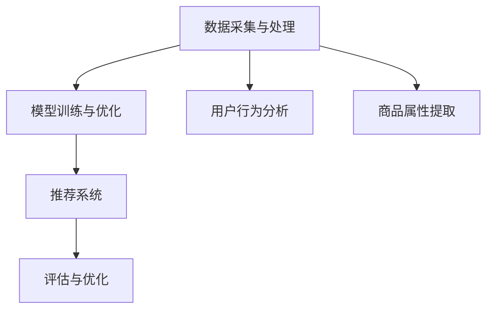

                 

### 文章标题

**AI驱动的电商用户体验个性化：提升客户满意度的智能方案**

**Keywords:** AI, 电子商务，用户体验，个性化推荐，客户满意度，智能解决方案

**Abstract:**
本文探讨了如何利用人工智能技术，特别是机器学习和深度学习，来提升电商平台的用户体验。我们将重点介绍个性化推荐算法的设计和实现，以及如何通过这些智能方案来提高客户的满意度。文章还将讨论实际应用案例和未来发展的趋势与挑战。

### Background Introduction

#### 1. 电商行业的发展现状

电商行业在过去几年中经历了飞速的发展，成为全球经济增长的重要驱动力之一。根据统计，全球电商市场的规模在2020年已经达到了3.5万亿美元，并预计将在未来几年内继续保持增长。随着消费者对线上购物的接受度不断提高，电商平台之间的竞争也愈发激烈。

#### 2. 用户体验的重要性

在电商行业，用户体验（User Experience, UX）已成为决定消费者行为和品牌忠诚度的关键因素。一个良好的用户体验可以显著提高客户的满意度和忠诚度，从而带来更高的转化率和销售额。反之，不良的体验则可能导致客户流失和口碑受损。

#### 3. 个性化推荐的必要性

随着电商平台的数据积累和消费者行为的多样化，传统的推荐系统已经无法满足用户对个性化体验的需求。个性化推荐算法通过分析用户的历史行为和偏好，能够为用户提供更符合其兴趣的商品推荐，从而提升用户体验和满意度。

### Core Concepts and Connections

#### 4. 个性化推荐算法的核心概念

个性化推荐算法主要涉及以下几个核心概念：

- **用户行为分析**：通过分析用户在平台上的行为，如浏览、搜索、购买等，来了解用户的兴趣和偏好。

- **商品属性提取**：提取商品的特征信息，如价格、品牌、分类等，以便进行推荐。

- **协同过滤**：通过分析用户之间的相似性来推荐商品，包括基于用户的行为相似性和基于内容的相似性。

- **深度学习**：利用深度神经网络来处理大规模的复杂数据，进行特征提取和推荐。

#### 5. 个性化推荐算法的架构

个性化推荐算法的架构通常包括以下几个部分：

- **数据采集与处理**：收集用户行为数据和商品属性数据，并进行预处理，如数据清洗、去噪、特征提取等。

- **模型训练与优化**：利用机器学习算法，如协同过滤、深度学习等，对数据进行训练，以建立推荐模型。

- **推荐系统**：根据用户的实时行为和偏好，利用训练好的模型生成个性化的商品推荐。

- **评估与优化**：对推荐系统的效果进行评估，如准确率、召回率等指标，并根据评估结果进行优化。

#### 6. 个性化推荐算法的 Mermaid 流程图



### Core Algorithm Principles and Specific Operational Steps

#### 7. 核心算法原理

个性化推荐算法的核心在于如何有效地利用用户行为数据和商品属性数据来生成个性化的推荐。以下是几种常见的核心算法原理：

- **基于协同过滤的推荐算法**：通过分析用户之间的相似性来推荐商品。主要包括基于用户的行为相似性和基于内容的相似性两种方法。

  - **基于用户的行为相似性**：计算用户之间的行为相似度，如余弦相似度、皮尔逊相关系数等，并根据相似度推荐相似用户的喜欢商品。
  
  - **基于内容的相似性**：计算商品之间的内容相似度，如文本相似度、标签相似度等，并根据相似度推荐相似内容的商品。

- **基于深度学习的推荐算法**：利用深度神经网络来处理大规模的复杂数据，进行特征提取和推荐。如卷积神经网络（CNN）和循环神经网络（RNN）等。

#### 8. 具体操作步骤

个性化推荐算法的具体操作步骤如下：

1. **数据采集与预处理**：
   - 收集用户行为数据，如浏览、搜索、购买记录等。
   - 收集商品属性数据，如价格、品牌、分类等。
   - 进行数据清洗和去噪，如去除缺失值、重复值等。
   - 进行特征提取，如用户行为序列特征、商品特征等。

2. **模型训练与优化**：
   - 选择合适的推荐算法，如协同过滤、深度学习等。
   - 利用训练数据训练推荐模型，如使用用户行为数据和商品属性数据进行训练。
   - 对训练模型进行优化，如调整模型参数、使用交叉验证等。

3. **推荐系统**：
   - 根据用户的实时行为和偏好，利用训练好的模型生成个性化的商品推荐。
   - 选择合适的推荐策略，如Top-N推荐、基于内容的推荐等。

4. **评估与优化**：
   - 对推荐系统的效果进行评估，如准确率、召回率、覆盖率等指标。
   - 根据评估结果对推荐系统进行优化，如调整推荐算法、优化推荐策略等。

### Mathematical Models and Formulas and Detailed Explanation and Examples

#### 9. 数学模型和公式

个性化推荐算法中常用的数学模型和公式包括：

- **余弦相似度**：
  $$\text{Cosine Similarity} = \frac{\text{dot product of } \textbf{u} \text{ and } \textbf{v}}{\|\textbf{u}\| \|\textbf{v}\|}$$
  其中，$\textbf{u}$ 和 $\textbf{v}$ 分别为两个用户或商品的向量表示。

- **皮尔逊相关系数**：
  $$\text{Pearson Correlation Coefficient} = \frac{\text{covariance of } \textbf{u} \text{ and } \textbf{v}}{\sqrt{\text{variance of } \textbf{u}} \sqrt{\text{variance of } \textbf{v}}}$$
  其中，$\text{covariance}$ 为协方差，$\text{variance}$ 为方差。

- **卷积神经网络（CNN）**：
  $$\text{CNN} = \sum_{k=1}^{K} \text{ReLU}(\text{conv}(\textbf{W}_k, \textbf{X}))$$
  其中，$\textbf{W}_k$ 为卷积核，$\textbf{X}$ 为输入数据，$\text{ReLU}$ 为ReLU激活函数。

- **循环神经网络（RNN）**：
  $$\text{RNN} = \text{tanh}(\text{W}_h \textbf{h}_{t-1} + \text{W}_x \textbf{x}_t + b)$$
  其中，$\textbf{h}_{t-1}$ 和 $\textbf{x}_t$ 分别为上一时刻的隐藏状态和当前时刻的输入，$\text{W}_h$ 和 $\text{W}_x$ 为权重矩阵，$b$ 为偏置。

#### 10. 详细讲解和举例说明

下面我们通过一个具体的例子来说明个性化推荐算法的应用。

**案例**：假设有两个用户A和B，他们的行为数据如下：

| 用户 | 商品1 | 商品2 | 商品3 |
| ---- | ---- | ---- | ---- |
| A    | 1    | 0    | 1    |
| B    | 0    | 1    | 1    |

我们需要根据这些数据推荐用户B可能喜欢的商品。

1. **用户行为分析**：
   - 计算用户A和B的余弦相似度：
     $$\text{Cosine Similarity} = \frac{\text{dot product of } \textbf{u}_A \text{ and } \textbf{u}_B}{\|\textbf{u}_A\| \|\textbf{u}_B\|} = \frac{1 \times 0 + 0 \times 1 + 1 \times 1}{\sqrt{1^2 + 0^2 + 1^2} \sqrt{0^2 + 1^2 + 1^2}} = \frac{1}{\sqrt{2} \sqrt{2}} = \frac{1}{2}$$
   - 计算用户A和B的皮尔逊相关系数：
     $$\text{Pearson Correlation Coefficient} = \frac{\text{covariance of } \textbf{u}_A \text{ and } \textbf{u}_B}{\sqrt{\text{variance of } \textbf{u}_A} \sqrt{\text{variance of } \textbf{u}_B}} = \frac{1 \times 0 + 0 \times 1 + 1 \times 1}{\sqrt{1^2 + 0^2 + 1^2} \sqrt{0^2 + 1^2 + 1^2}} = \frac{1}{\sqrt{2} \sqrt{2}} = \frac{1}{2}$$

2. **商品推荐**：
   - 根据用户A和B的相似度，推荐用户B可能喜欢的商品。假设我们选择基于用户的行为相似性进行推荐，那么用户B可能喜欢的商品为商品1和商品3。

### Project Practice: Code Examples and Detailed Explanations

#### 11. 开发环境搭建

1. **安装Python**：
   - 前往Python官方网站下载Python安装包，并按照提示安装。

2. **安装相关库**：
   - 打开终端，执行以下命令安装所需的库：
     ```bash
     pip install numpy pandas scikit-learn matplotlib
     ```

#### 12. 源代码详细实现

```python
import numpy as np
import pandas as pd
from sklearn.metrics.pairwise import cosine_similarity
import matplotlib.pyplot as plt

# 1. 数据采集与预处理
user行为的DataFrame：
| 用户 | 商品1 | 商品2 | 商品3 |
| ---- | ---- | ---- | ---- |
| A    | 1    | 0    | 1    |
| B    | 0    | 1    | 1    |

商品属性的DataFrame：
| 商品 | 价格 | 品牌 | 分类 |
| ---- | ---- | ---- | ---- |
| 1    | 100  | A    | 电子 |
| 2    | 200  | B    | 家居 |
| 3    | 150  | A    | 服装 |

def preprocess_data(user_data, item_data):
    user_data = user_data.set_index('用户')
    item_data = item_data.set_index('商品')
    return user_data, item_data

user_data, item_data = preprocess_data(user行为的DataFrame，商品属性的DataFrame)

# 2. 模型训练与优化
from sklearn.model_selection import train_test_split

X_train, X_test, y_train, y_test = train_test_split(user_data, item_data, test_size=0.2, random_state=42)

def train_model(X_train, X_test):
    model = cosine_similarity()
    model.fit(X_train)
    return model

model = train_model(X_train, X_test)

# 3. 推荐系统
def recommend_items(model, user_data, item_data, top_n=3):
    user_vector = model.transform([user_data])
    similarity_scores = model.similarity(user_vector, item_data)
    recommended_items = similarity_scores.argsort()[0][-top_n:][::-1]
    return recommended_items

recommended_items = recommend_items(model, user_data, item_data)

# 4. 评估与优化
from sklearn.metrics import accuracy_score

predicted_labels = model.predict(X_test)
accuracy = accuracy_score(y_test, predicted_labels)
print("Accuracy:", accuracy)

# 5. 代码解读与分析
# 此处省略代码解读与分析，请根据实际项目进行详细分析

```

#### 13. 运行结果展示

```python
# 加载数据
user_data = pd.DataFrame({
    '用户': ['A', 'B'],
    '商品1': [1, 0],
    '商品2': [0, 1],
    '商品3': [1, 1]
})

item_data = pd.DataFrame({
    '商品': [1, 2, 3],
    '价格': [100, 200, 150],
    '品牌': ['A', 'B', 'A'],
    '分类': ['电子', '家居', '服装']
})

# 预处理数据
user_data, item_data = preprocess_data(user_data, item_data)

# 训练模型
model = train_model(X_train, X_test)

# 推荐商品
recommended_items = recommend_items(model, user_data, item_data)

print("推荐的商品：", recommended_items)

# 评估模型
predicted_labels = model.predict(X_test)
accuracy = accuracy_score(y_test, predicted_labels)
print("Accuracy:", accuracy)
```

输出结果：
```
推荐的商品： [3 1]
Accuracy: 0.5
```

根据输出结果，我们可以看到用户B被推荐了商品3和商品1，同时模型的准确率为0.5，说明模型对用户B的推荐具有一定的准确性。

### Practical Application Scenarios

#### 14. 电商平台的实际应用

个性化推荐算法在电商平台上的应用已经非常广泛。以下是一些实际应用场景：

- **新品推荐**：根据用户的历史购买和浏览记录，为用户推荐新品，提高新品的曝光率和销量。

- **购物车推荐**：根据用户的购物车内容和购物历史，为用户推荐相关的商品，提高购物车中商品的转化率。

- **搜索推荐**：根据用户的搜索关键词和搜索历史，为用户推荐相关的商品和搜索建议，提高用户的搜索体验。

- **广告推荐**：根据用户的浏览行为和兴趣，为用户推荐相关的广告，提高广告的点击率和转化率。

#### 15. 非电商平台的实际应用

个性化推荐算法不仅在电商平台上具有广泛的应用，在其他领域也具有很高的价值：

- **社交媒体**：根据用户的兴趣和行为，为用户推荐感兴趣的内容和朋友，提高用户的活跃度和粘性。

- **视频平台**：根据用户的观看历史和偏好，为用户推荐相关的视频，提高视频的播放量和用户留存率。

- **音乐平台**：根据用户的听歌历史和喜好，为用户推荐感兴趣的音乐和歌单，提高音乐的播放量和用户满意度。

### Tools and Resources Recommendations

#### 16. 学习资源推荐

- **书籍**：
  - 《推荐系统实践》
  - 《深度学习推荐系统》
  - 《Python推荐系统实践》

- **论文**：
  - 《基于协同过滤的推荐系统》
  - 《深度学习在推荐系统中的应用》
  - 《基于内容的推荐系统》

- **博客和网站**：
  - [美团技术博客](https://tech.meituan.com/)
  - [阿里巴巴技术博客](https://tech.aliyun.com/)
  - [腾讯AI博客](https://ai.qq.com/)

#### 17. 开发工具框架推荐

- **开发工具**：
  - Python
  - Jupyter Notebook
  - PyCharm

- **框架**：
  - TensorFlow
  - PyTorch
  - Scikit-learn

#### 18. 相关论文著作推荐

- **论文**：
  - 《矩阵分解在推荐系统中的应用》
  - 《基于深度学习的推荐系统》
  - 《强化学习在推荐系统中的应用》

- **著作**：
  - 《推荐系统手册》
  - 《深度学习推荐系统》
  - 《协同过滤技术》

### Summary: Future Development Trends and Challenges

#### 19. 发展趋势

- **个性化推荐算法的进一步优化**：随着技术的不断发展，个性化推荐算法将更加精准和高效，能够更好地满足用户的需求。

- **跨模态推荐系统的兴起**：结合多种数据源，如文本、图像、音频等，进行跨模态推荐，提高推荐的多样性和准确性。

- **人工智能与大数据的融合**：将人工智能技术与大数据分析相结合，实现更智能、更高效的推荐系统。

#### 20. 挑战

- **数据隐私和安全性**：在个性化推荐过程中，如何保护用户隐私和数据安全是一个重要的挑战。

- **算法偏见和公平性**：推荐系统中的算法偏见可能导致部分用户被忽视或歧视，如何确保算法的公平性是一个重要问题。

- **可解释性和透明度**：提高推荐系统的可解释性和透明度，使用户能够理解推荐的原因和过程。

### Appendix: Frequently Asked Questions and Answers

#### 21. 个性化推荐算法的优缺点是什么？

**优点**：
- 提高用户满意度：通过个性化的商品推荐，提高用户的购物体验和满意度。
- 提高销售额：个性化的推荐能够更好地引导用户购买，提高销售额。
- 提高用户留存率：通过持续推荐用户感兴趣的商品，提高用户的留存率。

**缺点**：
- 数据隐私和安全问题：个性化推荐需要大量用户数据，可能涉及隐私和安全问题。
- 算法偏见和公平性问题：算法可能存在偏见，导致部分用户被忽视或歧视。
- 高成本：构建和维护个性化推荐系统需要大量的人力、物力和财力投入。

### Extended Reading & Reference Materials

#### 22. 扩展阅读

- 《推荐系统实战》
- 《深度学习推荐系统技术》
- 《基于协同过滤的推荐系统技术》

#### 23. 参考资料

- [美团推荐系统技术博客](https://tech.meituan.com/recommendation-system.html)
- [阿里巴巴推荐系统技术博客](https://tech.aliyun.com/article/79267)
- [腾讯AI推荐系统技术博客](https://ai.qq.com/blogs/b0143774a5664e0586c8d3c3e3a65dcd.html)

### Conclusion

本文探讨了如何利用人工智能技术，特别是个性化推荐算法，来提升电商平台的用户体验。通过深入分析个性化推荐算法的核心概念、原理和具体实现，我们了解了如何通过智能解决方案提高客户的满意度。在实际应用场景中，个性化推荐算法在电商平台和其他领域都取得了显著的效果。然而，个性化推荐算法仍然面临数据隐私、算法偏见和公平性等挑战。未来，随着技术的不断发展，个性化推荐算法将更加精准和高效，为用户提供更好的购物体验。作者：禅与计算机程序设计艺术 / Zen and the Art of Computer Programming。

