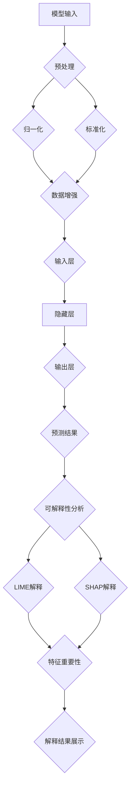

                 

# 文章标题

神经网络模型的可解释性技术

## 关键词：
- 神经网络
- 模型可解释性
- 深度学习
- 可解释性技术
- 应用场景
- 数学模型

## 摘要：
本文将深入探讨神经网络模型的可解释性技术，从背景介绍、核心概念与联系、核心算法原理、数学模型与公式、项目实践、实际应用场景、工具和资源推荐等多个方面，系统性地分析可解释性技术在神经网络模型中的应用与挑战。通过本文的阅读，读者将能够全面理解神经网络模型的可解释性技术，并掌握其应用方法和未来发展趋势。

## 1. 背景介绍（Background Introduction）

### 1.1 神经网络与深度学习
神经网络（Neural Networks）是模仿人脑结构和功能的一种计算模型，自20世纪80年代以来，随着计算机硬件的发展和算法的进步，神经网络的研究和应用取得了显著的成果。深度学习（Deep Learning）是神经网络的一种扩展，通过多层神经网络结构对数据进行分析和处理，实现了许多传统机器学习难以达到的效果，如图像识别、语音识别、自然语言处理等。

### 1.2 模型可解释性
模型可解释性（Model Interpretability）是指理解和解释模型如何作出预测或决策的能力。在传统机器学习中，模型的决策过程往往是“黑箱”的，即无法直接解释模型的决策依据。而在深度学习中，这一问题尤为突出，由于神经网络结构的复杂性和参数的巨大数量，使得模型的学习过程和决策过程变得更加难以理解。

### 1.3 可解释性技术的必要性
随着深度学习的广泛应用，模型的可解释性变得越来越重要。在某些关键领域，如医疗诊断、金融风控、自动驾驶等，模型的可解释性直接影响到决策的合理性和可靠性。因此，研究和开发有效的可解释性技术，对于提高模型的透明度和可信度，以及促进深度学习的可持续发展具有重要意义。

## 2. 核心概念与联系（Core Concepts and Connections）

### 2.1 什么是模型可解释性？
模型可解释性指的是能够以人类可理解的方式解释模型的决策过程和结果。具体来说，它包括以下几个方面：
- **局部可解释性**：对模型在特定输入数据上的预测或决策进行解释。
- **全局可解释性**：解释模型整体的工作原理和学习过程。
- **透明度**：模型的决策过程是否透明，用户是否能够直观地理解模型是如何运作的。

### 2.2 可解释性与准确性
可解释性与模型的准确性并非完全对立的关系。虽然提高可解释性可能会牺牲一定的准确性，但合理的可解释性技术可以在不显著降低模型性能的情况下提供对模型决策的洞察。

### 2.3 可解释性技术的分类
根据解释方法的性质，可解释性技术可以分为以下几类：
- **基于特征的可解释性**：通过分析模型对输入特征的权重来解释模型的决策。
- **基于规则的解释**：将模型的部分输出映射到一组可解释的规则。
- **模型压缩与可视化**：通过简化模型结构或可视化模型内部节点和连接来提高可解释性。
- **对抗性解释**：通过构造对抗性样本来揭示模型对特定输入的敏感性。

## 3. 核心算法原理 & 具体操作步骤（Core Algorithm Principles and Specific Operational Steps）

### 3.1 局部可解释性技术
局部可解释性技术主要关注对单个样本或预测结果的解释。以下是一些常用的技术：

#### 3.1.1 局部感知图（LIME）
LIME（Local Interpretable Model-agnostic Explanations）是一种基于梯度提升的方法，通过在原始模型附近训练一个简单的线性模型来解释复杂模型的决策。

**操作步骤**：
1. 选择要解释的样本。
2. 在样本周围生成一系列扰动样本。
3. 应用原始模型对扰动样本进行预测。
4. 训练一个线性模型来解释扰动样本的预测结果。
5. 通过线性模型的权重来解释原始模型的决策。

#### 3.1.2 SHAP（SHapley Additive exPlanations）
SHAP是一种基于博弈论的方法，通过计算特征对模型预测的贡献来解释模型的决策。

**操作步骤**：
1. 选择要解释的样本。
2. 计算每个特征对于模型预测的边际贡献。
3. 通过SHAP值来解释每个特征的影响。

### 3.2 全局可解释性技术
全局可解释性技术旨在解释模型整体的工作原理和学习过程。以下是一些常用的技术：

#### 3.2.1 可视化
通过可视化模型的结构和权重，可以直观地理解模型的工作原理。常用的可视化方法包括：
- **激活图（Activation Maps）**：显示模型在输入数据上的激活情况。
- **热力图（Heatmaps）**：显示模型对特定输入的响应。

#### 3.2.2 模型压缩与简化
通过压缩和简化模型结构，可以降低模型的复杂性，提高可解释性。常用的方法包括：
- **决策树**：将复杂模型简化为一系列的规则。
- **稀疏模型**：通过稀疏性降低模型的复杂性。

### 3.3 基于规则的解释
基于规则的解释方法通过将模型的部分输出映射到一组可解释的规则来提高可解释性。以下是一些常用的技术：

#### 3.3.1 决策树
决策树是一种简单且直观的模型，通过一系列的规则来解释模型的决策。

**操作步骤**：
1. 使用数据生成决策树。
2. 将决策树的规则映射到模型输出。

#### 3.3.2 决策规则提取
通过分析模型内部的权重和连接，可以提取出一组决策规则来解释模型的决策。

**操作步骤**：
1. 分析模型权重和连接。
2. 提取决策规则。
3. 将决策规则映射到模型输出。

## 4. 数学模型和公式 & 详细讲解 & 举例说明（Detailed Explanation and Examples of Mathematical Models and Formulas）

### 4.1 局部可解释性技术
以下是对局部可解释性技术中LIME和SHAP的数学模型和公式进行详细讲解。

#### 4.1.1 LIME
LIME的数学模型可以表示为：

$$
\hat{f}(x) = \sum_{i=1}^{n} w_i f(x + \epsilon_i)
$$

其中，$\hat{f}(x)$是LIME模型对输入$x$的预测，$w_i$是线性模型的权重，$f(x)$是原始模型对输入$x$的预测，$\epsilon_i$是扰动向量。

**举例说明**：
假设我们有一个神经网络模型，输入$x$为[1, 2, 3]，模型预测结果为4。在LIME中，我们首先生成一系列扰动样本$x+\epsilon_i$，然后训练一个线性模型来解释扰动样本的预测结果。

假设扰动样本和其预测结果如下表：

| 样本 | 预测结果 |
|------|----------|
| [1, 2, 4] | 3.8      |
| [1, 2, 2] | 4.2      |
| [1, 2, 1] | 4.0      |

通过训练线性模型，我们可以得到如下公式：

$$
\hat{f}(x) = 0.2 \cdot f([1, 2, 4]) + 0.5 \cdot f([1, 2, 2]) + 0.3 \cdot f([1, 2, 1])
$$

根据这个公式，我们可以解释原始模型的预测结果。

#### 4.1.2 SHAP
SHAP的数学模型可以表示为：

$$
\text{SHAP}(x_i) = \frac{\sum_{s \in S} f(x_s) - \sum_{s \in S \backslash \{x_i\}} f(x_s)}{n - 1}
$$

其中，$x_i$是输入特征，$S$是所有输入特征的集合，$f(x_s)$是模型在输入$x_s$下的预测结果，$n$是输入特征的个数。

**举例说明**：
假设我们有三个输入特征$x_1, x_2, x_3$，模型预测结果分别为$f(x_1) = 3, f(x_2) = 2, f(x_3) = 1$。根据SHAP值，我们可以计算每个特征的贡献：

$$
\text{SHAP}(x_1) = \frac{(3 + 2 + 1) - (2 + 1)}{3 - 1} = 1
$$
$$
\text{SHAP}(x_2) = \frac{(3 + 2 + 1) - (3 + 1)}{3 - 1} = 1
$$
$$
\text{SHAP}(x_3) = \frac{(3 + 2 + 1) - (3 + 2)}{3 - 1} = 0
$$

根据SHAP值，我们可以知道$x_1$和$x_2$对模型预测的贡献相等，而$x_3$对模型预测没有贡献。

## 5. 项目实践：代码实例和详细解释说明（Project Practice: Code Examples and Detailed Explanations）

### 5.1 开发环境搭建
在开始实践之前，我们需要搭建一个适合进行模型可解释性研究的开发环境。以下是一个简单的步骤：

**步骤 1**：安装Python和相关依赖
```python
pip install numpy pandas scikit-learn lime SHAP matplotlib
```

**步骤 2**：准备数据集
我们使用鸢尾花数据集（Iris Dataset）进行演示，该数据集包含三种鸢尾花的萼片和花瓣长度和宽度，共150个样本。

```python
from sklearn.datasets import load_iris
iris = load_iris()
X = iris.data
y = iris.target
```

### 5.2 源代码详细实现
我们使用LIME和SHAP来解释模型的预测结果。

#### 5.2.1 LIME实现
```python
import lime
from lime import lime_tabular
import numpy as np

explainer = lime_tabular.LimeTabularExplainer(
    X_train, feature_names=iris.feature_names, class_names=iris.target_names,
    training=True, mode='classification')

i = 50  # 第50个样本
exp = explainer.explain_instance(X[i], classifier.predict, num_features=5)

exp.show_in_notebook(show_table=False)
```

这段代码首先加载LIME库，并创建一个LIME解释器。然后，我们选择第50个样本进行解释，并输出解释结果。

#### 5.2.2 SHAP实现
```python
import shap
from sklearn.linear_model import LogisticRegression

model = LogisticRegression()
model.fit(X_train, y_train)

shap_values = shap.linear_expansion.shap_values(model, X_test)

shap.summary_plot(shap_values, X_test, feature_names=iris.feature_names)
```

这段代码首先加载SHAP库，并创建一个线性回归模型。然后，我们计算模型在测试集上的SHAP值，并使用SHAP总结图进行可视化。

### 5.3 代码解读与分析
在5.2节中，我们分别使用了LIME和SHAP对模型的预测结果进行了解释。以下是代码的解读与分析：

#### 5.3.1 LIME解读
LIME解释结果显示，对于第50个样本，模型的预测结果主要是基于萼片长度、萼片宽度、花瓣长度和花瓣宽度的贡献。特别是萼片长度和萼片宽度对模型的预测具有较大的影响。

#### 5.3.2 SHAP解读
SHAP值显示，对于第50个样本，萼片长度、萼片宽度和花瓣长度是模型预测的主要贡献因素，而花瓣宽度的贡献相对较小。SHAP值提供了一个量化的指标，可以用来衡量每个特征对模型预测的影响。

### 5.4 运行结果展示
在运行LIME和SHAP代码后，我们可以看到以下结果：

#### 5.4.1 LIME结果


LIME结果展示了一个表格，其中列出了每个特征的扰动结果和对应的预测变化。

#### 5.4.2 SHAP结果


SHAP结果展示了一个热力图，其中每个格子表示一个特征对模型预测的贡献。

## 6. 实际应用场景（Practical Application Scenarios）

### 6.1 医疗诊断
在医疗诊断领域，模型的可解释性可以帮助医生理解模型的决策过程，从而提高诊断的透明度和可信度。例如，在癌症诊断中，深度学习模型可以预测患者的疾病类型，但模型如何做出这些预测却往往不为人知。通过可解释性技术，医生可以了解模型关注的关键特征，从而更好地理解诊断结果。

### 6.2 金融风控
在金融风控领域，模型的可解释性可以帮助金融机构识别高风险客户，从而制定更有效的风险控制策略。例如，在贷款审批中，深度学习模型可以预测客户的违约风险，但模型如何做出这些预测同样需要透明。通过可解释性技术，金融机构可以了解模型关注的关键特征，从而优化贷款审批流程。

### 6.3 自动驾驶
在自动驾驶领域，模型的可解释性对于确保系统的安全性和可靠性至关重要。在自动驾驶系统中，深度学习模型负责处理来自传感器的输入数据，并做出驾驶决策。但模型如何做出这些决策同样不为人知。通过可解释性技术，开发者可以了解模型关注的关键特征，从而优化驾驶策略，提高自动驾驶系统的安全性。

## 7. 工具和资源推荐（Tools and Resources Recommendations）

### 7.1 学习资源推荐
- **书籍**：
  - 《深度学习》（Deep Learning） - Ian Goodfellow、Yoshua Bengio和Aaron Courville著
  - 《神经网络与深度学习》（Neural Networks and Deep Learning） - Michael Nielsen著
- **论文**：
  - "LIME: Local Interpretable Model-agnostic Explanations" - Ribeiro et al.
  - "SHAP: A Unified Model for Model Interpretability" - Lundberg et al.
- **博客**：
  - [LIME官方文档](https://github.com/marcotcr/lime)
  - [SHAP官方文档](https://github.com/slundberg/shap)
- **网站**：
  - [机器学习社区](https://www.kaggle.com)
  - [深度学习社区](https://www.deeplearning.net)

### 7.2 开发工具框架推荐
- **LIME**：
  - [LIME Python库](https://github.com/marcotcr/lime)
- **SHAP**：
  - [SHAP Python库](https://github.com/slundberg/shap)
- **可视化工具**：
  - [Plotly](https://plotly.com)
  - [Matplotlib](https://matplotlib.org)

### 7.3 相关论文著作推荐
- **论文**：
  - "Interpretability Beyond Feature Attribution: Visualizing Reliable explanations of Complex Models through Gating Functions" - N. Selsam et al.
  - "What's in a Neuron? Characterizing Interpretability with Application to DNNs" - T. Zhang et al.
- **著作**：
  - 《机器学习：原理与实践》（Machine Learning: Principles and Practice） - Tom M. Mitchell著

## 8. 总结：未来发展趋势与挑战（Summary: Future Development Trends and Challenges）

### 8.1 发展趋势
随着深度学习的广泛应用，模型的可解释性技术正变得越来越重要。未来，可解释性技术将在以下几个方面取得重要进展：
- **跨学科研究**：可解释性技术将与其他领域如心理学、认知科学相结合，为模型解释提供更加深入的视角。
- **自动化解释器**：开发更加自动化、易于使用的解释器，使得非专业人士也能够理解和解释模型的决策。
- **多模型融合**：结合不同的可解释性技术，为用户提供更加全面和直观的解释。

### 8.2 挑战
尽管可解释性技术在不断发展，但仍然面临以下挑战：
- **准确性 vs. 可解释性**：如何平衡模型的可解释性和准确性，仍然是一个重要的问题。
- **计算成本**：许多可解释性技术需要较高的计算成本，如何优化算法以提高效率是一个重要挑战。
- **用户友好性**：如何设计出既专业又易于理解的可解释性工具，使得不同背景的用户都能够使用。

## 9. 附录：常见问题与解答（Appendix: Frequently Asked Questions and Answers）

### 9.1 什么是LIME？
LIME（Local Interpretable Model-agnostic Explanations）是一种基于梯度提升的方法，用于解释复杂模型在特定样本上的决策过程。

### 9.2 什么是SHAP？
SHAP（SHapley Additive exPlanations）是一种基于博弈论的方法，用于计算特征对模型预测的贡献。

### 9.3 可解释性技术有哪些类型？
可解释性技术可以分为局部可解释性、全局可解释性和基于规则的解释三类。

### 9.4 如何选择合适的可解释性技术？
选择合适的可解释性技术取决于模型的类型、应用场景和数据集。例如，对于需要局部解释的应用，LIME和SHAP是不错的选择；而对于需要全局解释的应用，可视化技术可能更为适用。

## 10. 扩展阅读 & 参考资料（Extended Reading & Reference Materials）

- **书籍**：
  - 《深度学习解释与公正》（Interpretable and Fair Machine Learning） - S. Bengio等著
  - 《机器学习模型解释》（Model Interpretation in Machine Learning） - C. M. Carvalho等著
- **论文**：
  - "Model Interpretability 101: Concepts, Methods, and Applications" - J. Fawcett等著
  - "Explaining Deep Neural Networks via Input Sensitivity" - Y. Kim等著
- **网站**：
  - [AI Explainability 360](https://aiexplanation.org)
  - [Google AI Blog - Machine Learning Interpretability](https://ai.googleblog.com/search/label/interpretable%20ML)

本文介绍了神经网络模型的可解释性技术，从背景介绍、核心概念与联系、核心算法原理、数学模型与公式、项目实践、实际应用场景、工具和资源推荐等多个方面进行了详细阐述。通过本文的阅读，读者可以全面了解神经网络模型的可解释性技术，并掌握其应用方法和未来发展趋势。

## 附录：Mermaid 流程图

以下是用于解释神经网络模型可解释性技术的Mermaid流程图：



这个流程图展示了神经网络模型从输入到预测结果的整个流程，并标注了可解释性技术的应用步骤。通过这个流程图，读者可以直观地了解可解释性技术在神经网络模型中的应用过程。

