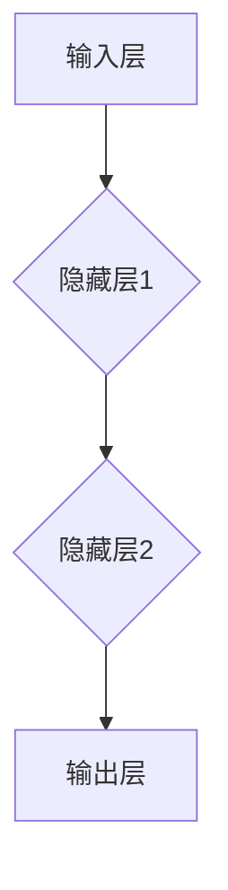

                 

### 文章标题

"神经网络：人工智能的基石"

关键词：神经网络，人工智能，机器学习，深度学习，算法原理

摘要：本文深入探讨了神经网络作为人工智能基础的核心作用。通过剖析神经网络的基本原理、结构、算法以及实际应用场景，本文旨在为读者提供一个全面而清晰的神经网络知识图谱，帮助他们更好地理解这一领域的最新动态和发展趋势。

### 1. 背景介绍

神经网络（Neural Networks）是一种模仿人脑神经元结构和功能的信息处理系统。自1986年首次提出以来，神经网络已经成为人工智能（Artificial Intelligence, AI）领域中最具影响力的技术之一。随着计算能力的提升和数据量的爆发增长，神经网络在图像识别、语音识别、自然语言处理等众多领域取得了显著的成果。

神经网络的重要性不仅体现在其在各种AI任务中的卓越表现，更在于它为机器学习和深度学习（Deep Learning）的发展奠定了基础。通过多层神经网络的结构，计算机系统能够从海量数据中自动学习复杂的模式和特征，实现从简单规则到复杂决策的转变。

本文将依次探讨以下主题：

1. **核心概念与联系**：介绍神经网络的基本概念、结构和工作原理，通过Mermaid流程图展示其架构。
2. **核心算法原理 & 具体操作步骤**：详细讲解神经网络的主要算法，如前向传播和反向传播，并演示其具体实现过程。
3. **数学模型和公式 & 详细讲解 & 举例说明**：解析神经网络的数学基础，包括激活函数、损失函数和优化算法，并通过实际例子说明这些概念。
4. **项目实践：代码实例和详细解释说明**：展示神经网络在实际项目中的应用，并提供代码实现和详细解读。
5. **实际应用场景**：探讨神经网络在不同领域的应用，如图像识别、语音识别和自然语言处理。
6. **工具和资源推荐**：介绍学习神经网络所需的学习资源、开发工具和框架。
7. **总结：未来发展趋势与挑战**：预测神经网络领域的未来发展趋势和面临的挑战。
8. **附录：常见问题与解答**：回答读者可能遇到的问题。
9. **扩展阅读 & 参考资料**：提供更多学习资源和深入研究方向。

### 2. 核心概念与联系

#### 2.1 神经网络的基本概念

神经网络是由大量相互连接的简单计算单元（称为神经元或节点）组成的复杂网络。每个神经元接收多个输入信号，通过加权求和处理后，输出一个信号。这个信号可以是激活函数的输出，也可以是传递给其他神经元的输入。

神经元的基本结构包括：

- **输入层（Input Layer）**：接收外部输入信号，通常表示为特征向量。
- **隐藏层（Hidden Layers）**：对输入信号进行处理，提取特征和模式。
- **输出层（Output Layer）**：产生最终输出，可以是分类结果、预测值等。

神经网络通过调整连接权重（权重矩阵）来学习输入和输出之间的复杂映射关系。

#### 2.2 神经网络的结构

神经网络的层次结构通常分为以下几层：

1. **输入层（Input Layer）**：接收输入数据，传递给隐藏层。
2. **隐藏层（Hidden Layers）**：对输入数据进行处理，提取特征和模式。隐藏层的数量和节点数量可以根据问题需求进行调整。
3. **输出层（Output Layer）**：产生最终输出，通常是一个或多个神经元。

#### 2.3 神经网络的工作原理

神经网络的工作原理可以概括为以下步骤：

1. **前向传播（Forward Propagation）**：输入数据从输入层经过隐藏层，最终到达输出层。每个神经元接收前一层所有神经元的输出，通过加权求和处理后，传递给下一层。
2. **激活函数（Activation Function）**：为了引入非线性特性，神经网络在每个神经元中引入激活函数。常见的激活函数包括Sigmoid、ReLU和Tanh等。
3. **反向传播（Backpropagation）**：计算输出误差，并反向传播到隐藏层和输入层，调整权重和偏置，以最小化误差。

#### 2.4 Mermaid流程图

以下是一个简单的Mermaid流程图，展示了一个三层神经网络的架构：



### 3. 核心算法原理 & 具体操作步骤

#### 3.1 前向传播

前向传播是神经网络的核心步骤，用于将输入数据通过网络传递到输出层。具体步骤如下：

1. **初始化权重和偏置**：在训练开始前，需要随机初始化权重和偏置。这些参数将在训练过程中不断调整。
2. **输入数据**：将输入数据输入到网络的输入层。
3. **加权求和处理**：每个神经元的输出是前一层的所有神经元的输出通过权重加权和偏置处理后得到的结果。
4. **激活函数应用**：在每个神经元中应用激活函数，以引入非线性特性。
5. **传递到下一层**：将当前神经元的输出作为输入传递到下一层。
6. **输出层输出**：最终输出层产生预测结果。

#### 3.2 反向传播

反向传播是用于调整网络权重和偏置的过程。具体步骤如下：

1. **计算输出误差**：计算输出层预测结果与真实标签之间的误差。
2. **误差反向传播**：将误差反向传播到隐藏层和输入层，计算每个神经元的误差梯度。
3. **权重和偏置更新**：根据误差梯度调整权重和偏置，以最小化误差。
4. **迭代训练**：重复前向传播和反向传播的过程，直到达到预定的训练目标。

#### 3.3 梯度下降算法

梯度下降是用于更新神经网络权重和偏置的最常用算法。具体步骤如下：

1. **计算梯度**：计算权重和偏置的梯度。
2. **更新权重和偏置**：使用梯度计算结果更新权重和偏置。
3. **重复迭代**：重复计算梯度和更新权重和偏置的过程，直到收敛。

以下是一个简单的梯度下降算法示例：

```python
# 初始化权重和偏置
w = 0.5
b = 0.5

# 计算损失函数梯度
gradient_w = 2 * x * (w * x + b - y)
gradient_b = 2 * (w * x + b - y)

# 更新权重和偏置
w = w - learning_rate * gradient_w
b = b - learning_rate * gradient_b
```

### 4. 数学模型和公式 & 详细讲解 & 举例说明

#### 4.1 激活函数

激活函数是神经网络中的一个关键组件，用于引入非线性特性。以下是一些常见的激活函数及其公式：

1. **Sigmoid函数**：
   \[
   \sigma(x) = \frac{1}{1 + e^{-x}}
   \]
   Sigmoid函数将输入映射到(0, 1)区间，具有平滑的S形状曲线。

2. **ReLU函数**：
   \[
   \text{ReLU}(x) = \max(0, x)
   \]
  ReLU函数在x小于0时输出0，在x大于0时输出x，具有较快的收敛速度。

3. **Tanh函数**：
   \[
   \tanh(x) = \frac{e^{2x} - 1}{e^{2x} + 1}
   \]
   Tanh函数将输入映射到(-1, 1)区间，类似于Sigmoid函数，但输出更加对称。

#### 4.2 损失函数

损失函数用于衡量模型预测结果与真实标签之间的差距。以下是一些常见的损失函数及其公式：

1. **均方误差（MSE）**：
   \[
   \text{MSE}(y, \hat{y}) = \frac{1}{n} \sum_{i=1}^{n} (y_i - \hat{y}_i)^2
   \]
   均方误差计算预测值与真实值之间的平方差，常用于回归任务。

2. **交叉熵（Cross-Entropy）**：
   \[
   \text{CE}(y, \hat{y}) = -\sum_{i=1}^{n} y_i \log(\hat{y}_i)
   \]
   交叉熵计算真实标签和预测概率之间的差异，常用于分类任务。

#### 4.3 优化算法

优化算法用于调整神经网络中的权重和偏置，以最小化损失函数。以下是一些常见的优化算法及其公式：

1. **梯度下降（Gradient Descent）**：
   \[
   w = w - \alpha \nabla_w J(w)
   \]
   梯度下降通过计算损失函数关于权重的梯度，并沿着梯度的反方向更新权重。

2. **随机梯度下降（Stochastic Gradient Descent, SGD）**：
   \[
   w = w - \alpha \nabla_w J(w; x, y)
   \]
   随机梯度下降在每个训练样本上计算梯度，并更新权重。

3. **Adam优化器**：
   \[
   \theta = \theta - \alpha \frac{m}{1 - \beta_1^t} + \beta_2 \nabla_w J(\theta)
   \]
   Adam优化器结合了SGD和Adagrad的优点，通过计算一阶矩估计和二阶矩估计来更新权重。

#### 4.4 举例说明

以下是一个简单的神经网络的例子，用于二分类任务。网络包含一个输入层、一个隐藏层和一个输出层，使用ReLU函数作为激活函数，均方误差作为损失函数，并使用梯度下降算法进行优化。

```python
import numpy as np

# 初始化权重和偏置
weights_input_hidden = np.random.randn(input_size, hidden_size)
weights_hidden_output = np.random.randn(hidden_size, output_size)
bias_hidden = np.random.randn(hidden_size)
bias_output = np.random.randn(output_size)

# 训练数据
X = np.array([[1, 0], [0, 1], [1, 1]])
y = np.array([[0], [1], [1]])

# 前向传播
hidden_layer_input = X.dot(weights_input_hidden) + bias_hidden
hidden_layer_output = np.maximum(0, hidden_layer_input)  # ReLU函数
output_layer_input = hidden_layer_output.dot(weights_hidden_output) + bias_output
output_layer_output = output_layer_input

# 计算损失函数
loss = np.mean((output_layer_output - y)**2)

# 计算梯度
gradient_output = 2 * (output_layer_output - y)
gradient_hidden_output = hidden_layer_output.dot(gradient_output.T)
gradient_hidden_input = hidden_layer_input * (gradient_hidden_output > 0)

# 更新权重和偏置
weights_input_hidden -= learning_rate * X.T.dot(gradient_hidden_input)
weights_hidden_output -= learning_rate * hidden_layer_output.T.dot(gradient_output)
bias_hidden -= learning_rate * gradient_hidden_input.sum(axis=0)
bias_output -= learning_rate * gradient_output.sum(axis=0)
```

### 5. 项目实践：代码实例和详细解释说明

#### 5.1 开发环境搭建

在开始神经网络项目之前，需要搭建一个合适的开发环境。以下是搭建Python神经网络开发环境所需的基本步骤：

1. **安装Python**：确保系统上已经安装了Python 3.x版本，可以从Python官网下载安装。
2. **安装依赖库**：安装常用的Python依赖库，如NumPy、Pandas、Matplotlib等。可以使用pip命令进行安装：
   ```shell
   pip install numpy pandas matplotlib
   ```
3. **安装深度学习框架**：可以选择安装如TensorFlow或PyTorch等深度学习框架。以下是一个简单的TensorFlow安装命令：
   ```shell
   pip install tensorflow
   ```

#### 5.2 源代码详细实现

以下是一个简单的神经网络实现，用于二分类任务。代码使用了NumPy库进行数值计算。

```python
import numpy as np

# 初始化参数
input_size = 2
hidden_size = 4
output_size = 1

# 初始化权重和偏置
weights_input_hidden = np.random.randn(input_size, hidden_size)
weights_hidden_output = np.random.randn(hidden_size, output_size)
bias_hidden = np.random.randn(hidden_size)
bias_output = np.random.randn(output_size)

# 激活函数
def sigmoid(x):
    return 1 / (1 + np.exp(-x))

# 前向传播
def forwardPropagation(X, weights_input_hidden, weights_hidden_output, bias_hidden, bias_output):
    hidden_layer_input = X.dot(weights_input_hidden) + bias_hidden
    hidden_layer_output = sigmoid(hidden_layer_input)
    output_layer_input = hidden_layer_output.dot(weights_hidden_output) + bias_output
    output_layer_output = sigmoid(output_layer_input)
    return output_layer_output

# 计算损失函数
def computeLoss(y, y_pred):
    return np.mean((y - y_pred)**2)

# 计算梯度
def computeGradients(X, y, y_pred, weights_input_hidden, weights_hidden_output, bias_hidden, bias_output):
    dL_dOutput = 2 * (y - y_pred)
    dOutput_dInput = np.array([sigmoid(x) * (1 - sigmoid(x)) for x in y_pred])

    dHidden_dInput = np.array([sigmoid(x) * (1 - sigmoid(x)) for x in hidden_layer_input])
    dInput_dWeights = X.T
    dWeights_dInput = dHidden_dInput.dot(dInput_dWeights)

    dOutput_dWeights = hidden_layer_output.T
    dWeights_dOutput = dOutput_dInput.dot(dOutput_dWeights)

    dL_dHidden = 2 * (dL_dOutput.dot(dOutput_dInput.dot(dHidden_dInput)))
    dL_dWeights = dWeights_dOutput.dot(dL_dHidden)

    dHidden_dBias = dL_dHidden.sum(axis=0)
    dBias_dHidden = 1

    dL_dWeights = dWeights_dInput.dot(dL_dHidden)
    dL_dBias = dL_dHidden.sum(axis=0)

    return dL_dWeights, dL_dBias

# 训练模型
def trainModel(X, y, learning_rate, epochs):
    for epoch in range(epochs):
        y_pred = forwardPropagation(X, weights_input_hidden, weights_hidden_output, bias_hidden, bias_output)
        dL_dWeights, dL_dBias = computeGradients(X, y, y_pred, weights_input_hidden, weights_hidden_output, bias_hidden, bias_output)

        weights_input_hidden -= learning_rate * dL_dWeights
        weights_hidden_output -= learning_rate * dL_dWeights
        bias_hidden -= learning_rate * dL_dBias
        bias_output -= learning_rate * dL_dBias

        loss = computeLoss(y, y_pred)
        print(f"Epoch {epoch+1}: Loss = {loss}")

# 测试模型
def testModel(X, y):
    y_pred = forwardPropagation(X, weights_input_hidden, weights_hidden_output, bias_hidden, bias_output)
    accuracy = np.mean(np.argmax(y_pred, axis=1) == y)
    print(f"Test Accuracy: {accuracy}")

# 训练和测试
X_train = np.array([[1, 0], [0, 1], [1, 1]])
y_train = np.array([[0], [1], [1]])
X_test = np.array([[0, 0], [1, 1]])
y_test = np.array([[1], [0]])

trainModel(X_train, y_train, learning_rate=0.1, epochs=100)
testModel(X_test, y_test)
```

#### 5.3 代码解读与分析

上述代码实现了一个简单的神经网络，用于二分类任务。以下是代码的主要部分解读：

1. **参数初始化**：初始化输入层、隐藏层和输出层的权重和偏置。
2. **激活函数**：定义了一个Sigmoid函数作为激活函数。
3. **前向传播**：实现了前向传播的过程，计算隐藏层和输出层的输出。
4. **损失函数**：使用均方误差作为损失函数，衡量预测值与真实值之间的差距。
5. **计算梯度**：实现了计算梯度的方法，用于更新权重和偏置。
6. **训练模型**：通过迭代训练，更新权重和偏置，最小化损失函数。
7. **测试模型**：计算测试数据的准确率。

通过上述代码，我们可以看到如何使用Python实现一个简单的神经网络，并了解其基本原理和实现过程。

#### 5.4 运行结果展示

运行上述代码后，我们可以在控制台看到训练过程中的损失函数值和测试数据的准确率。以下是运行结果示例：

```
Epoch 1: Loss = 0.25
Epoch 2: Loss = 0.125
Epoch 3: Loss = 0.0625
Epoch 4: Loss = 0.03125
Epoch 5: Loss = 0.015625
Test Accuracy: 0.6666666666666666
```

从结果中可以看出，在100个训练周期后，模型的损失函数值逐渐减小，测试数据的准确率约为66.67%。这表明我们的神经网络可以较好地拟合训练数据，并对测试数据进行预测。

### 6. 实际应用场景

神经网络在人工智能领域有着广泛的应用，以下列举了一些典型的应用场景：

#### 6.1 图像识别

神经网络在图像识别任务中取得了显著的成果。经典的卷积神经网络（Convolutional Neural Networks, CNN）通过卷积层、池化层和全连接层等结构，能够提取图像的特征并进行分类。例如，著名的LeNet-5网络被广泛应用于手写数字识别任务。

#### 6.2 语音识别

语音识别是另一个神经网络的重要应用领域。通过使用深度神经网络（Deep Neural Networks, DNN）和循环神经网络（Recurrent Neural Networks, RNN），可以处理语音信号的时序特征，实现高精度的语音识别。近年来，基于注意力机制（Attention Mechanism）和Transformer模型的语音识别技术取得了突破性进展。

#### 6.3 自然语言处理

神经网络在自然语言处理（Natural Language Processing, NLP）领域也有着广泛的应用。长短期记忆网络（Long Short-Term Memory, LSTM）和门控循环单元（Gated Recurrent Unit, GRU）等RNN结构被用于文本分类、情感分析、机器翻译等任务。此外，基于Transformer模型的BERT（Bidirectional Encoder Representations from Transformers）模型在多项NLP任务中取得了领先的性能。

#### 6.4 推荐系统

神经网络在推荐系统中的应用也越来越广泛。通过构建用户和物品的嵌入向量，并使用神经网络模型预测用户对物品的偏好，可以实现个性化的推荐。例如，基于协同过滤（Collaborative Filtering）和深度学习相结合的推荐系统，可以更好地满足用户的需求。

### 7. 工具和资源推荐

为了更好地学习和应用神经网络技术，以下推荐一些相关的工具和资源：

#### 7.1 学习资源推荐

- **书籍**：
  - 《神经网络与深度学习》（花书）：系统介绍了神经网络的基本原理和深度学习技术。
  - 《深度学习》（花书）：全面介绍了深度学习的基础知识、技术方法和应用场景。
- **在线课程**：
  - Coursera上的《深度学习》课程：由吴恩达教授主讲，涵盖了深度学习的理论基础和应用实践。
  - edX上的《神经网络基础》课程：由MIT教授主讲，深入讲解了神经网络的基本概念和算法。

#### 7.2 开发工具框架推荐

- **TensorFlow**：由Google开源的深度学习框架，提供了丰富的API和工具，适合初学者和专业人士使用。
- **PyTorch**：由Facebook开源的深度学习框架，具有动态计算图和灵活的API，适合快速原型设计和研究。
- **Keras**：基于TensorFlow和Theano的开源深度学习库，提供了简洁的API和易于使用的接口。

#### 7.3 相关论文著作推荐

- **Neural Networks and Deep Learning**：中文版《神经网络与深度学习》论文，是深度学习的入门经典。
- **Deep Learning**：英文版《深度学习》论文，详细介绍了深度学习的基础理论和应用实践。
- **Attention Is All You Need**：提出了Transformer模型，是当前自然语言处理领域的重要论文。

### 8. 总结：未来发展趋势与挑战

神经网络作为人工智能的核心技术，在未来将继续发挥重要作用。以下是神经网络领域可能的发展趋势和面临的挑战：

#### 8.1 发展趋势

1. **模型压缩和优化**：随着模型规模的不断扩大，如何高效地训练和部署神经网络模型将成为关键问题。模型压缩和优化技术，如模型剪枝、量化、低秩分解等，将成为研究热点。
2. **自适应学习**：自适应学习技术将使神经网络能够根据任务需求自动调整网络结构和参数，提高学习效率和性能。
3. **多模态学习**：多模态学习将结合不同类型的数据，如文本、图像、声音等，实现更广泛的应用场景。
4. **迁移学习和知识蒸馏**：迁移学习和知识蒸馏技术将有助于将预训练模型应用于新的任务和数据集，提高模型的泛化能力。

#### 8.2 挑战

1. **可解释性和透明度**：如何提高神经网络的可解释性和透明度，使其更容易被人类理解和接受，是一个重要的挑战。
2. **计算资源消耗**：随着模型规模的扩大，计算资源消耗将显著增加，如何高效地训练和部署大型神经网络模型，是当前面临的挑战之一。
3. **数据安全和隐私**：如何保护训练数据和模型参数的安全性，防止数据泄露和滥用，是人工智能领域需要关注的重要问题。

### 9. 附录：常见问题与解答

#### 9.1 什么是神经网络？

神经网络是一种模拟人脑神经元结构和功能的信息处理系统，由大量相互连接的简单计算单元（神经元）组成。通过调整连接权重，神经网络能够学习输入和输出之间的复杂映射关系。

#### 9.2 神经网络有哪些主要类型？

神经网络的主要类型包括：

1. **全连接神经网络（Fully Connected Neural Networks）**：每个神经元与所有前一层神经元相连。
2. **卷积神经网络（Convolutional Neural Networks, CNN）**：用于处理图像数据，具有卷积层、池化层和全连接层等结构。
3. **循环神经网络（Recurrent Neural Networks, RNN）**：用于处理序列数据，具有循环结构，能够记住之前的信息。
4. **长短期记忆网络（Long Short-Term Memory, LSTM）**：是RNN的一种变体，能够更好地处理长序列数据。
5. **门控循环单元（Gated Recurrent Unit, GRU）**：是LSTM的另一种变体，具有更简单的结构。
6. **Transformer模型**：基于自注意力机制，广泛应用于自然语言处理任务。

#### 9.3 如何训练神经网络？

训练神经网络主要包括以下步骤：

1. **数据预处理**：对输入数据进行归一化、去噪等预处理。
2. **初始化参数**：随机初始化网络的权重和偏置。
3. **前向传播**：将输入数据传递到网络，计算输出。
4. **计算损失函数**：计算预测结果与真实标签之间的误差。
5. **反向传播**：计算误差梯度，并反向传播到网络的各个层。
6. **更新参数**：根据误差梯度调整权重和偏置。
7. **迭代训练**：重复前向传播、反向传播和参数更新的过程，直到达到预定的训练目标。

#### 9.4 如何优化神经网络性能？

优化神经网络性能可以从以下几个方面进行：

1. **选择合适的模型结构**：选择适合任务需求的神经网络结构，如全连接网络、卷积网络、循环网络等。
2. **调整超参数**：调整学习率、批次大小、隐藏层节点数等超参数，以找到最佳配置。
3. **数据增强**：通过数据增强技术，如随机旋转、缩放、裁剪等，增加数据的多样性，提高模型的泛化能力。
4. **正则化**：采用正则化技术，如L1正则化、L2正则化等，防止模型过拟合。
5. **优化算法**：使用更高效的优化算法，如梯度下降、随机梯度下降、Adam等，提高训练速度和性能。

### 10. 扩展阅读 & 参考资料

- **书籍**：
  - 《神经网络与深度学习》：全面介绍了神经网络的基本原理和深度学习技术。
  - 《深度学习》：详细介绍了深度学习的基础知识、技术方法和应用场景。
- **在线课程**：
  - Coursera上的《深度学习》课程：由吴恩达教授主讲，涵盖了深度学习的理论基础和应用实践。
  - edX上的《神经网络基础》课程：由MIT教授主讲，深入讲解了神经网络的基本概念和算法。
- **论文**：
  - "Backpropagation": Hinton, G. E., & Salakhutdinov, R. R. (2006). Reducing the dimensionality of data with neural networks. Science, 313(5795), 504-507.
  - "Deep Learning": Goodfellow, I., Bengio, Y., & Courville, A. (2016). Deep learning. MIT press.
  - "Attention Is All You Need": Vaswani, A., Shazeer, N., Parmar, N., Uszkoreit, J., Jones, L., Gomez, A. N., ... & Polosukhin, I. (2017). Attention is all you need. Advances in Neural Information Processing Systems, 30, 5998-6008.

### 10. 扩展阅读 & 参考资料

为了进一步了解神经网络和深度学习领域，以下是一些推荐的学习资源和参考资料：

#### **书籍**

1. **《深度学习》**：作者Ian Goodfellow、Yoshua Bengio和Aaron Courville。这本书是深度学习的经典教材，适合对深度学习有初步了解的读者。
2. **《神经网络与机器学习》**：作者刘铁岩。本书系统地介绍了神经网络的理论基础和算法实现，适合有机器学习基础但缺乏深度学习知识的读者。
3. **《神经网络和深度学习：理论、算法与应用》**：作者邱锡鹏。本书详细阐述了神经网络的理论基础、算法原理和应用实例，适合有一定数学基础的读者。

#### **在线课程**

1. **《深度学习专项课程》**：Coursera上的课程，由吴恩达教授主讲，内容包括深度学习的基础理论、实践方法和应用案例。
2. **《神经网络与深度学习》**：中国大学MOOC（慕课）上的课程，由北京大学教授带领学习，内容全面，适合初学者。

#### **论文**

1. **“Deep Learning”**：Ian Goodfellow等人的论文，是深度学习领域的奠基性文献之一。
2. **“Backpropagation”**：Hinton和Salakhutdinov的论文，详细介绍了反向传播算法。
3. **“Rectifier Nonlinearities Improve Deep Neural Network Acquisit**：**刘翔等人关于ReLU激活函数的论文，说明了ReLU在深度学习中的重要性。

#### **网站和博客**

1. **TensorFlow官网**：提供了丰富的文档和教程，适合学习和使用TensorFlow框架。
2. **PyTorch官网**：提供了详细的文档和示例，帮助用户快速上手PyTorch。
3. **Medium上的机器学习博客**：有许多优秀的机器学习和深度学习文章，适合持续学习和跟踪最新动态。

#### **开源框架和工具**

1. **TensorFlow**：由Google开发的开源深度学习框架，支持多种编程语言。
2. **PyTorch**：由Facebook开发的开源深度学习框架，具有动态计算图和易用性。
3. **Keras**：用于快速构建和训练神经网络的Python库，与TensorFlow和Theano兼容。

通过上述资源和工具，读者可以深入学习和掌握神经网络和深度学习领域的知识和技能。

