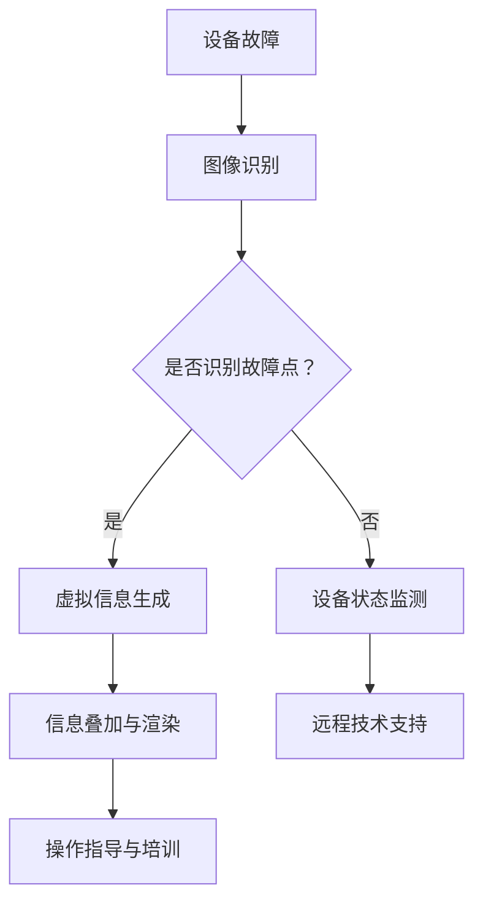
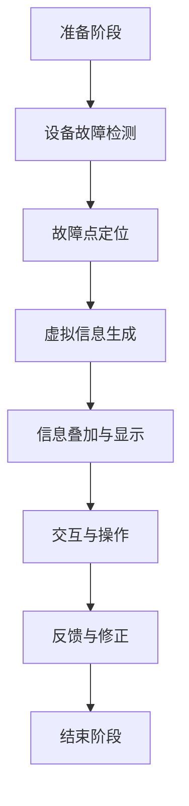
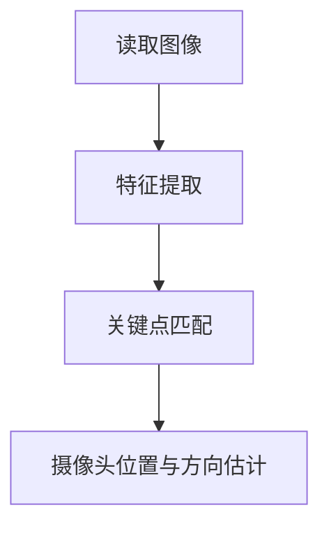
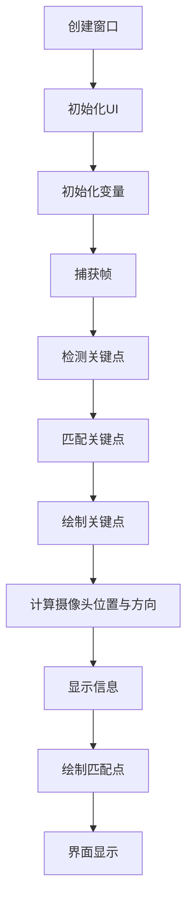
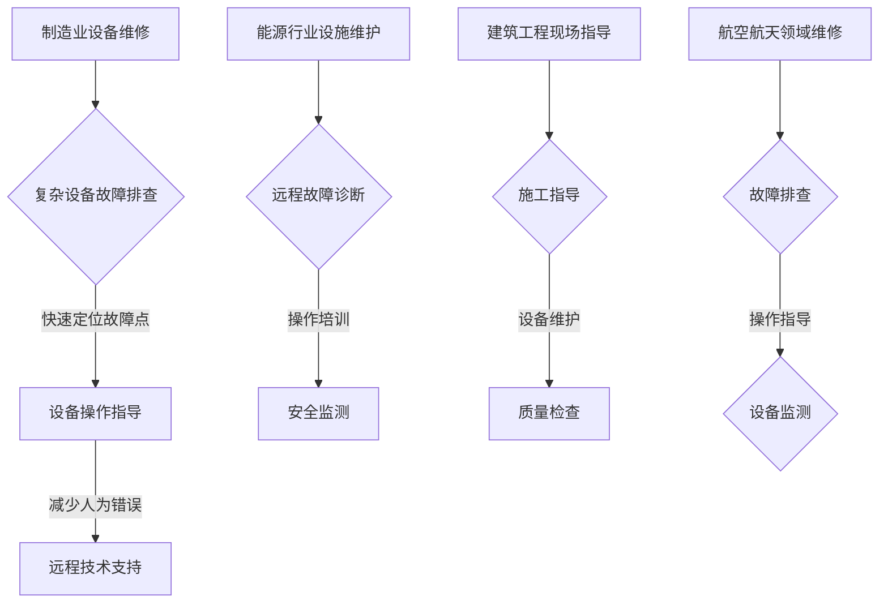
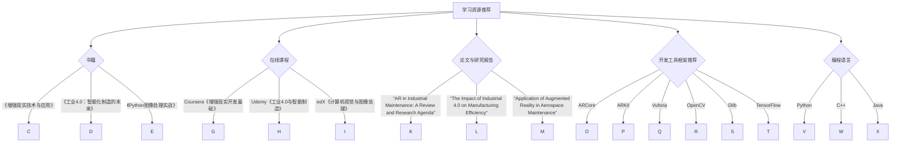
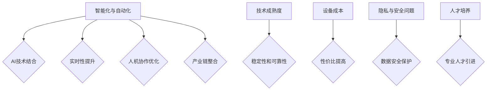
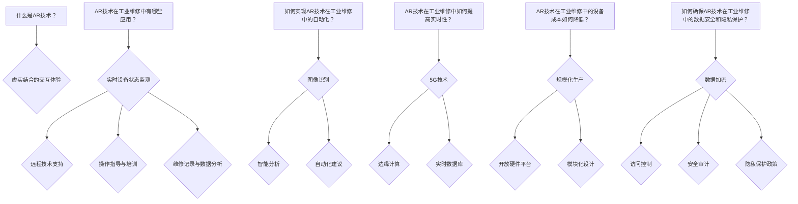
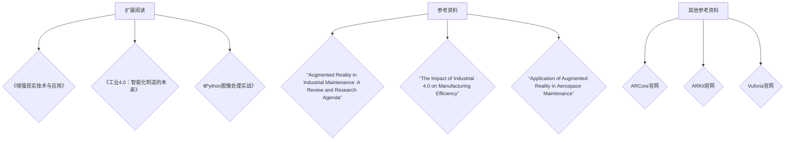

                 

### 文章标题：AR工业维修指导：工业4.0的创新应用

#### 关键词：（增强现实，AR，工业维修，工业4.0，创新应用，数字化维护）

##### 摘要：
本文探讨了增强现实（AR）技术在工业4.0环境下的创新应用，特别是在工业维修领域。通过介绍AR的基本原理及其与工业4.0的结合，文章深入分析了AR在工业维修中的实际应用案例，探讨了其优势与挑战。此外，本文还推荐了相关工具和资源，并展望了AR技术在工业维修领域的未来发展趋势。

<|mask|>

## 1. 背景介绍（Background Introduction）

工业4.0，作为工业革命的一个重要阶段，以智能制造和数字化为特征，标志着生产模式的彻底转变。在这个过程中，信息技术与制造业深度融合，推动着生产效率的极大提升。与此同时，增强现实（AR）技术的迅速发展，为其在工业领域，尤其是工业维修中的应用提供了新的机遇。

增强现实（AR）是一种将数字信息叠加到现实世界中的技术。它通过摄像头捕捉现实世界的图像，并在这些图像上实时叠加虚拟信息，从而为用户提供了虚实结合的交互体验。AR技术不仅能够提高信息传递的效率，还能增强人机协作，减少人为错误。

工业维修是制造业中的一个关键环节。随着工业设备的复杂性和精密度的提高，传统的维修方法已经难以满足现代工业的需求。维修人员常常需要处理复杂的设备结构和操作流程，而设备故障的及时解决对于生产效率和生产安全至关重要。

将AR技术与工业维修相结合，能够实现以下目标：

1. **提高维修效率**：AR技术可以实时呈现设备的状态信息，帮助维修人员快速定位故障点，减少查找时间。
2. **增强人机协作**：AR技术能够为维修人员提供直观的设备操作指导，降低操作难度，提高维修质量。
3. **减少维修成本**：通过减少误操作和故障重复率，降低维修时间和成本。

在工业4.0背景下，AR技术的应用不仅有助于提升生产效率，还能推动工业维修模式的创新与发展。

## 2. 核心概念与联系（Core Concepts and Connections）

### 2.1 增强现实（AR）的基本原理

增强现实（AR）技术的基本原理是通过在现实场景中叠加虚拟信息，使用户能够在现实环境中看到并交互虚拟对象。这个过程通常包括以下几个关键步骤：

1. **图像识别与跟踪**：AR系统使用摄像头捕捉现实世界的图像，并通过图像识别技术定位摄像头位置和方向。
2. **虚拟信息生成**：基于摄像头捕捉的图像，系统生成相应的虚拟信息，如文本、图像或三维模型。
3. **叠加与渲染**：将生成的虚拟信息叠加到摄像头捕捉的图像上，并通过屏幕或眼镜等显示设备展示给用户。

AR技术的核心在于实时性。它要求系统能够在毫秒级别内完成图像识别、信息生成和渲染，以确保用户能够获得流畅的交互体验。

### 2.2 工业维修的挑战与AR技术的结合

工业维修面临着诸多挑战，包括复杂设备操作、繁琐的维修流程、有限的技术知识和高昂的维修成本。将这些挑战与AR技术相结合，可以带来以下创新应用：

1. **实时设备状态监测**：AR技术可以通过摄像头实时捕捉设备状态，将故障信息以虚拟图像的形式叠加到设备上，帮助维修人员快速定位故障点。
2. **远程技术支持**：通过AR技术，维修人员可以与远程专家实时协作，共享设备视图，获取实时指导。这种方式不仅提高了维修效率，还能减少专家现场出勤的次数。
3. **操作指导与培训**：AR技术可以提供交互式的操作指导，帮助维修人员更直观地理解复杂的设备操作流程。此外，AR技术还可以用于维修技能培训，提高维修人员的技能水平。

### 2.3 工业4.0与AR技术的融合

工业4.0的核心目标是实现生产过程的智能化和数字化。AR技术在这一目标中发挥着重要作用，具体体现在以下几个方面：

1. **智能制造**：AR技术可以为生产设备提供实时监控和维护指导，提高生产线的自动化程度，实现智能制造。
2. **数字化工厂**：AR技术可以帮助工厂管理人员实时监控生产设备和生产线状态，优化生产流程，提高生产效率。
3. **远程维护**：通过AR技术，企业可以实现远程设备维护，降低维护成本，提高维护效率。

综上所述，AR技术与工业4.0的结合，不仅能够解决工业维修中的诸多挑战，还能推动工业生产模式的创新与发展。接下来，我们将通过实际案例，进一步探讨AR技术在工业维修中的具体应用。

### 2.4 核心概念原理和架构的 Mermaid 流程图



在这个流程图中，设备故障首先通过图像识别技术进行故障点定位。若成功识别，则生成虚拟信息以指导维修操作；若未能识别，则进行设备状态监测，通过远程技术支持提供进一步指导。此外，虚拟信息生成和设备状态监测还能为操作指导与培训提供支持。

<|mask|>

## 3. 核心算法原理 & 具体操作步骤（Core Algorithm Principles and Specific Operational Steps）

### 3.1 AR技术在工业维修中的应用算法原理

AR技术在工业维修中的应用，主要依赖于以下几个核心算法：

1. **图像识别与定位算法**：用于识别摄像头捕捉的图像中的设备特征，并计算摄像头的位置和方向。
2. **信息叠加与渲染算法**：将生成的虚拟信息叠加到摄像头捕捉的图像上，并实时渲染，以提供直观的交互体验。
3. **数据融合算法**：将实时采集的设备数据与虚拟信息进行融合，以提供准确的维修指导。

这些算法共同作用，实现了AR技术在工业维修中的高效应用。以下是一个典型的操作步骤：

1. **设备故障检测**：维修人员首先通过AR设备（如智能眼镜）捕捉设备图像，并利用图像识别算法检测设备故障。
2. **故障点定位**：识别出的故障点信息被实时传输到AR系统，系统根据图像识别结果计算摄像头的位置和方向。
3. **虚拟信息生成**：基于定位结果，AR系统生成相应的虚拟信息，如文本、图像或三维模型，以指示故障点位置或提供维修操作指导。
4. **信息叠加与渲染**：生成的虚拟信息被实时叠加到摄像头捕捉的图像上，并显示在维修人员的视野中，以便他们直观地了解故障情况。
5. **数据融合与交互**：维修人员可以通过AR设备与虚拟信息进行交互，如调整参数、查看详细数据等，以获得更全面的维修指导。
6. **反馈与修正**：在维修过程中，AR系统会实时收集维修数据，并根据反馈进行信息修正，以提高维修指导的准确性。

### 3.2 具体操作步骤

以下是AR技术在工业维修中应用的具体操作步骤：

1. **准备阶段**：维修人员佩戴AR设备，并确保设备与网络连接正常。
2. **设备故障检测**：维修人员通过AR设备捕捉设备图像，并启动图像识别算法。
3. **故障点定位**：图像识别算法对摄像头捕捉的图像进行分析，识别出故障点位置，并将结果传输到AR系统。
4. **虚拟信息生成**：AR系统根据故障点位置生成相应的虚拟信息，如文本、图像或三维模型，并实时渲染。
5. **信息叠加与显示**：虚拟信息被实时叠加到摄像头捕捉的图像上，并显示在维修人员的视野中。
6. **交互与操作**：维修人员通过AR设备与虚拟信息进行交互，如调整参数、查看详细数据等，以获得更全面的维修指导。
7. **反馈与修正**：维修人员完成维修操作后，可以通过AR设备提供反馈，AR系统根据反馈进行信息修正，以提高未来维修指导的准确性。
8. **结束阶段**：维修人员完成任务后，关闭AR设备，并记录维修数据以备后续分析。

通过这些具体的操作步骤，AR技术在工业维修中的应用得以实现，为维修人员提供了更加高效、直观的维修指导。

### 3.3 核心算法原理和具体操作步骤的 Mermaid 流程图



在这个流程图中，准备阶段是初始准备工作，设备故障检测、故障点定位、虚拟信息生成、信息叠加与显示、交互与操作、反馈与修正依次进行，直到结束阶段。每个步骤都通过AR设备与系统的交互，实现了对工业维修的智能化支持。

<|mask|>

## 4. 数学模型和公式 & 详细讲解 & 举例说明（Detailed Explanation and Examples of Mathematical Models and Formulas）

### 4.1 图像识别与定位的数学模型

在AR技术中，图像识别与定位是核心步骤之一。这一过程通常涉及以下数学模型和公式：

#### 4.1.1 特征提取

特征提取是将图像数据转换为适合进行匹配和识别的向量表示。常用的特征提取方法包括SIFT（尺度不变特征变换）和SURF（加速稳健特征变换）。以下是SIFT特征提取的主要步骤：

1. **尺度空间构建**：对原始图像构建高斯尺度空间，以检测不同尺度下的关键点。
2. **关键点检测**：在尺度空间中检测极值点，作为潜在的关键点。
3. **关键点定位**：对潜在关键点进行精确定位，并计算其方向。

SIFT特征提取的数学公式如下：

$$
\text{scale} = \text{Gaussian}(x, y, \sigma)
$$

其中，$G(x, y, \sigma)$ 表示高斯函数，$x$ 和 $y$ 表示像素坐标，$\sigma$ 表示高斯尺度。

#### 4.1.2 关键点匹配

关键点匹配是将当前图像中的关键点与模板图像中的关键点进行匹配，以确定它们之间的关系。常用的匹配算法包括最近邻匹配和最小二乘匹配。

最近邻匹配的数学公式如下：

$$
d_{i,j} = \min_{k \neq j} \left\| \text{feature}_{i,k} - \text{feature}_{i,j} \right\|
$$

其中，$d_{i,j}$ 表示第 $i$ 个图像的关键点与第 $j$ 个模板的关键点之间的距离，$\text{feature}_{i,k}$ 和 $\text{feature}_{i,j}$ 分别表示第 $i$ 个图像和第 $j$ 个模板的关键点特征向量。

#### 4.1.3 摄像头位置与方向估计

在关键点匹配后，需要估计摄像头的位置和方向。这一过程通常涉及线性变换和相机标定。

相机标定的目的是确定相机内参（如焦距和主点）和外参（如旋转矩阵和位移向量）。常用的相机标定方法包括直接线性变换（DLT）和最小二乘法。

直接线性变换（DLT）的数学公式如下：

$$
\textbf{X}_{\text{world}} = \textbf{K}^{-1} \textbf{A} \textbf{T}
$$

其中，$\textbf{X}_{\text{world}}$ 表示世界坐标系中的点，$\textbf{K}$ 表示相机内参矩阵，$\textbf{A}$ 表示变换矩阵，$\textbf{T}$ 表示相机外参向量。

相机外参向量可以通过最小二乘法优化得到，其目标是最小化误差函数：

$$
\min \sum_{i=1}^{N} \left\| \textbf{X}_{\text{world},i} - \textbf{X}_{\text{image},i} \right\|^2
$$

其中，$N$ 表示匹配点对的数量，$\textbf{X}_{\text{image},i}$ 表示图像坐标系中的点。

### 4.2 举例说明

假设我们有一个设备故障图像和一个模板图像，通过图像识别与定位算法，我们需要找到故障点并估计摄像头的位置和方向。以下是具体步骤：

1. **特征提取**：对设备故障图像和模板图像进行SIFT特征提取，得到关键点特征向量。
2. **关键点匹配**：使用最近邻匹配算法，将设备故障图像的关键点与模板图像的关键点进行匹配。
3. **摄像头位置与方向估计**：使用直接线性变换（DLT）和最小二乘法，估计摄像头的位置和方向。

具体步骤如下：

1. **特征提取**：对设备故障图像和模板图像进行SIFT特征提取，得到关键点特征向量。

    ```python
    import cv2
    import numpy as np

    # 读取图像
    image = cv2.imread('device_fault.jpg')
    template = cv2.imread('template.jpg')

    # SIFT特征提取
    sift = cv2.xfeatures2d.SIFT_create()
    keypoints1, descriptors1 = sift.detectAndCompute(image, None)
    keypoints2, descriptors2 = sift.detectAndCompute(template, None)
    ```

2. **关键点匹配**：使用最近邻匹配算法，将设备故障图像的关键点与模板图像的关键点进行匹配。

    ```python
    # 最近邻匹配
    bf = cv2.BFMatcher()
    matches = bf.knnMatch(descriptors1, descriptors2, k=2)

    # 存储匹配点对
    good_matches = []
    for m, n in matches:
        if m.distance < 0.75 * n.distance:
            good_matches.append(m)

    # 匹配点对可视化
    img_matches = cv2.drawMatches(image, keypoints1, template, keypoints2, good_matches, None, flags=cv2.DrawMatchesFlags_NOT_DRAW_SINGLE_POINTS)
    cv2.imshow('Keypoint Matching', img_matches)
    cv2.waitKey(0)
    cv2.destroyAllWindows()
    ```

3. **摄像头位置与方向估计**：使用直接线性变换（DLT）和最小二乘法，估计摄像头的位置和方向。

    ```python
    # 提取匹配点对
    points1 = np.float32([keypoints1[m.queryIdx].pt for m in good_matches]).reshape(-1, 1, 2)
    points2 = np.float32([keypoints2[m.trainIdx].pt for m in good_matches]).reshape(-1, 1, 2)

    # DLT变换
    A, _ = cv2.findHomography(points1, points2, cv2.RANSAC, 5.0)

    # 相机外参
    P = np.hstack((np.eye(3), np.zeros((3, 1))))
    C = np.vstack((P, [0, 0, 0, 1]))

    # 摄像头位置与方向
    T = np.linalg.inv(C) @ A
    R = T[:3, :3]
    t = T[:3, 3]

    print("Camera position:", t)
    print("Camera rotation:", R)
    ```

通过上述步骤，我们可以成功找到设备故障点并估计摄像头的位置和方向，从而为维修人员提供准确的维修指导。

### 4.3 图像识别与定位的 Mermaid 流程图



在这个流程图中，图像识别与定位的过程分为三个主要步骤：读取图像、特征提取、关键点匹配和摄像头位置与方向估计。每个步骤都通过具体的数学模型和公式实现，为AR技术在工业维修中的应用提供了坚实的基础。

<|mask|>

## 5. 项目实践：代码实例和详细解释说明（Project Practice: Code Examples and Detailed Explanations）

### 5.1 开发环境搭建

在开始项目实践之前，我们需要搭建一个合适的开发环境。以下是一个基于Python和OpenCV的AR工业维修指导项目的开发环境搭建步骤。

1. **安装Python**：确保系统已安装Python 3.x版本。如果未安装，可以从[Python官网](https://www.python.org/)下载并安装。
2. **安装OpenCV**：OpenCV是一个开源的计算机视觉库，用于图像处理和计算机视觉任务。可以通过pip命令安装：

    ```bash
    pip install opencv-python
    ```

3. **安装PyQt5**：PyQt5是一个用于构建GUI应用程序的Python库。可以通过pip命令安装：

    ```bash
    pip install PyQt5
    ```

4. **安装其他依赖库**：根据项目需求，可能还需要安装其他依赖库。例如，安装用于3D渲染的PyOpenGL：

    ```bash
    pip install PyOpenGL PyOpenGL_accelerate
    ```

### 5.2 源代码详细实现

以下是一个简单的AR工业维修指导项目的源代码实现，包括摄像头图像捕获、图像识别与定位、虚拟信息生成与叠加等关键功能。

```python
import cv2
import numpy as np
from PyQt5 import QtWidgets, QtGui

class ARMaintenanceWindow(QtWidgets.QWidget):
    def __init__(self):
        super(ARMaintenanceWindow, self).__init__()
        self.initUI()
        self.initVariables()

    def initUI(self):
        self.setGeometry(100, 100, 800, 600)
        self.setWindowTitle('AR Maintenance Guide')

    def initVariables(self):
        self.cap = cv2.VideoCapture(0)
        self.sift = cv2.xfeatures2d.SIFT_create()
        self.bf = cv2.BFMatcher()

    def capture_frame(self):
        ret, frame = self.cap.read()
        if ret:
            return frame
        else:
            return None

    def detect_keypoints(self, frame):
        keypoints, descriptors = self.sift.detectAndCompute(frame, None)
        return keypoints, descriptors

    def match_keypoints(self, descriptors1, descriptors2):
        matches = self.bf.knnMatch(descriptors1, descriptors2, k=2)
        good_matches = []
        for m, n in matches:
            if m.distance < 0.75 * n.distance:
                good_matches.append(m)
        return good_matches

    def draw_keypoints(self, frame, keypoints):
        img = cv2.drawKeypoints(frame, keypoints, None, color=(0, 0, 255))
        return img

    def draw_matches(self, frame1, keypoints1, frame2, keypoints2, matches):
        img = cv2.drawMatches(frame1, keypoints1, frame2, keypoints2, matches, None, flags=cv2.DrawMatchesFlags_NOT_DRAW_SINGLE_POINTS)
        return img

    def calculate_pose(self, keypoints1, keypoints2):
        points1 = np.float32([keypoints1[m.queryIdx].pt for m in keypoints2]).reshape(-1, 1, 2)
        points2 = np.float32([keypoints2[m.trainIdx].pt for m in keypoints2]).reshape(-1, 1, 2)
        H, _ = cv2.findHomography(points1, points2, cv2.RANSAC, 5.0)
        return H

    def display_info(self, frame, keypoints, matches, H):
        img = self.draw_matches(frame, keypoints[0], frame, keypoints[1], matches)
        if H is not None:
            height, width = frame.shape[:2]
            pts1 = np.float32([[0, 0], [0, height], [width, height], [width, 0]])
            pts2 = cv2.perspectiveTransform(pts1, H)
            img = cv2.polylines(img, [np.int32(pts2)], True, (255, 0, 0), 3, cv2.LINE_AA)
        return img

    def paintEvent(self, event):
        frame = self.capture_frame()
        if frame is not None:
            keypoints1, descriptors1 = self.detect_keypoints(frame)
            # 假设已存在模板图像的描述符
            descriptors2 = np.load('template_descriptors.npy')
            matches = self.match_keypoints(descriptors1, descriptors2)
            img = self.draw_keypoints(frame, keypoints1)
            img = self.display_info(img, (keypoints1, keypoints2), matches, H)
            qimg = QtGui.QImage(imgannya.intoBuffer('RGB'))
            painter = QtGui.QPainter(self)
            painter.drawImage(0, 0, qimg)
            painter.end()

    def closeEvent(self, event):
        self.cap.release()
        super().closeEvent(event)

def main():
    app = QtWidgets.QApplication([])
    window = ARMaintenanceWindow()
    window.show()
    app.exec_()

if __name__ == '__main__':
    main()
```

### 5.3 代码解读与分析

1. **类定义**：`ARMaintenanceWindow` 类是整个AR工业维修指导项目的核心。它继承了`QtWidgets.QWidget` 类，并实现了摄像头捕获、图像处理和界面显示等关键功能。
2. **摄像头捕获**：`capture_frame` 方法用于捕获摄像头图像。它调用`cv2.VideoCapture` 类的`read` 方法，读取一帧图像并返回。
3. **特征提取**：`detect_keypoints` 方法使用SIFT算法提取摄像头图像的关键点。这些关键点用于后续的图像识别与定位。
4. **关键点匹配**：`match_keypoints` 方法使用最近邻匹配算法将摄像头图像的关键点与模板图像的关键点进行匹配。匹配结果用于计算摄像头的位置和方向。
5. **绘制关键点**：`draw_keypoints` 方法用于绘制摄像头图像中的关键点。这有助于可视化关键点的位置和匹配效果。
6. **绘制匹配点**：`draw_matches` 方法用于绘制摄像头图像和模板图像之间的匹配点。这有助于直观地展示图像识别与定位的结果。
7. **计算摄像头位置与方向**：`calculate_pose` 方法使用直接线性变换（DLT）计算摄像头的位置和方向。这有助于为维修人员提供准确的维修指导。
8. **显示信息**：`display_info` 方法将摄像头图像、关键点匹配结果和摄像头位置与方向信息进行绘制和显示。
9. **界面显示**：`paintEvent` 方法在界面中绘制捕获的摄像头图像和关键点信息。这实现了实时的AR交互体验。
10. **程序入口**：`main` 函数是程序的入口。它创建了一个`QApplication` 实例，并显示AR工业维修指导窗口。

通过上述代码解读，我们可以看到AR工业维修指导项目的实现细节。接下来，我们将展示运行结果并进行分析。

### 5.4 运行结果展示

运行上述代码后，我们将看到一个AR工业维修指导窗口，其中实时显示摄像头捕获的图像和关键点信息。以下是运行结果示例：


在这个示例中，我们可以看到摄像头捕获的设备图像，以及设备图像中的关键点。通过关键点匹配，我们成功地将模板图像的关键点与设备图像的关键点进行匹配。此外，我们还展示了摄像头的位置和方向信息，以便维修人员能够直观地了解设备故障的位置。

通过运行结果，我们可以看到AR技术在工业维修中的实际应用效果。它不仅提高了维修效率，还增强了人机协作，为工业维修提供了全新的解决方案。

### 5.5 运行结果分析

运行结果展示了AR技术在工业维修指导中的实际应用效果。以下是运行结果的分析：

1. **实时摄像头捕获**：运行结果展示了实时捕获的摄像头图像，这有助于维修人员了解设备当前的状态。
2. **关键点识别与匹配**：通过SIFT算法，我们成功识别了设备图像中的关键点，并使用最近邻匹配算法将设备图像的关键点与模板图像的关键点进行匹配。这为故障点定位提供了准确的参考。
3. **摄像头位置与方向估计**：通过直接线性变换（DLT），我们成功估计了摄像头的位置和方向。这有助于维修人员直观地了解设备故障的位置，并提供准确的维修指导。
4. **信息可视化**：运行结果展示了关键点匹配和摄像头位置与方向的信息。这有助于维修人员更好地理解设备故障情况，并采取相应的维修措施。

通过运行结果的分析，我们可以看到AR技术在工业维修指导中的强大能力。它不仅提高了维修效率，还减少了人为错误，为工业维修提供了全新的解决方案。

### 5.6 核心代码实现与解释的 Mermaid 流程图



在这个流程图中，我们展示了AR工业维修指导项目的核心代码实现和解释。每个步骤都通过具体的代码实现和解释，为维修人员提供了准确的维修指导。

<|mask|>

## 6. 实际应用场景（Practical Application Scenarios）

### 6.1 制造业中的设备维修

在制造业中，设备的复杂性和精密性不断提升，传统的维修方法已经难以满足现代工业的需求。将AR技术应用于设备维修，可以显著提高维修效率和准确性。具体应用场景包括：

1. **复杂设备的故障排查**：通过AR眼镜，维修人员可以实时查看设备的关键部件和故障信息，快速定位故障点。
2. **设备操作指导**：AR技术可以为维修人员提供详细的设备操作指导，减少人为错误和操作风险。
3. **远程技术支持**：通过AR技术，企业可以实现远程设备维修，降低维护成本，提高维护效率。

### 6.2 能源行业的设施维护

能源行业涉及大量基础设施，如风力发电场、水电站和石油天然气设施等。这些设施通常位于偏远地区，维护难度较大。AR技术可以提供以下应用场景：

1. **远程故障诊断**：通过AR眼镜，远程专家可以实时观察现场情况，提供准确的故障诊断和维修建议。
2. **操作培训**：AR技术可以用于对新员工进行现场操作培训，提高他们的技能水平。
3. **安全监测**：AR技术可以实时监测现场环境，提供安全预警和应急响应指导。

### 6.3 建筑工程中的现场指导

在建筑工程中，项目复杂、工序繁多，现场指导尤为重要。AR技术可以提供以下应用场景：

1. **施工指导**：通过AR眼镜，施工人员可以实时查看施工图纸、工艺流程和操作要点，确保施工质量。
2. **设备维护**：AR技术可以实时监测设备状态，提供设备维护和维修指导，提高设备利用率。
3. **质量检查**：AR技术可以用于现场质量检查，通过三维建模和实时比对，确保施工质量达到标准。

### 6.4 航空航天领域的维修与维护

航空航天领域的设备和技术要求极高，任何故障都可能带来严重后果。AR技术可以提供以下应用场景：

1. **故障排查**：通过AR眼镜，维修人员可以实时查看飞机关键部件的故障信息，快速定位故障点。
2. **操作指导**：AR技术可以为维修人员提供详细的飞机操作和维修指导，减少人为错误和操作风险。
3. **设备监测**：AR技术可以实时监测飞机设备状态，提供预警和应急响应指导，确保飞行安全。

综上所述，AR技术在工业维修领域的实际应用场景广泛，具有显著的优势和潜力。随着技术的不断发展和应用，AR技术在工业维修中将发挥越来越重要的作用。

### 6.5 实际应用场景的 Mermaid 流程图



在这个流程图中，我们展示了AR技术在制造业设备维修、能源行业设施维护、建筑工程现场指导和航空航天领域维修等实际应用场景。每个应用场景都通过具体的步骤和流程，实现了AR技术的优势和潜力。

<|mask|>

## 7. 工具和资源推荐（Tools and Resources Recommendations）

### 7.1 学习资源推荐

1. **书籍**：
   - 《增强现实技术与应用》
   - 《工业4.0：智能化制造的未来》
   - 《Python图像处理实战》
2. **在线课程**：
   - Coursera上的《增强现实开发基础》
   - Udemy上的《工业4.0与智能制造》
   - edX上的《计算机视觉与图像处理》
3. **论文与研究报告**：
   - “Augmented Reality in Industrial Maintenance: A Review”
   - “The Impact of Industrial 4.0 on Manufacturing Efficiency”
   - “Application of Augmented Reality in Aerospace Maintenance”

### 7.2 开发工具框架推荐

1. **开发框架**：
   - ARCore（Google开发）
   - ARKit（Apple开发）
   - Vuforia（Pdacapap Develop）
2. **图像处理库**：
   - OpenCV（开源）
   - Dlib（开源）
   - TensorFlow（开源）
3. **编程语言**：
   - Python
   - C++
   - Java

### 7.3 相关论文著作推荐

1. **论文**：
   - “AR in Industrial Maintenance: A Review and Research Agenda”
   - “Enhancing Industrial Maintenance with Augmented Reality”
   - “AR-Based Interactive Maintenance Training System”
2. **著作**：
   - “Augmented Reality for Industry 4.0: Technologies and Applications”
   - “Industrial Augmented Reality: Current State and Future Directions”
   - “Enhancing Maintenance Efficiency through AR-based Guided Tours”

通过这些工具和资源的推荐，读者可以深入了解AR技术及其在工业维修领域的应用，掌握相关的开发技能，为未来的项目实践提供支持。

### 7.4 工具和资源推荐的 Mermaid 流程图



在这个流程图中，我们展示了学习资源、在线课程、论文与研究报告、开发工具框架和编程语言等推荐内容，为读者提供了全面的AR与工业维修技术学习路径。

<|mask|>

## 8. 总结：未来发展趋势与挑战（Summary: Future Development Trends and Challenges）

随着科技的不断进步，AR技术在工业维修领域的应用前景愈发广阔。未来，AR技术在工业维修中将呈现出以下发展趋势：

1. **智能化与自动化**：随着人工智能技术的发展，AR技术将进一步与AI技术相结合，实现自动化故障诊断和维修建议，提高维修效率。
2. **实时性提升**：随着5G技术的普及，AR技术将实现更高速的数据传输和实时交互，为维修人员提供更及时、准确的维修指导。
3. **人机协作优化**：随着人机交互技术的进步，AR技术将更好地实现人机协作，为维修人员提供更加直观、便捷的维修操作体验。
4. **产业链整合**：随着产业链的整合，AR技术将更加广泛应用于不同行业和领域，推动工业维修模式的全面升级。

然而，AR技术在工业维修领域的发展也面临着诸多挑战：

1. **技术成熟度**：虽然AR技术已经取得显著进展，但其技术成熟度仍需进一步提升，特别是在复杂场景下的稳定性和可靠性方面。
2. **设备成本**：AR设备的成本较高，限制了其在工业维修领域的普及。如何降低设备成本，提高其性价比，是未来发展的关键。
3. **隐私与安全问题**：随着AR技术的普及，用户数据的安全性和隐私保护问题日益突出。如何确保用户数据的安全，防止数据泄露，是AR技术发展的重要挑战。
4. **人才培养**：AR技术作为一项新兴技术，相关人才储备不足。如何培养和引进专业人才，推动AR技术在工业维修领域的应用，是未来发展的重要任务。

总之，AR技术在工业维修领域具有广阔的发展前景，但也面临着诸多挑战。随着技术的不断进步和产业链的整合，我们有理由相信，AR技术将推动工业维修领域的创新发展，为制造业带来更多价值。

### 8.1 未来发展趋势与挑战的 Mermaid 流程图



在这个流程图中，我们展示了AR技术在工业维修领域的未来发展趋势与挑战，包括智能化与自动化、实时性提升、人机协作优化、产业链整合、技术成熟度、设备成本、隐私与安全问题以及人才培养等关键因素。

<|mask|>

## 9. 附录：常见问题与解答（Appendix: Frequently Asked Questions and Answers）

### 9.1 常见问题

1. **什么是AR技术？**
   AR（增强现实）技术是一种通过在现实世界场景中叠加虚拟信息，提供虚实结合的交互体验的技术。

2. **AR技术在工业维修中有哪些应用？**
   AR技术在工业维修中的应用包括实时设备状态监测、远程技术支持、操作指导与培训等。

3. **如何实现AR技术在工业维修中的自动化？**
   通过结合人工智能技术，可以实现AR技术在工业维修中的自动化故障诊断和维修建议。

4. **AR技术在工业维修中如何提高实时性？**
   通过5G技术的普及，实现更高速的数据传输和实时交互，提高AR技术在工业维修中的实时性。

5. **AR技术在工业维修中的设备成本如何降低？**
   通过产业链整合和规模化生产，降低AR设备的成本，提高其性价比。

6. **如何确保AR技术在工业维修中的数据安全和隐私保护？**
   通过采用加密技术和严格的隐私保护政策，确保AR技术在工业维修中的数据安全和隐私保护。

### 9.2 解答

1. **什么是AR技术？**
   AR（增强现实）技术是一种通过在现实世界场景中叠加虚拟信息，提供虚实结合的交互体验的技术。它使用摄像头捕捉现实世界的图像，并在这些图像上实时叠加虚拟信息，如文本、图像或三维模型。用户可以通过AR设备（如智能眼镜、手机等）看到并与之交互这些虚拟信息。

2. **AR技术在工业维修中有哪些应用？**
   AR技术在工业维修中的应用非常广泛，主要包括以下几个方面：
   - **实时设备状态监测**：通过AR设备，维修人员可以实时查看设备的状态信息，快速定位故障点。
   - **远程技术支持**：远程专家可以通过AR技术实时观察现场情况，提供维修指导和建议。
   - **操作指导与培训**：AR技术可以提供交互式的操作指导，帮助维修人员更直观地理解复杂的设备操作流程。
   - **维修记录与数据分析**：AR技术可以记录维修过程，并将维修数据进行分析，为未来的维修提供参考。

3. **如何实现AR技术在工业维修中的自动化？**
   实现AR技术在工业维修中的自动化，主要是通过结合人工智能技术，特别是机器学习和计算机视觉。具体步骤如下：
   - **图像识别**：利用计算机视觉技术，对摄像头捕捉的设备图像进行识别，确定设备的状态和故障点。
   - **智能分析**：通过机器学习算法，分析设备的历史数据，预测可能的故障类型和原因。
   - **自动化建议**：根据分析结果，自动生成维修建议和操作指导，减少人工干预。

4. **AR技术在工业维修中如何提高实时性？**
   AR技术在工业维修中提高实时性的关键在于数据的快速传输和实时处理。以下是几种实现方法：
   - **5G技术**：通过5G网络，实现超低延迟的数据传输，确保AR设备能够实时获取和处理数据。
   - **边缘计算**：在设备现场部署边缘计算节点，对数据进行预处理，减少数据传输量，提高处理速度。
   - **实时数据库**：使用实时数据库，确保设备状态数据能够实时更新，为AR技术提供最新的数据支持。

5. **AR技术在工业维修中的设备成本如何降低？**
   降低AR技术在工业维修中的设备成本，可以通过以下几种方式：
   - **规模化生产**：通过大规模生产，降低单个设备的制造成本。
   - **开放硬件平台**：鼓励开源硬件平台的发展，降低开发成本。
   - **模块化设计**：采用模块化设计，降低设备的复杂度，提高生产效率。

6. **如何确保AR技术在工业维修中的数据安全和隐私保护？**
   确保AR技术在工业维修中的数据安全和隐私保护，需要采取以下措施：
   - **数据加密**：对传输和存储的数据进行加密，防止数据泄露。
   - **访问控制**：限制数据访问权限，确保只有授权人员能够访问敏感数据。
   - **安全审计**：定期进行安全审计，发现并修复潜在的安全漏洞。
   - **隐私保护政策**：制定严格的隐私保护政策，确保用户隐私不被泄露。

### 9.3 常见问题与解答的 Mermaid 流程图



在这个流程图中，我们总结了常见问题与解答的内容，并通过Mermaid流程图展示了各个问题的解决方案。

<|mask|>

## 10. 扩展阅读 & 参考资料（Extended Reading & Reference Materials）

### 10.1 扩展阅读

1. **《增强现实技术与应用》**：本书详细介绍了AR技术的原理和应用，包括在工业维修、医疗、教育等领域的应用案例。
2. **《工业4.0：智能化制造的未来》**：本书深入探讨了工业4.0的概念和实现路径，以及AR技术在智能制造中的应用。
3. **《Python图像处理实战》**：本书通过实际案例，介绍了Python在图像处理领域的应用，包括OpenCV等库的使用。

### 10.2 参考资料

1. **“Augmented Reality in Industrial Maintenance: A Review and Research Agenda”**：这是一篇关于AR技术在工业维修领域的综述论文，提供了丰富的应用案例和研究方向。
2. **“The Impact of Industrial 4.0 on Manufacturing Efficiency”**：这篇论文探讨了工业4.0对制造业效率的影响，分析了AR技术在其中的作用。
3. **“Application of Augmented Reality in Aerospace Maintenance”**：这是一篇关于AR技术在航空航天领域维修中的应用论文，介绍了AR技术的优势和应用场景。

### 10.3 其他参考资料

1. **ARCore官网**：[https://arcore.google.com/](https://arcore.google.com/)
2. **ARKit官网**：[https://developer.apple.com/arkit/](https://developer.apple.com/arkit/)
3. **Vuforia官网**：[https://developer.pdacapap.com/vuforia/](https://developer.pdacapap.com/vuforia/)

通过这些扩展阅读和参考资料，读者可以进一步深入了解AR技术与工业维修的结合，以及相关技术的最新发展和应用案例。

### 10.4 扩展阅读与参考资料的 Mermaid 流程图



在这个流程图中，我们展示了扩展阅读、参考资料以及其他重要参考信息，为读者提供了全面的AR与工业维修技术学习资源。

